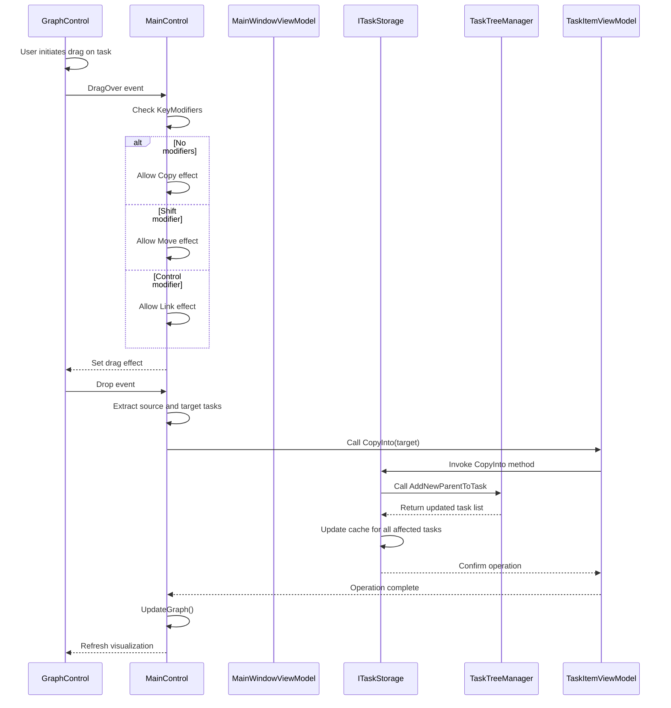
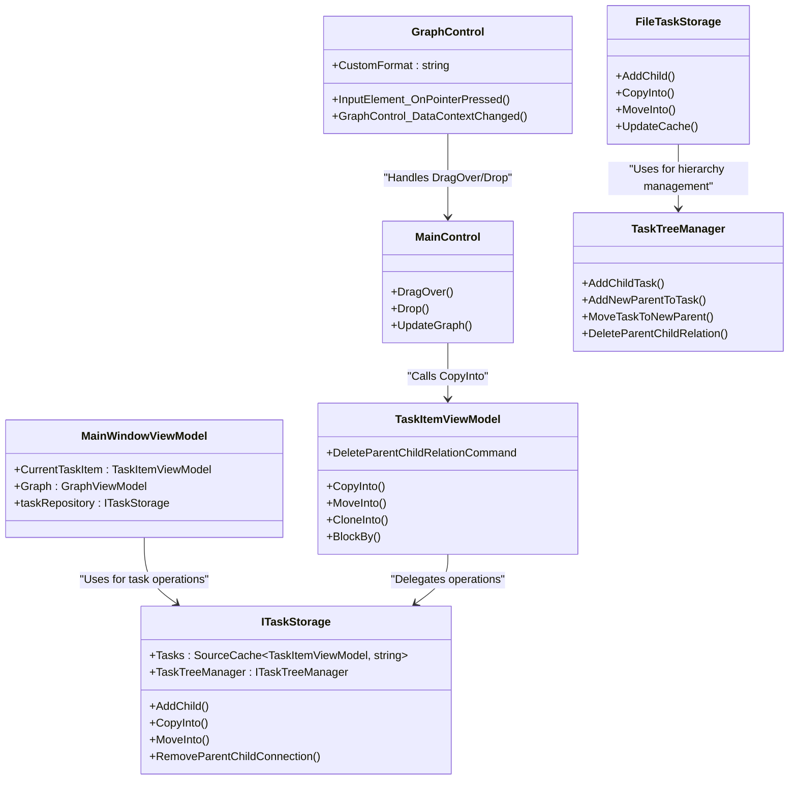
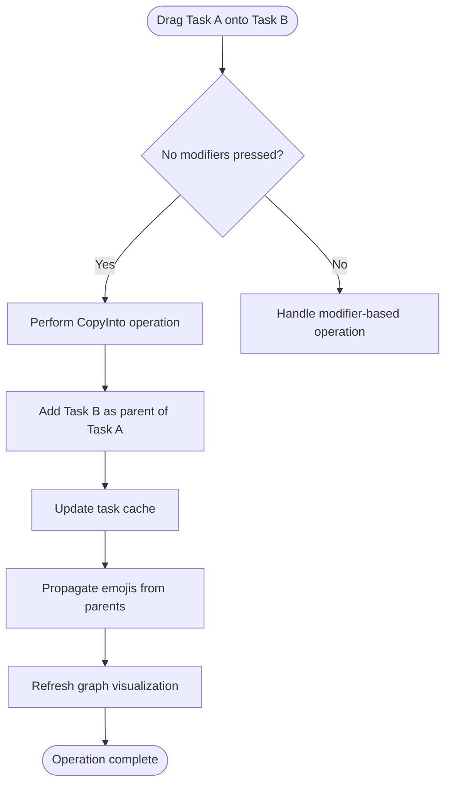

# Default Move Operation

<cite>
**Referenced Files in This Document**   
- [GraphControl.axaml.cs](file://src/Unlimotion/Views/GraphControl.axaml.cs)
- [MainControl.axaml.cs](file://src/Unlimotion/Views/MainControl.axaml.cs)
- [MainWindowViewModel.cs](file://src/Unlimotion.ViewModel/MainWindowViewModel.cs)
- [ITaskStorage.cs](file://src/Unlimotion.ViewModel/ITaskStorage.cs)
- [FileTaskStorage.cs](file://src/Unlimotion/FileTaskStorage.cs)
- [TaskItemViewModel.cs](file://src/Unlimotion.ViewModel/TaskItemViewModel.cs)
</cite>

## Table of Contents
1. [Introduction](#introduction)
2. [Drag-and-Drop Implementation Overview](#drag-and-drop-implementation-overview)
3. [Default Move Operation Flow](#default-move-operation-flow)
4. [Core Components and Interactions](#core-components-and-interactions)
5. [User Experience Considerations](#user-experience-considerations)
6. [Task Inheritance and Emoji Propagation](#task-inheritance-and-emoji-propagation)
7. [Comparison with Modifier-Based Operations](#comparison-with-modifier-based-operations)
8. [Conclusion](#conclusion)

## Introduction
The default drag-and-drop operation in Unlimotion enables users to organize tasks by creating parent-child relationships through intuitive gestures. When a user drags a task onto another task without using any keyboard modifiers, the system interprets this action as a request to make the dragged task a child of the target task. This operation is implemented through a coordinated interaction between the UI layer (GraphControl and MainControl) and the ViewModel layer (MainWindowViewModel), which orchestrates the hierarchy changes via the ITaskStorage interface. This document details the implementation, behavior, and user experience aspects of this fundamental task organization feature.

## Drag-and-Drop Implementation Overview

**Diagram sources**
- [GraphControl.axaml.cs](file://src/Unlimotion/Views/GraphControl.axaml.cs#L150-L180)
- [MainControl.axaml.cs](file://src/Unlimotion/Views/MainControl.axaml.cs#L100-L250)
- [TaskItemViewModel.cs](file://src/Unlimotion.ViewModel/TaskItemViewModel.cs#L650-L670)
- [FileTaskStorage.cs](file://src/Unlimotion/FileTaskStorage.cs#L350-L370)

**Section sources**
- [GraphControl.axaml.cs](file://src/Unlimotion/Views/GraphControl.axaml.cs#L150-L180)
- [MainControl.axaml.cs](file://src/Unlimotion/Views/MainControl.axaml.cs#L100-L250)

## Default Move Operation Flow
The default drag-and-drop operation without modifier keys follows a specific sequence of events that results in the creation of a parent-child relationship between tasks. When a user drags a task (source task) and drops it onto another task (target task) without pressing any keyboard modifiers, the system performs a "copy into" operation rather than a move. This means the source task becomes a child of the target task while maintaining any existing parent relationships, effectively creating a multi-parent task.

The operation begins in the GraphControl, which initiates the drag operation and sets the data format to "application/xxx-unlimotion-task-item". When the drag enters the MainControl area, the DragOver event handler checks for keyboard modifiers. In the absence of any modifiers, the handler allows the Copy drag effect, indicating that a copy operation will occur upon drop.

When the user releases the mouse button, the Drop event handler in MainControl processes the operation. It extracts both the source task (the dragged task) and the target task (the drop target) from the drag data. Since no modifiers are present, the handler invokes the CopyInto method on the source task, passing the target task as the destination. This method call ultimately results in the AddNewParentToTask operation in the TaskTreeManager, which updates the task hierarchy by adding the target task as a parent to the source task.

After the operation completes, the UI is refreshed by toggling the UpdateGraph property in the GraphViewModel, which triggers a complete rebuild of the visual graph representation to reflect the new parent-child relationship.

**Section sources**
- [MainControl.axaml.cs](file://src/Unlimotion/Views/MainControl.axaml.cs#L180-L250)
- [TaskItemViewModel.cs](file://src/Unlimotion.ViewModel/TaskItemViewModel.cs#L650-L670)
- [FileTaskStorage.cs](file://src/Unlimotion/FileTaskStorage.cs#L350-L370)

## Core Components and Interactions
The default move operation involves several core components that work together to create and maintain task hierarchies. The primary interaction occurs between the UI controls, the MainWindowViewModel, and the ITaskStorage implementation, with the TaskTreeManager serving as the underlying engine for hierarchy management.

The GraphControl serves as the entry point for drag operations, capturing pointer events and initiating the drag process with the appropriate data format. The MainControl acts as the central handler for drag-and-drop events, determining the operation type based on keyboard modifiers and coordinating the appropriate action.

The MainWindowViewModel provides the overall application state and serves as a coordinator between UI components and data storage. While it doesn't directly handle the default move operation, it maintains the CurrentTaskItem property that can influence which task is being manipulated.

The ITaskStorage interface defines the contract for task hierarchy operations, including the AddChild method that is conceptually related to the parenting operation. However, for the default drag-and-drop without modifiers, the CopyInto method is used instead, which calls AddNewParentToTask in the TaskTreeManager rather than AddChild. This distinction is important because AddChild would remove existing parent relationships, while CopyInto preserves them, allowing for multi-parent tasks.

The FileTaskStorage implementation executes the actual hierarchy changes by updating the task relationships in the underlying data model and persisting these changes to storage. It also ensures that all affected tasks are properly updated in the cache and that the UI is notified of changes.

**Diagram sources**
- [GraphControl.axaml.cs](file://src/Unlimotion/Views/GraphControl.axaml.cs)
- [MainControl.axaml.cs](file://src/Unlimotion/Views/MainControl.axaml.cs)
- [MainWindowViewModel.cs](file://src/Unlimotion.ViewModel/MainWindowViewModel.cs)
- [ITaskStorage.cs](file://src/Unlimotion.ViewModel/ITaskStorage.cs)
- [TaskItemViewModel.cs](file://src/Unlimotion.ViewModel/TaskItemViewModel.cs)
- [FileTaskStorage.cs](file://src/Unlimotion/FileTaskStorage.cs)

**Section sources**
- [ITaskStorage.cs](file://src/Unlimotion.ViewModel/ITaskStorage.cs#L15-L45)
- [FileTaskStorage.cs](file://src/Unlimotion/FileTaskStorage.cs#L300-L400)
- [TaskItemViewModel.cs](file://src/Unlimotion.ViewModel/TaskItemViewModel.cs#L650-L670)

## User Experience Considerations
The default drag-and-drop operation provides several user experience features that enhance usability and provide clear feedback during task organization. Visual feedback is provided through the cursor icon, which changes to indicate the copy operation when no modifiers are used. This visual cue helps users understand that they are creating a parent-child relationship rather than moving the task exclusively.

When attaching a task to a new parent, the system preserves existing parent relationships, allowing for flexible task organization. This means a task can belong to multiple parent tasks simultaneously, which supports complex project structures where tasks may be relevant to multiple contexts or categories. Users can create these multi-parent relationships simply by dragging a task onto different parent tasks without using modifier keys.

The operation handles edge cases gracefully. If a task already has the target task as a parent, attempting to create the relationship again has no effect, preventing duplicate parent entries. The system also validates that the source and target tasks are valid before proceeding with the operation, ensuring data integrity.

After the operation completes, the graph visualization is automatically refreshed to reflect the new hierarchy. This immediate visual feedback helps users confirm that their action was successful and understand the updated task structure. The refresh occurs through the UpdateGraph property in the GraphViewModel, which triggers a complete rebuild of the graph layout.

**Section sources**
- [MainControl.axaml.cs](file://src/Unlimotion/Views/MainControl.axaml.cs#L100-L250)
- [GraphControl.axaml.cs](file://src/Unlimotion/Views/GraphControl.axaml.cs#L200-L220)
- [FileTaskStorage.cs](file://src/Unlimotion/FileTaskStorage.cs#L350-L370)

## Task Inheritance and Emoji Propagation
The default move operation impacts task inheritance properties, particularly regarding emoji propagation in the user interface. When a task becomes a child of another task, it inherits the parent's emoji in the visual representation, which helps users quickly identify task relationships and categories.

The emoji inheritance is implemented through the GetAllEmoji property in the TaskItemViewModel class, which collects emojis from all parent tasks and concatenates them. This property is updated whenever the parent relationships change, ensuring that the visual representation remains consistent with the current hierarchy. The GetAllEmoji property uses a breadth-first traversal of the parent hierarchy, ordered by task title, to ensure consistent emoji ordering.

This inheritance mechanism supports the visual organization of tasks by allowing users to create thematic groupings through emoji usage. For example, a user might create a parent task with a specific emoji (e.g., 📅 for time-related tasks) and then add multiple child tasks that automatically inherit this emoji, creating a visually cohesive group.

The emoji propagation occurs automatically as a result of the parent-child relationship created by the default move operation. No additional user action is required to enable this inheritance, making it a seamless part of the task organization workflow. The system updates the emoji display immediately after the drag-and-drop operation completes, providing instant visual feedback on the new relationship.

**Diagram sources**
- [TaskItemViewModel.cs](file://src/Unlimotion.ViewModel/TaskItemViewModel.cs#L700-L750)
- [FileTaskStorage.cs](file://src/Unlimotion/FileTaskStorage.cs#L350-L370)
- [MainControl.axaml.cs](file://src/Unlimotion/Views/MainControl.axaml.cs#L200-L250)

**Section sources**
- [TaskItemViewModel.cs](file://src/Unlimotion.ViewModel/TaskItemViewModel.cs#L700-L750)

## Comparison with Modifier-Based Operations
The default move operation (without modifiers) differs significantly from modifier-based drag-and-drop operations in both behavior and use case. Understanding these differences helps users choose the appropriate method for their task organization needs.

When no modifiers are used, the operation performs a "copy into" action, making the dragged task a child of the target task while preserving existing parent relationships. This creates a multi-parent task that can appear in multiple contexts simultaneously. This operation is ideal for organizing tasks that belong to multiple categories or projects.

In contrast, when the Shift key is held during the drag operation, the system performs a "move into" action, which removes the task from its current parent(s) and makes it exclusively a child of the target task. This operation is useful when reorganizing tasks within a single hierarchy or when a task should only belong to one parent.

When the Control key is held, the operation creates a blocking relationship rather than a parent-child relationship. If Control is used with the dragged task as the blocker, it creates a "blocks" relationship; if Alt is used, it creates a "blocked by" relationship. These operations are used to establish task dependencies rather than hierarchical organization.

The visual feedback differs between these operations, with the cursor icon indicating the type of operation that will occur. The default operation shows a copy cursor, the Shift operation shows a move cursor, and the Control operation shows a link cursor. This immediate visual feedback helps users understand the consequences of their actions before completing the drop.

**Section sources**
- [MainControl.axaml.cs](file://src/Unlimotion/Views/MainControl.axaml.cs#L100-L250)
- [TaskItemViewModel.cs](file://src/Unlimotion.ViewModel/TaskItemViewModel.cs#L650-L690)

## Conclusion
The default drag-and-drop operation in Unlimotion provides a simple and intuitive way to create parent-child relationships between tasks without requiring keyboard modifiers. By performing a "copy into" operation, it enables flexible task organization with support for multi-parent tasks, allowing users to create rich hierarchical structures that reflect complex project relationships. The operation is seamlessly integrated with visual feedback mechanisms, including emoji inheritance, that help users understand and navigate the task hierarchy. Understanding the differences between this default operation and modifier-based alternatives allows users to choose the most appropriate method for their specific organizational needs, whether creating multi-context tasks, reorganizing within a single hierarchy, or establishing task dependencies.