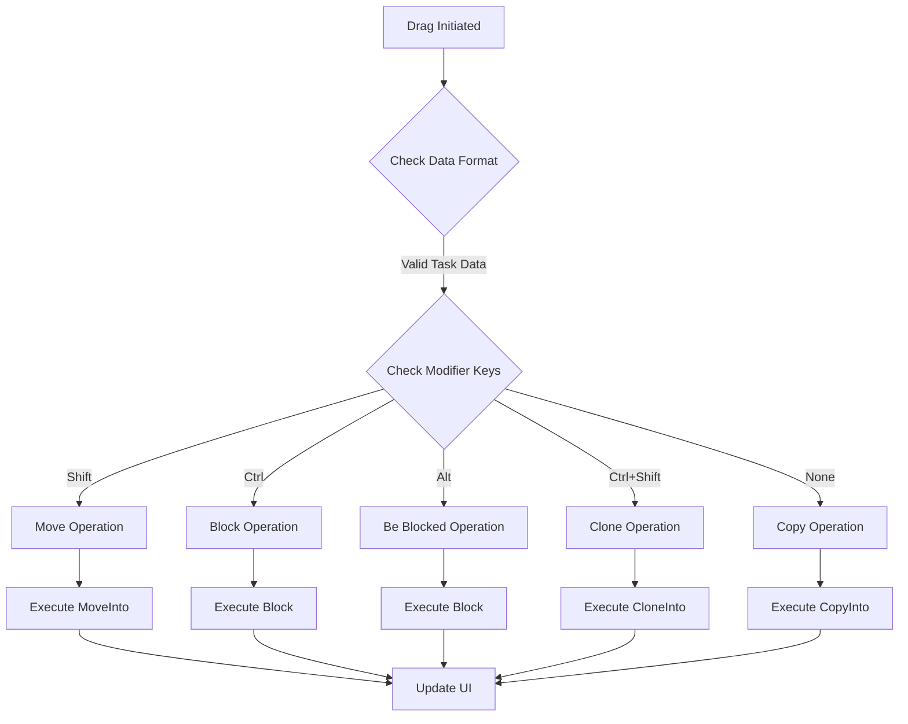
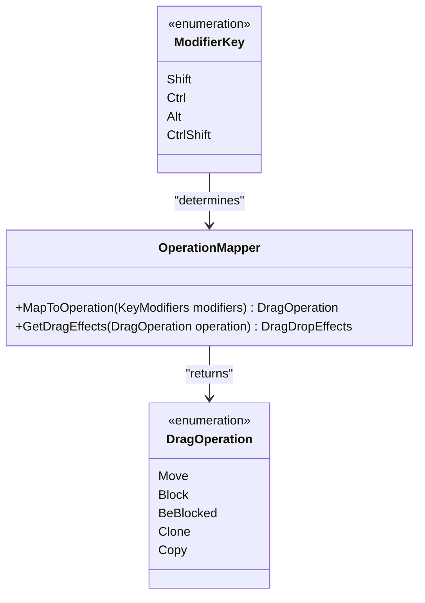
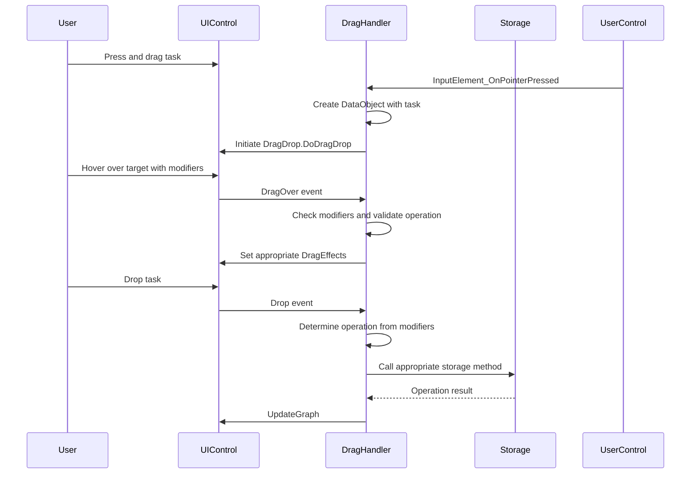
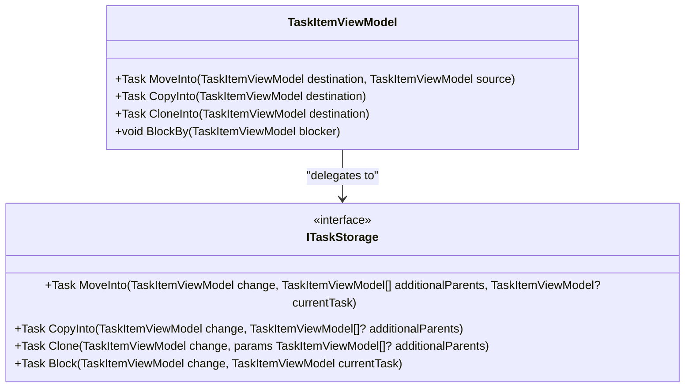

# Drag and Drop Operations

<cite>
**Referenced Files in This Document**   
- [MainControl.axaml.cs](file://src/Unlimotion/Views/MainControl.axaml.cs)
- [GraphControl.axaml.cs](file://src/Unlimotion/Views/GraphControl.axaml.cs)
- [TaskItemViewModel.cs](file://src/Unlimotion.ViewModel/TaskItemViewModel.cs)
- [ITaskStorage.cs](file://src/Unlimotion.ViewModel/ITaskStorage.cs)
</cite>

## Table of Contents
1. [Introduction](#introduction)
2. [Drag and Drop Implementation](#drag-and-drop-implementation)
3. [Modifier Key Operations](#modifier-key-operations)
4. [UI Event Handling](#ui-event-handling)
5. [Storage Operations](#storage-operations)
6. [Asynchronous Operation Execution](#asynchronous-operation-execution)
7. [Visual Feedback and UI Updates](#visual-feedback-and-ui-updates)
8. [Multi-Parent Task Handling](#multi-parent-task-handling)
9. [Conflict Resolution in Cloning](#conflict-resolution-in-cloning)
10. [Best Practices for Users](#best-practices-for-users)

## Introduction
Unlimotion implements a comprehensive drag-and-drop system that allows users to manipulate tasks through intuitive mouse interactions combined with keyboard modifiers. This system enables various operations including moving, blocking, and cloning tasks through specific modifier key combinations. The implementation captures mouse events at the UI level and translates them into appropriate storage operations through the ITaskStorage interface. This document details the technical implementation of these drag-and-drop operations, focusing on how different modifier keys trigger distinct behaviors and how these operations are executed asynchronously through the storage layer.

**Section sources**
- [MainControl.axaml.cs](file://src/Unlimotion/Views/MainControl.axaml.cs#L1-L311)
- [TaskItemViewModel.cs](file://src/Unlimotion.ViewModel/TaskItemViewModel.cs#L1-L757)

## Drag and Drop Implementation
The drag-and-drop functionality in Unlimotion is implemented through event handlers in the MainControl and GraphControl classes, which manage the drag-over and drop events. When a drag operation begins, the system captures the task data and determines the appropriate operation based on keyboard modifiers. The implementation uses Avalonia's drag-and-drop API to handle these interactions, with custom data formats to identify Unlimotion tasks during the drag operation.

**Diagram sources**
- [MainControl.axaml.cs](file://src/Unlimotion/Views/MainControl.axaml.cs#L1-L311)
- [ITaskStorage.cs](file://src/Unlimotion.ViewModel/ITaskStorage.cs#L1-L34)

**Section sources**
- [MainControl.axaml.cs](file://src/Unlimotion/Views/MainControl.axaml.cs#L1-L311)
- [GraphControl.axaml.cs](file://src/Unlimotion/Views/GraphControl.axaml.cs#L1-L229)

## Modifier Key Operations
Unlimotion supports different drag operations based on keyboard modifier keys, allowing users to perform various actions with the same drag gesture by combining it with different key combinations. The system recognizes four primary modifier combinations:

- **Shift**: Move operation - relocates the dragged task into the target task
- **Ctrl**: Block operation - establishes a blocking relationship where the dragged task blocks the target task
- **Alt**: Be blocked operation - establishes a blocking relationship where the target task blocks the dragged task
- **Ctrl+Shift**: Clone operation - creates a copy of the dragged task within the target task

**Diagram sources**
- [MainControl.axaml.cs](file://src/Unlimotion/Views/MainControl.axaml.cs#L150-L250)
- [TaskItemViewModel.cs](file://src/Unlimotion.ViewModel/TaskItemViewModel.cs#L500-L600)

**Section sources**
- [MainControl.axaml.cs](file://src/Unlimotion/Views/MainControl.axaml.cs#L150-L250)

## UI Event Handling
The UI captures mouse events through pointer press events on task controls, initiating the drag operation when a user begins dragging a task. The system uses the Avalonia UI framework's drag-and-drop capabilities to manage these interactions. When a pointer press is detected, the system creates a DataObject containing the task data and initiates the drag operation with supported effects (copy, move, and link).

The DragOver event handler determines the appropriate drag effect based on the current keyboard modifiers and the relationship between the dragged task and the target task. This handler validates whether the operation is permitted (for example, ensuring a task can be moved into the target) and updates the drag effect accordingly, providing visual feedback to the user about the impending operation.

**Diagram sources**
- [MainControl.axaml.cs](file://src/Unlimotion/Views/MainControl.axaml.cs#L100-L150)
- [GraphControl.axaml.cs](file://src/Unlimotion/Views/GraphControl.axaml.cs#L200-L220)

**Section sources**
- [MainControl.axaml.cs](file://src/Unlimotion/Views/MainControl.axaml.cs#L100-L150)
- [GraphControl.axaml.cs](file://src/Unlimotion/Views/GraphControl.axaml.cs#L200-L220)

## Storage Operations
The drag-and-drop operations are translated into specific method calls on the ITaskStorage interface, which handles the actual data manipulation. Each modifier key combination corresponds to a specific storage method:

- **Move (Shift)**: Calls MoveInto method to relocate the task
- **Block (Ctrl)**: Calls Block method to establish a blocking relationship
- **Be Blocked (Alt)**: Calls Block method with reversed parameters
- **Clone (Ctrl+Shift)**: Calls CloneInto method to create a copy
- **Copy (default)**: Calls CopyInto method to create a copy

The ITaskStorage interface defines these methods with appropriate signatures to handle the different operation types, ensuring that the business logic for each operation is properly encapsulated in the storage layer.

**Diagram sources**
- [ITaskStorage.cs](file://src/Unlimotion.ViewModel/ITaskStorage.cs#L25-L33)
- [TaskItemViewModel.cs](file://src/Unlimotion.ViewModel/TaskItemViewModel.cs#L500-L600)

**Section sources**
- [ITaskStorage.cs](file://src/Unlimotion.ViewModel/ITaskStorage.cs#L25-L33)
- [TaskItemViewModel.cs](file://src/Unlimotion.ViewModel/TaskItemViewModel.cs#L500-L600)

## Asynchronous Operation Execution
All drag-and-drop operations in Unlimotion are executed asynchronously to maintain UI responsiveness during potentially time-consuming storage operations. The system uses C#'s async/await pattern to handle these operations, ensuring that the user interface remains interactive while the background operations complete.

When a drop operation occurs, the appropriate storage method is called with await, allowing the UI thread to continue processing other events. Once the operation completes, the UI is updated by toggling the UpdateGraph property on the GraphViewModel, which triggers a UI refresh through reactive bindings. This approach prevents the interface from freezing during operations that might involve file I/O or network requests in the case of server-based storage.

**Section sources**
- [MainControl.axaml.cs](file://src/Unlimotion/Views/MainControl.axaml.cs#L180-L250)
- [TaskItemViewModel.cs](file://src/Unlimotion.ViewModel/TaskItemViewModel.cs#L500-L600)

## Visual Feedback and UI Updates
The system provides visual feedback during drag operations by updating the cursor and drag effects based on the current modifier keys and the validity of the operation. When a user hovers over a potential target with modifier keys pressed, the DragOver handler validates whether the operation is permitted and updates the drag effect accordingly.

After a successful drop operation, the system updates the UI by calling the UpdateGraph method, which toggles a property on the GraphViewModel that is observed by the GraphControl. This reactive approach ensures that the visual representation of the task graph is updated to reflect the changes made by the drag-and-drop operation.

**Section sources**
- [MainControl.axaml.cs](file://src/Unlimotion/Views/MainControl.axaml.cs#L150-L180)
- [GraphControl.axaml.cs](file://src/Unlimotion/Views/GraphControl.axaml.cs#L100-L120)

## Multi-Parent Task Handling
When moving tasks that have multiple parents, Unlimotion requires additional context to determine which parent relationship should be removed. The system checks if the dragged task has multiple parents and, if so, attempts to identify the source of the drag operation to determine which parent relationship to break.

If the system cannot determine the source parent (for example, when dragging from a list view rather than a specific parent context), the move operation is prevented to avoid ambiguity. This ensures data integrity by preventing accidental removal of parent relationships when the user's intent is unclear.

**Section sources**
- [MainControl.axaml.cs](file://src/Unlimotion/Views/MainControl.axaml.cs#L200-L220)

## Conflict Resolution in Cloning
When cloning tasks, the system creates a deep copy of the task including its properties, relationships, and metadata. The cloning operation preserves the task's blocks, blocked-by, contains, and parent relationships in the copy, allowing the cloned task to maintain the same context as the original.

The Clone method in ITaskStorage handles the creation of the new task instance and its insertion into the storage system, generating a new ID for the cloned task while preserving all other properties. This ensures that the cloned task is a complete copy that can be independently modified without affecting the original.

**Section sources**
- [TaskItemViewModel.cs](file://src/Unlimotion.ViewModel/TaskItemViewModel.cs#L450-L480)
- [ITaskStorage.cs](file://src/Unlimotion.ViewModel/ITaskStorage.cs#L30-L31)

## Best Practices for Users
To effectively organize tasks using drag-and-drop in Unlimotion, users should follow these best practices:

1. Use **Shift + drag** to move tasks between different parent tasks, reorganizing the task hierarchy
2. Use **Ctrl + drag** to establish blocking relationships where one task must be completed before another can begin
3. Use **Alt + drag** when you want the target task to block the dragged task, useful for creating dependency chains
4. Use **Ctrl + Shift + drag** to create copies of tasks when you need similar tasks in multiple locations
5. Pay attention to the cursor feedback during drag operations to confirm which operation will be performed
6. When moving tasks with multiple parents, initiate the drag from the specific parent context to ensure the correct relationship is modified

These practices enable users to efficiently organize their tasks and establish the appropriate relationships between them, leveraging the full power of Unlimotion's drag-and-drop interface.

**Section sources**
- [MainControl.axaml.cs](file://src/Unlimotion/Views/MainControl.axaml.cs#L150-L250)
- [TaskItemViewModel.cs](file://src/Unlimotion.ViewModel/TaskItemViewModel.cs#L500-L600)