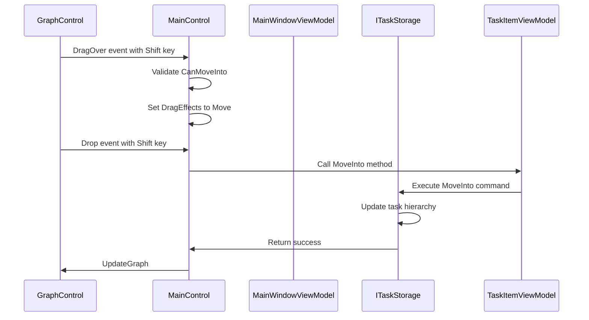
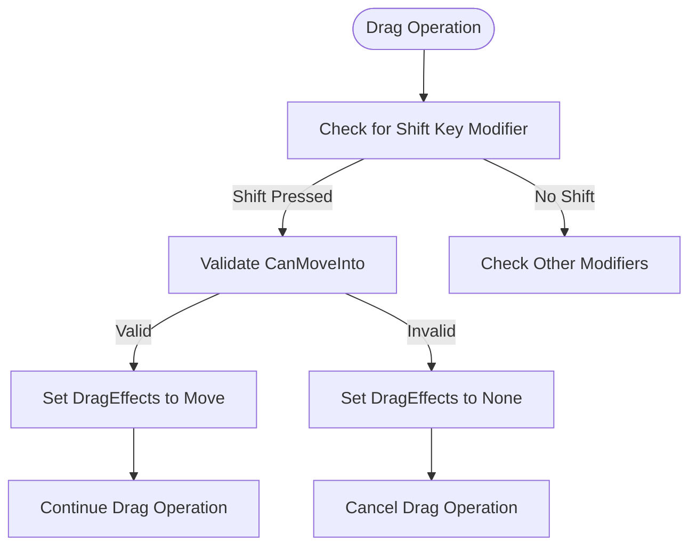
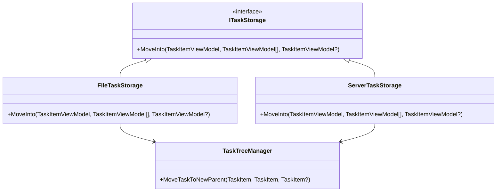
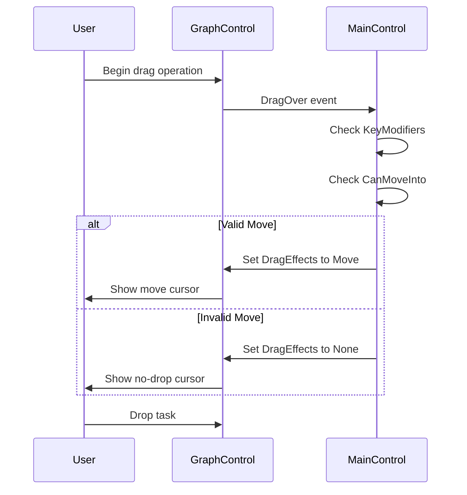
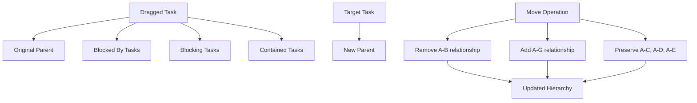
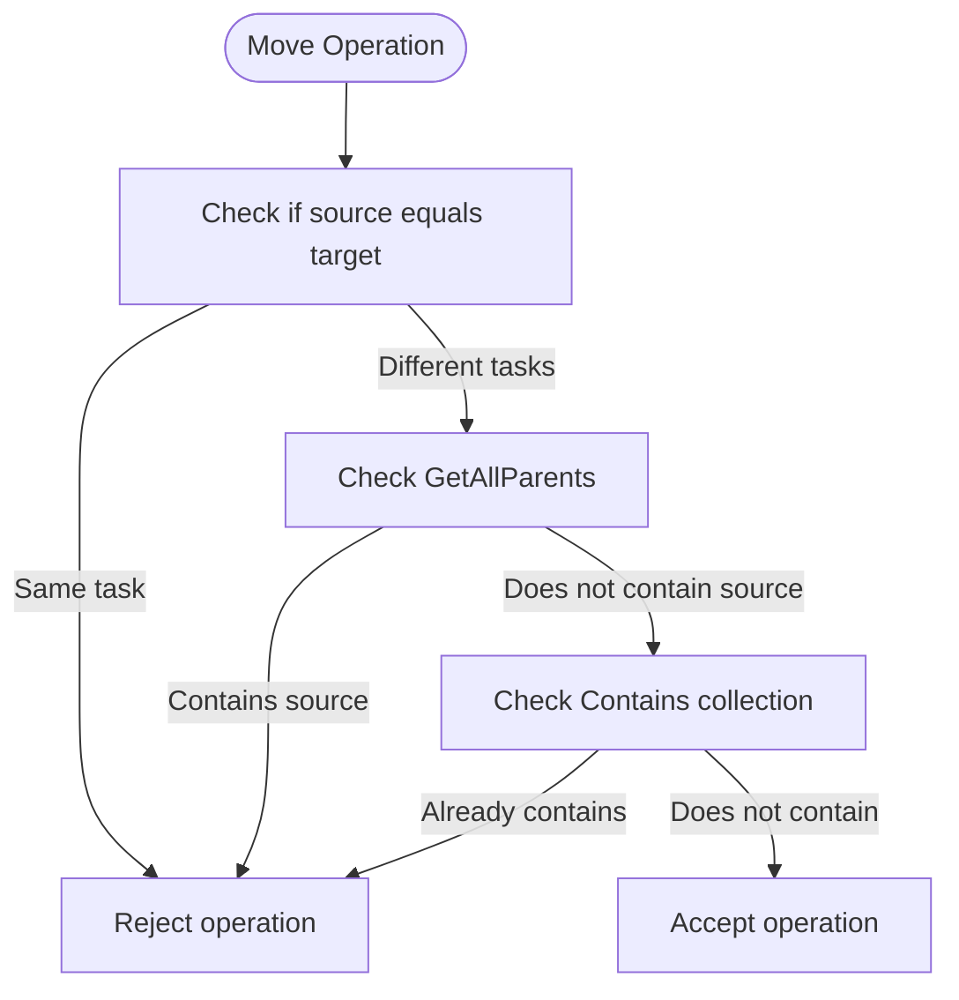
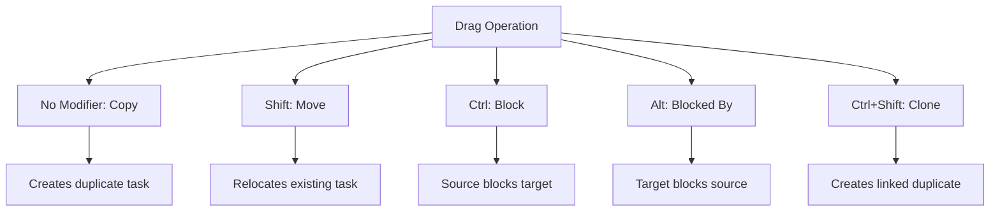

# Move Operation (Shift)

<cite>
**Referenced Files in This Document**   
- [MainWindowViewModel.cs](file://src/Unlimotion.ViewModel/MainWindowViewModel.cs)
- [MainControl.axaml.cs](file://src/Unlimotion/Views/MainControl.axaml.cs)
- [GraphControl.axaml.cs](file://src/Unlimotion/Views/GraphControl.axaml.cs)
- [ITaskStorage.cs](file://src/Unlimotion.ViewModel/ITaskStorage.cs)
- [TaskItemViewModel.cs](file://src/Unlimotion.ViewModel/TaskItemViewModel.cs)
- [TaskExtensions.cs](file://src/Unlimotion.ViewModel/TaskExtensions.cs)
- [FileTaskStorage.cs](file://src/Unlimotion/FileTaskStorage.cs)
- [ServerTaskStorage.cs](file://src/Unlimotion/ServerTaskStorage.cs)
</cite>

## Table of Contents
1. [Introduction](#introduction)
2. [Drag-and-Drop Architecture](#drag-and-drop-architecture)
3. [Shift Key Detection and Command Translation](#shift-key-detection-and-command-translation)
4. [MoveInto Operation Implementation](#moveinto-operation-implementation)
5. [Visual Feedback System](#visual-feedback-system)
6. [Relationship Preservation During Move](#relationship-preservation-during-move)
7. [Conflict Detection and Prevention](#conflict-detection-and-prevention)
8. [Multi-Parent Task Considerations](#multi-parent-task-considerations)
9. [Move vs. Other Operations Comparison](#move-vs-other-operations-comparison)
10. [Best Practices](#best-practices)

## Introduction

The Move operation in Unlimotion's drag-and-drop functionality enables users to reorganize their task hierarchy by relocating tasks under new parent tasks. When the Shift key is held during drag operations, the system interprets this as a MoveInto command, which restructures the task tree by making the dragged task a child of the target task. This operation maintains the dragged task's existing relationships while updating its position in the hierarchy.

The implementation spans multiple layers of the application architecture, from UI event handling in the GraphControl to command execution in the MainWindowViewModel and final storage operations through the ITaskStorage interface. The system ensures data integrity by validating move operations against circular dependency rules and preserving all existing task relationships during relocation.

**Section sources**
- [MainWindowViewModel.cs](file://src/Unlimotion.ViewModel/MainWindowViewModel.cs#L0-L1063)
- [MainControl.axaml.cs](file://src/Unlimotion/Views/MainControl.axaml.cs#L0-L311)

## Drag-and-Drop Architecture

The drag-and-drop functionality is implemented across multiple components, with each layer handling specific aspects of the operation. The GraphControl initiates drag events and provides visual representation, while the MainControl handles drag-over and drop events with keyboard modifier detection.

**Diagram sources**
- [GraphControl.axaml.cs](file://src/Unlimotion/Views/GraphControl.axaml.cs#L0-L229)
- [MainControl.axaml.cs](file://src/Unlimotion/Views/MainControl.axaml.cs#L0-L311)

**Section sources**
- [GraphControl.axaml.cs](file://src/Unlimotion/Views/GraphControl.axaml.cs#L0-L229)
- [MainControl.axaml.cs](file://src/Unlimotion/Views/MainControl.axaml.cs#L0-L311)

## Shift Key Detection and Command Translation

The Shift key detection occurs in the MainControl's DragOver and Drop event handlers. When the Shift key is pressed during a drag operation, the system validates whether the move operation is permissible and sets the appropriate drag effect.

The keyboard modifier detection is implemented in the DragOver method, which checks the KeyModifiers property of the DragEventArgs. When Shift is detected, the system verifies that the target task can accept the dragged task as a child by calling the CanMoveInto extension method.

**Diagram sources**
- [MainControl.axaml.cs](file://src/Unlimotion/Views/MainControl.axaml.cs#L150-L170)

**Section sources**
- [MainControl.axaml.cs](file://src/Unlimotion/Views/MainControl.axaml.cs#L150-L170)
- [MainWindowViewModel.cs](file://src/Unlimotion.ViewModel/MainWindowViewModel.cs#L0-L1063)

## MoveInto Operation Implementation

The MoveInto operation is implemented through a chain of method calls that begin with the UI event and end with the storage layer updating the task hierarchy. The operation is initiated when a user drops a task while holding the Shift key, triggering the MoveInto method on the TaskItemViewModel.

The ITaskStorage interface defines the MoveInto method signature, which is implemented by both FileTaskStorage and ServerTaskStorage classes. These implementations delegate to the TaskTreeManager to perform the actual hierarchy restructuring, ensuring consistent behavior across different storage backends.

**Diagram sources**
- [ITaskStorage.cs](file://src/Unlimotion.ViewModel/ITaskStorage.cs#L28-L28)
- [FileTaskStorage.cs](file://src/Unlimotion/FileTaskStorage.cs#L365-L375)
- [ServerTaskStorage.cs](file://src/Unlimotion/ServerTaskStorage.cs#L672-L682)

**Section sources**
- [ITaskStorage.cs](file://src/Unlimotion.ViewModel/ITaskStorage.cs#L28-L28)
- [FileTaskStorage.cs](file://src/Unlimotion/FileTaskStorage.cs#L365-L375)
- [ServerTaskStorage.cs](file://src/Unlimotion/ServerTaskStorage.cs#L672-L682)

## Visual Feedback System

The system provides visual feedback during the Move operation to indicate the current state and potential outcome of the drag operation. When the Shift key is pressed, the cursor changes to indicate a move operation, and the target task is highlighted to show it will become the new parent.

The visual feedback is managed through the DragEffects property of the DragEventArgs, which controls the cursor appearance and drop target styling. The system validates the CanMoveInto condition during the DragOver event, enabling or disabling the move operation based on the current task hierarchy and preventing invalid operations before they occur.

**Diagram sources**
- [MainControl.axaml.cs](file://src/Unlimotion/Views/MainControl.axaml.cs#L150-L170)
- [GraphControl.axaml.cs](file://src/Unlimotion/Views/GraphControl.axaml.cs#L200-L210)

**Section sources**
- [MainControl.axaml.cs](file://src/Unlimotion/Views/MainControl.axaml.cs#L150-L170)
- [GraphControl.axaml.cs](file://src/Unlimotion/Views/GraphControl.axaml.cs#L200-L210)

## Relationship Preservation During Move

When executing a MoveInto operation, the system preserves all existing relationships of the dragged task, including its blocked-by relationships, blocking relationships, and contained tasks. The operation only modifies the parent-child relationship by adding the target task as a new parent.

The TaskItemViewModel's MoveInto method accepts both the destination task and the source (current) parent task as parameters, ensuring that the system can properly manage the transition between parent tasks. For tasks with multiple parents, the user must have initiated the drag from a specific parent context, which is used to determine the relationship to remove.

**Diagram sources**
- [TaskItemViewModel.cs](file://src/Unlimotion.ViewModel/TaskItemViewModel.cs#L539-L542)
- [ITaskStorage.cs](file://src/Unlimotion.ViewModel/ITaskStorage.cs#L28-L28)

**Section sources**
- [TaskItemViewModel.cs](file://src/Unlimotion.ViewModel/TaskItemViewModel.cs#L539-L542)
- [ITaskStorage.cs](file://src/Unlimotion.ViewModel/ITaskStorage.cs#L28-L28)

## Conflict Detection and Prevention

The system implements several conflict detection mechanisms to prevent invalid operations and maintain data integrity. The primary validation is performed by the CanMoveInto extension method, which checks for circular dependencies and self-referential relationships.

The validation rules prevent:
- Moving a task into itself
- Creating circular parent-child relationships
- Moving a task into one of its descendants
- Duplicating existing parent-child relationships

These validations occur during the DragOver event, providing immediate feedback to the user before the drop operation is completed.

**Diagram sources**
- [TaskExtensions.cs](file://src/Unlimotion.ViewModel/TaskExtensions.cs#L11-L17)

**Section sources**
- [TaskExtensions.cs](file://src/Unlimotion.ViewModel/TaskExtensions.cs#L11-L17)
- [TaskItemViewModel.cs](file://src/Unlimotion.ViewModel/TaskItemViewModel.cs#L539-L542)

## Multi-Parent Task Considerations

For tasks with multiple parents, the Move operation requires special handling to determine which parent relationship should be removed. The system uses the context from which the drag operation was initiated to identify the source parent.

When a user begins dragging a task from a specific parent context, that parent is recorded as the source for the operation. During the MoveInto execution, this source parent is passed as a parameter to ensure the correct relationship is removed from the task's parent collection.

The UI provides visual cues to indicate the current parent context, helping users understand which relationship will be modified during the move operation. This prevents accidental removal of important parent relationships when working with multi-parent tasks.

**Section sources**
- [MainControl.axaml.cs](file://src/Unlimotion/Views/MainControl.axaml.cs#L220-L240)
- [TaskItemViewModel.cs](file://src/Unlimotion.ViewModel/TaskItemViewModel.cs#L539-L542)

## Move vs. Other Operations Comparison

The Shift key Move operation is one of several drag-and-drop operations available in the system, each distinguished by different keyboard modifiers:

The Move operation (Shift) differs from Copy (no modifier) by relocating the existing task rather than creating a duplicate. Unlike the blocking operations (Ctrl and Alt), which establish dependency relationships without changing the hierarchy, Move restructures the parent-child relationships in the task tree.

**Diagram sources**
- [MainControl.axaml.cs](file://src/Unlimotion/Views/MainControl.axaml.cs#L150-L260)

**Section sources**
- [MainControl.axaml.cs](file://src/Unlimotion/Views/MainControl.axaml.cs#L150-L260)

## Best Practices

When using the Move operation with the Shift key, consider the following best practices:

1. **Verify Target Context**: Ensure you are dragging from the correct parent context when working with multi-parent tasks to avoid removing unintended relationships.

2. **Check Dependencies**: Before moving a task, review its blocking and blocked-by relationships to understand potential impacts on task completion requirements.

3. **Use Undo**: The system supports undo operations, so don't hesitate to experiment with task organization and revert if needed.

4. **Hierarchical Planning**: Consider the long-term organizational structure when moving tasks, as frequent reorganization can make it harder to locate tasks later.

5. **Batch Operations**: For multiple moves, consider the order of operations to minimize intermediate states that might violate business rules.

6. **Visual Confirmation**: Always confirm the visual feedback matches your intention before releasing the dragged task.

The Move operation is most appropriate when reorganizing task hierarchies, delegating tasks to different projects or categories, or restructuring workflows. Use Copy when you need to maintain the original task in its current location while creating a new instance elsewhere.

**Section sources**
- [MainControl.axaml.cs](file://src/Unlimotion/Views/MainControl.axaml.cs#L150-L260)
- [TaskExtensions.cs](file://src/Unlimotion.ViewModel/TaskExtensions.cs#L11-L17)