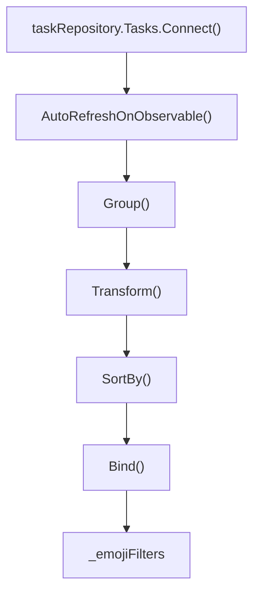
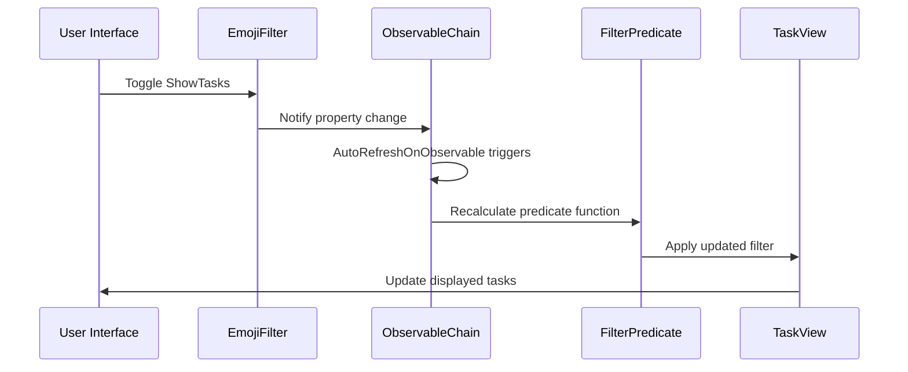

# Emoji Filtering Mechanism

<cite>
**Referenced Files in This Document**   
- [MainWindowViewModel.cs](file://src/Unlimotion.ViewModel/MainWindowViewModel.cs)
- [TaskItemViewModel.cs](file://src/Unlimotion.ViewModel/TaskItemViewModel.cs)
</cite>

## Table of Contents
1. [Introduction](#introduction)
2. [Emoji Pattern and Detection](#emoji-pattern-and-detection)
3. [_emojiFilters and _emojiExcludeFilters Collections](#_emojifilters-and-_emojiexcludefilters-collections)
4. [Reactive Observable Chains](#reactive-observable-chains)
5. [Filter State Propagation](#filter-state-propagation)
6. [UI Binding and Integration](#ui-binding-and-integration)
7. [Performance Considerations](#performance-considerations)

## Introduction
The emoji filtering mechanism in Unlimotion provides a dynamic way to organize and view tasks based on their emoji content. This system leverages the DynamicData library to create reactive observable chains that automatically update when task properties change. The implementation centers around two key collections in the MainWindowViewModel: _emojiFilters and _emojiExcludeFilters, which are used to group tasks by their emoji and enable real-time filtering across different task views.

**Section sources**
- [MainWindowViewModel.cs](file://src/Unlimotion.ViewModel/MainWindowViewModel.cs#L250-L280)
- [TaskItemViewModel.cs](file://src/Unlimotion.ViewModel/TaskItemViewModel.cs#L567-L568)

## Emoji Pattern and Detection
The emoji filtering system relies on a comprehensive regular expression pattern (EmojiPattern) to identify emojis in task titles. This pattern covers a wide range of Unicode emoji characters and sequences, enabling accurate detection of emojis within task titles.

In the TaskItemViewModel, the Emoji property uses this pattern to extract the first emoji found in a task's title:

```csharp
public string Emoji => Regex.Match(Title ?? "", EmojiPattern).Value;
```

The system also provides the OnlyTextTitle property, which returns the task title with the emoji removed, allowing for clean display of text content.

**Section sources**
- [TaskItemViewModel.cs](file://src/Unlimotion.ViewModel/TaskItemViewModel.cs#L567-L570)

## _emojiFilters and _emojiExcludeFilters Collections
The MainWindowViewModel maintains two key collections for emoji-based filtering:

1. **_emojiFilters**: A ReadOnlyObservableCollection of EmojiFilter objects that represent emoji groups for inclusion filtering
2. **_emojiExcludeFilters**: A ReadOnlyObservableCollection of EmojiFilter objects that represent emoji groups for exclusion filtering

These collections are populated through reactive observable chains that monitor the task repository and group tasks by their emoji content. Each EmojiFilter contains properties such as Title, Emoji, ShowTasks (a boolean indicating whether tasks with this emoji should be displayed), and SortText (used for sorting the filters).

The AllEmojiFilter and AllEmojiExcludeFilter serve as special "All" filters that can show or hide all tasks regardless of emoji content.

**Section sources**
- [MainWindowViewModel.cs](file://src/Unlimotion.ViewModel/MainWindowViewModel.cs#L250-L280)
- [MainWindowViewModel.cs](file://src/Unlimotion.ViewModel/MainWindowViewModel.cs#L310-L315)

## Reactive Observable Chains
The emoji filtering mechanism uses DynamicData's reactive programming capabilities to create observable chains that automatically update when task properties change. The core implementation uses several key methods:



**Diagram sources**
- [MainWindowViewModel.cs](file://src/Unlimotion.ViewModel/MainWindowViewModel.cs#L250-L265)

The observable chain begins with Connect(), which establishes a connection to the task repository's observable collection. AutoRefreshOnObservable() ensures the chain updates when the Emoji property changes on any task. The Group() method groups tasks by their emoji value, while Transform() converts each group into an EmojiFilter object. Finally, SortBy() and Bind() sort the filters and bind them to the _emojiFilters collection.

The AutoRefreshOnObservable method is particularly important as it monitors changes to the Emoji property:

```csharp
.AutoRefreshOnObservable(m => m.WhenAny(m => m.Emoji, (c) => c.Value == null))
```

This ensures that whenever a task's emoji changes (or when a task is added/removed), the filtering system automatically updates.

**Section sources**
- [MainWindowViewModel.cs](file://src/Unlimotion.ViewModel/MainWindowViewModel.cs#L250-L265)
- [MainWindowViewModel.cs](file://src/Unlimotion.ViewModel/MainWindowViewModel.cs#L278-L293)

## Filter State Propagation
Filter state changes are propagated through the system using WhenAnyValue subscriptions from ReactiveUI. When a user toggles the ShowTasks property on an EmojiFilter, this change is detected and triggers a recalculation of the filtering predicates.

The system creates dynamic predicates for both inclusion and exclusion filtering:



**Diagram sources**
- [MainWindowViewModel.cs](file://src/Unlimotion.ViewModel/MainWindowViewModel.cs#L317-L350)

The emojiFilter and emojiExcludeFilter predicates are created using ToObservableChangeSet() and ToCollection(), which convert the observable collections into streams that can be transformed into filtering functions:

```csharp
var emojiFilter = _emojiFilters.ToObservableChangeSet()
    .AutoRefreshOnObservable(filter => filter.WhenAnyValue(e => e.ShowTasks))
    .ToCollection()
    .Select(filter => CreatePredicate(filter));
```

These predicates are then applied to various task views (All Tasks, Unlocked, Completed, etc.) through the Filter() method in the observable chains.

**Section sources**
- [MainWindowViewModel.cs](file://src/Unlimotion.ViewModel/MainWindowViewModel.cs#L317-L350)
- [MainWindowViewModel.cs](file://src/Unlimotion.ViewModel/MainWindowViewModel.cs#L461-L498)

## UI Binding and Integration
The _emojiFilters and _emojiExcludeFilters collections are bound to the UI, allowing users to interact with the emoji-based filtering system. The filters are displayed in the interface, and users can toggle them on or off to show or hide tasks with specific emojis.

The MainWindowViewModel exposes these collections as properties that can be bound to UI elements:

```csharp
public ReadOnlyObservableCollection<EmojiFilter> EmojiFilters { get; set; }
public ReadOnlyObservableCollection<EmojiFilter> EmojiExcludeFilters { get; set; }
```

Additionally, the GraphViewModel receives references to these collections, enabling consistent filtering behavior across different views of the application.

**Section sources**
- [MainWindowViewModel.cs](file://src/Unlimotion.ViewModel/MainWindowViewModel.cs#L310-L315)
- [MainWindowViewModel.cs](file://src/Unlimotion.ViewModel/MainWindowViewModel.cs#L268-L269)

## Performance Considerations
The emoji filtering mechanism is designed with performance in mind, particularly for large datasets. Several strategies are employed to maintain responsiveness:

1. **AutoRefreshOnObservable**: This method efficiently monitors only the specific properties that affect filtering (in this case, the Emoji property), rather than watching all property changes on tasks.

2. **Lazy Evaluation**: The filtering predicates are only recalculated when necessary, thanks to the reactive nature of the observable chains.

3. **Optimized String Operations**: The system uses efficient string operations when extracting emojis and creating sort text, minimizing unnecessary allocations.

4. **Batched Updates**: DynamicData handles batched updates to the collections, reducing the number of UI refreshes needed when multiple tasks change simultaneously.

The use of AutoRefreshOnObservable is particularly crucial for maintaining filter accuracy while minimizing performance overhead. By specifically monitoring the Emoji property, the system avoids unnecessary updates when other task properties change.

**Section sources**
- [MainWindowViewModel.cs](file://src/Unlimotion.ViewModel/MainWindowViewModel.cs#L251-L252)
- [MainWindowViewModel.cs](file://src/Unlimotion.ViewModel/MainWindowViewModel.cs#L317-L350)