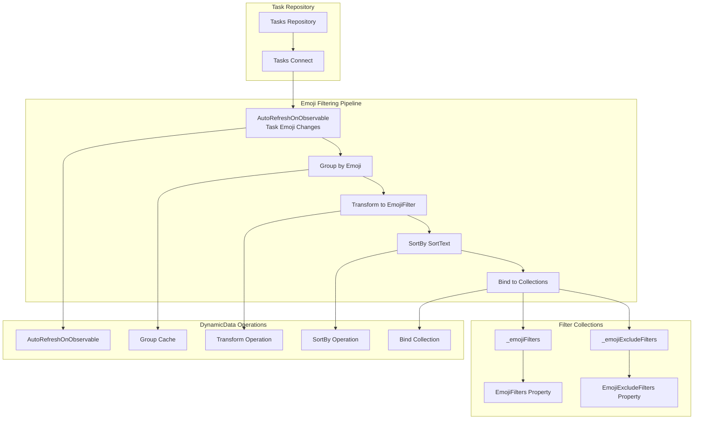
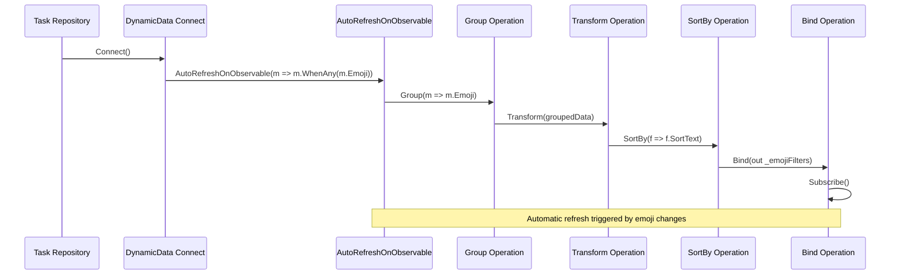
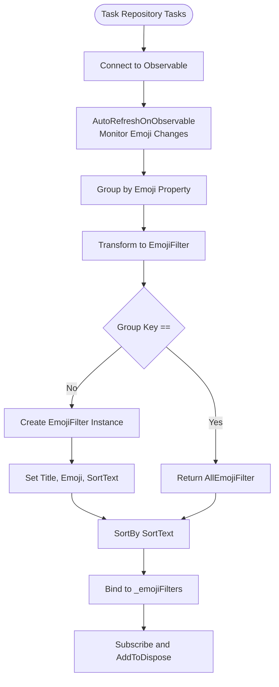
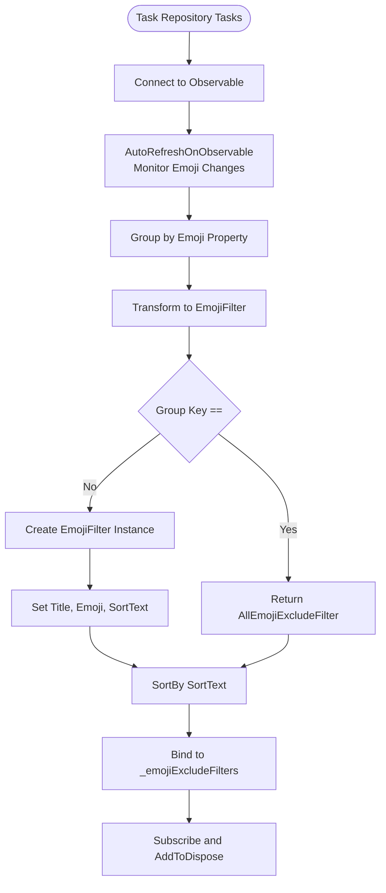
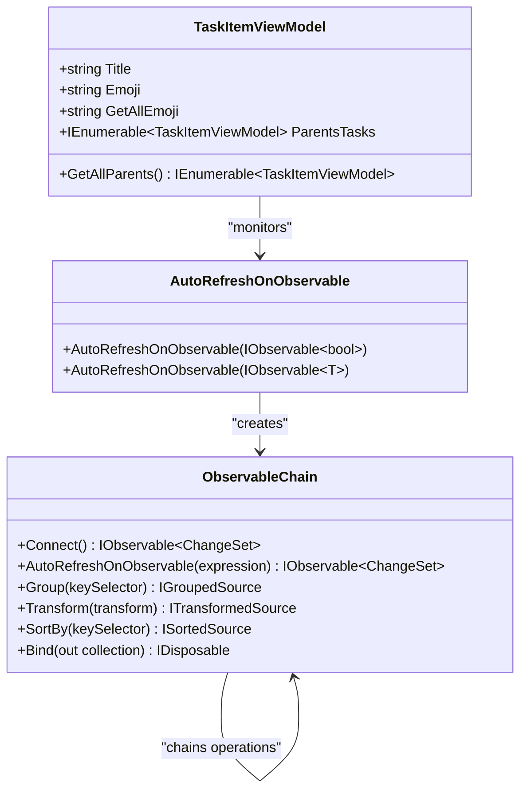
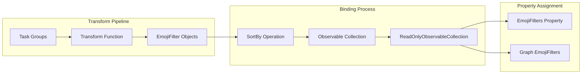
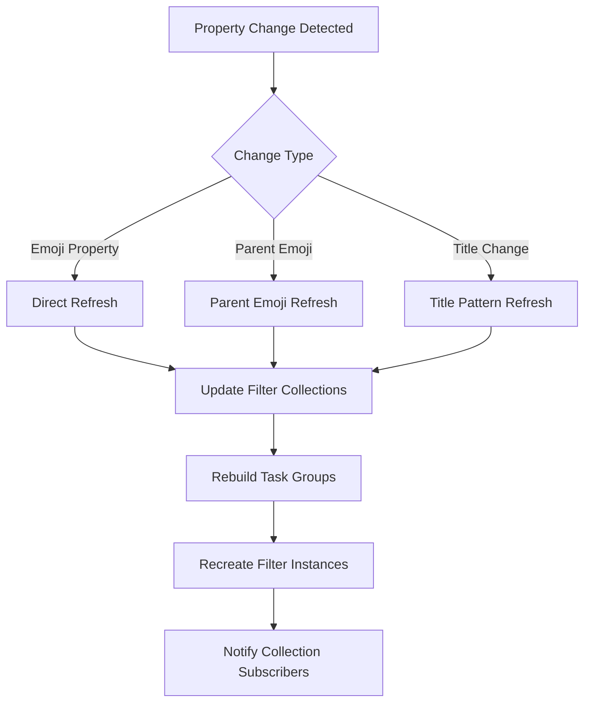
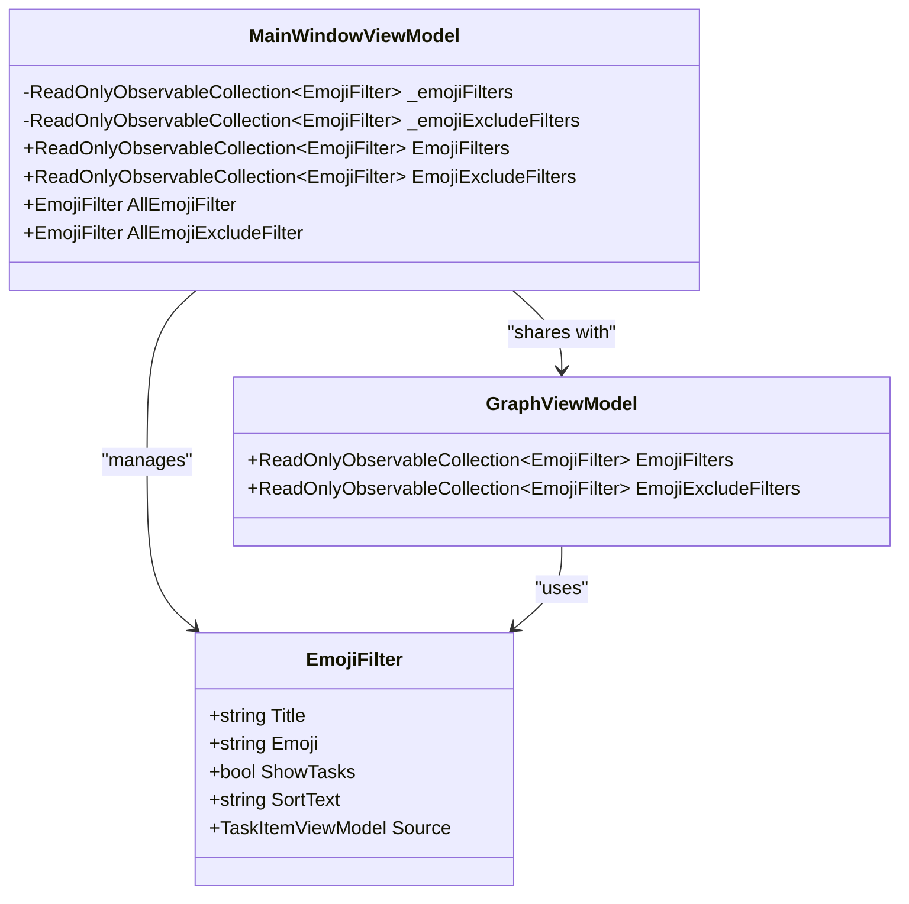

# Reactive Data Flow in Emoji Filtering Mechanism

<cite>
**Referenced Files in This Document**
- [MainWindowViewModel.cs](file://src/Unlimotion.ViewModel/MainWindowViewModel.cs)
- [TaskItemViewModel.cs](file://src/Unlimotion.ViewModel/TaskItemViewModel.cs)
- [TaskItem.cs](file://src/Unlimotion.Domain/TaskItem.cs)
- [EmojiFilter.cs](file://src/Unlimotion.ViewModel/MainWindowViewModel.cs)
</cite>

## Table of Contents
1. [Introduction](#introduction)
2. [System Architecture Overview](#system-architecture-overview)
3. [Core Components](#core-components)
4. [DynamicData Library Integration](#dynamicdata-library-integration)
5. [Emoji Filtering Pipeline](#emoji-filtering-pipeline)
6. [Observable Chain Implementation](#observable-chain-implementation)
7. [Transform and Binding Process](#transform-and-binding-process)
8. [AutoRefreshOnObservable Mechanism](#autorefreshonobservable-mechanism)
9. [Filter Collection Management](#filter-collection-management)
10. [Performance Considerations](#performance-considerations)
11. [Troubleshooting Guide](#troubleshooting-guide)
12. [Conclusion](#conclusion)

## Introduction

The emoji filtering mechanism in Unlimotion utilizes the DynamicData library to create sophisticated reactive data flows that automatically update filter collections when task emoji properties change. This system demonstrates advanced reactive programming patterns with observable chains, automatic refresh mechanisms, and real-time collection binding.

The implementation creates two primary filter collections: `_emojiFilters` for inclusion-based filtering and `_emojiExcludeFilters` for exclusion-based filtering. These collections are dynamically maintained through a complex pipeline that monitors task properties and automatically updates filter states when emoji-related changes occur.

## System Architecture Overview

The emoji filtering system operates within a larger reactive architecture that combines DynamicData's observable capabilities with ReactiveUI's command and property binding patterns. The system maintains separate filter pipelines for inclusion and exclusion scenarios while sharing common infrastructure.

**Diagram sources**
- [MainWindowViewModel.cs](file://src/Unlimotion.ViewModel/MainWindowViewModel.cs#L150-L200)

## Core Components

The emoji filtering system consists of several interconnected components that work together to provide real-time filtering capabilities:

### TaskItemViewModel Structure
The [`TaskItemViewModel`](file://src/Unlimotion.ViewModel/TaskItemViewModel.cs#L20-L567) serves as the primary data model containing emoji-related properties and methods. It extracts emoji patterns from task titles and maintains parent-child relationships that contribute to the overall emoji collection.

### EmojiFilter Model
The [`EmojiFilter`](file://src/Unlimotion.ViewModel/MainWindowViewModel.cs#L1043-L1051) class represents individual filter instances with properties for title, emoji, visibility state, sorting text, and source task reference.

### MainWindowViewModel Integration
The [`MainWindowViewModel`](file://src/Unlimotion.ViewModel/MainWindowViewModel.cs#L21-L758) orchestrates the entire filtering pipeline, managing connections, subscriptions, and collection bindings while coordinating between different filter types.

**Section sources**
- [MainWindowViewModel.cs](file://src/Unlimotion.ViewModel/MainWindowViewModel.cs#L21-L1063)
- [TaskItemViewModel.cs](file://src/Unlimotion.ViewModel/TaskItemViewModel.cs#L20-L567)

## DynamicData Library Integration

The system leverages DynamicData's powerful observable capabilities to create reactive data flows. The integration begins with the `taskRepository.Tasks.Connect()` method, which establishes the foundation for all subsequent operations.

### Core DynamicData Operations

The emoji filtering pipeline utilizes several key DynamicData operators:

- **AutoRefreshOnObservable**: Monitors specific properties for changes
- **Group**: Aggregates tasks by emoji values
- **Transform**: Converts grouped data to filter view models
- **SortBy**: Maintains sorted collections
- **Bind**: Creates observable collections

**Diagram sources**
- [MainWindowViewModel.cs](file://src/Unlimotion.ViewModel/MainWindowViewModel.cs#L150-L180)

**Section sources**
- [MainWindowViewModel.cs](file://src/Unlimotion.ViewModel/MainWindowViewModel.cs#L150-L200)

## Emoji Filtering Pipeline

The emoji filtering pipeline operates through two distinct but related chains that handle inclusion and exclusion filtering scenarios. Both pipelines share the same foundational operations but differ in their transformation logic and final collection targets.

### Inclusion Filtering Pipeline

The inclusion filtering pipeline processes tasks to create filters that show tasks matching specific emoji criteria:

**Diagram sources**
- [MainWindowViewModel.cs](file://src/Unlimotion.ViewModel/MainWindowViewModel.cs#L150-L170)

### Exclusion Filtering Pipeline

The exclusion filtering pipeline mirrors the inclusion pipeline but creates filters that hide tasks matching specific emoji criteria:

**Diagram sources**
- [MainWindowViewModel.cs](file://src/Unlimotion.ViewModel/MainWindowViewModel.cs#L172-L192)

**Section sources**
- [MainWindowViewModel.cs](file://src/Unlimotion.ViewModel/MainWindowViewModel.cs#L150-L192)

## Observable Chain Implementation

The observable chain implementation demonstrates sophisticated reactive programming patterns that automatically respond to changes in task properties. The system uses multiple layers of observables to create a responsive filtering ecosystem.

### Task Property Monitoring

The system monitors specific task properties using ReactiveUI's `WhenAny` methods:

**Diagram sources**
- [MainWindowViewModel.cs](file://src/Unlimotion.ViewModel/MainWindowViewModel.cs#L150-L192)
- [TaskItemViewModel.cs](file://src/Unlimotion.ViewModel/TaskItemViewModel.cs#L86-L99)

### Connection Management

Each observable chain is properly managed through the DisposableList system to prevent memory leaks and ensure clean shutdown:

**Section sources**
- [MainWindowViewModel.cs](file://src/Unlimotion.ViewModel/MainWindowViewModel.cs#L150-L200)

## Transform and Binding Process

The transform operation plays a crucial role in converting grouped task data into usable filter view models. This process involves extracting emoji information, creating filter instances, and setting appropriate properties.

### Transform Implementation Details

The transform function creates EmojiFilter instances with specific property assignments:

| Property | Source | Purpose |
|----------|--------|---------|
| Title | `first.Title` | Display name for the filter |
| Emoji | `first.Emoji` | Actual emoji character for identification |
| ShowTasks | `false` | Initial visibility state |
| SortText | `(first.Title ?? "").Replace(first.Emoji, "").Trim()` | Text for alphabetical sorting |
| Source | `first` | Reference to original task item |

### Binding Operations

The binding operations create observable collections that automatically update when underlying data changes:

**Diagram sources**
- [MainWindowViewModel.cs](file://src/Unlimotion.ViewModel/MainWindowViewModel.cs#L170-L192)

**Section sources**
- [MainWindowViewModel.cs](file://src/Unlimotion.ViewModel/MainWindowViewModel.cs#L150-L192)

## AutoRefreshOnObservable Mechanism

The `AutoRefreshOnObservable` mechanism is the cornerstone of the reactive filtering system, enabling automatic updates when monitored properties change. This mechanism operates on multiple levels to ensure comprehensive coverage of emoji-related changes.

### Property Change Detection

The system monitors various properties that can affect emoji filtering:

- **Task Emoji Property**: Direct emoji character in task title
- **Parent Task Emojis**: Combined emoji from all parent tasks
- **Task Title Changes**: Any modifications to task titles containing emojis

### Refresh Trigger Conditions

The AutoRefresh mechanism triggers refreshes based on specific conditions:

**Diagram sources**
- [MainWindowViewModel.cs](file://src/Unlimotion.ViewModel/MainWindowViewModel.cs#L150-L192)

### Performance Optimization

The AutoRefresh mechanism includes several performance optimizations:

- **Selective Monitoring**: Only monitors relevant properties
- **Batch Updates**: Groups multiple changes into single refresh cycles
- **Memory Management**: Proper disposal through DisposableList pattern

**Section sources**
- [MainWindowViewModel.cs](file://src/Unlimotion.ViewModel/MainWindowViewModel.cs#L150-L192)

## Filter Collection Management

The system maintains two primary filter collections that serve different filtering purposes while sharing common infrastructure. Understanding the management of these collections is essential for comprehending the complete filtering mechanism.

### Collection Architecture

**Diagram sources**
- [MainWindowViewModel.cs](file://src/Unlimotion.ViewModel/MainWindowViewModel.cs#L980-L1060)

### Collection Lifecycle Management

The filter collections undergo several lifecycle stages:

1. **Initialization**: Creation of empty collections
2. **Population**: Dynamic addition of filter items
3. **Monitoring**: Continuous observation of task changes
4. **Updates**: Automatic modification based on property changes
5. **Cleanup**: Proper disposal during shutdown

### Property Exposure

The filter collections are exposed through public properties that enable binding in the UI layer:

| Property | Purpose | Target |
|----------|---------|--------|
| `EmojiFilters` | Inclusion-based filtering | Main interface |
| `EmojiExcludeFilters` | Exclusion-based filtering | Advanced filtering |
| `Graph.EmojiFilters` | Graph visualization | Chart display |
| `Graph.EmojiExcludeFilters` | Graph exclusion | Chart display |

**Section sources**
- [MainWindowViewModel.cs](file://src/Unlimotion.ViewModel/MainWindowViewModel.cs#L980-L1060)

## Performance Considerations

The emoji filtering system incorporates several performance optimization strategies to ensure smooth operation even with large datasets and frequent updates.

### Memory Management

The system employs proper memory management through:

- **DisposableList Pattern**: Automatic cleanup of subscriptions
- **Weak References**: Preventing memory leaks in long-running operations
- **Lazy Loading**: Deferred initialization of expensive operations

### Computational Efficiency

Several strategies optimize computational performance:

- **Selective Property Monitoring**: Only monitoring relevant properties
- **Efficient Grouping**: Using hash-based grouping for fast lookups
- **Minimal Transformations**: Streamlined transform operations

### Scalability Factors

The system scales effectively through:

- **Incremental Updates**: Only affected filters are updated
- **Batch Processing**: Multiple changes processed together
- **Optimized Sorting**: Efficient sorting algorithms for filter collections

## Troubleshooting Guide

Common issues and their solutions when working with the emoji filtering reactive data flow:

### Connection Issues

**Problem**: Filters not updating when task emojis change
**Solution**: Verify that `AutoRefreshOnObservable` is properly configured and that task properties are correctly bound.

### Performance Problems

**Problem**: Slow filter updates with large task collections
**Solution**: Check property monitoring scope and consider optimizing transform operations.

### Memory Leaks

**Problem**: Increasing memory usage over time
**Solution**: Ensure all subscriptions are properly disposed using the DisposableList pattern.

**Section sources**
- [MainWindowViewModel.cs](file://src/Unlimotion.ViewModel/MainWindowViewModel.cs#L150-L200)

## Conclusion

The emoji filtering mechanism in Unlimotion demonstrates sophisticated reactive programming patterns using the DynamicData library. Through carefully orchestrated observable chains, automatic refresh mechanisms, and efficient collection management, the system provides real-time filtering capabilities that respond seamlessly to task property changes.

The dual-pipeline architecture for inclusion and exclusion filtering showcases the flexibility of the DynamicData framework in handling complex reactive scenarios. The AutoRefreshOnObservable mechanism ensures that filters remain synchronized with task data, while the transform and binding operations provide clean separation between data models and presentation layers.

This implementation serves as an excellent example of modern reactive programming techniques, demonstrating how to build scalable, maintainable, and performant filtering systems that automatically adapt to changing data requirements.