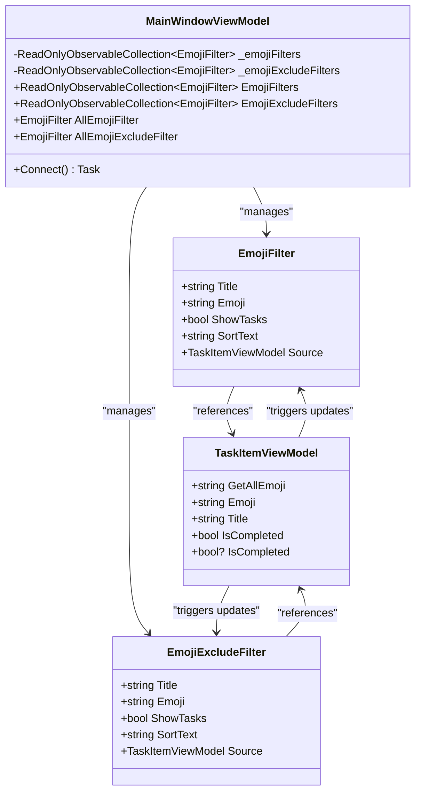
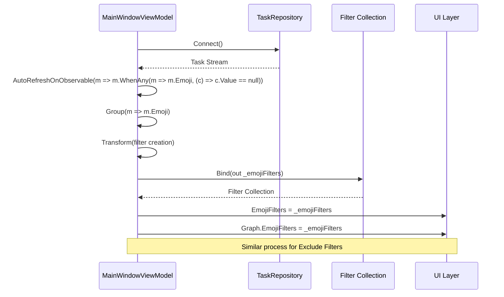
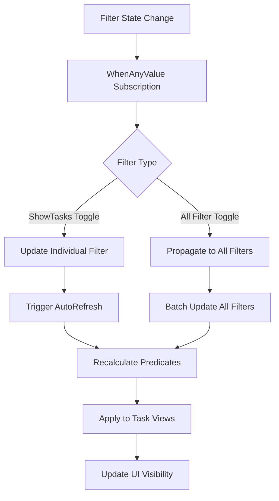
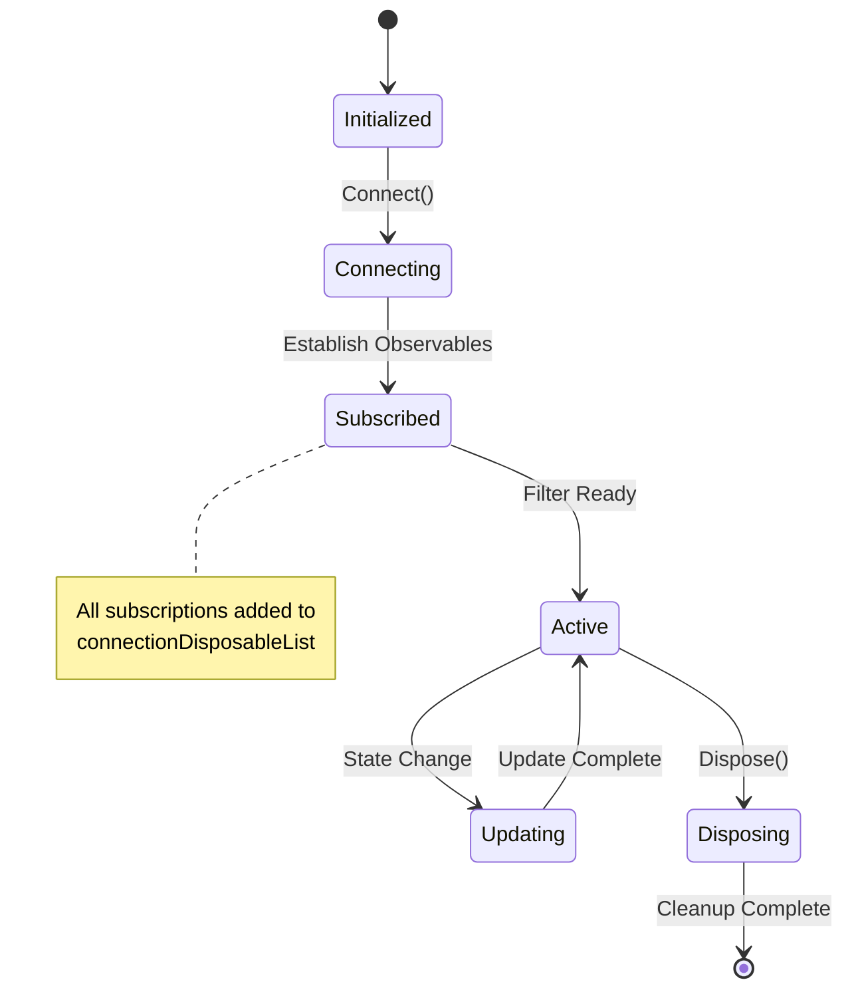
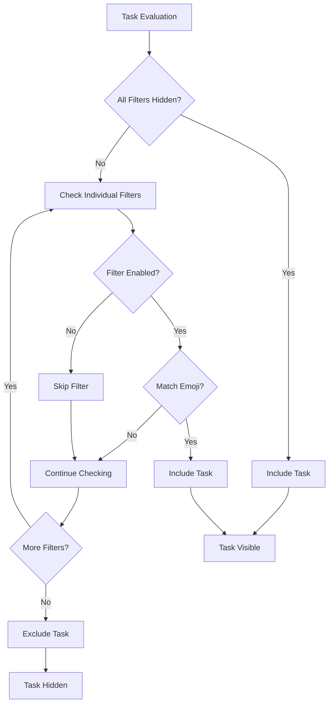
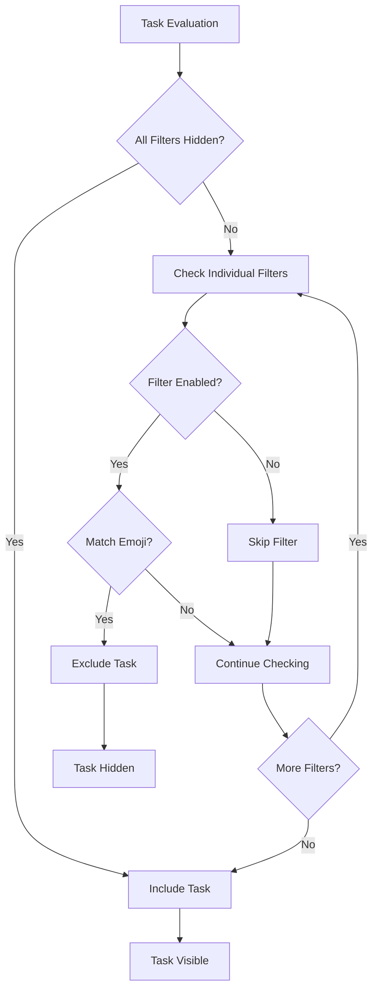
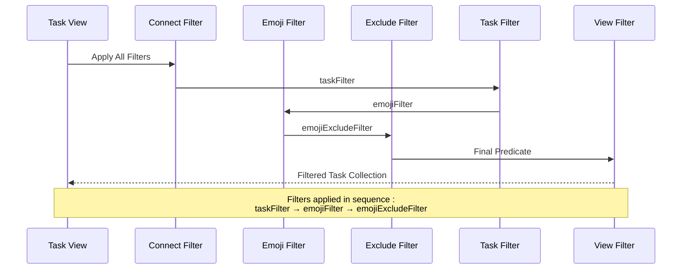
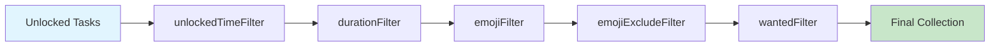
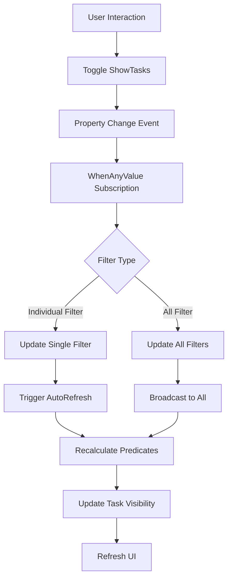
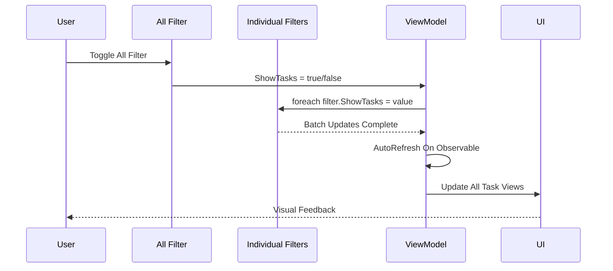

# UI Binding and Filter Application

<cite>
**Referenced Files in This Document**
- [MainWindowViewModel.cs](file://src/Unlimotion.ViewModel/MainWindowViewModel.cs)
- [TaskItemViewModel.cs](file://src/Unlimotion.ViewModel/TaskItemViewModel.cs)
- [GraphViewModel.cs](file://src/Unlimotion.ViewModel/GraphViewModel.cs)
- [TaskStorageExtensions.cs](file://src/Unlimotion/TaskStorageExtensions.cs)
- [DateFilter.cs](file://src/Unlimotion.ViewModel/DateFilter.cs)
</cite>

## Table of Contents
1. [Introduction](#introduction)
2. [Emoji Filter Architecture](#emoji-filter-architecture)
3. [UI Binding Implementation](#ui-binding-implementation)
4. [Observable Collections and Subscriptions](#observable-collections-and-subscriptions)
5. [Filter Predicate Functions](#filter-predicate-functions)
6. [Task View Integration](#task-view-integration)
7. [Filter State Propagation](#filter-state-propagation)
8. [Performance Considerations](#performance-considerations)
9. [Troubleshooting Guide](#troubleshooting-guide)
10. [Conclusion](#conclusion)

## Introduction

The Unlimotion application implements a sophisticated emoji filtering system that enables users to organize and filter tasks based on emoji characters embedded in task titles. This system demonstrates advanced reactive programming patterns using DynamicData and ReactiveUI frameworks, showcasing how UI bindings are established and maintained through observable collections and predicate functions.

The emoji filtering mechanism operates across multiple task views (All Tasks, Unlocked, Completed, Archived, etc.) and maintains real-time synchronization between filter states and task visibility. The implementation leverages `.WhenAnyValue()` subscriptions for reactive updates and employs `ToObservableChangeSet()` with `AutoRefreshOnObservable()` for efficient filter accuracy maintenance.

## Emoji Filter Architecture

The emoji filtering system consists of two primary filter collections: `_emojiFilters` and `_emojiExcludeFilters`. These collections serve distinct purposes in the filtering process:

**Diagram sources**
- [MainWindowViewModel.cs](file://src/Unlimotion.ViewModel/MainWindowViewModel.cs#L1028-L1061)
- [TaskItemViewModel.cs](file://src/Unlimotion.ViewModel/TaskItemViewModel.cs#L560-L590)

**Section sources**
- [MainWindowViewModel.cs](file://src/Unlimotion.ViewModel/MainWindowViewModel.cs#L1028-L1061)

## UI Binding Implementation

The UI binding process begins with establishing connections to the task repository and setting up automatic refresh mechanisms. The implementation utilizes `AutoRefreshOnObservable()` to ensure filters remain accurate when task properties change.

### Initial Filter Setup

The emoji filter collections are initialized through a series of reactive streams that group tasks by emoji characters and transform them into filter objects:

**Diagram sources**
- [MainWindowViewModel.cs](file://src/Unlimotion.ViewModel/MainWindowViewModel.cs#L241-L290)

### Reactive Property Binding

The system establishes reactive bindings using `.WhenAnyValue()` subscriptions that monitor filter state changes and propagate them through the application:

**Diagram sources**
- [MainWindowViewModel.cs](file://src/Unlimotion.ViewModel/MainWindowViewModel.cs#L178-L185)

**Section sources**
- [MainWindowViewModel.cs](file://src/Unlimotion.ViewModel/MainWindowViewModel.cs#L178-L185)
- [MainWindowViewModel.cs](file://src/Unlimotion.ViewModel/MainWindowViewModel.cs#L241-L290)

## Observable Collections and Subscriptions

The implementation relies heavily on DynamicData's observable collections and subscription management. Each filter collection maintains its own lifecycle through disposable subscriptions.

### Collection Management

The `_emojiFilters` and `_emojiExcludeFilters` collections are managed through the `Bind()` operator, which creates read-only observable collections that automatically update when the underlying data changes:

| Collection | Purpose | Refresh Trigger | Binding Method |
|------------|---------|-----------------|----------------|
| `_emojiFilters` | Include filters for showing tasks with specific emojis | `AutoRefreshOnObservable(m => m.WhenAny(m => m.Emoji, (c) => c.Value == null))` | `Bind(out _emojiFilters)` |
| `_emojiExcludeFilters` | Exclude filters for hiding tasks with specific emojis | `AutoRefreshOnObservable(m => m.WhenAny(m => m.Emoji, (c) => c.Value == null))` | `Bind(out _emojiExcludeFilters)` |
| `EmojiFilters` | Public accessor for UI binding | Reactive property change | Direct assignment |
| `EmojiExcludeFilters` | Public accessor for UI binding | Reactive property change | Direct assignment |

### Subscription Lifecycle

All subscriptions are managed through the `connectionDisposableList` to ensure proper cleanup during view model disposal:

**Diagram sources**
- [MainWindowViewModel.cs](file://src/Unlimotion.ViewModel/MainWindowViewModel.cs#L170-L175)

**Section sources**
- [MainWindowViewModel.cs](file://src/Unlimotion.ViewModel/MainWindowViewModel.cs#L170-L175)
- [MainWindowViewModel.cs](file://src/Unlimotion.ViewModel/MainWindowViewModel.cs#L241-L290)

## Filter Predicate Functions

The heart of the emoji filtering system lies in the predicate functions that determine task visibility. These functions are dynamically generated based on filter states and continuously updated through reactive streams.

### Emoji Filter Predicates

The emoji filter predicate function evaluates whether a task should be included based on the current filter selections:

**Diagram sources**
- [MainWindowViewModel.cs](file://src/Unlimotion.ViewModel/MainWindowViewModel.cs#L350-L377)

### Exclude Filter Predicates

The exclude filter predicate function operates similarly but with inverted logic to hide tasks matching specific emoji criteria:

**Diagram sources**
- [MainWindowViewModel.cs](file://src/Unlimotion.ViewModel/MainWindowViewModel.cs#L315-L342)

### Dynamic Predicate Generation

The predicate functions are generated dynamically using LINQ transformations and reactive streams:

| Filter Type | Predicate Logic | Trigger Condition |
|-------------|-----------------|-------------------|
| `emojiFilter` | Include if task contains any enabled emoji | `filter.WhenAnyValue(e => e.ShowTasks)` |
| `emojiExcludeFilter` | Exclude if task contains any enabled emoji | `filter.WhenAnyValue(e => e.ShowTasks)` |
| `wantedFilter` | Include based on wanted status | `this.WhenAnyValue(m => m.ShowWanted)` |
| `taskFilter` | Include based on completion/archival status | `this.WhenAnyValue(m => m.ShowCompleted, m => m.ShowArchived)` |

**Section sources**
- [MainWindowViewModel.cs](file://src/Unlimotion.ViewModel/MainWindowViewModel.cs#L315-L377)

## Task View Integration

The emoji filters integrate seamlessly with all task views through the `Filter()` method in various Connect() pipelines. Each view applies the appropriate combination of filters to display relevant tasks.

### All Tasks View Integration

The All Tasks view combines multiple filter types to provide comprehensive task filtering:

**Diagram sources**
- [MainWindowViewModel.cs](file://src/Unlimotion.ViewModel/MainWindowViewModel.cs#L471-L490)

### Unlocked Tasks View Integration

The Unlocked Tasks view adds additional filters for time-based and duration-based filtering:

**Diagram sources**
- [MainWindowViewModel.cs](file://src/Unlimotion.ViewModel/MainWindowViewModel.cs#L492-L510)

### Graph View Integration

The Graph view maintains separate filter collections for tasks and unlocked tasks, enabling specialized filtering for visual representation:

| Filter Collection | Purpose | Usage Context |
|-------------------|---------|---------------|
| `Graph.Tasks` | All filtered tasks for graph display | Main task visualization |
| `Graph.UnlockedTasks` | Unlocked tasks for timeline display | Timeline and progress views |
| `Graph.EmojiFilters` | Include filters for graph tasks | Graph-specific filtering |
| `Graph.EmojiExcludeFilters` | Exclude filters for graph tasks | Graph-specific exclusion |

**Section sources**
- [MainWindowViewModel.cs](file://src/Unlimotion.ViewModel/MainWindowViewModel.cs#L471-L510)
- [GraphViewModel.cs](file://src/Unlimotion.ViewModel/GraphViewModel.cs#L10-L25)

## Filter State Propagation

The filter state propagation mechanism ensures that changes to individual filter states are efficiently distributed throughout the application and reflected in real-time across all affected task views.

### State Change Detection

Filter state changes are detected through `WhenAnyValue()` subscriptions that monitor the `ShowTasks` property of each filter:

**Diagram sources**
- [MainWindowViewModel.cs](file://src/Unlimotion.ViewModel/MainWindowViewModel.cs#L178-L185)

### Batch Update Mechanism

When the "All" filter is toggled, the system efficiently propagates the change to all individual filters:

**Diagram sources**
- [MainWindowViewModel.cs](file://src/Unlimotion.ViewModel/MainWindowViewModel.cs#L178-L185)

### Performance Optimization

The system employs several optimization strategies to minimize computational overhead during state propagation:

| Optimization Technique | Implementation | Benefit |
|------------------------|----------------|---------|
| `AutoRefreshOnObservable()` | Automatic predicate recalculation | Reduces manual refresh calls |
| `ToObservableChangeSet()` | Efficient change tracking | Minimizes unnecessary evaluations |
| Reactive Streams | Lazy evaluation of predicates | Only compute when needed |
| Batch Updates | Collective filter updates | Reduces UI refresh cycles |

**Section sources**
- [MainWindowViewModel.cs](file://src/Unlimotion.ViewModel/MainWindowViewModel.cs#L178-L185)
- [MainWindowViewModel.cs](file://src/Unlimotion.ViewModel/MainWindowViewModel.cs#L350-L377)

## Performance Considerations

The emoji filtering system is designed with performance in mind, employing several strategies to ensure smooth operation even with large task collections.

### Memory Management

The system carefully manages memory usage through proper disposal patterns and efficient collection management:

- **Disposable Pattern**: All subscriptions are added to the `connectionDisposableList` for automatic cleanup
- **Observable Collections**: Use of `ReadOnlyObservableCollection<T>` to prevent accidental modifications
- **Lazy Evaluation**: Predicates are only computed when task visibility needs to be determined

### Computational Efficiency

Several techniques optimize computational performance:

- **Early Termination**: Filter predicates use early termination to avoid unnecessary comparisons
- **Index-Based Lookups**: Emoji matching leverages string operations optimized for character patterns
- **Selective Recalculation**: Only affected predicates are recalculated when filter states change

### Scalability Factors

The system scales effectively with task count through:

- **Streaming Architecture**: Uses DynamicData's streaming capabilities for efficient large dataset handling
- **Incremental Updates**: Only modified tasks trigger predicate recalculation
- **Memory-Efficient Predicates**: Lightweight predicate functions minimize memory footprint

## Troubleshooting Guide

Common issues and their solutions when working with the emoji filtering system:

### Filter Not Updating

**Symptoms**: Changes to filter states don't affect task visibility
**Causes**: 
- Missing subscription registration
- Incorrect predicate logic
- Filter collection binding issues

**Solutions**:
1. Verify `WhenAnyValue()` subscriptions are properly registered
2. Check predicate function logic in `emojiFilter` and `emojiExcludeFilter` generation
3. Ensure filter collections are properly bound to UI

### Performance Issues

**Symptoms**: Slow filter response or UI lag
**Causes**:
- Excessive predicate recalculations
- Large task collections without optimization
- Memory leaks from unmanaged subscriptions

**Solutions**:
1. Review `AutoRefreshOnObservable()` triggers for unnecessary refreshes
2. Implement pagination or virtualization for large datasets
3. Verify all subscriptions are properly disposed

### Filter State Synchronization

**Symptoms**: Filter states appear inconsistent across views
**Causes**:
- Multiple filter instances with different states
- Race conditions in filter updates
- UI binding delays

**Solutions**:
1. Centralize filter state management in `MainWindowViewModel`
2. Use thread-safe update mechanisms for filter state changes
3. Implement proper UI synchronization patterns

**Section sources**
- [MainWindowViewModel.cs](file://src/Unlimotion.ViewModel/MainWindowViewModel.cs#L170-L175)
- [MainWindowViewModel.cs](file://src/Unlimotion.ViewModel/MainWindowViewModel.cs#L350-L377)

## Conclusion

The emoji filtering system in Unlimotion demonstrates sophisticated reactive programming patterns that enable dynamic, real-time task filtering based on emoji characters. Through careful implementation of observable collections, predicate functions, and subscription management, the system provides a responsive and efficient filtering experience across multiple task views.

Key achievements of this implementation include:

- **Reactive Architecture**: Seamless integration of UI bindings with backend data through DynamicData and ReactiveUI
- **Performance Optimization**: Efficient filter state propagation with minimal computational overhead
- **Scalable Design**: Architecture that handles large task collections without performance degradation
- **Maintainable Code**: Clear separation of concerns with proper disposal patterns and subscription management

The system serves as an excellent example of modern reactive programming techniques applied to real-world application scenarios, providing valuable insights for developers implementing similar filtering mechanisms in their applications.