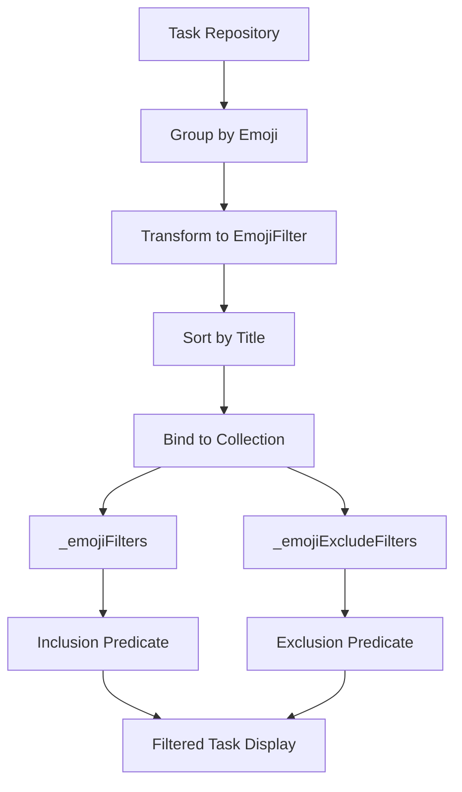
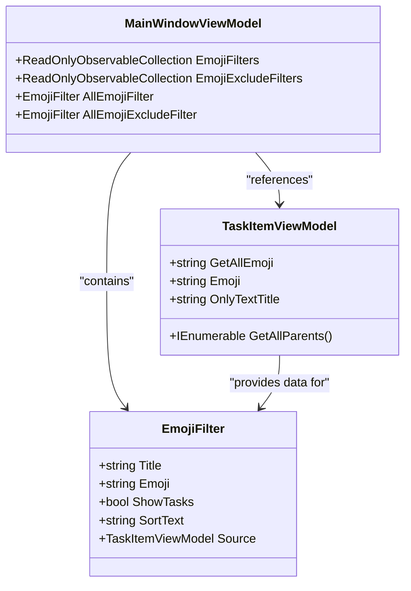

# Emoji Filtering

<cite>
**Referenced Files in This Document**   
- [MainWindowViewModel.cs](file://src/Unlimotion.ViewModel/MainWindowViewModel.cs)
- [TaskItemViewModel.cs](file://src/Unlimotion.ViewModel/TaskItemViewModel.cs)
- [SortDefinition.cs](file://src/Unlimotion.ViewModel/SortDefinition.cs)
</cite>

## Table of Contents
1. [Introduction](#introduction)
2. [Emoji Parsing and Inheritance](#emoji-parsing-and-inheritance)
3. [Emoji Filter Implementation](#emoji-filter-implementation)
4. [Filter State Management](#filter-state-management)
5. [UI Binding and Collection Creation](#ui-binding-and-collection-creation)
6. [Common Issues and Considerations](#common-issues-and-considerations)

## Introduction
This document details the emoji-based filtering system in Unlimotion, a task management application. The feature enables users to organize and filter tasks using emojis in task titles, with inheritance of parent task emojis by child tasks. The implementation leverages reactive programming patterns to provide real-time filtering across various task views. This system enhances task organization by allowing visual categorization through emojis, which are automatically parsed from task titles and used to group and filter tasks across the application.

## Emoji Parsing and Inheritance

The emoji filtering system in Unlimotion is built on two core components: emoji parsing from task titles and emoji inheritance through task hierarchies. The system uses a comprehensive regular expression pattern to identify emojis within task titles, extracting them for use in filtering and display purposes.

The `EmojiPattern` constant in the `TaskItemViewModel` class contains a detailed regex pattern that matches a wide range of Unicode emoji characters, including standard emojis, emoji modifiers, and various symbol combinations. This pattern is applied to task titles to extract the first emoji encountered, which is then exposed through the `Emoji` property. The implementation uses `Regex.Match(Title ?? "", EmojiPattern).Value` to extract the emoji, ensuring that even tasks with null or empty titles are handled gracefully.

In addition to the primary emoji, each task exposes a `GetAllEmoji` property that aggregates emojis from all parent tasks in the hierarchy. This inheritance mechanism is implemented through a reactive subscription that monitors changes to parent tasks' emojis. When the parent tasks collection changes or any parent's emoji updates, the system traverses the parent hierarchy, collects all emojis, and concatenates them into a single string. This allows child tasks to display and be filtered by the combined emojis of their entire ancestry, creating a cascading categorization system.

The `GetAllParents` method implements a depth-first traversal of the parent hierarchy, ensuring consistent ordering of parent tasks. This method returns an ordered collection of parent tasks, which is then used to construct the complete emoji string. The inheritance mechanism ensures that when a parent task's emoji changes, all descendant tasks automatically reflect this change in their `GetAllEmoji` property, maintaining consistency across the task hierarchy.

**Section sources**
- [TaskItemViewModel.cs](file://src/Unlimotion.ViewModel/TaskItemViewModel.cs#L565-L572)
- [TaskItemViewModel.cs](file://src/Unlimotion.ViewModel/TaskItemViewModel.cs#L88-L99)

## Emoji Filter Implementation

The emoji filtering functionality is primarily implemented in the `MainWindowViewModel` class, which serves as the central view model for the application's main interface. The implementation uses reactive programming patterns to create dynamic filter collections that respond to changes in the task repository.

The emoji filter system creates two distinct filter collections: `_emojiFilters` for inclusion filtering and `_emojiExcludeFilters` for exclusion filtering. Both collections are created using the same pattern: the system connects to the task repository's observable task collection, groups tasks by their emoji property, transforms each group into an `EmojiFilter` object, sorts these filters by title, and binds the result to a read-only observable collection.

For inclusion filtering, the system creates a predicate that returns true when any enabled emoji filter matches a task. The predicate checks if the task's `GetAllEmoji` property contains the filter emoji or if the emoji appears in the task title. If all filters are disabled, the predicate returns true, effectively disabling the filter. This implementation allows users to select multiple emojis for inclusion, showing tasks that match any of the selected categories.

The exclusion filtering works similarly but with inverted logic: it returns false (excludes the task) if any enabled exclusion filter matches the task. This dual-filter system enables sophisticated filtering scenarios where users can include tasks with certain emojis while excluding others, providing fine-grained control over task visibility.

**Diagram sources**
- [MainWindowViewModel.cs](file://src/Unlimotion.ViewModel/MainWindowViewModel.cs#L300-L330)
- [MainWindowViewModel.cs](file://src/Unlimotion.ViewModel/MainWindowViewModel.cs#L340-L380)

## Filter State Management

The emoji filter system employs reactive programming principles to manage filter states efficiently. The filter collections are implemented as `ReadOnlyObservableCollection<EmojiFilter>`, which automatically updates when the underlying data changes, ensuring the UI remains synchronized with the current state.

Filter state changes are managed through reactive subscriptions that respond to changes in the `ShowTasks` property of individual filters. When a user toggles a filter, the change propagates through the reactive pipeline, causing the filter predicate to be re-evaluated for all tasks. This triggers a re-filtering of the task collections, updating the displayed tasks in real-time.

The system includes a special "All" filter (`AllEmojiFilter` and `AllEmojiExcludeFilter`) that controls the state of all individual emoji filters. When the "All" filter is toggled, it broadcasts its state to all emoji filters, enabling or disabling them simultaneously. This provides a convenient way to reset the filtering state or show all tasks regardless of emoji categorization.

Filter predicates are implemented as functions that return boolean values based on the current filter configuration. These predicates are composed using reactive operators that monitor changes to the filter collections. When filters are added, removed, or modified, the predicates are automatically re-created, ensuring that the filtering logic always reflects the current configuration.

The reactive approach minimizes unnecessary computations by only re-evaluating filters when relevant data changes. The system uses `AutoRefreshOnObservable` to specify exactly which property changes should trigger filter updates, optimizing performance by avoiding unnecessary re-computations.

**Section sources**
- [MainWindowViewModel.cs](file://src/Unlimotion.ViewModel/MainWindowViewModel.cs#L330-L380)
- [MainWindowViewModel.cs](file://src/Unlimotion.ViewModel/MainWindowViewModel.cs#L380-L420)

## UI Binding and Collection Creation

The emoji filter collections are created and bound to the UI through a reactive pipeline that transforms raw task data into filterable UI components. The `_emojiFilters` and `_emojiExcludeFilters` private fields are populated using DynamicData's binding mechanism, which automatically updates the public `EmojiFilters` and `EmojiExcludeFilters` properties.

The filter creation process begins with connecting to the task repository's observable collection. The system then groups tasks by their emoji property, creating a separate group for each unique emoji. Each group is transformed into an `EmojiFilter` object that contains metadata about the emoji, including its title, sort text (the task title with the emoji removed), and source task.

The sorting mechanism uses the `SortText` property to order filters alphabetically by the non-emoji portion of the task title. This ensures that filters are presented in a logical order that makes them easy to find and select. The sorting is applied using DynamicData's `SortBy` operator, which maintains the collection in sorted order as items are added or removed.

Both filter collections are exposed as public properties that can be bound directly to UI components. The `MainWindowViewModel` also exposes these collections to the `GraphViewModel`, enabling consistent emoji filtering across different views of the task hierarchy. This centralized approach ensures that filter state is synchronized between the main task list and the graph visualization.

**Diagram sources**
- [MainWindowViewModel.cs](file://src/Unlimotion.ViewModel/MainWindowViewModel.cs#L490-L520)
- [TaskItemViewModel.cs](file://src/Unlimotion.ViewModel/TaskItemViewModel.cs#L565-L572)

## Common Issues and Considerations

### Emoji Parsing Edge Cases
The emoji parsing system may encounter edge cases with complex emoji sequences or newer Unicode emoji that are not covered by the current `EmojiPattern`. The regex pattern, while comprehensive, may not capture all possible emoji combinations, particularly those involving skin tone modifiers or gender modifiers in complex sequences. Additionally, tasks with multiple emojis in their title will only have the first emoji extracted for the primary `Emoji` property, potentially limiting categorization options.

### Performance Implications
The real-time filtering system can impact performance when dealing with large datasets. The reactive filtering pipeline re-evaluates predicates for all tasks whenever filter states change, which can cause noticeable delays with thousands of tasks. The inheritance mechanism, which traverses parent hierarchies for each task, adds additional computational overhead, particularly for deeply nested task structures. The system mitigates these issues through careful use of reactive operators that minimize unnecessary computations, but performance may still degrade with very large task collections.

### User Experience Considerations
The emoji-based organization system enhances visual categorization but may present challenges for users who rely on screen readers or other assistive technologies. The system should ensure that emoji categories are also represented textually to maintain accessibility. Additionally, users may need guidance on effectively using emoji inheritance for task organization, as the cascading nature of emoji inheritance can lead to unexpected filtering results if not properly understood. The UI should provide clear visual feedback about which emojis are inherited from parent tasks and how they affect filtering.

**Section sources**
- [TaskItemViewModel.cs](file://src/Unlimotion.ViewModel/TaskItemViewModel.cs#L567)
- [MainWindowViewModel.cs](file://src/Unlimotion.ViewModel/MainWindowViewModel.cs#L300-L420)
- [SortDefinition.cs](file://src/Unlimotion.ViewModel/SortDefinition.cs#L36)