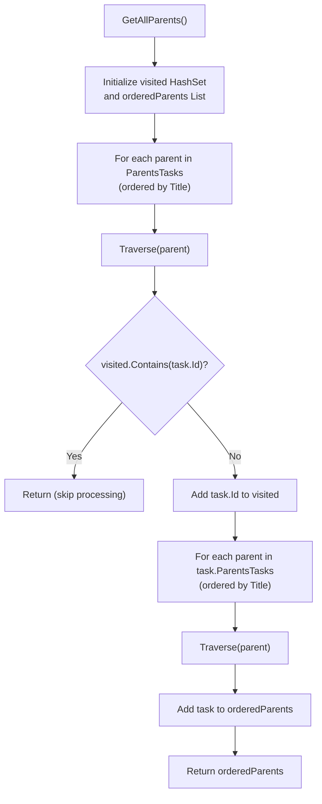

# Emoji Inheritance Model

<cite>
**Referenced Files in This Document**   
- [TaskItemViewModel.cs](file://src/Unlimotion.ViewModel/TaskItemViewModel.cs)
- [MainWindowViewModel.cs](file://src/Unlimotion.ViewModel/MainWindowViewModel.cs)
</cite>

## Table of Contents
1. [Introduction](#introduction)
2. [Emoji Inheritance Implementation](#emoji-inheritance-implementation)
3. [Parent Task Traversal](#parent-task-traversal)
4. [Emoji Filtering Mechanism](#emoji-filtering-mechanism)
5. [Edge Cases and Performance Considerations](#edge-cases-and-performance-considerations)
6. [Conclusion](#conclusion)

## Introduction
The emoji inheritance model in Unlimotion enables child tasks to inherit emojis from all their parent tasks through a reactive programming approach. This documentation details the implementation of the `GetAllEmoji` property in `TaskItemViewModel`, which aggregates emojis from the entire parent hierarchy. The system uses reactive subscriptions to automatically update inherited emojis when parent task emojis change, ensuring real-time consistency across the task hierarchy.

**Section sources**
- [TaskItemViewModel.cs](file://src/Unlimotion.ViewModel/TaskItemViewModel.cs#L1-L50)

## Emoji Inheritance Implementation
The emoji inheritance mechanism is implemented through the `GetAllEmoji` property in the `TaskItemViewModel` class. This property is automatically updated whenever there are changes to the parent tasks or their emojis through a reactive subscription to `ParentsTasks.ToObservableChangeSet()`. The subscription uses `AutoRefreshOnObservable` to monitor changes to both the `Emoji` and `GetAllEmoji` properties of parent tasks, ensuring that any modification propagates through the hierarchy.

The implementation uses `StartWithEmpty()` and `ToCollection()` to handle the initial state and collect all parent tasks, then iterates through the result of `GetAllParents()` to construct the final emoji string by joining all parent emojis. This approach ensures that child tasks display a concatenated string of all emojis from their entire ancestry, providing visual context about their hierarchical relationships.

```mermaid
flowchart TD
A["ParentsTasks.ToObservableChangeSet()"] --> B["AutoRefreshOnObservable<br/>(m => m.WhenAnyValue(m => m.Emoji,<br/>m => m.GetAllEmoji))"]
B --> C["StartWithEmpty()"]
C --> D["ToCollection()"]
D --> E["Subscribe(result => {<br/> var list = new List<string>();<br/> foreach (var task in GetAllParents())<br/> list.Add(task.Emoji);<br/> GetAllEmoji = string.Join(\"\", list);<br/>})"]
```

**Diagram sources**
- [TaskItemViewModel.cs](file://src/Unlimotion.ViewModel/TaskItemViewModel.cs#L70-L85)

**Section sources**
- [TaskItemViewModel.cs](file://src/Unlimotion.ViewModel/TaskItemViewModel.cs#L70-L85)
- [TaskItemViewModel.cs](file://src/Unlimotion.ViewModel/TaskItemViewModel.cs#L650-L655)

## Parent Task Traversal
The `GetAllParents()` method implements a depth-first traversal algorithm to collect all parent tasks in the hierarchy. It uses a recursive `Traverse` function with a `visited` HashSet to prevent infinite loops in cases of circular references. The traversal begins with the immediate parent tasks, ordered by title, and recursively processes each parent's ancestors before adding the current task to the result list.

This implementation ensures that parent tasks are ordered hierarchically, with ancestors appearing before their descendants in the final collection. The use of `OrderBy(m => m.Title)` provides consistent ordering of siblings at each level of the hierarchy. The method returns an `IEnumerable<TaskItemViewModel>` that represents the complete ancestral path of the task, which is then used to extract emojis for the inheritance model.



**Diagram sources**
- [TaskItemViewModel.cs](file://src/Unlimotion.ViewModel/TaskItemViewModel.cs#L657-L678)

**Section sources**
- [TaskItemViewModel.cs](file://src/Unlimotion.ViewModel/TaskItemViewModel.cs#L657-L678)

## Emoji Filtering Mechanism
The inherited emoji data is utilized in filtering operations through the `GetAllEmoji.Contains()` checks in the emoji filter predicate. In `MainWindowViewModel`, the emoji filtering system uses the `GetAllEmoji` property to determine if a task should be displayed when a particular emoji filter is active. The filter predicate checks both the direct emoji of a task's title and the inherited emojis from all parent tasks.

The filtering logic is implemented in the `emojiFilter` observable, which creates a predicate function that returns true if any active emoji filter matches either the task's own emoji or any emoji in its `GetAllEmoji` string. This allows users to filter tasks based on emojis from their entire ancestry, not just their direct emoji. The same mechanism is used in the `emojiExcludeFilter` to hide tasks that contain specific inherited emojis.

```mermaid
flowchart TD
A["Emoji Filter Predicate"] --> B{"filter.All(e => e.ShowTasks == false)?"}
B --> |Yes| C["Return true (show all tasks)"]
B --> |No| D["For each active filter item"]
D --> E{"task.GetAllEmoji.Contains(item.Emoji)<br/>|| (task.Title ?? \"\").Contains(item.Emoji)?"}
E --> |Yes| F["Return true (show task)"]
E --> |No| G["Continue to next filter"]
G --> H{"All filters processed?"}
H --> |Yes| I["Return false (hide task)"]
```

**Diagram sources**
- [MainWindowViewModel.cs](file://src/Unlimotion.ViewModel/MainWindowViewModel.cs#L342-L343)
- [MainWindowViewModel.cs](file://src/Unlimotion.ViewModel/MainWindowViewModel.cs#L368-L369)

**Section sources**
- [MainWindowViewModel.cs](file://src/Unlimotion.ViewModel/MainWindowViewModel.cs#L340-L370)

## Edge Cases and Performance Considerations
The emoji inheritance model handles several edge cases and performance considerations. For circular parent references, the `GetAllParents()` method uses a `visited` HashSet to prevent infinite recursion, ensuring that each task is processed only once regardless of circular relationships in the hierarchy.

For performance, the implementation uses reactive programming with `ToObservableChangeSet()` and `AutoRefreshOnObservable` to minimize unnecessary recalculations. The system only updates the `GetAllEmoji` property when there are actual changes to parent tasks or their emojis, rather than recalculating on every property change. However, deep task hierarchies could potentially impact performance due to the recursive nature of the traversal, especially when multiple parent tasks are modified simultaneously.

When parent task emojis are modified after inheritance, the `AutoRefreshOnObservable` subscription ensures that the change propagates to all child tasks that inherit from it. This reactive update mechanism maintains consistency across the hierarchy without requiring manual refresh operations. The use of `StartWithEmpty()` ensures that the initial state is properly handled, and subsequent changes trigger the appropriate updates through the reactive pipeline.

**Section sources**
- [TaskItemViewModel.cs](file://src/Unlimotion.ViewModel/TaskItemViewModel.cs#L70-L85)
- [TaskItemViewModel.cs](file://src/Unlimotion.ViewModel/TaskItemViewModel.cs#L657-L678)

## Conclusion
The emoji inheritance model in Unlimotion provides a robust mechanism for propagating visual cues through task hierarchies. By leveraging reactive programming principles, the system automatically maintains consistency between parent and child tasks when emojis are modified. The implementation efficiently handles hierarchical traversal, circular references, and real-time updates while providing a seamless user experience through integrated filtering capabilities. This model enhances task organization and visual navigation by preserving ancestral context throughout the task structure.