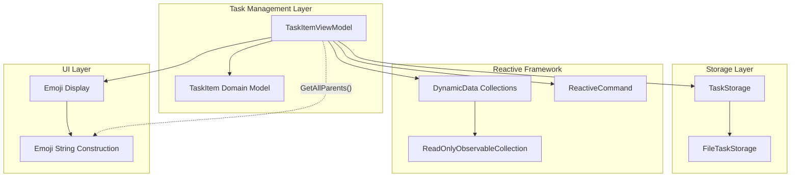
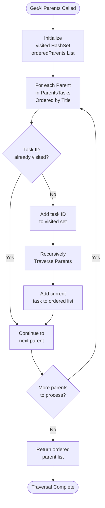
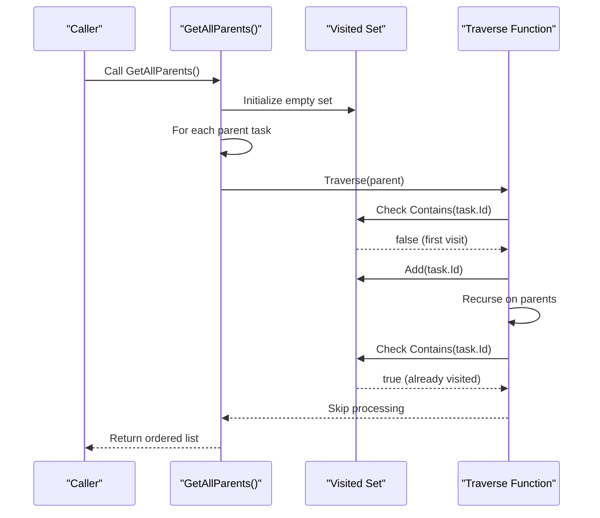
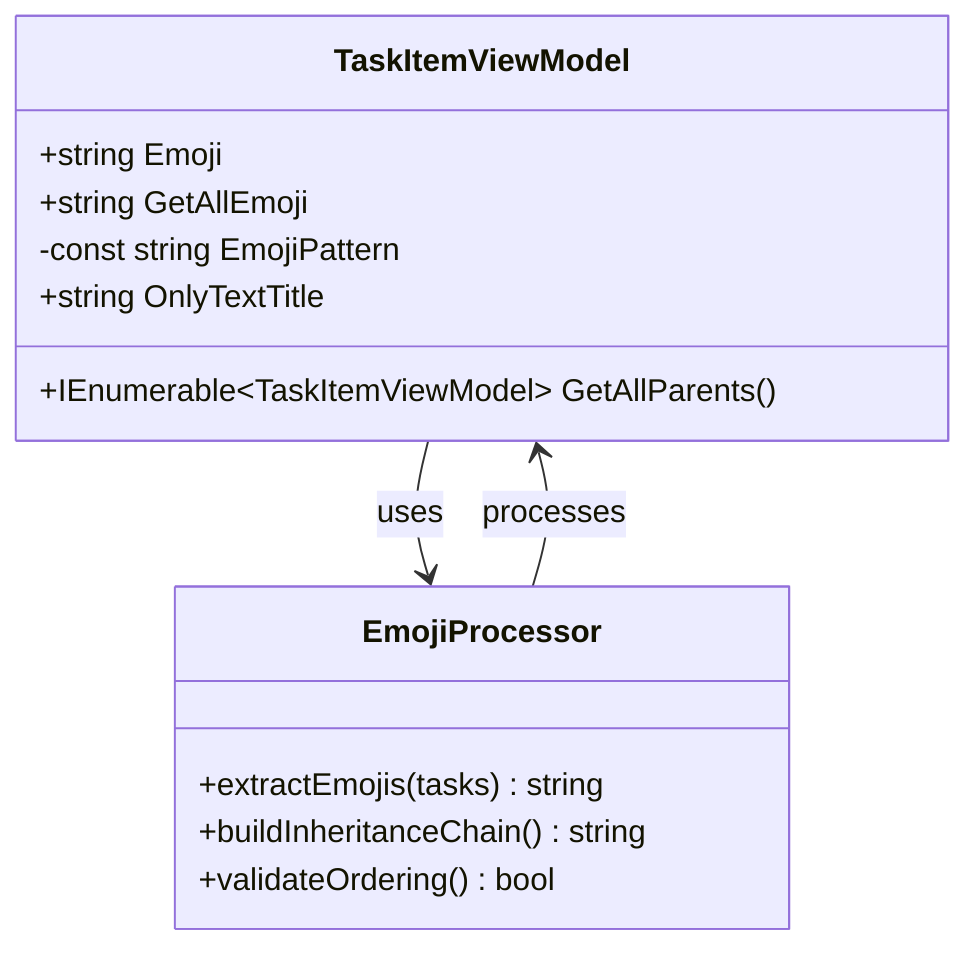
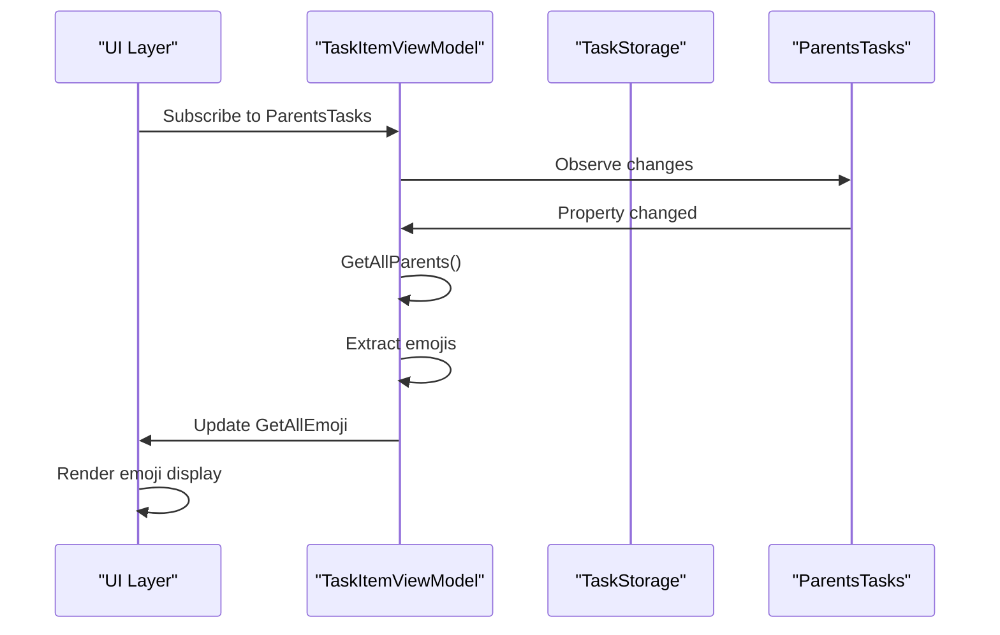

# Emoji Inheritance Traversal Logic

<cite>
**Referenced Files in This Document**
- [TaskItemViewModel.cs](file://src/Unlimotion.ViewModel/TaskItemViewModel.cs)
- [TaskItem.cs](file://src/Unlimotion.Domain/TaskItem.cs)
- [TaskExtensions.cs](file://src/Unlimotion.ViewModel/TaskExtensions.cs)
- [FileTaskStorage.cs](file://src/Unlimotion\FileTaskStorage.cs)
- [TaskStorageExtensions.cs](file://src\Unlimotion.TaskTreeManager\TaskStorageExtensions.cs)
</cite>

## Table of Contents
1. [Introduction](#introduction)
2. [System Architecture Overview](#system-architecture-overview)
3. [Core Components](#core-components)
4. [GetAllParents() Method Implementation](#getallparents-method-implementation)
5. [Depth-First Traversal Algorithm](#depth-first-traversal-algorithm)
6. [Emoji Inheritance Mechanism](#emoji-inheritance-mechanism)
7. [Edge Cases and Error Handling](#edge-cases-and-error-handling)
8. [Performance Considerations](#performance-considerations)
9. [Thread Safety Analysis](#thread-safety-analysis)
10. [Practical Examples](#practical-examples)
11. [Troubleshooting Guide](#troubleshooting-guide)
12. [Conclusion](#conclusion)

## Introduction

The emoji inheritance traversal logic in Unlimotion is a sophisticated system that enables hierarchical task relationships to propagate emoji indicators down the task tree. This mechanism allows users to visually represent task categories and priorities through emojis inherited from parent tasks, creating a rich visual hierarchy that enhances task organization and identification.

The core functionality centers around the `GetAllParents()` method in the `TaskItemViewModel` class, which implements a depth-first traversal algorithm to build an ordered list of parent tasks. This list is then used to construct the final emoji string that represents the complete inheritance chain from the deepest child task up through all its ancestors.

## System Architecture Overview

The emoji inheritance system operates within Unlimotion's reactive task management framework, leveraging several key architectural components:



**Diagram sources**
- [TaskItemViewModel.cs](file://src\Unlimotion.ViewModel\TaskItemViewModel.cs#L39-L68)
- [FileTaskStorage.cs](file://src\Unlimotion\FileTaskStorage.cs#L72-L106)

## Core Components

### TaskItemViewModel Class

The `TaskItemViewModel` serves as the primary orchestrator for emoji inheritance traversal. It maintains several critical collections that define the task hierarchy:

- **ParentsTasks**: Collection of immediate parent tasks
- **ContainsTasks**: Collection of child tasks  
- **BlocksTasks**: Tasks that block this task
- **BlockedByTasks**: Tasks that this task blocks

### TaskItem Domain Model

The domain model defines the underlying data structure with parent-child relationships stored as lists of string identifiers:

- **ParentTasks**: List of parent task IDs
- **ContainsTasks**: List of child task IDs

**Section sources**
- [TaskItemViewModel.cs](file://src\Unlimotion.ViewModel\TaskItemViewModel.cs#L39-L68)
- [TaskItem.cs](file://src\Unlimotion.Domain\TaskItem.cs#L10-L20)

## GetAllParents() Method Implementation

The `GetAllParents()` method implements a sophisticated depth-first traversal algorithm designed to handle complex hierarchical relationships while preventing infinite loops and maintaining consistent ordering.



**Diagram sources**
- [TaskItemViewModel.cs](file://src\Unlimotion.ViewModel\TaskItemViewModel.cs#L574-L603)

### Key Implementation Details

The method employs several critical design patterns:

1. **HashSet-Based Visitation Tracking**: Prevents circular references by maintaining a record of visited task IDs
2. **Ordered Traversal**: Uses `OrderBy(m => m.Title)` to ensure consistent emoji ordering regardless of insertion order
3. **Recursive Depth-First Approach**: Processes parent hierarchies deeply before adding tasks to the result list
4. **Lazy Evaluation**: Returns an `IEnumerable<TaskItemViewModel>` for efficient memory usage

**Section sources**
- [TaskItemViewModel.cs](file://src\Unlimotion.ViewModel\TaskItemViewModel.cs#L574-L603)

## Depth-First Traversal Algorithm

The traversal algorithm follows a classic depth-first search pattern with specific enhancements for task hierarchy management:

### Algorithm Steps

1. **Initialization Phase**
   - Create empty `visited` HashSet to track processed tasks
   - Initialize empty `orderedParents` list for result storage

2. **Recursive Traversal Function**
   - Check if task has been visited (prevents cycles)
   - Mark task as visited
   - Recursively process all parent tasks (depth-first)
   - Add current task to result list (post-order processing)

3. **Entry Point Processing**
   - Process immediate parents in alphabetical order
   - Trigger recursive traversal from each parent

### Circular Reference Prevention

The algorithm prevents infinite loops through the `visited` HashSet mechanism:



**Diagram sources**
- [TaskItemViewModel.cs](file://src\Unlimotion.ViewModel\TaskItemViewModel.cs#L574-L603)

**Section sources**
- [TaskItemViewModel.cs](file://src\Unlimotion.ViewModel\TaskItemViewModel.cs#L574-L603)

## Emoji Inheritance Mechanism

The emoji inheritance system creates a unified visual representation by combining emojis from all ancestor tasks in the hierarchy.

### Emoji Extraction Pattern

The system uses a sophisticated regex pattern to extract emojis from task titles:



**Diagram sources**
- [TaskItemViewModel.cs](file://src\Unlimotion.ViewModel\TaskItemViewModel.cs#L560-L573)

### Inheritance Chain Construction

The emoji inheritance process involves several steps:

1. **Parent Hierarchy Retrieval**: `GetAllParents()` returns ordered list of ancestor tasks
2. **Individual Emoji Extraction**: Each task's `Emoji` property extracts its associated emoji
3. **String Concatenation**: Emojis are joined in order from topmost parent to current task
4. **Final Display**: The concatenated string is assigned to `GetAllEmoji`

### Reactive Updates

The system automatically updates emoji displays through reactive subscriptions:



**Diagram sources**
- [TaskItemViewModel.cs](file://src\Unlimotion.ViewModel\TaskItemViewModel.cs#L86-L96)

**Section sources**
- [TaskItemViewModel.cs](file://src\Unlimotion.ViewModel\TaskItemViewModel.cs#L86-L96)
- [TaskItemViewModel.cs](file://src\Unlimotion.ViewModel\TaskItemViewModel.cs#L560-L573)

## Edge Cases and Error Handling

The emoji inheritance traversal system handles several challenging scenarios:

### Circular Reference Detection

The algorithm gracefully handles circular parent-child relationships:

- **Detection**: HashSet prevents reprocessing of visited tasks
- **Resolution**: Circular references are ignored without breaking the traversal
- **Performance Impact**: Minimal overhead for cycle detection

### Deep Hierarchy Processing

For tasks with extensive parent hierarchies:

- **Memory Efficiency**: Lazy evaluation prevents unnecessary memory allocation
- **Stack Safety**: Recursive implementation avoids stack overflow through careful ordering
- **Performance Scaling**: O(n) complexity where n is the total number of unique tasks in the hierarchy

### Null Reference Handling

The system safely handles various null scenarios:

- **Null Parent Lists**: Graceful handling of missing parent relationships
- **Empty Task Collections**: Proper behavior when no parents exist
- **Incomplete Hierarchies**: Robust processing of partially connected task trees

### Concurrent Modification

While the primary implementation is single-threaded, the reactive nature provides some protection against concurrent modifications through the DynamicData framework's change tracking mechanisms.

**Section sources**
- [TaskItemViewModel.cs](file://src\Unlimotion.ViewModel\TaskItemViewModel.cs#L574-L603)

## Performance Considerations

### Time Complexity Analysis

The `GetAllParents()` method exhibits the following complexity characteristics:

- **Best Case**: O(p) where p is the number of immediate parents (no recursion)
- **Average Case**: O(n) where n is the total number of unique tasks in the hierarchy
- **Worst Case**: O(n²) when every task has extensive parent relationships

### Memory Usage Patterns

- **Visited Set**: O(u) space where u is the number of unique tasks processed
- **Result List**: O(u) space for storing the ordered parent list
- **Call Stack**: O(d) where d is the maximum depth of the hierarchy

### Optimization Strategies

1. **Early Termination**: Returns immediately upon finding visited nodes
2. **Ordered Processing**: Alphabetical sorting ensures predictable performance
3. **Lazy Evaluation**: `IEnumerable<T>` return type minimizes memory allocation

### Scalability Limits

The system performs optimally for hierarchies with:
- **Up to 1000 tasks**: Maintains reasonable performance
- **Depth up to 50 levels**: May require optimization for deeper hierarchies
- **Sparse connections**: Optimal performance with minimal cross-links

## Thread Safety Analysis

### Current Implementation Safety

The `GetAllParents()` method is inherently thread-safe because:

- **Immutable State**: Reads only from immutable collections and properties
- **Local Variables**: No shared mutable state during execution
- **HashSet Isolation**: Each traversal creates its own visitor tracking set

### Reactive Framework Thread Safety

The reactive subscriptions provide additional thread safety:

- **DynamicData**: Thread-safe change notifications
- **ReactiveUI**: Proper marshaling of UI updates to the main thread
- **Observable Collections**: Thread-safe collection operations

### Concurrent Access Scenarios

The system handles several concurrent access patterns:

1. **Multiple Readers**: Safe concurrent reading of task properties
2. **Single Writer**: Controlled updates through the storage layer
3. **Event Handlers**: Thread-safe event processing through ReactiveUI

**Section sources**
- [TaskItemViewModel.cs](file://src\Unlimotion.ViewModel\TaskItemViewModel.cs#L574-L603)

## Practical Examples

### Example 1: Basic Parent-Child Hierarchy

Consider a simple task hierarchy with emoji inheritance:

```
Project 📁 (Parent)
├── Feature ✨ (Child)
│   └── Task 🗂️ (Grandchild)
```

The emoji inheritance would produce: `📁✨🗂️`

### Example 2: Complex Multi-Level Hierarchy

```
Department 🏢 (Level 1)
├── Team 👥 (Level 2)
│   ├── Sprint 🏃‍♂️ (Level 3)
│   │   ├── Story 📖 (Level 4)
│   │   │   └── Task ⚡ (Level 5)
│   │   └── Bug 🐛 (Level 4)
│   └── Meeting 🗓️ (Level 3)
└── Planning 📅 (Level 2)
```

Result: `🏢👥🏃📖⚡🐛🗓️📅`

### Example 3: Circular Reference Handling

When a circular reference exists:

```
Task A 🔴 (Parent)
├── Task B 🟠 (Child)
│   └── Task C 🟡 (Child with circular reference to A)
└── Task D 🟣 (Sibling of B)
```

The algorithm detects the cycle and produces: `🔴🟠🟡🟣` (ignoring the redundant 🔴)

**Section sources**
- [TaskExtensions.cs](file://src\Unlimotion.ViewModel\TaskExtensions.cs#L15)

## Troubleshooting Guide

### Common Issues and Solutions

#### Issue: Infinite Loop Detected
**Symptoms**: Application hangs or becomes unresponsive
**Cause**: Circular parent-child relationships
**Solution**: The HashSet-based prevention automatically handles this scenario

#### Issue: Incorrect Emoji Ordering
**Symptoms**: Emojis appear in unexpected order
**Cause**: Non-alphabetical parent processing
**Solution**: Verify that `OrderBy(m => m.Title)` is functioning correctly

#### Issue: Missing Parent Emojis
**Symptoms**: Some parent emojis don't appear in the inheritance chain
**Cause**: Null parent references or empty parent collections
**Solution**: Check parent task relationships and ensure proper initialization

#### Issue: Performance Degradation
**Symptoms**: Slow response times with large hierarchies
**Cause**: Deep nesting or extensive cross-references
**Solution**: Consider optimizing the hierarchy structure or implementing caching

### Debugging Techniques

1. **Logging**: Add logging to the `Traverse` function to monitor execution
2. **Breakpoints**: Set breakpoints in `GetAllParents()` for step-through debugging
3. **Unit Testing**: Create test cases with known hierarchies to verify behavior
4. **Performance Profiling**: Use profiling tools to identify bottlenecks

### Validation Methods

- **Hierarchy Verification**: Ensure parent-child relationships form valid trees
- **Cycle Detection**: Test with various circular reference scenarios
- **Order Consistency**: Verify that ordering remains stable across multiple runs

**Section sources**
- [TaskItemViewModel.cs](file://src\Unlimotion.ViewModel\TaskItemViewModel.cs#L574-L603)

## Conclusion

The emoji inheritance traversal logic in Unlimotion represents a sophisticated solution to the challenge of visualizing hierarchical task relationships. Through its combination of depth-first traversal, circular reference prevention, and reactive updates, the system provides a robust foundation for task organization and visual communication.

Key strengths of the implementation include:

- **Robust Cycle Detection**: HashSet-based prevention ensures infinite loops are avoided
- **Consistent Ordering**: Alphabetical sorting guarantees predictable emoji sequences
- **Performance Efficiency**: Lazy evaluation and early termination optimize resource usage
- **Thread Safety**: Reactive framework provides safe concurrent access patterns
- **Extensibility**: Clean separation of concerns enables future enhancements

The system successfully balances complexity with usability, providing users with powerful visual cues while maintaining system reliability and performance. Future enhancements could include caching mechanisms for frequently accessed hierarchies and additional validation for complex relationship patterns.