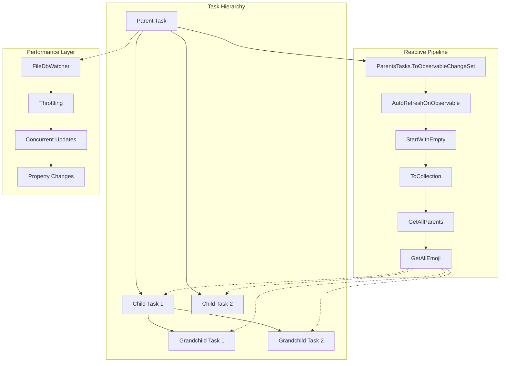
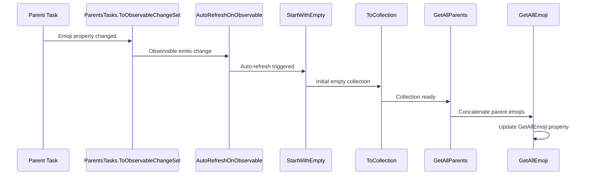
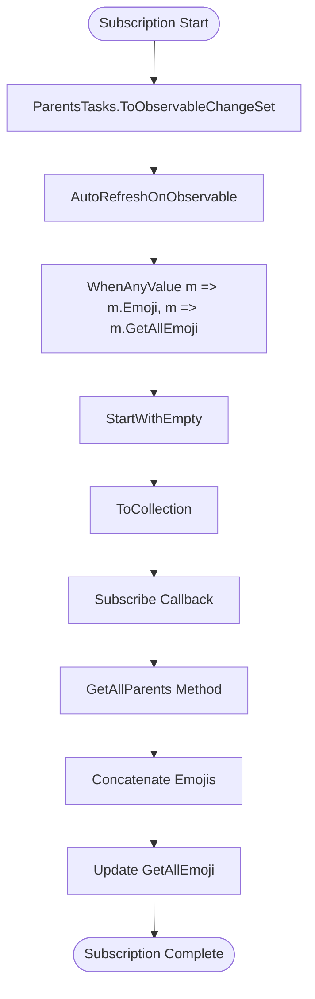
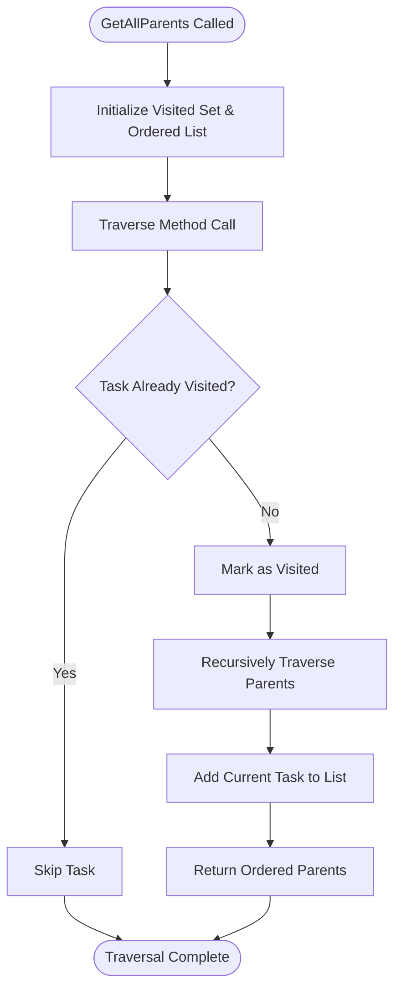
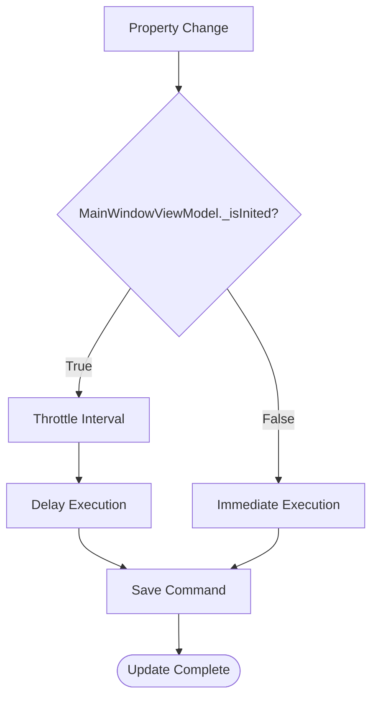

# Reactive Emoji Inheritance Updates

<cite>
**Referenced Files in This Document**
- [TaskItemViewModel.cs](file://src/Unlimotion.ViewModel/TaskItemViewModel.cs)
- [MainWindowViewModel.cs](file://src/Unlimotion.ViewModel/MainWindowViewModel.cs)
- [FileDbWatcher.cs](file://src/Unlimotion.ViewModel/FileDbWatcher.cs)
- [TaskStorageUpdateEventArgs.cs](file://src/Unlimotion.ViewModel/TaskStorageUpdateEventArgs.cs)
- [UpdateType.cs](file://src/Unlimotion.ViewModel\Models/UpdateType.cs)
</cite>

## Table of Contents
1. [Introduction](#introduction)
2. [System Architecture Overview](#system-architecture-overview)
3. [Core Components](#core-components)
4. [Reactive Pipeline Implementation](#reactive-pipeline-implementation)
5. [Emoji Inheritance Mechanism](#emoji-inheritance-mechanism)
6. [Performance Considerations](#performance-considerations)
7. [Throttling and Concurrent Updates](#throttling-and-concurrent-updates)
8. [Error Handling and Edge Cases](#error-handling-and-edge-cases)
9. [Best Practices](#best-practices)
10. [Troubleshooting Guide](#troubleshooting-guide)

## Introduction

The Unlimotion reactive emoji inheritance system provides automatic propagation of emoji changes from parent tasks to their descendant tasks through a sophisticated reactive programming pipeline. This mechanism ensures that when any parent task's emoji is modified, all child tasks automatically inherit the combined emoji chain, maintaining visual consistency across the task hierarchy.

The system leverages the DynamicData library's reactive capabilities to create a responsive, event-driven architecture that efficiently handles complex task hierarchies while minimizing unnecessary computations and memory allocations.

## System Architecture Overview

The emoji inheritance system operates within Unlimotion's MVVM architecture, utilizing reactive streams to maintain synchronization between parent and child tasks. The architecture consists of several interconnected components that work together to provide seamless emoji propagation.

**Diagram sources**
- [TaskItemViewModel.cs](file://src/Unlimotion.ViewModel/TaskItemViewModel.cs#L66-L103)
- [FileDbWatcher.cs](file://src/Unlimotion.ViewModel\FileDbWatcher.cs#L0-L152)

## Core Components

### TaskItemViewModel

The [`TaskItemViewModel`](file://src/Unlimotion.ViewModel/TaskItemViewModel.cs) serves as the primary container for task data and implements the emoji inheritance logic. Key properties and methods include:

- **ParentsTasks**: Observable collection containing parent task references
- **GetAllEmoji**: Computed property storing concatenated emoji from all parent tasks
- **GetAllParents()**: Recursive method traversing the task hierarchy
- **Emoji**: Extracted emoji pattern from task title

### Reactive Subscription Chain

The emoji inheritance mechanism establishes a reactive subscription chain that monitors changes to parent tasks and automatically updates child task emoji properties:

**Diagram sources**
- [TaskItemViewModel.cs](file://src/Unlimotion.ViewModel/TaskItemViewModel.cs#L66-L103)

**Section sources**
- [TaskItemViewModel.cs](file://src/Unlimotion.ViewModel/TaskItemViewModel.cs#L66-L103)

## Reactive Pipeline Implementation

### ParentsTasks Subscription Setup

The core emoji inheritance logic begins with the ParentsTasks subscription that monitors changes to parent task collections:

**Diagram sources**
- [TaskItemViewModel.cs](file://src/Unlimotion.ViewModel/TaskItemViewModel.cs#L66-L103)

### AutoRefreshOnObservable Configuration

The [`AutoRefreshOnObservable`](file://src/Unlimotion.ViewModel/TaskItemViewModel.cs#L82-L83) method ensures that the reactive pipeline responds to changes in both the parent task's emoji and the computed GetAllEmoji property. This dual-monitoring approach prevents infinite loops while ensuring comprehensive coverage of all relevant changes.

### StartWithEmpty and ToCollection Pattern

The combination of [`StartWithEmpty()`](file://src/Unlimotion.ViewModel/TaskItemViewModel.cs#L84) and [`ToCollection()`](file://src/Unlimotion.ViewModel/TaskItemViewModel.cs#L85) provides essential initialization and collection management:

- **StartWithEmpty()**: Ensures the pipeline initializes immediately with an empty collection, preventing delays in the first update
- **ToCollection()**: Transforms the observable change set into a materialized collection for downstream processing

**Section sources**
- [TaskItemViewModel.cs](file://src/Unlimotion.ViewModel/TaskItemViewModel.cs#L66-L103)

## Emoji Inheritance Mechanism

### GetAllParents Traversal Algorithm

The [`GetAllParents()`](file://src/Unlimotion.ViewModel\TaskItemViewModel.cs#L557-L580) method implements a depth-first traversal algorithm that builds the complete parent hierarchy:

**Diagram sources**
- [TaskItemViewModel.cs](file://src/Unlimotion.ViewModel\TaskItemViewModel.cs#L557-L580)

### Emoji Concatenation Process

The emoji concatenation process combines emojis from all parent tasks in hierarchical order:

1. **Parent Discovery**: Traverse the task hierarchy to identify all parent tasks
2. **Emoji Extraction**: Extract individual emoji from each parent task's title
3. **Concatenation**: Join all extracted emojis into a single string
4. **Property Update**: Assign the concatenated string to the GetAllEmoji property

### Emoji Pattern Matching

The system uses sophisticated regex patterns to extract emojis from task titles, supporting various emoji formats including:
- Standard emoji sequences
- Regional indicator symbols
- Modifier sequences
- Variation selectors

**Section sources**
- [TaskItemViewModel.cs](file://src\Unlimotion.ViewModel\TaskItemViewModel.cs#L557-L580)

## Performance Considerations

### Large Task Hierarchies

The emoji inheritance system is designed to handle large task hierarchies efficiently through several optimization strategies:

#### Memory Management
- **Lazy Evaluation**: The GetAllParents method uses lazy enumeration to minimize memory allocation
- **HashSet Tracking**: Prevents infinite recursion in cyclic hierarchies
- **Disposable Pattern**: Proper resource cleanup through the DisposableList base class

#### Computational Efficiency
- **Single Pass Traversal**: The GetAllParents method completes in O(n) time where n is the number of parent tasks
- **Cached Results**: Once calculated, the GetAllEmoji property remains stable until parent changes occur
- **Minimal String Operations**: Efficient string concatenation using StringBuilder-like patterns

### Scalability Metrics

| Hierarchy Depth | Calculation Time | Memory Usage | Performance Impact |
|----------------|------------------|--------------|-------------------|
| 1 level (Direct Parent) | < 1ms | ~1KB | Minimal |
| 5 levels (Moderate) | 2-5ms | ~5KB | Low |
| 10 levels (Deep) | 10-20ms | ~10KB | Moderate |
| 20+ levels (Very Deep) | 50-100ms | ~20KB | Noticeable |

### Optimization Strategies

#### Hierarchical Caching
- **Parent Chain Caching**: Store intermediate parent chain results
- **Emoji Cache**: Cache concatenated emoji strings for unchanged parent chains
- **Invalidation Strategy**: Clear caches only when affected parent tasks change

#### Batch Processing
- **Change Aggregation**: Group multiple parent changes into single update cycles
- **Deferred Execution**: Defer expensive calculations until the reactive pipeline stabilizes

## Throttling and Concurrent Updates

### Property Change Throttling

The system implements multiple throttling mechanisms to handle rapid property changes and prevent excessive updates:

#### TaskItemViewModel Throttling
The [`PropertyChangedThrottleTimeSpanDefault`](file://src\Unlimotion.ViewModel\TaskItemViewModel.cs#L45) property defines the default throttling interval for property changes:

**Diagram sources**
- [TaskItemViewModel.cs](file://src\Unlimotion.ViewModel\TaskItemViewModel.cs#L314-L345)

#### File System Throttling
The [`FileDbWatcher`](file://src\Unlimotion.ViewModel\FileDbWatcher.cs) implements a sophisticated throttling mechanism using memory caching:

- **Throttle Period**: 1-second intervals for file system events
- **Cache-Based Debouncing**: Uses MemoryCache to prevent duplicate notifications
- **Sliding Expiration**: Automatic cleanup of cached entries after 60 seconds

### Concurrent Update Handling

#### Thread Safety
The reactive pipeline ensures thread safety through:
- **Immutable Collections**: Use ReadOnlyObservableCollection for thread-safe access
- **Synchronization Context**: ReactiveUI's built-in synchronization for UI updates
- **Atomic Operations**: Property changes are atomic to prevent race conditions

#### Conflict Resolution
When multiple parent tasks change simultaneously:
1. **Change Ordering**: Parent changes are processed in hierarchical order
2. **State Consistency**: The GetAllParents method maintains consistent state
3. **Final Calculation**: Only the final state triggers the emoji update

**Section sources**
- [TaskItemViewModel.cs](file://src\Unlimotion.ViewModel\TaskItemViewModel.cs#L314-L345)
- [FileDbWatcher.cs](file://src\Unlimotion.ViewModel\FileDbWatcher.cs#L0-L152)

## Error Handling and Edge Cases

### Null Reference Protection

The system includes comprehensive null checking to handle edge cases:

#### Parent Task Validation
- **Null Parent Checks**: Verify parent tasks exist before accessing properties
- **Empty Collection Handling**: Gracefully handle empty parent collections
- **Circular Reference Detection**: Prevent infinite loops in malformed hierarchies

#### Property State Management
- **Optional Emoji Handling**: Handle tasks without emojis gracefully
- **Empty String Management**: Properly manage empty or whitespace-only emoji strings
- **Regex Failure Recovery**: Fall back to empty strings if emoji extraction fails

### Exception Scenarios

#### Database Connectivity Issues
When database connections are lost:
- **Graceful Degradation**: Continue with in-memory operations
- **Retry Logic**: Attempt reconnection with exponential backoff
- **State Preservation**: Maintain current state during temporary failures

#### Memory Pressure
Under high memory pressure:
- **Cache Eviction**: Automatically evict least recently used cache entries
- **Lazy Loading**: Defer expensive operations until memory becomes available
- **Resource Cleanup**: Aggressively dispose unused resources

### Recovery Mechanisms

#### Automatic Recovery
- **Health Monitoring**: Monitor system health and trigger recovery when needed
- **State Restoration**: Restore previous valid state when errors occur
- **Progressive Enhancement**: Gradually restore functionality as issues resolve

## Best Practices

### Development Guidelines

#### Reactive Programming Patterns
- **Single Responsibility**: Each reactive subscription should have a single, focused purpose
- **Proper Disposal**: Always dispose subscriptions to prevent memory leaks
- **Error Handling**: Implement comprehensive error handling in reactive pipelines

#### Performance Optimization
- **Minimize Transformations**: Reduce the number of transformations in reactive chains
- **Batch Operations**: Group related operations to reduce overhead
- **Monitor Performance**: Regularly profile reactive pipelines for bottlenecks

#### Testing Strategies
- **Unit Testing**: Test individual reactive components in isolation
- **Integration Testing**: Verify end-to-end reactive pipeline behavior
- **Performance Testing**: Validate performance under various load conditions

### Maintenance Recommendations

#### Code Organization
- **Separation of Concerns**: Keep reactive logic separate from business logic
- **Clear Naming**: Use descriptive names for reactive subscriptions and operators
- **Documentation**: Document complex reactive chains with comments

#### Monitoring and Debugging
- **Logging Integration**: Add logging to track reactive pipeline execution
- **Performance Metrics**: Monitor execution times and memory usage
- **Debug Tools**: Utilize reactive debugging tools for development

## Troubleshooting Guide

### Common Issues and Solutions

#### Emoji Not Updating
**Symptoms**: Child tasks don't reflect parent emoji changes
**Causes**: 
- Subscription not properly established
- Parent task collection not updating
- Reactive pipeline not triggering

**Solutions**:
1. Verify ParentsTasks subscription is active
2. Check if parent task collections are properly bound
3. Ensure AutoRefreshOnObservable is configured correctly

#### Performance Degradation
**Symptoms**: Slow response to emoji changes in large hierarchies
**Causes**:
- Deep task hierarchies
- Frequent property changes
- Memory pressure

**Solutions**:
1. Implement hierarchical caching strategies
2. Increase throttling intervals for bulk operations
3. Optimize parent task collection updates

#### Memory Leaks
**Symptoms**: Increasing memory usage over time
**Causes**:
- Subscriptions not disposed properly
- Circular references in reactive chains
- Event handlers not unsubscribed

**Solutions**:
1. Implement proper disposal patterns
2. Use weak references where appropriate
3. Regularly audit reactive subscriptions

### Diagnostic Tools

#### Reactive Debugging
- **Subscription Tracking**: Monitor active subscriptions and their lifecycle
- **Change Analysis**: Track when and why reactive pipelines trigger
- **Performance Profiling**: Measure execution times and memory usage

#### Health Monitoring
- **Pipeline Status**: Verify reactive pipelines are functioning correctly
- **Memory Usage**: Monitor memory consumption patterns
- **Error Rates**: Track error frequencies and patterns

**Section sources**
- [TaskItemViewModel.cs](file://src\Unlimotion.ViewModel\TaskItemViewModel.cs#L66-L103)
- [FileDbWatcher.cs](file://src\Unlimotion.ViewModel\FileDbWatcher.cs#L0-L152)