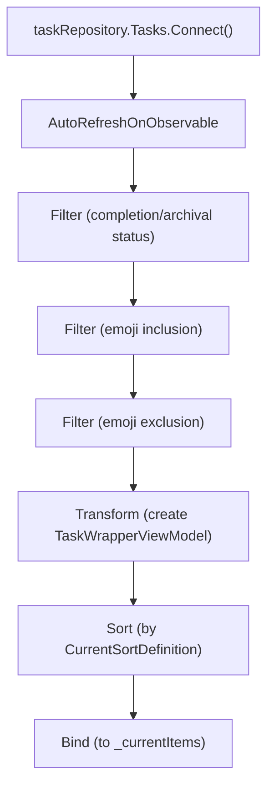
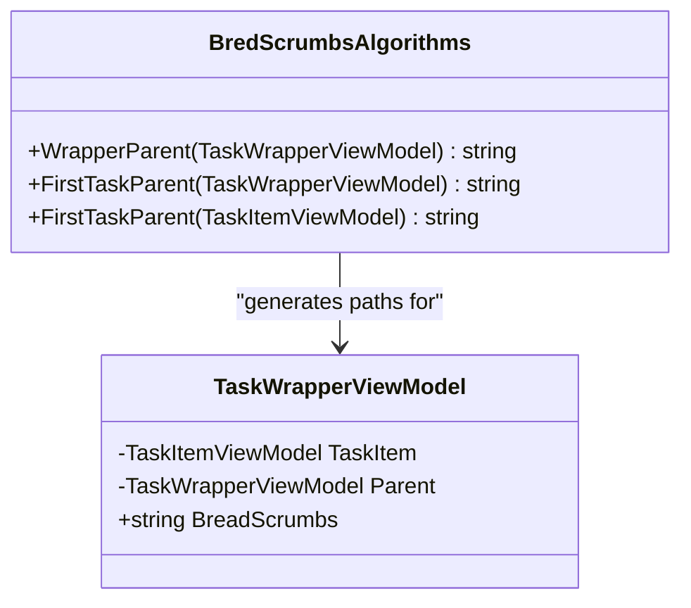

# All Tasks View

<cite>
**Referenced Files in This Document**   
- [MainWindowViewModel.cs](file://src/Unlimotion.ViewModel/MainWindowViewModel.cs)
- [TaskWrapperViewModel.cs](file://src/Unlimotion.ViewModel/TaskWrapperViewModel.cs)
- [SortDefinition.cs](file://src/Unlimotion.ViewModel/SortDefinition.cs)
</cite>

## Table of Contents
1. [Introduction](#introduction)
2. [CurrentItems Collection Population](#currentitems-collection-population)
3. [Reactive Filtering Pipeline](#reactive-filtering-pipeline)
4. [Sorting Mechanism and Persistence](#sorting-mechanism-and-persistence)
5. [Breadcrumb Integration](#breadcrumb-integration)
6. [Common Issues and Troubleshooting](#common-issues-and-troubleshooting)
7. [Conclusion](#conclusion)

## Introduction
The All Tasks view in Unlimotion provides a comprehensive interface for managing root-level tasks. This document details how the CurrentItems collection in MainWindowViewModel is populated and maintained through a reactive pipeline using DynamicData. The view supports various filtering options including completion status, archival status, emoji inclusion/exclusion, and parent relationships. The implementation leverages reactive programming principles to ensure real-time updates as tasks are added, modified, or removed from the system.

## CurrentItems Collection Population
The CurrentItems collection is populated by filtering root-level tasks based on multiple criteria including completion status, archival status, emoji inclusion/exclusion, and parent relationships. The collection is specifically designed to display tasks that have no parents (root tasks) while applying various user-configurable filters.

The population process begins with connecting to the task repository and establishing a reactive pipeline that monitors changes to tasks. Root tasks are identified by checking if their Parents collection is empty. The filtering process evaluates each task against the current filter settings, which include:

- Completion status (show/hide completed tasks)
- Archival status (show/hide archived tasks) 
- Emoji-based filtering (include/exclude tasks with specific emojis)
- Parent relationship (only root-level tasks)

**Section sources**
- [MainWindowViewModel.cs](file://src/Unlimotion.ViewModel/MainWindowViewModel.cs#L799-L850)

## Reactive Filtering Pipeline
The CurrentItems collection is maintained through a sophisticated reactive pipeline using DynamicData operators. This pipeline ensures that the collection is automatically updated in real-time as tasks are added, updated, or removed from the system.

The core reactive pipeline for the CurrentItems collection uses several DynamicData operators:



**Diagram sources**
- [MainWindowViewModel.cs](file://src/Unlimotion.ViewModel/MainWindowViewModel.cs#L799-L850)

The pipeline begins with Connect() which establishes a connection to the task repository's observable collection. AutoRefreshOnObservable is used to automatically refresh the collection when relevant properties change, such as parent relationships or completion status. Multiple Filter operators are applied sequentially to include only tasks that match the current filter criteria. The Transform operator converts each TaskItemViewModel into a TaskWrapperViewModel, which provides additional functionality like hierarchical navigation. Finally, the Sort operator arranges tasks according to the current sorting definition, and Bind connects the resulting collection to the _currentItems field.

Key operators in the pipeline:
- **AutoRefreshOnObservable**: Monitors changes to task properties and parent relationships, triggering updates when changes occur
- **Filter**: Applies predicate functions to include or exclude tasks based on various criteria
- **Transform**: Converts TaskItemViewModel instances into TaskWrapperViewModel instances for enhanced functionality
- **Sort**: Orders tasks according to the current sorting definition

**Section sources**
- [MainWindowViewModel.cs](file://src/Unlimotion.ViewModel/MainWindowViewModel.cs#L799-L850)

## Sorting Mechanism and Persistence
Sorting in the All Tasks view is configurable and persists between application sessions. The sorting mechanism is implemented using the SortDefinition class, which defines various sorting options available to users.

The CurrentItems collection uses the CurrentSortDefinition property to determine the sorting order. This property is initialized from configuration settings when the application starts:

```csharp
var sortName = _configuration?.GetSection("AllTasks:CurrentSortDefinition").Get<string>();
CurrentSortDefinition = SortDefinitions.FirstOrDefault(s => s.Name == sortName) ?? SortDefinitions.First();
```

The SortDefinition class provides multiple sorting options including:
- Created Ascending/Descending
- Unlocked Ascending/Descending  
- Completed Ascending/Descending
- Title Ascending/Descending
- Importance Ascending/Descending
- Planned dates and duration sorting

When the user changes the sorting preference, the selection is persisted to configuration:

```csharp
this.WhenAnyValue(m => m.CurrentSortDefinition)
    .Subscribe(b => _configuration?.GetSection("AllTasks:CurrentSortDefinition").Set(b.Name))
    .AddToDispose(this);
```

The sorting is implemented using DynamicData's Sort operator with SortExpressionComparer, which allows for complex multi-property sorting logic. The reactive nature of the pipeline ensures that whenever the CurrentSortDefinition changes, the collection is automatically re-sorted.

**Section sources**
- [MainWindowViewModel.cs](file://src/Unlimotion.ViewModel/MainWindowViewModel.cs#L25-L30)
- [SortDefinition.cs](file://src/Unlimotion.ViewModel/SortDefinition.cs#L10-L238)

## Breadcrumb Integration
The All Tasks view integrates with the breadcrumb system through the BredScrumbsAlgorithms.WrapperParent method. This integration provides hierarchical navigation and context for tasks within the application.

The BredScrumbsAlgorithms class contains the WrapperParent method that generates breadcrumb paths for tasks:



**Diagram sources**
- [TaskWrapperViewModel.cs](file://src/Unlimotion.ViewModel/TaskWrapperViewModel.cs#L22-L53)

The WrapperParent method traverses the parent chain of a TaskWrapperViewModel, collecting titles from each ancestor and joining them with " / " separators. This creates a breadcrumb path that shows the hierarchical context of a task. The method is used in the TaskWrapperViewModel's BreadScrumbs property, which is bound to the UI for display.

The integration allows users to understand the hierarchical relationships between tasks and navigate through the task structure efficiently. When a task is selected in the All Tasks view, the breadcrumb path provides context about its position in the overall task hierarchy.

**Section sources**
- [TaskWrapperViewModel.cs](file://src/Unlimotion.ViewModel/TaskWrapperViewModel.cs#L22-L53)

## Common Issues and Troubleshooting
Users may encounter issues with tasks not appearing in the All Tasks view. These issues are typically related to filter settings or task hierarchy configuration.

### Tasks Not Appearing in View
When tasks don't appear in the All Tasks view, consider the following troubleshooting steps:

1. **Check Completion Status Filter**: Verify that the "Show Completed" setting matches your expectations. If ShowCompleted is false, completed tasks will be filtered out.

2. **Check Archival Status Filter**: Verify that the "Show Archived" setting is configured correctly. If ShowArchived is false, archived tasks (where IsCompleted is null) will be hidden.

3. **Verify Root-Level Status**: The All Tasks view only shows root-level tasks (tasks with no parents). If a task has parents, it won't appear in this view. Check the task's parent relationships in the task details.

4. **Check Emoji Filters**: If emoji filters are active, tasks may be hidden based on their emoji content. Verify the emoji inclusion and exclusion settings.

5. **Validate Task Hierarchy**: Ensure the task is properly configured in the hierarchy. Tasks that are children of other tasks won't appear in the All Tasks view.

### Debugging Steps
1. Temporarily disable all filters to see if the task appears
2. Check the task's IsCompleted and IsArchived properties
3. Verify the task has no parents (Parents collection is empty)
4. Confirm the task exists in the underlying data store
5. Check for any error messages in the application logs

The reactive nature of the pipeline means that any changes to task properties or filter settings should immediately update the view. If updates aren't reflecting, restart the application to ensure all reactive connections are properly established.

**Section sources**
- [MainWindowViewModel.cs](file://src/Unlimotion.ViewModel/MainWindowViewModel.cs#L799-L850)

## Conclusion
The All Tasks view in Unlimotion implements a robust and reactive system for displaying and managing root-level tasks. Through the use of DynamicData operators, the CurrentItems collection maintains real-time accuracy as tasks are modified. The filtering pipeline supports multiple criteria including completion status, archival status, and emoji-based filtering, while the sorting mechanism provides flexible organization options that persist between sessions. Integration with the breadcrumb system through BredScrumbsAlgorithms.WrapperParent enhances navigation and context awareness. Understanding the reactive pipeline and filter logic is essential for troubleshooting display issues and ensuring tasks appear as expected in the view.