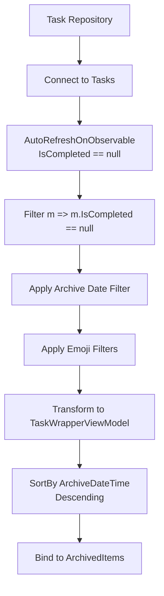
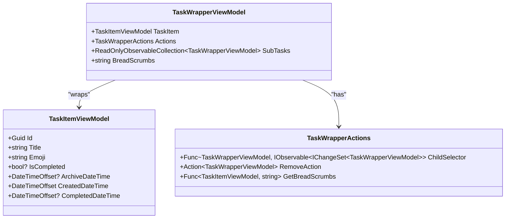
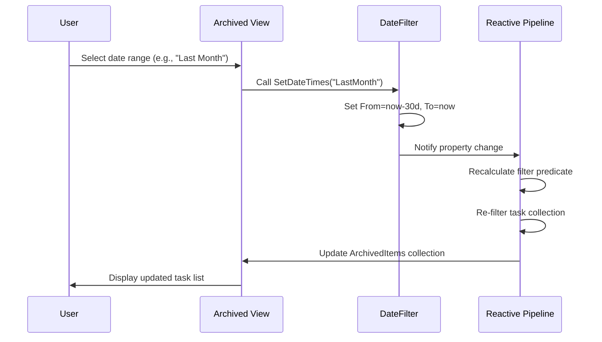

# Archived View

<cite>
**Referenced Files in This Document**   
- [MainWindowViewModel.cs](file://src/Unlimotion.ViewModel/MainWindowViewModel.cs)
- [DateFilter.cs](file://src/Unlimotion.ViewModel/DateFilter.cs)
- [TaskItemViewModel.cs](file://src/Unlimotion.ViewModel/TaskItemViewModel.cs)
</cite>

## Table of Contents
1. [Introduction](#introduction)
2. [ArchivedItems Collection Creation](#archiveditems-collection-creation)
3. [Reactive Data Binding](#reactive-data-binding)
4. [Transform and Sort Operations](#transform-and-sort-operations)
5. [Filtering Behavior](#filtering-behavior)
6. [Date Range Customization](#date-range-customization)
7. [Common Issues and Solutions](#common-issues-and-solutions)
8. [Conclusion](#conclusion)

## Introduction
The Archived View in Unlimotion provides users with a dedicated interface for managing tasks that have been archived. This view displays tasks that are in the archived state (where IsCompleted is null) and offers various filtering options including date ranges and emoji-based filters. The view is designed with reactive programming principles to ensure real-time updates when tasks are archived or unarchived.

**Section sources**
- [MainWindowViewModel.cs](file://src/Unlimotion.ViewModel/MainWindowViewModel.cs#L21-L1062)

## ArchivedItems Collection Creation
The ArchivedItems collection is created through a reactive data pipeline that filters tasks based on their archival status. The core filtering logic identifies tasks where IsCompleted == null, which represents the archived state in Unlimotion's data model. This filtering is implemented using DynamicData library's Filter operator, which creates a live collection that automatically updates as tasks change state.

The collection creation process begins with connecting to the task repository's Tasks observable collection. It then applies AutoRefreshOnObservable to monitor changes to the IsCompleted property of each task, ensuring the view updates in real-time when tasks are archived or unarchived.

**Diagram sources**
- [MainWindowViewModel.cs](file://src/Unlimotion.ViewModel/MainWindowViewModel.cs#L900-L920)

**Section sources**
- [MainWindowViewModel.cs](file://src/Unlimotion.ViewModel/MainWindowViewModel.cs#L900-L920)

## Reactive Data Binding
The Archived View implements reactive data binding to ensure real-time updates when tasks are archived or unarchived. This is achieved through the use of ReactiveUI and DynamicData libraries, which provide observable collections and reactive programming patterns.

The view establishes a connection to the task repository's Tasks collection and applies AutoRefreshOnObservable to monitor changes to the IsCompleted property. When a task's IsCompleted property changes to null (archived) or from null (unarchived), the observable pipeline automatically updates the ArchivedItems collection without requiring manual refresh operations.

The reactive binding also extends to filter changes. When users modify the date range or emoji filters, the corresponding observables trigger updates to the filtering predicates, which are then applied to the task collection. This creates a seamless user experience where the view updates immediately in response to both data changes and user interactions.

**Section sources**
- [MainWindowViewModel.cs](file://src/Unlimotion.ViewModel/MainWindowViewModel.cs#L895-L920)

## Transform and Sort Operations
The Archived View applies two key operations to the filtered task collection: Transform and SortBy. The Transform operation wraps each archived task in a TaskWrapperViewModel, which provides additional functionality and properties needed for display in the view. This wrapper includes actions for child selection, removal, and breadcrumb generation, creating a consistent interface for task manipulation.

The SortBy operation orders the archived tasks by their archive date in descending order, ensuring that the most recently archived tasks appear at the top of the list. This is implemented using SortBy(m => m.TaskItem.ArchiveDateTime, SortDirection.Descending), which leverages the ArchiveDateTime property of the TaskItemViewModel.

**Diagram sources**
- [MainWindowViewModel.cs](file://src/Unlimotion.ViewModel/MainWindowViewModel.cs#L910-L915)
- [TaskItemViewModel.cs](file://src/Unlimotion.ViewModel/TaskItemViewModel.cs)

**Section sources**
- [MainWindowViewModel.cs](file://src/Unlimotion.ViewModel/MainWindowViewModel.cs#L910-L915)

## Filtering Behavior
The Archived View implements a multi-layered filtering system that differs from other views in Unlimotion. The primary filter identifies tasks in the archived state (IsCompleted == null). This is combined with date range filtering through the ArchivedDateFilter and emoji-based filtering.

The date range filtering is implemented as a reactive observable that responds to changes in the ArchivedDateFilter's From and To properties. The filter predicate compares the task's ArchiveDateTime with the selected date range, taking into account the user's local time zone offset.

Emoji-based filtering allows users to show or hide tasks based on their emoji tags. The view creates emoji filters by grouping tasks by their emoji property and provides controls to toggle visibility for each emoji category. These filters are applied in addition to the date range filter, allowing for precise task selection.

**Section sources**
- [MainWindowViewModel.cs](file://src/Unlimotion.ViewModel/MainWindowViewModel.cs#L895-L920)
- [DateFilter.cs](file://src/Unlimotion.ViewModel/DateFilter.cs#L10-L75)

## Date Range Customization
Users can customize the date range for the Archived View through the ArchivedDateFilter property. The filter provides predefined options such as "Today," "Last Week," "Last Month," and "All Time," as well as a custom range option for specifying exact dates.

The DateFilter class implements the SetDateTimes method, which configures the From and To properties based on the selected option. For example, selecting "Last Week" sets the From date to seven days ago and the To date to today. The filter also supports custom date ranges, allowing users to select specific start and end dates.

When the date filter changes, the view automatically updates through reactive bindings. The archiveDateFilter observable, created with WhenAnyValue, responds to changes in the ArchivedDateFilter properties and reapplies the filtering predicate to the task collection.

**Diagram sources**
- [DateFilter.cs](file://src/Unlimotion.ViewModel/DateFilter.cs#L25-L70)
- [MainWindowViewModel.cs](file://src/Unlimotion.ViewModel/MainWindowViewModel.cs#L880-L890)

**Section sources**
- [DateFilter.cs](file://src/Unlimotion.ViewModel/DateFilter.cs#L10-L75)
- [MainWindowViewModel.cs](file://src/Unlimotion.ViewModel/MainWindowViewModel.cs#L880-L890)

## Common Issues and Solutions
Users may encounter several common issues with the Archived View, primarily related to missing archived tasks or unexpected filtering behavior.

**Missing Archived Tasks**: This typically occurs when the date filter is set to a range that doesn't include the archive dates of existing tasks. For example, if all archived tasks were archived more than a month ago but the filter is set to "Last Month," no tasks will be displayed. The solution is to either adjust the date range to "All Time" or select a broader predefined range.

**Tasks Not Appearing When Archived**: This issue may occur if the task's ArchiveDateTime is not properly set when IsCompleted is set to null. Ensure that the archiving process correctly sets the ArchiveDateTime property. The reactive pipeline depends on both IsCompleted == null and a valid ArchiveDateTime for proper filtering and sorting.

**Emoji Filters Hiding Expected Tasks**: When emoji filters are active, they can override the date filtering. Check that the relevant emoji filters are enabled (ShowTasks == true) for the emoji categories you want to display.

**Performance Issues with Large Archives**: For users with many archived tasks, the view may experience performance issues. Consider implementing virtualization or additional filtering criteria to reduce the number of displayed items.

**Section sources**
- [MainWindowViewModel.cs](file://src/Unlimotion.ViewModel/MainWindowViewModel.cs#L880-L920)
- [DateFilter.cs](file://src/Unlimotion.ViewModel/DateFilter.cs#L10-L75)

## Conclusion
The Archived View in Unlimotion provides a comprehensive solution for managing archived tasks through a reactive, filterable interface. By leveraging the IsCompleted == null state to identify archived tasks, applying date range filtering via ArchivedDateFilter, and incorporating emoji-based filters, the view offers flexible task organization. The reactive data binding ensures real-time updates when tasks are archived or unarchived, while the Transform and SortBy operations provide a consistent, chronologically ordered presentation. Users can customize their experience through adjustable date ranges and emoji filters, with solutions available for common issues related to task visibility and filtering behavior.