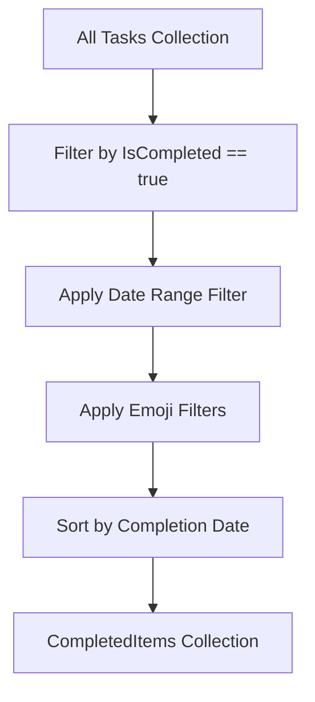
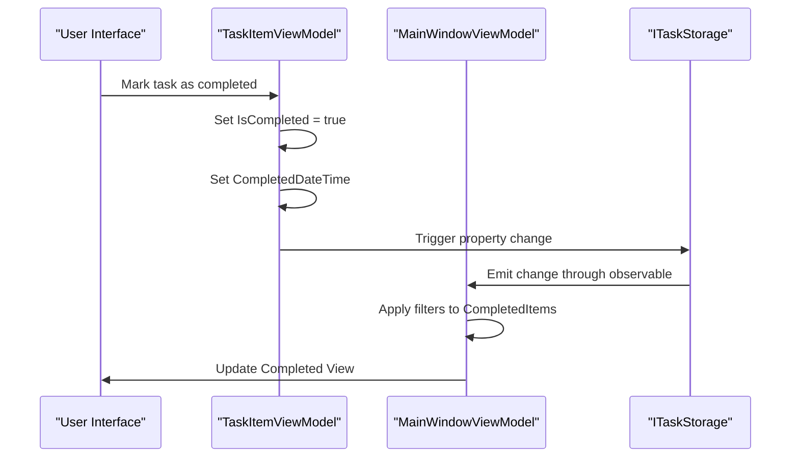
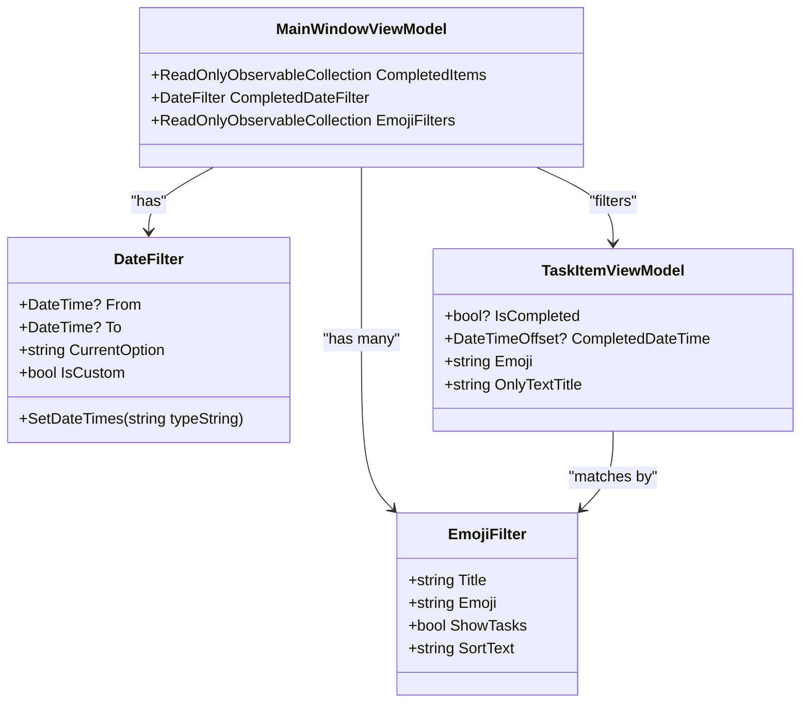
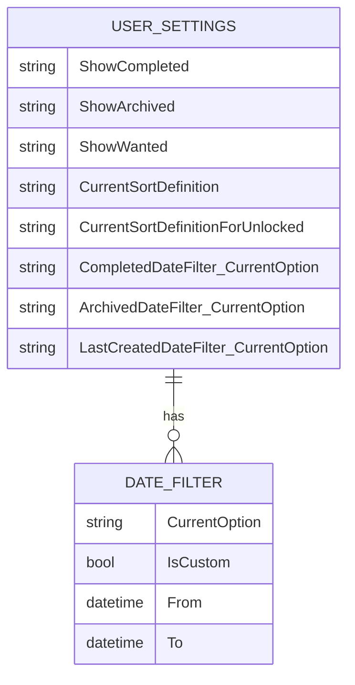

# Completed View

<cite>
**Referenced Files in This Document**   
- [MainWindowViewModel.cs](file://src/Unlimotion.ViewModel/MainWindowViewModel.cs)
- [TaskItemViewModel.cs](file://src/Unlimotion.ViewModel/TaskItemViewModel.cs)
- [DateFilter.cs](file://src/Unlimotion.ViewModel/DateFilter.cs)
- [Options.cs](file://src/Unlimotion.ViewModel/Options.cs)
- [TaskWrapperViewModel.cs](file://src/Unlimotion.ViewModel/TaskWrapperViewModel.cs)
- [ITaskStorage.cs](file://src/Unlimotion.ViewModel/ITaskStorage.cs)
</cite>

## Table of Contents
1. [Introduction](#introduction)
2. [CompletedItems Collection Population](#completeditems-collection-population)
3. [Reactive Pipeline and State Management](#reactive-pipeline-and-state-management)
4. [Sorting and Filtering Mechanisms](#sorting-and-filtering-mechanisms)
5. [Configuration and Persistence](#configuration-and-persistence)
6. [Troubleshooting Guide](#troubleshooting-guide)
7. [Conclusion](#conclusion)

## Introduction
The Completed View in Unlimotion provides users with a dedicated interface for tracking and reviewing tasks that have been marked as completed. This view offers comprehensive filtering capabilities, including date range filtering and emoji-based filtering, while maintaining its own independent state separate from other views. The implementation leverages reactive programming patterns to ensure real-time updates when tasks are completed, providing a seamless user experience. This documentation details the architecture, functionality, and configuration of the Completed View, addressing both technical implementation and user-facing features.

## CompletedItems Collection Population
The CompletedItems collection is populated through a reactive pipeline that filters tasks based on their completion status and applies additional filtering criteria. The core filtering logic identifies tasks where the IsCompleted property equals true, ensuring only genuinely completed tasks appear in the view. This filtering occurs within the MainWindowViewModel's initialization process, where the task repository's observable collection is transformed into the CompletedItems collection.

The population process begins with the Tasks collection from the ITaskStorage interface, which maintains a SourceCache of all TaskItemViewModel instances. The CompletedItems collection is created by connecting to this source and applying a series of filters. First, the AutoRefreshOnObservable operator monitors changes to the IsCompleted property, ensuring the view updates immediately when a task's completion status changes. Then, a primary filter selects only tasks where IsCompleted == true, effectively creating a subset of completed tasks.

**Diagram sources**
- [MainWindowViewModel.cs](file://src/Unlimotion.ViewModel/MainWindowViewModel.cs#L963-L980)

**Section sources**
- [MainWindowViewModel.cs](file://src/Unlimotion.ViewModel/MainWindowViewModel.cs#L963-L980)
- [TaskItemViewModel.cs](file://src/Unlimotion.ViewModel/TaskItemViewModel.cs#L250-L255)

## Reactive Pipeline and State Management
The Completed View implements a reactive pipeline that automatically updates when tasks are marked as completed, leveraging the DynamicData library's observable collection patterns. This reactive architecture ensures that the view remains synchronized with the underlying data model without requiring manual refresh operations. The pipeline is established during the MainWindowViewModel initialization, where multiple observable sequences are composed to create the final CompletedItems collection.

When a user marks a task as completed, the TaskItemViewModel's IsCompleted property change triggers a cascade of updates through the reactive pipeline. The WhenAnyValue operator in the MainWindowViewModel subscribes to changes in the IsCompleted property, which then propagates through the AutoRefreshOnObservable operator in the task repository's connection. This creates a real-time update mechanism where completed tasks immediately appear in the CompletedItems collection, while simultaneously being removed from other views like the Unlocked view.

The view maintains its state independently of other views through dedicated filtering and sorting configurations. Unlike other views that may share certain filtering parameters, the Completed View has its own instance of the CompletedDateFilter and maintains separate sorting preferences. This independence ensures that user interactions in the Completed View, such as changing the date range or sorting order, do not affect the presentation of tasks in other views.

**Diagram sources**
- [MainWindowViewModel.cs](file://src/Unlimotion.ViewModel/MainWindowViewModel.cs#L963-L980)
- [TaskItemViewModel.cs](file://src/Unlimotion.ViewModel/TaskItemViewModel.cs#L250-L255)

**Section sources**
- [MainWindowViewModel.cs](file://src/Unlimotion.ViewModel/MainWindowViewModel.cs#L554-L561)
- [TaskItemViewModel.cs](file://src/Unlimotion.ViewModel/TaskItemViewModel.cs#L250-L255)

## Sorting and Filtering Mechanisms
The Completed View implements sophisticated sorting and filtering mechanisms to help users organize and locate completed tasks efficiently. The primary sorting operation orders tasks by completion date in descending order, ensuring the most recently completed tasks appear at the top of the list. This sorting is implemented using the SortBy operator with the TaskItem.CompletedDateTime property and SortDirection.Descending parameter, creating a chronological reverse order that prioritizes recent accomplishments.

Date range filtering is managed through the CompletedDateFilter property in the MainWindowViewModel, which provides users with predefined time periods such as "Today," "This Week," "This Month," and custom date ranges. The DateFilter class contains the logic for converting these named periods into actual date ranges by calculating appropriate From and To values based on the current date. When a user selects a date range option, the SetDateTimes method is called to update the filter's date boundaries, which then triggers a re-evaluation of the task collection.

Emoji-based filtering allows users to organize completed tasks by visual markers present in task titles. The system extracts emoji characters from task titles using a comprehensive regular expression pattern and creates EmojiFilter instances for each unique emoji found in the task collection. Users can then show or hide tasks containing specific emojis, enabling visual categorization of completed work. The filtering system supports both inclusion (show tasks with specific emojis) and exclusion (hide tasks with specific emojis) modes.

**Diagram sources**
- [MainWindowViewModel.cs](file://src/Unlimotion.ViewModel/MainWindowViewModel.cs#L1034)
- [DateFilter.cs](file://src/Unlimotion.ViewModel/DateFilter.cs#L4-L75)
- [TaskItemViewModel.cs](file://src/Unlimotion.ViewModel/TaskItemViewModel.cs#L650-L655)

**Section sources**
- [MainWindowViewModel.cs](file://src/Unlimotion.ViewModel/MainWindowViewModel.cs#L975-L980)
- [DateFilter.cs](file://src/Unlimotion.ViewModel/DateFilter.cs#L4-L75)
- [Options.cs](file://src/Unlimotion.ViewModel/Options.cs#L4-L34)

## Configuration and Persistence
The Completed View's filtering options and user preferences are persisted in the application configuration, ensuring that user settings are maintained across sessions. The configuration system leverages the Microsoft.Extensions.Configuration interface to store and retrieve view-specific settings, with filtering options serialized to the application's configuration file. This persistence mechanism allows users to customize their experience and return to their preferred filtering state without reconfiguration.

The ShowCompleted, ShowArchived, and ShowWanted settings are stored in the "AllTasks" configuration section, with boolean values indicating whether each category should be displayed. These settings are automatically synchronized with the UI through reactive subscriptions in the MainWindowViewModel constructor, where WhenAnyValue operators monitor property changes and update the configuration accordingly. Similarly, the CurrentSortDefinition is persisted by storing the sort name in the configuration, allowing users to return to their preferred sorting order.

Date filter configurations are persisted through the CurrentOption property of the DateFilter class, which stores the selected time period name (e.g., "Today," "Week," "Month"). When the application starts, these saved options are retrieved from configuration and applied to the corresponding date filters, restoring the user's previous filtering state. The IsCustom flag indicates whether the user has defined a custom date range, which would require additional persistence of the specific From and To dates.

**Diagram sources**
- [MainWindowViewModel.cs](file://src/Unlimotion.ViewModel/MainWindowViewModel.cs#L15-L25)
- [ClientSettings.cs](file://src/Unlimotion/ClientSettings.cs)

**Section sources**
- [MainWindowViewModel.cs](file://src/Unlimotion.ViewModel/MainWindowViewModel.cs#L15-L25)
- [ClientSettings.cs](file://src/Unlimotion/ClientSettings.cs)

## Troubleshooting Guide
Users may encounter issues with task visibility in the Completed View, particularly related to date filter configuration and synchronization. When tasks that should be visible do not appear in the Completed View, the most common cause is an overly restrictive date filter. Users should verify that the CompletedDateFilter is set to an appropriate time range, such as "All Time" or a period that encompasses the completion dates of their tasks. The date filter dropdown provides quick access to common time periods, and users can also configure custom date ranges if needed.

Synchronization issues between the Completed View and other views can occur if the reactive pipeline is disrupted. This typically happens when there are connectivity problems with the task storage backend or when the application fails to properly initialize the observable sequences. In such cases, restarting the application usually resolves the issue by re-establishing the reactive connections. Users experiencing persistent synchronization problems should check their storage configuration and ensure that the task repository is properly connected.

For emoji filtering issues, users should verify that their task titles contain valid emoji characters as defined by the application's emoji pattern. Some special characters or custom icons may not be recognized as emojis by the filtering system. Additionally, users should ensure that the emoji filters are enabled in the UI and that the specific emojis they want to filter by are set to "Show" rather than "Hide."

When troubleshooting configuration persistence issues, users should check that their configuration file is writable and not locked by another process. The application stores user preferences in the configuration file, and permission issues can prevent settings from being saved between sessions. If settings are not persisting, users may need to check file permissions or try running the application with elevated privileges.

**Section sources**
- [MainWindowViewModel.cs](file://src/Unlimotion.ViewModel/MainWindowViewModel.cs#L554-L561)
- [TaskItemViewModel.cs](file://src/Unlimotion.ViewModel/TaskItemViewModel.cs#L250-L255)
- [DateFilter.cs](file://src/Unlimotion.ViewModel/DateFilter.cs#L4-L75)

## Conclusion
The Completed View in Unlimotion provides a robust and user-friendly interface for tracking completed tasks, leveraging reactive programming patterns to ensure real-time updates and seamless user experience. By filtering tasks based on completion status, applying date range and emoji-based filters, and sorting by completion date, the view offers powerful organizational capabilities that help users review their accomplishments and analyze their productivity patterns. The independent state management and configuration persistence ensure that users can customize their experience and maintain their preferred settings across sessions. Through its well-structured reactive pipeline and comprehensive filtering options, the Completed View serves as an essential tool for task management and productivity tracking within the Unlimotion ecosystem.