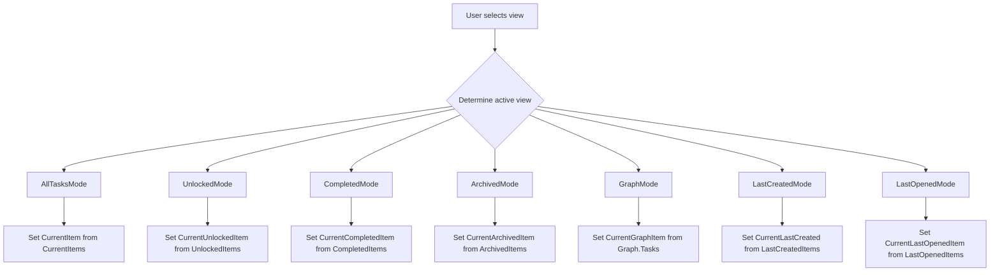
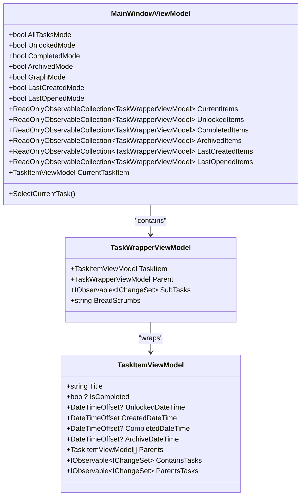
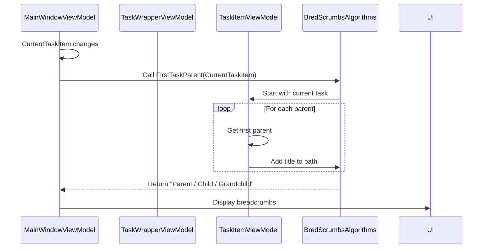

# Interface Navigation

<cite>
**Referenced Files in This Document**   
- [MainWindowViewModel.cs](file://src/Unlimotion.ViewModel/MainWindowViewModel.cs)
- [TaskWrapperViewModel.cs](file://src/Unlimotion.ViewModel/TaskWrapperViewModel.cs)
- [MainScreen.axaml](file://src/Unlimotion/Views/MainScreen.axaml)
- [MainWindow.axaml](file://src/Unlimotion/Views/MainWindow.axaml)
- [BredScrumbsAlgorithms.cs](file://src/Unlimotion.ViewModel/TaskWrapperViewModel.cs)
</cite>

## Table of Contents
1. [Introduction](#introduction)
2. [View Switching Logic](#view-switching-logic)
3. [View Collections and DynamicData Implementation](#view-collections-and-dynamicdata-implementation)
4. [Breadcrumbs System](#breadcrumbs-system)
5. [Navigation Best Practices](#navigation-best-practices)

## Introduction
The Unlimotion application provides a comprehensive navigation system that allows users to switch between different views of their task hierarchy. This document details the implementation of view switching logic in the MainWindowViewModel, explaining how reactive properties control which view is active and how each view binds to filtered collections of tasks using DynamicData. The system supports multiple navigation modes including All Tasks, Last Created, Unlocked, Completed, Archived, Roadmap (Graph), and Settings views, each providing a different perspective on the task database.

**Section sources**
- [MainWindowViewModel.cs](file://src/Unlimotion.ViewModel/MainWindowViewModel.cs#L1-L50)

## View Switching Logic

The view switching mechanism in Unlimotion is controlled by a series of boolean properties in the MainWindowViewModel class that determine which view is currently active. These properties include AllTasksMode, UnlockedMode, CompletedMode, ArchivedMode, GraphMode, LastCreatedMode, and LastOpenedMode. When a user selects a different view, the corresponding property is set to true while others are set to false, triggering the display of the appropriate task collection.

The view switching logic is implemented through reactive programming patterns using ReactiveUI. The SelectCurrentTask method is subscribed to changes in all view mode properties and automatically updates the current task selection based on the active view. This ensures that when users navigate between views, the currently selected task is properly reflected in the new context, maintaining continuity in the user experience.

**Diagram sources**
- [MainWindowViewModel.cs](file://src/Unlimotion.ViewModel/MainWindowViewModel.cs#L500-L550)

**Section sources**
- [MainWindowViewModel.cs](file://src/Unlimotion.ViewModel/MainWindowViewModel.cs#L490-L560)

## View Collections and DynamicData Implementation

Each view in Unlimotion displays a filtered collection of tasks using DynamicData, a reactive library that provides observable collections with powerful filtering, sorting, and transformation capabilities. The MainWindowViewModel maintains separate ReadOnlyObservableCollection instances for each view, including CurrentItems, UnlockedItems, CompletedItems, ArchivedItems, LastCreatedItems, and LastOpenedItems.

These collections are created through DynamicData's Connect() method, which establishes a reactive pipeline from the underlying task repository. Each pipeline applies specific filters relevant to the view. For example, the Unlocked view filters tasks based on their unlocked status and time constraints, while the Completed view shows only tasks with a completed status. The All Tasks view applies filters for completed and archived tasks based on user preferences stored in configuration.

The implementation uses Transform to wrap TaskItemViewModel instances in TaskWrapperViewModel objects, which provide additional functionality like breadcrumb generation and hierarchical navigation. Sorting is applied using SortDefinition objects that can be changed by the user, with sort preferences persisted to configuration. The reactive nature of these collections ensures they automatically update when tasks are added, removed, or modified in the repository.

**Diagram sources**
- [MainWindowViewModel.cs](file://src/Unlimotion.ViewModel/MainWindowViewModel.cs#L100-L400)
- [TaskWrapperViewModel.cs](file://src/Unlimotion.ViewModel/TaskWrapperViewModel.cs#L10-L30)

**Section sources**
- [MainWindowViewModel.cs](file://src/Unlimotion.ViewModel/MainWindowViewModel.cs#L100-L400)

## Breadcrumbs System

The breadcrumbs system in Unlimotion provides users with contextual navigation by displaying the hierarchical path to the currently selected task. This system is implemented through the BredScrumbsAlgorithms class, which contains static methods for generating breadcrumb strings from task hierarchies.

Two primary breadcrumb algorithms are implemented: WrapperParent and FirstTaskParent. The WrapperParent algorithm traverses the TaskWrapperViewModel hierarchy, while FirstTaskParent traverses the TaskItemViewModel parent relationships. Both algorithms build a path by collecting task titles from the current task up through its ancestors, then joining them with " / " separators. The breadcrumbs are exposed as a BreadScrumbs property in MainWindowViewModel, which dynamically selects the appropriate algorithm based on the current view mode.

The breadcrumbs update reactively whenever the CurrentTaskItem changes, providing real-time feedback about the user's location within the task hierarchy. This system helps users understand the context of their current task and provides a visual representation of the nested structure of their tasks, making it easier to navigate complex task relationships.

**Diagram sources**
- [MainWindowViewModel.cs](file://src/Unlimotion.ViewModel/MainWindowViewModel.cs#L580-L590)
- [TaskWrapperViewModel.cs](file://src/Unlimotion.ViewModel/TaskWrapperViewModel.cs#L22-L53)

**Section sources**
- [TaskWrapperViewModel.cs](file://src/Unlimotion.ViewModel/TaskWrapperViewModel.cs#L22-L53)
- [MainWindowViewModel.cs](file://src/Unlimotion.ViewModel/MainWindowViewModel.cs#L580-L590)

## Navigation Best Practices

To efficiently navigate between views in Unlimotion, users should understand the purpose of each view and how they complement each other. The All Tasks view provides a comprehensive overview of the task hierarchy with filtering options, making it ideal for general task management. The Unlocked view focuses on tasks that are ready to be worked on, helping users prioritize their immediate attention.

When switching between views, users should be aware that the current task selection is maintained across views when possible, allowing for seamless context switching. The Last Opened view maintains a history of recently viewed tasks, functioning as a navigation stack that enables quick return to previously accessed tasks.

For optimal navigation, users should leverage the breadcrumbs to understand task context and use the hierarchical structure to organize related tasks. The filtering and sorting options in each view can be customized and are persisted between sessions, allowing users to establish personalized workflows. When searching for specific tasks, cycling through different views may be more effective than relying on a single view, as each view applies different filters that might reveal the desired task.

**Section sources**
- [MainWindowViewModel.cs](file://src/Unlimotion.ViewModel/MainWindowViewModel.cs#L490-L560)
- [TaskWrapperViewModel.cs](file://src/Unlimotion.ViewModel/TaskWrapperViewModel.cs#L22-L53)