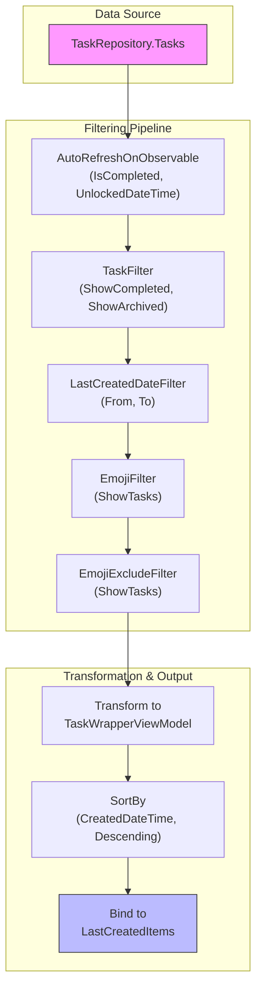
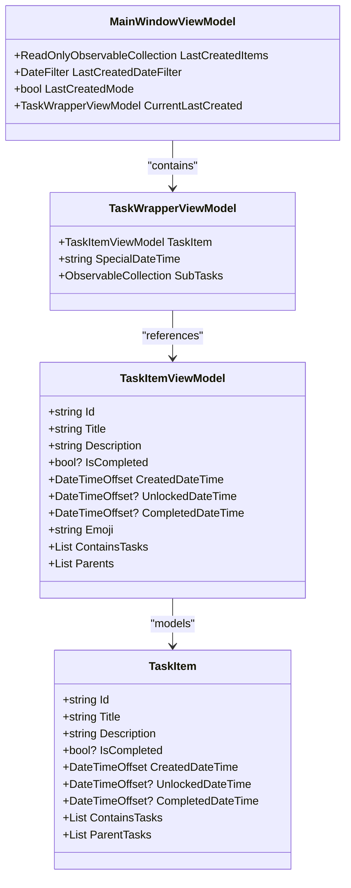
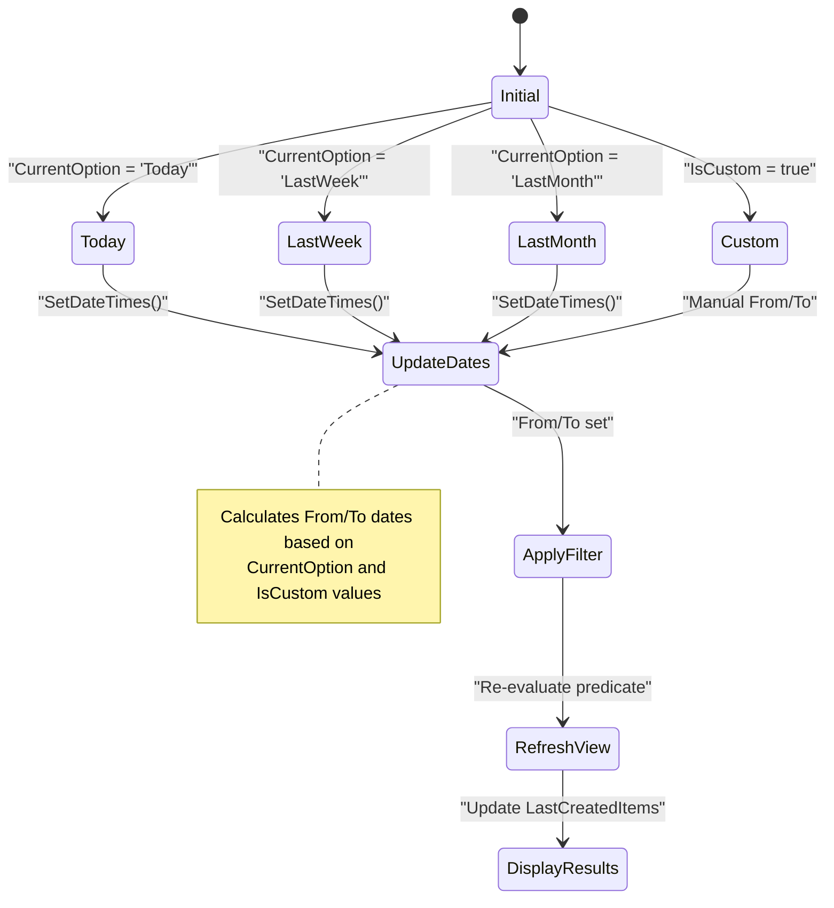
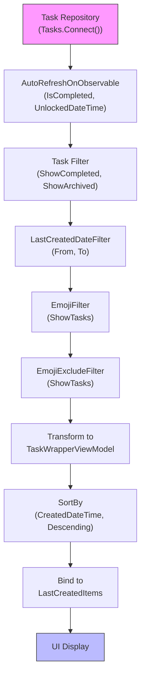

# Last Created View

<cite>
**Referenced Files in This Document**   
- [MainWindowViewModel.cs](file://src/Unlimotion.ViewModel/MainWindowViewModel.cs)
- [TaskItem.cs](file://src/Unlimotion.Domain/TaskItem.cs)
- [DateFilter.cs](file://src/Unlimotion.ViewModel/DateFilter.cs)
- [TaskWrapperViewModel.cs](file://src/Unlimotion.ViewModel/TaskWrapperViewModel.cs)
</cite>

## Table of Contents
1. [Introduction](#introduction)
2. [Core Components](#core-components)
3. [Architecture Overview](#architecture-overview)
4. [Detailed Component Analysis](#detailed-component-analysis)
5. [Filtering Logic and Reactive Pipeline](#filtering-logic-and-reactive-pipeline)
6. [Troubleshooting Guide](#troubleshooting-guide)

## Introduction
The Last Created View in Unlimotion provides users with a chronological overview of recently created tasks, enabling them to maintain context and track their most recent work. This view dynamically updates in response to task creation events and applies multiple filtering layers including date range and emoji-based filters. The implementation leverages reactive programming patterns to ensure real-time synchronization between the underlying data model and the user interface.

## Core Components
The Last Created View is built around several key components that work together to provide a responsive and filtered view of recently created tasks. The system maintains a reactive pipeline that automatically updates the view when tasks are created, modified, or when filter settings change.

**Section sources**
- [MainWindowViewModel.cs](file://src/Unlimotion.ViewModel/MainWindowViewModel.cs#L971)
- [TaskItem.cs](file://src/Unlimotion.Domain/TaskItem.cs#L5-L29)

## Architecture Overview
The Last Created View follows a reactive architecture pattern using DynamicData and ReactiveUI libraries to create a real-time updating collection of tasks. The system establishes a continuous pipeline from the task repository through multiple filtering stages to the final sorted output displayed to the user.

**Diagram sources**
- [MainWindowViewModel.cs](file://src/Unlimotion.ViewModel/MainWindowViewModel.cs#L639-L693)
- [TaskItem.cs](file://src/Unlimotion.Domain/TaskItem.cs#L12)

## Detailed Component Analysis

### LastCreatedItems Collection
The LastCreatedItems collection is a ReadOnlyObservableCollection of TaskWrapperViewModel objects that represents the filtered and sorted view of recently created tasks. This collection is automatically updated through a reactive pipeline whenever tasks are added, modified, or when filter criteria change.

**Diagram sources**
- [MainWindowViewModel.cs](file://src/Unlimotion.ViewModel/MainWindowViewModel.cs#L971)
- [TaskWrapperViewModel.cs](file://src/Unlimotion.ViewModel/TaskWrapperViewModel.cs)
- [TaskItem.cs](file://src/Unlimotion.Domain/TaskItem.cs#L5-L29)

### Date Filtering System
The date filtering system allows users to control the time range of tasks displayed in the Last Created View. The LastCreatedDateFilter property in MainWindowViewModel manages this functionality, supporting predefined time ranges such as Today, Last Week, Last Month, and custom date ranges.

**Diagram sources**
- [DateFilter.cs](file://src/Unlimotion.ViewModel/DateFilter.cs#L5-L75)
- [MainWindowViewModel.cs](file://src/Unlimotion.ViewModel/MainWindowViewModel.cs#L639-L647)

## Filtering Logic and Reactive Pipeline
The Last Created View implements a sophisticated reactive pipeline that ensures the view remains up-to-date with minimal performance overhead. The pipeline begins with the task repository and applies multiple filtering stages before sorting and binding the results.

The filtering logic excludes completed tasks by default, unless the user has explicitly enabled the display of completed tasks in the application settings. The date range filter is applied using the LastCreatedDateFilter, which converts the selected time period into From and To date values that are used to filter tasks based on their CreatedDateTime property.

The emoji-based filtering system allows users to show or hide tasks based on emoji tags in the task titles. This filter works in conjunction with the date filter to provide a refined view of recently created tasks that match the user's criteria.

The sorting operation is performed using the SortBy method with SortDirection.Descending, ordering tasks by their CreatedDateTime property in reverse chronological order (newest first). This ensures that the most recently created tasks appear at the top of the list.

**Diagram sources**
- [MainWindowViewModel.cs](file://src/Unlimotion.ViewModel/MainWindowViewModel.cs#L639-L693)
- [TaskItem.cs](file://src/Unlimotion.Domain/TaskItem.cs#L12)

## Troubleshooting Guide
Users may encounter issues with the Last Created View not displaying expected tasks. The following troubleshooting steps address common problems:

1. **Newly created tasks not appearing**: Verify that the date filter range includes the current date. The default "Today" filter may exclude tasks created earlier in the day if the system clock has changed. Check that LastCreatedDateFilter.IsCustom is false and CurrentOption is set to an appropriate value like "Today" or "LastTwoDays".

2. **Completed tasks appearing in the view**: The view should exclude completed tasks by default. If completed tasks are visible, check that ShowCompleted is false in the application settings. The task filter in the reactive pipeline uses this setting to determine whether to include completed tasks.

3. **Emoji filters not working**: Ensure that emoji filters are properly initialized in the MainWindowViewModel. The EmojiFilters collection must be populated from the task repository's groupings, and the ShowTasks property must be set appropriately for each emoji filter.

4. **Sorting order incorrect**: The view should display tasks in descending order by creation date (newest first). If the order appears incorrect, verify that the SortBy operation is using SortDirection.Descending and the CreatedDateTime property. Check that the task's CreatedDateTime values are being set correctly upon creation.

5. **View not updating in real-time**: The reactive pipeline should automatically update when tasks are created or modified. If updates are not appearing, verify that the AutoRefreshOnObservable is monitoring the correct properties (IsCompleted and UnlockedDateTime) and that the task repository's Connect() method has been properly initialized.

**Section sources**
- [MainWindowViewModel.cs](file://src/Unlimotion.ViewModel/MainWindowViewModel.cs#L639-L693)
- [DateFilter.cs](file://src/Unlimotion.ViewModel/DateFilter.cs#L5-L75)
- [TaskItem.cs](file://src/Unlimotion.Domain/TaskItem.cs#L12)