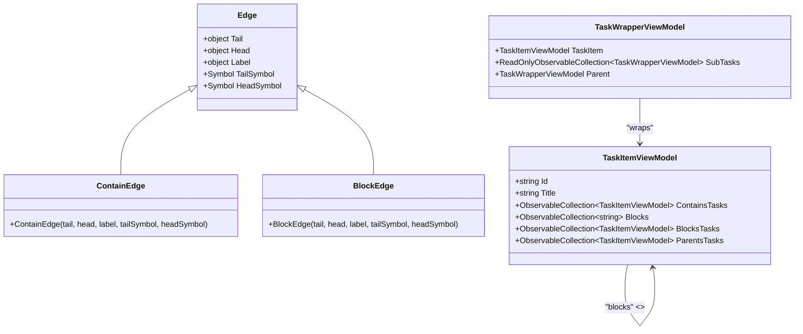

# Roadmap View

<cite>
**Referenced Files in This Document**   
- [GraphViewModel.cs](file://src/Unlimotion.ViewModel/GraphViewModel.cs)
- [MainWindowViewModel.cs](file://src/Unlimotion.ViewModel/MainWindowViewModel.cs)
- [GraphControl.axaml.cs](file://src/Unlimotion/Views/GraphControl.axaml.cs)
- [MainControl.axaml.cs](file://src/Unlimotion/Views/MainControl.axaml.cs)
- [BlockEdge.cs](file://src/Unlimotion/Views/Graph/BlockEdge.cs)
- [ContainEdge.cs](file://src/Unlimotion/Views/Graph/ContainEdge.cs)
- [TaskWrapperViewModel.cs](file://src/Unlimotion.ViewModel/TaskWrapperViewModel.cs)
</cite>

## Table of Contents
1. [Introduction](#introduction)
2. [Architecture Overview](#architecture-overview)
3. [GraphViewModel Integration](#graphviewmodel-integration)
4. [Task Relationship Visualization](#task-relationship-visualization)
5. [Filtering and Emoji-Based Navigation](#filtering-and-emoji-based-navigation)
6. [Interactive Features](#interactive-features)
7. [Performance Considerations](#performance-considerations)
8. [Troubleshooting Guide](#troubleshooting-guide)

## Introduction
The Roadmap View in Unlimotion provides a visual representation of task relationships and dependencies through a graph-based interface. This view enables users to understand complex task hierarchies and blocking relationships at a glance, facilitating better planning and organization. The implementation leverages the GraphViewModel to manage the visualization state and integrates with the main application through the MainWindowViewModel. The view supports both hierarchical (parent-child) and blocking relationships between tasks, with interactive features for node selection, relationship highlighting, and navigation.

## Architecture Overview

**Diagram sources**
- [MainWindowViewModel.cs](file://src/Unlimotion.ViewModel/MainWindowViewModel.cs#L1-L100)
- [GraphViewModel.cs](file://src/Unlimotion.ViewModel/GraphViewModel.cs#L1-L30)
- [GraphControl.axaml.cs](file://src/Unlimotion/Views/GraphControl.axaml.cs#L1-L20)

**Section sources**
- [MainWindowViewModel.cs](file://src/Unlimotion.ViewModel/MainWindowViewModel.cs#L1-L100)
- [GraphViewModel.cs](file://src/Unlimotion.ViewModel/GraphViewModel.cs#L1-L30)

## GraphViewModel Integration

The GraphViewModel serves as the intermediary between the main application state and the graphical representation in the Roadmap View. It is instantiated within the MainWindowViewModel during initialization and registered as a service locator constant, enabling dependency injection throughout the application.

The integration follows a service locator pattern where the GraphViewModel retrieves its parent MainWindowViewModel instance through Splat's Locator service. This allows the GraphViewModel to access and synchronize its state with the main view model's properties such as ShowCompleted, ShowArchived, and ShowWanted. The GraphViewModel exposes these properties with getters and setters that directly delegate to the MainWindowViewModel, ensuring state consistency across the application.

The MainWindowViewModel initializes the GraphViewModel in its constructor and establishes data bindings between the GraphViewModel's task collections (Tasks and UnlockedTasks) and the filtered task collections maintained by the MainWindowViewModel. This binding ensures that changes to task filtering, sorting, or emoji-based filtering are automatically reflected in the graph visualization.

**Diagram sources**
- [MainWindowViewModel.cs](file://src/Unlimotion.ViewModel/MainWindowViewModel.cs#L50-L100)
- [GraphViewModel.cs](file://src/Unlimotion.ViewModel/GraphViewModel.cs#L1-L30)

**Section sources**
- [MainWindowViewModel.cs](file://src/Unlimotion.ViewModel/MainWindowViewModel.cs#L50-L100)
- [GraphViewModel.cs](file://src/Unlimotion.ViewModel/GraphViewModel.cs#L1-L30)

## Task Relationship Visualization

The Roadmap View visualizes two primary types of task relationships: hierarchical (containment) relationships and blocking relationships. These relationships are represented using distinct edge types in the graph visualization, providing clear visual differentiation between the different dependency types.

Hierarchical relationships represent parent-child task structures, where a parent task contains one or more child tasks. These relationships are visualized using ContainEdge objects, which extend the base Edge class from the AvaloniaGraphControl library. The containment edges are created when building the graph structure from the task collection, connecting parent tasks to their contained child tasks.

Blocking relationships represent dependencies where one task must be completed before another task can begin. These are visualized using BlockEdge objects, which also extend the base Edge class but provide visual distinction through arrow styling. The blocking relationships are established when one task explicitly blocks another, creating a directional dependency in the graph.

The graph construction process in the GraphControl analyzes the task relationships and builds an AvaloniaGraphControl.Graph object that represents both types of relationships. Tasks without explicit relationships are represented as self-referential edges, ensuring all tasks are visible in the visualization even when they don't have connections to other tasks.

**Diagram sources**
- [BlockEdge.cs](file://src/Unlimotion/Views/Graph/BlockEdge.cs#L1-L10)
- [ContainEdge.cs](file://src/Unlimotion/Views/Graph/ContainEdge.cs#L1-L12)
- [TaskWrapperViewModel.cs](file://src/Unlimotion.ViewModel/TaskWrapperViewModel.cs#L1-L123)
- [GraphControl.axaml.cs](file://src/Unlimotion/Views/GraphControl.axaml.cs#L150-L200)

**Section sources**
- [BlockEdge.cs](file://src/Unlimotion/Views/Graph/BlockEdge.cs#L1-L10)
- [ContainEdge.cs](file://src/Unlimotion/Views/Graph/ContainEdge.cs#L1-L12)
- [GraphControl.axaml.cs](file://src/Unlimotion/Views/GraphControl.axaml.cs#L150-L200)

## Filtering and Emoji-Based Navigation

The Roadmap View supports sophisticated filtering capabilities that allow users to focus on specific subsets of tasks based on various criteria. The filtering system is implemented through the integration of emoji-based filters with the main task collections, enabling users to visualize only tasks that match specific emoji patterns.

The filtering mechanism is established during the Connect method of the MainWindowViewModel, where multiple observable filter chains are created and combined. The emoji filtering system works by grouping tasks by their emoji content and creating EmojiFilter objects for each unique emoji found in the task collection. These filters are then bound to both the MainWindowViewModel and the GraphViewModel, ensuring consistent filtering behavior across different views.

The GraphViewModel exposes two collections of emoji filters: EmojiFilters for inclusion filtering and EmojiExcludeFilters for exclusion filtering. When a user enables an emoji filter, the graph visualization updates to show only tasks that contain the specified emoji in either their title or emoji field. Conversely, exclusion filters hide tasks that match the specified emoji criteria.

The filtering system is reactive and automatically updates when tasks are added, removed, or modified. The GraphControl listens to changes in both the Tasks and UnlockedTasks collections, as well as changes to the filtering properties (OnlyUnlocked, ShowArchived, ShowCompleted, ShowWanted), triggering a graph rebuild whenever any of these conditions change.

**Diagram sources**
- [MainWindowViewModel.cs](file://src/Unlimotion.ViewModel/MainWindowViewModel.cs#L200-L500)
- [GraphViewModel.cs](file://src/Unlimotion.ViewModel/GraphViewModel.cs#L1-L30)
- [GraphControl.axaml.cs](file://src/Unlimotion/Views/GraphControl.axaml.cs#L50-L100)

**Section sources**
- [MainWindowViewModel.cs](file://src/Unlimotion.ViewModel/MainWindowViewModel.cs#L200-L500)
- [GraphViewModel.cs](file://src/Unlimotion.ViewModel/GraphViewModel.cs#L1-L30)

## Interactive Features

The Roadmap View provides several interactive features that enhance user experience and facilitate navigation through complex task networks. These features include node selection, relationship highlighting, and keyboard navigation, all designed to make the graph visualization more usable and informative.

Node selection is implemented through pointer press events on the graph control. When a user clicks on a task node in the graph, the corresponding task becomes the CurrentTaskItem in the MainWindowViewModel, which triggers updates across the entire application interface. This synchronization ensures that selecting a task in the Roadmap View automatically updates the details panel and other task lists to reflect the selected task.

Relationship highlighting is achieved through the graph's inherent visualization of edges between nodes. When tasks have hierarchical or blocking relationships, these are displayed as connecting lines with directional arrows. The BlockEdge and ContainEdge classes provide visual distinction between the two relationship types, making it easy for users to identify the nature of dependencies between tasks.

The GraphControl implements keyboard shortcuts for navigation and graph manipulation:
- **F**: Fill the viewport with the graph content
- **U**: Apply uniform scaling to the graph
- **R**: Reset the transformation matrix to default
- **T**: Toggle stretch mode and auto-fit the graph

These keyboard shortcuts provide quick access to common viewing operations, allowing users to easily navigate large task networks. The graph also supports drag-and-drop operations for reorganizing tasks, with different behaviors based on keyboard modifiers (Ctrl, Shift, Alt) that allow users to copy, move, or establish blocking relationships between tasks.

**Diagram sources**
- [GraphControl.axaml.cs](file://src/Unlimotion/Views/GraphControl.axaml.cs#L200-L228)
- [MainControl.axaml.cs](file://src/Unlimotion/Views/MainControl.axaml.cs#L250-L300)
- [MainWindowViewModel.cs](file://src/Unlimotion.ViewModel/MainWindowViewModel.cs#L100-L150)

**Section sources**
- [GraphControl.axaml.cs](file://src/Unlimotion/Views/GraphControl.axaml.cs#L200-L228)
- [MainControl.axaml.cs](file://src/Unlimotion/Views/MainControl.axaml.cs#L250-L300)

## Performance Considerations

The Roadmap View implementation includes several performance optimizations to handle large task networks efficiently. These optimizations are critical for maintaining responsiveness when visualizing complex project structures with hundreds or thousands of interconnected tasks.

One key optimization is the use of throttling on collection change notifications. The GraphControl subscribes to changes in the Tasks and UnlockedTasks collections but applies a 100-millisecond throttle to the update events. This prevents excessive graph rebuilds when multiple tasks are modified in quick succession, such as during bulk operations or synchronization with a remote server.

The graph construction algorithm is designed to minimize redundant processing by using hash sets to track processed tasks and those with established relationships. This prevents the same task from being processed multiple times and ensures that the graph building process completes in optimal time. The algorithm processes tasks in a queue-based manner, systematically examining each task's relationships before moving to the next.

Memory efficiency is maintained through the use of ReadOnlyObservableCollection wrappers around the underlying task collections. These collections provide change notifications without requiring duplication of the task data. The TaskWrapperViewModel class implements the DisposableList pattern, ensuring that subscriptions and event handlers are properly cleaned up when no longer needed, preventing memory leaks.

For very large task networks, users can optimize performance by:
1. Using emoji filters to focus on specific task categories
2. Enabling the "Only Unlocked" mode to reduce the number of displayed tasks
3. Disabling the display of completed or archived tasks when not needed
4. Applying date-based filters to limit the time scope of visible tasks

These filtering options reduce the number of tasks processed by the graph construction algorithm, significantly improving rendering performance for large datasets.

**Section sources**
- [GraphControl.axaml.cs](file://src/Unlimotion/Views/GraphControl.axaml.cs#L80-L100)
- [MainWindowViewModel.cs](file://src/Unlimotion.ViewModel/MainWindowViewModel.cs#L300-L400)
- [TaskWrapperViewModel.cs](file://src/Unlimotion.ViewModel/TaskWrapperViewModel.cs#L1-L123)

## Troubleshooting Guide

When encountering issues with the Roadmap View, consider the following common problems and solutions:

**Graph not updating after task changes**: Ensure that the UpdateGraph property in the GraphViewModel is being toggled. The GraphControl listens to changes in this property to trigger graph rebuilds. If the graph appears stale, manually toggling a filter option or calling UpdateGraph() should refresh the visualization.

**Missing task relationships**: Verify that tasks have properly established parent-child or blocking relationships. For containment relationships, ensure that tasks are added as children to parent tasks. For blocking relationships, confirm that the blocking connections are established through the appropriate UI interactions (drag with Ctrl key).

**Performance issues with large task sets**: Apply filtering to reduce the number of tasks in the visualization. Use emoji filters to focus on relevant tasks, enable "Only Unlocked" mode, or hide completed/archived tasks. Consider breaking large projects into smaller, more focused task groups.

**Incorrect emoji filtering**: Check that tasks have emojis properly assigned in either the emoji field or within the task title. The filtering system searches both locations for emoji matches. Ensure that emoji filters are enabled in the UI and that exclusion filters are not inadvertently hiding desired tasks.

**Graph rendering artifacts**: Try resetting the graph transformation using the 'R' keyboard shortcut. If issues persist, restart the application to clear any corrupted rendering state. Ensure that the AvaloniaGraphControl library is up to date, as rendering issues may be resolved in newer versions.

**Section sources**
- [GraphControl.axaml.cs](file://src/Unlimotion/Views/GraphControl.axaml.cs#L50-L228)
- [MainWindowViewModel.cs](file://src/Unlimotion.ViewModel/MainWindowViewModel.cs#L200-L500)
- [MainControl.axaml.cs](file://src/Unlimotion/Views/MainControl.axaml.cs#L250-L300)