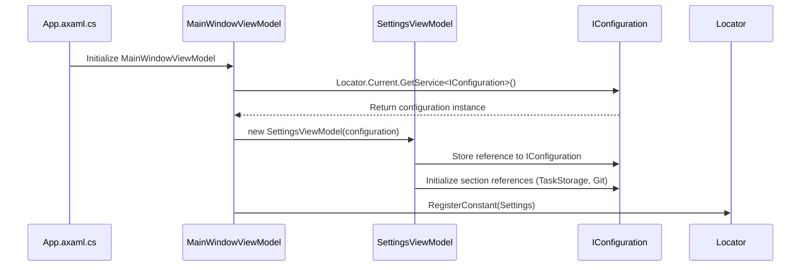
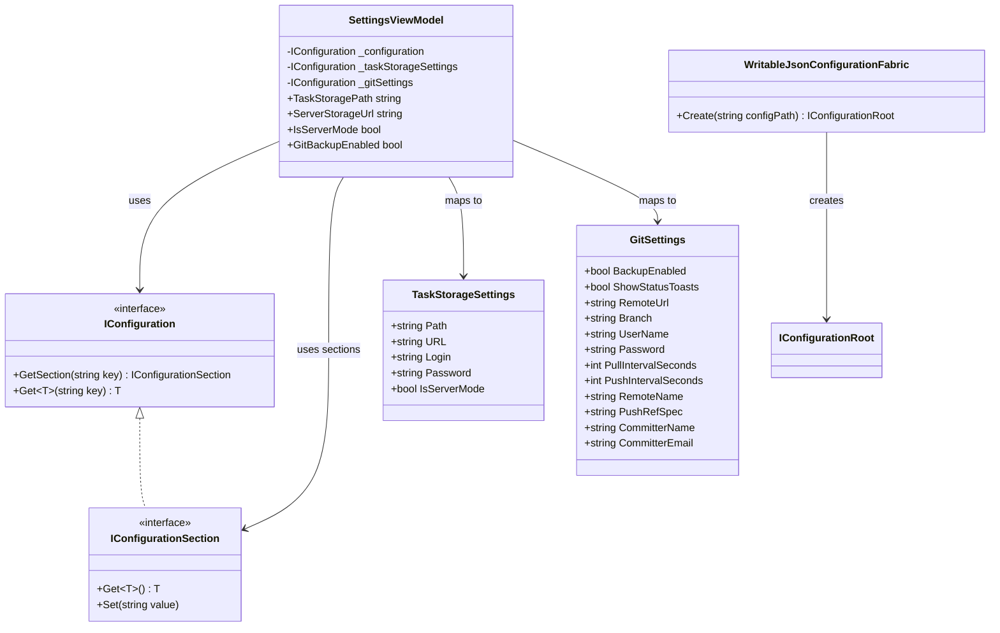
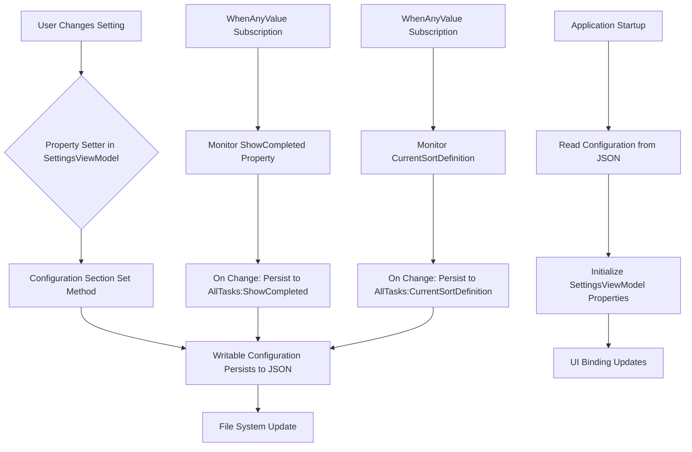
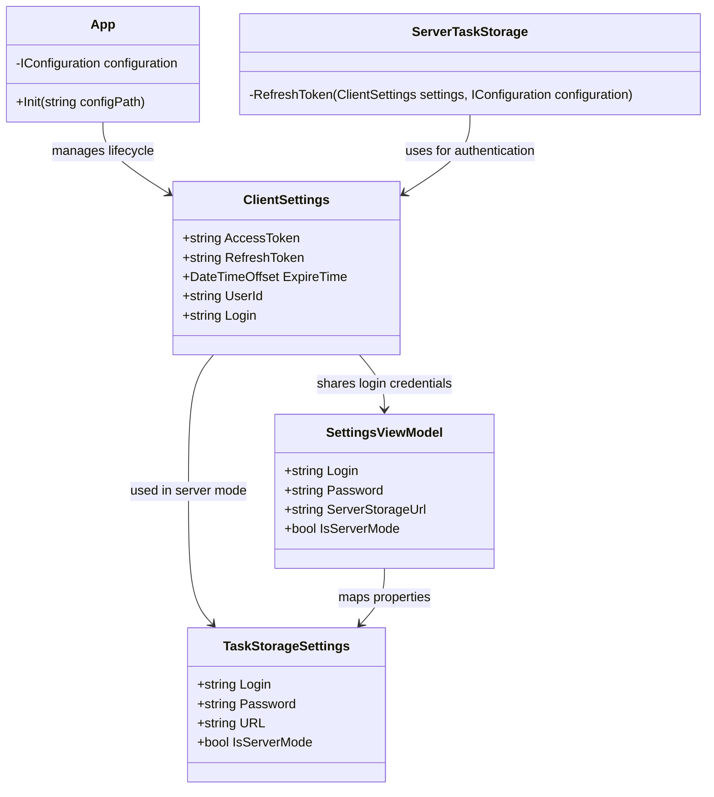

# Settings View

<cite>
**Referenced Files in This Document**   
- [SettingsViewModel.cs](file://src/Unlimotion.ViewModel/SettingsViewModel.cs)
- [MainWindowViewModel.cs](file://src/Unlimotion.ViewModel/MainWindowViewModel.cs)
- [App.axaml.cs](file://src/Unlimotion/App.axaml.cs)
- [ClientSettings.cs](file://src/Unlimotion/ClientSettings.cs)
- [TaskStorageSettings.cs](file://src/Unlimotion.ViewModel/TaskStorageSettings.cs)
- [SettingsControl.axaml.cs](file://src/Unlimotion/Views/SettingsControl.axaml.cs)
</cite>

## Table of Contents
1. [Introduction](#introduction)
2. [SettingsViewModel Initialization and Binding](#settingsviewmodel-initialization-and-binding)
3. [Configuration System Architecture](#configuration-system-architecture)
4. [Settings Persistence and Reactive Updates](#settings-persistence-and-reactive-updates)
5. [ClientSettings Integration](#clientsettings-integration)
6. [Common Configuration Issues and Troubleshooting](#common-configuration-issues-and-troubleshooting)
7. [Conclusion](#conclusion)

## Introduction
The Settings View in Unlimotion provides a comprehensive interface for managing application preferences and storage configurations. This document details the implementation of the settings system, focusing on the SettingsViewModel initialization, configuration persistence using Microsoft.Extensions.Configuration, and reactive programming patterns that ensure settings changes are properly propagated throughout the application. The system supports both local file storage and server-based configurations, with additional features for Git-based backup and synchronization.

## SettingsViewModel Initialization and Binding

The SettingsViewModel is initialized within the MainWindowViewModel during application startup, establishing a critical connection between the UI and the underlying configuration system. The initialization process begins in the MainWindowViewModel constructor, where an instance of SettingsViewModel is created and injected with the application's IConfiguration service.

**Diagram sources**
- [MainWindowViewModel.cs](file://src/Unlimotion.ViewModel/MainWindowViewModel.cs#L15-L25)
- [SettingsViewModel.cs](file://src/Unlimotion.ViewModel/SettingsViewModel.cs#L15-L25)

The Settings property in MainWindowViewModel serves as the binding point for the SettingsControl UI, enabling two-way data flow between the view and view model. This binding architecture follows the MVVM pattern, ensuring separation of concerns while maintaining responsive user interactions.

**Section sources**
- [MainWindowViewModel.cs](file://src/Unlimotion.ViewModel/MainWindowViewModel.cs#L15-L25)
- [SettingsControl.axaml.cs](file://src/Unlimotion/Views/SettingsControl.axaml.cs#L7-L12)

## Configuration System Architecture

Unlimotion employs a sophisticated configuration system built on Microsoft.Extensions.Configuration with custom extensions for writable JSON configuration. The architecture is designed to support multiple configuration sources while ensuring settings persistence across application restarts.

**Diagram sources**
- [App.axaml.cs](file://src/Unlimotion/App.axaml.cs#L126)
- [SettingsViewModel.cs](file://src/Unlimotion.ViewModel/SettingsViewModel.cs#L10-L25)
- [TaskStorageSettings.cs](file://src/Unlimotion.ViewModel/TaskStorageSettings.cs#L3-L34)

The configuration system is initialized in the App class's Init method, where WritableJsonConfigurationFabric.Create(configPath) generates a writable configuration root that persists changes to disk. This implementation extends the standard Microsoft.Extensions.Configuration system with write capabilities, allowing the application to save user preferences without requiring external serialization logic.

**Section sources**
- [App.axaml.cs](file://src/Unlimotion/App.axaml.cs#L126)
- [TaskStorageSettings.cs](file://src/Unlimotion.ViewModel/TaskStorageSettings.cs#L3-L34)

## Settings Persistence and Reactive Updates

The settings persistence mechanism in Unlimotion combines configuration section management with reactive programming patterns to ensure immediate and reliable updates. The system uses WhenAnyValue observables from ReactiveUI to monitor property changes and automatically persist them to the configuration store.

**Diagram sources**
- [MainWindowViewModel.cs](file://src/Unlimotion.ViewModel/MainWindowViewModel.cs#L20-L35)
- [SettingsViewModel.cs](file://src/Unlimotion.ViewModel/SettingsViewModel.cs#L30-L150)

View-specific settings such as sort orders and visibility preferences are managed in the MainWindowViewModel through reactive subscriptions. The WhenAnyValue pattern creates observables that automatically trigger configuration updates when properties change:

- ShowCompleted: Persists to "AllTasks:ShowCompleted" configuration path
- ShowArchived: Persists to "AllTasks:ShowArchived" configuration path  
- CurrentSortDefinition: Persists the name of the selected sort order to "AllTasks:CurrentSortDefinition"
- CurrentSortDefinitionForUnlocked: Persists the sort order for unlocked tasks

These reactive subscriptions ensure that user preferences are immediately saved without requiring explicit save operations, providing a seamless user experience.

**Section sources**
- [MainWindowViewModel.cs](file://src/Unlimotion.ViewModel/MainWindowViewModel.cs#L20-L35)

## ClientSettings Integration

The ClientSettings class provides application-level configuration for authentication and user-specific data that complements the general settings system. This class stores sensitive information such as access tokens, refresh tokens, and user credentials that are essential for server-based operations.

**Diagram sources**
- [ClientSettings.cs](file://src/Unlimotion/ClientSettings.cs#L5-L15)
- [SettingsViewModel.cs](file://src/Unlimotion.ViewModel/SettingsViewModel.cs#L50-L80)
- [TaskStorageSettings.cs](file://src/Unlimotion.ViewModel/TaskStorageSettings.cs#L3-L15)

The integration between ClientSettings and the main configuration system occurs during server authentication processes. When operating in server mode (IsServerMode = true), the application uses ClientSettings to manage token-based authentication, with token refresh operations that update both the ClientSettings instance and the persistent configuration store.

**Section sources**
- [ClientSettings.cs](file://src/Unlimotion/ClientSettings.cs#L5-L15)
- [ServerTaskStorage.cs](file://src/Unlimotion/ServerTaskStorage.cs#L402)

## Common Configuration Issues and Troubleshooting

Despite the robust configuration system, users may encounter issues related to settings persistence and synchronization. The following troubleshooting guide addresses common problems and their solutions.

### Settings Not Persisting Across Restarts
**Symptoms**: Configuration changes are lost when the application restarts.

**Causes and Solutions**:
- **File permissions**: The application lacks write permissions to the configuration file location
  - Solution: Run the application with appropriate permissions or configure a writable directory
- **Configuration path**: The configPath parameter in App.Init() points to a non-writable location
  - Solution: Verify the configuration path is correct and accessible
- **WritableJsonConfiguration failure**: The custom configuration provider fails to serialize changes
  - Solution: Check for JSON serialization errors in the configuration file

### Git Backup Configuration Issues
**Symptoms**: Git backup features do not work as expected.

**Causes and Solutions**:
- **BackupEnabled flag**: The GitBackupEnabled setting is not properly persisted
  - Solution: Verify the WhenAnyValue subscription is correctly configured in MainWindowViewModel
- **Scheduler initialization**: The Quartz scheduler fails to start when Git backup is enabled
  - Solution: Check that the scheduler is properly initialized in App.Init() when !isServerMode

### Server Mode Authentication Problems
**Symptoms**: Connection failures in server mode despite correct settings.

**Causes and Solutions**:
- **Token expiration**: The AccessToken has expired but was not refreshed
  - Solution: Implement proper token refresh logic in RefreshToken method
- **Configuration mapping**: ServerStorageUrl and login credentials are not properly mapped between SettingsViewModel and TaskStorageSettings
  - Solution: Verify the property mappings in SettingsViewModel getters and setters

### Reactive Subscription Memory Leaks
**Symptoms**: Application memory usage increases over time.

**Causes and Solutions**:
- **Undisposed subscriptions**: WhenAnyValue subscriptions are not properly disposed
  - Solution: Ensure all subscriptions are added to the DisposableList in MainWindowViewModel
- **Circular references**: ViewModel references create garbage collection issues
  - Solution: Use weak references where appropriate and verify disposal patterns

**Section sources**
- [App.axaml.cs](file://src/Unlimotion/App.axaml.cs#L126)
- [MainWindowViewModel.cs](file://src/Unlimotion.ViewModel/MainWindowViewModel.cs#L20-L35)
- [SettingsViewModel.cs](file://src/Unlimotion.ViewModel/SettingsViewModel.cs#L30-L150)

## Conclusion
The Settings View in Unlimotion demonstrates a sophisticated implementation of configuration management that combines Microsoft.Extensions.Configuration with reactive programming patterns. The SettingsViewModel serves as a critical bridge between the UI and the persistent configuration store, enabling seamless user experience through automatic settings persistence. The integration of WritableJsonConfiguration allows for real-time updates to configuration files, while reactive subscriptions ensure that view-specific preferences are immediately saved. The system's modular design, separating general settings from authentication-specific ClientSettings, provides flexibility for both local and server-based operations. By following the documented troubleshooting guidelines, users and developers can effectively resolve common configuration issues and ensure reliable settings persistence across application sessions.