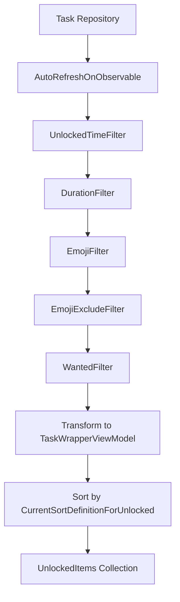
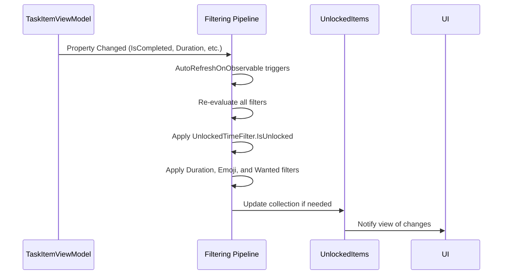
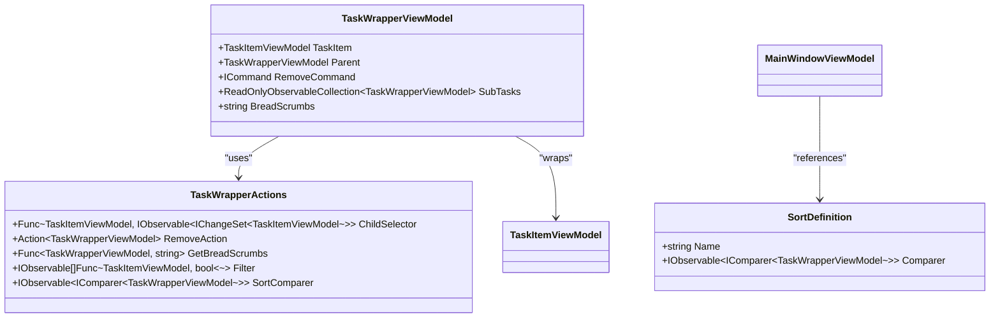
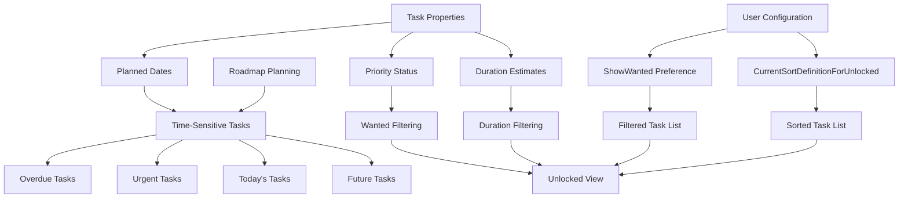

# Unlocked View

<cite>
**Referenced Files in This Document**   
- [MainWindowViewModel.cs](file://src/Unlimotion.ViewModel/MainWindowViewModel.cs)
- [UnlockedTimeFilter.cs](file://src/Unlimotion.ViewModel/UnlockedTimeFilter.cs)
- [TaskItemViewModel.cs](file://src/Unlimotion.ViewModel/TaskItemViewModel.cs)
- [TaskWrapperViewModel.cs](file://src/Unlimotion.ViewModel/TaskWrapperViewModel.cs)
- [DurationFilter.cs](file://src/Unlimotion.ViewModel/DurationFilter.cs)
</cite>

## Table of Contents
1. [Introduction](#introduction)
2. [UnlockedItems Collection Construction](#unlockeditems-collection-construction)
3. [Reactive Data Flow and Property Monitoring](#reactive-data-flow-and-property-monitoring)
4. [Task Transformation and Sorting Mechanism](#task-transformation-and-sorting-mechanism)
5. [Roadmap Planning Support](#roadmap-planning-support)
6. [Common Issues and Troubleshooting](#common-issues-and-troubleshooting)
7. [Configuration Guidance](#configuration-guidance)

## Introduction
The Unlocked view in Unlimotion provides a dynamic interface for managing tasks that are ready to be completed. This view surfaces tasks based on their unlocked status, planned duration, emoji categorization, and wanted status. The system leverages reactive programming patterns to maintain real-time synchronization between the UI and underlying task data. By filtering and transforming task collections reactively, the Unlocked view enables users to focus on time-sensitive activities that contribute to effective roadmap planning. This documentation details the implementation mechanics, data flow architecture, and configuration options that power this critical productivity feature.

## UnlockedItems Collection Construction

The UnlockedItems collection is constructed through a sophisticated filtering pipeline that evaluates multiple task properties to determine visibility in the Unlocked view. At the core of this process is the `UnlockedTimeFilter.IsUnlocked` predicate, which determines whether a task can be completed based on its `IsCanBeCompleted` status and completion state. A task is considered unlocked if it can be completed (`IsCanBeCompleted == true`) and has not yet been marked as completed (`IsCompleted == false`).

The filtering process combines several criteria:
- **Unlocked status**: Determined by the `IsUnlocked` static predicate in `UnlockedTimeFilter`
- **Duration filters**: Applied through the `DurationFilters` collection
- **Emoji filters**: Both inclusion and exclusion filters based on task emoji
- **Wanted tasks**: Filtered according to user preference settings

The reactive pipeline in `MainWindowViewModel` establishes this collection by connecting to the task repository and applying sequential filters. The `AutoRefreshOnObservable` method ensures the collection updates when relevant task properties change, maintaining real-time accuracy without requiring manual refresh operations.

**Diagram sources**
- [MainWindowViewModel.cs](file://src/Unlimotion.ViewModel/MainWindowViewModel.cs#L200-L250)
- [UnlockedTimeFilter.cs](file://src/Unlimotion.ViewModel/UnlockedTimeFilter.cs#L57)

**Section sources**
- [MainWindowViewModel.cs](file://src/Unlimotion.ViewModel/MainWindowViewModel.cs#L200-L250)
- [UnlockedTimeFilter.cs](file://src/Unlimotion.ViewModel/UnlockedTimeFilter.cs#L10-L57)

## Reactive Data Flow and Property Monitoring

The Unlocked view implements a robust reactive data flow that automatically responds to changes in task properties. This system uses the DynamicData library to create observable change sets that propagate updates through the filtering pipeline. The key monitored properties include:

- `IsCompleted`: Tracks task completion status changes
- `UnlockedDateTime`: Monitors when tasks become unlocked
- `PlannedDuration`: Observes changes to estimated task duration
- `PlannedBeginDateTime` and `PlannedEndDateTime`: Tracks scheduling changes
- `Wanted`: Monitors priority status changes
- `Emoji`: Observes categorization changes

The `AutoRefreshOnObservable` method is configured to watch these specific properties on each `TaskItemViewModel`, ensuring that any relevant change triggers a re-evaluation of the task's presence in the Unlocked view. This approach eliminates the need for polling and provides immediate visual feedback when task conditions change.

The reactive chain begins with `taskRepository.Tasks.Connect()` and flows through multiple filter operations before reaching the final `UnlockedItems` collection. Each filter is implemented as an observable that emits updated predicate functions when filter conditions change, allowing the system to dynamically adjust which tasks appear in the view.

**Diagram sources**
- [MainWindowViewModel.cs](file://src/Unlimotion.ViewModel/MainWindowViewModel.cs#L200-L250)
- [TaskItemViewModel.cs](file://src/Unlimotion.ViewModel/TaskItemViewModel.cs#L100-L150)

**Section sources**
- [MainWindowViewModel.cs](file://src/Unlimotion.ViewModel/MainWindowViewModel.cs#L200-L250)
- [TaskItemViewModel.cs](file://src/Unlimotion.ViewModel/TaskItemViewModel.cs#L50-L200)

## Task Transformation and Sorting Mechanism

After filtering, tasks undergo a transformation process that wraps each `TaskItemViewModel` in a `TaskWrapperViewModel` with appropriate actions and behaviors. This transformation occurs in the `Transform` operation within the reactive pipeline, where each task is encapsulated with a `TaskWrapperActions` object that defines:

- `ChildSelector`: Function to retrieve child tasks
- `RemoveAction`: Command to remove the task
- `GetBreadScrumbs`: Algorithm to generate breadcrumb navigation
- `SortComparer`: Observable comparer for sorting

The sorting mechanism for the Unlocked view is controlled by the `CurrentSortDefinitionForUnlocked` property, which persists user preferences to configuration. This allows users to customize how tasks are ordered in the Unlocked view independently of other views. The sort definition is automatically saved to configuration when changed, ensuring consistency across application sessions.

The sorting operation is applied after all filtering and transformation steps, ensuring that the final displayed order reflects the current sort criteria. The system uses `Sort(sortObservableForUnlocked)` to bind the sorting behavior to the observable sort comparer, enabling dynamic re-sorting when the sort definition changes.

**Diagram sources**
- [TaskWrapperViewModel.cs](file://src/Unlimotion.ViewModel/TaskWrapperViewModel.cs#L1-L123)
- [MainWindowViewModel.cs](file://src/Unlimotion.ViewModel/MainWindowViewModel.cs#L150-L200)

**Section sources**
- [TaskWrapperViewModel.cs](file://src/Unlimotion.ViewModel/TaskWrapperViewModel.cs#L1-L123)
- [MainWindowViewModel.cs](file://src/Unlimotion.ViewModel/MainWindowViewModel.cs#L150-L200)

## Roadmap Planning Support

The Unlocked view plays a crucial role in roadmap planning by surfacing time-sensitive tasks that require immediate attention. The `UnlockedTimeFilter.GetDefinitions()` method provides six distinct time-based categories that help users prioritize their work:

- **Unplanned**: Tasks without scheduled dates
- **Overdue**: Tasks past their planned end date
- **Urgent**: Tasks due today
- **Today**: Tasks scheduled to begin today
- **Maybe**: Tasks with flexible timing
- **Future**: Tasks scheduled for later dates

These categories enable users to quickly identify tasks that impact their immediate roadmap. The view's filtering capabilities allow users to focus on specific time horizons, making it easier to plan daily, weekly, or long-term activities. By combining time filters with duration, emoji, and wanted status filters, users can create customized views that align with their current planning priorities.

The reactive nature of the view ensures that as tasks approach their deadlines or become unlocked, they automatically appear in the appropriate time category, providing timely reminders without manual intervention. This dynamic behavior supports agile planning methodologies by keeping the roadmap current and actionable.

**Diagram sources**
- [UnlockedTimeFilter.cs](file://src/Unlimotion.ViewModel/UnlockedTimeFilter.cs#L10-L50)
- [MainWindowViewModel.cs](file://src/Unlimotion.ViewModel/MainWindowViewModel.cs#L100-L150)

**Section sources**
- [UnlockedTimeFilter.cs](file://src/Unlimotion.ViewModel/UnlockedTimeFilter.cs#L10-L57)
- [MainWindowViewModel.cs](file://src/Unlimotion.ViewModel/MainWindowViewModel.cs#L100-L150)

## Common Issues and Troubleshooting

Users may encounter several common issues with the Unlocked view, primarily related to task visibility and filtering behavior. The most frequent issue is tasks not appearing when expected, which typically stems from one of the following causes:

1. **Completion status conflicts**: Tasks marked as completed (`IsCompleted == true`) or archived (`IsCompleted == null`) are excluded from the Unlocked view by design
2. **Dependency blocking**: Tasks cannot be unlocked if they have uncompleted child tasks or blocking dependencies
3. **Filter misconfiguration**: Active emoji, duration, or wanted filters may be excluding expected tasks
4. **Timing conditions**: The `IsCanBeCompleted` status requires all child tasks and blocking tasks to be completed

To troubleshoot visibility issues, users should verify the task's `IsCanBeCompleted` status in the debugger or logging output. This property is automatically calculated based on the completion status of dependent tasks. If `IsCanBeCompleted` is false, examining the `ContainsTasks` and `BlockedByTasks` collections will reveal which dependencies are preventing the task from unlocking.

Performance issues may arise when working with large task collections, as the reactive filtering pipeline processes all tasks in real-time. In such cases, applying more restrictive filters (such as emoji or duration filters) can improve responsiveness by reducing the number of tasks processed through the entire pipeline.

**Section sources**
- [TaskItemViewModel.cs](file://src/Unlimotion.ViewModel/TaskItemViewModel.cs#L50-L100)
- [MainWindowViewModel.cs](file://src/Unlimotion.ViewModel/MainWindowViewModel.cs#L200-L250)

## Configuration Guidance

Configuring the Unlocked view effectively requires understanding both user-facing settings and underlying system behavior. Key configuration options include:

- **CurrentSortDefinitionForUnlocked**: Controls the sorting order of tasks in the Unlocked view
- **ShowWanted**: Toggles visibility of wanted tasks
- **Duration filters**: Configurable thresholds for short, medium, and long tasks
- **Emoji filters**: Customizable categories based on task emoji

The `CurrentSortDefinitionForUnlocked` setting is persisted to the application configuration and can be changed through the UI. Users can select from predefined sort options such as creation date, importance, or custom ordering. This setting operates independently of the main task list sorting, allowing different organizational schemes for different views.

Duration filters are defined in the `DurationFilter.GetDefinitions()` method and can be customized to match individual workflow preferences. The default definitions categorize tasks as short (<30 minutes), medium (30-90 minutes), and long (>90 minutes), but these thresholds can be modified in the code.

For optimal roadmap planning, users should configure their wanted tasks and apply relevant emoji categories to create meaningful filters. Combining these with appropriate duration filters allows for highly focused views that surface the most relevant tasks for current planning objectives.

**Section sources**
- [MainWindowViewModel.cs](file://src/Unlimotion.ViewModel/MainWindowViewModel.cs#L50-L100)
- [DurationFilter.cs](file://src/Unlimotion.ViewModel/DurationFilter.cs#L1-L50)