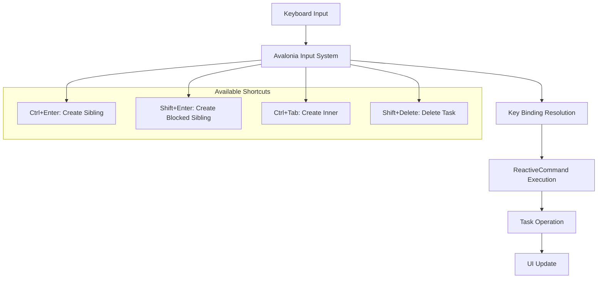
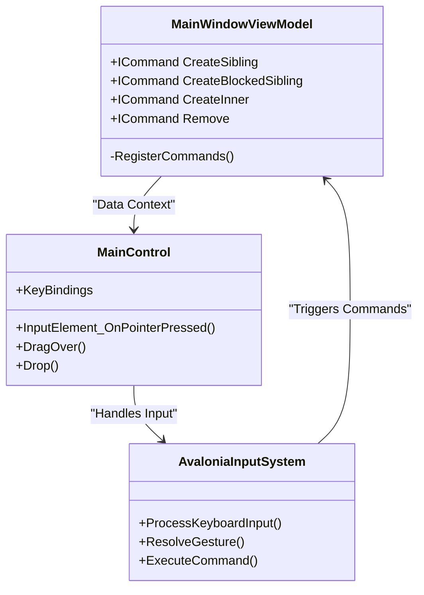
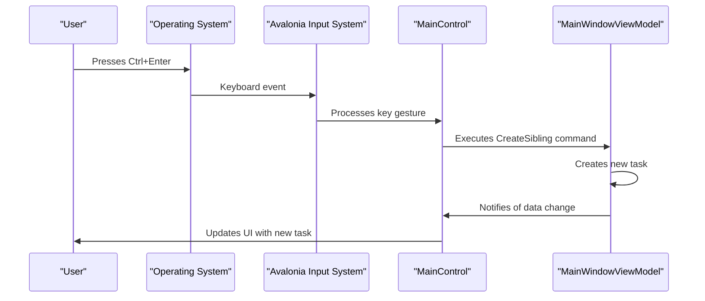

# Keyboard Shortcuts

<cite>
**Referenced Files in This Document**   
- [MainWindowViewModel.cs](file://src/Unlimotion.ViewModel/MainWindowViewModel.cs)
- [MainControl.axaml](file://src/Unlimotion/Views/MainControl.axaml)
- [MainControl.axaml.cs](file://src/Unlimotion/Views/MainControl.axaml.cs)
</cite>

## Table of Contents
1. [Introduction](#introduction)
2. [Available Keyboard Shortcuts](#available-keyboard-shortcuts)
3. [Implementation Architecture](#implementation-architecture)
4. [Command Registration Process](#command-registration-process)
5. [UI Integration via Avalonia Input System](#ui-integration-via-avalonia-input-system)
6. [Common Issues and Considerations](#common-issues-and-considerations)
7. [Workflow Optimization Examples](#workflow-optimization-examples)
8. [Performance Implications](#performance-implications)

## Introduction
Unlimotion provides a comprehensive keyboard shortcut system designed to enhance productivity and streamline task management workflows. The implementation leverages ReactiveCommands within the MVVM (Model-View-ViewModel) architecture, specifically in the MainWindowViewModel, and integrates with the Avalonia UI framework's input system. This documentation details the available shortcuts, their implementation, and best practices for efficient usage.

**Section sources**
- [MainWindowViewModel.cs](file://src/Unlimotion.ViewModel/MainWindowViewModel.cs#L100-L300)
- [MainControl.axaml](file://src/Unlimotion/Views/MainControl.axaml#L60-L65)

## Available Keyboard Shortcuts
Unlimotion implements four primary keyboard shortcuts for task creation and management:

- **Ctrl+Enter**: Creates a sibling task at the same hierarchical level as the currently selected task
- **Shift+Enter**: Creates a blocked sibling task that is dependent on the completion of the current task
- **Ctrl+Tab**: Creates an inner task as a child of the currently selected task
- **Shift+Delete**: Deletes the currently selected task with confirmation

These shortcuts are implemented as ReactiveCommands in the MainWindowViewModel and connected to the UI through Avalonia's key binding system, providing a responsive and efficient user experience.



**Diagram sources**
- [MainControl.axaml](file://src/Unlimotion/Views/MainControl.axaml#L60-L65)
- [MainWindowViewModel.cs](file://src/Unlimotion.ViewModel/MainWindowViewModel.cs#L150-L250)

## Implementation Architecture
The keyboard shortcut system in Unlimotion follows a clean separation of concerns between the view model and the view layers. The core implementation relies on ReactiveUI's ReactiveCommand pattern, which provides asynchronous command execution with built-in support for canExecute conditions and error handling.

The architecture consists of two main components:
1. **ViewModel Layer**: Contains the ReactiveCommand definitions and business logic
2. **View Layer**: Handles keyboard input binding and UI integration

This separation ensures that the command logic remains testable and independent of the UI framework, while still providing tight integration with the user interface.



**Diagram sources**
- [MainWindowViewModel.cs](file://src/Unlimotion.ViewModel/MainWindowViewModel.cs#L100-L300)
- [MainControl.axaml](file://src/Unlimotion/Views/MainControl.axaml#L60-L65)

## Command Registration Process
The keyboard shortcut commands are registered in the MainWindowViewModel through the RegisterCommands method, which initializes ReactiveCommand instances for each available action. Each command is created using ReactiveCommand.CreateFromTask to support asynchronous execution, which is essential for maintaining UI responsiveness during potentially long-running operations.

The command registration process follows these steps:
1. Define command properties in the MainWindowViewModel class
2. Initialize commands in the RegisterCommands method using ReactiveCommand.CreateFromTask
3. Configure command execution logic with appropriate task operations
4. Add commands to the disposable list for proper resource management

The CreateSibling, CreateBlockedSibling, CreateInner, and Remove commands are all registered in this process, with specific logic for handling task creation and deletion operations.

**Section sources**
- [MainWindowViewModel.cs](file://src/Unlimotion.ViewModel/MainWindowViewModel.cs#L150-L250)

## UI Integration via Avalonia Input System
The connection between keyboard shortcuts and application functionality is established through Avalonia's key binding system in the MainControl.axaml file. The UserControl.KeyBindings section defines the mapping between keyboard gestures and command executions, using XAML syntax to bind gestures to ViewModel commands.

The key binding implementation uses the following pattern:
```xml
<KeyBinding Gesture="Ctrl+Enter" Command="{Binding CreateSibling}"/>
```

This approach provides several advantages:
- Declarative syntax that clearly shows the relationship between gestures and commands
- Automatic resolution of command availability based on the current DataContext
- Framework-level handling of keyboard input across different platforms
- Support for complex gesture combinations

The integration is completed by setting the MainControl's DataContext to the MainWindowViewModel, which enables the binding system to resolve command references.



**Diagram sources**
- [MainControl.axaml](file://src/Unlimotion/Views/MainControl.axaml#L60-L65)
- [MainWindowViewModel.cs](file://src/Unlimotion.ViewModel/MainWindowViewModel.cs#L150-L250)

## Common Issues and Considerations
While the keyboard shortcut system in Unlimotion is robust, several considerations should be addressed to ensure optimal user experience:

### Shortcut Conflicts
Potential conflicts may arise with system-level shortcuts or browser shortcuts (in web versions). The current implementation does not include conflict detection, so users should be aware of potential overlaps with operating system shortcuts.

### Accessibility Considerations
The keyboard shortcut system enhances accessibility for power users but may present challenges for new users. Considerations include:
- No built-in shortcut reference or help system
- Limited discoverability of available shortcuts
- No customization options for keyboard shortcuts

### Edge Cases
Several edge cases should be considered:
- Creating tasks when no task is currently selected
- Handling shortcuts when input focus is in text fields
- Behavior when attempting to delete tasks with dependencies

These cases are handled through conditional logic in the command execution methods, such as checking for null CurrentTaskItem references before executing operations.

**Section sources**
- [MainWindowViewModel.cs](file://src/Unlimotion.ViewModel/MainWindowViewModel.cs#L150-L250)
- [MainControl.axaml](file://src/Unlimotion/Views/MainControl.axaml#L60-L65)

## Workflow Optimization Examples
The keyboard shortcut system enables several efficient workflow patterns for task management:

### Rapid Task Creation
Users can quickly create task hierarchies using a combination of shortcuts:
1. Press Ctrl+Enter to create a sibling task
2. Press Ctrl+Tab to create an inner task
3. Repeat as needed to build complex task structures

This pattern allows for rapid outlining of projects without needing to use the mouse.

### Task Blocking Workflow
To establish task dependencies:
1. Select the task that should be blocked
2. Press Shift+Enter to create a blocked sibling
3. The new task will automatically be set as a prerequisite

### Batch Task Management
For cleaning up completed tasks:
1. Navigate through tasks using standard navigation
2. Press Shift+Delete to remove unwanted tasks
3. Confirm deletion when prompted

These workflows demonstrate how keyboard shortcuts can significantly reduce the time required for common task management operations.

**Section sources**
- [MainWindowViewModel.cs](file://src/Unlimotion.ViewModel/MainWindowViewModel.cs#L150-L250)
- [MainControl.axaml](file://src/Unlimotion/Views/MainControl.axaml#L60-L65)

## Performance Implications
The implementation of keyboard shortcuts in Unlimotion has several performance characteristics to consider:

### Command Execution
ReactiveCommands provide built-in support for asynchronous execution, which prevents UI blocking during task operations. The CreateFromTask method ensures that task creation and deletion operations run on background threads, maintaining UI responsiveness.

### Memory Management
Commands are properly disposed through the connectionDisposableList, preventing memory leaks. Each command is added to the disposable list during registration, ensuring cleanup when the ViewModel is disposed.

### Input Handling
The Avalonia input system efficiently handles keyboard events with minimal overhead. The key binding resolution is performed once at initialization, making subsequent shortcut executions very fast.

### Scalability
The current implementation scales well with the number of tasks, as command execution time is independent of the overall task count. However, rapid successive command execution (e.g., creating many tasks quickly) may temporarily impact performance due to UI updates and data persistence operations.

**Section sources**
- [MainWindowViewModel.cs](file://src/Unlimotion.ViewModel/MainWindowViewModel.cs#L150-L250)
- [MainControl.axaml.cs](file://src/Unlimotion/Views/MainControl.axaml.cs#L100-L150)