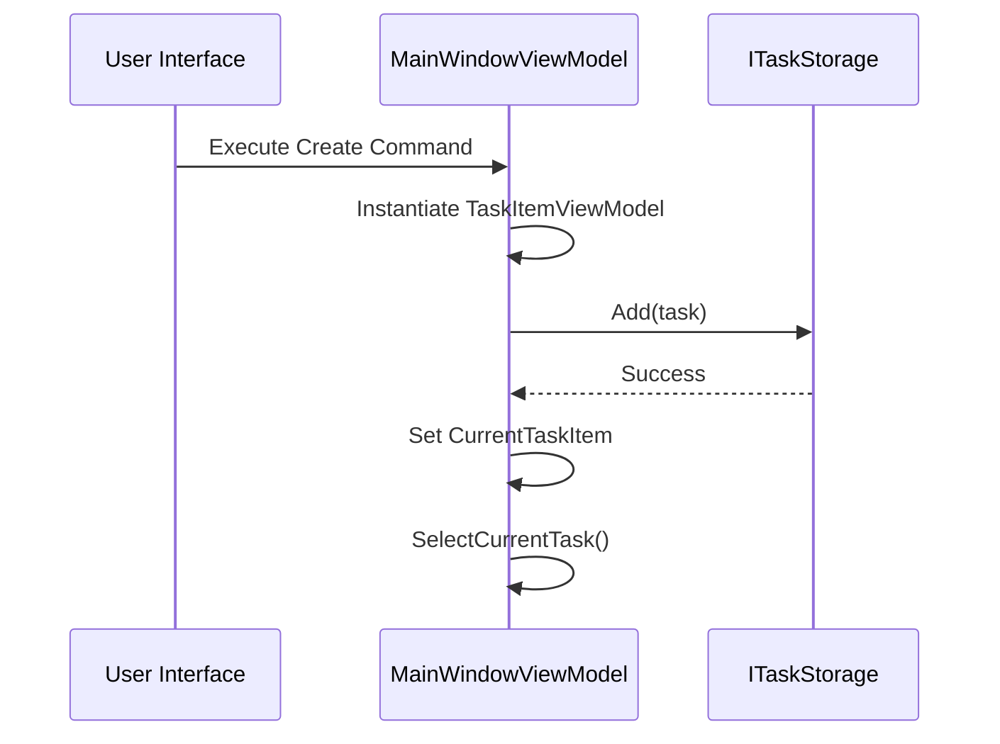
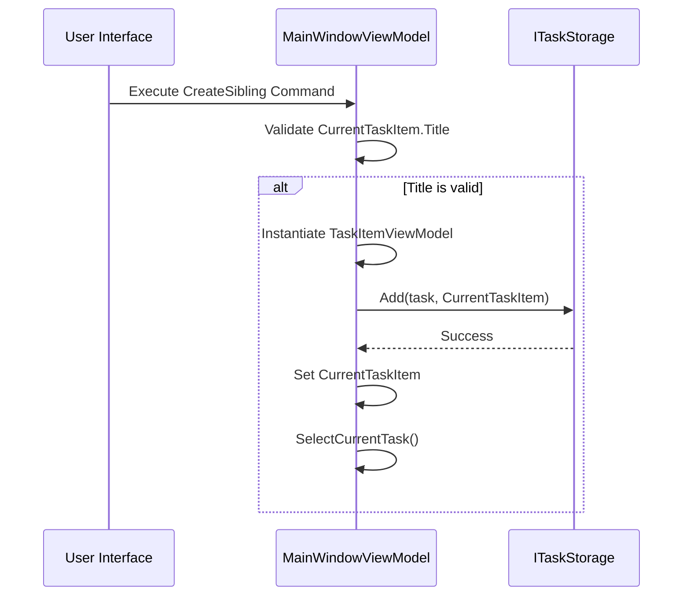
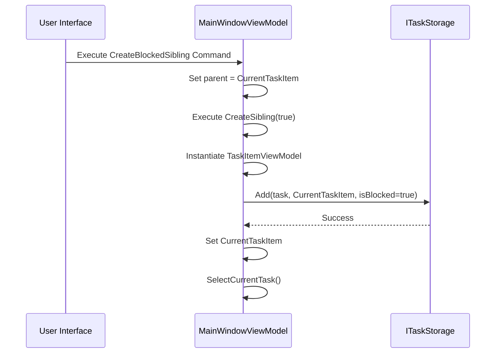
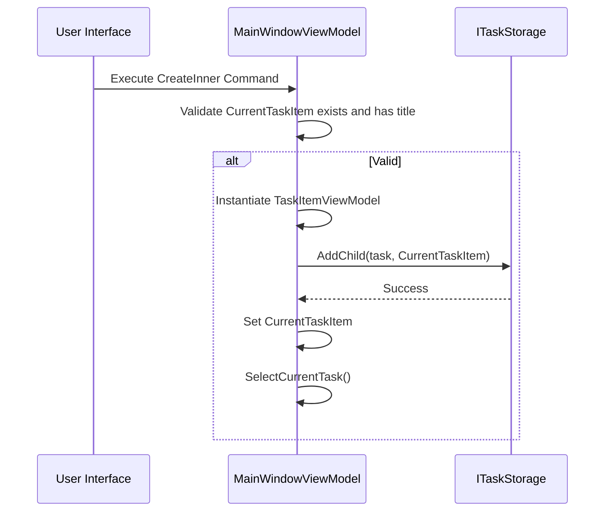
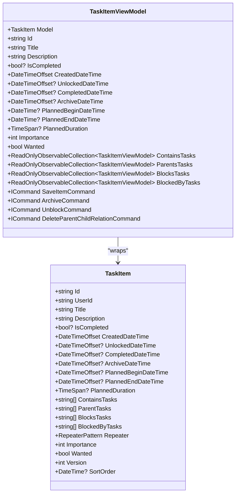
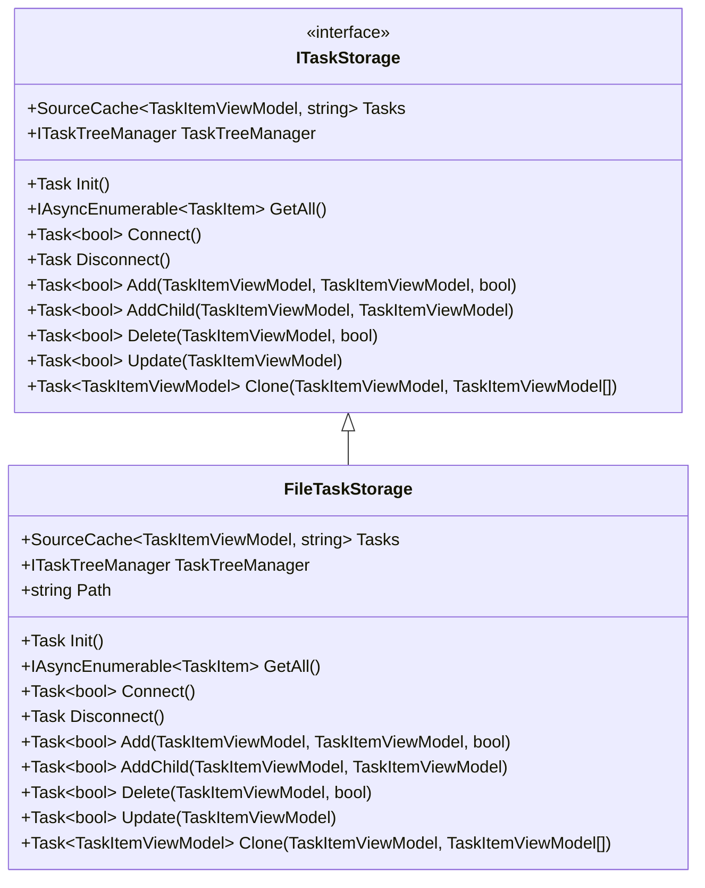
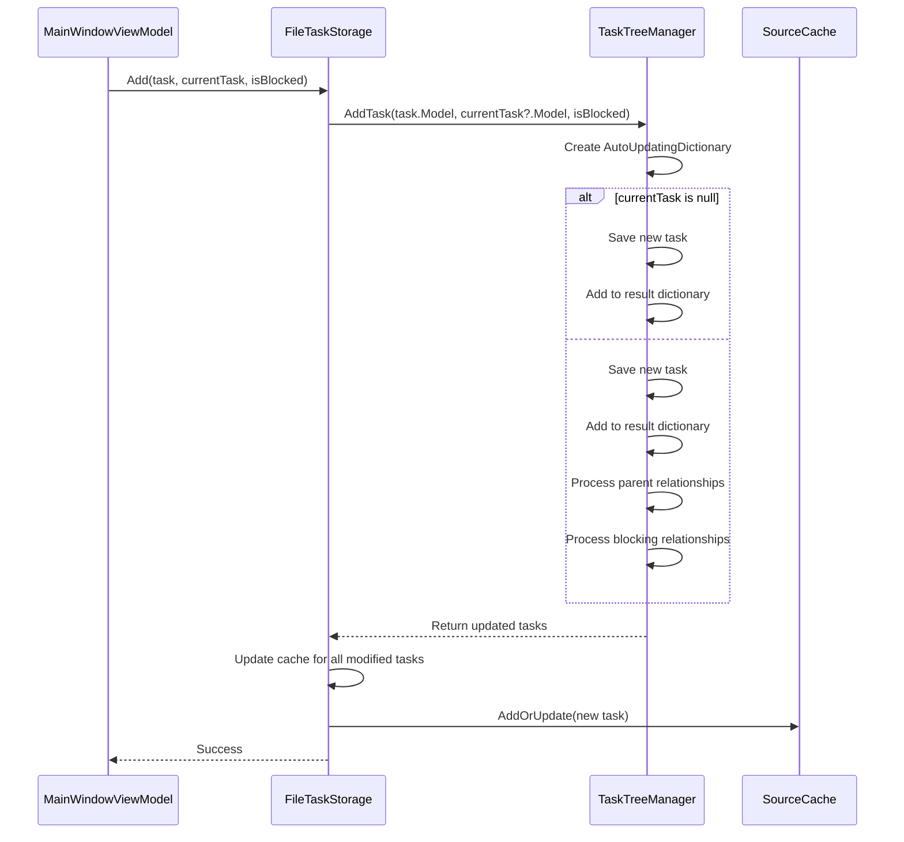
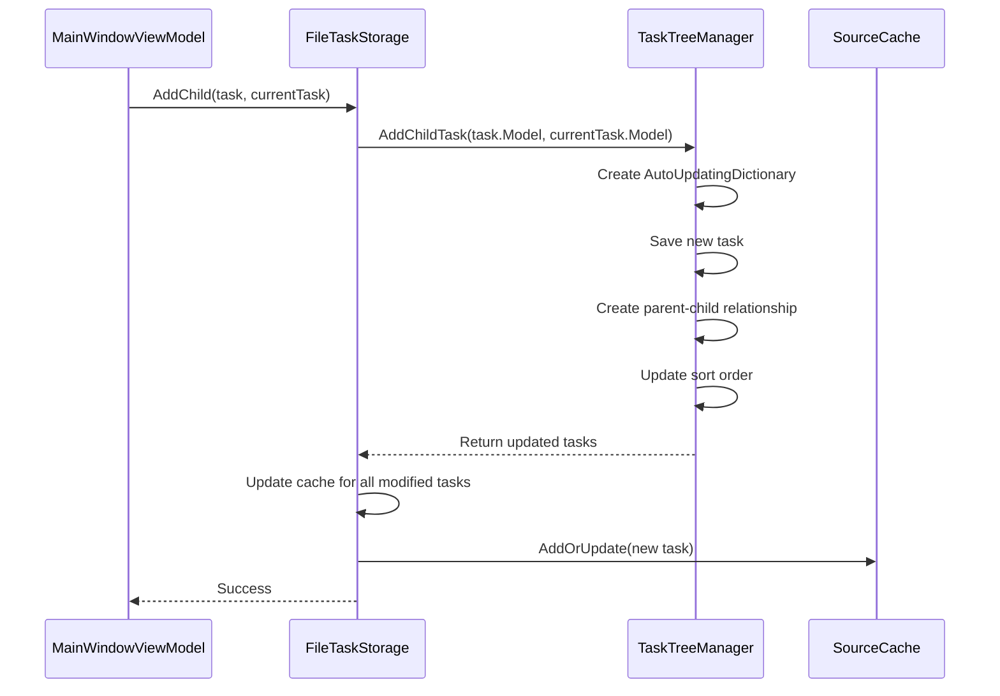
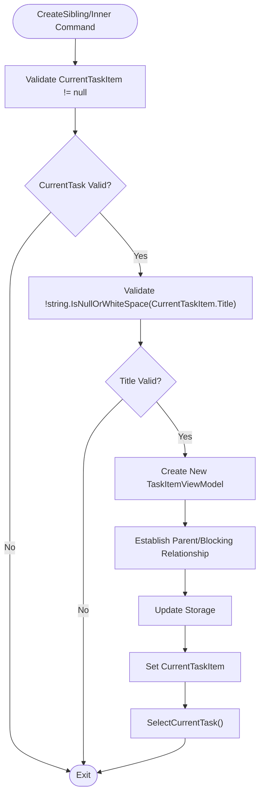
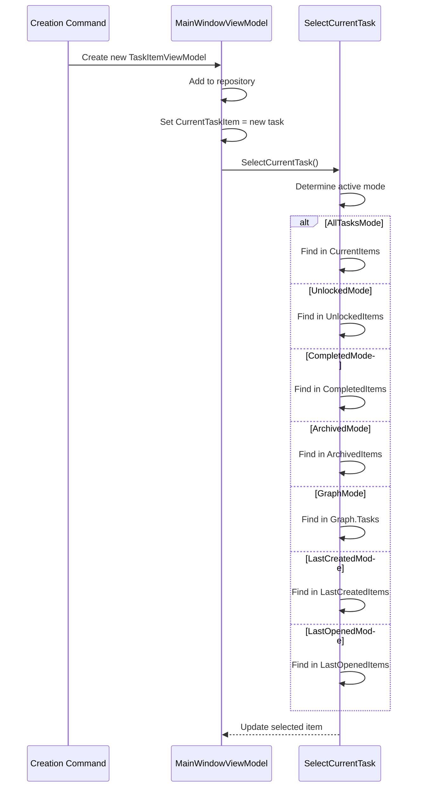

# Task Creation

<cite>
**Referenced Files in This Document**   
- [MainWindowViewModel.cs](file://src/Unlimotion.ViewModel/MainWindowViewModel.cs)
- [TaskItemViewModel.cs](file://src/Unlimotion.ViewModel/TaskItemViewModel.cs)
- [FileTaskStorage.cs](file://src/Unlimotion/FileTaskStorage.cs)
- [TaskItem.cs](file://src/Unlimotion.Domain/TaskItem.cs)
- [ITaskStorage.cs](file://src/Unlimotion.ViewModel/ITaskStorage.cs)
- [TaskTreeManager.cs](file://src/Unlimotion.TaskTreeManager/TaskTreeManager.cs)
- [MainWindowViewModelTests.cs](file://src/Unlimotion.Test/MainWindowViewModelTests.cs)
</cite>

## Table of Contents
1. [Introduction](#introduction)
2. [Task Creation Commands](#task-creation-commands)
3. [TaskItemViewModel Instantiation](#taskitemviewmodel-instantiation)
4. [Storage Operations and Relationships](#storage-operations-and-relationships)
5. [Validation Logic](#validation-logic)
6. [Current Task Item Management](#current-task-item-management)
7. [Best Practices and Performance](#best-practices-and-performance)
8. [Conclusion](#conclusion)

## Introduction

The Unlimotion application implements a sophisticated task management system with multiple creation workflows for different hierarchical and dependency relationships. This document details the implementation of task creation commands in the MainWindowViewModel, focusing on the Create, CreateSibling, CreateInner, and CreateBlockedSibling operations. The system leverages reactive programming patterns with ReactiveCommand.CreateFromTask for asynchronous operations, proper dependency injection of ITaskStorage, and careful management of parent-child and blocking relationships between tasks. The architecture separates concerns between the view model layer, storage abstraction, and domain models, enabling a flexible and maintainable task management system.

## Task Creation Commands

The MainWindowViewModel implements four primary task creation commands that enable different relationship patterns between tasks. These commands are defined as ReactiveCommand instances created with ReactiveCommand.CreateFromTask, allowing for asynchronous execution while maintaining reactive UI updates.

### Create Command

The Create command instantiates a new root-level task with no parent relationships. This command creates a new TaskItemViewModel with an empty TaskItem model and adds it to the task repository. The newly created task becomes the current task item and is automatically selected in the UI.

**Diagram sources**
- [MainWindowViewModel.cs](file://src/Unlimotion.ViewModel/MainWindowViewModel.cs#L100-L108)

### CreateSibling Command

The CreateSibling command creates a new task that shares the same parent(s) as the current task. This operation includes validation to prevent creation when the current task has no title. When executed, it creates a new TaskItemViewModel and adds it to the repository with the current task's parent relationships.

**Diagram sources**
- [MainWindowViewModel.cs](file://src/Unlimotion.ViewModel/MainWindowViewModel.cs#L109-L124)

### CreateBlockedSibling Command

The CreateBlockedSibling command creates a new task that is blocked by the current task. This specialized sibling creation establishes a blocking relationship where the new task cannot be completed until the current (blocking) task is completed. The implementation delegates to CreateSibling with the isBlocked parameter set to true.

**Diagram sources**
- [MainWindowViewModel.cs](file://src/Unlimotion.ViewModel/MainWindowViewModel.cs#L125-L133)

### CreateInner Command

The CreateInner command creates a new task as a child of the current task, establishing a parent-child hierarchical relationship. This operation validates that a current task exists and has a title before proceeding. The new task is added using the AddChild method of the task repository.

**Diagram sources**
- [MainWindowViewModel.cs](file://src/Unlimotion.ViewModel/MainWindowViewModel.cs#L134-L144)

## TaskItemViewModel Instantiation

The TaskItemViewModel class serves as the presentation model for tasks in the Unlimotion application, bridging the domain model (TaskItem) with the UI layer. The instantiation process follows a consistent pattern across all creation commands.

### Constructor and Initialization

The TaskItemViewModel constructor accepts a TaskItem model and an ITaskStorage instance, which are essential for maintaining the connection between the view model and the persistence layer. The constructor delegates to the Init method, which sets up reactive commands, subscriptions, and relationship management.

**Diagram sources**
- [TaskItemViewModel.cs](file://src/Unlimotion.ViewModel/TaskItemViewModel.cs#L15-L18)
- [TaskItem.cs](file://src/Unlimotion.Domain/TaskItem.cs#L5-L32)

### Dependency Injection

The ITaskStorage dependency is injected into each TaskItemViewModel instance, enabling the view model to communicate directly with the storage layer for operations like saving, blocking, and relationship management. This injection occurs during the creation process in the MainWindowViewModel commands, ensuring that each new task has access to the shared storage instance.

## Storage Operations and Relationships

The task creation workflow involves coordinated operations between the MainWindowViewModel, ITaskStorage implementation, and the underlying TaskTreeManager. This layered architecture separates the UI concerns from the business logic and persistence mechanisms.

### FileTaskStorage Implementation

The FileTaskStorage class provides the concrete implementation of ITaskStorage, managing tasks as JSON files in a designated directory. It uses a SourceCache from DynamicData to maintain an in-memory collection of TaskItemViewModel instances, providing efficient change tracking and notifications.

**Diagram sources**
- [ITaskStorage.cs](file://src/Unlimotion.ViewModel/ITaskStorage.cs#L7-L34)
- [FileTaskStorage.cs](file://src/Unlimotion/FileTaskStorage.cs#L10-L13)

### TaskTreeManager Operations

The TaskTreeManager handles the complex logic of creating and modifying task relationships, operating on the domain model level (TaskItem) rather than the view model level. It coordinates the creation of parent-child and blocking relationships through methods like AddTask, AddChildTask, and BlockTask.

#### Add Method

The Add method in FileTaskStorage serves as the entry point for creating new tasks with optional parent and blocking relationships. It delegates to the TaskTreeManager's AddTask method, which manages the creation of the task and establishment of relationships.

**Diagram sources**
- [FileTaskStorage.cs](file://src/Unlimotion/FileTaskStorage.cs#L288-L316)
- [TaskTreeManager.cs](file://src/Unlimotion.TaskTreeManager/TaskTreeManager.cs#L15-L78)

#### AddChild Method

The AddChild method specifically creates a parent-child relationship between tasks. It calls the TaskTreeManager's AddChildTask method, which establishes the bidirectional relationship between parent and child tasks in the domain model.

**Diagram sources**
- [FileTaskStorage.cs](file://src/Unlimotion/FileTaskStorage.cs#L318-L340)
- [TaskTreeManager.cs](file://src/Unlimotion.TaskTreeManager/TaskTreeManager.cs#L80-L105)

## Validation Logic

The task creation system implements validation logic to maintain data integrity and provide a consistent user experience. While the primary validation occurs at the UI level in the MainWindowViewModel, additional safeguards exist throughout the system.

### Title Validation

The CreateSibling and CreateInner commands include validation to prevent the creation of tasks when the current task has no title. This prevents the creation of unnamed parent tasks, which could lead to confusion in the task hierarchy.

**Diagram sources**
- [MainWindowViewModel.cs](file://src/Unlimotion.ViewModel/MainWindowViewModel.cs#L112-L114)
- [MainWindowViewModel.cs](file://src/Unlimotion.ViewModel/MainWindowViewModel.cs#L136-L138)

### Domain Model Validation

The TaskItem domain model includes default values for critical properties, ensuring that tasks are always in a valid state even if not explicitly set by the user. For example, the CreatedDateTime defaults to DateTimeOffset.UtcNow, and IsCompleted defaults to false.

## Current Task Item Management

After task creation, the system updates the CurrentTaskItem property and ensures the new task is properly selected in the UI. This process involves coordination between multiple components to maintain consistency across different views and modes.

### CurrentTaskItem Update

All creation commands set the CurrentTaskItem to the newly created task, making it the focus of the user interface. This allows users to immediately begin editing the new task's properties.

**Diagram sources**
- [MainWindowViewModel.cs](file://src/Unlimotion.ViewModel/MainWindowViewModel.cs#L107)
- [MainWindowViewModel.cs](file://src/Unlimotion.ViewModel/MainWindowViewModel.cs#L123)
- [MainWindowViewModel.cs](file://src/Unlimotion.ViewModel/MainWindowViewModel.cs#L143)
- [MainWindowViewModel.cs](file://src/Unlimotion.ViewModel/MainWindowViewModel.cs#L799-L825)

### SelectCurrentTask Method

The SelectCurrentTask method handles the complex logic of selecting the appropriate task wrapper in different UI modes. It uses the FindTaskWrapperViewModel method to locate the task in the appropriate collection, considering hierarchical relationships when necessary.

## Best Practices and Performance

When working with the Unlimotion task creation system, certain best practices should be followed to ensure optimal performance and maintainability, especially when managing large task hierarchies.

### Asynchronous Operations

The use of ReactiveCommand.CreateFromTask ensures that all task creation operations are performed asynchronously, preventing UI blocking during file operations. This is particularly important for operations that involve multiple file writes or complex relationship management.

### Efficient Relationship Management

The system uses AutoUpdatingDictionary in the TaskTreeManager to batch updates to related tasks, minimizing the number of individual storage operations. This approach improves performance when creating tasks with complex relationships.

### Memory Management

The SourceCache from DynamicData provides efficient change tracking and memory management for the collection of tasks. It only loads tasks into memory when needed and provides mechanisms for efficient filtering and sorting.

### Error Handling

The system implements retry policies with timeouts for critical operations, as seen in the IsCompletedAsync method of TaskTreeManager. This ensures resilience against transient failures while preventing indefinite blocking.

## Conclusion

The task creation system in Unlimotion demonstrates a well-architected approach to managing complex hierarchical and dependency relationships between tasks. By leveraging reactive programming patterns, clear separation of concerns, and efficient data management, the system provides a responsive and reliable user experience. The implementation of Create, CreateSibling, CreateInner, and CreateBlockedSibling commands enables flexible task organization while maintaining data integrity through appropriate validation and relationship management. The layered architecture, with distinct responsibilities for view models, storage, and domain logic, ensures maintainability and extensibility as the application evolves.