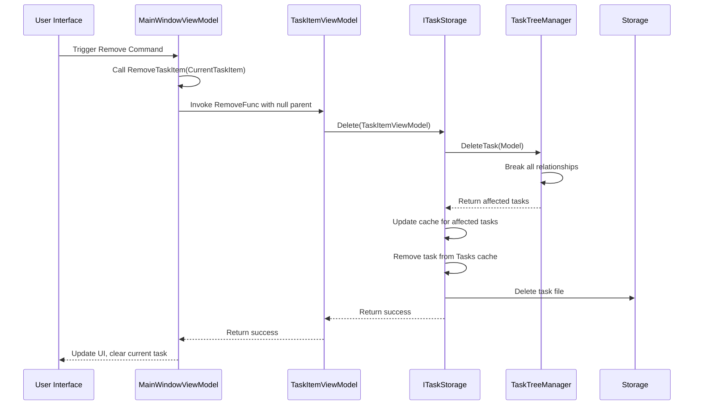
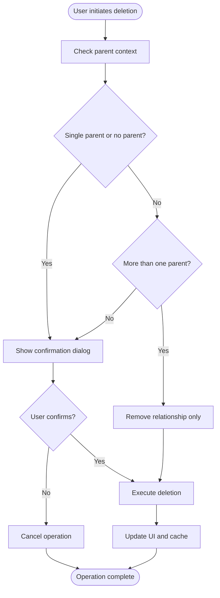

# Task Deletion

<cite>
**Referenced Files in This Document**   
- [MainWindowViewModel.cs](file://src/Unlimotion.ViewModel/MainWindowViewModel.cs)
- [TaskItemViewModel.cs](file://src/Unlimotion.ViewModel/TaskItemViewModel.cs)
- [FileTaskStorage.cs](file://src/Unlimotion/FileTaskStorage.cs)
- [ServerTaskStorage.cs](file://src/Unlimotion/ServerTaskStorage.cs)
- [ITaskStorage.cs](file://src/Unlimotion.ViewModel/ITaskStorage.cs)
- [TaskTreeManager.cs](file://src/Unlimotion.TaskTreeManager/TaskTreeManager.cs)
</cite>

## Table of Contents
1. [Introduction](#introduction)
2. [Remove Command Implementation](#remove-command-implementation)
3. [RemoveFunc Delegate in TaskItemViewModel](#removefunc-delegate-in-taskitemviewmodel)
4. [ITaskStorage Delete Method Logic](#itaskstorage-delete-method-logic)
5. [Asynchronous Deletion with ReactiveCommand](#asynchronous-deletion-with-reactivecommand)
6. [Confirmation Logic and User Interaction](#confirmation-logic-and-user-interaction)
7. [Child Task Handling During Deletion](#child-task-handling-during-deletion)
8. [Safe Deletion Patterns and Best Practices](#safe-deletion-patterns-and-best-practices)

## Introduction
This document provides a comprehensive analysis of the task deletion operations in Unlimotion, focusing on the implementation details of the Remove command in MainWindowViewModel and the RemoveFunc delegate in TaskItemViewModel. The documentation covers the complete deletion workflow from UI interaction to backend storage updates, including multi-parent relationship handling, confirmation logic, and child task management. The system implements a sophisticated deletion mechanism that distinguishes between complete task removal and parent-child relationship deletion, ensuring data integrity while providing flexible task management capabilities.

## Remove Command Implementation

The Remove command in MainWindowViewModel is implemented as a ReactiveCommand that initiates the task deletion process. This command is created using ReactiveCommand.CreateFromTask, enabling asynchronous execution of the deletion operation. The implementation connects the UI action to the underlying storage system through a well-defined command pattern that ensures proper error handling and user feedback.

The Remove command is registered during the initialization of MainWindowViewModel and is bound to the application's user interface. When triggered, it calls the RemoveTaskItem method with the currently selected task, initiating a cascading deletion process that respects the task's relationships and parentage. The command implementation includes proper disposal management through the DisposableList pattern, ensuring that resources are properly cleaned up and preventing memory leaks.

The deletion workflow begins with the Remove command but quickly delegates responsibility to lower-level components, following the principle of separation of concerns. This design allows the UI layer to remain lightweight while complex deletion logic is handled by specialized components. The command pattern also enables easy testing and mocking of the deletion functionality, as the actual deletion logic can be isolated from the UI interaction layer.

**Section sources**
- [MainWindowViewModel.cs](file://src/Unlimotion.ViewModel/MainWindowViewModel.cs#L150-L152)
- [MainWindowViewModel.cs](file://src/Unlimotion.ViewModel/MainWindowViewModel.cs#L876-L894)

## RemoveFunc Delegate in TaskItemViewModel

The RemoveFunc delegate in TaskItemViewModel represents a critical component of Unlimotion's deletion architecture, providing a flexible mechanism for handling different deletion scenarios based on task relationships. This delegate is initialized in the TaskItemViewModel constructor and implements conditional deletion logic that distinguishes between tasks with single parents and those with multiple parents.

The RemoveFunc implementation checks the parent count of the task and determines the appropriate deletion strategy. When a task has multiple parents (Parents.Count > 1), the function calls the ITaskStorage.Delete overload that accepts both the task and parent parameters, effectively removing only the parent-child relationship rather than deleting the entire task. For tasks with a single parent or no parents, the function calls the simpler Delete overload, resulting in complete task removal from the system.

This delegate pattern enables context-aware deletion behavior without requiring the calling code to understand the underlying relationship logic. The RemoveFunc is designed to be invoked from various UI contexts, including direct task removal and relationship deletion from parent or child task views. By encapsulating the relationship-aware deletion logic within the TaskItemViewModel, the system ensures consistent behavior across different user interface components.

**Section sources**
- [TaskItemViewModel.cs](file://src/Unlimotion.ViewModel/TaskItemViewModel.cs#L330-L334)
- [TaskItemViewModel.cs](file://src/Unlimotion.ViewModel/TaskItemViewModel.cs#L876-L894)

## ITaskStorage Delete Method Logic

The ITaskStorage interface defines two overloaded Delete methods that handle both single-parent and multi-parent deletion scenarios. These methods are implemented in concrete storage classes such as FileTaskStorage and ServerTaskStorage, providing a consistent API for task deletion across different storage backends.

The primary Delete method (Delete(TaskItemViewModel change, bool deleteInStorage = true)) handles complete task removal and follows a comprehensive cleanup process. When called, it first invokes TaskTreeManager.DeleteTask to remove all relationships associated with the task, including parent-child connections, blocking relationships, and containment hierarchies. The method then removes the task from the in-memory cache (Tasks.Remove) and, if deleteInStorage is true, deletes the task file from persistent storage.

The secondary Delete method (Delete(TaskItemViewModel change, TaskItemViewModel parent)) handles the removal of parent-child relationships without deleting the task itself. This method calls TaskTreeManager.DeleteParentChildRelation to break the specific relationship between the parent and child tasks, updating both tasks' relationship collections and saving the changes to storage. This approach preserves the task while removing it from a specific parent's hierarchy.

The implementation in TaskTreeManager.DeleteTask method systematically removes all connections associated with a task before deleting the task itself. This includes breaking parent-child relationships with all parents, removing the task from all containers, and eliminating any blocking relationships. The method returns a list of affected tasks that need to be updated in the cache, ensuring that the UI reflects the changes accurately.

**Diagram sources**
- [ITaskStorage.cs](file://src/Unlimotion.ViewModel/ITaskStorage.cs#L24-L25)
- [FileTaskStorage.cs](file://src/Unlimotion/FileTaskStorage.cs#L290-L308)
- [TaskTreeManager.cs](file://src/Unlimotion.TaskTreeManager/TaskTreeManager.cs#L120-L189)

## Asynchronous Deletion with ReactiveCommand

The task deletion system in Unlimotion leverages ReactiveCommand.CreateFromTask to implement asynchronous deletion operations, ensuring that the user interface remains responsive during potentially time-consuming storage operations. This approach follows the ReactiveUI framework's best practices for handling asynchronous operations in MVVM applications.

The Remove command is created using ReactiveCommand.CreateFromTask, which automatically handles the subscription and unsubscription of the asynchronous operation, preventing common issues such as memory leaks and duplicate executions. The command is properly disposed of through the DisposableList pattern, ensuring that all subscriptions are cleaned up when the view model is destroyed.

The asynchronous nature of the deletion process allows for proper error handling and user feedback. If the deletion operation fails due to storage issues or other errors, the ReactiveCommand infrastructure ensures that appropriate error handling can be implemented without blocking the UI thread. The use of async/await pattern throughout the deletion chain maintains the responsiveness of the application while ensuring that operations are completed in the correct order.

The connection between UI actions and backend storage updates is established through a chain of asynchronous method calls that propagate from the UI command through the view model layer to the storage implementation. Each layer in this chain returns Task objects, allowing the asynchronous nature of the operation to be preserved throughout the call stack. This design enables proper error propagation and cancellation handling while maintaining a clean separation of concerns.

**Section sources**
- [MainWindowViewModel.cs](file://src/Unlimotion.ViewModel/MainWindowViewModel.cs#L150-L152)
- [MainWindowViewModel.cs](file://src/Unlimotion.ViewModel/MainWindowViewModel.cs#L876-L894)

## Confirmation Logic and User Interaction

Unlimotion implements a sophisticated confirmation logic system to prevent accidental deletion of important tasks. The RemoveRequiresConfirmation method in TaskItemViewModel determines whether a confirmation dialog should be shown based on the task's parent relationships. This method returns true when the deletion would result in complete task removal (either no parent specified or the task has only one parent), and false when only a parent-child relationship is being removed from a multi-parent task.

The confirmation logic is integrated into the RemoveTask method in MainWindowViewModel, which checks RemoveRequiresConfirmation before proceeding with deletion. When confirmation is required, the method uses the notification manager to display a dialog asking the user to confirm the deletion. This prevents accidental removal of tasks that might still be needed in other contexts.

The system distinguishes between two deletion scenarios: direct task removal and relationship removal from parent/child views. When removing a task directly, confirmation is always required to prevent accidental data loss. However, when removing a task from a parent's contains list or a child's parents list in a multi-parent scenario, no confirmation is shown, providing a smoother user experience for routine relationship management.

This intelligent confirmation system balances data safety with usability, requiring explicit confirmation only when the operation would result in complete task deletion. The contextual awareness of the deletion operation ensures that users are prompted appropriately based on the potential impact of their actions.

**Diagram sources**
- [TaskItemViewModel.cs](file://src/Unlimotion.ViewModel/TaskItemViewModel.cs#L336-L338)
- [MainWindowViewModel.cs](file://src/Unlimotion.ViewModel/MainWindowViewModel.cs#L876-L894)

## Child Task Handling During Deletion

The task deletion system in Unlimotion includes comprehensive handling of child tasks to maintain data integrity and provide appropriate user feedback. When a task with child tasks is deleted, the system follows a systematic approach to clean up all related relationships and ensure that the hierarchy is properly maintained.

During the deletion process, TaskTreeManager.DeleteTask method automatically handles child task relationships by iterating through all contains tasks and breaking the parent-child relationship in both directions. For each child task, the method removes the parent's ID from the child's ParentTasks collection and removes the child's ID from the parent's ContainsTasks collection, ensuring that the relationship is completely removed from the system.

The implementation ensures that child tasks are not orphaned when their parent is deleted. Instead, the child tasks remain in the system but are removed from the deleted parent's hierarchy. This approach preserves the child tasks while maintaining the integrity of the task graph. The cache is updated for all affected tasks, ensuring that the UI reflects the changes accurately.

The system does not automatically delete child tasks when a parent is deleted, following the principle that task deletion should be an explicit user action. This prevents accidental loss of data and allows users to reorganize their task hierarchy as needed. If a user wants to delete a task and all its children, they must do so explicitly, either by deleting each task individually or by using batch operations if available.

**Section sources**
- [TaskTreeManager.cs](file://src/Unlimotion.TaskTreeManager/TaskTreeManager.cs#L120-L189)
- [FileTaskStorage.cs](file://src/Unlimotion/FileTaskStorage.cs#L290-L308)

## Safe Deletion Patterns and Best Practices

Unlimotion implements several safe deletion patterns to prevent accidental removal of important tasks and ensure data integrity. These patterns combine technical safeguards with user experience considerations to create a robust task management system.

One key safety pattern is the multi-parent relationship system, which allows tasks to exist in multiple hierarchies simultaneously. This design reduces the risk of accidental deletion, as removing a task from one parent's hierarchy does not affect its presence in other contexts. Users can organize tasks in multiple ways without fear of losing data.

The confirmation system provides an additional layer of protection by requiring explicit user confirmation before complete task deletion. This is particularly important for tasks that might be used in multiple contexts or that contain important information. The contextual awareness of the confirmation logic ensures that users are prompted only when necessary, reducing confirmation fatigue while maintaining safety.

Another best practice implemented in the system is the separation of relationship removal from complete task deletion. This allows users to reorganize their task hierarchy without the risk of accidentally deleting tasks. The UI clearly distinguishes between these operations, with different visual cues and interaction patterns for removing relationships versus deleting tasks entirely.

The asynchronous nature of the deletion operations provides additional safety by allowing users to continue working while deletion operations are processed. This prevents the UI from becoming unresponsive during potentially time-consuming storage operations and reduces the likelihood of users attempting to repeat operations due to perceived lack of response.

To further enhance safety, the system could implement additional features such as:
- A trash or recycle bin system for recently deleted tasks
- Undo functionality for deletion operations
- Backup and restore capabilities
- Audit logging of deletion operations
- Permission controls for sensitive tasks

These patterns and practices ensure that task deletion in Unlimotion is both powerful and safe, providing users with the flexibility to manage their tasks while protecting against accidental data loss.

**Section sources**
- [TaskItemViewModel.cs](file://src/Unlimotion.ViewModel/TaskItemViewModel.cs#L330-L338)
- [MainWindowViewModel.cs](file://src/Unlimotion.ViewModel/MainWindowViewModel.cs#L876-L894)
- [TaskTreeManager.cs](file://src/Unlimotion.TaskTreeManager/TaskTreeManager.cs#L120-L189)