# Task Management

<cite>
**Referenced Files in This Document**   
- [MainWindowViewModel.cs](file://src/Unlimotion.ViewModel/MainWindowViewModel.cs)
- [TaskItemViewModel.cs](file://src/Unlimotion.ViewModel/TaskItemViewModel.cs)
- [FileTaskStorage.cs](file://src/Unlimotion/FileTaskStorage.cs)
- [TaskItem.cs](file://src/Unlimotion.Domain/TaskItem.cs)
- [ITaskStorage.cs](file://src/Unlimotion.ViewModel/ITaskStorage.cs)
- [TaskTreeManager.cs](file://src/Unlimotion.TaskTreeManager/TaskTreeManager.cs)
- [MainWindowViewModelTests.cs](file://src/Unlimotion.Test/MainWindowViewModelTests.cs)
</cite>

## Table of Contents
1. [Introduction](#introduction)
2. [Task Creation Workflows](#task-creation-workflows)
3. [Task Deletion and Removal](#task-deletion-and-removal)
4. [Task State Transitions](#task-state-transitions)
5. [Reactive Command Implementation](#reactive-command-implementation)
6. [State Management in TaskItemViewModel](#state-management-in-taskitemviewmodel)
7. [Storage and Persistence](#storage-and-persistence)
8. [UI-Backend Synchronization](#ui-backend-synchronization)
9. [Special Cases and Validation](#special-cases-and-validation)
10. [Performance Considerations](#performance-considerations)

## Introduction

Unlimotion implements a comprehensive task management system that supports hierarchical organization, dependency tracking, and state management. The system is built on a reactive architecture that ensures seamless synchronization between the user interface and backend storage. This document details the implementation of task management workflows, focusing on task creation (sibling, inner, blocked), deletion, and state transitions (not completed, in progress, completed, archived). The analysis covers the implementation of ReactiveCommands in MainWindowViewModel for task operations and the state management logic in TaskItemViewModel.

The task management system is designed around several core components:
- **MainWindowViewModel**: Manages UI commands and coordinates task operations
- **TaskItemViewModel**: Handles individual task state and business logic
- **ITaskStorage**: Abstracts storage operations for tasks
- **FileTaskStorage**: Implements file-based persistence
- **TaskTreeManager**: Manages task relationships and dependencies

The system uses reactive programming patterns to automatically persist changes and maintain consistency across the application.

**Section sources**
- [MainWindowViewModel.cs](file://src/Unlimotion.ViewModel/MainWindowViewModel.cs#L0-L1062)
- [TaskItemViewModel.cs](file://src/Unlimotion.ViewModel/TaskItemViewModel.cs#L0-L756)

## Task Creation Workflows

Unlimotion supports multiple task creation workflows that enable users to organize tasks in hierarchical and dependent relationships. The system implements three primary creation patterns: sibling tasks, inner tasks, and blocked tasks, each serving different organizational needs.

### Sibling Task Creation

Sibling tasks are created at the same level in the hierarchy as the current task. When a user creates a sibling task, the system establishes a parent-child relationship through shared parent tasks. The `CreateSibling` command in MainWindowViewModel handles this operation:

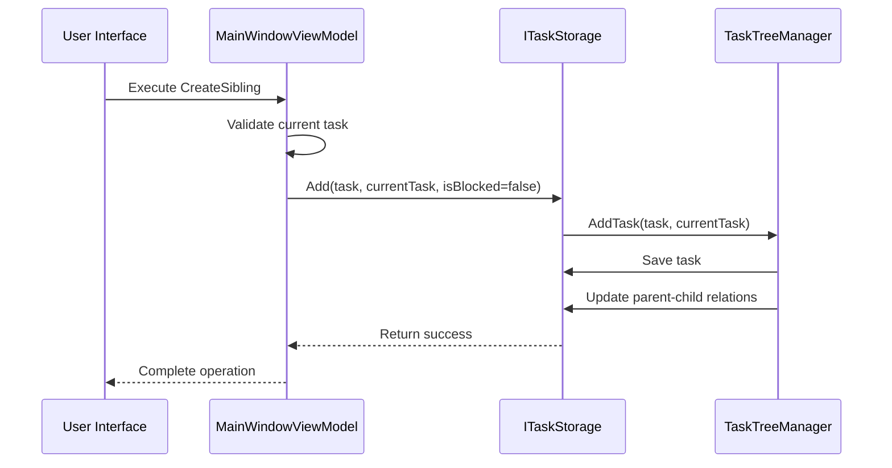

**Diagram sources**
- [MainWindowViewModel.cs](file://src/Unlimotion.ViewModel/MainWindowViewModel.cs#L100-L120)
- [FileTaskStorage.cs](file://src/Unlimotion/FileTaskStorage.cs#L250-L280)
- [TaskTreeManager.cs](file://src/Unlimotion.TaskTreeManager/TaskTreeManager.cs#L20-L60)

When creating a blocked sibling task using `CreateBlockedSibling`, the system establishes a blocking relationship where the new task must be completed before the current task can proceed. This creates a dependency chain that enforces task completion order.

### Inner Task Creation

Inner tasks are created as children of the current task, establishing a hierarchical parent-child relationship. The `CreateInner` command implements this workflow:

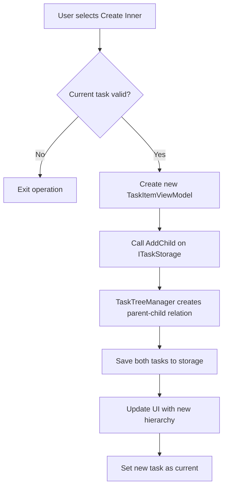

The inner task creation process ensures that both the parent and child tasks are properly linked in the storage system. The parent task's ContainsTasks collection is updated to include the child task ID, while the child task's ParentTasks collection is updated to include the parent task ID.

**Diagram sources**
- [MainWindowViewModel.cs](file://src/Unlimotion.ViewModel/MainWindowViewModel.cs#L130-L145)
- [FileTaskStorage.cs](file://src/Unlimotion/FileTaskStorage.cs#L285-L305)
- [TaskTreeManager.cs](file://src/Unlimotion.TaskTreeManager/TaskTreeManager.cs#L65-L85)

### Blocked Task Creation

Blocked tasks create dependency relationships where one task must be completed before another can proceed. The system implements this through the BlocksTasks and BlockedByTasks collections in the TaskItem model. When a user creates a blocked sibling, the system:

1. Creates a new task
2. Adds the new task to the current task's BlocksTasks collection
3. Adds the current task to the new task's BlockedByTasks collection
4. Updates both tasks in storage

This bidirectional relationship ensures that the dependency is properly tracked and enforced in the UI and business logic.

**Section sources**
- [MainWindowViewModel.cs](file://src/Unlimotion.ViewModel/MainWindowViewModel.cs#L120-L130)
- [TaskItemViewModel.cs](file://src/Unlimotion.ViewModel/TaskItemViewModel.cs#L350-L370)
- [TaskTreeManager.cs](file://src/Unlimotion.TaskTreeManager/TaskTreeManager.cs#L320-L340)

## Task Deletion and Removal

The task deletion system in Unlimotion implements a comprehensive approach to removing tasks while maintaining data integrity and providing appropriate user feedback. The system distinguishes between removing task relationships and completely deleting tasks from storage.

### Task Relationship Removal

When a task has multiple parents, removing it from one parent only breaks the relationship rather than deleting the task entirely. The `RemoveParentChildConnection` method in ITaskStorage handles this operation:

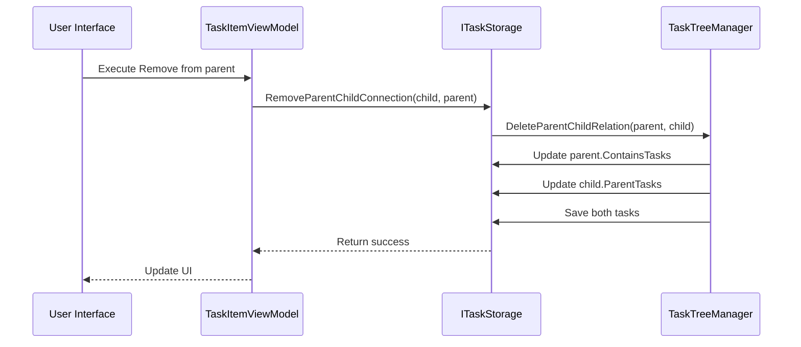

**Diagram sources**
- [TaskItemViewModel.cs](file://src/Unlimotion.ViewModel/TaskItemViewModel.cs#L370-L385)
- [FileTaskStorage.cs](file://src/Unlimotion/FileTaskStorage.cs#L400-L415)
- [TaskTreeManager.cs](file://src/Unlimotion.TaskTreeManager/TaskTreeManager.cs#L400-L420)

### Complete Task Deletion

When a task has only one parent or is being removed from its last parent, the system prompts the user for confirmation before permanently deleting the task. The `Delete` method in ITaskStorage handles complete removal:

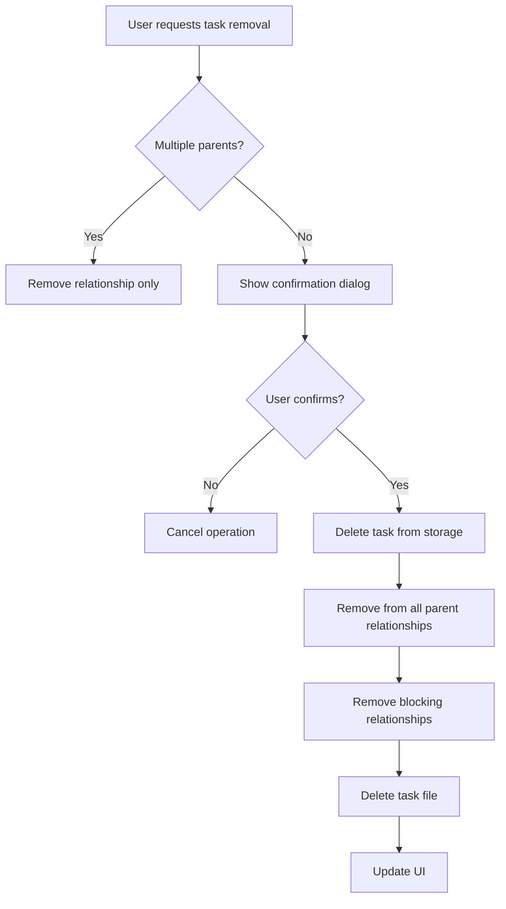

The deletion process recursively removes all relationships associated with the task, including parent-child connections and blocking dependencies, ensuring data consistency.

**Section sources**
- [MainWindowViewModel.cs](file://src/Unlimotion.ViewModel/MainWindowViewModel.cs#L700-L750)
- [FileTaskStorage.cs](file://src/Unlimotion/FileTaskStorage.cs#L310-L340)
- [TaskTreeManager.cs](file://src/Unlimotion.TaskTreeManager/TaskTreeManager.cs#L100-L150)

## Task State Transitions

Unlimotion implements a sophisticated state management system for tasks with multiple possible states: not completed, in progress, completed, and archived. The system automatically manages state transitions based on user actions and task dependencies.

### State Definitions

The TaskItem model defines the following states through the IsCompleted property:
- **Not completed (false)**: Task is active and can be worked on
- **Completed (true)**: Task has been finished
- **Archived (null)**: Task is inactive and stored for reference

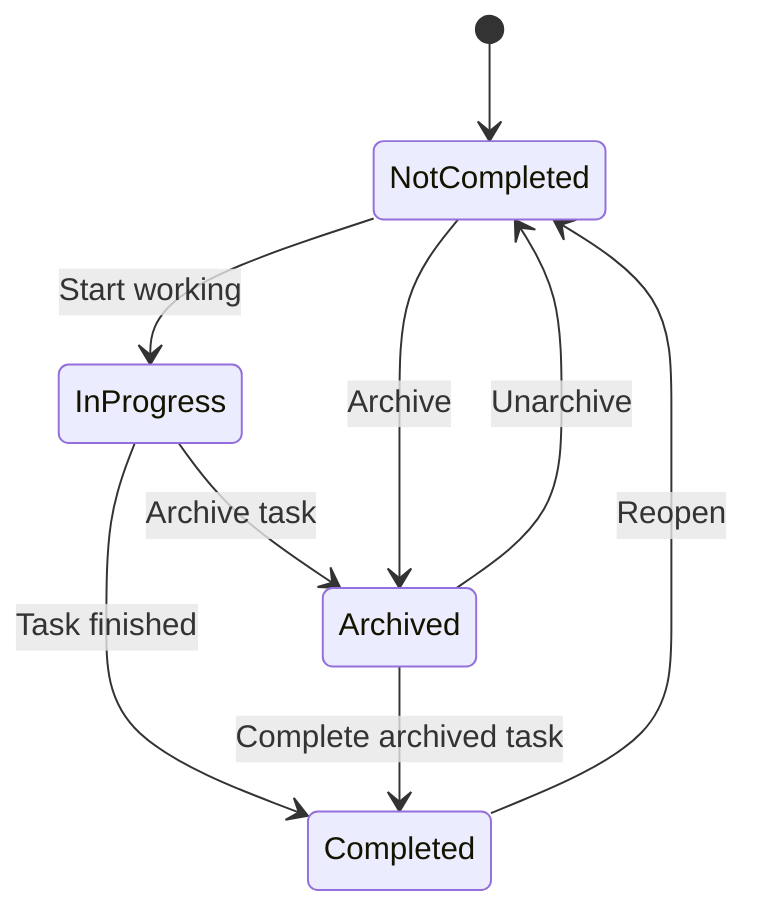

**Diagram sources**
- [TaskItem.cs](file://src/Unlimotion.Domain/TaskItem.cs#L10-L15)
- [TaskItemViewModel.cs](file://src/Unlimotion.ViewModel/TaskItemViewModel.cs#L200-L250)

### State Transition Logic

The TaskItemViewModel implements automatic state transitions through property change subscriptions. When a task's IsCompleted property changes, the system updates related timestamps:

```csharp
this.WhenAnyValue(m => m.IsCompleted).Subscribe(async b =>
{
    if (b == true && CompletedDateTime == null)
    {
        CompletedDateTime ??= DateTimeOffset.UtcNow;
        ArchiveDateTime = null;
        // Handle repeating tasks
        if (Repeater != null && Repeater.Type != RepeaterType.None && PlannedBeginDateTime.HasValue)
        {
            // Create next occurrence
        }
    }
    
    if (b == false)
    {
        ArchiveDateTime = null;
        CompletedDateTime = null;
    }
    
    if (b == null && ArchiveDateTime == null)
    {
        ArchiveDateTime ??= DateTimeOffset.UtcNow;
    }
});
```

When a task is marked as completed, the system sets the CompletedDateTime and clears the ArchiveDateTime. When a task is archived (IsCompleted = null), the ArchiveDateTime is set. When a task is reopened, both timestamps are cleared.

### Automatic Unlocking Logic

Tasks are automatically unlocked when all their dependencies are satisfied. The system determines if a task can be completed based on two conditions:
1. All contained tasks are completed
2. All blocking tasks are completed

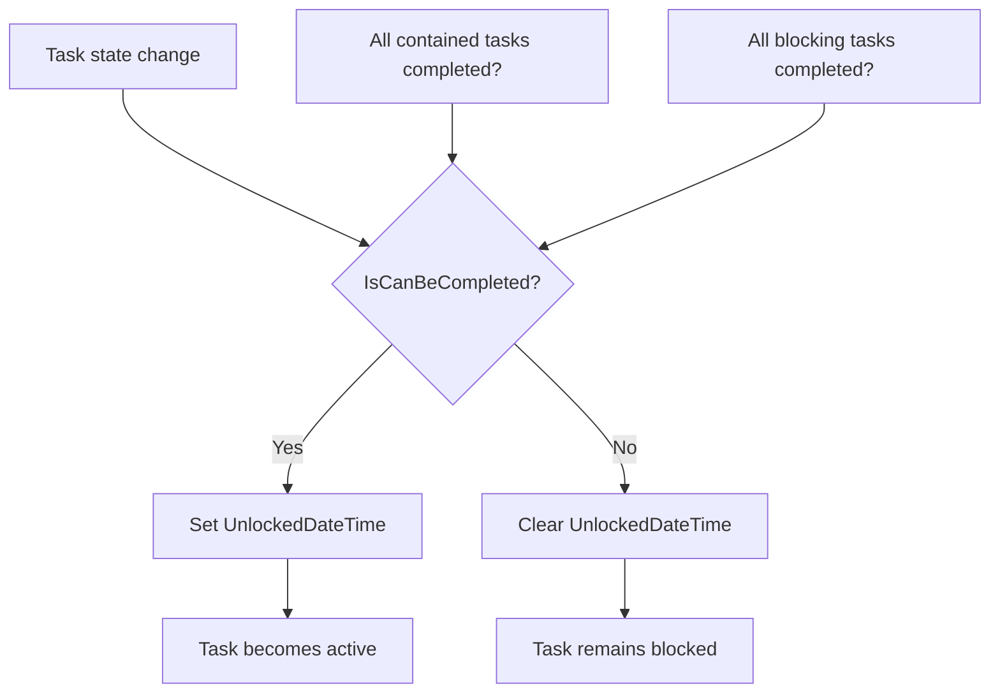

The IsCanBeCompleted property is automatically updated when the state of contained or blocking tasks changes, ensuring the UI accurately reflects task availability.

**Section sources**
- [TaskItemViewModel.cs](file://src/Unlimotion.ViewModel/TaskItemViewModel.cs#L200-L250)
- [TaskItemViewModel.cs](file://src/Unlimotion.ViewModel/TaskItemViewModel.cs#L150-L180)

## Reactive Command Implementation

The task management system in Unlimotion leverages ReactiveUI's ReactiveCommand pattern to implement asynchronous operations with proper error handling and UI feedback. The MainWindowViewModel contains several key commands that drive task operations.

### Command Registration

The `RegisterCommands` method in MainWindowViewModel initializes all task-related commands:

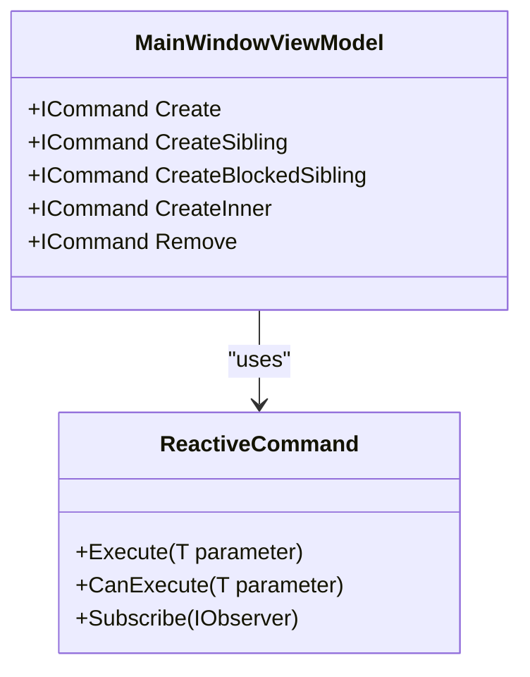

**Diagram sources**
- [MainWindowViewModel.cs](file://src/Unlimotion.ViewModel/MainWindowViewModel.cs#L80-L150)

Each command is created using `ReactiveCommand.CreateFromTask` to handle asynchronous operations. The commands are automatically added to the connectionDisposableList for proper resource management.

### Command Execution Flow

When a command is executed, it follows a consistent pattern:
1. Create a new task or prepare operation parameters
2. Call the appropriate storage method
3. Update the UI with the result
4. Handle errors and provide user feedback

For example, the Create command:

```csharp
Create = ReactiveCommand.CreateFromTask(async () =>
{
    var task = new TaskItemViewModel(new TaskItem(), taskRepository);
    await taskRepository?.Add(task);
    CurrentTaskItem = task;
    SelectCurrentTask();
});
```

The command creates a new TaskItemViewModel, adds it to storage, and updates the current selection.

### Error Handling and Feedback

Commands include built-in error handling through the ReactiveUI framework. When a command fails, the framework automatically manages the command's execution state and can provide visual feedback in the UI. The system also uses the INotificationManagerWrapper to display error messages to users when storage operations fail.

**Section sources**
- [MainWindowViewModel.cs](file://src/Unlimotion.ViewModel/MainWindowViewModel.cs#L80-L150)
- [MainWindowViewModel.cs](file://src/Unlimotion.ViewModel/MainWindowViewModel.cs#L650-L700)

## State Management in TaskItemViewModel

The TaskItemViewModel class serves as the central component for managing individual task state and business logic. It implements a reactive architecture that automatically responds to changes and maintains consistency across the application.

### Property Change Subscriptions

The ViewModel uses ReactiveUI's WhenAnyValue pattern to subscribe to property changes and trigger appropriate actions:

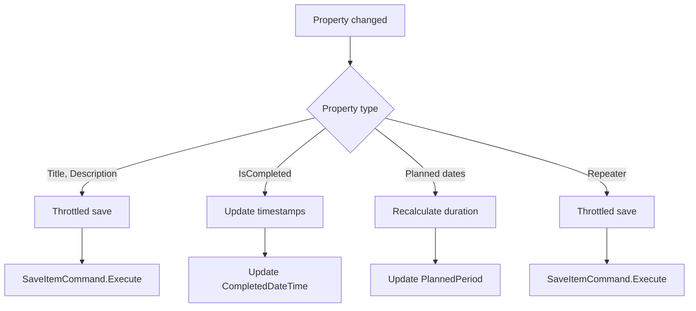

**Diagram sources**
- [TaskItemViewModel.cs](file://src/Unlimotion.ViewModel/TaskItemViewModel.cs#L250-L300)
- [TaskItemViewModel.cs](file://src/Unlimotion.ViewModel/TaskItemViewModel.cs#L380-L450)

### Automatic Saving

The system implements automatic saving with throttling to prevent excessive disk I/O:

```csharp
var propertyChanged = Observable
    .FromEventPattern<PropertyChangedEventHandler, PropertyChangedEventArgs>(
        h => inpc.PropertyChanged += h,
        h => inpc.PropertyChanged -= h)
    .Where(changed => ShouldSaveProperty(changed.EventArgs.PropertyName))
    .Publish(shared => shared.Where(_ => !MainWindowViewModel._isInited)
          .Merge(shared.Where(_ => MainWindowViewModel._isInited)
                .Throttle(PropertyChangedThrottleTimeSpanDefault)));

propertyChanged
    .Subscribe(_ => SaveItemCommand.Execute());
```

During initialization, changes are saved immediately. After initialization, changes are throttled by a default of 10 seconds to batch multiple changes into a single save operation.

### Collection Synchronization

The ViewModel maintains synchronized collections for task relationships using ObservableCollection:

```csharp
public static void SynchronizeCollections(ObservableCollection<string> observableCollection, List<string> list)
{
    // Remove items not in list
    for (int i = observableCollection.Count - 1; i >= 0; i--)
    {
        if (!list.Contains(observableCollection[i]))
        {
            observableCollection.RemoveAt(i);
        }
    }
    
    // Add items from list not in collection
    var existingItems = new HashSet<string>(observableCollection);
    foreach (var item in list)
    {
        if (!existingItems.Contains(item))
        {
            observableCollection.Add(item);
        }
    }
}
```

This ensures that the ViewModel's collections stay in sync with the underlying model data.

**Section sources**
- [TaskItemViewModel.cs](file://src/Unlimotion.ViewModel/TaskItemViewModel.cs#L250-L450)
- [TaskItemViewModel.cs](file://src/Unlimotion.ViewModel/TaskItemViewModel.cs#L700-L750)

## Storage and Persistence

Unlimotion implements a file-based storage system that persists tasks as individual JSON files in a designated directory. The system uses a layered architecture to separate storage concerns from business logic.

### Storage Interface

The ITaskStorage interface defines the contract for task storage operations:

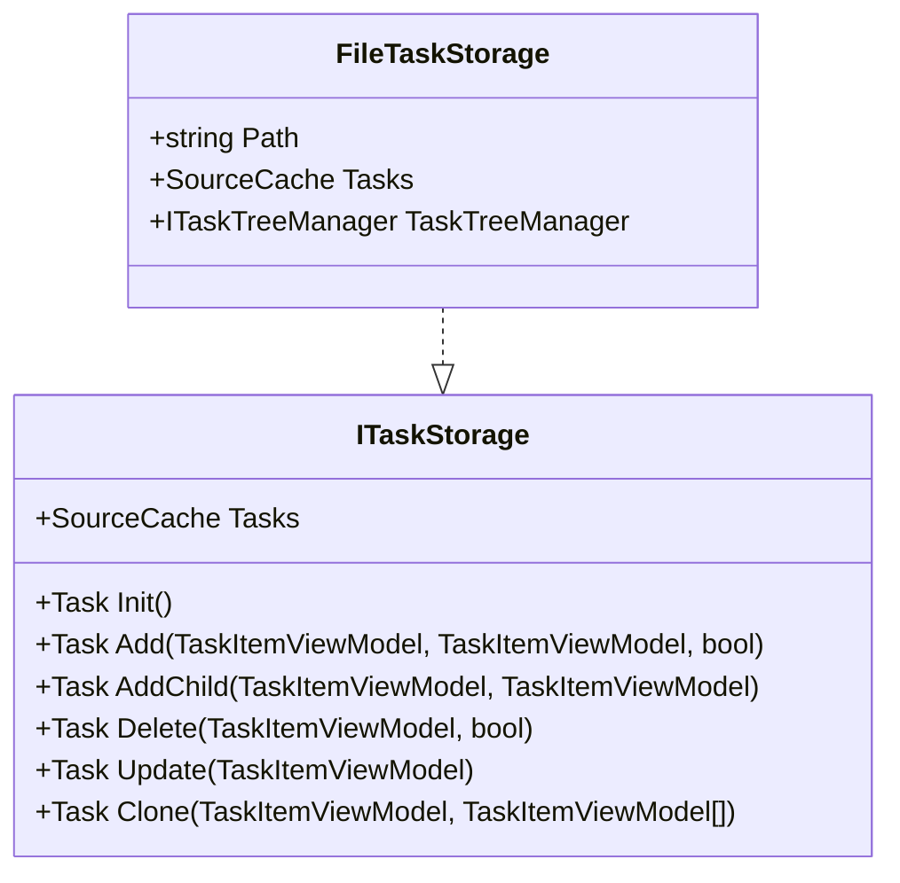

**Diagram sources**
- [ITaskStorage.cs](file://src/Unlimotion.ViewModel/ITaskStorage.cs#L10-L30)
- [FileTaskStorage.cs](file://src/Unlimotion/FileTaskStorage.cs#L20-L40)

### File-Based Persistence

The FileTaskStorage class implements the ITaskStorage interface using the file system:

```csharp
public async Task<bool> Save(TaskItem taskItem)
{
    var item = taskItem;
    item.Id ??= Guid.NewGuid().ToString();
    
    var directoryInfo = new DirectoryInfo(Path);
    var fileInfo = new FileInfo(Path.Combine(directoryInfo.FullName, item.Id));
    
    try
    {
        Updating?.Invoke(this, new TaskStorageUpdateEventArgs
        {
            Id = fileInfo.FullName,
            Type = UpdateType.Saved,
        });
        
        using var writer = fileInfo.CreateText();
        var json = JsonConvert.SerializeObject(item, Formatting.Indented, converter);
        await writer.WriteAsync(json);
        
        return true;
    }
    catch (Exception e)
    {
        return false;
    }
}
```

Each task is stored as a separate JSON file named by its ID, enabling efficient individual task operations.

### Task Tree Management

The TaskTreeManager class handles complex task relationships and operations:

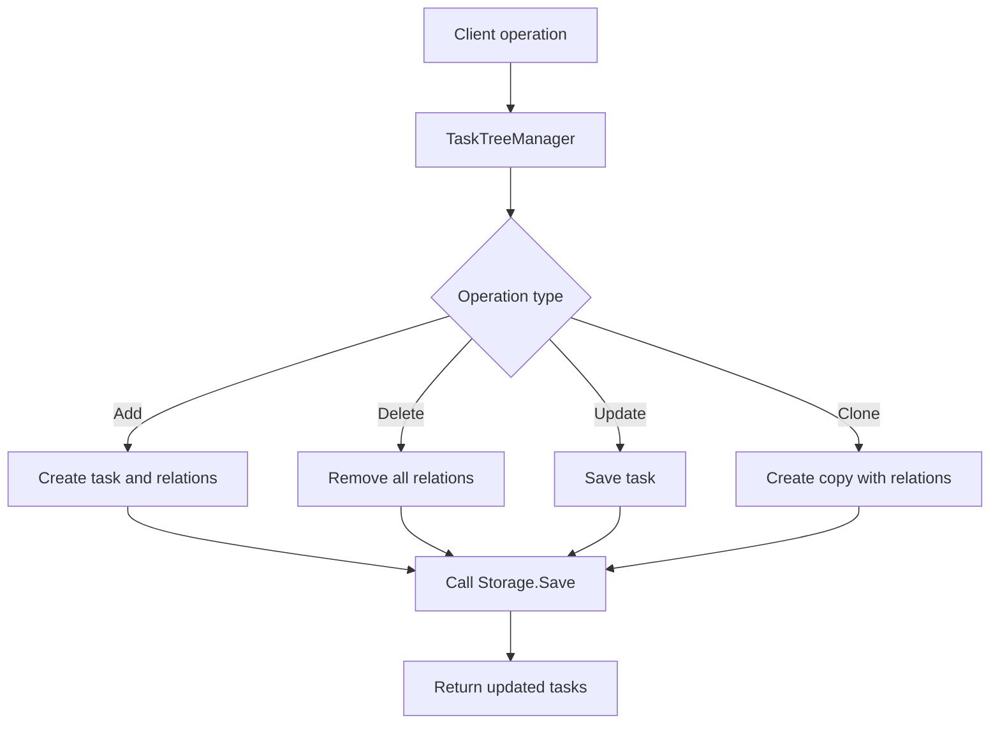

The manager ensures that all related tasks are properly updated when relationships change, maintaining data consistency.

**Section sources**
- [FileTaskStorage.cs](file://src/Unlimotion/FileTaskStorage.cs#L150-L415)
- [TaskTreeManager.cs](file://src/Unlimotion.TaskTreeManager/TaskTreeManager.cs#L10-L450)
- [ITaskStorage.cs](file://src/Unlimotion.ViewModel/ITaskStorage.cs#L10-L30)

## UI-Backend Synchronization

Unlimotion implements a robust synchronization system that ensures the UI remains consistent with the underlying data storage. The system uses reactive patterns to automatically update the UI when data changes.

### Change Detection

The system uses DynamicData and ReactiveUI to detect and respond to changes:

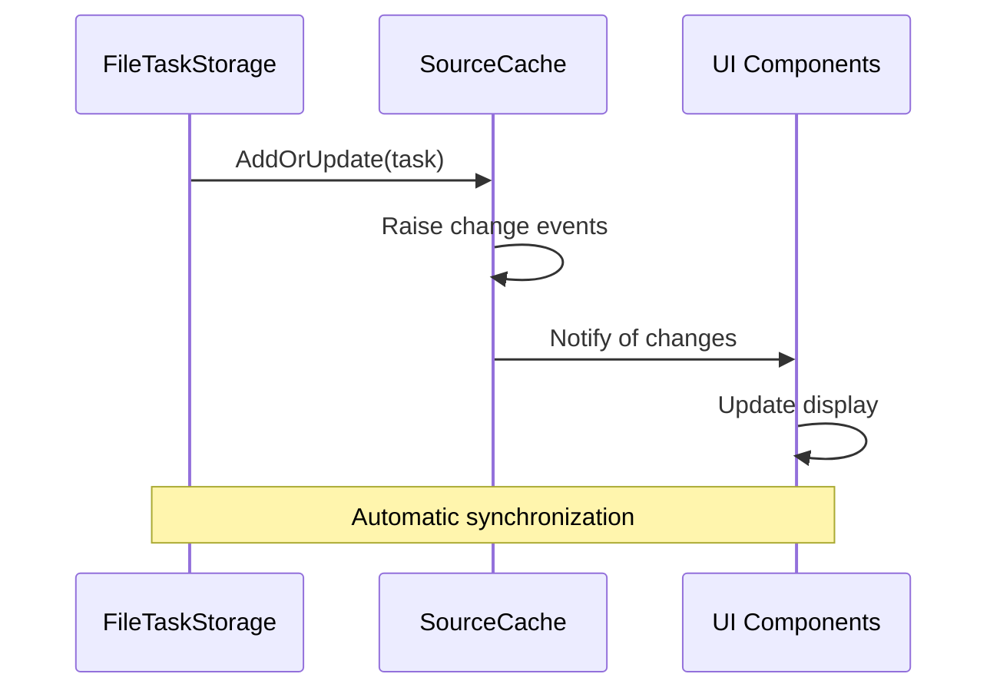

**Diagram sources**
- [FileTaskStorage.cs](file://src/Unlimotion/FileTaskStorage.cs#L200-L220)
- [MainWindowViewModel.cs](file://src/Unlimotion.ViewModel/MainWindowViewModel.cs#L160-L200)

### Property Change Propagation

When a task property changes, the system propagates the change through multiple layers:

1. UI updates ViewModel property
2. ViewModel triggers property changed event
3. Property changed subscription triggers save
4. Storage updates file
5. File watcher detects change
6. Storage reloads task
7. Cache updates with new data
8. UI bindings update display

This ensures that changes are persisted and reflected in the UI consistently.

### Real-time Updates

The system supports real-time updates through file watchers and event propagation:

```csharp
dbWatcher.OnUpdated += DbWatcherOnUpdated;

private async void DbWatcherOnUpdated(object sender, DbUpdatedEventArgs e)
{
    switch (e.Type)
    {
        case UpdateType.Saved:
            var taskItem = await Load(e.Id);
            if (taskItem != null)
            {
                var vml = Tasks.Lookup(taskItem.Id);
                if (vml.HasValue)
                {
                    var vm = vml.Value;
                    vm.Update(taskItem);
                }
                else
                {
                    var vm = new TaskItemViewModel(taskItem, this);
                    Tasks.AddOrUpdate(vm);
                }
            }
            break;
    }
}
```

This allows the system to respond to external changes (like file synchronization) and keep the UI up to date.

**Section sources**
- [FileTaskStorage.cs](file://src/Unlimotion/FileTaskStorage.cs#L100-L150)
- [MainWindowViewModel.cs](file://src/Unlimotion.ViewModel/MainWindowViewModel.cs#L160-L200)

## Special Cases and Validation

The task management system includes several special cases and validation rules to ensure data integrity and provide a good user experience.

### Unnamed Task Prevention

The system prevents the creation of unnamed tasks in certain contexts:

```csharp
CreateSibling = ReactiveCommand.CreateFromTask(async (bool isBlocked = false) =>
{
    if (CurrentTaskItem != null && string.IsNullOrWhiteSpace(CurrentTaskItem.Title))
        return;
        
    // Continue with task creation
});
```

When creating a sibling task, if the current task has no title, the operation is canceled. This prevents users from creating tasks without proper identification.

### Multi-Parent Relationships

The system handles tasks with multiple parents through careful relationship management:

```csharp
public bool RemoveRequiresConfirmation(string parentId) => 
    parentId == null || (Parents.Contains(parentId) ? Parents.Count == 1 : Parents.Count == 0);
```

When removing a task, the system checks if the task has multiple parents. If so, it only removes the relationship rather than deleting the task entirely, preserving the task for other parent relationships.

### Circular Dependency Prevention

While not explicitly implemented in the provided code, the system's architecture supports preventing circular dependencies through the TaskTreeManager. When establishing blocking relationships, the system could validate that the dependency chain does not create a loop.

### Emoji Extraction

The system extracts emojis from task titles for organizational purposes:

```csharp
const string EmojiPattern = @"[#*0-9]\uFE0F?\u20E3|©\uFE0F?|[®\u203C\u2049\u2122\u2139\u2194-\u2199\u21A9\u21AA]\uFE0F?";
        
public string Emoji => Regex.Match(Title ?? "", EmojiPattern).Value;
        
public string OnlyTextTitle => Regex.Replace(Title ?? "", EmojiPattern, "");
```

Emojis are used for filtering and organization, while the text title is used for display and searching.

**Section sources**
- [MainWindowViewModel.cs](file://src/Unlimotion.ViewModel/MainWindowViewModel.cs#L110-L120)
- [TaskItemViewModel.cs](file://src/Unlimotion.ViewModel/TaskItemViewModel.cs#L650-L700)
- [TaskItemViewModel.cs](file://src/Unlimotion.ViewModel/TaskItemViewModel.cs#L600-L620)

## Performance Considerations

The task management system includes several performance optimizations to handle large task hierarchies efficiently.

### Throttled Saving

To prevent excessive disk I/O, the system implements throttled saving:

```csharp
public static TimeSpan DefaultThrottleTime = TimeSpan.FromSeconds(10);

propertyChanged
    .Subscribe(_ =>
    {
        if (MainWindowViewModel._isInited)
            SaveItemCommand.Execute();
    });
```

After initialization, property changes are throttled by 10 seconds, batching multiple changes into a single save operation. This significantly reduces file system operations during rapid editing.

### Efficient Collection Updates

The system uses optimized collection synchronization to minimize UI updates:

```csharp
public static void SynchronizeCollections(ObservableCollection<string> observableCollection, List<string> list)
{
    // Use HashSet for O(1) lookups
    var set = new HashSet<string>(list);
    
    // Remove items not in set
    for (int i = observableCollection.Count - 1; i >= 0; i--)
    {
        if (!set.Contains(observableCollection[i]))
        {
            observableCollection.RemoveAt(i);
        }
    }
    
    // Add new items
    var existingItems = new HashSet<string>(observableCollection);
    foreach (var item in list)
    {
        if (!existingItems.Contains(item))
        {
            observableCollection.Add(item);
        }
    }
}
```

Using HashSet for lookups ensures O(1) complexity rather than O(n), improving performance with large collections.

### Lazy Loading and Caching

The system implements caching through SourceCache:

```csharp
public SourceCache<TaskItemViewModel, string> Tasks { get; private set; }
```

The cache stores loaded tasks and provides efficient lookup and change notification. This avoids repeatedly loading tasks from disk and enables efficient filtering and sorting operations.

### Memory Management

The system uses DisposableList to manage resource cleanup:

```csharp
public class MainWindowViewModel : DisposableList
{
    private DisposableList connectionDisposableList = new DisposableListRealization();
}
```

This ensures that event subscriptions and other resources are properly disposed, preventing memory leaks in long-running applications.

**Section sources**
- [TaskItemViewModel.cs](file://src/Unlimotion.ViewModel/TaskItemViewModel.cs#L250-L300)
- [TaskItemViewModel.cs](file://src/Unlimotion.ViewModel/TaskItemViewModel.cs#L700-L750)
- [MainWindowViewModel.cs](file://src/Unlimotion.ViewModel/MainWindowViewModel.cs#L20-L40)