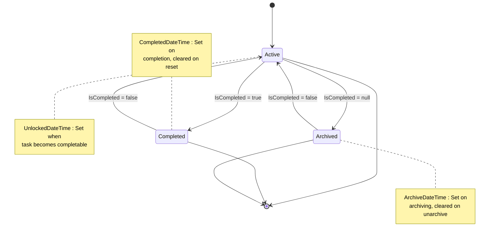
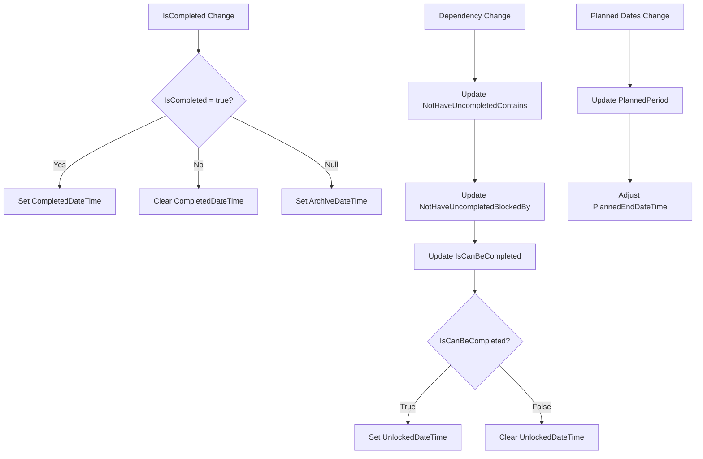
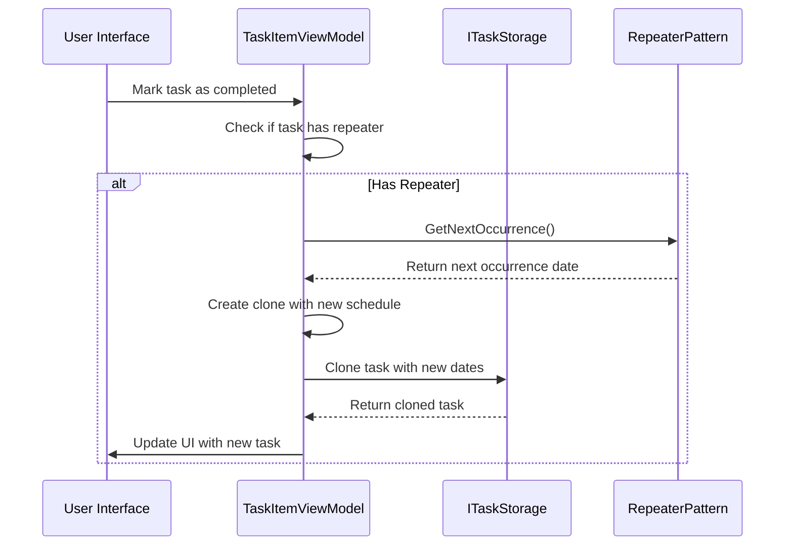

# Task State Management

<cite>
**Referenced Files in This Document**   
- [TaskItemViewModel.cs](file://src/Unlimotion.ViewModel/TaskItemViewModel.cs)
- [TaskItem.cs](file://src/Unlimotion.Domain/TaskItem.cs)
- [RepeaterPatternViewModel.cs](file://src/Unlimotion.ViewModel/RepeaterPatternViewModel.cs)
- [RepeaterPattern.cs](file://src/Unlimotion.Domain/RepeaterPattern.cs)
- [ITaskStorage.cs](file://src/Unlimotion.ViewModel/ITaskStorage.cs)
</cite>

## Table of Contents
1. [Introduction](#introduction)
2. [Core State Properties](#core-state-properties)
3. [State Transition Logic](#state-transition-logic)
4. [Reactive Property Updates](#reactive-property-updates)
5. [Repeatable Task Handling](#repeatable-task-handling)
6. [Archiving and Unarchiving](#archiving-and-unarchiving)
7. [Child Task Status Management](#child-task-status-management)
8. [Best Practices and Common Issues](#best-practices-and-common-issues)

## Introduction
This document details the task state management system in Unlimotion, focusing on the implementation of state transitions in the `TaskItemViewModel` class. The system manages task completion, unlocking, archiving, and repetition through a reactive architecture that ensures consistent state across the application. The design integrates domain model states with ViewModel properties to provide a seamless user experience while maintaining data integrity.

## Core State Properties

The task state management system revolves around three key properties in the `TaskItemViewModel` class that reflect the current state of a task and its eligibility for various operations.

**Section sources**
- [TaskItemViewModel.cs](file://src/Unlimotion.ViewModel/TaskItemViewModel.cs#L1-L757)
- [TaskItem.cs](file://src/Unlimotion.Domain/TaskItem.cs#L1-L32)

### IsCompleted Property
The `IsCompleted` property represents the completion status of a task with three possible states:
- `true`: Task is completed
- `false`: Task is active and not completed
- `null`: Task is archived

This tri-state model allows for clear distinction between active, completed, and archived tasks, enabling appropriate UI rendering and business logic execution.

### IsCanBeCompleted Property
The `IsCanBeCompleted` property determines whether a task can be marked as completed based on its dependencies. A task can be completed only when:
- All contained subtasks are completed (no uncompleted subtasks)
- All blocking tasks are completed (no uncompleted blocking tasks)

This property is computed based on the completion status of related tasks and is updated reactively when dependencies change.

### ArchiveDateTime Property
The `ArchiveDateTime` property tracks when a task was archived. It is automatically set when:
- A task is archived (marked as completed with `IsCompleted = null`)
- The task transitions to the archived state

The property is cleared when a task is unarchived or completed, ensuring accurate tracking of archiving events.

## State Transition Logic

The state transition system in Unlimotion implements automatic timestamp management based on state changes, ensuring consistent audit trails and temporal tracking.

**Diagram sources**
- [TaskItemViewModel.cs](file://src/Unlimotion.ViewModel/TaskItemViewModel.cs#L1-L757)
- [TaskItem.cs](file://src/Unlimotion.Domain/TaskItem.cs#L1-L32)

**Section sources**
- [TaskItemViewModel.cs](file://src/Unlimotion.ViewModel/TaskItemViewModel.cs#L1-L757)
- [TaskItem.cs](file://src/Unlimotion.Domain/TaskItem.cs#L1-L32)

### Completion Workflow
When a task is marked as completed (`IsCompleted = true`):
1. `CompletedDateTime` is set to the current UTC time if not already set
2. `ArchiveDateTime` is cleared (since completed tasks are not archived)
3. For repeatable tasks, a new instance is cloned with updated scheduling

### Archiving Workflow
When a task is archived (`IsCompleted = null`):
1. `ArchiveDateTime` is set to the current UTC time if not already set
2. `CompletedDateTime` is cleared (archived tasks are not considered completed)
3. Child tasks may be automatically archived based on user confirmation

### Activation Workflow
When a task is reactivated (`IsCompleted = false`):
1. Both `CompletedDateTime` and `ArchiveDateTime` are cleared
2. The task returns to an active state
3. `UnlockedDateTime` may be set if the task becomes completable

## Reactive Property Updates

The system implements reactive programming patterns to automatically update task states based on dependencies and property changes.

**Diagram sources**
- [TaskItemViewModel.cs](file://src/Unlimotion.ViewModel/TaskItemViewModel.cs#L1-L757)

**Section sources**
- [TaskItemViewModel.cs](file://src/Unlimotion.ViewModel/TaskItemViewModel.cs#L1-L757)

### WhenAnyValue Subscriptions
The implementation uses ReactiveUI's `WhenAnyValue` to monitor property changes and update related states:

- **IsCompleted Subscription**: Automatically manages `CompletedDateTime` and `ArchiveDateTime` based on the completion state
- **Dependency Monitoring**: Tracks completion status of contained and blocking tasks to determine `IsCanBeCompleted`
- **IsCanBeCompleted Subscription**: Updates `UnlockedDateTime` when the task becomes completable or loses completable status

These subscriptions ensure that timestamp properties are automatically maintained without requiring manual intervention from the UI layer.

## Repeatable Task Handling

The system supports repeatable tasks through the Repeater pattern, which automatically creates new task instances when a repeatable task is completed.

**Diagram sources**
- [TaskItemViewModel.cs](file://src/Unlimotion.ViewModel/TaskItemViewModel.cs#L1-L757)
- [RepeaterPatternViewModel.cs](file://src/Unlimotion.ViewModel/RepeaterPatternViewModel.cs#L1-L173)
- [RepeaterPattern.cs](file://src/Unlimotion.Domain/RepeaterPattern.cs#L1-L24)

**Section sources**
- [TaskItemViewModel.cs](file://src/Unlimotion.ViewModel/TaskItemViewModel.cs#L1-L757)
- [RepeaterPatternViewModel.cs](file://src/Unlimotion.ViewModel/RepeaterPatternViewModel.cs#L1-L173)

### Repeater Pattern Implementation
The `RepeaterPattern` class in the domain model defines how tasks repeat, with properties for:
- Type (None, Daily, Weekly, Monthly, Yearly)
- Period (frequency of repetition)
- AfterComplete (whether to schedule from completion time)
- Pattern (specific days for weekly repetition)

The `RepeaterPatternViewModel` provides a ViewModel wrapper that exposes these properties for UI binding and implements the `GetNextOccurrence` method to calculate future task dates.

### Cloning Process
When a repeatable task is completed:
1. A new `TaskItem` is created with the same properties as the original
2. The `PlannedBeginDateTime` is updated using the repeater's `GetNextOccurrence` method
3. The `PlannedEndDateTime` is adjusted proportionally if it exists
4. The cloned task is added to storage via the `Clone` method

This process ensures that recurring tasks continue to appear in the user's task list at the specified intervals.

## Archiving and Unarchiving

The archiving system provides a way to remove tasks from active view while preserving their history and data.

**Section sources**
- [TaskItemViewModel.cs](file://src/Unlimotion.ViewModel/TaskItemViewModel.cs#L1-L757)

### ArchiveCommand Implementation
The `ArchiveCommand` handles both archiving and unarchiving operations:

- **Archiving (IsCompleted = false)**: Sets `IsCompleted` to `null` and prompts to archive child tasks
- **Unarchiving (IsCompleted = null)**: Sets `IsCompleted` to `false` and prompts to unarchive child tasks

The command is only enabled when the task is not already completed (`IsCompleted != true`), preventing completed tasks from being archived.

### State Transitions
The archiving process follows a clear state transition pattern:
- Active → Archived: `IsCompleted` changes from `false` to `null`
- Archived → Active: `IsCompleted` changes from `null` to `false`
- Completed tasks cannot be archived directly

This ensures that archived tasks can be restored to an active state while maintaining a clear distinction between completed and archived tasks.

## Child Task Status Management

The system includes sophisticated handling of child task statuses during archiving operations to maintain data consistency.

**Section sources**
- [TaskItemViewModel.cs](file://src/Unlimotion.ViewModel/TaskItemViewModel.cs#L1-L757)

### ShowModalAndChangeChildrenStatuses
This method provides a consistent interface for managing child task statuses:

- **User Confirmation**: Displays a modal dialog asking the user to confirm the operation
- **Recursive Processing**: Applies status changes to all child tasks recursively
- **Contextual Messaging**: Uses the parent task's title in confirmation messages for clarity

The method handles both archiving and unarchiving of child tasks, ensuring that the entire task hierarchy can be managed consistently.

### Child Task Detection
The system identifies child tasks that should be affected by archiving operations:

- **Archived Children**: Tasks with `IsCompleted = null` when unarchiving a parent
- **Uncompleted Children**: Tasks with `IsCompleted = false` when archiving a parent

This selective approach prevents completed child tasks from being unnecessarily modified during archiving operations.

## Best Practices and Common Issues

### State Management Best Practices
1. **Use the tri-state model**: Leverage `true`, `false`, and `null` for `IsCompleted` to distinguish between completed, active, and archived states
2. **Rely on reactive updates**: Allow the system to automatically manage timestamp properties rather than setting them manually
3. **Handle repeaters consistently**: Ensure all repeatable tasks use the same pattern for cloning and scheduling
4. **Preserve audit trails**: Never clear timestamp properties once set, except during state transitions that invalidate them

### Common Issues and Solutions
1. **Unintended State Cascades**: When archiving a parent task, ensure child tasks are only affected when explicitly confirmed by the user
2. **Timestamp Inconsistencies**: Verify that `CompletedDateTime`, `ArchiveDateTime`, and `UnlockedDateTime` are mutually exclusive and properly managed
3. **Repeater Configuration Errors**: Validate repeater settings before allowing task completion to prevent invalid scheduling
4. **Circular Dependencies**: Check for circular parent-child relationships that could cause infinite loops during status updates

The implementation follows reactive programming principles to minimize manual state management and reduce the risk of inconsistent states across the application.