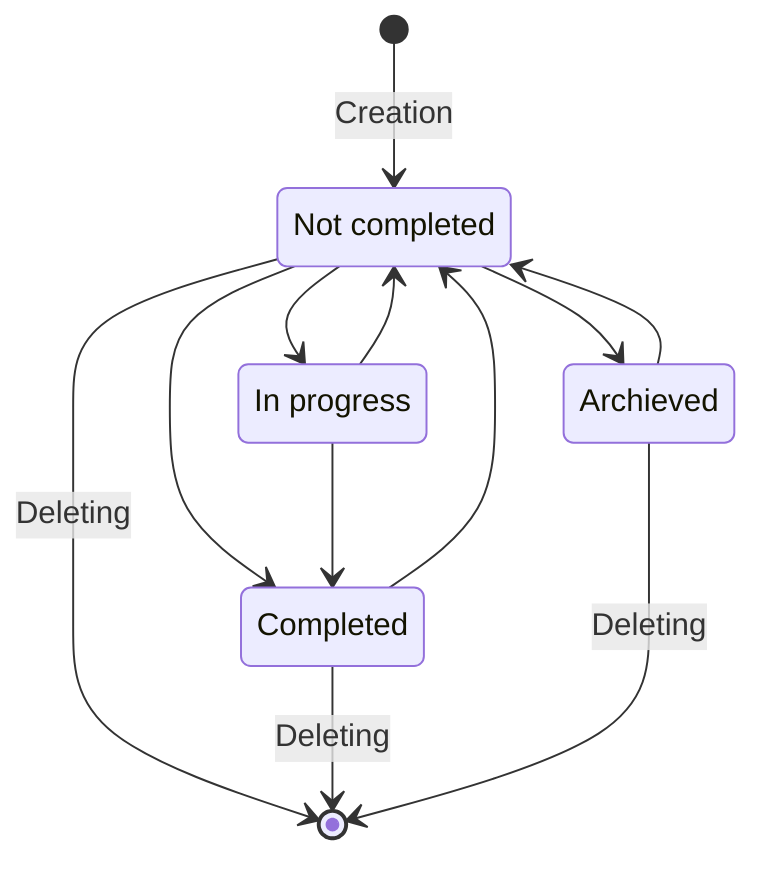

# User Guide

<cite>
**Referenced Files in This Document**   
- [README.md](file://README.md)
- [MainWindowViewModel.cs](file://src/Unlimotion.ViewModel/MainWindowViewModel.cs) - *Updated in recent commit*
- [TaskItemViewModel.cs](file://src/Unlimotion.ViewModel/TaskItemViewModel.cs)
- [FileTaskStorage.cs](file://src/Unlimotion/FileTaskStorage.cs)
- [TaskItem.cs](file://src/Unlimotion.Domain/TaskItem.cs)
- [SettingsViewModel.cs](file://src/Unlimotion.ViewModel/SettingsViewModel.cs)
- [TaskWrapperViewModel.cs](file://src/Unlimotion.ViewModel/TaskWrapperViewModel.cs) - *Updated in recent commit*
- [MainControl.axaml](file://src/Unlimotion/Views/MainControl.axaml) - *Updated in recent commit*
- [MainControl.axaml.cs](file://src/Unlimotion/Views/MainControl.axaml.cs) - *Updated in recent commit*
</cite>

## Update Summary
**Changes Made**   
- Updated Task Creation section to reflect automatic expansion of parent task hierarchies when creating inner tasks
- Added details about UI behavior improvements in the All Tasks view
- Enhanced documentation of the CreateInner command implementation
- Updated section sources to include newly analyzed files
- Added references to UI components that trigger the task creation functionality

## Table of Contents
1. [Introduction](#introduction)
2. [Task Management Workflows](#task-management-workflows)
3. [Task States and Transitions](#task-states-and-transitions)
4. [Interface Navigation](#interface-navigation)
5. [Keyboard Shortcuts](#keyboard-shortcuts)
6. [Drag-and-Drop Operations](#drag-and-drop-operations)
7. [Emoji-Based Filtering](#emoji-based-filtering)
8. [Practical User Workflows](#practical-user-workflows)
9. [Troubleshooting Guide](#troubleshooting-guide)

## Introduction
Unlimotion is a powerful task management application designed to help users organize their work with unlimited task nesting, execution chains, and flexible task relationships. The application allows tasks to exist in multiple parent tasks simultaneously, providing a unique approach to task organization that goes beyond traditional hierarchical structures. Data is stored locally on the user's device, ensuring privacy and control over personal information. The interface is divided into three main parts: breadcrumbs showing the current task's hierarchy path, a detailed information panel for the selected task, and a left panel with various tabs for different views of the task system.

**Section sources**
- [README.md](file://README.md#L1-L50)

## Task Management Workflows

### Task Creation
Tasks in Unlimotion can be created in three different ways relative to the currently selected task: as siblings, as blocked siblings, or as inner tasks. These creation methods are accessible through buttons on the top right panel or via keyboard shortcuts. When creating a new task, it's essential to provide a name, as unnamed tasks disable the creation buttons. Sibling tasks are created at the same level as the selected task, while inner tasks become nested within the selected task as child tasks. Blocked sibling creation establishes a dependency relationship where the new task cannot be completed until the parent task is completed.

A significant improvement has been implemented in the task creation workflow: when creating an inner task, the entire parent task hierarchy in the All Tasks view is automatically expanded. This enhancement ensures that the newly created nested task becomes immediately visible to the user, improving the overall user experience by eliminating the need for manual expansion of parent tasks to locate the new task.

**Updated** Automatic expansion of parent hierarchy when creating inner tasks

**Section sources**
- [MainWindowViewModel.cs](file://src/Unlimotion.ViewModel/MainWindowViewModel.cs#L100-L120) - *Updated in recent commit*
- [TaskWrapperViewModel.cs](file://src/Unlimotion.ViewModel/TaskWrapperViewModel.cs#L68-L124) - *Updated in recent commit*
- [MainControl.axaml](file://src/Unlimotion/Views/MainControl.axaml#L200-L210) - *Updated in recent commit*
- [MainControl.axaml.cs](file://src/Unlimotion/Views/MainControl.axaml.cs#L250-L260) - *Updated in recent commit*

### Task Deletion
Tasks can be permanently deleted through two methods: clicking the "❌" button in the task list or using the **Shift+Delete** keyboard shortcut. When a task is deleted, all associated relationships are automatically updated throughout the system. The application provides confirmation dialogs when deleting tasks that have children, allowing users to choose whether to also delete or preserve the child tasks. This ensures that users don't accidentally remove important task hierarchies without being aware of the consequences.

**Section sources**
- [README.md](file://README.md#L100-L150)
- [MainWindowViewModel.cs](file://src/Unlimotion.ViewModel/MainWindowViewModel.cs#L50-L150)
- [FileTaskStorage.cs](file://src/Unlimotion/FileTaskStorage.cs#L200-L300)

### Task Relationships
Each task can have four types of relationships with other tasks: parent tasks, containing tasks, blocking tasks, and blocked tasks. Parent tasks represent higher-level tasks that contain the current task as an integral part. Containing tasks are child tasks that represent steps or components of the current task. Blocking tasks must be completed before the current task can be unlocked, while blocked tasks cannot be completed until the current task is finished. These relationships create a complex web of dependencies that help users manage interrelated tasks across different projects.

**Section sources**
- [README.md](file://README.md#L100-L150)
- [MainWindowViewModel.cs](file://src/Unlimotion.ViewModel/MainWindowViewModel.cs#L50-L150)
- [FileTaskStorage.cs](file://src/Unlimotion/FileTaskStorage.cs#L200-L300)

## Task States and Transitions

### Task States Overview
Any task in Unlimotion can exist in one of four distinct states: Not Completed, In Progress, Completed, or Archived. Each state is represented visually with specific icons: an empty checkbox for Not Completed tasks, a checkbox with a square for Archived tasks, an empty checkbox with a clock for In Progress tasks, and a checkbox with a check mark for Completed tasks. These visual indicators make it easy to quickly assess the status of tasks at a glance.

**Diagram sources**
- [README.md](file://README.md#L60-L80)

### State Transition Rules
The acceptable transitions between task states follow specific rules designed to maintain data integrity and logical workflow progression. From the Not Completed state, tasks can transition to Completed, Archived, or In Progress states. Tasks in the In Progress state can return to Not Completed status or move to Completed status. Completed tasks can be reopened by returning to the Not Completed state, allowing for corrections or additional work. Similarly, Archived tasks can be restored to the Not Completed state when they become relevant again. These transitions ensure that tasks can be managed flexibly throughout their lifecycle while maintaining a clear history of their status changes.

### Blocking Logic
A task is considered blocked and cannot be completed if any of the following conditions are met: it has uncompleted tasks within it, it has uncompleted blocking tasks, or any of its parent tasks have uncompleted blocking tasks. Blocked tasks are visually distinguished by a more transparent color of the checkbox and task description text. This blocking mechanism ensures that dependent tasks cannot be completed prematurely, maintaining the integrity of task dependencies across the entire hierarchy. The system automatically updates blocking status when related tasks change state, providing real-time feedback on task availability.

**Section sources**
- [README.md](file://README.md#L55-L95)
- [TaskItemViewModel.cs](file://src/Unlimotion.ViewModel/TaskItemViewModel.cs#L50-L100)
- [TaskItem.cs](file://src/Unlimotion.Domain/TaskItem.cs#L10-L30)

## Interface Navigation

### All Tasks View
The All Tasks view provides a hierarchical representation of all tasks in the system, with root-level tasks (those without parents) displayed at the top level. This view allows users to navigate the complete task hierarchy and understand the relationships between tasks. The hierarchical structure can be expanded and collapsed to focus on specific branches of the task tree. This view is particularly useful for understanding the overall structure of projects and identifying tasks that may need reorganization. When creating an inner task, the parent task hierarchy is automatically expanded to make the new task immediately visible to the user.

**Updated** Automatic expansion of parent hierarchy when creating inner tasks

**Section sources**
- [README.md](file://README.md#L150-L250)
- [MainWindowViewModel.cs](file://src/Unlimotion.ViewModel/MainWindowViewModel.cs#L200-L400)
- [MainControl.axaml](file://src/Unlimotion/Views/MainControl.axaml#L100-L150) - *Updated in recent commit*

### Last Created View
The Last Created view displays all tasks sorted by creation date in descending order, with the most recently created tasks appearing at the top. This view helps users quickly access tasks they've recently added to the system without having to navigate through the hierarchy. It's particularly useful for continuing work on recently started tasks or reviewing the most recent additions to the task list.

**Section sources**
- [README.md](file://README.md#L150-L250)
- [MainWindowViewModel.cs](file://src/Unlimotion.ViewModel/MainWindowViewModel.cs#L200-L400)

### Unlocked View
The Unlocked view, also known as the "Window of Opportunity," displays only those tasks that are currently available for execution. This view filters out blocked tasks and shows only tasks that can be worked on immediately. It serves as a focused workspace for users to concentrate on actionable items without distractions from tasks that are not yet ready to be addressed.

**Section sources**
- [README.md](file://README.md#L150-L250)
- [MainWindowViewModel.cs](file://src/Unlimotion.ViewModel/MainWindowViewModel.cs#L200-L400)

### Completed and Archived Views
The Completed view shows a list of completed tasks in reverse order of completion, with the most recently completed tasks at the top. Similarly, the Archived view displays archived tasks in reverse order of archiving. Archived tasks represent tasks that are no longer needed but are kept for reference. These views allow users to review past work and maintain a clean active task list while preserving historical information.

**Section sources**
- [README.md](file://README.md#L150-L250)
- [MainWindowViewModel.cs](file://src/Unlimotion.ViewModel/MainWindowViewModel.cs#L200-L400)

### Roadmap View
The Roadmap view presents tasks as a directed graph inspired by development trees in games. This visualization shows task relationships with green arrows representing parent-child relationships and red arrows indicating blocking relationships. The roadmap provides a visual representation of the paths required to reach specific goals, making it easier to understand complex dependency chains and plan work accordingly.

**Section sources**
- [README.md](file://README.md#L150-L250)
- [MainWindowViewModel.cs](file://src/Unlimotion.ViewModel/MainWindowViewModel.cs#L200-L400)

### Settings View
The Settings view allows users to modify application parameters that affect its operation. Key settings include the TaskStorage Path, which determines where task files are saved in JSON format. Users can specify an absolute or relative path, with tasks defaulting to a "Tasks" directory in the application's working directory if no path is specified. Additional settings related to Git backup and server mode are also accessible through this interface.

**Section sources**
- [README.md](file://README.md#L150-L250)
- [MainWindowViewModel.cs](file://src/Unlimotion.ViewModel/MainWindowViewModel.cs#L200-L400)

## Keyboard Shortcuts

### Task Creation Shortcuts
Unlimotion provides several keyboard shortcuts to streamline task creation:
- **Ctrl+Enter**: Creates a sibling task at the same level as the selected task
- **Shift+Enter**: Creates a sibling task and blocks it with the selected task
- **Ctrl+Tab**: Creates an inner task nested within the selected task

These shortcuts allow for rapid task creation without requiring mouse interaction, significantly improving workflow efficiency for keyboard-centric users. When using Ctrl+Tab to create an inner task, the parent task hierarchy is automatically expanded in the All Tasks view to ensure the new task is immediately visible.

**Updated** Automatic expansion of parent hierarchy when using Ctrl+Tab shortcut

**Section sources**
- [README.md](file://README.md#L250-L280)
- [MainWindowViewModel.cs](file://src/Unlimotion.ViewModel/MainWindowViewModel.cs#L100-L150)
- [MainControl.axaml](file://src/Unlimotion/Views/MainControl.axaml#L50-L60) - *Updated in recent commit*

### Navigation and Management Shortcuts
Additional keyboard shortcuts enhance task management:
- **Shift+Delete**: Deletes the selected task (alternative to clicking the "❌" button)
- **Ctrl+Tab**: Cycles through interface tabs
- Various shortcuts for emoji input depending on the operating system:
  - Windows: **Win+.**
  - macOS: **Cmd+Ctrl+Space**
  - Ubuntu: **Ctrl+.**

These shortcuts provide quick access to common operations, reducing the need for mouse navigation and allowing users to maintain focus on their task management workflow.

**Section sources**
- [README.md](file://README.md#L250-L280)
- [MainWindowViewModel.cs](file://src/Unlimotion.ViewModel/MainWindowViewModel.cs#L100-L150)

## Drag-and-Drop Operations

### Basic Drag-and-Drop
In all tabs, users can perform drag-and-drop operations with the left mouse button to modify task relationships. The task being moved is called the "draggable" task, while the task on which the mouse button is released is called the "target" task. The specific operation performed depends on which modifier keys are pressed when releasing the mouse button.

**Section sources**
- [README.md](file://README.md#L280-L300)
- [FileTaskStorage.cs](file://src/Unlimotion/FileTaskStorage.cs#L350-L400)

### Modifier Key Operations
Different modifier keys trigger different operations during drag-and-drop:
- **No keys**: Attaches the draggable task to the target task as a child
- **Shift**: Moves the draggable task to the target task, replacing any existing relationship
- **Ctrl**: Makes the draggable task block the target task
- **Alt**: Makes the target task block the draggable task
- **Ctrl+Shift**: Clones the draggable task as a subtask of the target task

These operations provide flexible ways to reorganize task hierarchies and establish dependencies without requiring multiple steps or menu navigation.

**Section sources**
- [README.md](file://README.md#L280-L300)
- [FileTaskStorage.cs](file://src/Unlimotion/FileTaskStorage.cs#L350-L400)

## Emoji-Based Filtering

### Emoji Inheritance
When an emoji is present in a task name, it becomes possible to filter tasks based on that emoji. Importantly, emojis are inherited by subtasks, meaning that child tasks will display the emojis of their parent tasks even if they don't contain emojis in their own titles. This inheritance allows for consistent categorization across task hierarchies and makes it easier to identify related tasks across different levels of the hierarchy.

**Section sources**
- [README.md](file://README.md#L300-L330)
- [TaskItemViewModel.cs](file://src/Unlimotion.ViewModel/TaskItemViewModel.cs#L700-L750)

### Filtering Interface
Emoji filters appear as buttons on tabs where tasks are not displayed in hierarchical form. Clicking these buttons toggles the display of tasks containing the corresponding emoji. This filtering mechanism provides a visual way to organize tasks by category or project without requiring formal tagging systems. The filters are particularly useful in the Last Created, Unlocked, Completed, and Archived views where tasks are displayed in flat lists.

**Section sources**
- [README.md](file://README.md#L300-L330)
- [TaskItemViewModel.cs](file://src/Unlimotion.ViewModel/TaskItemViewModel.cs#L700-L750)

### Emoji Input Methods
The method for adding emojis to task names varies by operating system:
- Windows: Use the **Win+.** keyboard shortcut to open the emoji picker
- macOS: Use the **Cmd+Ctrl+Space** keyboard shortcut to open the emoji picker
- Ubuntu: Use the **Ctrl+.** keyboard shortcut to open the emoji picker

These system-specific shortcuts provide quick access to a wide range of emojis for task categorization.

**Section sources**
- [README.md](file://README.md#L300-L330)
- [TaskItemViewModel.cs](file://src/Unlimotion.ViewModel/TaskItemViewModel.cs#L700-L750)

## Practical User Workflows

### Project Setup Workflow
When starting a new project, users typically begin by creating a root-level task with a descriptive name and appropriate emoji. They then use the **Ctrl+Tab** shortcut to create inner tasks representing the main components of the project. As they identify dependencies between components, they use drag-and-drop with the **Ctrl** key to establish blocking relationships. This approach allows for rapid project structuring while maintaining flexibility to reorganize as the project evolves. The automatic expansion of parent hierarchies ensures that newly created inner tasks are immediately visible in the All Tasks view.

**Updated** Automatic expansion of parent hierarchy in project setup workflow

**Section sources**
- [README.md](file://README.md#L330-L350)
- [MainWindowViewModel.cs](file://src/Unlimotion.ViewModel/MainWindowViewModel.cs#L400-L500)

### Daily Task Management
For daily task management, users often start by reviewing the Unlocked view to identify available tasks. They may use emoji filters to focus on specific categories of work. When completing tasks, they use the checkbox interface or keyboard shortcuts to update task states. At the end of the day, they might review the Completed view to assess their productivity and archive tasks that are truly finished using the Archive button.

**Section sources**
- [README.md](file://README.md#L330-L350)
- [MainWindowViewModel.cs](file://src/Unlimotion.ViewModel/MainWindowViewModel.cs#L400-L500)

### Cross-Project Task Management
One of Unlimotion's unique features is the ability for a task to be a child of multiple parent tasks simultaneously. This is particularly useful for cross-project tasks that contribute to multiple goals. Users can create a task and then use drag-and-drop to add it as a child to multiple parent tasks, effectively using the task as a shared component across projects. This eliminates the need to duplicate tasks and ensures that progress is reflected in all relevant contexts.

**Section sources**
- [README.md](file://README.md#L330-L350)
- [MainWindowViewModel.cs](file://src/Unlimotion.ViewModel/MainWindowViewModel.cs#L400-L500)

## Troubleshooting Guide

### Common Issues and Solutions
- **Creation buttons disabled**: Ensure the currently selected task has a name, as unnamed tasks disable creation buttons
- **Tasks not appearing in expected views**: Check task states and blocking conditions, as these affect visibility in different views
- **Emoji filters not working**: Verify that emojis are properly entered using the system emoji picker and that inheritance is functioning correctly
- **Drag-and-drop operations not producing expected results**: Ensure the correct modifier keys are pressed during the operation

**Section sources**
- [README.md](file://README.md#L350-L380)
- [FileTaskStorage.cs](file://src/Unlimotion/FileTaskStorage.cs#L100-L150)
- [SettingsViewModel.cs](file://src/Unlimotion.ViewModel/SettingsViewModel.cs#L1-L50)

### Data Management
The application automatically saves tasks when links change, eliminating the need for manual saving in most cases. However, users should be aware that task data is stored in JSON format in the specified TaskStorage Path. If issues arise with task data, users can locate these files for backup or troubleshooting purposes. The Git backup feature can also be configured to automatically synchronize task data with a remote repository for added data security.

**Section sources**
- [README.md](file://README.md#L350-L380)
- [FileTaskStorage.cs](file://src/Unlimotion/FileTaskStorage.cs#L100-L150)
- [SettingsViewModel.cs](file://src/Unlimotion.ViewModel/SettingsViewModel.cs#L1-L50)