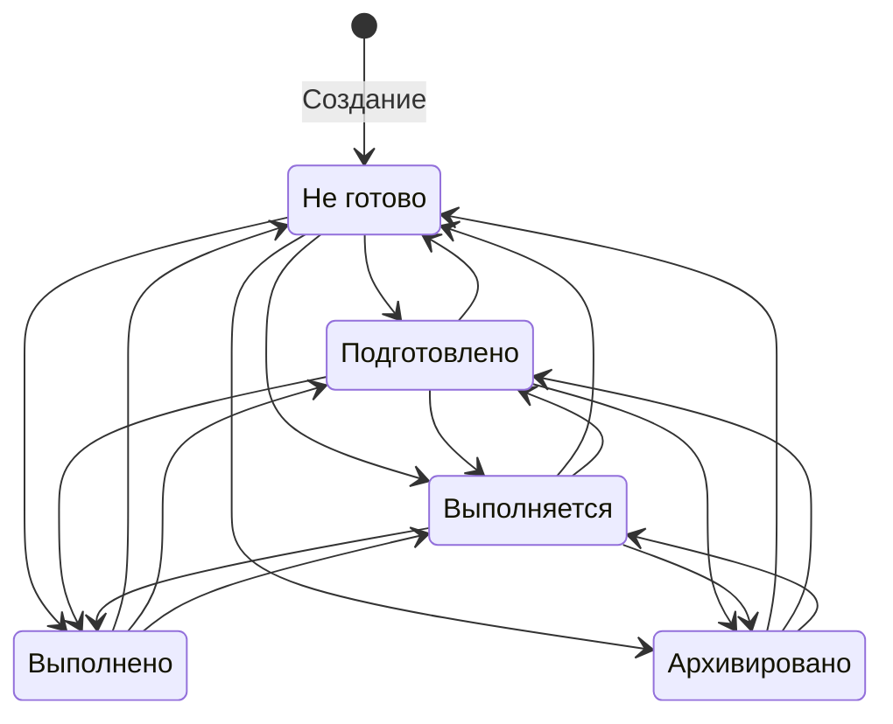

# Unlimotion
# [Switch to English Readme](README.md)


## Сильные стороны
1. Неограниченные уровни вложенности задач
2. Возможность выстраивать цепочки выполнения с помощью блокирования задач
3. Задача может быть подзадачей сразу в нескольких задачах
4. Хранение ваших данных на вашем устройстве

## Скачать и установить

Готовые самодостаточные опубликованные сборки доступны на странице [последнего релиза GitHub](https://github.com/Kibnet/Unlimotion/releases/latest). Для них не требуется .NET SDK. Наличие опубликованного файла не гарантирует совместимость с каждой версией ОС: полная матрица smoke-тестов платформ ещё формируется.

| Доступная сборка | Какой файл выбрать | Текущий статус проверки |
| --- | --- | --- |
| Windows x64 | `Unlimotion-win-Setup.exe` или `Unlimotion-win-Portable.zip` | Опубликовано. Проект пока не публикует проверяемое подтверждение Authenticode-подписи. Microsoft Defender SmartScreen может показать предупреждение. |
| Linux x64 (AppImage) | `Unlimotion.AppImage` | Опубликованный универсальный вариант для Linux; совместимость с дистрибутивами ещё не проверена полной smoke-матрицей. |
| Linux x64 (.deb) | `Unlimotion-<version>.deb` | Предварительная сборка. Совместимость с актуальными выпусками Debian пока не подтверждена. |
| macOS x64 | `Unlimotion-osx-Setup.pkg` или `Unlimotion-osx-Portable.zip` | Сборка для Intel. Проект пока не публикует проверяемое подтверждение Developer ID-подписи и notarization. |
| macOS arm64 | `Unlimotion-osx-arm64-Setup.pkg` или `Unlimotion-osx-arm64-Portable.zip` | Сборка для Apple Silicon. Проект пока не публикует проверяемое подтверждение Developer ID-подписи и notarization. |
| Android arm64 | `Unlimotion-<version>-android-arm64.apk` | APK для установки вручную. Проект декларирует минимум Android 6.0 / API 23, но это не гарантия совместимости со всеми устройствами. |
| Android x64 | `Unlimotion-<version>-android-x64.apk` | APK для установки вручную, прежде всего для устройств и эмуляторов x86_64; действует та же оговорка о минимальной версии Android. |

- Portable ZIP для Windows или macOS нужно распаковать перед запуском находящегося внутри приложения.
- После загрузки AppImage выполните:

```bash
chmod +x Unlimotion.AppImage
./Unlimotion.AppImage
```

- В macOS проект пока не публикует проверяемое подтверждение подписи и notarization для этих пакетов. Gatekeeper может заблокировать их. Если вы доверяете загруженному файлу, следуйте официальной инструкции Apple [Open Anyway](https://support.apple.com/en-us/102445). Изменение прав файлов не подтверждает доверие или notarization.
- Android устанавливается вне магазина приложений. ОС может запросить разрешение на установку из выбранного источника; точный сценарий зависит от версии Android и устройства. При обновлении из приложения Android скачивает подходящий APK и запрашивает системное подтверждение установки.
- Встроенное обновление desktop-приложения доступно, только когда Velopack распознаёт текущую установку как управляемую. Portable-сборки и запуск из исходников не должны полагаться на этот механизм — для них используйте страницу Releases.

## Сборка и запуск из исходников

При клонировании `main` вы получаете текущий snapshot разработки. Стабильную сборку или соответствующий ей архив исходников выбирайте на странице Releases выше.

Предварительные требования:

- Git
- [.NET 10 SDK](https://dotnet.microsoft.com/en-us/download/dotnet/10.0), совместимый с `global.json`
- Доступ к NuGet для первого восстановления зависимостей

Выполняйте команды из корня репозитория.

Windows PowerShell:

```powershell
git clone https://github.com/Kibnet/Unlimotion.git
Set-Location Unlimotion
.\run.windows.cmd
```

Linux или macOS:

```bash
git clone https://github.com/Kibnet/Unlimotion.git
cd Unlimotion

# Linux
bash ./run.linux.sh

# macOS
bash ./run.macos.sh
```

## Концептуальное описание

### Состояния задачи
Любая задача может находиться только в одном из пяти статусов.
1. Не готово - пустой квадрат
2. Подготовлено - квадрат со знаком `!`
3. Выполняется - квадрат со знаком `play`
4. Выполнено - квадрат с галочкой
5. Архивировано - квадрат с квадратом внутри

Статус `Подготовлено` означает, что в задаче достаточно контекста, чтобы её можно было брать в работу или делегировать. Заблокированность по зависимостям и плановым датам не является статусом: она вычисляется отдельно и визуально делает задачу серой.

Допустимые переходы описаны диаграммой:

```mermaid
stateDiagram-v2
    notReady: Не готово
    prepared: Подготовлено
    inProgress: Выполняется
    completed: Выполнено
    archived: Архивировано
    [*] --> notReady: Создание
    notReady --> prepared
    notReady --> inProgress
    notReady --> completed
    notReady --> archived
    prepared --> notReady
    prepared --> inProgress
    prepared --> completed
    prepared --> archived
    inProgress --> notReady
    inProgress --> prepared
    inProgress --> completed
    inProgress --> archived
    archived --> notReady
    archived --> prepared
    archived --> inProgress
    completed --> notReady
    completed --> prepared
    completed --> inProgress
```

Переход в `Выполняется` запрещается, если задача заблокирована зависимостями или плановая дата начала ещё в будущем. Переход в `Выполнено` запрещается, если есть невыполненные дочерние задачи, блокеры или неотмеченные критерии проверки выполнения.

При импорте/экспорте Markdown outline используются маркеры:

| Маркер | Статус |
| --- | --- |
| `[ ]` | Не готово |
| `[!]` | Подготовлено |
| `[>]` | Выполняется |
| `[x]` | Выполнено |
| `[#]` | Архивировано |

Один и тот же переключатель статуса доступен в списках задач, дорожной карте и карточке текущей задачи, поэтому задачу можно переводить между подготовкой, выполнением, завершением и архивом без смены представления.

### Связи задач
У каждой задачи могут быть связи с другими задачами 4 типов:
1. **Parents Tasks** - родительские задачи, которые содержат эту задачу внутри себя как составную часть, необходимую для выполнения.
2. **Containing Tasks** - дочерние задачи, которые являются частью или шагами этой задачи и возникают в процессе декомпозиции.
3. **Blocking Tasks** - блокирующие задачи, которые должны быть выполнены чтобы разблокировать текущую.
4. **Blocked Tasks** - заблокированные задачи, которые не могут быть разблокированы пока эта задача невыполнена.

### Иерархия задач
Все задачи имеют своё место в общей древовидной иерархии. Самый первый уровень называется корневым, на нём находятся задачи, у которых нет связей с родительскими задачами.
Любая задача может стать дочерней для другой задачи, визуально это выглядит как вложенность в дереве задач. 
В отличие от других планировщиков задач, в Unlimotion позволяется одной задаче быть дочерней сразу для нескольких других задач. 
Это бывает удобно в случаях, когда задача имеет межпроектное значение и не может быть отнесена только к одной родительской задаче. 
Также эту особенность можно использовать как замену тэгам, можно создать родительскую задачу с определённым смыслом и добавить в неё имеющиеся задачи как дочерние, которые имеют отношение к этому смыслу. 
Это позволит наблюдать одну и ту же задачу в разных срезах на уровне иерархии.

### Блокировка
Заблокированная задача не может быть выполнена, пока не станет разблокированной.
Заблокированность визуально выражается более прозрачным цветом чекбокса и текста описания задачи.
Задача считается **Заблокированной**, если у неё:
1. Есть невыполненные задачи внутри (Containing)
2. Есть невыполненные блокирующие (Blocking) задачи
3. Есть невыполненные блокирующие (Blocking) задачи у любой родительской (Parents) задачи

## Описание интерфейса

Интерфейс состоит из 3 частей:
1. Сверху так называемые хлебные крошки, которые показывают путь в иерархии текущей выбранной задачи.
2. Справа панель детализированной информации текущей выделенной задачи, там отображаются все поля задачи доступные для просмотра и редактирования.
3. Левая панель имеет возможность переключения между вкладками:

Скриншоты ниже собираются из детерминированного синтетического рабочего набора через UI-автоматизацию, поэтому README можно обновлять после редизайна без ручной подготовки демонстрационных задач.

### All Tasks
Показывает все задачи в иерархическом виде (древовидном). 
В корне находятся те задачи, у которых нет родителей.


### Last Created
Показывает все задачи по дате создания в убывающем порядке.


### Last Updated
Показывает задачи с самыми свежими изменениями в начале списка.


### Unlocked
Окно возможностей - показывает только те задачи, которые сейчас доступны для выполнения.


### Completed
Список выполненных задач в обратном порядке выполнения - последние сверху.


### Выполняется
Плоский список задач со статусом `Выполняется`. Вкладка помогает быстро увидеть текущую работу и сколько времени задача уже находится в этом статусе.


### Archived
Список архивных задач в обратном порядке архивирования - последние сверху. Сюда попадают задачи, которые уже не нужно выполнять, но и удалять их не хочется.


### Last Opened
Показывает задачи, которые открывались последними, чтобы было проще быстро вернуться к недавнему рабочему контексту.


### Roadmap
Отображение задач в виде дорожной карты. Вдохновлено деревом развития из игр. В этом представлении отображаются задачи в виде направленного графа, который позволяет визуализировать дорожки из задач, которые нужно выполнить чтобы прийти к цели.
Зелёные стрелки - отношение ребёнок к родителю
Красные стрелки - отношение блокирующей задачи к блокируемой


### Settings
Окно настроек - позволяет изменять параметры, влияющие на работу программы.
- **TaskStorage Path** - Путь к каталогу(папке) с задачами. Именно по этому пути будут сохраняться файлы задач в формате JSON. Путь может быть указан в абсолютном или относительном формате.
Если путь не указан, то задачи сохраняются в каталоге "Tasks", который создаётся в рабочем каталоге из которого была запущена программа.
- **SSH Key Storage Path** - Папка, где Git-бэкап хранит SSH-ключи и отдельный файл `known_hosts`, если используется SSH remote.


## Как начать работать
### Создание задач
Создание новых задач всегда происходит относительно выбранной задачи. Чтобы это сделать можно воспользоваться кнопками на правой панели сверху со знаком "➕" или использовать горячие клавиши:
- **➕Sibling (Ctrl+Enter)** - Создать задачу на том же уровне, что и выбранная
- **➕🔒Sibling (Shift+Enter)** - Создать задачу на том же уровне, что и выбранная и заблокировать её выбранной
- **➕Inner (Ctrl+Tab)** - Создать вложенную задачу внутри выбранной
- **Завершить текущую задачу (Ctrl+D)** - Перевести выбранную/текущую задачу в завершённые

Кнопка **Показать горячие клавиши** в настройках и клавиша **F1** открывают полный встроенный справочник сочетаний.

После создания задачи нужно заполнить название текущей задачи, потому что если выбрана задача без названия, кнопки создания отключаются.

### Управление раскрытием дерева
Во всех вкладках со списками задач и в relation-деревьях карточки доступны горячие клавиши управления раскрытием:
- **Развернуть вложенные текущего (Ctrl+Shift+Right)** - Развернуть выбранный узел и все его вложенные узлы
- **Свернуть вложенные текущего (Ctrl+Shift+Left)** - Свернуть вложенные узлы у выбранного узла
- **Развернуть все узлы (Ctrl+Alt+Right)** - Развернуть все узлы в активном дереве
- **Свернуть все узлы (Ctrl+Alt+Left)** - Свернуть все узлы в активном дереве

### Удаление задач
Задачи удаляются безвозвратно при нажатии кнопки "❌" в списке задач.
Также при нажатии **Shift+Delete** происходит удаление выбранной задачи.

### Перетаскивание мышью
Во всех вкладках вы можете выполнять действия перетаскивания задачи левой кнопкой мыши. Та задача, которую вы потянули, называется перетаскиваемой.
Та задача, на которой вы отпускаете кнопку мыши, называется целевой.
В зависимости от того, какие кнопки на клавиатуре зажаты, когда вы отпускаете левую кнопку мыши, выполняются разные команды:
- **Без клавиш** - Вложить перетаскиваемую задачу в целевую задачу
- **Shift** - Переместить перетаскиваемую задачу в целевую задачу
- **Ctrl** - Перетаскиваемая задача блокирует целевую задачу
- **Alt** - Целевая задача блокирует перетаскиваемую задачу
- **Ctrl+Shift** - Клонировать перетаскиваемую задачу в целевую как подзадачу

### Группировка по эмодзи
Если в названии задачи присутствует символ эмодзи, то появляется возможность быстро фильтровать такие задачи и содержащиеся в них с помощью фильтров на вкладках.
Чтобы добавить эмодзи в текстовое поле воспользуйтесь специальным меню:
- В Windows оно вызывается сочетанием клавиш **Win+.**
- В MacOS оно вызывается сочетанием клавиш **Cmd+Ctrl+Пробел**
- В Ubuntu оно вызывается сочетанием клавиш **Ctrl+.**

На вкладках, где отображаются задачи не в иерархическом виде, слева от названия у каждой задачи отображаются все эмодзи, которые есть у родительских задач.
Это позволяет визуально сразу понять откуда эта задача.

Фильтры по эмодзи открываются как searchable multi-select dropdown: можно набрать часть названия или emoji, оставить список открытым и включить несколько include/exclude-фильтров без сброса панели.
