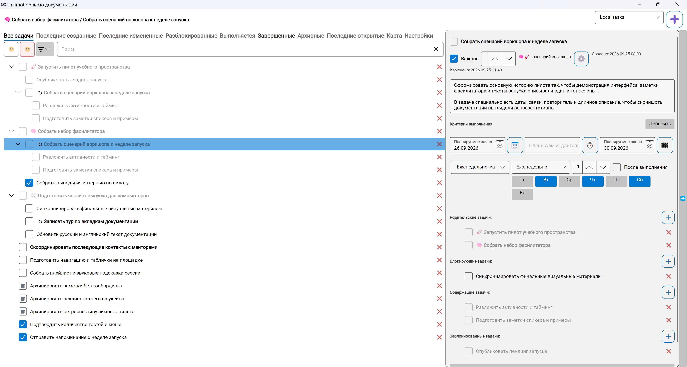
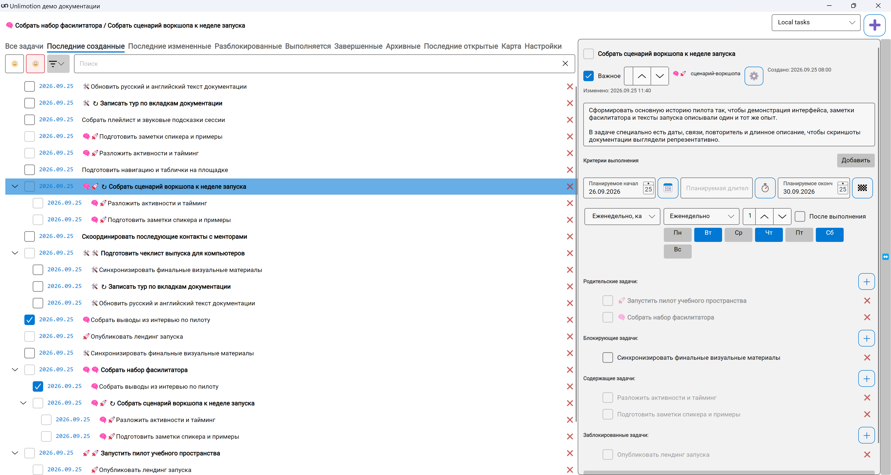
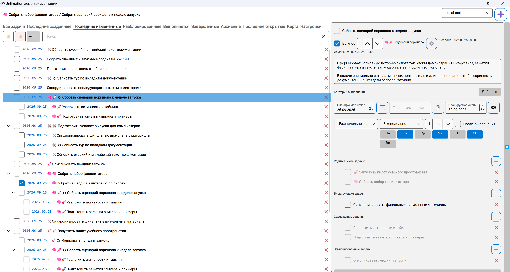
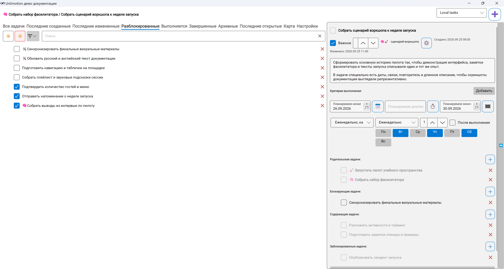
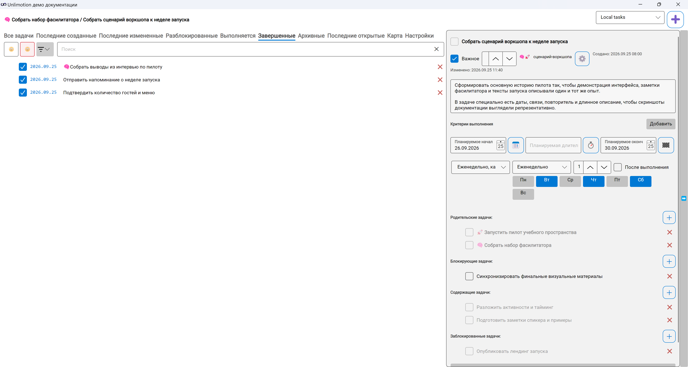
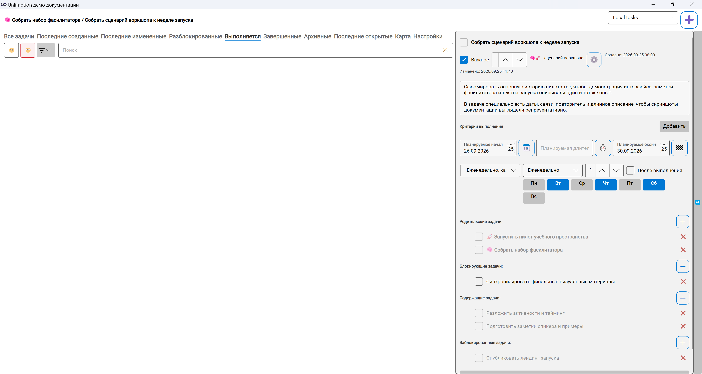
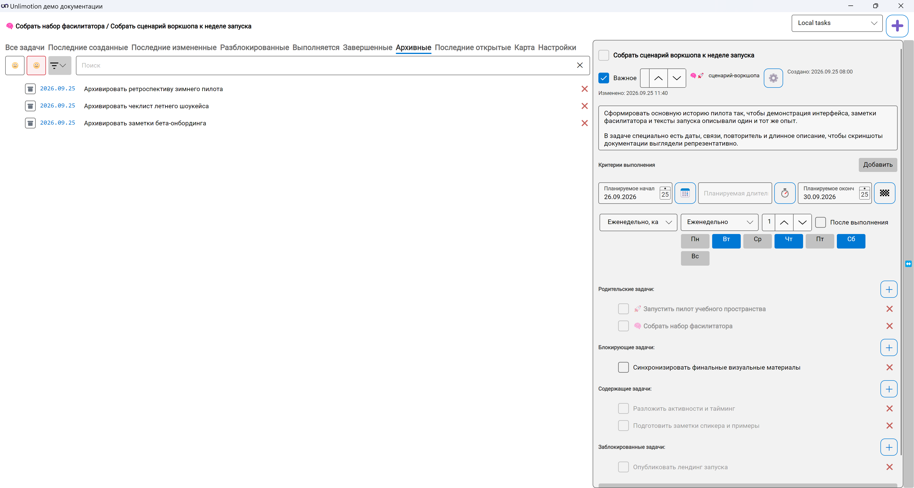
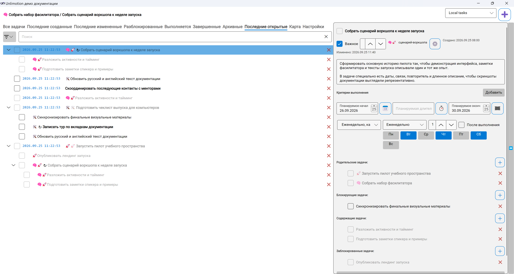
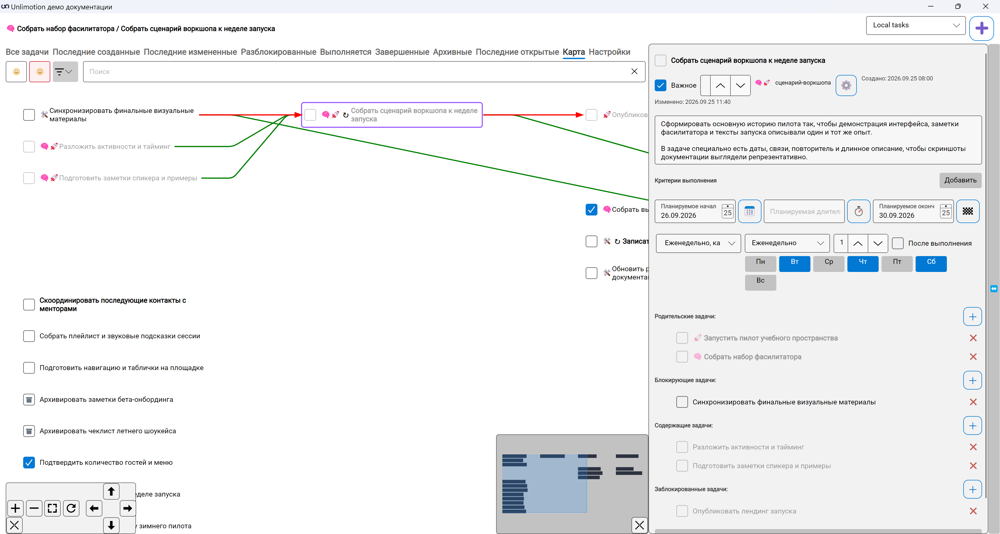
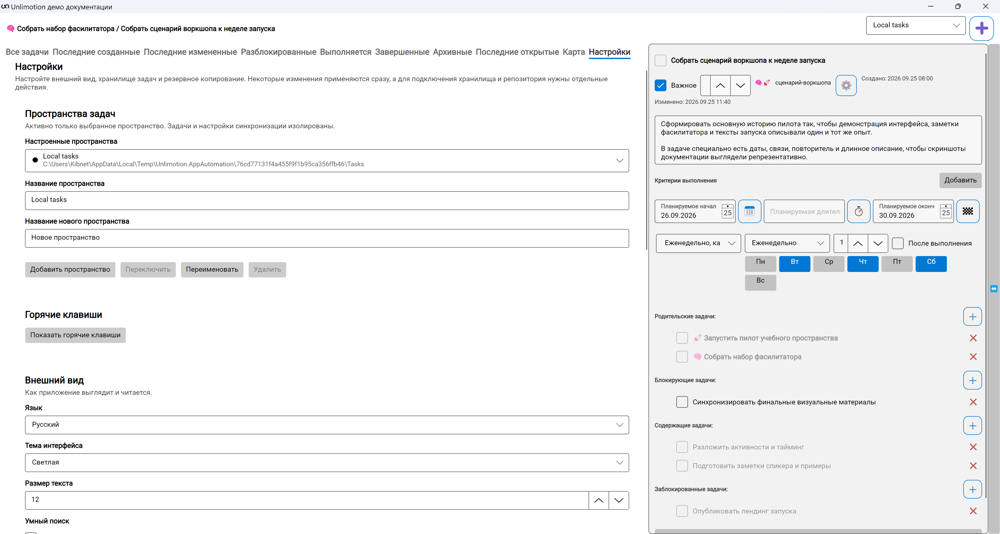

# Unlimotion

[English version](README.md)

Unlimotion — планировщик задач для работы, которой тесно в обычном списке: задача может одновременно относиться к нескольким проектам, зависеть от других задач и быть частью общего графа работ.

## Возможности

- Многоуровневый граф задач: у одной задачи может быть несколько родительских.
- Зависимости и блокировки, по которым видно, какую работу уже можно начать.
- Статусы, плановые даты начала и критерии завершения.
- Локальное хранилище по умолчанию, а также серверное хранилище и Git-бэкап в настройках.
- Командный клиент для просмотра и автоматизации работы с каталогами задач.

## Скачать и установить

Опубликованные пакеты доступны на странице [последнего релиза GitHub](https://github.com/Kibnet/Unlimotion/releases/latest). Выберите артефакт для своей платформы:

| Платформа | Типы опубликованных артефактов |
| --- | --- |
| Windows x64 | Установщик или portable ZIP-архив |
| Linux x64 | AppImage или пакет Debian |
| macOS Intel | Пакет-установщик или portable ZIP-архив |
| macOS Apple Silicon | Пакет-установщик или portable ZIP-архив |
| Android arm64 | APK для установки вручную |
| Android x64 | APK прежде всего для устройств и эмуляторов x86_64 |

Наличие артефакта не является обещанием совместимости с каждой версией ОС или каждым устройством. Перед установкой проверьте заметки к релизу и выберите пакет для своей платформы.

- Portable ZIP-архив для Windows или macOS нужно распаковать перед запуском приложения из него.
- Для запуска Linux AppImage выполните:

~~~bash
chmod +x Unlimotion.AppImage
./Unlimotion.AppImage
~~~

- Android-пакеты устанавливаются вне магазина приложений. Система может запросить разрешение на установку из выбранного источника и подтверждение установки.
- Если macOS не позволяет открыть файл, которому вы доверяете, воспользуйтесь официальной инструкцией Apple [Open Anyway](https://support.apple.com/en-us/102445).

## Сборка и запуск из исходников

При клонировании main вы получаете текущую версию в разработке. Стабильный пакет или соответствующий ему архив исходников берите на странице Releases выше.

Предварительные требования:

- Git
- [.NET 10 SDK](https://dotnet.microsoft.com/en-us/download/dotnet/10.0), совместимый с global.json
- доступ к NuGet для первого восстановления зависимостей

Выполняйте команды из корня репозитория.

Windows PowerShell:

~~~powershell
git clone https://github.com/Kibnet/Unlimotion.git
Set-Location Unlimotion
.\run.windows.cmd
~~~

Linux или macOS:

~~~bash
git clone https://github.com/Kibnet/Unlimotion.git
cd Unlimotion

# Linux
bash ./run.linux.sh

# macOS
bash ./run.macos.sh
~~~

## Как устроены задачи

### Пространства задач

Один экземпляр приложения может хранить несколько именованных пространств задач. Переключайте активное пространство селектором в шапке, а в первом разделе настроек добавляйте, переименовывайте, переключайте и удаляйте пространства из списка.

Одновременно активно только одно пространство. Его источник задач и полный профиль синхронизации Git изолированы от остальных: задачи разных пространств не показываются вместе, а связи между ними запрещены. Чтобы настроить хранилище или Git другого пространства, сначала переключитесь на него. Удаление пространства удаляет только его конфигурацию и сохранённые учётные данные из приложения — файлы задач и удалённый репозиторий не удаляются и не перемещаются.

### Статусы и доступность

У каждой задачи есть один статус жизненного цикла:

| Статус | Маркер Markdown outline |
| --- | --- |
| Не готово | [ ] |
| Подготовлено | [!] |
| Выполняется | [>] |
| Выполнено | [x] |
| Архивировано | [#] |

Статус и доступность по графу — разные вещи. Задача недоступна по графу, пока у неё есть активные невыполненные вложенные задачи, прямые блокеры или блокеры, унаследованные от родительской задачи. Недоступную задачу нельзя начать или завершить. Будущая плановая дата начала также запрещает переход в статус «Выполняется», а для завершения должны быть выполнены все критерии завершения.

### Связи и иерархия

Задача может быть связана с другими четырьмя способами:

1. **Родительские задачи** содержат текущую задачу.
2. **Вложенные задачи** — шаги или части текущей задачи.
3. **Блокеры** должны быть завершены, чтобы текущая задача стала доступна.
4. **Заблокированные задачи** ожидают завершения текущей задачи.

Задачи без родительских находятся в корне. Одна задача может быть вложена сразу в несколько родительских, поэтому одна и та же работа видна в нескольких проектах или смысловых группировках без дублирования.

## Интерфейс

Рабочая область объединяет хлебные крошки выбранной задачи, левую панель с проекциями задач и правую панель, где выбранную задачу можно просматривать и редактировать.

### Все задачи

Показывает всю иерархию задач. В корне находятся задачи без родителей.

### Последние созданные

Показывает задачи в порядке убывания даты создания.

### Последние изменённые

Показывает задачи с самыми свежими изменениями в начале списка.

### Доступные

Показывает доступные по графу неархивные задачи. Фильтры статуса и времени применяются независимо.

### Выполненные

Показывает выполненные задачи: последние завершённые находятся сверху.

### Выполняемые

Показывает задачи со статусом «Выполняется».

### Архив

Показывает архивные задачи: последние архивированные находятся сверху.

### Последние открытые

Показывает недавно открытые задачи, чтобы можно было быстро вернуться к рабочему контексту.

### Дорожная карта

Показывает задачи как направленный граф. Зелёные стрелки обозначают связь родительской и вложенной задач, красные — блокировку.

### Настройки

В настройках доступны:

- язык, тема, размер шрифта, нечёткий поиск и сохранение состояния раскрытия дерева;
- параметры копирования outline задач в буфер обмена;
- проверка обновлений и, если это поддерживает способ установки, действия с обновлением;
- локальное хранилище в папке или серверное хранилище;
- Git-бэкап, включая настройку remote и SSH.

Если для локального хранилища оставить поле папки данных пустым, используется каталог локальных данных ОС внутри Unlimotion/Tasks. В настройках можно выбрать другую локальную папку.

## CLI и автоматизация

[Unlimotion CLI](src/Unlimotion.Cli/README.md) позволяет сценариям и агентам просматривать, валидировать и контролируемо изменять указанную папку задач без запуска UI. Руководство CLI — единственный актуальный источник по установке, командам, форматам вывода и поведению операций записи.

## Первые шаги

### Создание задач

Новые задачи создаются относительно текущей выбранной задачи:

- **Соседняя (Ctrl+Enter)** — создать задачу на том же уровне.
- **Заблокированная соседняя (Shift+Enter)** — создать соседнюю задачу, заблокированную выбранной.
- **Вложенная (Ctrl+Tab)** — создать задачу внутри выбранной.
- **Завершить текущую (Ctrl+D)** — завершить выбранную задачу, если выполнены её правила завершения.

Кнопка **Показать горячие клавиши** в настройках и клавиша **F1** открывают встроенный справочник сочетаний.

### Управление раскрытием дерева

В списках задач и деревьях связей используйте:

- **Ctrl+Shift+Right** — развернуть выбранный узел и все вложенные задачи.
- **Ctrl+Shift+Left** — свернуть вложенные задачи выбранного узла.
- **Ctrl+Alt+Right** — развернуть все узлы активного дерева.
- **Ctrl+Alt+Left** — свернуть все узлы активного дерева.

### Удаление задач

Нажмите кнопку удаления в списке задач или **Shift+Delete**, чтобы безвозвратно удалить выбранную задачу.

### Перетаскивание

Перетащите задачу на другую задачу, чтобы изменить их связь:

- без модификатора — вложить перетаскиваемую задачу в целевую;
- **Shift** — переместить перетаскиваемую задачу в целевую;
- **Ctrl** — сделать перетаскиваемую задачу блокером целевой;
- **Alt** — сделать целевую задачу блокером перетаскиваемой;
- **Ctrl+Shift** — клонировать перетаскиваемую задачу в целевую как подзадачу.

### Группировка по эмодзи

Эмодзи в названиях задач можно использовать как фильтры. Меню фильтра поддерживает поиск и множественный выбор, включая включающие и исключающие фильтры. В плоских проекциях рядом с названием задачи отображаются унаследованные от родителей эмодзи — это помогает понять её контекст.
