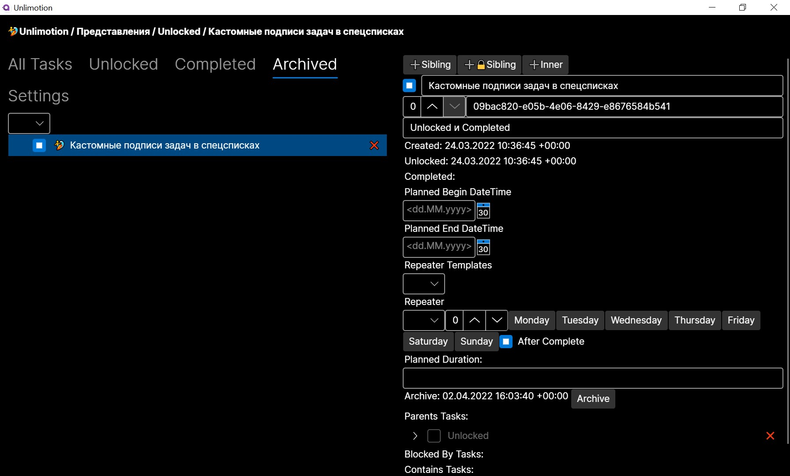

# Unlimotion
[English Readme](README.md)

## Сильные стороны
1. Неограниченные уровни вложенности задач
2. Возможность выстраивать цепочки выполнения с помощью блокирования задач
3. Задача может быть подзадачей сразу в нескольких задачах
4. Хранение ваших данных на вашем стройстве

## Запуск приложения
1. Загрузите и установите  [dotnet 6](https://dotnet.microsoft.com/en-us/download/dotnet/6.0) для своей операционной системы
2. Клонируйте [репозиторий](x-github-client://openRepo/https://github.com/Kibnet/Unlimotion) на свой компьютер. Или можете просто скачать исходники в виде [архива](https://github.com/Kibnet/Unlimotion/archive/refs/heads/main.zip), затем **распакуйте** его
3. Затем откройте окно терминала, например PowerShell, командную строку или bash
4. Перейдите в каталог **src** скачанного репозитория командой [`cd`](https://ru.wikipedia.org/wiki/Cd_(команда))
5. Запустите команду `dotnet run`

## Горячие клавиши:
- **Ctrl+Enter** - Создать родственную задачу
- **Shift+Enter** - Создать родственную задачу, заблокированную текущей задачей
- **Ctrl+Tab** - Создать вложенную задачу
- **Shift+Delete** - Удалить выбранную задачу

Во всех представлениях вы можете выполнять действия перетаскивания задачи:
- **Без клавиш** - Создать привязку перетаскиваемой задачи к целевой задаче
- **Shift** - Переместить перетаскиваемую задачу в целевую задачу, как подзадачу
- **Ctrl** - Сделать так, чтобы перетаскиваемая задача блокировала целевую задачу
- **Ctrl+Shift** - Клонировать перетаскиваемую задачу в целевую как подзадачу
- **Alt** - Сделать так, чтобы перетаскиваемая задача блокировалась целевой задачей

## Логика работы

### Выполнимость
Любая задача может находиться в 1 из 4 состояний и имеет допустимые переходы:
1. Невыполнена -> 2,3,4
2. Выполнена -> 1,4
3. Архивирована -> 1,4
4. Удалена -> нет переходов

### Блокировка
Заблокированная задача не может быть выполнена пока не станет разблокированной.
Задача считается **Заблокированой**, если у неё:
1. Есть невыполненные задачи внутри
2. Есть невыполненные блокирующие задачи
3. Есть невыполненные блокирующие задачи у любой родительской задачи

## Основные экраны

### All Tasks
Представляет собой иерархическое представление всех задач. 
В корне находятся те задачи, у которых нет родителей.

### Unlocked
Окно возможностей - представляет только те задачи, которые сейчас доступны для выполнения.

### Completed
Список выполненных задач в обратном порядке выполнения - последние сверху.

### Archived
Список архивных задач в обратном порядке архивирования - последние сверху. Сюда попадают задачи которые уже не нужно выполнять, но и удалять их не хочется.

### Settings
Окно настроек - позволяет изменить путь к каталогу с задачами.

## Бэклог возможностей
- [x] Эмодзи в названии наследуется для подзадач
- [x] Хоткей **Shift+Enter** для создания зависимой задачи
- [x] Поля "Дата начала планируемого выполнения" и "Дата окончания планируемого выполнения"
- [x] Фильтр по статусу выполнения
- [x] Фильтр по дате начала планируемого выполнения
- [x] Поле "Продолжительность задачи"
- [x] Возможность клонировать задачи через перетаскивание с **Ctrl+Shift**
- [x] Автоматическое сохранение задач при изменении связей
- [x] Можно создавать повторяемые задачи
- [x] Фильтр по эмодзи
- [x] Переход в описание задачи по двойному клику из любого списка
- [x] Представление разблокированных обновляется при перемене суток
- [x] Завёрстаны кнопки добавления задач
- [ ] Поиск задач
- [ ] Переход по задачам из хлебных крошек
- [ ] Блокировать все подзадачи заблокированной задачи
- [ ] Фильтр по актуальности запланированных задач
- [ ] Планируемый период наследуется для детей
- [ ] При изменении эмодзи рефрешить все надписи у детей
- [ ] Watcher для отслеживания изменения файлов
- [ ] Массовое перемещение задач
- [ ] Фиксация времени затраченного на задачу
- [ ] Заблаговременное напоминание о задаче
- [ ] Собрать мобильное приложение под Android и iOS
- [ ] При драг и дропе чтобы работала прокрутка при перемещении указателя к верху и низу списка
- [ ] Прикрепление файлов к задаче
- [ ] Написать сервер для хранения задач
- [ ] История переходов между задачами
- [ ] История изменений с возможностью откатить изменения