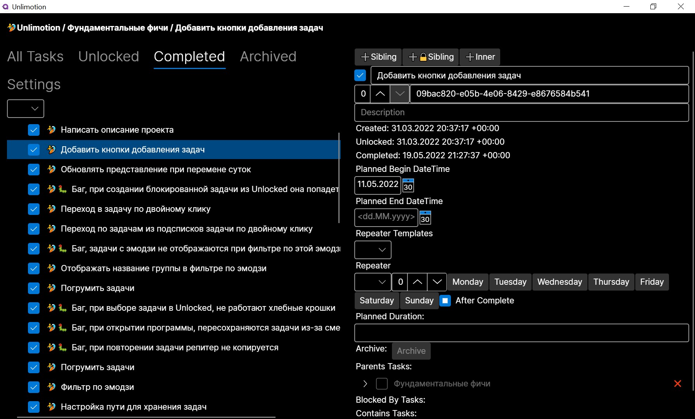

# Unlimotion
# [Switch to English Readme](README.md)

## Сильные стороны
1. Неограниченные уровни вложенности задач
2. Возможность выстраивать цепочки выполнения с помощью блокирования задач
3. Задача может быть подзадачей сразу в нескольких задачах
4. Хранение ваших данных на вашем устройстве

## Запуск приложения
1. Загрузите и установите [.NET 6.0 SDK](https://dotnet.microsoft.com/en-us/download) для своей операционной системы
2. Cкачайте последнюю версию исходного кода программы в виде [zip-архива](https://github.com/Kibnet/Unlimotion/archive/refs/heads/main.zip), и **распакуйте** его в любую папку на компьютере. Если вы знакомы с системой контролля версий git, вместо скачивания архива склонируйте этот [git-репозиторий](https://github.com/Kibnet/Unlimotion.git) на свой компьютер в любую папку с помощью вашего любимого git-клиента (например [Fork](https://git-fork.com/)).
3. Откройте полученную папку с исходным кодом на компьютере.
5. Запустите файл скрипта из папки в зависимости от операционной системы:
    - Windows - `run.windows.cmd`
    - Mac OS - `run.macos.sh`
    - Linux - `run.linux.sh`

## Концептуальное описание

### Состояния задачи
Любая задача может находиться только в одном из четырёх состояний.
1. Невыполнена - пустой чекбокс
2. Архивирована - чекбокс с квадратиком
3. Выполняется - пустой чекбокс с часами рядом
4. Выполнена - чекбокс с галочкой
Допустимые переходы описаны диаграммой:

### Связи задач
У каждой задачи могут быть связи с другими задачами 4 типов:
1. **Parents Tasks** - родительские задачи, которые содержат эту задачу внутри себя как составную часть, необходимую для выполнения.
2. **Contains Tasks** - дочерние задачи, которые являются частью или шагами этой задачи и возникают в процессе декомпозиции.
3. **Blocked By Tasks** - блокирующие задачи, которые должны быть выполнены чтобы разблокировать текущую.
4. **Blocks Tasks** - заблокированные задачи, которые не могут быть разблокированы пока эта задача невыполнена.

### Иерархия задач
Все задачи имеют своё место в общей древовидной иерархии. Самый первый уровень называется корневым, на нём находятся задачи, у которых нет связей с родительскими задачами.
Любая задача может стать дочерней для другой задачи, визуально это выглядит как вложенность в дереве задач. В отличии от других планировщиков задач, в Unlimotion позволяется одной задаче быть дочерней сразу для нескольких других задач. Это бывает удобно в случаях, когда задача имеет межпроектное значени и не может быть отнесена только к одной родительской задаче. Также эту особенность можно использовать как замену тэгам, можно создать родительскую задачу с определённым смыслом и добавить в неё дочерними все задачи, которые имеют отношение к этому смыслу. Это позволит наблюдать одну и туже задачу в разных срезах прямо на уровне иерархии.

### Блокировка
Заблокированная задача не может быть выполнена пока не станет разблокированной.
Заблокированность визуально выражается более прозрачным цветом чекбокса и текста описания задачи.
Задача считается **Заблокированой**, если у неё:
1. Есть невыполненные задачи внутри (Contains)
2. Есть невыполненные блокирующие (Blocked by) задачи
3. Есть невыполненные блокирующие (Blocked by) задачи у любой родительской (Parents) задачи

## Описание интерфейса

Интерфейс состоит из 3 частей:
1. Сверху так называемые хлебные крошки, которые показывают путь в иерархии текущей выбранной задачи
2. Справа панель детализированной информации текущей выделенной задачи, там отображаются все поля задачи доступные для просмотра и редактирования.
3. Левая панель имеет возможность переключения между вкладками:

### All Tasks
Представляет собой иерархическое представление всех задач. 
В корне находятся те задачи, у которых нет родителей.

### Unlocked
Окно возможностей - представляет только те задачи, которые сейчас доступны для выполнения.

### Completed
Список выполненных задач в обратном порядке выполнения - последние сверху.

### Archived
Список архивных задач в обратном порядке архивирования - последние сверху. Сюда попадают задачи которые уже не нужно выполнять, но и удалять их не хочется.

### Settings
Окно настроек - позволяет изменять параметры, влияющие на работу программы
- **TaskStorage Path** - Путь к каталогу с задачами. Именно по этому пути будут сохраняться файлы задач в формате JSON. Путь может быть указан абсолютный или относительный. Если путь не указан, то задачи сохраняются в каталоге Tasks, который создаётся в рабочем каталоге из которого была запущена программа.

## Как начать работать
### Создание задач
Создание новых задач всегда происходит относительно выбранной задачи. Чтобы это сделаль можно воспользоваться кнопками на правой панели сверху со знаком "➕" или использлвать горячие клавиши:
- **➕Sibling (Ctrl+Enter)** - Создать задачу на том же уровне, что и выбранная
- **➕🔒Sibling (Shift+Enter)** - Создать задачу на том же уровне, что и выбранная и заблокировать её выбранной
- **➕Inner (Ctrl+Tab)** - Создать вложенную задачу внутри выбранной

После создания задачи нужно заполнить название текущей задачи, потому что если выбрана задача без названия кнопки создания отключаются.

### Удаление задач
Задачи удаляются безвозвратно при нажатии кнопки "❌" в списке задач.
Также при нажатии **Shift+Delete** происходит удаление выбранной задачи.

### Перетаскивание мышью
Во всех вкладках вы можете выполнять действия перетаскивания задачи левой кнопкой мыши. Та задача которые вы потянули называется перетаскиваемой. Та задача на которой вы отпускаете кнопку мыши называется целевая. Взависимости от того какие кнопки на клавиатуре зажаты когда вы отпускаете левую кнопку мыши выполняются разные команды:
- **Без клавиш** - Вложить перетаскиваемую задачу в целевую задачу
- **Shift** - Переместить перетаскиваемую задачу в целевую задачу
- **Ctrl** - Перетаскиваемая задача блокирует целевую задачу
- **Alt** - Целевая задача блокирует перетаскиваемую задачу
- **Ctrl+Shift** - Клонировать перетаскиваемую задачу в целевую как подзадачу

### Группировка по эмодзи
Если в названии задачи присутсвует символ эмодзи, то появляется возможность быстро фильтровать такие задачи и содержащиеся в них с помощью фильтров на вкладках. Чтобы добавить эмодзи в текстовое поле воспользуйтесь специальным меню:
- В Windows оно вызывается сочетанием клавиш **Win+.**
- В MacOS оно вызывается сочетанием клавиш **Cmd+Ctrl+Пробел**
- В Ubuntu оно вызывается сочетанием клавиш **Ctrl+.**

На вкладках где отображаются задачи не в иерархическом виде слева от названия у каждой задаче отображаются все эмодзи которые есть у родительских задач. Это позволяет визуально сразу понять откуда эта задача.

## Бэклог возможностей
- [x] Эмодзи в названии наследуется для подзадач
- [x] Хоткей **Shift+Enter** для создания заблокированной подзадачи задачи
- [x] Поля "Дата начала планируемого выполнения" и "Дата окончания планируемого выполнения"
- [x] Фильтр по статусу выполнения
- [x] Фильтр по дате начала планируемого выполнения
- [x] Поле "Продолжительность задачи"
- [x] Возможность клонировать задачи через перетаскивание с **Ctrl+Shift**
- [x] Автоматическое сохранение задач при изменении связей
- [x] Можно создавать повторяемые задачи
- [x] Фильтр по эмодзи
- [x] Переход в описание задачи по двойному клику из любого списка
- [x] Представление разблокированных обновляется при перемене суток
- [x] Завёрстаны кнопки добавления задач
- [ ] Поиск задач
- [ ] Переход по задачам из хлебных крошек
- [ ] Блокировать все подзадачи заблокированной задачи
- [ ] Фильтр по актуальности запланированных задач
- [ ] Планируемый период наследуется для детей
- [ ] При изменении эмодзи рефрешить все надписи у детей
- [ ] Watcher для отслеживания изменения файлов
- [ ] Массовое перемещение задач
- [ ] Фиксация времени затраченного на задачу
- [ ] Заблаговременное напоминание о задаче
- [ ] Собрать мобильное приложение под Android и iOS
- [ ] При драг и дропе чтобы работала прокрутка при перемещении указателя к верху и низу списка
- [ ] Прикрепление файлов к задаче
- [ ] Написать сервер для хранения задач
- [ ] История переходов между задачами
- [ ] История изменений с возможностью откатить изменения