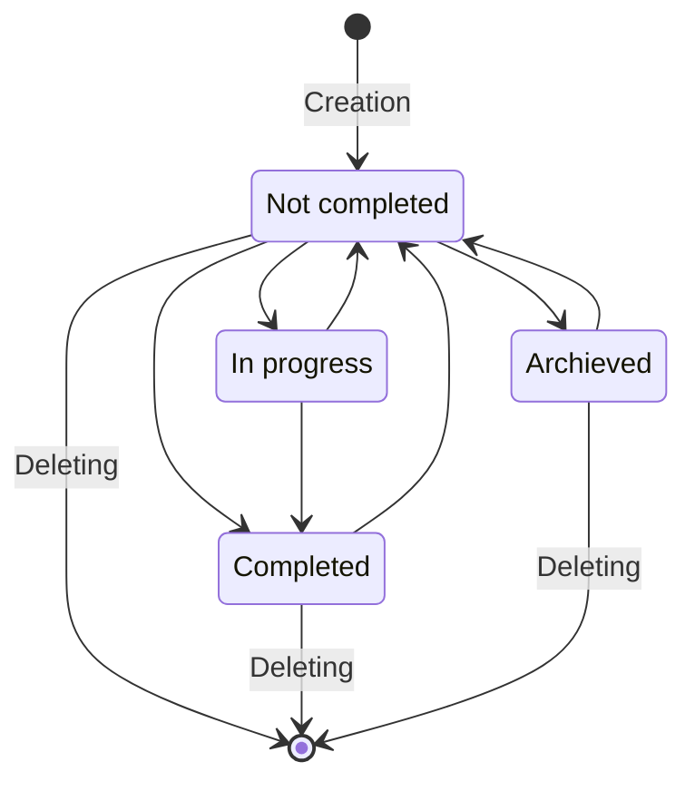
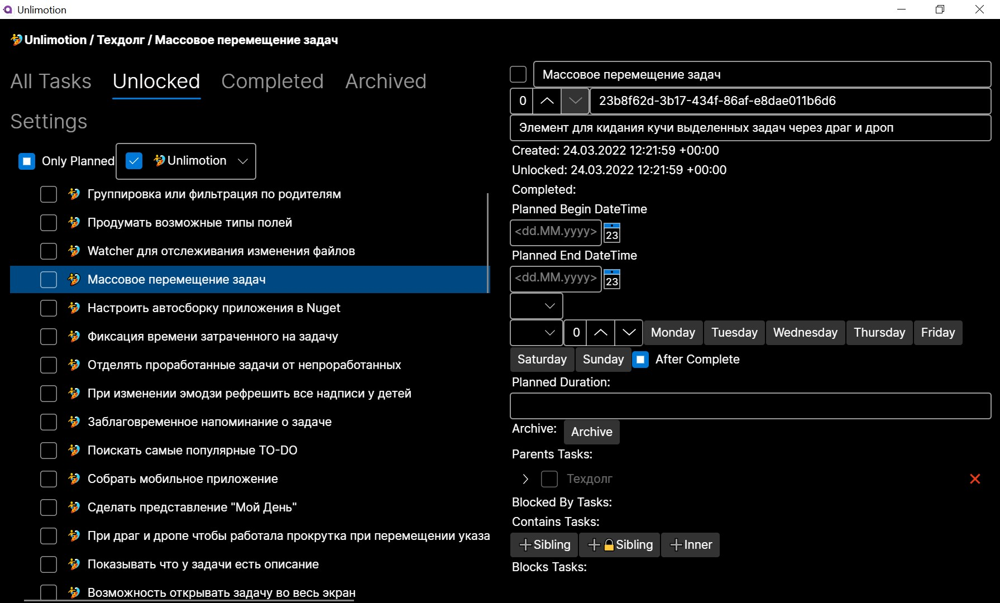
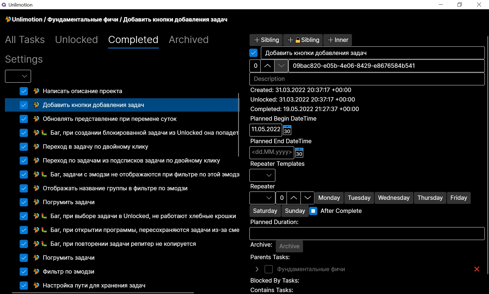
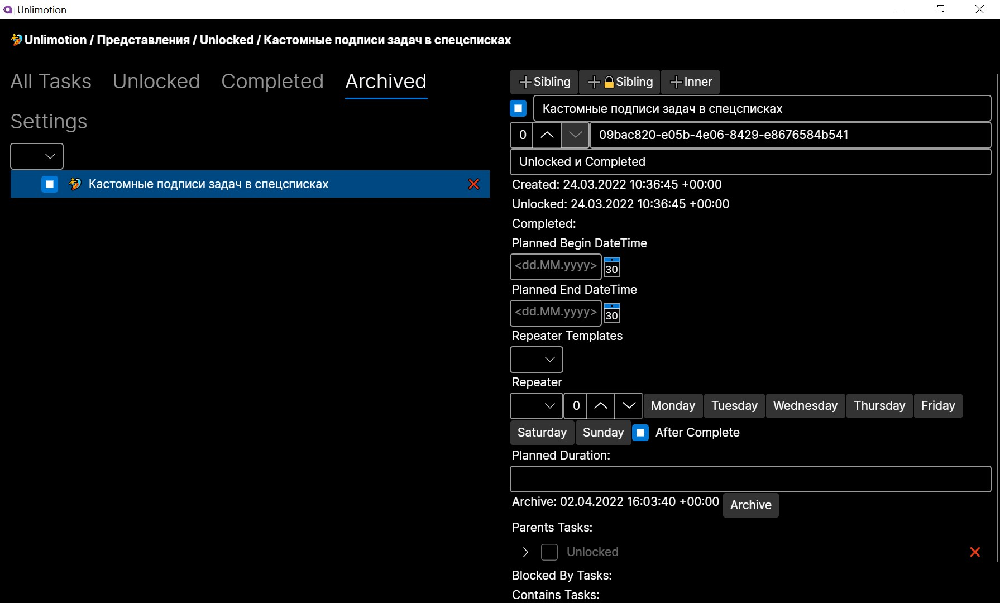
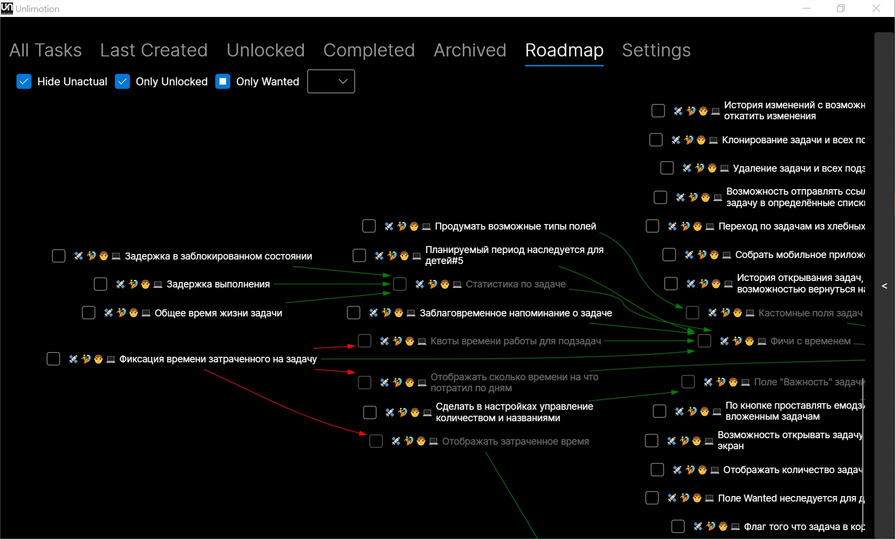
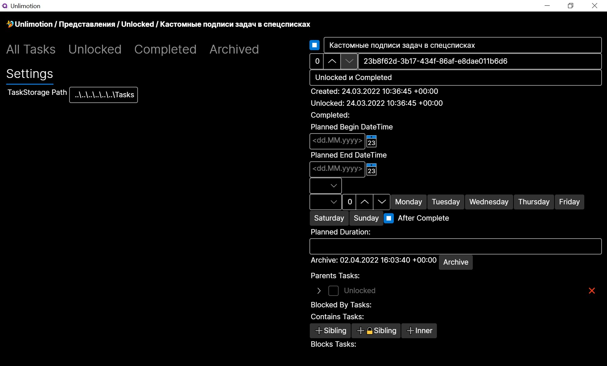

# Unlimotion
# [Перейти в русское Readme](README.RU.md)

## Strengths
1. Unlimited levels of task nesting
2. The ability to build execution chains by blocking tasks
3. A task can be a subtask in several tasks at once
4. Storing your data on your device

## Launching the application
Case 1:
If you use OS Windows, Debian or MacOS, you can click on the link with releases and download the latest version of this application.
You need to run the following command: sudo chmod -R 755 /Applications/Unlimotion.app after installing on MacOS.
Rights aren't automatically granted due to Apple's security policy for unsigned applications.
No additional steps are required for correct installation on OS Windows and Debian.

Case 2:
1. Download and install the [.NET 8.0 SDK](https://dotnet.microsoft.com/en-us/download) for your operating system
2. Download the latest version of the program's source code as a [zip-archive](https://github.com/Kibnet/Unlimotion/archive/refs/heads/main.zip) and **unpack** it to any folder on your computer.
If you know the git version control system, instead of downloading the archive, clone this [git-repository](https://github.com/Kibnet/Unlimotion.git)
to your computer in any folder using your favorite git-client (for example [Fork](https://git-fork.com/)).
3. Open the resulting source сode folder on your computer.
4. Run the script file from the folder depending on the operating system:
    - Windows - `run.windows.cmd`
    - Mac OS - `run.macos.sh`
    - Linux - `run.linux.sh`

## Conceptual description

### Task states
Any task can be in only one of the four states:
1. Not completed - an empty checkbox
2. Archived - a checkbox with a square
3. In progress - an empty checkbox with a clock next to it
4. Completed - a checkbox with a check mark
Acceptable transitions are described by the diagram:

### Tasks links
Each task can have links to other tasks of 4 types:
1. **Parents Tasks** - parent tasks that contain this task within themselves as an integral part necessary for execution.
2. **Containing Tasks** - child tasks that are part or steps of this task and arise during the decomposition process.
3. **Blocking By Tasks** - blocking tasks that must be completed to unlock the current one.
4. **Blocked Tasks** - blocked tasks that cannot be unblocked while this task is not completed.

### Hierarchy of tasks
All tasks have their place in the general tree hierarchy. The very first level is called the root level, it contains tasks that have no links to parent tasks.
Any task can become a child of another task, visually it looks like a nesting in the task tree.
Unlike other task schedulers, Unlimited allows one task to be a child of several other tasks at once.
This is convenient in cases where the task has an inter project value and cannot be assigned to only one parent task.
Also, this feature can be used as a replacement for tags, you can create a parent task with a certain meaning and add to it all the child tasks that are related to this meaning.
This will allow you to observe the same task in different slices right at the hierarchy level.

### Blocking
A blocked task cannot be completed until it becomes unblocked.
Blocking is visually expressed by a more transparent color of the checkbox and the text of the task description.
A task is considered **Blocked** if it has:
1. Uncompleted tasks inside
2. Has uncompleted blocking tasks
3. Has uncompleted blocking tasks for any parent task

## Interface description

The interface consists of 3 parts.
1. On top are the so-called breadcrumbs that show the path in the hierarchy of the currently selected task.
2. On the right is a panel of detailed information of the currently selected task, where all the task fields available for viewing and editing are displayed.
3. The left panel has the ability to switch between tabs:

### All Tasks
It's a hierarchical representation of all tasks.
At the root are those tasks that don't have parents.

### Last Created
Shows all tasks by creation date in descending order.

### Unlocked
Window of Opportunity - represents only those tasks that are currently available for execution.

### Completed
The list of completed tasks in the reverse order of execution - the last ones from the top.

### Archived
The list of archived tasks in the reverse order of archiving - the last ones from the top. This includes tasks that no longer need to be performed, but you don't want to delete them either.

### Roadmap
Displaying tasks in the form of a roadmap. Inspired by the development tree from games. In this view, tasks are displayed in the form of a directed graph, which allows you to visualize the tracks of tasks that need to be completed in order to reach the goal.
Green arrows - child-parent relationship
Red arrows - the ratio of the blocking task to the blocked one

### Settings
Settings window - allows you to change the parameters that affect the operation of the program.
- **TaskStorage Path** - Path to the directory(folder) with tasks. It is along this path that the task files in JSON format will be saved. The path can be specified absolute or relative.
If the path is not specified, the tasks are saved in the "Tasks" directory, which is created in the working directory from which the program was launched.

## How to get started
### Tasks creation
New tasks are always created relative to the selected task. To do this, you can use the buttons on the top right panel with the sign "➕" or use hotkeys:
- **➕Sibling (Ctrl+Enter)** - Create a task at the same level as the selected one
- **➕🔒Sibling (Shift+Enter)** - Create a task at the same level as the selected one and block it with the selected one
- **➕Inner (Ctrl+Tab)** - Create a nested task inside the selected

After creating a task, you need to fill in the name of the current task, because if a task without a name is selected, the creation buttons will be disabled.

### Tasks deleting
Tasks are permanently deleted when you click the "❌" button in the task list. 
Also, when you press **Shift+Delete**, the selected task is deleted.

### Dragging with the mouse
In all tabs, you can perform drag-and-drop actions with the left mouse button. The task that you pulled is called draggable.
The task on which you release the mouse button is called the target.
Depending on which buttons on the keyboard are clamped when you release the left mouse button, different commands are executed:
- **Without keys** - Attach a draggable task to a target task
- **Shift** - Move the dragged task to the target task
- **Ctrl** - The dragged task blocks the target task
- **Alt** - The target task blocks the dragged task
- **Ctrl+Shift** - Clone the dragged task to the target as a subtask

### Grouping by emoji
If the emoji symbol is present in the task name, then it becomes possible to quickly filter such tasks and those contained in them using filters on the tabs.
To add an emoji to the text field, use the special menu:
- In Windows it is called by the keyboard shortcut **Win+.**
- In macOS it is called by the keyboard shortcut **Cmd+Ctrl+Whitespace**
- In Ubuntu, it is called by the keyboard shortcut **Ctrl+.**

On the tabs where the tasks are not displayed in a hierarchical form, all the emoji that the parent tasks have are displayed to the left of the name of each task.
This allows you to visually immediately understand where this task comes from.

## Backlog of features
- [x] Emoji in the title is inherited for subtasks
- [x] Hotkey **Shift+Enter** to create a blocked subtask of a task
- [x] Fields "Start date of planned execution" and "End date of planned execution"
- [x] Filter by execution status
- [x] Filter by the start date of the planned execution
- [x] "Task Duration" field 
- [x] Ability to clone tasks via drag and drop with **Ctrl+Shift**
- [x] Automatic saving of tasks when links change
- [x] Repeatable tasks can be created
- [x] Emoji Filter
- [x] Go to the task description by double-clicking from any list
- [x] The unlocked view is updated when the day changes
- [x] The buttons for adding tasks have been set up
- [ ] Search for tasks
- [ ] Navigating through breadcrumb tasks
- [ ] Block all subtasks of a blocked task
- [ ] Filter by the relevance of scheduled tasks
- [ ] The planned period is inherited for children
- [ ] When changing emoji, refresh all the inscriptions of children
- [ ] Watcher for tracking file changes
- [ ] Mass transfer of tasks
- [ ] Fixing the time spent on the task
- [ ] Advance task reminder
- [ ] Build a mobile app for Android and iOS
- [ ] When drag and drop, so that scrolling works when moving the pointer to the top and bottom of the list
- [ ] Attaching files to a task
- [ ] Write a server for storing tasks
- [ ] History of transitions between tasks
- [ ] Change history with the ability to roll back changes
