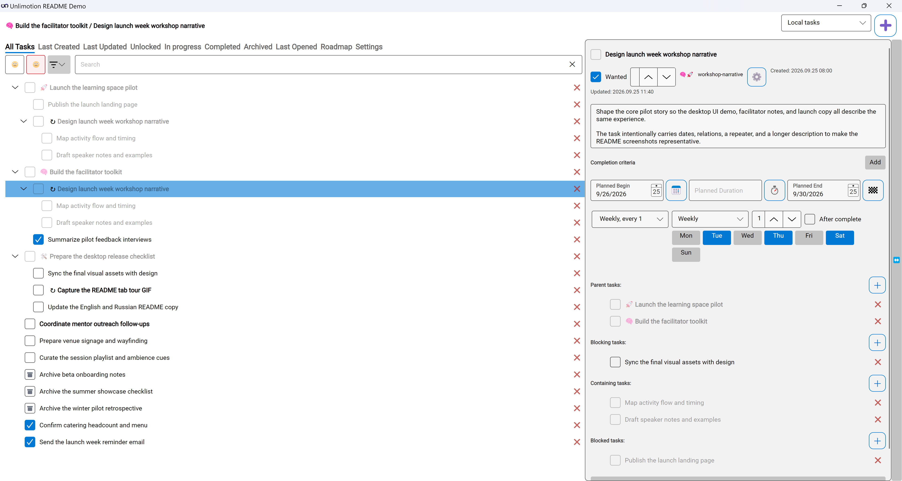
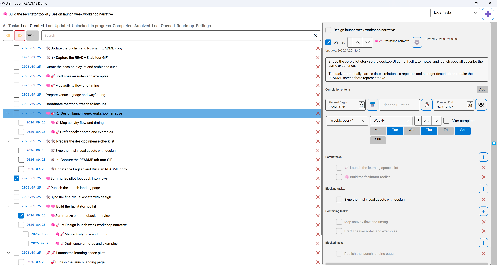
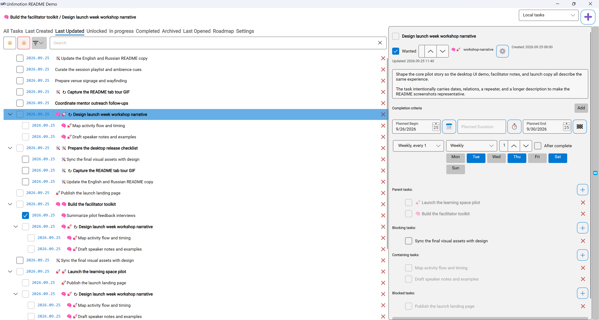
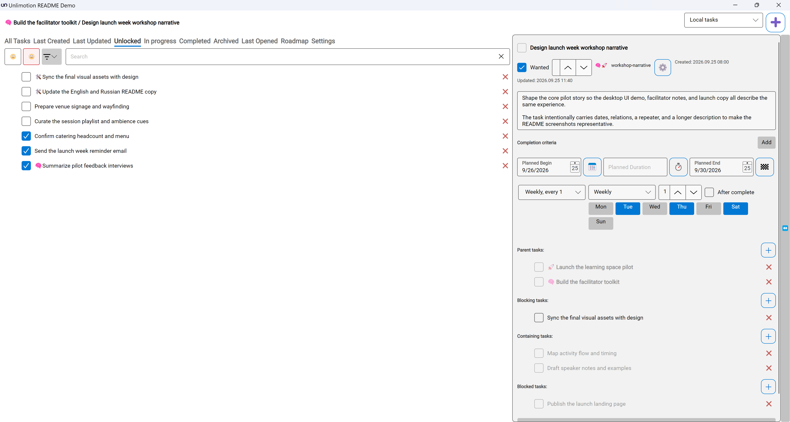
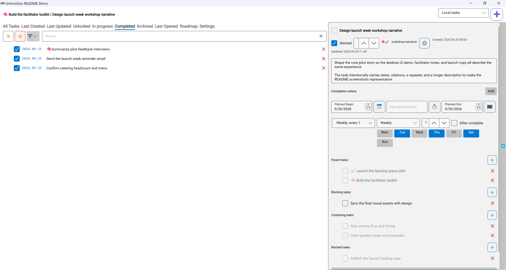
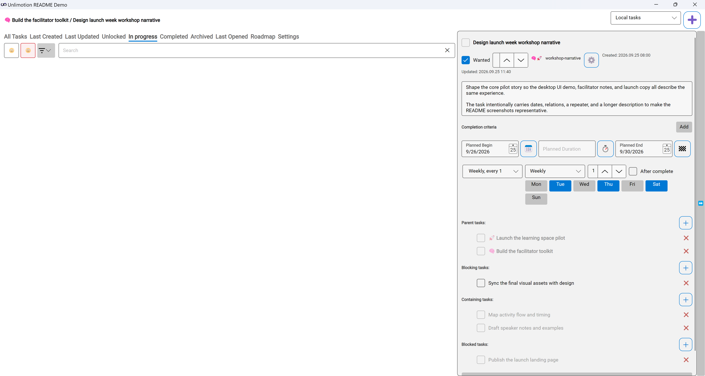
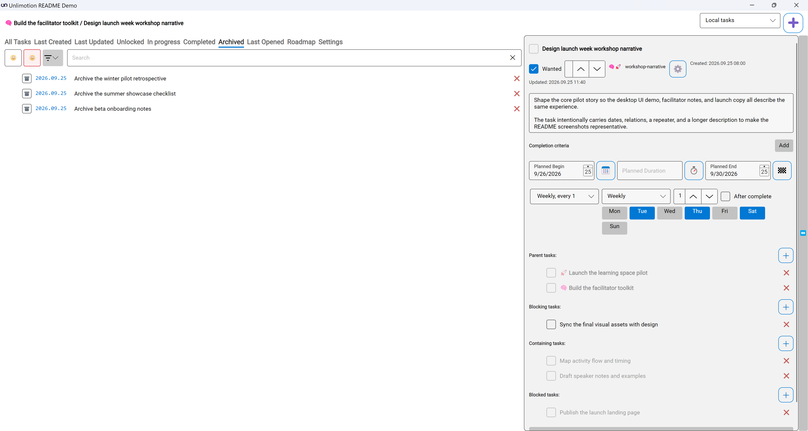
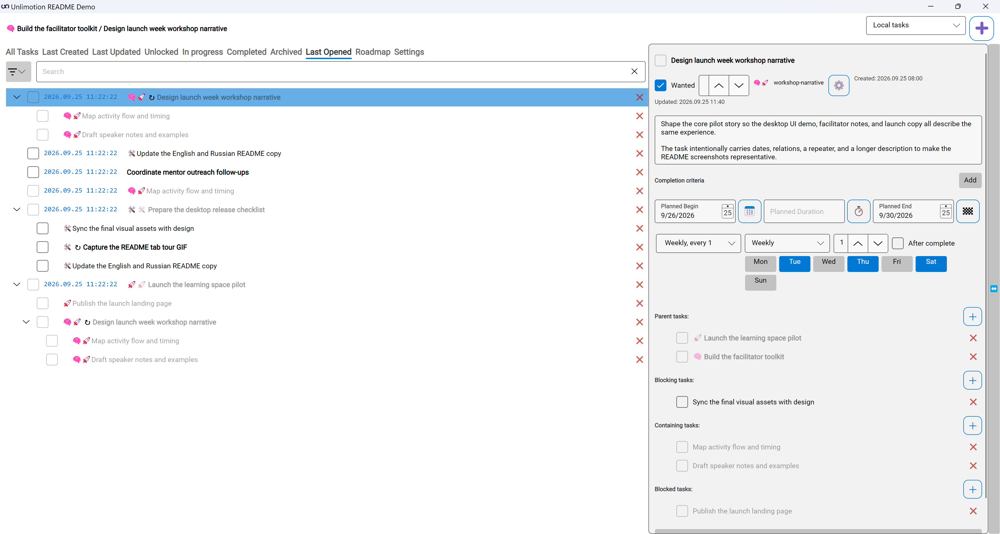
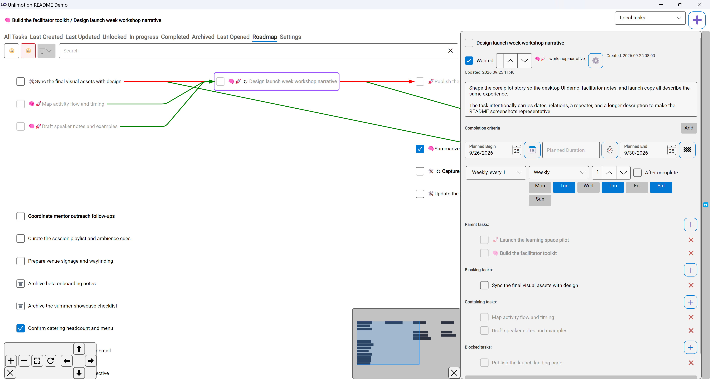
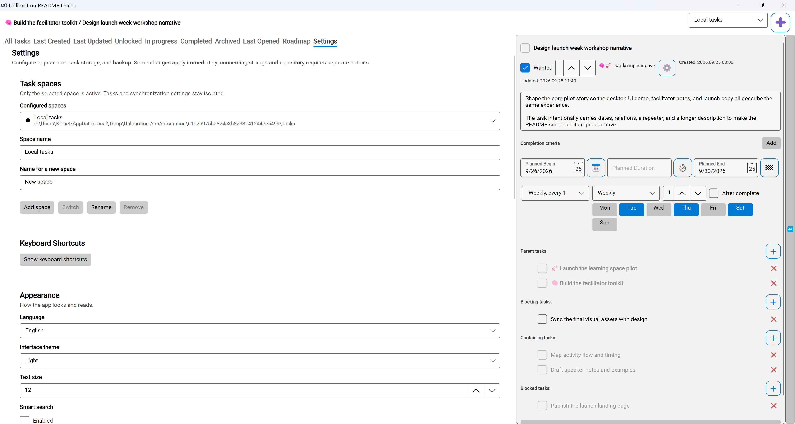

# Unlimotion
# [Перейти в русское Readme](README.RU.md)


## Strengths
1. Unlimited levels of task nesting
2. The ability to build execution chains by blocking tasks
3. A task can be a subtask in several tasks at once
4. Storing your data on your device

## Download and install

Ready-to-run self-contained published builds are available on the [latest GitHub release](https://github.com/Kibnet/Unlimotion/releases/latest) page. They do not require the .NET SDK. An artifact being published does not guarantee compatibility with every OS version; a complete platform smoke-test matrix is still being established.

| Available build | File to choose | Current validation status |
| --- | --- | --- |
| Windows x64 | `Unlimotion-win-Setup.exe` or `Unlimotion-win-Portable.zip` | Published. The project does not currently publish verified Authenticode evidence. Microsoft Defender SmartScreen may show a warning. |
| Linux x64 (AppImage) | `Unlimotion.AppImage` | Published generic Linux option; distribution compatibility has not yet been smoke-tested as a complete matrix. |
| Linux x64 (.deb) | `Unlimotion-<version>.deb` | Preview. Compatibility with current Debian releases has not yet been verified. |
| macOS x64 | `Unlimotion-osx-Setup.pkg` or `Unlimotion-osx-Portable.zip` | Intel build. The project does not currently publish verified Developer ID signing and notarization evidence. |
| macOS arm64 | `Unlimotion-osx-arm64-Setup.pkg` or `Unlimotion-osx-arm64-Portable.zip` | Apple Silicon build. The project does not currently publish verified Developer ID signing and notarization evidence. |
| Android arm64 | `Unlimotion-<version>-android-arm64.apk` | Sideloaded APK. The project declares Android 6.0 / API 23 as its minimum; this is not a universal device-compatibility guarantee. |
| Android x64 | `Unlimotion-<version>-android-x64.apk` | Sideloaded APK, primarily for x86_64 devices and emulators; the same Android minimum-version caveat applies. |

- For a Windows or macOS portable ZIP, extract the archive before starting the included application.
- For the AppImage, download it and run:

```bash
chmod +x Unlimotion.AppImage
./Unlimotion.AppImage
```

- On macOS, the project does not currently publish verified signing and notarization evidence for these packages. Gatekeeper may block them. If you trust the downloaded artifact, follow Apple's official [Open Anyway guidance](https://support.apple.com/en-us/102445). Changing file permissions does not establish trust or notarization.
- Android installation is performed outside an app store. The OS may ask you to allow installation from the selected source; the exact permission flow depends on the Android version and device. When updating in the app, Android downloads the matching APK and asks for system installation confirmation.
- The desktop in-app updater is available only when Velopack recognizes the current installation as managed. Portable and source runs must not rely on that updater; use the Releases page instead.

## Build and run from source

Cloning `main` gives you the current development snapshot. For a stable build or matching source archive, use the Releases page above.

Prerequisites:

- Git
- [.NET 10 SDK](https://dotnet.microsoft.com/en-us/download/dotnet/10.0), compatible with `global.json`
- Network access to NuGet for the first restore

Run the commands from the repository root.

Windows PowerShell:

```powershell
git clone https://github.com/Kibnet/Unlimotion.git
Set-Location Unlimotion
.\run.windows.cmd
```

Linux or macOS:

```bash
git clone https://github.com/Kibnet/Unlimotion.git
cd Unlimotion

# Linux
bash ./run.linux.sh

# macOS
bash ./run.macos.sh
```

## Conceptual description

### Task spaces

One application instance can keep several named task spaces. Use the selector in the main header to switch the active space, and the first Settings section to add, rename, switch, or remove configured spaces.

Only one space is active at a time. Its task source and complete Git synchronization profile are isolated from every other space; tasks from multiple spaces are never shown together and cross-space task relations are rejected. To configure storage or Git for another space, switch to it first. Removing a space removes only its configuration and stored credentials from this application—it does not delete or move the task files or remote repository.

### Task states

Any task can be in only one of five statuses:

1. Not ready - an empty square
2. Prepared - a square with `!`
3. In progress - a square with a play sign
4. Completed - a square with a check mark
5. Archived - a square inside a square

Lifecycle status, graph availability and transition guards are separate concepts:

- `Prepared` means that the task has enough context to be started or delegated.
- Graph availability is calculated from active contained tasks, direct blockers and blockers inherited from parent tasks. The status control of a graph-unavailable task is shown with opacity `0.4`; completed and archived blockers do not block it.
- A future planned begin date is only a guard for entering `In progress`. It does not change graph availability, the `Unlocked` projection or opacity.

The canonical transition matrix is:

| Current \ requested | Not ready | Prepared | In progress | Completed | Archived |
| --- | --- | --- | --- | --- | --- |
| Not ready | No-op | Allowed | Start guards | Completion guards | Allowed |
| Prepared | Allowed | No-op | Start guards | Completion guards | Allowed |
| In progress | Allowed | Allowed | No-op | Completion guards | Allowed |
| Completed | Allowed | Allowed | Denied | No-op | Denied |
| Archived | Allowed | Allowed | Denied | Denied | No-op |

`Start guards` require graph availability and a planned begin date that is not in the future. `Completion guards` require graph availability and every completion criterion to be satisfied. A same-status request is a no-op and does not add a history entry.

If an `In progress` task loses graph availability or receives a future planned begin date, it is moved once to `Prepared` with a system history entry. Unarchiving restores `Not ready` as `Not ready`, and restores both `Prepared` and `In progress` as `Prepared`. Invalid history entries are ignored, so an older valid non-archived entry can still determine the result; a previous `Completed` status or the absence of any valid non-archived entry falls back to `Not ready`.

Markdown outline import/export uses these markers:

| Marker | Status |
| --- | --- |
| `[ ]` | Not ready |
| `[!]` | Prepared |
| `[>]` | In progress |
| `[x]` | Completed |
| `[#]` | Archived |

The same status picker is available in task lists, the roadmap and the current task card. It hides the current status and shows the other four targets; denied targets remain visible but disabled with a localized reason. The Telegram bot shows only enabled non-current targets and applies the same storage-backed transition contract.

### Tasks links
Each task can have links to other tasks of 4 types:
1. **Parents Tasks** - parent tasks that contain this task within themselves as an integral part necessary for execution.
2. **Containing Tasks** - child tasks that are part or steps of this task and arise during the decomposition process.
3. **Blocking By Tasks** - blocking tasks that must be completed to unlock the current one.
4. **Blocked Tasks** - blocked tasks that cannot be unblocked while this task is not completed.

### Hierarchy of tasks
All tasks have their place in the general tree hierarchy. The very first level is called the root level, it contains tasks that have no links to parent tasks.
Any task can become a child of another task, visually it looks like a nesting in the task tree.
Unlike other task schedulers, Unlimited allows one task to be a child of several other tasks at once.
This is convenient in cases where the task has an inter project value and cannot be assigned to only one parent task.
Also, this feature can be used as a replacement for tags, you can create a parent task with a certain meaning and add to it all the child tasks that are related to this meaning.
This will allow you to observe the same task in different slices right at the hierarchy level.


### Blocking

A graph-unavailable task cannot be started or completed until it becomes available. Its status control is shown with opacity `0.4`.

A task is graph-unavailable if it has:

1. Active incomplete contained tasks.
2. Active incomplete direct blockers.
3. Active incomplete blockers inherited from any parent task.

Archived and completed related tasks are not incomplete blockers. Graph availability does not prevent moving a task to `Not ready`, `Prepared` or `Archived` when the lifecycle matrix allows that target.


## Interface description

The interface consists of 3 parts.
1. On top are the so-called breadcrumbs that show the path in the hierarchy of the currently selected task.
2. On the right is a panel of detailed information of the currently selected task, where all the task fields available for viewing and editing are displayed.
3. The left panel has the ability to switch between tabs:

The screenshots below are generated from a deterministic synthetic workspace used by the UI automation pipeline, so the README can be refreshed after visual changes without hand-editing demo data.

### All Tasks
It's a hierarchical representation of all tasks.
At the root are those tasks that don't have parents.


### Last Created
Shows all tasks by creation date in descending order.


### Last Updated
Shows the tasks with the most recent edits first.


### Unlocked
The `Unlocked` projection contains graph-available, non-archived tasks. Status and time filters are applied separately, so it can include completed or future-planned tasks; a future task remains fully opaque but cannot enter `In progress` before its planned begin date.


### Completed
The list of completed tasks in the reverse order of execution - the last ones from the top.


### In Progress
A flat list of tasks with the `In progress` status. The tab helps track current work and how long each task has already been in that status.


### Archived
The list of archived tasks in the reverse order of archiving - the last ones from the top. This includes tasks that no longer need to be performed, but you don't want to delete them either.


### Last Opened
Shows the tasks that were opened most recently, which is useful for quickly returning to the working context you just left.


### Roadmap
Displaying tasks in the form of a roadmap. Inspired by the development tree from games. In this view, tasks are displayed in the form of a directed graph, which allows you to visualize the tracks of tasks that need to be completed in order to reach the goal.
Green arrows - child-parent relationship
Red arrows - the ratio of the blocking task to the blocked one


### Settings
Settings window - allows you to change the parameters that affect the operation of the program.
- **TaskStorage Path** - Path to the directory(folder) with tasks. It is along this path that the task files in JSON format will be saved. The path can be specified absolute or relative.
If the path is not specified, the tasks are saved in the "Tasks" directory, which is created in the working directory from which the program was launched.
- **SSH Key Storage Path** - Folder where Git backup keeps SSH keys and the dedicated `known_hosts` file when an SSH remote is used.



## How to get started
### Tasks creation
New tasks are always created relative to the selected task. To do this, you can use the buttons on the top right panel with the sign "➕" or use hotkeys:
- **➕Sibling (Ctrl+Enter)** - Create a task at the same level as the selected one
- **➕🔒Sibling (Shift+Enter)** - Create a task at the same level as the selected one and block it with the selected one
- **➕Inner (Ctrl+Tab)** - Create a nested task inside the selected
- **Complete current task (Ctrl+D)** - Mark the selected/current task as completed

The Settings button named **Show keyboard shortcuts** and the **F1** key open the full in-app shortcut reference.

After creating a task, you need to fill in the name of the current task, because if a task without a name is selected, the creation buttons will be disabled.

### Tree expansion shortcuts
In all task list tabs and relation trees on the task card, you can control expansion with these hotkeys:
- **Expand nested for current (Ctrl+Shift+Right)** - Expand the selected node and all nested nodes under it
- **Collapse nested for current (Ctrl+Shift+Left)** - Collapse nested nodes under the selected node
- **Expand all nodes (Ctrl+Alt+Right)** - Expand all nodes in the active tree
- **Collapse all nodes (Ctrl+Alt+Left)** - Collapse all nodes in the active tree

### Tasks deleting
Tasks are permanently deleted when you click the "❌" button in the task list. 
Also, when you press **Shift+Delete**, the selected task is deleted.

### Dragging with the mouse
In all tabs, you can perform drag-and-drop actions with the left mouse button. The task that you pulled is called draggable.
The task on which you release the mouse button is called the target.
Depending on which buttons on the keyboard are clamped when you release the left mouse button, different commands are executed:
- **Without keys** - Attach a draggable task to a target task
- **Shift** - Move the dragged task to the target task
- **Ctrl** - The dragged task blocks the target task
- **Alt** - The target task blocks the dragged task
- **Ctrl+Shift** - Clone the dragged task to the target as a subtask

### Grouping by emoji
If the emoji symbol is present in the task name, then it becomes possible to quickly filter such tasks and those contained in them using filters on the tabs.
To add an emoji to the text field, use the special menu:
- In Windows it is called by the keyboard shortcut **Win+.**
- In macOS it is called by the keyboard shortcut **Cmd+Ctrl+Whitespace**
- In Ubuntu, it is called by the keyboard shortcut **Ctrl+.**

On the tabs where the tasks are not displayed in a hierarchical form, all the emoji that the parent tasks have are displayed to the left of the name of each task.
This allows you to visually immediately understand where this task comes from.

Emoji filters open as a searchable multi-select dropdown: type part of a tag title or emoji, keep the list open and toggle several include or exclude filters without resetting the panel.
