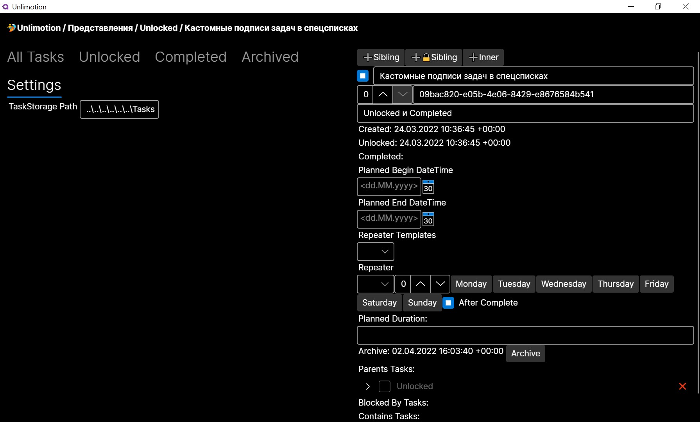

# Unlimotion
[Russian Readme](README.RU.md)

## Strengths
1. Unlimited levels of nesting tasks
2. The ability to build execution chains by blocking tasks
3. A task can be a subtask in several tasks at once
4. Storing your data on your device

## Launching the app
1. Download and install [dotnet 6](https://dotnet.microsoft.com/en-us/download/dotnet/6.0 ) for yours operating system
2. Clone [repository](x-github-client://openRepo/https://github.com/Kibnet/Unlimited) to your computer. Or you can just download the sources in the form of an [archive](https://github.com/Kibnet/Unlimotion/archive/refs/heads/main.zip), then **unpack** it
3. Then open a terminal window, such as PowerShell, command prompt, or bash
4. Go to the **src** directory of the downloaded repository with the command [`cd`](https://en.wikipedia.org/wiki/Cd_(command))
5. Run the `dotnet run` command

## Hotkeys:
- **Ctrl+Enter** - Create sibling task
- **Shift+Enter** - Create sibling task blocked by current task
- **Ctrl+Tab** - Create nested task
- **Shift+Delete** - Remove selected task

In "All Task" view you may do drag&drop actions:
- **No key** - Create link the dragged task to the dropped as subtask
- **Shift** - Move the dragged task to the dropped as subtask
- **Ctrl** - Make the dragged task blocks the dropped task
- **Ctrl+Shift** - Clone the dragged task to the dropped as subtask
- **Alt** - Make the dragged task blocked by the dropped task

## Logic of work

### Feasibility
All task can be in 1 of 4 states and has valid transitions:
1. Uncompleted-> 2,3,4
2. Completed -> 1,4
3. Archived -> 1,4
4. Deleted -> no transitions

### Blocking
A blocked task cannot be completed until it becomes unblocked.
A task is considered **Blocked** if it:
1. Has uncompleted tasks inside
2. Has uncompleted blocking tasks
3. Has unfulfilled blocking tasks for any parent task

## Main screens

### All Tasks
Is a hierarchical representation of all tasks.
At the root are those tasks that do not have parents.

### Unlocked
Window of Opportunity - represents only those tasks that are currently available for execution.

### Completed
A list of completed tasks in the reverse order of execution - the last ones from the top.

### Archived
The list of archived tasks in the reverse order of archiving is the latest from the top. This includes tasks that no longer need to be performed, but you don't want to delete them either.

### Settings
Settings window - allows you to change the path to the directory with tasks.
Settings window - allows you to change the path to the directory with tasks.
