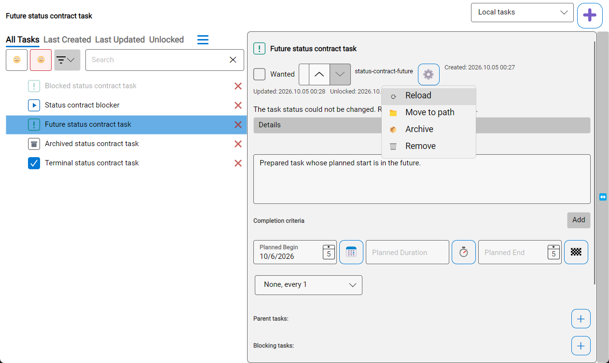
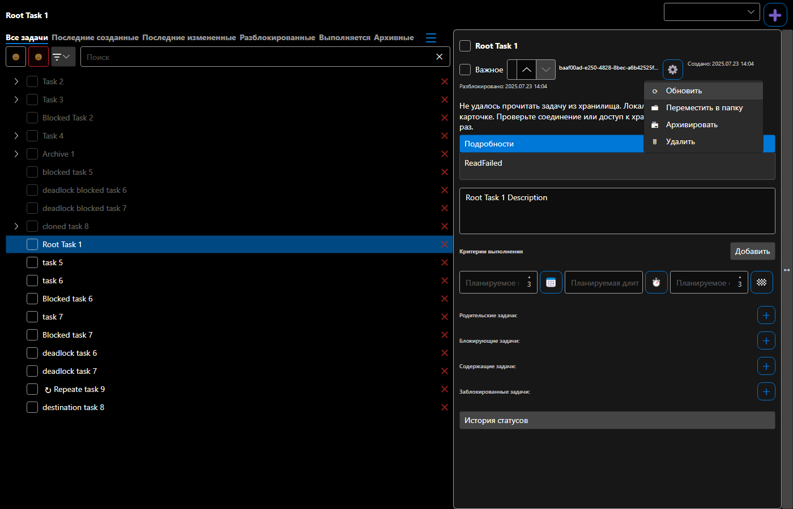

# Восстановление смены статуса из карточки

Проверено на синтетических задачах 2–5 октября 2026 года, Windows x64, .NET SDK 10.0.401, Avalonia 12.0.4 и TUnit 1.44.0. Исходные прогоны использовали AppAutomation 1.6.0, интеграция свежего main — 1.9.0. Установленное приложение и пользовательское хранилище не изменялись. Точная причина индивидуального отказа пользователя не установлена.

Согласованный контракт и post-EXEC review: [SPEC](../../../specs/2026-10-02-task-card-status-recovery.md).

## Интеграция main 5a780b2e, 4–5 октября

Объединены #313 AppAutomation 1.9 и #315 emoji со status recovery. Canonical metadata/pumping fixture, API-based server wait и ShiftDelete cache/storage wait сохранены из main; wrapper-delete wait перенесён отдельным hunk автора Importance. Pointer lifecycle объединён с recovery/menu clicks через DesktopPointer. Capture helper теперь не меняет focus/foreground внутри read-only HoverAsync callback; найденный MEDIUM закрыт source re-review.

| Проверка | Результат | Evidence |
| --- | --- | --- |
| Полный Main | **1229/1230**, 1 FAIL, 0 SKIP; 36м03с. Workspace tree commands: `PasteOutlineCommandWorked=false` | [Полный лог](integration-2026-10-05/main-full.log) |
| Полный Headless | **52/52 PASS**, 0 SKIP; 3м53с | [Лог](integration-2026-10-05/headless-full.log), [recovery observations](integration-2026-10-05/headless-recovery-observations.json) |
| Native recovery: отказ → ⚙ → Reload → явный retry | **1/1 PASS**; Reload сохраняет исходные bytes, retry пишет NotReady и ровно одну новую запись истории | [Лог](integration-2026-10-05/native-recovery.log), [observations](integration-2026-10-05/native-recovery-observations.json), [после повтора](integration-2026-10-05/native-recovery-after-retry.png) |
| Native: RU Dark future/blocked и EN Light terminal picker+unarchive | **3/3 финальных PASS** в отдельных адресных запусках | [Future](integration-2026-10-05/native-future.log), [Blocked](integration-2026-10-05/native-blocked.log), [Terminal](integration-2026-10-05/native-terminal.log) |
| Rendered menu RU/EN × Light/Dark × 1400/760 | **8/8 PASS**, все восемь новых menu frames просмотрены | [Лог](integration-2026-10-05/menu-rendered-matrix.log), [RU Dark wide](integration-2026-10-05/reload-menu-ru-Dark-1400.png), [RU Dark narrow](integration-2026-10-05/reload-menu-ru-Dark-760.png) |
| Wrapper-delete, ShiftDelete, Workspace graph commands, hydration boundary | **4/4 адресных PASS**; соответствующие cases также PASS в общей Main-серии | [Wrapper](integration-2026-10-05/delete-wrapper.log), [ShiftDelete](integration-2026-10-05/delete-shift.log), [Workspace graph](integration-2026-10-05/delete-workspace.log), [Hydration](integration-2026-10-05/cache-hydration.log) |
| SSH-key command wait | **1/1 PASS** отдельно и PASS внутри Main | [Лог](integration-2026-10-05/settings-targeted.log) |
| Main build после добавления failure diagnostics | **PASS**, 51 существующее предупреждение / 0 ошибок | [Лог](integration-2026-10-05/main-build.log) |
| Обычный Desktop / Headless / FlaUI build | **PASS**, 0 warnings / 0 errors | [Desktop](integration-2026-10-05/desktop-build.log), [Headless](integration-2026-10-05/headless-build.log), [FlaUI](integration-2026-10-05/flaui-build.log) |

Свежий native frame показывает постоянную ошибку и Reload первым пунктом ⚙:



Все шесть новых native PNG просмотрены: [future](integration-2026-10-05/native-future.png), [blocked tooltip](integration-2026-10-05/native-blocked.png), [terminal](integration-2026-10-05/native-terminal.png), [unarchive](integration-2026-10-05/native-after-unarchive.png) и два recovery frame. Первый Blocked run завершился отменой общего HoverAsync budget после успешных owned-tooltip assertions и capture; [ранний FAIL](integration-2026-10-05/native-blocked-timeout.log) сохранён. Tooltip wait сохраняет 15s deadline, action budget 30s включает owner validation и read-only UIA/capture. Pointer restoration использует отдельный framework cleanup budget. Повтор прошёл; helper не меняет focus/foreground.

После соответствующего сбоя в интеграционном прогоне Importance перенесён авторский CLI wait-patch для SSH-key case: ожидание завершения самой ReactiveCommand, затем прежние конечные assertions. Адресный тест прошёл 1/1; последняя Main-сборка — 51 warning / 0 errors. Product-код этот hunk не меняет.

Workspace paste отдельно с новой failure-only диагностикой прошёл **1/1** ([лог](integration-2026-10-05/paste-diagnostic.log)). Исходные predicate, 5s deadline и `IsTrue` сохранены. При следующем timeout в assertion попадут clipboard/preview/confirmation/errors, cache и persisted tasks, focus и selection непосредственно до следующего add/delete. Причина full-only failure пока неизвестна; isolated PASS не закрывает общий gate. Paste/parser/UI route не менялись recovery-интеграцией; related paste scenarios в той же Main-серии прошли.

Предыдущий опубликованный HEAD `41bd9a78` имел [CI Main 1196/1196 и Headless 52/52 PASS](https://github.com/Kibnet/Unlimotion/actions/runs/37151386151). Это результат до свежего main. Старые 1193/1194 ниже сохраняются как история. Обязательные интеграционные прогоны завершены, слот передан следующему агенту. **Общий verdict NEEDS-FIX; PR остаётся draft до закрытия Main gate.** Локальные HTML/TRX, invocation/binary hashes и source snapshots сохранены в `artifacts/status-recovery/integration-2026-10-04/`.

## Текущее размещение: ⚙ → Обновить

По уточнению пользователя от 3 октября «Обновить» находится первым пунктом меню шестерёнки. Отдельной кнопки в заголовке карточки нет. Пункт доступен без ошибки, блокируется во время чтения и для удалённой задачи; команда, доступное имя и стабильный automation ID сохранены.

Чистый baseline `46711e60` запускался с новым recovery-драйвером, без изменений production-кода. Native-сценарий завершился с единственным ожидаемым нарушением `RefreshUnavailable`: обновление было недоступно. Снимок показывает карточку после окончания временного уведомления.


Кадр размещения от 3 октября; Skia rendered frame, русская локализация, тёмная тема, ширина 1400:



Кадр размещения от 3 октября, ширина 760:


Все восемь кадров размещения RU/EN × Light/Dark × 1400/760 просмотрены. Тесты требуют непустой кадр с различающимися пикселями и проверяют локализованный menu item. Новые rendered/native результаты интеграции приведены выше.

## Проверки размещения от 3 октября

| Проверка | Результат | Evidence |
| --- | --- | --- |
| Menu placement, actual binding, accessible name, busy | RED на прежней отдельной кнопке → GREEN 1/1 | [RED](menu-action-red.log), [GREEN](menu-action.log) |
| Полный Headless suite после усиления recovery assertion | 52/52 PASS, 0 SKIP, 3м09с | [menu-headless-full.log](menu-headless-full.log) |
| Recovery: отказ → ⚙ → Обновить → явный повтор | PASS внутри full Headless; `FlowCompleted=true`, `FailureIds=[]`; перед retry ошибка исчезает, JSON содержит NotReady и одну новую запись истории | [observations](menu-headless-observations.json), [suite log](menu-headless-full.log) |
| Rendered RU/EN/theme/width matrix | 8/8 PASS, 1м01с | [menu-rendered-matrix.log](menu-rendered-matrix.log) |
| Удаление открытой dirty-карточки во время чтения | 1/1 PASS; menu item disabled, текст можно скопировать, файл не восстанавливается | [menu-missing-card.log](menu-missing-card.log) |
| Desktop и phone layout с полным набором пунктов ⚙ | 4/4 PASS: desktop 1, phone 3 | [desktop](menu-layout-desktop.log), [phone](menu-layout-phone.log) |
| Обычная Desktop-сборка с пунктом меню | PASS, 0 предупреждений / 0 ошибок | [menu-desktop-build.log](menu-desktop-build.log) |
| Последняя компиляция FlaUI adapter | PASS, 0 ошибок; 3 существующих предупреждения в ServerStorage/TaskStorageBuilder/ConflictResolutionControl | [menu-flaui-build.log](menu-flaui-build.log) |
| Native FlaUI меню на снимке 3 октября | Тогда не подтверждён: `SendInput` получил Win32 Access denied при первом status click, до открытия ⚙. Windows-сеанс был отключён/заблокирован | [menu-native-blocked.log](menu-native-blocked.log) |

Recovery-тест теперь ждёт одновременно enabled status и исчезновения постоянной ошибки. Доступность status сама по себе не доказывает выполнение Reload: после StorageFailed она уже восстановлена. Adversarial source re-review подтвердил исправление этой проверки. Headless использует существующий repository fallback для detached flyout bindings; actual MainControl test отдельно проверяет привязку MenuItem к ReloadTaskCommand.

## Предыдущие проверки recovery до переноса в меню

Эти результаты относятся к исходному исправлению с отдельной кнопкой в commit `11808873`; они не подтверждают native-путь последнего меню.

| Проверка | Результат | Evidence |
| --- | --- | --- |
| Native FlaUI recovery с отдельной кнопкой | 1/1 PASS, `FlowCompleted=true`, `FailureIds=[]`; JSON NotReady и ровно одна новая запись истории; Reload не менял файл | [flaui.log](flaui.log), [ошибка](after-error.png), [после повтора](after-retry.png) |
| Весь класс status/reload ViewModel | 41/41 PASS; включая два TaskNotFound race cases | [viewmodel.log](viewmodel.log) |
| Полный Main suite 2026-10-02 | 1193 PASS / 1 FAIL / 0 SKIP; 32м34с; до последнего раннего Missing guard | [main-full-excerpt.log](main-full-excerpt.log) |
| Упавший Workspace executable spec отдельно | 1/1 PASS; причину сбоя в общей серии это не устанавливает | [workspace-focused.log](workspace-focused.log) |

После status command TaskNotFound применяется до editor drain, чтобы локальные правки не создали удалённую задачу заново. Два deterministic race cases дали RED до исправления и GREEN после; последний VM-класс прошёл 41/41. Full Headless также проверяет исправленный startup/handoff тестовых сессий до и после recovery.

Логи сохраняют результаты прогонов; абсолютный корень рабочей копии заменён на `<worktree>`. Main-файл — явно обозначенная выдержка с ошибкой и итогом. Полные локальные HTML/TRX, дампы и остальные снимки находятся в `artifacts/status-recovery/` implementation worktree.

## Воспроизведение

После сборки соответствующего проекта, из корня checkout:

```powershell
dotnet build src/Unlimotion/Unlimotion.csproj --no-restore
dotnet build tests/Unlimotion.UiTests.Headless/Unlimotion.UiTests.Headless.csproj --no-restore
& './tests/Unlimotion.UiTests.Headless/bin/Debug/net10.0/Unlimotion.UiTests.Headless.exe' --maximum-parallel-tests 1 --report-trx
```

Main запускается из `src/Unlimotion.Test/bin/Debug/net10.0`, поскольку fixtures используют относительные пути. Для native recovery нужен активный разблокированный Windows desktop:

```powershell
dotnet build tests/Unlimotion.UiTests.FlaUI/Unlimotion.UiTests.FlaUI.csproj --no-restore
& './tests/Unlimotion.UiTests.FlaUI/bin/Debug/net10.0-windows7.0/Unlimotion.UiTests.FlaUI.exe' --treenode-filter '/*/*/MainWindowFlaUiTests/TaskCardStatusRecovery_FailureRefreshRetry' --maximum-parallel-tests 1 --report-trx
```

## Video fallback

Проверенная пара before/after MP4 не получена: ранние recording attempts не прошли проверку средней частоты кадров, ожидание готовности baseline либо закончились ранним выходом ffmpeg. Неудачные MP4 не представлены как доказательство успешного flow. Предусмотренный SPEC fallback: чистый baseline RED, native GREEN с persisted read-back, просмотренные снимки и rendered matrix. Текущая интеграция дополняет его actual native menu recovery, шестью просмотренными native PNG, восьмью новыми rendered menu PNG и полным Headless. Исходные recording-логи сохранены локально в `artifacts/status-recovery/`, включая `baseline-diagnostics/`.

## Остаток до ready for review

Установить причину `WorkspaceTreeCommandsScenario_ExecutesFeatureSteps` в полной серии и подтвердить новый полный Main на актуальном снимке. Headless и affected native flow подтверждены. Старый ShiftDelete finding снят canonical wait и успешным case в общей серии; текущий открытый finding относится к paste observation и сохраняется в draft PR.
