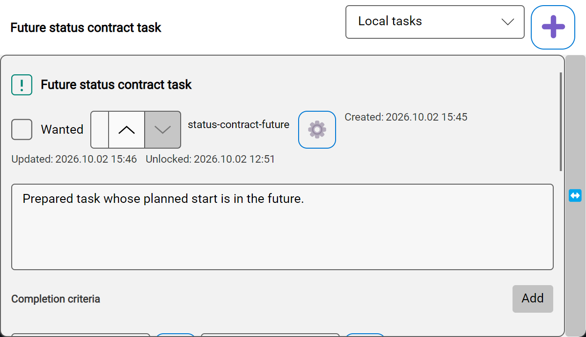
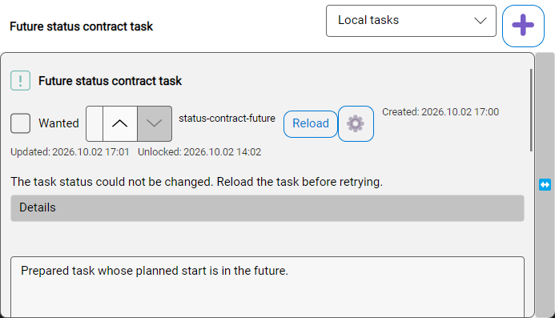
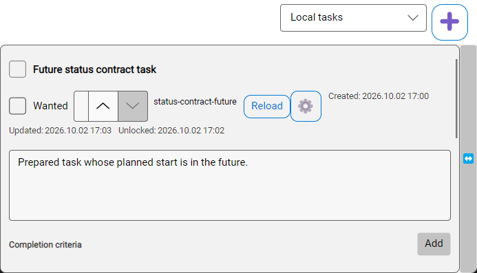
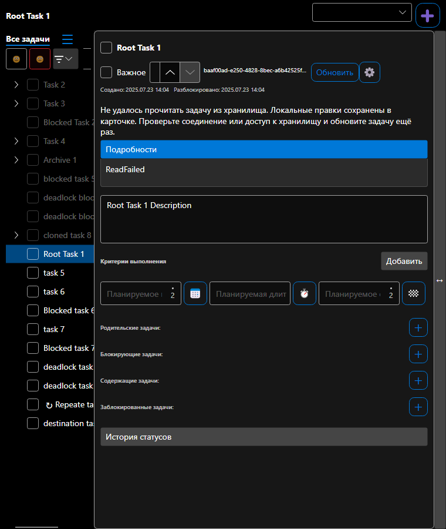

# Восстановление смены статуса из карточки

Проверено на синтетических задачах 2–3 октября 2026 года, Windows x64, .NET SDK 10.0.401, Avalonia 12.0.4, AppAutomation 1.6.0 и TUnit 1.44.0. Установленное приложение и пользовательское хранилище не изменялись. Точная причина индивидуального отказа пользователя не установлена.

Согласованный контракт и post-EXEC review: [SPEC](../../../specs/2026-10-02-task-card-status-recovery.md).

## До и после

Чистый baseline `46711e60` запускался с новым тестовым драйвером, без изменений production-кода. Native-сценарий завершился с единственным ожидаемым нарушением `RefreshUnavailable`: в карточке отсутствовала кнопка обновления. Снимок показывает карточку после окончания временного уведомления.



В исправленной версии сценарий удерживает блокировку синтетического хранилища, выбирает допустимый статус, проверяет отказ и неизменность файла. Постоянное сообщение остаётся в карточке, кнопка Reload доступна.



После освобождения блокировки тест нажимает Reload и явно повторяет выбор статуса. Native-прогон прошёл; чтение JSON подтвердило `NotReady` и ровно одну новую запись истории. Сам Reload не менял файл.



Отдельный Skia-прогон проверил RU/EN × Light/Dark × 1400/760: 8/8. Все восемь изображений просмотрены; тест также проверяет непустой кадр и различающиеся пиксели. Пример русской узкой карточки:



## Проверки

| Проверка | Результат | Evidence |
| --- | --- | --- |
| Обычная Desktop-сборка | PASS, 0 предупреждений / 0 ошибок | [desktop-build.log](desktop-build.log) |
| Полный Main suite 2026-10-02 | 1193 PASS / 1 FAIL / 0 SKIP; 32м34с; до последнего раннего Missing guard | [main-full-excerpt.log](main-full-excerpt.log) |
| Упавший Workspace executable spec отдельно | 1/1 PASS; причину сбоя в общей серии это не устанавливает | [workspace-focused.log](workspace-focused.log) |
| Headless: весь затронутый класс | 12/12 PASS | [headless-class.log](headless-class.log) |
| Последний полный Headless suite | 52/52 PASS, 3м40с; до/после recovery проходят другие классы | [headless-full.log](headless-full.log) |
| Последний весь класс status/reload ViewModel | 41/41 PASS; включая два TaskNotFound race cases | [viewmodel.log](viewmodel.log) |
| Native FlaUI recovery | 1/1 PASS, `FlowCompleted=true`, `FailureIds=[]` | [flaui.log](flaui.log) |
| Rendered RU/EN/theme/width matrix | 8/8 PASS | [rendered-matrix.log](rendered-matrix.log) |
| Удаление открытой dirty-карточки во время чтения | 1/1 PASS; текст можно скопировать, autosave/final-save не восстанавливают файл | [missing-card.log](missing-card.log) |

Полный Headless-прогон теперь проходит после исправления test-session startup: pinned dispatcher reset выполняется непосредственно на новом worker перед инициализацией renderer, а bootstrap/handoff используют ограниченное 15 секундами синхронное ожидание. Оно предотвращает inline continuation, запускающее следующий тест на занятом worker. До исправления оба механизма подтверждены локальными dump/stacks.

На отдельном adversarial review обнаружен post-status race: ответ TaskNotFound допускал editor drain до установки Missing и повторное создание задачи. Два deterministic cases дали RED до исправления, затем GREEN: локальные Title/Description сохраняются, source отсутствует, UpdateCount=0, concurrent Seal не восстанавливает задачу. Последний VM-класс прошёл 41/41. Тест read-only reload теперь явно откладывает user autosave; отдельный тест проверяет autosave, созревший во время чтения.

Логи выше сохраняют результаты прогонов; абсолютный корень рабочей копии заменён на `<worktree>`. Main-файл — явно обозначенная выдержка с ошибкой и итогом, остальные — полные небольшие логи. Полные локальные отчёты, TRX, дампы и остальные снимки находятся в `artifacts/status-recovery/` implementation worktree.

## Воспроизведение

После сборки соответствующего проекта, из корня checkout:

```powershell
dotnet build src/Unlimotion/Unlimotion.csproj --no-restore
dotnet build tests/Unlimotion.UiTests.Headless/Unlimotion.UiTests.Headless.csproj --no-restore
& './tests/Unlimotion.UiTests.Headless/bin/Debug/net10.0/Unlimotion.UiTests.Headless.exe' --maximum-parallel-tests 1 --report-trx
```

Main запускается из `src/Unlimotion.Test/bin/Debug/net10.0`, поскольку fixtures используют относительные пути. Для native recovery нужен Windows desktop:

```powershell
& './tests/Unlimotion.UiTests.FlaUI/bin/Debug/net10.0-windows7.0/Unlimotion.UiTests.FlaUI.exe' --treenode-filter '/*/*/MainWindowFlaUiTests/TaskCardStatusRecovery_FailureRefreshRetry' --maximum-parallel-tests 1 --report-trx
```

## Video fallback

Полная проверенная пара before/after MP4 не получена: попытки recording не прошли проверку средней частоты кадров, ожидание готовности baseline либо закончились преждевременным выходом ffmpeg. Неудачные MP4 не представлены как доказательство успешного flow. Выбран предусмотренный SPEC fallback: чистый baseline RED, итоговый native GREEN с persisted read-back, просмотренные снимки и rendered matrix. Исходные recording-логи и непрошедшие проверку файлы сохранены локально в `artifacts/status-recovery/`, включая `baseline-diagnostics/`.

## Остаток до ready for review

Разобрать сбой Workspace executable spec в полной Main-серии и подтвердить полный Main gate с последним Missing guard, затем завершить обязательный post-EXEC review. Успешные focused-прогоны не заменяют эту проверку, поэтому PR остаётся draft.
