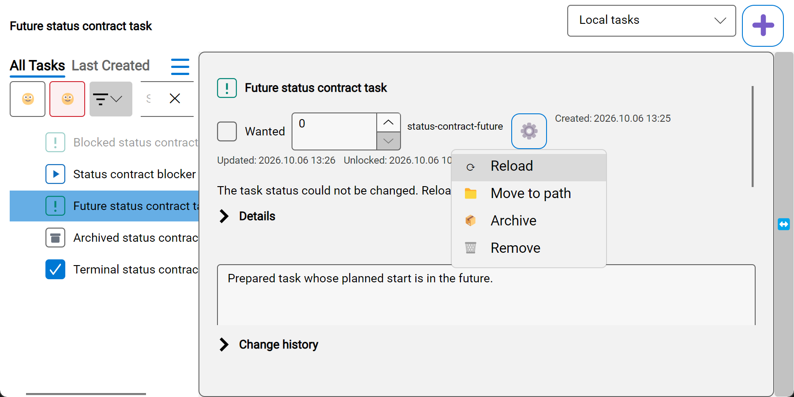
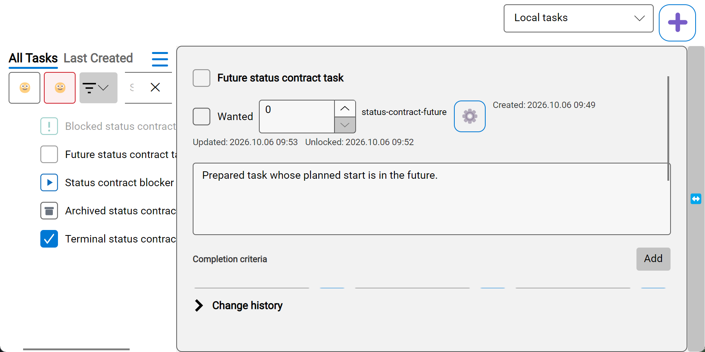
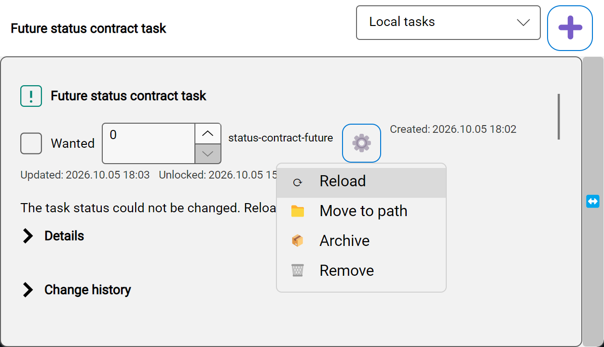
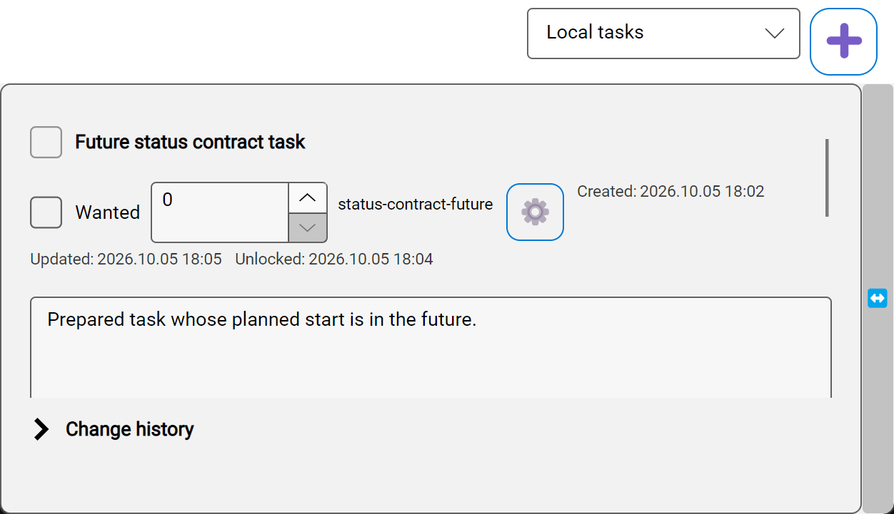
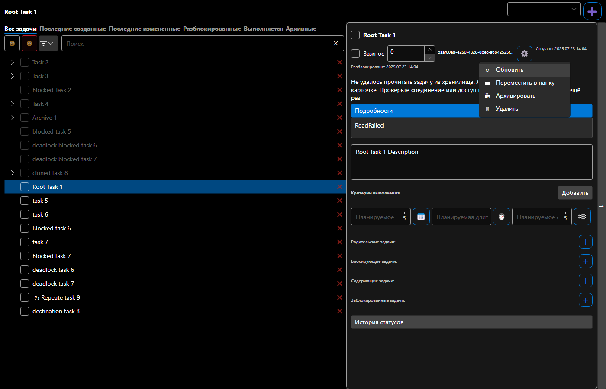

# Восстановление смены статуса из карточки

Проверено на синтетических задачах 2–6 октября 2026 года, Windows x64, .NET SDK 10.0.401, Avalonia 12.0.4 и TUnit 1.44.0. Исходные прогоны использовали AppAutomation 1.6.0, интеграция свежего main — 1.9.0. Установленное приложение и пользовательское хранилище не изменялись. Точная причина индивидуального отказа пользователя не установлена.

Согласованный контракт и post-EXEC review: [SPEC](../../../specs/2026-10-02-task-card-status-recovery.md).

## Финальные физические UI-сценарии, 6 октября

На immutable `635c941eaae8f02f8d8c3ff21b88f965d0fdef58` все пять адресных native-сценариев прошли: **5/5 PASS**, exit0 в каждом запуске, 0 FAIL/SKIP. Это пять последовательных процессов с точными test-name filters и одной неизменной FlaUI DLL: SHA256 `1818AA6AA2BF29B81C2553FCB6F3CD712E52DB4444C71BA7A9786B6DF4AC6D4D`; adapter SHA256 `7164C83B7676D055BBE597BE5F5D81F3BC31F238630E9198DCC7E34AF76303C2`. Все invocation имеют clean source, HEAD635c и monitor=primary. Перед запуском пользователь подтвердил свободный desktop; после завершения общий слот освобождён.

| Сценарий | Итог | Evidence |
| --- | --- | --- |
| Отказ → ⚙ → Reload → явный retry | **1/1 PASS**; Reload сохраняет JSON/text, снимает ошибку; retry пишет NotReady и ровно одну новую запись истории | [Лог](pre-merge-2026-10-05/native-final-five-recovery.log), [read-back observations](pre-merge-2026-10-05/native-final-635c/native-status-contract-recovery-observations.png.json) |
| RU Dark: будущий старт | **1/1 PASS**; запрещённый переход объяснён | [Лог](pre-merge-2026-10-05/native-final-five-future.log), [PNG](pre-merge-2026-10-05/native-final-635c/after-future-vs-blocked.png) |
| RU Dark: блокирующая задача | **1/1 PASS**; owned tooltip просмотрен | [Лог](pre-merge-2026-10-05/native-final-five-blocked.log), [PNG](pre-merge-2026-10-05/native-final-635c/after-blocked.png) |
| Terminal picker / unarchive | **1/1 PASS** | [Лог](pre-merge-2026-10-05/native-final-five-terminal.log), [picker](pre-merge-2026-10-05/native-final-635c/status-contract-terminal-picker.png), [unarchive](pre-merge-2026-10-05/native-final-635c/status-contract-after-unarchive.png) |
| Собственный viewport скрывает header → физический picker | **1/1 PASS**; positive bounds, PreparationCount=1, center hit false→true и fresh containment | [Лог](pre-merge-2026-10-05/native-final-five-clipped.log), [JSON](pre-merge-2026-10-05/native-final-635c/native-status-contract-viewport-StatusContract_PickerRestoresClippedHeader.json), [до](pre-merge-2026-10-05/native-final-635c/status-contract-viewport-StatusContract_PickerRestoresClippedHeader-before-scroll.png), [после](pre-merge-2026-10-05/native-final-635c/status-contract-viewport-StatusContract_PickerRestoresClippedHeader-after-scroll.png) |

Все восемь свежих native PNG просмотрены. Текущий результат восстановления:




Первый batch `native-final-five` выбрал0 тестов из-за фильтра и завершился exit8/minimum-expected-tests5; [original failure](pre-merge-2026-10-05/native-final-five.log) сохранён. Это ошибка invocation, product flow не запускался. Приведённые выше пять точных filters действительно выполнили нужные cases; результаты не переназначены прежним версиям6a/356. Их четыре опубликованных кадра остаются по старым путям, а свежие635c размещены отдельно в `native-final-635c`.

CI именно635c: **Main1274/1274 +Headless55/55 PASS**, exit0, 0 FAIL/SKIP; Android и CodeQL SUCCESS. [Tests](https://github.com/Kibnet/Unlimotion/actions/runs/37427953000), [Android](https://github.com/Kibnet/Unlimotion/actions/runs/37427953039), [CodeQL](https://github.com/Kibnet/Unlimotion/actions/runs/37427952784). Original merge checkout207701f6 имеет parents9150+635c и tree67850, равный branch tree. Эти results включены в [validation snapshot](pre-merge-2026-10-05/validation-snapshot.json); native pendingStages теперь[]. После публикации этого docs-only evidence требуется CI уже итогового HEAD; зелёный635c не переносится на новый SHA.

Подтверждённой before/after MP4 pair по-прежнему нет: recording FPS/readiness/ffmpeg ограничения сохраняются; fallback — просмотренные automated PNG, read-back assertions и оригинальные TRX. Точная индивидуальная production cause остаётся UNKNOWN; synthetic failure/recovery не считается её доказательством. Product/Main/Headless source не менялся при закрытии native gate; новые полные локальные серии не запускались.

## История возобновления native проверки, 6 октября

Input desktop теперь доступен, Win32 error0. Published checkpoint `6a7b45fb` имеет exact-head CI **1274/1274 Main +55/55 Headless PASS**, Android и CodeQL SUCCESS: [Tests](https://github.com/Kibnet/Unlimotion/actions/runs/37364841005), [Android](https://github.com/Kibnet/Unlimotion/actions/runs/37364840983), [CodeQL](https://github.com/Kibnet/Unlimotion/actions/runs/37364841010). Original CI checkout `c9d31e42` имеет parents main9150+PR6a, treeb92f точно совпадает с branch tree; exit0, clean, 0 FAIL/SKIP. Это CI предыдущей опубликованной головы; новый native adapter требует fresh final-head CI.

| Native invocation / source | Итог | Evidence |
| --- | --- | --- |
| Recovery повтор / clean6a | **0/1 FAIL**, physical hit не достиг status button после Reload; file/text read-back до отказа прошёл | [Лог](pre-merge-2026-10-05/native-recovery-repeat.log) |
| RU Dark future и blocked / clean6a | **1/1 +1/1 PASS**, настоящий owned blocker tooltip | [Future](pre-merge-2026-10-05/native-future.log), [blocked](pre-merge-2026-10-05/native-blocked.log) |
| Terminal / clean6a | **0/1 FAIL в BeforeTest**: placement1280x800physical против actual2880x1497 на основном4K мониторе; product flow не начат | [Лог](pre-merge-2026-10-05/native-terminal.log) |
| Recovery / clean3566320d, envprimary | **1/1 PASS**: error clear, unchanged JSON/text после Reload, NotReady/history+1 после явного retry; preparation scroll branch не выполнялась | [Лог](pre-merge-2026-10-05/native-recovery-viewport.log), [observations](pre-merge-2026-10-05/native-status-contract-recovery-observations.png.json) |
| Future / clean3566320d, envprimary | **0/1 FAIL**, PointerInterferenceException: другая программа закрыла target или владела foreground | [Лог](pre-merge-2026-10-05/native-future-viewport.log) |
| Финальные четыре flow + clipped-header regression / e094ae89 | **PENDING**: требуется короткий промежуток без переключения окон/движения мыши | [Manifest и pendingStages](pre-merge-2026-10-05/validation-snapshot.json) |

Новый native adapter сначала проверяет фактическое нахождение status button в собственной details viewport. Если header clipped, ScrollPattern возвращает его к началу; bounded fresh geometry проверяется до неизменённого DesktopPointer.Click с обязательным physical hit/owner guard. UIA может сообщать IsOffscreen=false при ancestor clipping; это объясняет соответствие первого отказа кадру, но causal confirmation новой preparation branch пока отсутствует. Адресный native-only тест намеренно клипует header и требует положительную геометрию, increment собственного preparation count, реально открытый picker и полностью видимый заголовок; per-test PNG/JSON не смешиваются между cases. Source re-review PASS, найденный MEDIUM coverage gap CLOSED; фактический sandbox danger-full-access/approval never, adversarial fallback только чтением, без enforced read-only.

Для финального запуска выбран существующий `UNLIMOTION_AUTOMATION_DESKTOP_MONITOR=primary`: fixture800x400logical, размещение в центре основного монитора с сохранением текущего physical size. Проверка размещения/принадлежности монитору сохраняется; это не подтверждение1280x800physical. Display settings не меняются. Native harness пересобран, его binaries отличаются от checkpoint5октября; production/Main/Headless/Authoring/TestHost source неизменен. Финальная сборка candidate e094 —4 existing warnings/0 errors; промежуточные incremental builds0/0 сохранены отдельно. Все hashes/heads/counters относятся к собственной invocation.

Просмотрены новые recovery error/retry кадры356 и future/blocked6a. Ни один из них не выдан за результат final harness e094. Подтверждённой before/after MP4 pair по-прежнему нет: прежние FPS/readiness/ffmpeg failures; fallback — automated native PNG + JSON/text read-back + original TRX.




Все owned full/native процессы завершены, слот освобождён. **Ready/merge gate OPEN:** final native5 на одном adapter/hash и exact final-head CI. Пользователь прямо разрешил слияние; ожидается доступность спокойного desktop interval, повторное merge approval не требуется. Original environment/hit/placement/interference failures и прежние результаты ниже сохранены отдельно.

## Проверка перед слиянием: исправления review, 5 октября

Product/Main candidate — `72dfbccd`; Headless infrastructure candidate — `f2a77c79`, база main — `9150ac01`. Закрыты confirmed-Missing cache/Relations, доступность Archive и Ctrl+D, поздний Saved snapshot и lifecycle seal после успешного явного retry. Reload остаётся первым пунктом ⚙. Все исходные проверки хранения, dirty edits, source lifetime и explicit retry сохранены.

| Новая проверка | Итог | Evidence |
| --- | --- | --- |
| Полный Main | **1274/1274 PASS**, exit0, 0 FAIL/SKIP, 42м28с | [Лог](pre-merge-2026-10-05/main-full.log) |
| Полный Headless после исправления factory | **55/55 PASS**, exit0, 0 FAIL/SKIP, 4м04с | [Лог](pre-merge-2026-10-05/headless-full-final.log) |
| VM / Unified storage | **44/44 + 18/18 PASS** | [VM](pre-merge-2026-10-05/green-vm-final.log), [storage](pre-merge-2026-10-05/green-unified.log) |
| Actual menu / external deletion с watcher и без него | **1/1 + 2/2 PASS**; Archive/Ctrl+D disabled при read/Missing, Relations очищены, detached draft доступен | [Menu](pre-merge-2026-10-05/green-menu-final.log), [Missing](pre-merge-2026-10-05/green-missing.log) |
| Headless factory lifecycle | **3/3 PASS**: worker identity, executing-action drain/ExecutionContext, propagation настоящего NRE | [Лог](pre-merge-2026-10-05/green-headless-factory.log) |
| Builds | Main **62 warnings / 0 errors**; Desktop/FlaUI/первый Headless **0/0**; финальная Headless factory **0/0** | [Main](pre-merge-2026-10-05/build-main-final.log), [Headless](pre-merge-2026-10-05/build-headless-factory-final.log), [Desktop](pre-merge-2026-10-05/build-desktop-final.log), [FlaUI](pre-merge-2026-10-05/build-native-final.log) |
| Свежий native recovery | **FAIL: input desktop unavailable**, 0/1; future/blocked/terminal пока не запускались | [Лог](pre-merge-2026-10-05/native-recovery.log) |

[Validation snapshot](pre-merge-2026-10-05/validation-snapshot.json) содержит original TRX hashes/counters/test names, logs/invocation/result hashes, binary/source SHA256 и pendingStages. Raw originals сохранены локально. Main и native binaries неизменны после Main PASS. Для нового Headless harness восстановлены общие уже проверенные DLL/PDB из Main/native: rebuild изменил metadata текущего Git revision; replacement manifest сохраняет before/tested hashes. Product/Main/Authoring/TestHost/FlaUI source совпадает с `72dfbccd`; Headless factory — отдельный test-only adapter pinned Avalonia12.0.4.

Первый Headless full напечатал52 Passed, но упал в AfterTestSession на await null worker Task, затем в TRX writer: **FAIL**, exit=-532462766, итогового TRX нет. Повтор без изменений **52/52 PASS** сохранён отдельно и не подменяет проверку исправления. Factory теперь присваивает cold Task до запуска, сохраняя pinned framework defaults; штатный DisposeAsync действительно ждёт worker, ошибки не подавляются. [Первый сбой](pre-merge-2026-10-05/headless-full.log), [неизменённый повтор](pre-merge-2026-10-05/headless-full-repeat.log), [финальный55/55](pre-merge-2026-10-05/headless-full-final.log).

RED/intermediate failures не удалены: original P2 menu/Missing/unknown; late-Saved resurrection; lifecycle dirty-negative PASS и persisted-retry RED. Первый red-cleanup упал из-за настройки fixture, поэтому не назван business RED. Новые final targeted/full runs закрывают source regressions. Workspace paste в полном Main прошёл8.8892288s; причина прежнего исторического failure остаётся UNKNOWN.

Все owned full/native процессы завершены, слот освобождён. **Merge gate пока открыт:** требуются все четыре targeted native flow (recovery, future, blocked, terminal/unarchive) при доступном input desktop и CI итоговой головы PR. Прежние native4/4 и шесть просмотренных PNG ниже относятся к предыдущему source, свежими не названы. Подтверждённой MP4 before/after pair нет: прежние recording attempts не прошли FPS/readiness/ffmpeg проверки; PNG/read-back/TRX fallback сохранён с этой границей evidence.

## Предыдущая проверка на main 9150ac01, 5 октября

Reload остаётся первым пунктом меню ⚙. После успешного чтения он снимает постоянную ошибку и сохраняет локальные правки; смена статуса требует явного повторного выбора. В no-journal fixture native driver проверяет неизменность JSON/text. Existing journal recovery по-прежнему может завершить ранее начатую транзакцию; отдельную status/save operation Reload не создаёт.

Проверенный кандидат `8ff819b1` объединяет recovery и history `4a2f781e`. После реального merge #312 в main `9150ac01` ветка синхронизирована commit `136ac8ba`: полный tree **точно совпадает** с кандидатом, `555998d7c506bd4845fdb48bc1b72dc86d7fa226`. [Доказательство совпадения](integration-history-2026-10-05/main-sync.json). Runtime source после сборки не менялся; последующие правки относятся к SPEC/evidence.

| Проверка финального кандидата | Итог | Evidence |
| --- | --- | --- |
| Полный Main | **1269/1269 PASS**, 0 FAIL/SKIP, 28м13с | [Лог](integration-history-2026-10-05/main-full.log) |
| Полный Headless | **52/52 PASS**, 0 FAIL/SKIP, 2м43с | [Лог](integration-history-2026-10-05/headless-full.log), [recovery observations](integration-history-2026-10-05/headless-recovery-observations.json) |
| Native recovery через ⚙ | **1/1 PASS**: permanent error исчезает до retry; JSON/text неизменен на Reload; NotReady и history +1 после явного повтора | [Лог](integration-history-2026-10-05/native-recovery.log), [observations](integration-history-2026-10-05/native-recovery-observations.json) |
| Native RU Dark future/blocked, EN Light terminal/unarchive | **3/3 PASS**; blocked tooltip — настоящий owned popup | [Future](integration-history-2026-10-05/native-future.log), [Blocked](integration-history-2026-10-05/native-blocked.log), [Terminal](integration-history-2026-10-05/native-terminal.log) |
| Resize 1400→360→1400→430→1400 | **1/1 PASS**: те же actions/flyout/Reload, Reload первым и с прежней command binding; compact/wide placement | [Лог](integration-history-2026-10-05/menu-resize.log) |
| Rendered RU/EN × Light/Dark × 1400/760 | **8/8 PASS**; реальные Details/history HeaderSite имеют разные корректные имена; все восемь menu PNG просмотрены | [Лог](integration-history-2026-10-05/menu-rendered-matrix.log), [RU Dark](integration-history-2026-10-05/reload-menu-ru-Dark-1400.png) |
| Builds | Main **95 warnings / 0 errors**, Desktop/Headless/FlaUI **0/0** | [Main](integration-history-2026-10-05/main-build.log), [Desktop](integration-history-2026-10-05/desktop-build.log), [Headless](integration-history-2026-10-05/headless-build.log), [FlaUI](integration-history-2026-10-05/flaui-build.log) |

[Validation snapshot](integration-history-2026-10-05/validation-snapshot.json) извлечён из восьми оригинальных TRX: counters, selected tests, times, filters, binary/TRX/invocation hashes. Raw файлы сохранены локально в `artifacts/status-recovery/integration-history-2026-10-05/`; публичные logs маскируют workspace/user/machine paths и удаляют концевые пробелы/пустые строки. Ошибка PowerShell quoting в raw Main invocation tree field сохранена и прозрачно дополнена [source snapshot](integration-history-2026-10-05/source-snapshot.json). Два `U+FFFD` в Main log — намеренные invalid-surrogate параметры emoji test, а не повреждённый footer. Native/Headless recovery harness сравнивает `File.ReadAllText`; прежние формулировки «unchanged bytes» в этих разделах означают неизменность JSON/text, а не отдельное измерение raw-byte hash.

Прежний `StormWorkspaceTreeCommandsExecutableSpecTests.WorkspaceTreeCommandsScenario_ExecutesFeatureSteps` в этом полном прогоне **Passed, 7.7011825s**. VM status41/41, typed reload9/9, Unified status17/17 также прошли; Importance24 states и input/persistence/negative controls входят в Main PASS. Исходные paste predicate/5s/assertion сохранены. Текущий full Main blocker закрыт, историческая причина старого отказа **UNKNOWN**: успешный повтор не доказывает causal fix. Ранее опубликованный `0da758f6` отдельно имел [CI1233/1233 +52/52 PASS](https://github.com/Kibnet/Unlimotion/actions/runs/37239894285), [проверенные counters/tree/TRX hashes](integration-history-2026-10-05/previous-ci-audit.json); это предыдущий source snapshot.

Свежий native frame: постоянная ошибка и Reload первым пунктом ⚙.



После явного повторного выбора статуса:



Все шесть native PNG просмотрены, включая [future](integration-history-2026-10-05/native-future.png), [blocked tooltip](integration-history-2026-10-05/native-blocked.png), [terminal](integration-history-2026-10-05/native-terminal.png), [unarchive](integration-history-2026-10-05/native-after-unarchive.png). Проверенной before/after MP4 pair нет: прежние recording attempts не прошли FPS/readiness/ffmpeg проверки. Fallback сохраняет [baseline PNG](before.png) и добавляет свежие native PNG/read-back, rendered matrix и logs из автоматизированных test runs. Это ограничение video evidence, не пропуск UI tests.

Full/native processes завершены, **слот явно освобождён**. Local quality gates PASS; source/validation re-review выполнен отдельным read-only-in-practice adversarial fallback (`danger-full-access`, approval never). CI последней опубликованной головы PR оценивается отдельно; предыдущие CI и main CI не переназначаются финальной голове. Установленное приложение и пользовательские задачи не менялись.

## Предыдущая база main 92cf8c1e, 5 октября

Во время проверки предыдущего снимка main получил #316 Importance. Проверенный union с `5a780b2e` сохранён в локальном merge commit `35924686`, затем отдельно объединён `92cf8c1e`. Все входящие Importance styles, 24 baseline-пары, тесты, CI и canonical fixtures сохранены. Recovery storage/VM semantics, постоянная ошибка и Reload первым пунктом ⚙ не менялись.

| Проверка на 92cf8c1e | Результат | Evidence |
| --- | --- | --- |
| Main / Desktop / Headless / FlaUI build | **PASS**; Main 95 warnings / 0 errors, остальные 0/0 | [Main](integration-92cf-2026-10-05/main-build.log), [Desktop](integration-92cf-2026-10-05/desktop-build.log), [Headless](integration-92cf-2026-10-05/headless-build.log), [FlaUI](integration-92cf-2026-10-05/flaui-build.log) |
| Menu binding/name/busy, Missing copyable draft, off-UI read | **3/3 PASS** в отдельных запусках | [Binding/busy](integration-92cf-2026-10-05/menu-binding-busy.log), [Missing](integration-92cf-2026-10-05/missing-card.log), [UI thread](integration-92cf-2026-10-05/ui-thread.log) |
| Rendered RU/EN × Light/Dark × 1400/760 | **8/8 PASS**; все восемь свежих menu PNG просмотрены, Importance виден | [Лог](integration-92cf-2026-10-05/menu-rendered-matrix.log), [RU Dark wide](integration-92cf-2026-10-05/reload-menu-ru-Dark-1400.png), [RU Dark narrow](integration-92cf-2026-10-05/reload-menu-ru-Dark-760.png) |
| Importance visual/input/persistence | **3/3 PASS**, включая 24 component baselines и negative controls | [Лог](integration-92cf-2026-10-05/importance.log), [результаты трёх child TRX](integration-92cf-2026-10-05/importance-child-results.json) |
| Headless отказ → ⚙ → Reload → явный retry | **1/1 PASS**; error clear, unchanged bytes после Reload, JSON NotReady и одна новая запись истории | [Лог](integration-92cf-2026-10-05/headless-recovery.log), [observations](integration-92cf-2026-10-05/headless-recovery-observations.json) |
| Desktop/phone card layout | **4/4 PASS**: desktop 1, phone 3 | [Desktop](integration-92cf-2026-10-05/layout-desktop.log), [Phone](integration-92cf-2026-10-05/layout-phone.log) |

Новый кадр на объединённой базе:



[Validation snapshot](integration-92cf-2026-10-05/validation-snapshot.json) фиксирует checkpoint, merged main, filters, timestamps, counts и binary hashes. Локальные HTML/TRX и все Importance images сохранены в `artifacts/status-recovery/integration-92cf-2026-10-05/`. Rendered flyout подтверждает содержание меню; необычное положение EN Light 760 popup не используется как доказательство native positioning. Source вызывает `ShowAt(actions)`.

В raw Importance child stdout авторский parent process повредил кодировку русских footer labels. Исходные stdout сохранены локально без предполагаемой перекодировки; публичный основной лог читаемый. Child names/counts/times и SHA256 исходных TRX приведены в JSON, извлечённом из самих TRX; тесты и assertions не менялись.

На этом предыдущем этапе verdict был **NEEDS-FIX, draft**: полный Main finding ещё открыт, повтор ожидал слота. Полные/native результаты следующего раздела относятся к **5a780b2e**. Финальный прогон и disposition приведены выше; эта запись сохраняет границы прежнего evidence. Video fallback сохранялся: проверенной MP4 pair не было.

## Предыдущая интеграция main 5a780b2e, 4–5 октября

Объединены #313 AppAutomation 1.9 и #315 emoji со status recovery. Canonical metadata/pumping fixture, API-based server wait и ShiftDelete cache/storage wait сохранены из main; wrapper-delete wait перенесён отдельным hunk автора Importance. Pointer lifecycle объединён с recovery/menu clicks через DesktopPointer. Capture helper теперь не меняет focus/foreground внутри read-only HoverAsync callback; найденный MEDIUM закрыт source re-review.

| Проверка | Результат | Evidence |
| --- | --- | --- |
| Полный Main | **1229/1230**, 1 FAIL, 0 SKIP; 36м03с. Workspace tree commands: `PasteOutlineCommandWorked=false` | [Полный лог](integration-2026-10-05/main-full.log) |
| Полный Headless | **52/52 PASS**, 0 SKIP; 3м53с | [Лог](integration-2026-10-05/headless-full.log), [recovery observations](integration-2026-10-05/headless-recovery-observations.json) |
| Native recovery: отказ → ⚙ → Reload → явный retry | **1/1 PASS**; Reload сохраняет исходные bytes, retry пишет NotReady и ровно одну новую запись истории | [Лог](integration-2026-10-05/native-recovery.log), [observations](integration-2026-10-05/native-recovery-observations.json), [после повтора](integration-2026-10-05/native-recovery-after-retry.png) |
| Native: RU Dark future/blocked и EN Light terminal picker+unarchive | **3/3 финальных PASS** в отдельных адресных запусках | [Future](integration-2026-10-05/native-future.log), [Blocked](integration-2026-10-05/native-blocked.log), [Terminal](integration-2026-10-05/native-terminal.log) |
| Rendered menu RU/EN × Light/Dark × 1400/760 | **8/8 PASS**, все восемь новых menu frames просмотрены | [Лог](integration-2026-10-05/menu-rendered-matrix.log), [RU Dark wide](integration-2026-10-05/reload-menu-ru-Dark-1400.png), [RU Dark narrow](integration-2026-10-05/reload-menu-ru-Dark-760.png) |
| Wrapper-delete, ShiftDelete, Workspace graph commands, hydration boundary | **4/4 адресных PASS**; соответствующие cases также PASS в общей Main-серии | [Wrapper](integration-2026-10-05/delete-wrapper.log), [ShiftDelete](integration-2026-10-05/delete-shift.log), [Workspace graph](integration-2026-10-05/delete-workspace.log), [Hydration](integration-2026-10-05/cache-hydration.log) |
| SSH-key command wait | **1/1 PASS** отдельно и PASS внутри Main | [Лог](integration-2026-10-05/settings-targeted.log) |
| Main build после добавления failure diagnostics | **PASS**, 51 существующее предупреждение / 0 ошибок | [Лог](integration-2026-10-05/main-build.log) |
| Обычный Desktop / Headless / FlaUI build | **PASS**, 0 warnings / 0 errors | [Desktop](integration-2026-10-05/desktop-build.log), [Headless](integration-2026-10-05/headless-build.log), [FlaUI](integration-2026-10-05/flaui-build.log) |

Свежий native frame показывает постоянную ошибку и Reload первым пунктом ⚙:


Все шесть новых native PNG просмотрены: [future](integration-2026-10-05/native-future.png), [blocked tooltip](integration-2026-10-05/native-blocked.png), [terminal](integration-2026-10-05/native-terminal.png), [unarchive](integration-2026-10-05/native-after-unarchive.png) и два recovery frame. Первый Blocked run завершился отменой общего HoverAsync budget после успешных owned-tooltip assertions и capture; [ранний FAIL](integration-2026-10-05/native-blocked-timeout.log) сохранён. Tooltip wait сохраняет 15s deadline, action budget 30s включает owner validation и read-only UIA/capture. Pointer restoration использует отдельный framework cleanup budget. Повтор прошёл; helper не меняет focus/foreground.

После соответствующего сбоя в интеграционном прогоне Importance перенесён авторский CLI wait-patch для SSH-key case: ожидание завершения самой ReactiveCommand, затем прежние конечные assertions. Адресный тест прошёл 1/1; последняя Main-сборка — 51 warning / 0 errors. Product-код этот hunk не меняет.

Workspace paste отдельно с новой failure-only диагностикой прошёл **1/1** ([лог](integration-2026-10-05/paste-diagnostic.log)). Исходные predicate, 5s deadline и `IsTrue` сохранены. При следующем timeout в assertion попадут clipboard/preview/confirmation/errors, cache и persisted tasks, focus и selection непосредственно до следующего add/delete. Причина full-only failure пока неизвестна; isolated PASS не закрывает общий gate. Paste/parser/UI route не менялись recovery-интеграцией; related paste scenarios в той же Main-серии прошли.

Предыдущий опубликованный HEAD `41bd9a78` имел [CI Main 1196/1196 и Headless 52/52 PASS](https://github.com/Kibnet/Unlimotion/actions/runs/37151386151). Это результат до свежего main. Старые 1193/1194 ниже сохраняются как история. Обязательные интеграционные прогоны завершены, слот передан следующему агенту. **Общий verdict NEEDS-FIX; PR остаётся draft до закрытия Main gate.** Локальные HTML/TRX, invocation/binary hashes и source snapshots сохранены в `artifacts/status-recovery/integration-2026-10-04/`.

## Текущее размещение: ⚙ → Обновить

По уточнению пользователя от 3 октября «Обновить» находится первым пунктом меню шестерёнки. Отдельной кнопки в заголовке карточки нет. Пункт доступен без ошибки, блокируется во время чтения и для удалённой задачи; команда, доступное имя и стабильный automation ID сохранены.

Чистый baseline `46711e60` запускался с новым recovery-драйвером, без изменений production-кода. Native-сценарий завершился с единственным ожидаемым нарушением `RefreshUnavailable`: обновление было недоступно. Снимок показывает карточку после окончания временного уведомления.


Кадр размещения от 3 октября; Skia rendered frame, русская локализация, тёмная тема, ширина 1400:


Кадр размещения от 3 октября, ширина 760:


Все восемь кадров размещения RU/EN × Light/Dark × 1400/760 просмотрены. Тесты требуют непустой кадр с различающимися пикселями и проверяют локализованный menu item. Новые rendered/native результаты интеграции приведены выше.

## Проверки размещения от 3 октября

| Проверка | Результат | Evidence |
| --- | --- | --- |
| Menu placement, actual binding, accessible name, busy | RED на прежней отдельной кнопке → GREEN 1/1 | [RED](menu-action-red.log), [GREEN](menu-action.log) |
| Полный Headless suite после усиления recovery assertion | 52/52 PASS, 0 SKIP, 3м09с | [menu-headless-full.log](menu-headless-full.log) |
| Recovery: отказ → ⚙ → Обновить → явный повтор | PASS внутри full Headless; `FlowCompleted=true`, `FailureIds=[]`; перед retry ошибка исчезает, JSON содержит NotReady и одну новую запись истории | [observations](menu-headless-observations.json), [suite log](menu-headless-full.log) |
| Rendered RU/EN/theme/width matrix | 8/8 PASS, 1м01с | [menu-rendered-matrix.log](menu-rendered-matrix.log) |
| Удаление открытой dirty-карточки во время чтения | 1/1 PASS; menu item disabled, текст можно скопировать, файл не восстанавливается | [menu-missing-card.log](menu-missing-card.log) |
| Desktop и phone layout с полным набором пунктов ⚙ | 4/4 PASS: desktop 1, phone 3 | [desktop](menu-layout-desktop.log), [phone](menu-layout-phone.log) |
| Обычная Desktop-сборка с пунктом меню | PASS, 0 предупреждений / 0 ошибок | [menu-desktop-build.log](menu-desktop-build.log) |
| Последняя компиляция FlaUI adapter | PASS, 0 ошибок; 3 существующих предупреждения в ServerStorage/TaskStorageBuilder/ConflictResolutionControl | [menu-flaui-build.log](menu-flaui-build.log) |
| Native FlaUI меню на снимке 3 октября | Тогда не подтверждён: `SendInput` получил Win32 Access denied при первом status click, до открытия ⚙. Windows-сеанс был отключён/заблокирован | [menu-native-blocked.log](menu-native-blocked.log) |

Recovery-тест теперь ждёт одновременно enabled status и исчезновения постоянной ошибки. Доступность status сама по себе не доказывает выполнение Reload: после StorageFailed она уже восстановлена. Adversarial source re-review подтвердил исправление этой проверки. Headless использует существующий repository fallback для detached flyout bindings; actual MainControl test отдельно проверяет привязку MenuItem к ReloadTaskCommand.

## Предыдущие проверки recovery до переноса в меню

Эти результаты относятся к исходному исправлению с отдельной кнопкой в commit `11808873`; они не подтверждают native-путь последнего меню.

| Проверка | Результат | Evidence |
| --- | --- | --- |
| Native FlaUI recovery с отдельной кнопкой | 1/1 PASS, `FlowCompleted=true`, `FailureIds=[]`; JSON NotReady и ровно одна новая запись истории; Reload не менял файл | [flaui.log](flaui.log), [ошибка](after-error.png), [после повтора](after-retry.png) |
| Весь класс status/reload ViewModel | 41/41 PASS; включая два TaskNotFound race cases | [viewmodel.log](viewmodel.log) |
| Полный Main suite 2026-10-02 | 1193 PASS / 1 FAIL / 0 SKIP; 32м34с; до последнего раннего Missing guard | [main-full-excerpt.log](main-full-excerpt.log) |
| Упавший Workspace executable spec отдельно | 1/1 PASS; причину сбоя в общей серии это не устанавливает | [workspace-focused.log](workspace-focused.log) |

После status command TaskNotFound применяется до editor drain, чтобы локальные правки не создали удалённую задачу заново. Два deterministic race cases дали RED до исправления и GREEN после; последний VM-класс прошёл 41/41. Full Headless также проверяет исправленный startup/handoff тестовых сессий до и после recovery.

Логи сохраняют результаты прогонов; абсолютный корень рабочей копии заменён на `<worktree>`. Main-файл — явно обозначенная выдержка с ошибкой и итогом. Полные локальные HTML/TRX, дампы и остальные снимки находятся в `artifacts/status-recovery/` implementation worktree.

## Воспроизведение

После сборки соответствующего проекта, из корня checkout:

```powershell
dotnet build src/Unlimotion/Unlimotion.csproj --no-restore
dotnet build tests/Unlimotion.UiTests.Headless/Unlimotion.UiTests.Headless.csproj --no-restore
& './tests/Unlimotion.UiTests.Headless/bin/Debug/net10.0/Unlimotion.UiTests.Headless.exe' --maximum-parallel-tests 1 --report-trx
```

Main запускается из `src/Unlimotion.Test/bin/Debug/net10.0`, поскольку fixtures используют относительные пути. Для native recovery нужен активный разблокированный Windows desktop:

```powershell
dotnet build tests/Unlimotion.UiTests.FlaUI/Unlimotion.UiTests.FlaUI.csproj --no-restore
& './tests/Unlimotion.UiTests.FlaUI/bin/Debug/net10.0-windows7.0/Unlimotion.UiTests.FlaUI.exe' --treenode-filter '/*/*/MainWindowFlaUiTests/TaskCardStatusRecovery_FailureRefreshRetry' --maximum-parallel-tests 1 --report-trx
```

## Video fallback

Проверенная пара before/after MP4 не получена: ранние recording attempts не прошли проверку средней частоты кадров, ожидание готовности baseline либо закончились ранним выходом ffmpeg. Неудачные MP4 не представлены как доказательство успешного flow. Предусмотренный SPEC fallback: чистый baseline RED, native GREEN с persisted read-back, просмотренные снимки и rendered matrix. Текущая интеграция дополняет его actual native menu recovery, шестью просмотренными native PNG, восьмью новыми rendered menu PNG и полным Headless. Исходные recording-логи сохранены локально в `artifacts/status-recovery/`, включая `baseline-diagnostics/`.

## Остаток до ready for review

Подтвердить CI свежего опубликованного HEAD PR #314. Актуальные полные Main и Headless, а также четыре affected native flow прошли; local implementation/validation gate закрыт. Историческая причина `WorkspaceTreeCommandsScenario_ExecutesFeatureSteps` остаётся UNKNOWN как неблокирующий residual: последний полный Main содержит PASS этого case, causal fix не заявляется. PR сохраняется draft до подтверждения fresh CI.
