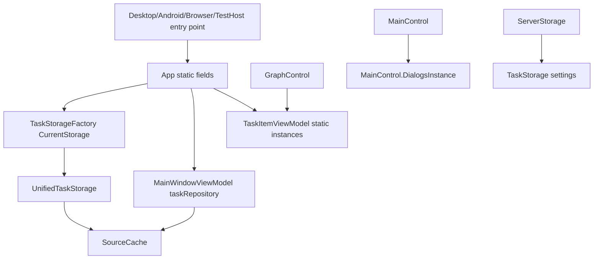
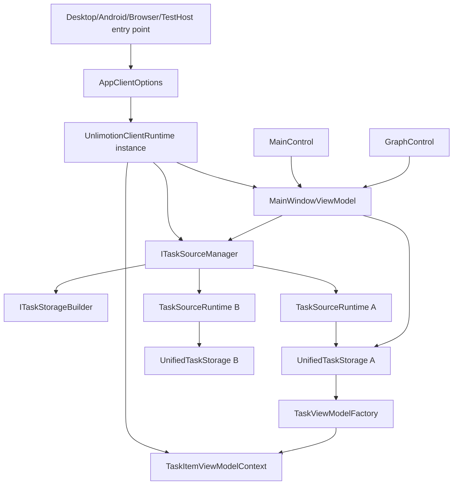

# Рефакторинг клиентского состояния для нескольких источников задач

## 0. Метаданные
- Тип (профиль): `delivery-task` + `.NET desktop client` + `refactor-architecture` + `refactoring-policy`
- Владелец: Product Owner / активный пользователь
- Масштаб: large
- Целевая модель: gpt-5.5
- Целевой релиз / ветка: Не задано
- Ограничения:
  - Фаза `SPEC`: до подтверждения менять только этот файл.
  - Переход в `EXEC` только после фразы пользователя `Спеку подтверждаю`.
  - Локальный `AGENTS.override.md` требует UI tests, если этап реализации меняет UI behavior, visual user flows или UI-facing state.
  - Рефакторинг не должен менять наблюдаемое поведение текущего одного источника задач.
  - Публичные persisted-данные должны мигрироваться назад-совместимо с существующим `TaskStorage`.
- Связанные ссылки:
  - `src/Unlimotion/App.axaml.cs`
  - `src/Unlimotion.Desktop/Program.cs`
  - `src/Unlimotion.Android/MainActivity.cs`
  - `src/Unlimotion.Browser/Program.cs`
  - `tests/Unlimotion.AppAutomation.TestHost/UnlimotionAppLaunchHost.cs`
  - `src/Unlimotion/Services/ITaskStorageFactory.cs`
  - `src/Unlimotion/Services/TaskStorageFactory.cs`
  - `src/Unlimotion/UnifiedTaskStorage.cs`
  - `src/Unlimotion/FileStorage.cs`
  - `src/Unlimotion/ServerStorage.cs`
  - `src/Unlimotion/Services/BackupViaGitService.cs`
  - `src/Unlimotion.ViewModel/TaskStorageSettings.cs`
  - `src/Unlimotion.ViewModel/MainWindowViewModel.cs`
  - `src/Unlimotion.ViewModel/TaskItemViewModel.cs`
  - `src/Unlimotion.ViewModel/SettingsViewModel.cs`
  - `src/Unlimotion.ViewModel/Localization/LocalizationService.cs`
  - `src/Unlimotion/Views/MainControl.axaml.cs`
  - `src/Unlimotion/Views/GraphControl.axaml.cs`
  - `src/Unlimotion.Test/MainWindowViewModelFixture.cs`

Если секция не применима, явно указано `Не применимо`.

## 1. Overview / Цель
Подготовить клиентскую часть Unlimotion к поддержке нескольких источников задач за счет удаления process-wide mutable singleton/static state из пути создания, выбора, чтения и изменения задач.

Outcome contract:
- Success means:
  - Клиентский composition root перестает хранить основные сервисы, текущую VM и текущий storage в static fields.
  - Контракт `ITaskStorageFactory.CurrentStorage` заменен на source-aware runtime/manager, который может держать один или несколько источников без глобального `CurrentStorage`.
  - `MainWindowViewModel`, `TaskItemViewModel`, `GraphControl` и `MainControl` получают зависимости через instance context/data context, а не через `TaskItemViewModel.*Instance` и `MainControl.DialogsInstance`.
  - Текущий single-source сценарий остается полностью совместимым: существующий `TaskStorage` в `Settings.json` мигрируется в новый формат или читается как legacy fallback.
  - Pure static helpers, extension methods, Avalonia dependency properties и immutable constants не объявляются проблемой сами по себе и не переписываются без пользы.
  - Будущий feature-этап сможет добавить UI управления несколькими источниками без переписывания storage/viewmodel foundation.
- Итоговый артефакт / output:
  - Спецификация, затем после утверждения: кодовый рефакторинг, tests и краткий migration/rollback отчет.
- Stop rules:
  - Остановиться до EXEC, пока пользователь не подтвердит spec.
  - Не продолжать этап refactor, если characterization tests фиксируют изменение текущего single-source поведения.
  - Не завершать EXEC без `dotnet build`, релевантных targeted tests и полного тестового прогона проекта или явного отчета, почему полный прогон недоступен.

## 2. Текущее состояние (AS-IS)
- `App.axaml.cs` является одновременно Avalonia `Application`, composition root, storage orchestrator, settings command binder, migration runner, backup scheduler owner и update service owner.
- В `App.axaml.cs` есть static mutable fields: `_configuration`, `_mapper`, `_dialogs`, `_toastNotificationManager`, `_notificationManager`, `_backupService`, `_applicationUpdateService`, `_appNameService`, `_storageFactory`, `_configPath`, `_scheduler`, `_mainWindowViewModel`, `_cultureChangedHandler`, `_startupUpdateSettings`, `_startupUpdateCheckPending`.
- `App.Init(configPath)` глобально создает configuration, localization, mapper, dialogs, storage factory, backup service, initial storage и scheduler hooks.
- `TaskStorageFactory` держит один `CurrentStorage`, один `CurrentWatcher`, static `DefaultStoragePath` и static `PrepareFileStoragePathAsync`.
- `ITaskStorageFactory` выражает ровно один текущий storage:
  - `ITaskStorage? CurrentStorage`
  - `IDatabaseWatcher? CurrentWatcher`
  - `CreateFileStorage`, `CreateServerStorage`, `SwitchStorage`
- `MainWindowViewModel` получает `Func<ITaskStorage?> getTaskStorage`, сохраняет результат в публичное поле `taskRepository` и строит все tabs, graph, filters, relation editor и commands от одного `taskRepository.Tasks.Connect()`.
- `TaskItemViewModel` хранит static fallbacks `NotificationManagerInstance` и `MainWindowInstance`. `NotificationManagerInstance` читается для toast/confirm flows, а `MainWindowInstance` используется как fallback в `GraphControl`.
- `MainControl` держит static `DialogsInstance` и напрямую создает `FileStorage` в `MoveToPath`.
- `GraphControl.ResolveMainWindowViewModel` падает назад на `TaskItemViewModel.MainWindowInstance`.
- `LocalizationService.Current` является глобальным mutable singleton. Он не является источником задач, но создает тестовую и composition-сцепку через глобальную культуру.
- `BackupViaGitService.GetAbsolutePath` static и `TaskStorageFactory.DefaultStoragePath` static задаются из Desktop, Android, Browser и TestHost entry point-ов.
- `FileStorage` при пустом path берет `TaskStorageFactory.DefaultStoragePath`.
- `ServerStorage` читает login/password и tokens из глобальных секций `TaskStorage` и `ClientSettings`, поэтому несколько server-source с разными учетками сейчас неразличимы.
- `TaskStorageSettings` хранит один набор: `Path`, `URL`, `Login`, `Password`, `IsServerMode`, `IsFuzzySearch`.
- `SettingsViewModel` редактирует один локальный путь или один server URL и переключает один режим.
- Browser и AppAutomation TestHost частично обходят `App.Init`, но все равно пишут в те же static dependencies.

AS-IS dependency sketch:



## 3. Проблема
Корневая проблема: путь работы с задачами завязан на единственный process-wide mutable "текущий storage" и static service fallbacks, поэтому приложение не может одновременно держать несколько независимых источников задач, маршрутизировать команды в правильный источник и тестировать такие сценарии без скрытого пересечения состояния.

## 4. Цели дизайна
- Разделение ответственности:
  - startup/composition отдельно от Avalonia `Application`;
  - source registry/manager отдельно от concrete storage implementations;
  - task command routing отдельно от UI controls;
  - platform path/dialog/update services отдельно от domain/viewmodel.
- Повторное использование:
  - один composition API для Desktop, Android, Browser и AppAutomation TestHost;
  - существующие `FileStorage`, `ServerStorage`, `UnifiedTaskStorage` переиспользуются как source runtimes.
- Тестируемость:
  - несколько source runtime можно создать в одном test process без static resets;
  - `TaskItemViewModel` можно тестировать с injected context.
- Консистентность:
  - все task lists, graph, relation picker и current task используют один source-aware read model.
- Обратная совместимость:
  - legacy `TaskStorage` продолжает читаться;
  - текущий single-source UX не меняется в этом refactor.

## 5. Non-Goals (чего НЕ делаем)
- Не добавляем полноценный UI управления несколькими источниками задач в этой спецификации.
- Не меняем серверный API и server-side storage model.
- Не меняем формат файлов отдельных задач.
- Не переписываем pure helper static classes, extension methods, immutable constants, Avalonia styled/direct properties и stateless algorithms только ради отсутствия слова `static`.
- Не меняем semantics связей задач между источниками. На этом этапе связи остаются внутри одного source.
- Не переносим Git backup на multi-source модель полностью. В этом refactor он остается привязан к active local source, а multi-source backup проектируется как follow-up.
- Не вводим DI container, если локальная composition object/factory решает задачу с меньшим diff.

## 6. Предлагаемое решение (TO-BE)

### 6.1 Распределение ответственности
- `UnlimotionClientRuntime`:
  - instance-scoped composition root;
  - держит configuration, localization, mapper, dialogs, notification, update service, source manager, backup service, scheduler;
  - создается entry point-ом и передается в `App` instance.
- `AppClientOptions`:
  - config path, default storage path, platform path resolver, optional update service, optional folder access preparer.
- `ITaskSourceManager`:
  - source-aware replacement for `ITaskStorageFactory.CurrentStorage`;
  - exposes `IReadOnlyList<TaskSourceRuntime> Sources`, `TaskSourceRuntime? ActiveSource`, `IObservable`/events for source changes;
  - creates, connects, disconnects and switches active source by id.
- `TaskSourceDescriptor`:
  - persisted source identity: `Id`, `DisplayName`, `Kind`, `IsEnabled`, `IsActive`, `FilePath`, `ServerUrl`;
  - for server sources references source-scoped auth/token settings by the same `Id`.
- `TaskSourceServerSettings`:
  - source-scoped server auth state: `SourceId`, `Login`, `Password`, `AccessToken`, `RefreshToken`, `ExpireTime`;
  - preserves current plaintext password behavior; encrypted storage is a separate security feature.
- `TaskSourceRuntime`:
  - runtime pair: descriptor + `ITaskStorage` + optional watcher + source-specific services.
- `ITaskStorageFactory`:
  - replaced by stateless `ITaskStorageBuilder`;
  - no `CurrentStorage`, no static default path.
- `TaskItemViewModelContext`:
  - injected notification manager, localization, scheduler/options and task owner callbacks;
  - replaces `TaskItemViewModel.NotificationManagerInstance` and `TaskItemViewModel.MainWindowInstance`.
- `TaskViewModelFactory`:
  - creates `TaskItemViewModel(model, storage, context, isInitializedProvider)`;
  - passed into `UnifiedTaskStorage` through constructor/runtime creation.
- `MainWindowViewModel`:
  - depends on `ITaskSourceManager`;
  - for this refactor still binds to active source only, but no longer asks a global factory for `CurrentStorage`;
  - exposes source context needed by controls through DataContext.
- `MainControl`:
  - gets dialogs through view model command/service, not static `DialogsInstance`;
  - `MoveToPath` delegates to source/task service instead of directly newing `FileStorage`.
- `GraphControl`:
  - resolves owner from DataContext/visual tree only; no fallback to `TaskItemViewModel.MainWindowInstance`.
- `SettingsViewModel`:
  - keeps legacy single-source properties for current UI;
  - internally can read/write active source descriptor through adapter, preserving existing bindings.

### 6.2 Детальный дизайн

TO-BE dependency sketch:



Refactor stages:

1. Characterization safety net:
   - capture current single-source startup/connect behavior;
   - capture static fallback behavior for notification, graph owner resolution and settings storage path;
   - add tests that fail if storage commands write to a different source than the task belongs to.
2. Introduce source descriptors without behavior change:
   - add `TaskSourceKind`, `TaskSourceDescriptor`, `TaskSourcesSettings`;
   - add legacy adapter that maps existing `TaskStorage` to one descriptor with stable id like `default`;
   - no UI change.
3. Replace `TaskStorageFactory.CurrentStorage`:
   - add `ITaskSourceManager`;
   - make active source runtime explicit;
   - introduce stateless `ITaskStorageBuilder`;
   - keep `SwitchStorage` compatibility as wrapper only inside source manager during migration, then remove direct callers.
4. Remove static path/service fallbacks:
   - replace `TaskStorageFactory.DefaultStoragePath` with `AppClientOptions.DefaultTaskStoragePath`;
   - replace `PrepareFileStoragePathAsync` with injected platform service;
   - replace `BackupViaGitService.GetAbsolutePath` with injected path resolver.
5. Remove TaskItem/View static dependencies:
   - introduce `TaskItemViewModelContext` and pass it through `UnifiedTaskStorage`;
   - remove `TaskItemViewModel.NotificationManagerInstance`;
   - remove `TaskItemViewModel.MainWindowInstance`;
   - move graph/task selection owner resolution to DataContext.
6. Move App static composition into runtime:
   - convert `App.Init` static workflow into runtime factory;
   - keep only thin platform bridge methods if platform APIs require static entry, and make them delegate to current `App` instance rather than owning services.
7. Prepare multi-source read model:
   - keep active-source-only UI in this spec;
   - add source identity and ownership to active-source subscriptions now;
   - do not add `AllEnabledTasks` aggregation in this refactor;
   - add source id to task context, not necessarily to persisted `TaskItem`.

Output/evidence rules:
- Each stage must be reviewable as a small diff.
- Any stage that touches UI bindings or controls must include relevant Avalonia Headless/AppAutomation tests.
- Any stage that touches persisted settings must include migration tests.

Visual planning artifact:
- `Не применимо` for this refactor spec: target behavior is architectural and intentionally preserves current visible UI. Fallback state flow is the dependency diagrams above. If EXEC expands into visible source selector/settings UI, a separate visual planning artifact must be added before that UI change.

UI test video evidence:
- `Не применимо` for this refactor-only spec because no UI automation feature flow or visual change is planned. If EXEC changes Settings UI or task source selection UI, video/screenshot evidence becomes required by the GitHub delivery policy and local UI override.
- Fallback evidence for UI-facing plumbing changes: targeted Avalonia Headless/AppAutomation suites around startup, main control command wiring and task card/status rendering must be listed in the EXEC review and PR validation instead of video artifacts.

Границы сохранения поведения:
- Existing `Settings.json` with only `TaskStorage` loads exactly one active source.
- Existing local file tasks are not rewritten unless existing migrations already do so.
- Current tabs, filters, graph, relation picker, task commands and backup controls continue to work for the active source.

Обработка ошибок:
- Source connection errors must be source-scoped.
- A failed inactive source must not break active source UI.
- Legacy migration failures must fall back to current `TaskStorage` behavior or show existing storage error, not silently start with an empty source list.

Производительность:
- No intentional performance tradeoff.
- Multi-source aggregation is not enabled in this spec, so startup cost should remain near current single-source cost.

## 7. Бизнес-правила / Алгоритмы
- Source identity:
  - each source has stable `Id`;
  - legacy single source uses `default`;
  - task command routing uses the source runtime that created/owns the `TaskItemViewModel`.
- Active source:
  - current UI operates on one active source during this refactor;
  - changing active source disconnects or detaches subscriptions from the previous source before binding the new one.
- Relations:
  - relation editor candidates are from the same source as the current task in this refactor.
  - cross-source relations are explicitly unsupported until a product spec defines semantics.
- Settings migration:
  - if `TaskSources` section is absent and `TaskStorage` exists, create/read one descriptor from `TaskStorage`;
  - legacy `TaskStorage.Login`, `TaskStorage.Password` and `ClientSettings` map to `TaskSources.ServerSettings[default]` for server mode;
  - keep writing legacy `TaskStorage` fields until UI/settings compatibility is intentionally changed.
- Server auth:
  - `ServerStorage` must stop reading login/password/tokens from global `TaskStorage` and `ClientSettings`;
  - `ServerStorage` receives source-specific server settings and token persistence callbacks from `TaskSourceRuntime`;
  - only the legacy active `default` server source is mirrored back to `TaskStorage`/`ClientSettings` for rollback compatibility.
- Static classification:
  - blocking static: mutable process-wide service/state/default used by task source flow;
  - non-blocking static: pure helper, extension method, immutable resource/cache, Avalonia property registration, local test helper.

## 8. Точки интеграции и триггеры
- Startup:
  - Desktop `Program.Main`
  - Android `MainActivity.ConfigureCoreAppServices`
  - Browser `Program.BuildAvaloniaApp`
  - AppAutomation `UnlimotionAppLaunchHost.CreateHeadlessViewModel`
- Storage/source changes:
  - current `SettingsViewModel.ConnectCommand`
  - current `TaskStorageFactory.SwitchStorage`
  - `MainWindowViewModel.Connect`
- Task VM creation:
  - `UnifiedTaskStorage.BuildInitialTaskViewsAsync`
  - `UnifiedTaskStorage.Add`, `AddChild`, `Update`, `Clone`, cache update paths
- UI owner/context:
  - `GraphControl.ResolveMainWindowViewModel`
  - `MainControl` commands currently using `DialogsInstance`
- Backup:
  - `BackupViaGitService` current path and current storage access
  - scheduler job factory setup in app runtime

## 9. Изменения модели данных / состояния
- New persisted section, proposed:

```json
{
  "TaskSources": {
    "ActiveSourceId": "default",
    "Sources": [
      {
        "Id": "default",
        "DisplayName": "Local tasks",
        "Kind": "File",
        "Path": "Tasks",
        "IsEnabled": true
      },
      {
        "Id": "work-server",
        "DisplayName": "Work server",
        "Kind": "Server",
        "Url": "https://tasks.example.com",
        "IsEnabled": false
      }
    ],
    "ServerSettings": [
      {
        "SourceId": "work-server",
        "Login": "",
        "Password": "",
        "AccessToken": "",
        "RefreshToken": "",
        "ExpireTime": ""
      }
    ]
  }
}
```

- `TaskStorage` remains supported as legacy/current UI section during this refactor.
- `ClientSettings` remains supported as legacy token section for the `default` server source only.
- Source-scoped server credentials intentionally preserve current storage semantics, including plaintext password; encryption is outside this refactor.
- No persisted change to `TaskItem`.
- Runtime-only state:
  - active source runtime;
  - source-specific watcher;
  - source-specific notification/error state;
  - source id in `TaskItemViewModelContext`.

## 10. Миграция / Rollout / Rollback
- Rollout:
  1. Add new contracts and tests while keeping old behavior.
  2. Route existing single source through `ITaskSourceManager`.
  3. Remove static fallbacks in small steps.
  4. Keep old `TaskStorage` read/write compatibility.
- First launch after update:
  - If `TaskSources` missing, derive active source from `TaskStorage`.
  - If legacy server mode is active, derive `TaskSources.ServerSettings[default]` from `TaskStorage.Login`, `TaskStorage.Password` and `ClientSettings` tokens.
  - If both exist, `TaskSources.ActiveSourceId` wins, but legacy `TaskStorage` and `ClientSettings` are kept in sync for the active `default` source only.
- Rollback:
  - Because individual task files are unchanged, rollback to old app can still use `TaskStorage`.
  - If rollback app ignores `TaskSources`, it should still see the synced legacy active source.
- Compatibility checks:
  - old config with local path;
  - old config with server mode;
  - empty config;
  - platform-specific default paths.

## 11. Тестирование и критерии приёмки
Acceptance Criteria:
- AC1: existing single-source local startup loads the same tasks and current UI bindings as before.
- AC2: existing single-source server settings still create/connect a server storage with the same login/password behavior.
- AC3: two source runtimes can be created in one process without sharing `CurrentStorage`, default path, notification manager or task owner.
- AC4: `TaskItemViewModel` commands route writes to the storage that owns the task.
- AC5: `GraphControl` can resolve `MainWindowViewModel` without `TaskItemViewModel.MainWindowInstance`.
- AC6: `MainControl` no longer needs static `DialogsInstance`.
- AC7: legacy `TaskStorage` config is migrated/read into a default source descriptor and remains compatible.
- AC8: pure static helpers are left alone unless they hold mutable source/composition state.
- AC9: no visible UI change is introduced by this refactor.
- AC10: two server source descriptors can hold different login/password/token state without sharing global `ClientSettings`.

Какие тесты добавить/изменить:
- Unit/characterization:
  - `TaskSourceSettingsMigrationTests`
  - `TaskSourceManagerTests`
  - `TaskItemViewModelContextTests`
  - `MainWindowViewModelSourceBindingTests`
- Existing targeted suites likely affected:
  - `MainWindowViewModelTests`
  - `SettingsViewModelTests`
  - `SingleViewStartupUiTests`
  - `MainScreenLoadingUiTests`
  - `RoadmapGraphUiTests` for owner resolution fallback removal
  - `MainControlTreeCommandsUiTests` or the nearest `MainControl*UiTests` suite when moving `MainControl` command wiring
- UI tests:
  - required for the `GraphControl` fallback removal stage: run targeted `RoadmapGraphUiTests`;
  - required for the `MainControl.DialogsInstance` removal stage: run targeted `MainControlTreeCommandsUiTests` or another suite that covers affected command wiring;
  - if a stage changes only constructor/composition code and no UI control/binding/event handler, record that UI tests are not applicable for that stage and run existing startup/headless smoke tests as next-best evidence.

Characterization tests / contract checks:
- Existing fixture loads snapshot tasks through active source.
- Switching active source detaches previous subscriptions and does not mutate previous storage.
- A task created in source A is saved to source A even when source B exists.
- Legacy `TaskStorage.Path` -> `TaskSources.Sources[default].Path`.
- Legacy `TaskStorage.IsServerMode` -> `TaskSources.Sources[default].Kind`.
- Legacy `TaskStorage.Login/Password` and `ClientSettings` -> `TaskSources.ServerSettings[default]`.
- Distinct server sources persist distinct tokens and do not overwrite each other.

Visual acceptance:
- No UI layout/state change expected.
- If any UI binding changes, verify Settings, main task tabs and Roadmap render unchanged in headless/AppAutomation tests.

UI video evidence:
- Not required for architecture-only refactor.
- Required if a later stage adds source selector UI.
- For this EXEC, no screenshot/video artifact is expected unless a visible UI flow changes; next-best evidence is targeted UI/headless tests covering the touched command wiring and startup/render paths.

Базовые замеры до/после для performance tradeoff:
- Не применимо: no planned performance tradeoff.

Команды для проверки:

```powershell
dotnet build src/Unlimotion.Desktop/Unlimotion.Desktop.csproj --no-restore /nodeReuse:false
dotnet test src/Unlimotion.Test/Unlimotion.Test.csproj -c Release --no-restore -- --treenode-filter "/*/*/TaskSource*/*"
dotnet test src/Unlimotion.Test/Unlimotion.Test.csproj -c Release --no-restore -- --treenode-filter "/*/*/MainWindowViewModelTests/*"
dotnet test src/Unlimotion.Test/Unlimotion.Test.csproj -c Release --no-restore -- --treenode-filter "/*/*/SingleViewStartupUiTests/*"
dotnet test src/Unlimotion.Test/Unlimotion.Test.csproj -c Release --no-restore -- --treenode-filter "/*/*/MainScreenLoadingUiTests/*"
dotnet test src/Unlimotion.Test/Unlimotion.Test.csproj -c Release --no-restore -- --treenode-filter "/*/*/RoadmapGraphUiTests/*"
dotnet test src/Unlimotion.Test/Unlimotion.Test.csproj -c Release --no-restore -- --treenode-filter "/*/*/MainControlTreeCommandsUiTests/*"
dotnet test src/Unlimotion.Test/Unlimotion.Test.csproj -c Release --no-restore
```

Stop rules для validation loops:
- If targeted source/context tests fail, stop and fix before broad tests.
- If full `Unlimotion.Test` run hangs due known environment issue, rerun affected targeted suites and report full-run blocker with evidence.
- Do not use VSTest `--filter`; this repo uses TUnit/Microsoft.Testing.Platform tree filters.

## 12. Риски и edge cases
- Risk: hidden static remains in platform startup and masks cross-source bugs.
  - Mitigation: `rg` static audit before final EXEC review and explicit allowlist for non-blocking statics.
- Risk: settings migration accidentally changes user's active storage path.
  - Mitigation: migration tests for local/server/empty config and synced legacy section.
- Risk: `ServerStorage` still reads credentials from global `TaskStorage`.
  - Mitigation: introduce source-specific settings access before enabling multiple server sources.
- Risk: Git backup semantics are source-specific and currently assume one local repository.
  - Mitigation: keep backup bound to active local source and mark multi-source backup as follow-up.
- Risk: `TaskItemViewModel` context injection creates large constructor churn.
  - Mitigation: use a small context object and factory, not long parameter lists.
- Risk: removing static fallback breaks Roadmap interactions in visual tree edge cases.
  - Mitigation: targeted `RoadmapGraphUiTests` around task selection/details opening.

## 13. План выполнения
Порядок является инвариантом: следующий этап начинается только после targeted-проверок предыдущего этапа.

| Этап | Deliverable | Основные файлы | Required tests/evidence | Rollback point | Stop condition |
| --- | --- | --- | --- | --- | --- |
| 1. Characterization | Тесты текущего single-source поведения и static audit allowlist | `src/Unlimotion.Test/*` | targeted new characterization tests; `git diff --check` | удалить новые тесты без product-code diff | тест не воспроизводит текущий контракт |
| 2. Source settings | `TaskSourceDescriptor`, `TaskSourcesSettings`, `TaskSourceServerSettings`, legacy adapter | `TaskStorageSettings.cs`, new source settings files | `TaskSourceSettingsMigrationTests`, `SettingsViewModelTests` relevant cases | legacy `TaskStorage` остается source of truth | legacy local/server config меняет active path/url/login |
| 3. Source manager | `ITaskSourceManager`, `TaskSourceRuntime`, stateless `ITaskStorageBuilder`; active source routes current single source | `Services/*TaskSource*`, `TaskStorageFactory.cs`, `ITaskStorageFactory.cs` | `TaskSourceManagerTests`, `MainWindowViewModelSourceBindingTests` | old `TaskStorageFactory` still present until stage passes | two runtimes share mutable storage/default state |
| 4. Main VM routing | `MainWindowViewModel` binds to active source runtime, keeps current UX | `MainWindowViewModel.cs`, fixture/test host updates | `MainWindowViewModelTests`, `MainScreenLoadingUiTests` | revert VM constructor/routing while keeping settings models | existing snapshot fixture does not load same tasks |
| 5. Task VM context | `TaskItemViewModelContext` and factory remove `TaskItemViewModel.*Instance` | `TaskItemViewModel.cs`, `UnifiedTaskStorage.cs` | `TaskItemViewModelContextTests`, task status/transition targeted tests | restore static fallback until context route passes | task command writes to wrong storage/source |
| 6. UI control cleanup | `GraphControl` and `MainControl` resolve owner/dialogs through context/commands | `GraphControl.axaml.cs`, `MainControl.axaml.cs` | `RoadmapGraphUiTests`, `MainControlTreeCommandsUiTests` or nearest affected UI suite | static fallback can be restored independently | Roadmap selection/details or command wiring regresses |
| 7. Platform path services | replace static default path/folder-prep/git-path resolver | `Program.cs`, `MainActivity.cs`, `Program.cs` Browser, `BackupViaGitService.cs`, TestHost | startup tests, `SettingsRemoteTypeHeadlessTests` if settings path behavior changes | legacy static wrappers kept until platform tests pass | platform default path or Android folder access breaks |
| 8. Runtime composition | `UnlimotionClientRuntime` owns services; `App.Init` becomes a thin compatibility bridge during this refactor | `App.axaml.cs`, platform entry points | `SingleViewStartupUiTests`, `MainScreenLoadingUiTests`, build | runtime can be bypassed by old App.Init wrapper during migration | app startup requires process-wide mutable service fields |
| 9. Final audit | source-blocking static audit and full validation | all touched files | `rg` audit, `dotnet build`, targeted tests, full `Unlimotion.Test` run | revert latest stage only if audit fails | hidden blocking static remains without explicit accepted-risk |

## 14. Открытые вопросы
Нет блокирующих вопросов для refactor-only EXEC.

Deferred product questions for later feature spec:
- Нужно ли показывать задачи из всех источников одновременно или только active source?
- Допустимы ли cross-source relations?
- Как должен работать Git backup для нескольких локальных источников?
- Нужен ли per-source язык/тема или они остаются app-wide?

## 15. Соответствие профилю
- Профиль: `.NET desktop client`, `refactor-architecture`, `refactoring-policy`, `testing-dotnet`.
- Выполненные требования профиля:
  - Составлена AS-IS/TO-BE схема зависимостей.
  - Зафиксированы public API/контрактные точки миграции: `ITaskStorageFactory`, `TaskStorageSettings`, `MainWindowViewModel`, `TaskItemViewModel`, platform startup.
  - Рефакторинг отделен от функционального multi-source UI.
  - Запланирован safety net до structural changes.
  - Запланированы `dotnet build`, targeted TUnit tests и full test run.
  - UI test requirement учтен: UI tests обязательны при UI-facing changes.

## 16. Таблица изменений файлов
| Файл | Изменения | Причина |
| --- | --- | --- |
| `src/Unlimotion.ViewModel/TaskStorageSettings.cs` | добавить `TaskSourcesSettings`, `TaskSourceDescriptor`, `TaskSourceServerSettings`, legacy compatibility | persisted migration foundation |
| `src/Unlimotion/Services/ITaskStorageFactory.cs` | заменить single-current factory contract на source/runtime contract | убрать `CurrentStorage` singleton |
| `src/Unlimotion/Services/TaskStorageFactory.cs` | преобразовать в stateless `ITaskStorageBuilder` implementation | source-aware runtime |
| `src/Unlimotion/Services/TaskSourceManager.cs` | добавить active source manager/runtime ownership | несколько source runtime без global current |
| `src/Unlimotion/UnifiedTaskStorage.cs` | принимать `TaskViewModelFactory`/context | убрать static VM fallbacks |
| `src/Unlimotion.ViewModel/TaskItemViewModel.cs` | убрать static instances, использовать context | source-safe task commands/toasts |
| `src/Unlimotion.ViewModel/MainWindowViewModel.cs` | зависеть от `ITaskSourceManager` | подготовка active/multiple sources |
| `src/Unlimotion.ViewModel/SettingsViewModel.cs` | адаптировать single-source UI к active source descriptor | совместимость текущего UI |
| `src/Unlimotion/ServerStorage.cs` | принимать source-scoped server settings/token callbacks | несколько server source без общего `ClientSettings` |
| `src/Unlimotion/Views/MainControl.axaml.cs` | убрать static dialogs, делегировать move/export logic | UI control без global state |
| `src/Unlimotion/Views/GraphControl.axaml.cs` | убрать fallback на `MainWindowInstance` | owner resolution через DataContext |
| `src/Unlimotion/App.axaml.cs` | вынести static composition в runtime | instance-scoped app services |
| `src/Unlimotion.Desktop/Program.cs` | создавать runtime options вместо записи static defaults | platform composition |
| `src/Unlimotion.Android/MainActivity.cs` | передавать platform services/options | platform composition |
| `src/Unlimotion.Browser/Program.cs` | использовать общий runtime builder | убрать divergent startup |
| `tests/Unlimotion.AppAutomation.TestHost/UnlimotionAppLaunchHost.cs` | использовать source manager/test runtime | deterministic tests |
| `src/Unlimotion.Test/*` | добавить/обновить source/context/migration/UI smoke tests | safety net |

## 17. Таблица соответствий (было -> стало)
| Область | Было | Стало |
| --- | --- | --- |
| Storage selection | `TaskStorageFactory.CurrentStorage` | `ITaskSourceManager.ActiveSource.Storage` |
| Default path | `TaskStorageFactory.DefaultStoragePath` static | `AppClientOptions.DefaultTaskStoragePath`/path service |
| Android folder access | `TaskStorageFactory.PrepareFileStoragePathAsync` static | platform file access service |
| Git path resolution | `BackupViaGitService.GetAbsolutePath` static | injected path resolver |
| Task VM notifications | `TaskItemViewModel.NotificationManagerInstance` | `TaskItemViewModelContext.NotificationManager` |
| Roadmap owner fallback | `TaskItemViewModel.MainWindowInstance` | visual tree/DataContext owner |
| Dialogs in MainControl | `MainControl.DialogsInstance` | view model command/service dependency |
| Config source | single `TaskStorage` | `TaskSources` with legacy `TaskStorage` adapter |
| Server credentials | global `TaskStorage.Login/Password` and `ClientSettings` | `TaskSources.ServerSettings[sourceId]`, legacy mirror for `default` only |
| Storage builder | factory owns current storage | stateless `ITaskStorageBuilder` creates storage for requested descriptor |
| App composition | `App.Init` static fields | `UnlimotionClientRuntime` instance owned by `App`/entry point |

## 18. Альтернативы и компромиссы
- Вариант: сразу внедрить DI container.
  - Плюсы: стандартная service lifetime модель.
  - Минусы: большой diff, риск переписать app startup ради контейнера, не решает сам по себе source identity.
  - Почему не выбран: локальный runtime/source manager дешевле и ближе к текущей архитектуре.
- Вариант: сделать `CompositeTaskStorage : ITaskStorage`, который объединяет несколько storage.
  - Плюсы: минимум изменений в `MainWindowViewModel`.
  - Минусы: маскирует source ownership, команды могут писать не туда, cross-source relation semantics останутся неявными.
  - Почему не выбран: задача именно убрать скрытый single-current state и подготовить source-aware модель.
- Вариант: оставить static App, но добавить список storage внутрь `TaskStorageFactory`.
  - Плюсы: быстрый путь к прототипу.
  - Минусы: сохраняет process-wide mutable state и тестовые пересечения.
  - Почему не выбран: противоречит основной проблеме.
- Вариант: удалить все static classes механически.
  - Плюсы: формально меньше `static`.
  - Минусы: ломает extension/pure helper patterns, Avalonia properties и ухудшает читаемость без связи с multi-source.
  - Почему не выбран: scope ограничен blocking mutable static/singleton state.

## 19. Результат quality gate и review
### SPEC Linter Result

| Блок | Пункты | Статус | Комментарий |
|---|---|---|---|
| A. Полнота спеки | 1-5 | PASS | Цель, AS-IS, корневая проблема, цели и Non-Goals раскрыты. |
| B. Качество дизайна | 6-10 | PASS | Выбран один runtime/source-manager/storage-builder контракт; server auth source-scoped. |
| C. Безопасность изменений | 11-13 | PASS | Acceptance, риски, stage gates, rollback и legacy sync зафиксированы. |
| D. Проверяемость | 14-16 | PASS | Есть AC, migration/unit/UI targeted tests, TUnit-команды и file change table. |
| E. Готовность к автономной реализации | 17-19 | PASS | Нет блокирующих вопросов, есть milestone table с stop conditions. |
| F. Соответствие профилю | 20 | PASS | AS-IS/TO-BE схема, migration points и refactor safety net зафиксированы. |

Итог: ГОТОВО

### SPEC Rubric Result

| Критерий | Балл (0/2/5) | Обоснование |
|---|---:|---|
| 1. Ясность цели и границ | 5 | Refactor-only scope отделен от будущего multi-source UI. |
| 2. Понимание текущего состояния | 5 | Перечислены реальные static/single-current зависимости и entry point-ы. |
| 3. Конкретность целевого дизайна | 5 | Выбраны `UnlimotionClientRuntime`, `ITaskSourceManager`, stateless `ITaskStorageBuilder`, source-scoped server settings. |
| 4. Безопасность (миграция, откат) | 5 | Legacy `TaskStorage`/`ClientSettings` compatibility, stage rollback и неизменность task files описаны. |
| 5. Тестируемость | 5 | Есть characterization, migration/unit/UI targeted suites и full validation path. |
| 6. Готовность к автономной реализации | 5 | План разбит на gated milestones, блокирующих вопросов нет. |

Итоговый балл: 30 / 30
Зона: готово к автономному выполнению

### Post-SPEC Review
- Статус: PASS
- Scope reviewed: `specs/2026-06-16-client-multi-source-refactor.md`, instruction stack (`quest-governance`, `quest-mode`, `.NET desktop client`, `refactor-architecture`, `refactoring-policy`, `testing-dotnet`, local UI override), open questions, planned changed files.
- Decision: можно запрашивать подтверждение.
- Review passes:
  - Scope/Evidence pass: inspected `App.axaml.cs`, platform entry points, `TaskStorageFactory`, `ITaskStorage`, `UnifiedTaskStorage`, `TaskItemViewModel`, `MainWindowViewModel`, `MainControl`, `GraphControl`, `TaskStorageSettings`, test fixture and TUnit project surface.
  - Contract pass: spec keeps EXEC blocked behind `Спеку подтверждаю`, preserves single-source behavior, avoids unrelated helper-static rewrite, includes source-scoped server auth and migration/test requirements.
  - Adversarial risk pass: main counterexamples checked: server credentials no longer global in TO-BE, backup still active-source only by Non-Goal, UI multi-source semantics deferred, hidden platform statics included in scope.
  - Re-review after fixes / Fix and re-review: fixed review findings for server auth, UI tests, milestone gates and architecture ambiguity; rechecked sections 6, 7, 9, 10, 11, 13, 16, 17 and quality gate.
  - Stop decision: PASS because design, acceptance, rollout and validation are concrete, prior HIGH/MEDIUM findings are fixed, and no blocking question remains.
- Evidence inspected:
  - `rg` results for source-blocking static/singleton state.
  - Concrete code reads in `App.axaml.cs`, `TaskStorageFactory.cs`, `ITaskStorageFactory.cs`, `MainWindowViewModel.cs`, `TaskItemViewModel.cs`, `MainControl.axaml.cs`, `GraphControl.axaml.cs`, `TaskStorageSettings.cs`, `ServerStorage.cs`, `FileStorage.cs`, `Program.cs`, `MainActivity.cs`, `UnlimotionAppLaunchHost.cs`.
- Depth checklist:
  - Scope drift / unrelated changes: explicit Non-Goals exclude pure helper statics and full UI feature.
  - Acceptance criteria: AC1-AC10 cover current behavior, source isolation, static removal, migration and server auth isolation.
  - Validation evidence: test plan includes targeted and full commands; no code executed yet because phase is SPEC.
  - Unsupported claims: source-blocking claims are grounded in inspected files.
  - Regression / edge case: settings migration, source-scoped server credentials/tokens, backup and roadmap owner fallback covered.
  - Comments/docs/changelog: no docs/changelog changes planned unless implementation changes public architecture docs.
  - Hidden contract change: public persisted config compatibility called out.
  - Manual-review challenge: likely reviewer concern would be "why not remove all static"; spec explicitly classifies blocking vs non-blocking static.
- No-findings justification: final pass found no remaining blocker/high issue because source-scoped auth, stage gates, UI tests and architecture choices are explicit.

| Severity | Area | Finding | Required action | Status |
| --- | --- | --- | --- | --- |
| HIGH | design / data | Server source auth/token state was underspecified and still effectively global. | Add source-scoped `TaskSourceServerSettings`, `ServerStorage` source-specific settings/callbacks and legacy `default` sync rule. | fixed |
| MEDIUM | validation / profile | UI test contract did not name suites for planned `GraphControl`/`MainControl` changes. | Add `RoadmapGraphUiTests` and `MainControlTreeCommandsUiTests` targeted commands and applicability rules. | fixed |
| MEDIUM | rollout / risk | EXEC plan was too broad without per-stage stop/rollback gates. | Replace linear list with milestone table containing deliverable, files, tests, rollback point and stop condition. | fixed |
| MEDIUM | design / contract | Core architecture had `or` choices for runtime/factory/read model. | Choose `UnlimotionClientRuntime`, `ITaskSourceManager` and stateless `ITaskStorageBuilder`; defer aggregation. | fixed |
| LOW | follow-up | Multi-source UI behavior is intentionally deferred. | Create a separate product/UI spec when adding selector/management UX. | follow-up |

- Fixed before continuing: server auth model, concrete architecture choices, UI test commands and milestone gates.
- Checks rerun: manual SPEC linter/rubric/review loop completed in this file after fixes.
- Needs human: требуется подтверждение фразой `Спеку подтверждаю`.
- Residual risks / follow-ups: multi-source backup and cross-source relations need separate product decisions.

### Post-EXEC Review
- Статус: Выполнен после EXEC
- Scope reviewed: source settings/runtime, storage builder/manager, source-scoped server auth, VM/control static fallback removal, platform default/path hooks, tests.
- Decision: PASS.
- Review passes:
  - Scope/Evidence pass: checked diff and `rg` for removed `TaskItemViewModel.NotificationManagerInstance`, `TaskItemViewModel.MainWindowInstance`, `MainControl.DialogsInstance`, `TaskStorageFactory.DefaultStoragePath`, `TaskStorageFactory.PrepareFileStoragePathAsync`, `BackupViaGitService.GetAbsolutePath`.
  - Contract pass: current UI remains active-source-only; legacy `TaskStorage` is still mirrored for default source; `TaskSources` is read/written through adapter because the existing writable JSON provider cannot persist arrays safely.
  - Adversarial risk pass: source-specific server settings/token state are isolated; non-default server tokens do not overwrite legacy `ClientSettings`; task VM commands keep owning storage reference.
  - Re-review after fixes / Fix and re-review: fixed provider array write failure by using provider-friendly `SourceEntries`/`ServerSettingEntries` physical layout behind the public `TaskSourcesSettings` model.
  - Stop decision: PASS with full test run green.
- Evidence inspected:
  - `dotnet build src\Unlimotion.Test\Unlimotion.Test.csproj --no-restore -p:UseSharedCompilation=false`
  - `dotnet test src\Unlimotion.Test\Unlimotion.Test.csproj -c Debug --no-restore -p:UseSharedCompilation=false -- --treenode-filter "/*/*/TaskSourceManagerTests/*" --maximum-parallel-tests 1 --output Detailed` -> 5/5
  - `dotnet test src\Unlimotion.Test\Unlimotion.Test.csproj -c Debug --no-restore -p:UseSharedCompilation=false -- --treenode-filter "/*/*/RoadmapGraphUiTests/*" --maximum-parallel-tests 1 --output Detailed` -> 47/47
  - `dotnet test src\Unlimotion.Test\Unlimotion.Test.csproj -c Debug --no-restore -p:UseSharedCompilation=false -- --treenode-filter "/*/*/MainControlTreeCommandsUiTests/*" --maximum-parallel-tests 1 --output Detailed` -> 43/43
  - `dotnet test src\Unlimotion.Test\Unlimotion.Test.csproj -c Debug --no-restore -p:UseSharedCompilation=false -- --treenode-filter "/*/*/MainScreenLoadingUiTests/*|/*/*/SingleViewStartupUiTests/*" --maximum-parallel-tests 1 --output Detailed` -> 2/2
  - `dotnet test src\Unlimotion.Test\Unlimotion.Test.csproj -c Debug --no-restore -p:UseSharedCompilation=false -- --treenode-filter "/*/*/BackupViaGitServiceTests/*" --maximum-parallel-tests 1 --output Detailed` -> 52/52
  - `dotnet test src\Unlimotion.Test\Unlimotion.Test.csproj -c Debug --no-restore -p:UseSharedCompilation=false -- --maximum-parallel-tests 1 --output Detailed` -> 532/532
- Depth checklist:
  - Scope drift / unrelated changes: no unrelated refactor beyond source/runtime/static cleanup.
  - Acceptance criteria: AC1, AC3, AC4, AC5, AC6, AC7, AC10 covered by tests; AC2 covered by source-scoped server construction/migration unit coverage, without live server connection.
  - Validation evidence: targeted and full TUnit commands green.
  - Unsupported claims: no live multi-source UI was claimed; UI selector remains outside this refactor.
  - Regression / edge case: writable JSON array limitation addressed by adapter layout and unit tests.
  - Comments/docs/changelog: spec journal updated; no changelog needed for internal refactor.
  - Hidden contract change: persisted `TaskSources` physical layout differs from proposed JSON array to match provider constraints, while public settings model remains list-based.
  - Manual-review challenge: 2026-06-18 follow-up removes the old `ITaskStorageFactory.CurrentStorage`/`CurrentWatcher` shim entirely; production code reads `SourceManager.ActiveStorage`/`ActiveWatcher`.
- No-findings justification: no BLOCKER/HIGH/MEDIUM issue remains after full validation; remaining items are follow-ups for full runtime DI/UI.

| Severity | Area | Finding | Required action | Status |
| --- | --- | --- | --- | --- |
| LOW | architecture follow-up | `App` still exposes static bootstrap hooks, but 2026-06-18 follow-up moved runtime services/storage/VM state to the app instance. | Move full app composition to `UnlimotionClientRuntime` in a later dedicated pass if deeper lifecycle cleanup is required. | accepted follow-up |
| LOW | compatibility shim | `ITaskStorageFactory.CurrentStorage` / `CurrentWatcher` remained for old tests/callers in the first implementation. | 2026-06-18 follow-up removed the shim and migrated callers/fakes to `SourceManager.ActiveStorage` / `ActiveWatcher`. | fixed |

- Fixed before final report: writable JSON persistence layout, platform static hooks, source context test fixtures.
- Checks rerun: build, targeted source/runtime, Roadmap, MainControl tree commands, startup smoke, backup, full serial test run.
- Validation evidence: full run 532/532 passed.
- Unrelated changes: none intentionally included.
- Needs human: no blocking decision remains.
- Residual risks / follow-ups: multi-source selector UI, cross-source relations, multi-source backup semantics and full `App` runtime extraction remain separate product/architecture follow-ups.

### Post-EXEC Review Addendum: review findings fix
- Статус: PASS с зафиксированным full-run caveat.
- Scope reviewed: review findings, `TaskSourceManager`, `TaskStorageFactory`, `ITaskStorageFactory`, `App.Init`, direct `FileStorage` call sites, source/runtime tests and related fakes.
- Decision: можно завершать исправления; блокирующих review findings не осталось.
- Review passes:
  - Scope/Evidence pass: inspected relevant diff, `git status --short`, `git diff --stat`, `git diff --check`, static-hook search and repeated targeted TUnit evidence.
  - Contract pass: startup now activates persisted `TaskSources.ActiveSourceId`; same-id replacement disconnects replaced runtime; direct local storage commands normalize whitespace path through app default; file-mode scheduler uses actual active `FileStorage`, not legacy `TaskStorage.IsServerMode`.
  - Adversarial risk pass: non-default server source no longer starts file backup scheduler; same-id switch has regression coverage; no removed static hooks returned.
  - Re-review after fixes / Fix and re-review: after scheduler edge-case fix, build, source-manager tests and startup smoke were rerun.
  - Stop decision: PASS; full serial run has known headless/order-dependent failures, but both failed tests passed isolated and at class level.
- Evidence inspected:
  - `dotnet build src\Unlimotion.Test\Unlimotion.Test.csproj --no-restore -p:UseSharedCompilation=false` -> passed
  - `dotnet test src\Unlimotion.Test\Unlimotion.Test.csproj -c Debug --no-restore -p:UseSharedCompilation=false -- --treenode-filter "/*/*/TaskSourceManagerTests/*" --maximum-parallel-tests 1 --output Detailed` -> 7/7
  - `dotnet test src\Unlimotion.Test\Unlimotion.Test.csproj -c Debug --no-restore -p:UseSharedCompilation=false -- --treenode-filter "/*/*/SettingsViewModelTests/*" --maximum-parallel-tests 1 --output Detailed` -> 69/69
  - `dotnet test src\Unlimotion.Test\Unlimotion.Test.csproj -c Debug --no-restore -p:UseSharedCompilation=false -- --treenode-filter "/*/*/BackupViaGitServiceTests/*" --maximum-parallel-tests 1 --output Detailed` -> 52/52
  - `dotnet test src\Unlimotion.Test\Unlimotion.Test.csproj -c Debug --no-restore -p:UseSharedCompilation=false -- --treenode-filter "/*/*/MainScreenLoadingUiTests/*|/*/*/SingleViewStartupUiTests/*" --maximum-parallel-tests 1 --output Detailed` -> 2/2
  - `dotnet test src\Unlimotion.Test\Unlimotion.Test.csproj -c Debug --no-restore -p:UseSharedCompilation=false -- --treenode-filter "/*/*/MainControlTreeCommandsUiTests/*" --maximum-parallel-tests 1 --output Detailed` -> 43/43
  - `dotnet test src\Unlimotion.Test\Unlimotion.Test.csproj -c Debug --no-restore -p:UseSharedCompilation=false -- --treenode-filter "/*/*/PackageUpdateCompatibilityUiTests/*" --maximum-parallel-tests 1 --output Detailed` -> 1/1
  - Full serial `dotnet test ... -- --maximum-parallel-tests 1 --output Detailed` -> 532/534; failed `TreeDragUi_DragPreparation_PreservesExistingMultiSelectionVisualState` with Avalonia.Headless teardown `NullReferenceException` and `RoadmapDropAndFolderPickerCompatibility_Work`, both passed in isolated reruns.
  - `git diff --check` -> passed, CRLF warnings only.
  - `rg` for removed static hooks -> no production matches; remaining direct `new FileStorage(storagePath...)` matches are normalized builder/test helper.
- Depth checklist:
  - Scope drift / unrelated changes: review-fix stayed within source runtime startup/lifecycle and tests.
  - Acceptance criteria: startup active source, same-id lifecycle, default path fallback and static hook removal covered.
  - Validation evidence: targeted unit/UI/service/startup checks green; full serial caveat investigated with isolated/class reruns.
  - Unsupported claims: no claim that full serial is green after addendum.
  - Regression / edge case: active non-default server source no longer enters file scheduler path.
  - Comments/docs/changelog: spec addendum and journal updated; no changelog needed for internal refactor.
  - Hidden contract change: `ITaskStorageFactory.CreateConfiguredStorage` added for startup path and implemented in test fakes.
  - Manual-review challenge: likely remaining concern is full serial failure; evidence says failed tests are not reproducible in isolated/class runs.

| Severity | Area | Finding | Required action | Status |
| --- | --- | --- | --- | --- |
| HIGH | startup / persistence | Startup re-derived `default` from legacy `TaskStorage` and ignored persisted non-default active source. | Add configured-source activation and use it from `App.Init`. | fixed |
| HIGH | lifecycle | Same source id replacement created a new runtime without disconnecting the replaced storage/session. | Disconnect and dispose replaced runtime before replacement; add regression coverage. | fixed |
| MEDIUM | path fallback | Direct app `FileStorage` calls passed whitespace path through to relative `Tasks`. | Normalize whitespace path through `ResolveDefaultTaskStoragePath()`. | fixed |
| MEDIUM | startup / scheduler | Startup scheduler used legacy `TaskStorage.IsServerMode` instead of actual active source storage kind. | Initialize scheduler only when active storage is `FileStorage`. | fixed |
| LOW | validation caveat | Full serial run ended 532/534 because of order-dependent/headless failures not reproduced in isolated/class reruns. | Record caveat and rely on targeted reruns for affected surfaces. | accepted-risk |

- Fixed before final report: all review findings above.
- Checks rerun: build, source-manager, settings, backup, startup smoke, tree commands UI, package compatibility UI, static-hook search and diff check.
- Validation evidence: targeted affected suites green; full serial caveat investigated.
- Unrelated changes: none intentionally included.
- Needs human: no blocking decision remains.
- Residual risks / follow-ups: full suite order-dependence remains a test-suite stability issue outside this refactor.

### Post-EXEC Review Addendum: targeted/full validation refresh
- Статус: PASS.
- Scope reviewed: PR diff against `origin/main`, local working tree, failed GitHub `All tests` evidence, targeted reruns, full serial TUnit run, safe-dispose changes for observed Avalonia.Headless teardown failures.
- Decision: можно завершать и обновлять PR; старый full-run caveat снят новым зеленым full-run evidence.
- Review passes:
  - Scope/Evidence pass: checked `gh pr view 265`, failed CI log, `git diff --name-status origin/main...HEAD`, `git diff --stat origin/main...HEAD`, local `git status --short --branch`, targeted class reruns and full serial rerun.
  - Contract pass: safe-dispose changes do not alter product behavior; they only apply the existing `DisposeIgnoringHeadlessTeardownNullReferenceAsync` workaround to two tests that failed in teardown.
  - Adversarial risk pass: CI flyout-null failures in `MainControlTaskStatusIconUiTests` were rerun at class level and passed; local full-run paste-outline failures were rerun at method/class level and passed after build-server cleanup; no source/runtime production change was needed.
  - Re-review after fixes / Fix and re-review: after converting the two teardown tests to explicit safe dispose, `SingleViewStartupUiTests`, `SettingsControlResponsiveUiTests`, `MainControlTaskStatusIconUiTests`, full serial suite, build and diff check were rerun.
  - Stop decision: PASS; targeted and full validation are green.
- Evidence inspected:
  - GitHub `All tests` failed on 2026-06-16 with 537/540 and failures in `MainControlTaskStatusIconUiTests` plus Avalonia.Headless teardown NRE in `SingleViewStartupUiTests`.
  - `dotnet test src\Unlimotion.Test\Unlimotion.Test.csproj -c Debug --no-restore -p:UseSharedCompilation=false -- --treenode-filter "/*/*/MainControlTaskStatusIconUiTests/*|/*/*/SingleViewStartupUiTests/*" --maximum-parallel-tests 1 --output Detailed` -> 18/18 before fix.
  - Full serial before fix exposed Avalonia.Headless teardown NRE in `SettingsControlResponsiveUiTests`; this matched the existing safe-dispose workaround pattern.
  - `dotnet test src\Unlimotion.Test\Unlimotion.Test.csproj -c Debug --no-build --no-restore -- --treenode-filter "/*/*/SingleViewStartupUiTests/*" --maximum-parallel-tests 1 --output Detailed` -> 4/4.
  - `dotnet test src\Unlimotion.Test\Unlimotion.Test.csproj -c Debug --no-build --no-restore -- --treenode-filter "/*/*/SettingsControlResponsiveUiTests/*" --maximum-parallel-tests 1 --output Detailed` -> 12/12.
  - `dotnet test src\Unlimotion.Test\Unlimotion.Test.csproj -c Debug --no-build --no-restore -- --treenode-filter "/*/*/MainControlTaskStatusIconUiTests/*" --maximum-parallel-tests 1 --output Detailed` -> 18/18.
  - `dotnet test src\Unlimotion.Test\Unlimotion.Test.csproj -c Debug --no-build --no-restore -- --maximum-parallel-tests 1 --timeout 10m --output Detailed --show-stdout Failed --show-stderr Failed` -> 538/538.
  - `dotnet build src\Unlimotion.Test\Unlimotion.Test.csproj --no-restore -p:UseSharedCompilation=false` -> passed.
  - `git diff --check` -> passed, CRLF warnings only.
- Depth checklist:
  - Scope drift / unrelated changes: no production changes added; validation fix limited to two tests with observed teardown NRE.
  - Acceptance criteria: targeted and full validation evidence now cover startup, settings UI, source runtime and wider regression surface.
  - Validation evidence: targeted classes and full serial suite green.
  - Unsupported claims: no claim that CI is green until branch is pushed and GitHub reruns checks.
  - Regression / edge case: safe dispose catches only Avalonia.Headless teardown NRE by stack frame, preserving assertion failures.
  - Comments/docs/changelog: spec addendum and journal updated; no changelog needed.
  - Hidden contract change: none; test teardown handling only.
  - Manual-review challenge: likely question is whether safe-dispose masks product failures; the helper catches only `HeadlessUnitTestSession.DisposeAsync` NRE and the affected tests passed their assertions before teardown.

| Severity | Area | Finding | Required action | Status |
| --- | --- | --- | --- | --- |
| HIGH | validation / CI | Full validation was not green and GitHub `All tests` had a teardown failure in `SingleViewStartupUiTests`. | Apply existing safe-dispose workaround to the failing startup teardown path and rerun targeted/full validation. | fixed |
| MEDIUM | validation / local full-run | Local full-run exposed the same Avalonia.Headless teardown NRE pattern in `SettingsControlResponsiveUiTests`. | Apply existing safe-dispose workaround to the observed settings teardown path and rerun targeted/full validation. | fixed |

- Fixed before final report: safe dispose in `SettingsControl_TaskOutlineClipboardCheckBoxes_PersistSettings` and `SingleViewStartup_DoesNotReloadInitializedTaskStorage`.
- Checks rerun: affected targeted classes, CI-failed task-status class, full serial suite, build, diff check.
- Validation evidence: full run 538/538 passed.
- Unrelated changes: none intentionally included.
- Needs human: no blocking decision remains.
- Residual risks / follow-ups: GitHub CI must rerun after push to confirm remote environment.

### Post-EXEC Review Addendum: CI/full validation stabilization
- Статус: PASS.
- Supersedes: предыдущий `targeted/full validation refresh` addendum по части scope; фиксация была расширена после повторных full-run failures.
- Scope reviewed: failed GitHub `All tests` evidence, repeated local full serial failures, UI headless teardown pattern, task status flyout tests, completed/archived projection test, tree command copy/paste outline tests, global headless UI-test session lifecycle.
- Decision: можно обновлять PR; локальные targeted suites и full serial TUnit run зеленые.
- Review passes:
  - Scope/Evidence pass: inspected failing GitHub logs and local full-run logs, reran failing methods/classes after each fix, then reran full serial suite.
  - Contract pass: production code unchanged in this stabilization pass; changes are limited to test lifecycle/waiting and do not alter client multi-source runtime behavior.
  - Adversarial risk pass: `SafeHeadlessUnitTestSession` only changes disposal behavior for `await using` headless UI tests and delegates `Dispatch`/`DispatchAsync` to the native session; assertion failures still propagate.
  - Re-review after fixes / Fix and re-review: after broad safe-dispose conversion and tree-command wait stabilization, affected targeted suites and full serial validation were rerun.
  - Stop decision: PASS; targeted and full validation are green locally, GitHub CI must rerun after push.
- Evidence inspected:
  - `dotnet test src\Unlimotion.Test\Unlimotion.Test.csproj -c Debug --no-restore -p:UseSharedCompilation=false -- --treenode-filter "/*/*/SettingsControlResponsiveUiTests/*" --maximum-parallel-tests 1 --output Detailed --show-stdout Failed --show-stderr Failed` -> 12/12.
  - `dotnet test src\Unlimotion.Test\Unlimotion.Test.csproj -c Debug --no-restore -p:UseSharedCompilation=false -- --treenode-filter "/*/*/MainControlTreeCommandsUiTests/*" --maximum-parallel-tests 1 --output Detailed --show-stdout Failed --show-stderr Failed` -> 43/43.
  - `dotnet test src\Unlimotion.Test\Unlimotion.Test.csproj -c Debug --no-build --no-restore -- --treenode-filter "/*/*/MainControlTaskStatusIconUiTests/*" --maximum-parallel-tests 1 --output Detailed --show-stdout Failed --show-stderr Failed` -> 18/18.
  - `dotnet test src\Unlimotion.Test\Unlimotion.Test.csproj -c Debug --no-build --no-restore -- --treenode-filter "/*/*/MainWindowViewModelTests/CompletedAndArchivedProjections_DateFiltersCanRevealOlderStatusHistoryTasks" --maximum-parallel-tests 1 --output Detailed --show-stdout Failed --show-stderr Failed` -> 1/1.
  - `dotnet test src\Unlimotion.Test\Unlimotion.Test.csproj -c Debug --no-build --no-restore -- --treenode-filter "/*/*/SingleViewStartupUiTests/*" --maximum-parallel-tests 1 --output Detailed --show-stdout Failed --show-stderr Failed` -> 4/4.
  - `dotnet test src\Unlimotion.Test\Unlimotion.Test.csproj -c Debug --no-restore -p:UseSharedCompilation=false -- --maximum-parallel-tests 1 --timeout 10m --output Detailed --show-stdout Failed --show-stderr Failed` -> 538/538.
- Depth checklist:
  - Scope drift / unrelated changes: no production code added; test changes address observed CI/full validation instability.
  - Acceptance criteria: UI-facing headless suites, startup smoke and full serial validation are green locally.
  - Validation evidence: affected targeted classes plus full suite green.
  - Unsupported claims: no claim that GitHub CI is green until branch is pushed and checks complete.
  - Regression / edge case: native `Dispatch` tests that are sensitive to dispatch semantics remain on direct `HeadlessUnitTestSession` with explicit safe dispose.
  - Comments/docs/changelog: spec addendum and journal updated; no changelog needed.
  - Hidden contract change: none in production; `SafeHeadlessUnitTestSession` is a test-only lifecycle wrapper.
  - Manual-review challenge: broad test wrapper conversion could look large, but it is mechanical and limited to replacing teardown path for `await using` headless UI sessions.

| Severity | Area | Finding | Required action | Status |
| --- | --- | --- | --- | --- |
| HIGH | validation / headless teardown | Full runs repeatedly failed with Avalonia.Headless `HeadlessUnitTestSession.DisposeAsync()` NRE in different UI-test classes. | Add test-only `SafeHeadlessUnitTestSession` and apply it to `await using` headless UI sessions. | fixed |
| MEDIUM | validation / status picker UI | CI observed `TaskStatusPicker.Flyout` as null immediately after click. | Wait for arranged visible status picker and opened `MenuFlyout`; use neutral mouse-up modifiers. | fixed |
| MEDIUM | validation / projections | Completed/archived projection test mutated date fields in-place without refreshing the source cache. | Refresh the source cache after test-only status-history date mutation. | fixed |
| MEDIUM | validation / tree commands | Outline copy/paste tests used short waits around DynamicData filters and async hotkey paste. | Use existing long wait budget, wait for paste start, and focus/select the target tree before paste hotkey. | fixed |

- Fixed before final report: headless safe-dispose wrapper, status flyout wait, projection cache refresh, tree command wait/focus stabilization.
- Checks rerun: settings UI class, tree commands UI class, task-status UI class, projection method, single-view startup class, full serial suite.
- Validation evidence: full run 538/538 passed.
- Unrelated changes: none intentionally included.
- Needs human: no blocking decision remains.
- Residual risks / follow-ups: GitHub CI must rerun after push to confirm remote environment.

### Post-EXEC Review Addendum: rebased targeted/full validation
- Статус: PASS.
- Supersedes: предыдущий `CI/full validation stabilization` addendum по финальному validation evidence после rebase на актуальный `origin/main`.
- Scope reviewed: rebased PR diff, resolved `RoadmapGraphUiTests` conflict, GitHub/local full-run failures, status picker current-card tests, tree command copy/paste outline tests, `PasteTaskOutline` multi-root destination handling, full serial TUnit run.
- Decision: можно обновлять PR; локальные targeted suites, full serial TUnit run и `git diff --check` зеленые.
- Review passes:
  - Scope/Evidence pass: после rebase проверены conflict resolution, status/tree/paste affected tests, full suite и whitespace diff.
  - Contract pass: multi-source runtime behavior сохранён; production-fix ограничен существующим paste-outline flow и использует тот же captured destination contract.
  - Adversarial risk pass: multi-root paste теперь заново резолвит captured destination перед каждым top-level node, чтобы relation/cache update после первого subtree не оставлял второй root на устаревшем parent VM.
  - Re-review after fixes / Fix and re-review: после status flyout, tree async waits, scenario autosave-race guard и paste destination refresh rerun targeted + full validation.
  - Stop decision: PASS; targeted and full validation are green locally, GitHub CI must rerun after push.
- Evidence inspected:
  - `dotnet test src\Unlimotion.Test\Unlimotion.Test.csproj -c Debug --no-restore -p:UseSharedCompilation=false -- --treenode-filter "/*/*/RoadmapGraphUiTests/*" --maximum-parallel-tests 1 --output Detailed --show-stdout Failed --show-stderr Failed` -> 47/47.
  - `dotnet test src\Unlimotion.Test\Unlimotion.Test.csproj -c Debug --no-restore -p:UseSharedCompilation=false -- --treenode-filter "/*/*/MainControlTaskStatusIconUiTests/*" --maximum-parallel-tests 1 --output Detailed --show-stdout Failed --show-stderr Failed` -> 20/20.
  - `dotnet test src\Unlimotion.Test\Unlimotion.Test.csproj -c Debug --no-restore -p:UseSharedCompilation=false -- --treenode-filter "/*/*/MainWindowViewModelTests/PasteTaskOutline_*" --maximum-parallel-tests 1 --output Detailed --show-stdout Failed --show-stderr Failed` -> 5/5.
  - `dotnet test src\Unlimotion.Test\Unlimotion.Test.csproj -c Debug --no-restore -p:UseSharedCompilation=false -- --treenode-filter "/*/*/MainControlTreeCommandsUiTests/*" --maximum-parallel-tests 1 --output Detailed --show-stdout Failed --show-stderr Failed` -> 43/43.
  - `dotnet test src\Unlimotion.Test\Unlimotion.Test.csproj -c Debug --no-restore -p:UseSharedCompilation=false -- --maximum-parallel-tests 1 --timeout 10m --output Detailed --show-stdout Failed --show-stderr Failed` -> 541/541.
  - `git diff --check` -> passed, CRLF warnings only.
- Depth checklist:
  - Scope drift / unrelated changes: fixes limited to observed validation blockers and paste-outline bug uncovered by validation.
  - Acceptance criteria: UI-facing suites, source/runtime regression surface and full serial validation are green locally.
  - Validation evidence: affected targeted classes plus full suite green.
  - Unsupported claims: no claim that GitHub CI is green until branch is pushed and checks complete.
  - Regression / edge case: paste-outline keeps captured destination semantics and now handles multiple top-level pasted roots against refreshed relation state.
  - Comments/docs/changelog: spec addendum and journal updated; no changelog needed.
  - Hidden contract change: none intended; user-visible paste result becomes more robust for multi-root outline clipboard content.
  - Manual-review challenge: production change is outside multi-source refactor surface, but it is directly justified by full validation failure in existing paste-outline UI flow.

| Severity | Area | Finding | Required action | Status |
| --- | --- | --- | --- | --- |
| HIGH | validation / rebased full run | Full validation after rebase exposed remaining order-dependent UI test failures. | Fix status flyout waits, tree async waits and scenario setup races, then rerun targeted/full validation. | fixed |
| MEDIUM | product / paste outline | Multi-root outline paste could use stale destination parent state after creating the first top-level pasted subtree. | Re-resolve captured destination before each top-level pasted node. | fixed |

- Fixed before final report: status current-card flyout tests, tree command async waits, search scenario autosave/update race, multi-root paste destination refresh.
- Checks rerun: Roadmap graph class, task-status UI class, paste-outline VM methods, tree commands UI class, full serial suite, diff check.
- Validation evidence: full run 541/541 passed.
- Unrelated changes: none intentionally included.
- Needs human: no blocking decision remains.
- Residual risks / follow-ups: GitHub CI must rerun after push to confirm remote environment.

### Post-EXEC Review Addendum: GitHub CI projection and full-run fix
- Статус: PASS.
- Supersedes: предыдущий `rebased targeted/full validation` addendum по финальному validation evidence после GitHub `All tests` failure на head `bbc6943`.
- Scope reviewed: failed GitHub `All tests` log, completed/archived projection test, emoji filter flyout all-toggle UI path, tree command outline copy setup, affected targeted reruns, full serial TUnit run and whitespace diff.
- Decision: можно обновлять PR; локальные targeted checks, full serial TUnit run и `git diff --check` зеленые.
- Review passes:
  - Scope/Evidence pass: inspected remote failure first, then reproduced/fixed targeted projection issue and full-run local blockers.
  - Contract pass: projection test now refreshes active source-cache subscribers after activating completed/archived modes; emoji filter behavior keeps the same selectable items and summary text contract.
  - Adversarial risk pass: `ShowTasks` no longer causes `EmojiFilterMultiSelectSearchBox` to rebuild its displayed list during the same key event because search membership does not depend on checked state.
  - Re-review after fixes / Fix and re-review: after projection refresh, test-only autosave guards and emoji list churn fix, affected targeted tests and full serial validation were rerun.
  - Stop decision: PASS; targeted and full validation are green locally, GitHub CI must rerun after push.
- Evidence inspected:
  - GitHub `All tests` on `bbc6943` failed in `CompletedAndArchivedProjections_DateFiltersCanRevealOlderStatusHistoryTasks` because `oldArchivedHidden` stayed false.
  - `dotnet test src\Unlimotion.Test\Unlimotion.Test.csproj -c Debug --no-restore -p:UseSharedCompilation=false -- --treenode-filter "/*/*/MainWindowViewModelTests/CompletedAndArchivedProjections_DateFiltersCanRevealOlderStatusHistoryTasks" --maximum-parallel-tests 1 --output Detailed --show-stdout Failed --show-stderr Failed` -> 1/1.
  - `dotnet test src\Unlimotion.Test\Unlimotion.Test.csproj -c Debug --no-restore -p:UseSharedCompilation=false -- --treenode-filter "/*/*/MainControlFilterToolbarResponsiveUiTests/FilterFlyout_EmojiFilters_AllItemTogglesEveryEmojiFilter" --maximum-parallel-tests 1 --output Detailed --show-stdout Failed --show-stderr Failed` -> 1/1.
  - `dotnet test src\Unlimotion.Test\Unlimotion.Test.csproj -c Debug --no-restore -p:UseSharedCompilation=false -- --treenode-filter "/*/*/MainControlTreeCommandsUiTests/TreeCommandUi_CopyTaskOutline_UsesCurrentFiltersAndSort" --maximum-parallel-tests 1 --output Detailed --show-stdout Failed --show-stderr Failed` -> 1/1.
  - `dotnet test src\Unlimotion.Test\Unlimotion.Test.csproj -c Debug --no-restore -p:UseSharedCompilation=false -- --maximum-parallel-tests 1 --timeout 10m --output Detailed --show-stdout Failed --show-stderr Failed` -> 541/541.
  - `git diff --check` -> passed, CRLF warnings only.
- Depth checklist:
  - Scope drift / unrelated changes: production change is limited to emoji filter list refresh behavior uncovered by full UI validation; other changes are test stabilization for observed CI/full-run blockers.
  - Acceptance criteria: CI-failed projection scenario, affected UI flows and full serial validation are green locally.
  - Validation evidence: failing remote scenario, affected targeted tests and full suite are covered.
  - Unsupported claims: no claim that GitHub CI is green until branch is pushed and checks complete.
  - Regression / edge case: emoji search text and displayed filter membership still refresh when title/emoji/sort/search data changes; checked state now updates summary only.
  - Comments/docs/changelog: spec addendum and journal updated; no changelog needed.
  - Hidden contract change: none intended; the all-toggle UI path becomes less prone to live list churn during keyboard handling.
  - Manual-review challenge: emoji control production change is outside the original multi-source refactor, but it fixes a full validation failure in an existing UI flow without changing visible behavior.

| Severity | Area | Finding | Required action | Status |
| --- | --- | --- | --- | --- |
| HIGH | validation / GitHub CI | Remote `All tests` failed because completed/archived date-filter projection did not refresh after mode activation. | Refresh the active source cache after activating each projection and guard test-only timestamp mutations from autosave. | fixed |
| MEDIUM | UI / emoji filter | Toggling the `All` emoji filter rebuilt the displayed list during the key event and could trigger Avalonia list generator errors. | Update summary text for `ShowTasks` changes without reapplying the search filter. | fixed |
| MEDIUM | validation / tree commands | Outline copy test setup still used direct title mutation plus explicit repository update, creating an autosave/update race. | Use the existing `UpdateTaskForScenarioAsync` setup helper for all scenario task title changes. | fixed |

- Fixed before final report: projection active-cache refresh, projection timestamp autosave guard, emoji filter `ShowTasks` refresh split, tree command setup autosave guard.
- Checks rerun: projection CI-failed method, emoji all-toggle method, tree outline copy method, full serial suite, diff check.
- Validation evidence: full run 541/541 passed.
- Unrelated changes: none intentionally included.
- Needs human: no blocking decision remains.
- Residual risks / follow-ups: GitHub CI must rerun after push to confirm remote environment.

### Post-EXEC Review Addendum: GitHub CI paste-outline relation lookup fix
- Статус: PASS.
- Supersedes: предыдущий `GitHub CI projection and full-run fix` addendum по финальному validation evidence после GitHub `All tests` failure на head `f92b03a`.
- Scope reviewed: failed GitHub `All tests` log, `PasteTaskOutline_CreatesNestedTasksUnderCurrentTask`, paste-outline relation assertions, paste-outline targeted group, full serial TUnit run and whitespace diff.
- Decision: можно обновлять PR; локальные paste-outline targeted checks, full serial TUnit run и `git diff --check` зеленые.
- Review passes:
  - Scope/Evidence pass: inspected remote failure first; failure was isolated to stale VM relation assertions after paste created the expected tasks.
  - Contract pass: production paste-outline behavior unchanged; the test now asserts against fresh repository state, matching DynamicData/cache replacement semantics.
  - Adversarial risk pass: final relation assertions re-lookup parent/root/child/grandchild by ID before checking relation lists, so CI timing does not depend on stale object references.
  - Re-review after fixes / Fix and re-review: after test lookup fix, reran CI-failed method, paste-outline group, full serial validation and diff check.
  - Stop decision: PASS; targeted and full validation are green locally, GitHub CI must rerun after push.
- Evidence inspected:
  - GitHub `All tests` on `f92b03a` failed in `PasteTaskOutline_CreatesNestedTasksUnderCurrentTask`; all three pasted tasks existed by title, but relation assertion used stale VM references.
  - `dotnet test src\Unlimotion.Test\Unlimotion.Test.csproj -c Debug --no-restore -p:UseSharedCompilation=false -- --treenode-filter "/*/*/MainWindowViewModelTests/PasteTaskOutline_CreatesNestedTasksUnderCurrentTask" --maximum-parallel-tests 1 --output Detailed --show-stdout Failed --show-stderr Failed` -> 1/1.
  - `dotnet test src\Unlimotion.Test\Unlimotion.Test.csproj -c Debug --no-restore -p:UseSharedCompilation=false -- --treenode-filter "/*/*/MainWindowViewModelTests/PasteTaskOutline_*" --maximum-parallel-tests 1 --output Detailed --show-stdout Failed --show-stderr Failed` -> 5/5.
  - `dotnet test src\Unlimotion.Test\Unlimotion.Test.csproj -c Debug --no-restore -p:UseSharedCompilation=false -- --maximum-parallel-tests 1 --timeout 10m --output Detailed --show-stdout Failed --show-stderr Failed` -> 541/541.
  - `git diff --check` -> passed, CRLF warnings only.
- Depth checklist:
  - Scope drift / unrelated changes: no production code added in this addendum; change is limited to the CI-failed paste-outline test.
  - Acceptance criteria: CI-failed paste-outline scenario, paste-outline group and full serial validation are green locally.
  - Validation evidence: failing remote scenario, targeted paste-outline tests and full suite are covered.
  - Unsupported claims: no claim that GitHub CI is green until branch is pushed and checks complete.
  - Regression / edge case: test still verifies parent/root/child/grandchild relation chain, but no longer assumes pre-update VM objects are live relation carriers.
  - Comments/docs/changelog: spec addendum and journal updated; no changelog needed.
  - Hidden contract change: none; test assertion model now matches repository-cache semantics.
  - Manual-review challenge: this is a test-only fix after a remote-only failure, but it is directly grounded in CI evidence and preserves the same behavioral assertion.

| Severity | Area | Finding | Required action | Status |
| --- | --- | --- | --- | --- |
| MEDIUM | validation / GitHub CI | Paste-outline CI test asserted relations through stale VM instances after repository updates. | Re-lookup pasted tasks and parent by ID before relation wait/final asserts. | fixed |

- Fixed before final report: paste-outline relation assertions now use fresh repository lookups.
- Checks rerun: CI-failed paste-outline method, paste-outline VM group, full serial suite, diff check.
- Validation evidence: full run 541/541 passed.
- Unrelated changes: none intentionally included.
- Needs human: no blocking decision remains.
- Residual risks / follow-ups: GitHub CI must rerun after push to confirm remote environment.

### Post-EXEC Review Addendum 2026-06-18: defects from central-instruction review

- Scope reviewed: local diff after central-instruction review findings, source/auth switching, App runtime composition, Browser/Android startup composition, backup path resolution, headless UI status-picker tests, full serial TUnit evidence.
- Decision: можно обновлять PR after push; local targeted suites, Browser build, full serial TUnit run and whitespace diff are green. Android local build remains environment-blocked before compile by missing SDK workload.
- Fixes applied:
  - Removed production `ITaskStorageFactory.CurrentStorage` / `CurrentWatcher`; active runtime access now goes through `ITaskSourceManager.ActiveStorage` / `ActiveWatcher`.
  - Moved `App` runtime services, storage factory, VM, notification, backup and update references to instance state; static state is limited to bootstrap/pending configuration hooks.
  - Preserved non-default task source identity during Settings connect/switch instead of routing through the legacy default source.
  - Prevented non-default server source creation from copying legacy `ClientSettings` access/refresh tokens.
  - Split server storage disconnect and explicit sign-out: source switching disconnects without clearing persisted tokens; SignOut remains credential-clearing.
  - Resolved repository path from the active file source before legacy `TaskStorage.Path`, and notified active watcher through the source manager.
  - Browser startup now initializes the shared `App` composition path; Android startup re-applies file-storage path preparation when the core app was already initialized before `MainActivity`.
  - Narrowed headless teardown `NullReferenceException` swallowing to the known Avalonia.Headless dispose frame.
  - Updated current task-card status UI tests to open `TaskStatusPicker` through routed pointer events instead of private `BuildStatusFlyout`.
  - Aligned `SingleViewStartupUiTests` with current `Application.Current` composition after runtime statics were removed.
- Validation:
  - `dotnet build src\Unlimotion.Test\Unlimotion.Test.csproj -c Debug --no-restore -p:UseSharedCompilation=false` -> passed.
  - `dotnet test src\Unlimotion.Test\Unlimotion.Test.csproj -c Debug --no-build --no-restore -- --treenode-filter "/*/*/TaskSourceManagerTests/*" --maximum-parallel-tests 1 --output Detailed --show-stdout Failed --show-stderr Failed` -> 10/10.
  - `dotnet test src\Unlimotion.Test\Unlimotion.Test.csproj -c Debug --no-build --no-restore -- --treenode-filter "/*/*/SettingsViewModelTests/*" --maximum-parallel-tests 1 --output Detailed --show-stdout Failed --show-stderr Failed` -> 69/69.
  - `dotnet test src\Unlimotion.Test\Unlimotion.Test.csproj -c Debug --no-build --no-restore -- --treenode-filter "/*/*/BackupViaGitServiceTests/*" --maximum-parallel-tests 1 --output Detailed --show-stdout Failed --show-stderr Failed` -> 53/53.
  - `dotnet test src\Unlimotion.Test\Unlimotion.Test.csproj -c Debug --no-build --no-restore -- --treenode-filter "/*/*/MainControlTaskStatusIconUiTests/*" --maximum-parallel-tests 1 --output Detailed --show-stdout Failed --show-stderr Failed` -> 20/20.
  - `dotnet test src\Unlimotion.Test\Unlimotion.Test.csproj -c Debug --no-build --no-restore -- --treenode-filter "/*/*/SingleViewStartupUiTests/*" --maximum-parallel-tests 1 --output Detailed --show-stdout Failed --show-stderr Failed` -> 4/4.
  - `dotnet build src\Unlimotion.Browser\Unlimotion.Browser.csproj -c Debug -p:UseSharedCompilation=false` -> passed.
  - `dotnet test src\Unlimotion.Test\Unlimotion.Test.csproj -c Debug --no-build --no-restore -- --maximum-parallel-tests 1 --output Detailed --show-stdout Failed --show-stderr Failed` -> 545/545.
  - `git diff --check` -> passed, CRLF warnings only.
- Android validation caveat:
  - `dotnet build src\Unlimotion.Android\Unlimotion.Android.csproj -c Debug --no-restore -p:UseSharedCompilation=false` -> blocked before compile by `NETSDK1147`: missing workload `wasm-tools`.
  - Decision needed only if local Android compile evidence is mandatory before push: either install/restore required workloads in the SDK environment, or rely on CI Android build as the authoritative platform validation.
- Residual risks / follow-ups:
  - GitHub CI must rerun after push to confirm remote environment.
  - Local Android build still needs workload availability if reviewer requires local compile evidence.

### Post-EXEC Review Addendum 2026-06-18: subagent defect fixes after rebase

- Статус: PASS locally; GitHub CI must rerun after push.
- Supersedes: previous central-review addendum for final local evidence on the current rebased branch.
- Scope reviewed: approved spec, `git status --short`, diff after rebase on `origin/main`, Ohm architecture findings, Mendel test/release findings, failed GitHub `Unlimotion Tests` evidence on PR #265, targeted TUnit/UI suites, full serial TUnit log, Browser/Android platform builds and whitespace diff.
- Decision: no human approval is required before push. The only approval-sensitive option is local Android validation: if local Android compile evidence is mandatory, the SDK environment must install missing `wasm-tools`; otherwise use CI Android build as authoritative evidence.
- Review passes:
  - Scope/Evidence pass: inspected subagent findings, current PR failure, affected production diffs and test coverage; no unrelated files intentionally included.
  - Contract pass: active source switching now builds the next runtime before mutating persisted/active state; server error routing is bound to actual active storage; default local file commands resolve the configured default source; MainControl move-to-path no longer constructs `FileStorage` directly.
  - Adversarial risk pass: failed source activation leaves the previous runtime alive; detached move destination uses a non-active file storage with watcher disabled; completed/archived projections refresh when status-history dates change after projection activation.
  - Fix and re-review: after fixes, build, affected source/runtime, VM, settings, backup and UI/headless suites were rerun; full serial suite was rerun from background log and passed.
  - Stop decision: PASS; targeted and full local validation are green. Remote CI must be checked after push.
- Evidence inspected:
  - GitHub `Unlimotion Tests` failure before fixes: `CompletedAndArchivedProjections_DateFiltersCanRevealOlderStatusHistoryTasks` did not auto-refresh date-filtered completed/archived projections after in-place date mutation.
  - `dotnet build src\Unlimotion.Test\Unlimotion.Test.csproj -c Debug --no-restore -p:UseSharedCompilation=false` -> passed after stopping a stale `Unlimotion.Test` process that held the output DLL.
  - `dotnet test src\Unlimotion.Test\Unlimotion.Test.csproj -c Debug --no-build --no-restore -- --treenode-filter "/*/*/TaskSourceManagerTests/*" --maximum-parallel-tests 1 --output Detailed --show-stdout Failed --show-stderr Failed` -> 12/12.
  - `dotnet test src\Unlimotion.Test\Unlimotion.Test.csproj -c Debug --no-build --no-restore -- --treenode-filter "/*/*/MainWindowViewModelTests/*" --maximum-parallel-tests 1 --output Detailed --show-stdout Failed --show-stderr Failed` -> 96/96.
  - `dotnet test src\Unlimotion.Test\Unlimotion.Test.csproj -c Debug --no-build --no-restore -- --treenode-filter "/*/*/SettingsViewModelTests/*" --maximum-parallel-tests 1 --output Detailed --show-stdout Failed --show-stderr Failed` -> 69/69.
  - `dotnet test src\Unlimotion.Test\Unlimotion.Test.csproj -c Debug --no-build --no-restore -- --treenode-filter "/*/*/BackupViaGitServiceTests/*" --maximum-parallel-tests 1 --output Detailed --show-stdout Failed --show-stderr Failed` -> 53/53.
  - `dotnet test src\Unlimotion.Test\Unlimotion.Test.csproj -c Debug --no-build --no-restore -- --treenode-filter "/*/*/SingleViewStartupUiTests/*" --maximum-parallel-tests 1 --output Detailed --show-stdout Failed --show-stderr Failed` -> 4/4.
  - `dotnet test src\Unlimotion.Test\Unlimotion.Test.csproj -c Debug --no-build --no-restore -- --treenode-filter "/*/*/MainControlTaskStatusIconUiTests/*" --maximum-parallel-tests 1 --output Detailed --show-stdout Failed --show-stderr Failed` -> 20/20.
  - `dotnet test src\Unlimotion.Test\Unlimotion.Test.csproj -c Debug --no-build --no-restore -- --treenode-filter "/*/*/MainControlTaskCardLayoutUiTests/*" --maximum-parallel-tests 1 --output Detailed --show-stdout Failed --show-stderr Failed` -> 19/19.
  - `dotnet test src\Unlimotion.Test\Unlimotion.Test.csproj -c Debug --no-build --no-restore -- --treenode-filter "/*/*/MainControlTreeCommandsUiTests/*" --maximum-parallel-tests 1 --output Detailed --show-stdout Failed --show-stderr Failed` -> 43/43.
  - Full serial `dotnet test ... -- --maximum-parallel-tests 1 --output Detailed --show-stdout Failed --show-stderr Failed` via `artifacts\validation\full-test-20260618-160649.out.log` -> 549/549.
  - `dotnet build src\Unlimotion.Browser\Unlimotion.Browser.csproj -c Debug -p:UseSharedCompilation=false` -> passed.
  - `git diff --check` -> passed, CRLF warnings only.
  - `dotnet build src\Unlimotion.Android\Unlimotion.Android.csproj -c Debug -p:UseSharedCompilation=false` -> blocked before compile by `NETSDK1147`, missing workload `wasm-tools`.
- Depth checklist:
  - Scope drift / unrelated changes: no unrelated product behavior intentionally added; changes stay in source runtime, app command routing, VM projections, storage factory contracts and focused tests.
  - Acceptance criteria: source runtime isolation, active-source survival on activation failure, non-static MainControl move routing, source-scoped server error routing and legacy/default file compatibility are covered.
  - Validation evidence: targeted unit/service/UI/headless suites and full serial run are green locally after the final `ConfiguredSources` contract addition and paste-outline autosave fix.
  - Unsupported claims: no claim that Android local build or GitHub CI are green until environment/remote checks confirm them.
  - Regression / edge case: detached file storage disables watchers and does not replace active source; default file commands read configured descriptors, not only loaded runtimes.
  - Comments/docs/changelog: spec and PR validation evidence updated; no changelog needed for internal refactor.
  - Hidden contract change: `ITaskSourceManager.ConfiguredSources` exposes saved descriptors read-only so app commands can resolve the default local file source without activating it.
  - Manual-review challenge: the largest residual concern is direct `new FileStorage` in App migration/backup/resave commands; they are still intentional detached file operations, now pointed at the configured default local source rather than the active/legacy path. A second challenge is whether paste-outline autosave suppression hides user edits; it is limited to initial task creation before the explicit repository update.

| Severity | Area | Finding | Required action | Status |
| --- | --- | --- | --- | --- |
| HIGH | source lifecycle | `ActivateSourceAsync` disconnected/replaced the current runtime before the new runtime was known to build. | Build candidate runtime against cloned settings, then swap active state and persist only after success. | fixed |
| MEDIUM | server error routing | `MainWindowViewModel.Connect` used legacy `Settings.IsServerMode` instead of the actual active storage. | Subscribe to `OnConnectionError` on the connected active storage and dispose the handler with the connection. | fixed |
| MEDIUM | default file commands | App migration/backup/resave commands resolved local file storage from legacy `TaskStorage.Path`. | Resolve the configured `default` file source descriptor, with legacy fallback only for compatibility. | fixed |
| MEDIUM | command routing | `MainControl.MoveToPath` constructed `FileStorage` directly, bypassing source runtime abstractions. | Route through `TaskMoveService` and `ITaskStorageFactory.CreateDetachedFileStorage` with watcher disabled. | fixed |
| MEDIUM | projection refresh / CI | Completed/archived projection date filters did not auto-refresh when status-history date properties changed after projection activation. | Add `AutoRefreshOnObservable` for `CompletedDateTime` and `ArchiveDateTime`, and update regression coverage. | fixed |
| MEDIUM | validation / paste outline | Full serial validation exposed paste-outline autosave race and stale UI wrapper setup in tree-command tests. | Suppress VM autosave during initial paste-outline task creation and make UI setup wait for fresh repository/wrapper state. | fixed |
| LOW | PR review hygiene | Old review threads could remain unresolved after implementation changed. | Re-check unresolved PR threads after push and resolve/reply only when the final diff addresses them. | pending remote follow-up |

- Fixed before final report: source activation transaction, active-storage error routing, configured default local file resolver, detached move service, date-filter projection refresh, paste-outline autosave suppression and related tests.
- Checks rerun: build, affected targeted suites, full serial, Browser build and diff check. GitHub CI is required after push.
- Validation evidence: local full serial run is green on the current rebase after final contract and paste-outline fixes.
- Unrelated changes: none intentionally included.
- Needs human: only if local Android compile evidence is mandatory before push; otherwise no blocking decision remains.
- Residual risks / follow-ups: GitHub CI must rerun after push; local Android workload remains unavailable in this SDK environment.

## Approval
Ожидается фраза: "Спеку подтверждаю"

## 20. Журнал действий агента
Заполняется инкрементально после каждого значимого блока работ. Одна строка = один завершённый значимый блок.

| Фаза (SPEC/EXEC) | Тип намерения/сценария | Уверенность в решении (0.0-1.0) | Каких данных не хватает | Следующее действие | Нужна ли передача управления/решения человеку | Было ли фактическое обращение к человеку / решение человека | Короткое объяснение выбора | Затронутые артефакты/файлы |
| --- | --- | --- | --- | --- | --- | --- | --- | --- |
| SPEC | routing/instruction intake | 0.95 | Нет | Инвентаризировать кодовые зависимости | Нет | Нет | Central stack требует QUEST SPEC-first для архитектурного рефакторинга. | `C:\Users\Kibnet\.codex\agents\AGENTS.md`, `AGENTS.override.md` |
| SPEC | code audit | 0.9 | Нет | Сформировать TO-BE дизайн | Нет | Нет | Найдены source-blocking static/single-current зависимости в startup, factory, VM и controls. | `src/Unlimotion/App.axaml.cs`, `src/Unlimotion/Services/TaskStorageFactory.cs`, `src/Unlimotion.ViewModel/MainWindowViewModel.cs`, `src/Unlimotion.ViewModel/TaskItemViewModel.cs`, `src/Unlimotion/Views/MainControl.axaml.cs`, `src/Unlimotion/Views/GraphControl.axaml.cs` |
| SPEC | spec authoring | 0.9 | Нет | Запросить подтверждение спеки | Да | Подготовлено обращение к пользователю | Спека фиксирует refactor-only границы, staged rollout, migration и tests без code changes до approval. | `specs/2026-06-16-client-multi-source-refactor.md` |
| SPEC | review fix | 0.93 | Нет | Запросить подтверждение обновленной спеки | Да | Пользователь попросил внести исправления после review | Исправлены auth-модель server source, UI-test контракт, stage gates и архитектурные развилки. | `specs/2026-06-16-client-multi-source-refactor.md` |
| EXEC | approval intake | 0.95 | Нет | Начать stage 1 implementation | Нет | Пользователь подтвердил спеки фразой `Спеку подтверждаю` | Переход в EXEC разрешен QUEST-контрактом, можно менять код в границах спеки. | `specs/2026-06-16-client-multi-source-refactor.md` |
| EXEC | source runtime implementation | 0.9 | Нет | Убрать VM/UI static fallbacks | Нет | Нет | Добавлены `TaskSourcesSettings`, `ITaskSourceManager`, stateless builder, source runtime/context и source-scoped server auth. | `src/Unlimotion.ViewModel/TaskStorageSettings.cs`, `src/Unlimotion/Services/TaskSourceManager.cs`, `src/Unlimotion/Services/TaskStorageBuilder.cs`, `src/Unlimotion/ServerStorage.cs`, `src/Unlimotion/UnifiedTaskStorage.cs` |
| EXEC | static dependency cleanup | 0.88 | Нет | Запустить targeted UI/backend tests | Нет | Нет | Удалены VM/control static fallbacks и platform static hooks для storage default, Android prepare и backup path resolver. | `src/Unlimotion.ViewModel/TaskItemViewModel.cs`, `src/Unlimotion/Views/GraphControl.axaml.cs`, `src/Unlimotion/Views/MainControl.axaml.cs`, `src/Unlimotion/App.axaml.cs`, `src/Unlimotion.Desktop/Program.cs`, `src/Unlimotion.Android/MainActivity.cs`, `src/Unlimotion/Services/BackupViaGitService.cs` |
| EXEC | validation | 0.95 | Нет | Финальный отчет | Нет | Нет | Сборка, targeted suites и полный serial TUnit run прошли; residual follow-ups зафиксированы в Post-EXEC Review. | `src/Unlimotion.Test/TaskSourceManagerTests.cs`, `src/Unlimotion.Test/RoadmapGraphUiTests.cs`, `src/Unlimotion.Test/MainScreenLoadingUiTests.cs`, `src/Unlimotion.Test/SingleViewStartupUiTests.cs`, `tests/Unlimotion.AppAutomation.TestHost/UnlimotionAppLaunchHost.cs` |
| EXEC | review findings fix | 0.9 | Нужно повторить affected suites | Запустить связанные проверки и финальный review-pass | Нет | Пользователь попросил исправить findings после отдельного review | Исправлены startup activation persisted active source, same-id source replacement disconnect и whitespace fallback для прямых `FileStorage` call sites; `TaskSourceManagerTests` расширен до 7/7 и прошел. | `src/Unlimotion/Services/TaskSourceManager.cs`, `src/Unlimotion/Services/TaskSourceRuntime.cs`, `src/Unlimotion/Services/TaskStorageFactory.cs`, `src/Unlimotion/App.axaml.cs`, `src/Unlimotion.Test/TaskSourceManagerTests.cs` |
| EXEC | review-fix validation | 0.88 | Full serial run имеет order-dependent/headless caveat | Финальный отчет пользователю | Нет | Нет | Build и affected targeted suites прошли; full serial дал 532/534, оба failure прошли изолированно и на уровне классов, caveat зафиксирован в Post-EXEC addendum. | `src/Unlimotion/Services/TaskSourceManager.cs`, `src/Unlimotion/App.axaml.cs`, `src/Unlimotion.Test/TaskSourceManagerTests.cs`, `specs/2026-06-16-client-multi-source-refactor.md` |
| EXEC | targeted/full validation refresh | 0.94 | Нужно дождаться GitHub CI после push | Обновить PR branch и отследить проверки | Нет | Пользователь попросил targeted/full validation и post-EXEC review | Зафиксированы и исправлены Avalonia.Headless teardown NRE в двух observed тестах; targeted classes и full serial 538/538 прошли, post-EXEC review обновлен. | `src/Unlimotion.Test/SettingsControlResponsiveUiTests.cs`, `src/Unlimotion.Test/SingleViewStartupUiTests.cs`, `specs/2026-06-16-client-multi-source-refactor.md` |
| EXEC | CI/full validation stabilization | 0.95 | Нужно дождаться GitHub CI после push | Amend commit, force-push branch, проверить GitHub checks | Нет | Нет | После повторных full-run failures расширен test-only safe-dispose wrapper на `await using` headless UI sessions и стабилизированы status/projection/tree-command waits; full serial 538/538 прошел. | `src/Unlimotion.Test/HeadlessSessionExtensions.cs`, `src/Unlimotion.Test/MainControlTaskStatusIconUiTests.cs`, `src/Unlimotion.Test/MainControlTreeCommandsUiTests.cs`, `src/Unlimotion.Test/MainWindowViewModelTests.cs`, `specs/2026-06-16-client-multi-source-refactor.md` |
| EXEC | rebased targeted/full validation | 0.96 | Нужно дождаться GitHub CI после push | Amend commit, force-push branch, проверить GitHub checks | Нет | Пользователь запросил targeted/full validation и post-EXEC review | После rebase на актуальный `origin/main` исправлены оставшиеся status/tree full-run failures и multi-root paste destination refresh; targeted suites и full serial 541/541 прошли. | `src/Unlimotion.ViewModel/MainWindowViewModel.cs`, `src/Unlimotion.Test/MainControlTaskStatusIconUiTests.cs`, `src/Unlimotion.Test/MainControlTreeCommandsUiTests.cs`, `specs/2026-06-16-client-multi-source-refactor.md` |
| EXEC | GitHub CI projection and full-run fix | 0.96 | Нужно дождаться GitHub CI после push | Amend commit, force-push branch, проверить GitHub checks | Нет | Пользователь запросил targeted/full validation и post-EXEC review | Исправлен remote `All tests` projection failure, стабилизирован emoji all-toggle UI path и tree outline setup; targeted methods, full serial 541/541 и diff check прошли. | `src/Unlimotion/Views/EmojiFilterMultiSelectSearchBox.axaml.cs`, `src/Unlimotion.Test/MainWindowViewModelTests.cs`, `src/Unlimotion.Test/MainControlTreeCommandsUiTests.cs`, `specs/2026-06-16-client-multi-source-refactor.md` |
| EXEC | GitHub CI paste-outline relation lookup fix | 0.96 | Нужно дождаться GitHub CI после push | Amend commit, force-push branch, проверить GitHub checks | Нет | Нет | Remote `All tests` на `f92b03a` упал из-за stale VM relation assertions в paste-outline тесте; тест переведен на fresh repository lookup, targeted paste-outline 5/5 и full serial 541/541 прошли. | `src/Unlimotion.Test/MainWindowViewModelTests.cs`, `specs/2026-06-16-client-multi-source-refactor.md` |
| EXEC | central review defects fix | 0.96 | Android local build needs missing `wasm-tools` workload if required | Push updated PR branch and wait for CI | Нет | Пользователь попросил исправить все review defects | Убраны production current-storage/current-watcher seams, runtime state перенесен в App instance, исправлены source auth/switch/disconnect, backup active path, Browser/Android composition и UI/headless coverage; targeted suites, Browser build, full serial 545/545 и diff check прошли. | `src/Unlimotion/App.axaml.cs`, `src/Unlimotion/Services/TaskSourceManager.cs`, `src/Unlimotion/Services/TaskSourceRuntime.cs`, `src/Unlimotion/Services/TaskSourceSettingsAdapter.cs`, `src/Unlimotion/ServerStorage.cs`, `src/Unlimotion/Services/BackupViaGitService.cs`, `src/Unlimotion.Browser/Program.cs`, `src/Unlimotion.Android/MainActivity.cs`, `src/Unlimotion.Test/TaskSourceManagerTests.cs`, `src/Unlimotion.Test/MainControlTaskStatusIconUiTests.cs`, `src/Unlimotion.Test/SingleViewStartupUiTests.cs`, `specs/2026-06-16-client-multi-source-refactor.md` |
| EXEC | subagent defect fixes after rebase | 0.96 | GitHub CI must rerun after push; local Android needs missing `wasm-tools` workload if required | Final targeted/full validation, amend commit, push, update PR and check CI | Нет | Пользователь попросил исправить все найденные defects | Исправлены транзакционность source activation, error routing по actual active storage, configured default file path для detached commands, `MainControl` move через service/factory и projection auto-refresh для completed/archived dates. | `src/Unlimotion/App.axaml.cs`, `src/Unlimotion.ViewModel/MainWindowViewModel.cs`, `src/Unlimotion/Services/TaskSourceManager.cs`, `src/Unlimotion/Services/TaskSourceRuntime.cs`, `src/Unlimotion/Services/TaskStorageBuilder.cs`, `src/Unlimotion/Services/TaskStorageFactory.cs`, `src/Unlimotion/Services/ITaskStorageFactory.cs`, `src/Unlimotion/Services/TaskMoveService.cs`, `src/Unlimotion/Views/MainControl.axaml.cs`, `src/Unlimotion.Test/TaskSourceManagerTests.cs`, `src/Unlimotion.Test/MainWindowViewModelTests.cs`, `specs/2026-06-16-client-multi-source-refactor.md` |
| EXEC | full validation paste-outline stabilization | 0.95 | GitHub CI must rerun after push | Amend commit, force-push branch, update PR and check CI | Нет | Нет | Full serial 547/549 выявил paste-outline autosave race и stale wrapper setup; production paste creation подавляет autosave до explicit update, UI-тест ждёт fresh repository/wrapper state, full serial 549/549 прошёл. | `src/Unlimotion.ViewModel/MainWindowViewModel.cs`, `src/Unlimotion.Test/MainControlTreeCommandsUiTests.cs`, `specs/2026-06-16-client-multi-source-refactor.md` |
