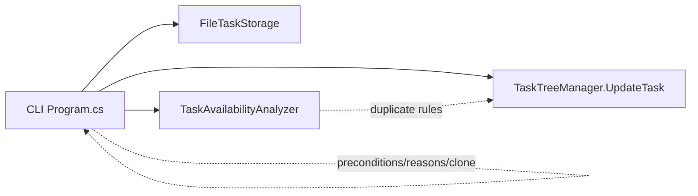
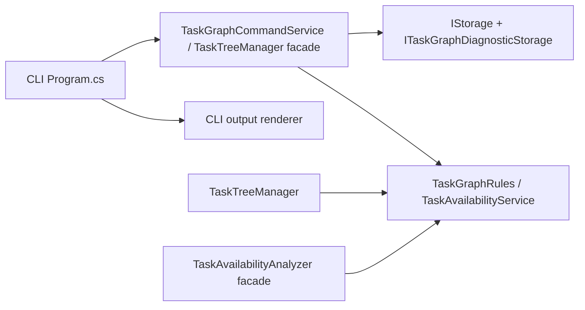

# Укрепление границы CLI и движка задач

## 0. Метаданные
- Тип (профиль): delivery-task / domain-logic-extraction + refactor-architecture
- Владелец: Codex
- Масштаб: medium
- Целевая модель: gpt-5.5
- Целевой релиз / ветка: `feat/agent-task-cli`, follow-up к PR #271
- Ограничения: фаза SPEC; до подтверждения не менять код, инфраструктуру, README или PR; не менять persisted task JSON schema; не менять публичные CLI command names без отдельного решения; не менять UI behavior.
- Связанные ссылки: `specs/2026-06-28-agent-task-cli.md`, `src/Unlimotion.Cli/Program.cs`, `src/Unlimotion.TaskTreeManager/TaskTreeManager.cs`, `src/Unlimotion.TaskTreeManager/TaskAvailabilityAnalyzer.cs`, `src/Unlimotion.FileStorage/FileTaskStorage.cs`, PR #271.

Если секция не применима, это указано явно в соответствующем разделе.

## 1. Overview / Цель
Сделать CLI тонкой оболочкой над общим движком задач: CLI должен разбирать аргументы, вызывать engine-level операции и форматировать результат, но не владеть правилами доступности, валидации write-preconditions, критериев завершения, причин отказа или технического копирования доменных моделей.

Outcome contract:
- Success means: write-команды CLI используют структурированные методы движка и получают `success/denied/reason/changedTasks` без postcondition-эвристик; availability/read/validate используют один источник правил с `TaskTreeManager`; duplicate-id и load-error диагностика собирается одним общим контрактом storage/graph-read; CLI-local бизнес-логика сведена к argument/output glue.
- Итоговый артефакт / output: обновленная архитектурная граница в `Unlimotion.TaskTreeManager` / `Unlimotion.FileStorage`, уменьшенный `src/Unlimotion.Cli/Program.cs`, contract tests и parity-safety tests.
- Stop rules: остановиться и вернуться к пользователю, если понадобится изменить persisted schema, изменить публичный CLI JSON/text contract, изменить UI behavior, удалить существующий public API без совместимого adapter, либо выбрать между несколькими materially different engine API designs без доминирующего варианта.

## 2. Текущее состояние (AS-IS)
- `src/Unlimotion.Cli/Program.cs` уже использует `FileTaskStorage` и вызывает `TaskTreeManager.UpdateTask(...)` для write-команд.
- CLI всё ещё сам:
  - строит `TaskAvailabilityAnalyzer` для read и write diagnostics;
  - решает write-preconditions через `EnsureWritePreconditions(...)`;
  - запрещает изменение criteria у `Completed` задач;
  - создает detached копию `TaskItem` через `CloneForUpdate(...)`;
  - определяет отказ статуса по postcondition `afterTask.Status != requestedStatus`;
  - генерирует эвристические denial reasons через `BuildStatusDeniedReason(...)`;
  - смешивает parsing, orchestration, output DTO и часть доменной политики в одном файле.
- `TaskTreeManager` фактически принимает решение о статусных переходах в приватном `CanTransitionToStatus(...)`, но возвращает только `List<TaskItem>`. Он не говорит вызывающему коду, была ли операция denied и почему.
- `TaskAvailabilityAnalyzer` дублирует часть правил `TaskTreeManager`: contained tasks, direct/inherited blockers, completion criteria, future planned begin, terminal statuses.
- Duplicate-id диагностика есть в двух местах: `FileTaskStorage.ReadDirectoryAsync()` знает file paths, а `TaskAvailabilityAnalyzer.Validate()` считает duplicate ids без file paths.
- `FileTaskStorage` уже является общим storage слоем, но его `ReadDirectoryAsync()` не выражен как общий interface для engine-level validation.

## 3. Проблема
Одна корневая проблема: публичный write/read contract движка недостаточен для CLI, поэтому CLI и analyzer вынуждены держать параллельные решения о правилах графа, безопасности write-команд и причинах отказа.

Это создает риск расхождения: при следующем изменении `TaskTreeManager` CLI может продолжить объяснять, валидировать или запрещать операции по старым правилам.

## 4. Цели дизайна
- Разделение ответственности: CLI = arguments + output; engine = rules + mutation orchestration + structured result; storage = durable load/save + file-mode diagnostics.
- Повторное использование: `TaskTreeManager` и CLI используют общий availability/validation rule source.
- Тестируемость: engine-level операции проверяются без CLI process, CLI integration tests проверяют только command contract.
- Консистентность: причины refusal, changed-task list и validation failures приходят из engine/service layer, а не из CLI эвристик.
- Обратная совместимость: существующие CLI commands, exit codes и JSON envelopes сохраняются; persisted JSON fields не меняются.

## 5. Non-Goals (чего НЕ делаем)
- Не переписываем весь `TaskTreeManager` на новую архитектуру событий.
- Не меняем UI, Avalonia bindings, task card UX или file-mode watcher behavior.
- Не вводим server/API режим для CLI.
- Не добавляем `repair-availability` command в этой итерации.
- Не меняем meaning статусов `NotReady`, `Prepared`, `InProgress`, `Completed`, `Archived`.
- Не удаляем `TaskAvailabilityAnalyzer` как public type, если это сломает существующие tests/consumers; допускается сделать его adapter/facade.

## 6. Предлагаемое решение (TO-BE)
### 6.1 Распределение ответственности
- `Unlimotion.TaskTreeManager`:
  - владеет command-level write operations и возвращает structured result;
  - владеет transition denial reasons;
  - владеет rules для criteria mutation policy;
  - использует общий availability/validation service.
- `TaskAvailabilityAnalyzer`:
  - перестает быть отдельной реализацией правил;
  - становится facade над общим `TaskAvailabilityService` / `TaskGraphRules`.
- `Unlimotion.FileStorage`:
  - продолжает владеть file read/write, duplicate-id file paths, load errors, atomic writes, locks;
  - реализует общий diagnostics/read interface для engine validation.
- `Unlimotion.Cli`:
  - создает storage и engine client;
  - передает команды `SetStatus`, `SetCriterion`;
  - рендерит `TaskOperationResult` / `TaskGraphValidationReport`;
  - не содержит `CanChangeStatus`, `BuildStatusDeniedReason`, `CloneForUpdate`, criteria policy или duplicate-id policy.

### 6.2 Детальный дизайн
#### До


#### После


#### New / changed contracts
- Добавить result types в `Unlimotion.TaskTreeManager`:
  - `TaskOperationResult`
    - `bool Success`
    - `TaskOperationDeniedReason? DeniedReason`
    - `IReadOnlyList<TaskItem> ChangedTasks`
    - `TaskAvailabilityAnalysis? Before`
    - `TaskAvailabilityAnalysis? After`
    - `TaskGraphValidationReport? Validation`
  - `TaskOperationDeniedReason`
    - `TaskOperationDeniedKind Kind`
    - `string Message`
    - `string? TaskId`
    - `DomainTaskStatus? RequestedStatus`
  - `TaskOperationDeniedKind`: `ValidationFailed`, `TaskNotFound`, `CriterionNotFound`, `StatusTransitionDenied`, `CompletedCriteriaImmutable`, `StorageFailed`.
- Добавить command methods:
  - `Task<TaskOperationResult> TrySetStatusAsync(string taskId, DomainTaskStatus requestedStatus, string? author = null)`
  - `Task<TaskOperationResult> TrySetCriterionAsync(string taskId, string criterionId, bool satisfied, string? author = null)`
- `TaskTreeManager.UpdateTask(TaskItem change)` оставить как совместимый низкоуровневый API для существующего UI/runtime. Новый command service может быть:
  - либо методами на `TaskTreeManager`;
  - либо отдельным `TaskGraphCommandService`, который использует `TaskTreeManager` и storage.
  - Выбор по умолчанию: отдельный `TaskGraphCommandService`, чтобы не раздувать `TaskTreeManager` и отделить command contract от legacy update API.
  - `TaskGraphCommandService` не вызывает mutating `UpdateTask(...)` для заведомо denied status transitions: сначала выполняется engine-level preflight через общий rule source, и при отказе возвращается `StatusTransitionDenied` без `Storage.Save`.
- Добавить общий `TaskGraphValidationReport`, который объединяет:
  - storage load errors;
  - duplicate ids with file paths;
  - reference issues;
  - availability mismatches.
- Добавить storage diagnostics interface:
  - `ITaskGraphDiagnosticStorage`
    - `Task<TaskGraphReadResult> ReadGraphAsync()`
  - `FileTaskStorage` реализует interface через текущий `ReadDirectoryAsync()`.
  - CLI write-mode требует diagnostic storage. Если storage не реализует `ITaskGraphDiagnosticStorage`, command service возвращает `StorageFailed`/`ValidationFailed` без записи; fallback на `GetAll()` для write запрещён, потому что он теряет load errors и duplicate-id file paths.
- Extract common availability rules:
  - `TaskAvailabilityService` принимает immutable/snapshot view задач.
  - `TaskAvailabilityAnalyzer` делегирует `Analyze`, `AnalyzeAll`, `Validate` в service.
  - `TaskTreeManager` использует тот же service для `CanTransitionToStatus`, `IsTaskStartable`, `IsTaskCompletable` и command-level preflight. Parity tests обязательны как safety net, но не считаются альтернативой shared rule source.

#### CLI after refactor
- `Program.cs` оставляет:
  - `CliOptions.Parse`;
  - command routing;
  - mapping `TaskOperationResult` -> exit code / JSON envelope / text output;
  - read command rendering.
- Удалить из CLI:
  - `CloneForUpdate`;
  - `CloneCriterion`;
  - `EnsureWritePreconditions`;
  - `BuildStatusDeniedReason`;
  - direct criteria policy для completed tasks;
  - duplicate-id validation composition.

#### Output contract / evidence rules
- Existing CLI JSON error envelope сохраняется:
```json
{
  "success": false,
  "error": {
    "kind": "businessRuleDenied",
    "message": "..."
  }
}
```
- `TaskOperationDeniedKind` маппится на CLI `error.kind`:
  - `ValidationFailed` -> `validationFailed`
  - `TaskNotFound` / `CriterionNotFound` -> `notFound`
  - `StatusTransitionDenied` / `CompletedCriteriaImmutable` -> `businessRuleDenied`
  - `StorageFailed` -> `operationFailed`
- Text output может сохранить текущий формат, но reason должен приходить из engine result.

#### Visual planning artifact
Не применимо: UI layout, visual state и navigation flow не меняются.

#### UI test video evidence
Не применимо: UI automation behavior не меняется.

#### Обработка ошибок
- Engine-level command methods не должны проглатывать exceptions без structured failure. Если `TaskTreeManager.UpdateTask` сохраняет legacy `catch -> false`, новый command service обязан проверить resulting state и вернуть `StorageFailed` / `StatusTransitionDenied` с достаточной диагностикой.
- CLI invalid arguments остаются CLI responsibility и exit code `2`.
- Engine denied/validation/storage failures возвращают exit code `1`.

#### Производительность
- Для CLI file-mode command допустим full graph read перед write, как сейчас.
- Availability service должен строить lookup один раз на snapshot.
- Recalculation внутри `TaskTreeManager` не должен начать читать все task files на каждую affected task без необходимости; если full snapshot внедряется в manager, это отдельный measured step.

## 7. Бизнес-правила / Алгоритмы
- Source of truth для availability:
  - `isCanBeCompleted = all contained tasks complete && no incomplete blocker on task or ancestors`;
  - `canStart = isCanBeCompleted && planned begin is not future && status is not terminal`;
  - `canComplete = isCanBeCompleted && completion criteria satisfied && status is not terminal`;
  - missing references не делают task blocked, но являются validation issue.
- Source of truth для write:
  - status transition rules принадлежат engine, не CLI;
  - denied status transition определяется до mutating `UpdateTask(...)`; denied command не должен изменять task file, `UpdatedDateTime` или status history;
  - criteria у `Completed` задач не меняются через command methods;
  - load errors, duplicate ids и reference issues блокируют write;
  - write-команды в CLI file-mode требуют diagnostic graph-read, чтобы не пропустить load errors и duplicate file paths;
  - availability mismatches диагностируются, но не блокируют write сами по себе, если нет reference/load/duplicate issues;
  - ordinary write commands не делают implicit mass repair.

## 8. Точки интеграции и триггеры
- CLI `set-status` / `complete` -> `TaskGraphCommandService.TrySetStatusAsync`.
- CLI `set-criterion` / `satisfy-criterion` -> `TaskGraphCommandService.TrySetCriterionAsync`.
- CLI `validate` -> `TaskGraphValidationService.ValidateAsync` или `TaskGraphCommandService.ValidateAsync`.
- UI/runtime `UnifiedTaskStorage` может продолжать использовать `TaskTreeManager.UpdateTask` без изменения behavior.
- `TaskAvailabilityAnalyzerTests` становятся parity/contract tests для shared rules, а не тестами отдельной реализации.

## 9. Изменения модели данных / состояния
- Persisted JSON schema: без изменений.
- Новые public/internal result types: только runtime API в `Unlimotion.TaskTreeManager`.
- Existing `TaskItem`, `TaskCompletionCriterion`, `TaskStatusHistoryEntry` не получают новых persisted fields.
- Возможно добавление non-persisted DTO для validation/read result.

## 10. Миграция / Rollout / Rollback
- Rollout:
  1. Добавить result/validation/storage diagnostic contracts.
  2. Перевести analyzer на shared rules с сохранением public surface.
  3. Добавить engine command service и tests.
  4. Упростить CLI write path.
  5. Обновить README только если output examples или internal behavior notes меняются.
- Backward compatibility:
  - Existing CLI commands сохраняются.
  - Existing UI file-mode behavior сохраняется.
  - Existing `TaskTreeManager.UpdateTask` остается доступным.
- Rollback:
  - Откатить command-service commit; CLI вернется к текущей PR #271 реализации.
  - Persisted data migration не требуется.

## 11. Тестирование и критерии приёмки
- Acceptance Criteria:
  - `src/Unlimotion.Cli/Program.cs` больше не содержит `CloneForUpdate`, `CloneCriterion`, `EnsureWritePreconditions`, `BuildStatusDeniedReason`.
  - CLI write-команды вызывают engine command methods и не вызывают `TaskTreeManager.UpdateTask` напрямую.
  - `TaskTreeManager` / command service возвращает structured denial для:
    - blocked `Completed`;
    - blocked `InProgress`;
    - `CompletedCriteriaImmutable`;
    - missing task;
    - missing criterion;
    - validation failure with duplicate ids and file paths.
  - `TaskAvailabilityAnalyzer` и status transition rules используют общий rule source; explicit parity tests обязательны только как regression guard и не засчитываются как замена single source.
  - Duplicate-id validation source для CLI содержит оба file path и не собирается повторно в analyzer без file context.
  - CLI write-mode отказывается выполнять запись при non-diagnostic storage вместо fallback на `GetAll()`.
  - Existing CLI integration tests из PR #271 проходят без ухудшения.
- Characterization / contract tests:
  - `TaskGraphCommandServiceTests`:
    - denied status transition returns `StatusTransitionDenied` without changing file content, `UpdatedDateTime` или status history;
    - completed criteria mutation returns `CompletedCriteriaImmutable`;
    - non-diagnostic storage write attempt returns structured failure without calling `Save`;
    - successful repeating task completion returns changed original + clone + reverse-link affected tasks.
  - `TaskAvailabilityParityTests`:
    - analyzer `CanStart/CanComplete/IsCanBeCompleted` matches engine transition decisions for contained task, direct blocker, inherited blocker, criteria, future planned begin, terminal statuses.
  - `UnlimotionCliIntegrationTests`:
    - assert JSON envelope kind comes from structured engine denial, not CLI fallback text.
- Visual acceptance: Не применимо, UI не меняется.
- UI video evidence: Не применимо, UI не меняется.
- Команды для проверки:
  - `dotnet build src\Unlimotion.Cli\Unlimotion.Cli.csproj -c Release --no-restore`
  - `dotnet test src\Unlimotion.Test\Unlimotion.Test.csproj -c Release -- --treenode-filter "/*/*/TaskGraphCommandServiceTests/*"`
  - `dotnet test src\Unlimotion.Test\Unlimotion.Test.csproj -c Release --no-build -- --treenode-filter "/*/*/TaskAvailabilityParityTests/*"`
  - `dotnet test src\Unlimotion.Test\Unlimotion.Test.csproj -c Release --no-build -- --treenode-filter "/*/*/UnlimotionCliIntegrationTests/*"`
  - `dotnet test src\Unlimotion.Test\Unlimotion.Test.csproj -c Release --no-build -- --treenode-filter "/*/*/TaskAvailabilityAnalyzerTests/*"`
  - `git diff --check`
  - Full gate: `dotnet test src\Unlimotion.Test\Unlimotion.Test.csproj -c Release` если локальная full-suite flakiness не блокирует; при блокере зафиксировать exact failing tests и isolated rerun.
- Stop rules для validation loops:
  - Не запускать параллельно несколько тяжелых `Unlimotion.Test` команд по одному output каталогу.
  - Если targeted TUnit filter выбирает 0 tests, сначала выполнить `--list-tests` или исправить `--treenode-filter`.
  - Если full suite падает на known UI shared-state flakiness, отделить failure от текущего diff через isolated rerun.

## 12. Риски и edge cases
- Risk: попытка сразу переписать `TaskTreeManager` на snapshot service даст большой diff и регрессии.
  - Mitigation: сначала добавить shared rules для command/read decisions и command service с preflight поверх существующего manager, затем постепенно переносить legacy recalculation internals.
- Risk: shared availability service будет pure/in-memory, а manager сейчас async/storage-based.
  - Mitigation: использовать snapshot для command/read validation и mandatory shared rule source для transition decisions; manager recalculation internals покрыть parity tests; полный перевод recalculation оставить только если diff остается небольшим.
- Risk: new result API станет публичным долгом с неудачными names.
  - Mitigation: держать типы в `Unlimotion.TaskTree` с нейтральными именами и minimal fields; не вводить лишние abstractions.
- Risk: duplicate-id semantics изменятся.
  - Mitigation: считать file-mode duplicate diagnostics source of truth; analyzer duplicate ids либо удалить из CLI output, либо оставить только как non-file graph diagnostic.
- Risk: CLI JSON contract случайно изменится.
  - Mitigation: добавить snapshot-like assertions в integration tests на `error.kind` и ключевые поля success output.

## 13. План выполнения
1. Добавить `TaskOperationResult`, `TaskOperationDeniedReason`, `TaskGraphValidationReport` и tests на DTO/output mapping.
2. Добавить `ITaskGraphDiagnosticStorage` и адаптировать `FileTaskStorage.ReadDirectoryAsync()` без изменения file write behavior.
3. Добавить общий `TaskAvailabilityService` / `TaskGraphRules` и перевести `TaskAvailabilityAnalyzer` + status transition preflight на этот source.
4. Добавить `TaskGraphCommandService` поверх existing `TaskTreeManager`: `TrySetStatusAsync` сначала выполняет validation и transition preflight, а mutating `UpdateTask(...)` вызывает только для разрешенных операций.
5. Перенести write-preconditions и completed-criteria policy из CLI в command service.
6. Перевести CLI write commands на command service; удалить CLI-local clone/preconditions/reason helpers.
7. Добавить parity-safety tests между analyzer output и engine transition decisions; если полный перевод manager recalculation internals слишком рискован, зафиксировать его отдельным follow-up, но command/read rules уже должны использовать shared source.
8. Обновить CLI integration tests и добавить engine-level tests.
9. Запустить targeted validations, затем full gate / documented full-suite blocker.

## 14. Открытые вопросы
Нет блокирующих вопросов для SPEC approval.

Решение по умолчанию: использовать отдельный `TaskGraphCommandService`, а `TaskTreeManager.UpdateTask` сохранить как legacy low-level API. Если в ходе EXEC выяснится, что отдельный service создает лишний слой без пользы, допустимо реализовать command methods прямо в `TaskTreeManager`, если acceptance criteria и CLI-thin boundary сохраняются.

## 15. Соответствие профилю
- Профиль: `domain-logic-extraction`.
  - Доменные правила формализованы в секции 7.
  - Матрица триггеров зафиксирована в секции 8.
  - Тесты на правила и граничные случаи заданы в секции 11.
  - Согласованность источников правил обеспечивается shared rules; parity tests являются safety net, а не заменой single source.
- Профиль: `refactor-architecture`.
  - Dependency before/after схема есть в секции 6.2.
  - Public API и migration points перечислены.
  - Rollout/rollback поэтапные.
  - Backward compatibility ограничена.
- Refactoring policy:
  - Structural refactor отделен от функциональных изменений.
  - Safety net начинается с characterization/contract tests.
  - План разбит на малые проверяемые шаги.

## 16. Таблица изменений файлов
| Файл | Изменения | Причина |
| --- | --- | --- |
| `specs/2026-06-29-cli-engine-boundary.md` | Новый SPEC | Зафиксировать follow-up design |
| `src/Unlimotion.TaskTreeManager/TaskOperationResult.cs` | Новый result contract | Убрать CLI postcondition guessing |
| `src/Unlimotion.TaskTreeManager/TaskGraphCommandService.cs` | Новый command orchestration service | Централизовать write policy |
| `src/Unlimotion.TaskTreeManager/TaskGraphValidationReport.cs` | Новый validation report | Единый validation output для CLI/engine |
| `src/Unlimotion.TaskTreeManager/TaskAvailabilityAnalyzer.cs` | Delegate/facade over shared rules | Убрать duplicated rule implementation |
| `src/Unlimotion.TaskTreeManager/TaskTreeManager.cs` | Минимальная интеграция с shared rules/result service | Сохранить existing behavior и дать engine source of truth |
| `src/Unlimotion.FileStorage/FileTaskStorage.cs` | Implement diagnostic graph-read interface | File-mode load/duplicate errors доступны engine |
| `src/Unlimotion.Cli/Program.cs` | Удалить write-policy helpers, перейти на engine result | CLI становится thin wrapper |
| `src/Unlimotion.Test/*` | Добавить command/parity tests, обновить CLI tests | Защитить contracts и отсутствие regressions |
| `src/Unlimotion.Cli/README.md` | Опционально обновить internal behavior notes | Только если изменится документированный contract |

## 17. Таблица соответствий (было -> стало)
| Область | Было | Стало |
| --- | --- | --- |
| Status write | CLI клонирует task, вызывает `UpdateTask`, сравнивает status после операции | CLI вызывает `TrySetStatusAsync`, engine возвращает success/denied/reason |
| Criteria write | CLI сам запрещает completed task criteria | Engine command service возвращает `CompletedCriteriaImmutable` |
| Denial reason | CLI строит generic reason string | Engine возвращает typed reason |
| Write validation | CLI собирает load/duplicate/reference messages | Engine validation report собирает safety issues |
| Availability rules | Analyzer и manager имеют параллельные реализации | Shared rules/facade как обязательный single source плюс parity-safety tests |
| Duplicate ids | Storage + analyzer считают по-разному | File-mode diagnostics source содержит file paths; analyzer не конкурирует |
| CLI responsibility | Arguments + orchestration + часть policy | Arguments + output rendering |

## 18. Альтернативы и компромиссы
- Вариант: оставить PR #271 как есть.
  - Плюсы: уже работает, меньше diff.
  - Минусы: CLI остается зависимым от параллельных правил и эвристик отказа.
  - Почему не выбран: пользователь явно хочет максимальное переиспользование движка.
- Вариант: сразу полностью переписать `TaskTreeManager` вокруг `TaskAvailabilityService`.
  - Плюсы: самый чистый single source.
  - Минусы: высокий риск регрессии и большой diff.
  - Почему не выбран как первый шаг: лучше сначала ввести command result boundary, mandatory shared rule source для command/read decisions и parity-safety tests, затем уменьшать legacy internals.
- Вариант: добавить command methods прямо в `TaskTreeManager`.
  - Плюсы: меньше новых типов.
  - Минусы: `TaskTreeManager` уже большой; смешение legacy update API и CLI command contract.
  - Почему выбран отдельный service по умолчанию: лучше отделяет command orchestration от existing mutation core, сохраняя возможность использовать `TaskTreeManager` внутри.

## 19. Результат quality gate и review
### SPEC Linter Result

| Блок | Пункты | Статус | Комментарий |
|---|---|---|---|
| A. Полнота спеки | 1-5 | PASS | Цель, AS-IS, проблема, цели и Non-Goals зафиксированы. |
| B. Качество дизайна | 6-10 | PASS | Есть распределение ответственности, API, потоки, ошибки, perf и rollout. |
| C. Безопасность изменений | 11-13 | PASS | Persisted schema/UI не меняются; rollback и edge cases описаны. |
| D. Проверяемость | 14-16 | PASS | Acceptance criteria, tests и команды проверки конкретны. |
| E. Готовность к автономной реализации | 17-19 | PASS | План поэтапный; блокирующих вопросов нет; alternatives рассмотрены. |
| F. Соответствие профилю | 20 | PASS | Domain extraction и architecture refactor требования отражены. |

Итог: ГОТОВО

### SPEC Rubric Result

| Критерий | Балл (0/2/5) | Обоснование |
|---|---:|---|
| 1. Ясность цели и границ | 5 | Цель ограничена engine boundary; non-goals защищают UI/schema/CLI public contract. |
| 2. Понимание текущего состояния | 5 | Перечислены конкретные текущие дубли: analyzer rules, preconditions, denial reasons, clone, duplicate ids. |
| 3. Конкретность целевого дизайна | 5 | Названы новые contracts, service boundary, mapping ошибок и changed files. |
| 4. Безопасность (миграция, откат) | 5 | Backward compatibility, rollout и rollback без data migration описаны. |
| 5. Тестируемость | 5 | Есть engine, parity-safety и CLI integration tests с командами. |
| 6. Готовность к автономной реализации | 5 | Блокирующих вопросов нет; default decision по service vs manager задан. |

Итоговый балл: 30 / 30
Зона: готово к автономному выполнению

### Post-SPEC Review
- Статус: PASS
- Scope reviewed: `specs/2026-06-29-cli-engine-boundary.md`, instruction stack (`quest-governance`, `quest-mode`, `testing-baseline`, `testing-dotnet`, `domain-logic-extraction`, `refactor-architecture`, `refactoring-policy`), selected profile, open questions, planned changed files.
- Decision: можно запрашивать подтверждение.
- Review passes:
  - Scope/Evidence pass: просмотрены текущая CLI-спека, `Program.cs`, `TaskTreeManager.cs`, `TaskAvailabilityAnalyzer.cs`, `FileTaskStorage.cs`, текущий branch status.
  - Contract pass: spec сохраняет UI/schema/CLI commands и explicitly выносит policy в engine.
  - Adversarial risk pass: проверены риски большого rewrite, async/storage vs pure snapshot mismatch, duplicate-id semantics и JSON contract drift.
  - Re-review after fixes / Fix and re-review: после review исправлены три finding: parity tests больше не являются альтернативой single source; denied status transition требует preflight до mutating `UpdateTask`; CLI write-mode требует diagnostic storage без fallback на `GetAll()`. Повторно проверены секции 6-8, 11-13, 15, 17-19.
  - Stop decision: PASS; нет `BLOCKER/HIGH`, нет выбора пользователя до EXEC.
- Evidence inspected:
  - `specs/2026-06-28-agent-task-cli.md`
  - `src/Unlimotion.Cli/Program.cs`
  - `src/Unlimotion.TaskTreeManager/TaskTreeManager.cs`
  - `src/Unlimotion.TaskTreeManager/TaskAvailabilityAnalyzer.cs`
  - `src/Unlimotion.FileStorage/FileTaskStorage.cs`
  - `git status -sb`
- Depth checklist:
  - Scope drift / unrelated changes: spec-only изменение; planned code scope ограничен engine/storage/CLI/tests.
  - Acceptance criteria: покрывают удаление CLI helpers, structured denial, duplicate file paths, diagnostic storage requirement и parity-safety поверх shared rule source.
  - Validation evidence: команды конкретны, TUnit filters корректного вида.
  - Unsupported claims: claims основаны на inspected source lines и текущей PR #271 реализации.
  - Regression / edge case: addressed no-write denied status transitions, criteria immutability, duplicate ids, file load errors, non-diagnostic storage, missing references, full-suite flakiness.
  - Comments/docs/changelog: README только optional при contract change; changelog не требуется на SPEC.
  - Hidden contract change: CLI command names и JSON envelope сохраняются.
  - Manual-review challenge: reviewer может спросить, почему не сразу full rewrite `TaskTreeManager`; spec отвечает phased rollout + mandatory shared rule source for command/read decisions + parity-safety tests как risk control.
- No-findings justification: после исправлений spec фиксирует одну корневую проблему, содержит API/output/test/rollback contract и не оставляет блокирующих вопросов.

| Severity | Area | Finding | Required action | Status |
| --- | --- | --- | --- | --- |
| HIGH | design | Acceptance допускал parity tests как альтернативу shared rule source | Сделать shared rule source обязательным, parity оставить только safety net | fixed |
| HIGH | side effects | Command service поверх mutating `UpdateTask` мог сохранять denied transition | Требовать engine-level preflight до `UpdateTask` и no-write denial tests | fixed |
| MEDIUM | validation | Fallback на `IStorage.GetAll()` терял load errors и duplicate file paths | Запретить CLI write fallback без `ITaskGraphDiagnosticStorage` | fixed |

- Fixed before continuing: устранены три review findings; уточнен default choice `TaskGraphCommandService`; добавлены mandatory shared rule source, preflight no-write denied transitions, diagnostic-storage-only write policy, stop rules для TUnit/full-suite.
- Checks rerun: ручная проверка SPEC Linter/Rubric/Post-SPEC Review по owner documents.
- Needs human: требуется только approval для перехода в EXEC.
- Residual risks / follow-ups: полный перевод internal availability recalculation в manager может быть отдельным follow-up, если в EXEC окажется слишком рискованным для одного diff.

### Post-EXEC Review
- Статус: PASS
- Scope reviewed: approved spec `specs/2026-06-29-cli-engine-boundary.md`, `git status --short`, `git diff --stat`, relevant diff and new files for `Program.cs`, `FileTaskStorage.cs`, `TaskAvailabilityAnalyzer.cs`, `TaskAvailabilityService.cs`, `TaskGraphCommandService.cs`, `TaskGraphDiagnostics.cs`, `TaskOperationResult.cs`, `TaskGraphCommandServiceTests.cs`, `TaskAvailabilityParityTests.cs`; validation evidence listed below; docs/changelog impact checked.
- Decision: можно завершать после commit/push; full-suite timeout зафиксирован как validation blocker outside targeted surface with next-best isolated evidence.
- Review passes:
  - Scope/Evidence pass: проверены code diff, new contracts, CLI helper removal, diagnostic storage mapping, tests, status/full-suite state.
  - Contract pass: сверено с Non-Goals: persisted JSON schema, command names и UI behavior не менялись; CLI write path идет через `TaskGraphCommandService`; write validation требует diagnostic storage; denied transitions preflight before `UpdateTask`.
  - Adversarial risk pass: проверены no-write denial, duplicate-id file paths, missing task/criterion, completed criteria immutability, non-diagnostic storage, repeating task changedTasks/reverse links, analyzer facade parity, JSON error mapping.
  - Re-review after fixes / Fix and re-review: после компиляционного fix renderer-name conflict повторно выполнены CLI build и targeted tests; после full-suite timeout выполнены isolated manager/CLI/engine regression suites.
  - Stop decision: PASS with residual full-suite timeout documented; нет BLOCKER/HIGH code findings.
- Evidence inspected:
  - `dotnet build src\Unlimotion.Cli\Unlimotion.Cli.csproj -c Release --no-restore` -> PASS, 0 warnings/errors.
  - `dotnet build src\Unlimotion.Test\Unlimotion.Test.csproj -c Release --no-restore` -> PASS, existing warnings only.
  - `dotnet test src\Unlimotion.Test\Unlimotion.Test.csproj -c Release --no-build -- --treenode-filter "/*/*/TaskGraphCommandServiceTests/*"` -> PASS, 7 tests.
  - `dotnet test src\Unlimotion.Test\Unlimotion.Test.csproj -c Release --no-build -- --treenode-filter "/*/*/TaskAvailabilityParityTests/*"` -> PASS, 1 test.
  - `dotnet test src\Unlimotion.Test\Unlimotion.Test.csproj -c Release --no-build -- --treenode-filter "/*/*/UnlimotionCliIntegrationTests/*"` -> PASS, 8 tests.
  - `dotnet test src\Unlimotion.Test\Unlimotion.Test.csproj -c Release --no-build -- --treenode-filter "/*/*/TaskAvailabilityAnalyzerTests/*"` -> PASS, 4 tests.
  - `dotnet test src\Unlimotion.Test\Unlimotion.Test.csproj -c Release --no-build -- --treenode-filter "/*/*/TaskStatusTransitionTests/*"` -> PASS, 18 tests.
  - `dotnet test src\Unlimotion.Test\Unlimotion.Test.csproj -c Release --no-build -- --treenode-filter "/*/*/TaskAvailabilityCalculationTests/*"` -> PASS, 26 tests.
  - `git diff --check` -> PASS, only CRLF warnings from Git.
  - `rg -n "CloneForUpdate|CloneCriterion|EnsureWritePreconditions|BuildStatusDeniedReason|UpdateTask\(" src\Unlimotion.Cli\Program.cs` -> no matches.
  - Full suite attempts timed out without failed test identity: `dotnet test ... -c Release`, `dotnet test ... --no-build -- --fail-fast --output Detailed`, `dotnet test ... --no-build -- --maximum-parallel-tests 1 --fail-fast --output Detailed`.
- Depth checklist:
  - Scope drift / unrelated changes: changes limited to approved spec, task-tree contracts/service, file storage diagnostic adapter, CLI write path, tests.
  - Acceptance criteria: CLI helper names removed; direct CLI `UpdateTask` removed; structured denials covered; duplicate id file paths covered; diagnostic storage requirement covered; parity tests added.
  - Validation evidence: targeted evidence complete; full suite blocked by repeated no-output timeout after 10 minutes per attempt.
  - Unsupported claims: implementation claims tie to code diff and tests listed above.
  - Regression / edge case: no-write denied transition, criteria immutability, duplicate ids, missing task/criterion, non-diagnostic storage, repeating clone/reverse links, manager availability/status regressions tested.
  - Comments/docs/changelog: no README/changelog update needed because CLI command names and public JSON envelope shape stay stable; no new comments added beyond existing best-effort cleanup comments in tests.
  - Hidden contract change: CLI error kind mapping follows spec; UI/runtime `TaskTreeManager.UpdateTask` behavior intentionally left unchanged.
  - Manual-review challenge: likely question is why legacy manager private transition code still exists; answer: command/read boundary now uses shared rules, full internal manager rewrite deferred to avoid UI behavior drift and because existing direct manager tests rely on legacy direct-call semantics.

| Severity | Area | Finding | Required action | Status |
| --- | --- | --- | --- | --- |
| MEDIUM | validation evidence | Full `Unlimotion.Test` suite repeatedly timed out without failed test identity | Record exact commands, stop orphan processes, run isolated affected suites as next-best evidence | accepted-risk |

- Fixed before final report: renderer name conflict fixed; orphan dotnet/MSBuild processes from timed-out full runs stopped; affected targeted suites rerun.
- Checks rerun: CLI build, `git diff --check`, command service/parity/CLI/analyzer/status/availability targeted tests.
- Validation evidence: listed above.
- Unrelated changes: none observed in `git status --short`.
- Needs human: Нет.
- Residual risks / follow-ups: full suite hang needs separate investigation if required; legacy `TaskTreeManager` internals still contain private rule helpers for existing UI/runtime behavior, while CLI command/read boundary now uses shared rules.

## Approval
Ожидается фраза: "Спеку подтверждаю"

## 20. Журнал действий агента
| Фаза (SPEC/EXEC) | Тип намерения/сценария | Уверенность в решении (0.0-1.0) | Каких данных не хватает | Следующее действие | Нужна ли передача управления/решения человеку | Было ли фактическое обращение к человеку / решение человека | Короткое объяснение выбора | Затронутые артефакты/файлы |
| --- | --- | --- | --- | --- | --- | --- | --- | --- |
| SPEC | Спроектировать follow-up на устранение дублирования CLI/engine | 0.9 | Нет блокирующих данных | Запросить подтверждение спеки | Да | Нет, ожидается approval | Текущая PR #271 уже переиспользует storage/manager, но требует engine result boundary, mandatory shared rules и parity-safety tests для полного reuse | `specs/2026-06-29-cli-engine-boundary.md` |
| SPEC | Исправить spec review findings | 0.95 | Нет | Запросить подтверждение обновленной спеки | Да | Да, пользователь сказал `исправь` после review | Убраны обходные пути: parity не заменяет single source, denied transitions не мутируют storage, CLI write требует diagnostic storage | `specs/2026-06-29-cli-engine-boundary.md` |
| EXEC | Начать реализацию подтвержденной спеки | 0.9 | Нет блокирующих данных; детали API уточняются по текущему коду | Добавить engine contracts, diagnostic storage и shared availability rules | Нет | Да, пользователь сказал `Спеку подтверждаю` | Переход в EXEC разрешен; реализация остается в границах engine/storage/CLI/tests без UI/schema changes | `specs/2026-06-29-cli-engine-boundary.md` |
| EXEC | Реализовать engine/storage/CLI boundary | 0.85 | Нужна тестовая проверка edge cases | Добавить command-service, parity и CLI regression tests | Нет | Нет | Добавлены shared rules, diagnostic storage interface, typed operation result и command service; CLI write path больше не вызывает `TaskTreeManager.UpdateTask` напрямую | `src/Unlimotion.TaskTreeManager/*`, `src/Unlimotion.FileStorage/FileTaskStorage.cs`, `src/Unlimotion.Cli/Program.cs` |
| EXEC | Добавить targeted regression tests | 0.9 | Full suite еще не запущен | Запустить CLI build, diff check и full project gate | Нет | Нет | Новые `TaskGraphCommandServiceTests` и `TaskAvailabilityParityTests` прошли; существующие `UnlimotionCliIntegrationTests` и `TaskAvailabilityAnalyzerTests` тоже прошли | `src/Unlimotion.Test/TaskGraphCommandServiceTests.cs`, `src/Unlimotion.Test/TaskAvailabilityParityTests.cs` |
| EXEC | Завершить validation и post-EXEC review | 0.9 | Full suite зависает без failed test identity | Стадировать, сделать коммит и запушить branch | Нет | Нет | Targeted affected suites и CLI build прошли; full suite timeout задокументирован как residual validation risk с next-best evidence | `specs/2026-06-29-cli-engine-boundary.md`, test/build evidence |
