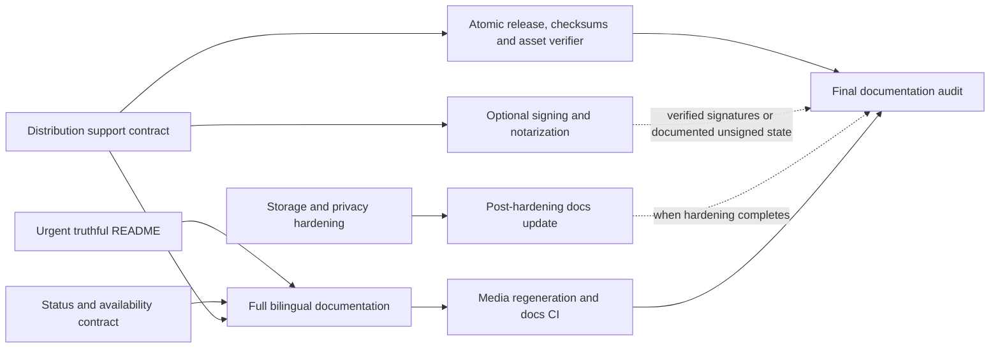

# Программа восстановления достоверности README и пользовательской документации

## 0. Метаданные
- Тип (профиль): delivery-task; `.NET Desktop Client` + `UI Automation Testing`
- Владелец: Kibnet
- Масштаб: large, последовательная программа независимых delivery-пакетов
- Целевое семейство / behavior baseline: GPT-5.6 family optimization baseline
- Поверхность: Work / Codex desktop
- Effective runtime: текущий Codex runtime; точный model ID и reasoning mode не раскрыты поверхностью и не влияют на продуктовый контракт
- Eval baseline / evidence: аудит `README.md` и `README.RU.md` от 2026-07-15, повторно проверенный на чистом checkout тега `1.27.0` (`5aebebcb34eabe35fcdb7a47ff76ffdc2a7e16dd`)
- Целевой релиз / ветка: отдельные короткоживущие ветки и PR для каждого delivery-пакета; конкретные ветки фиксируются в дочерних spec
- Ограничения:
  - текущий документ является roadmap, а не разрешением на монолитную реализацию;
  - каждый delivery-пакет проходит отдельный цикл `SPEC -> Спеку подтверждаю -> EXEC`;
  - до утверждения текущей spec разрешено менять только этот файл;
  - signing/notarization не выполняются без предоставленных владельцем сертификатов, аккаунтов и GitHub secrets;
  - пользовательские обещания о поддержке платформ допустимы только при наличии package install/launch evidence;
  - UI-facing исправления обязательно сопровождаются существующими UI tests и доступным visual evidence либо объективно обоснованным fallback.
- Связанные ссылки:
  - `README.md`
  - `README.RU.md`
  - `specs/2026-06-09-task-status-model.md`
  - `tests/Unlimotion.ReadmeMedia/README.md`
  - `.github/workflows/tests.yml`
  - `.github/workflows/windows-packaging.yml`
  - `.github/workflows/deb_packaging.yml`
  - `.github/workflows/osx-packaging.yml`
  - `.github/workflows/android-packaging.yml`

## 1. Overview / Цель
Восстановить доверие к README и пользовательской документации Unlimotion: каждое пользовательское утверждение должно совпадать с фактическим поведением приложения, проверяемой release-матрицей и текущим UI, а автоматические проверки должны предотвращать повторный drift.

Outcome contract:
- Success means:
  - корневые README являются короткой и точной витриной продукта;
  - подробные пользовательские контракты вынесены в двуязычные документы;
  - status/availability/install/storage claims согласованы с кодом, тестами и workflows;
  - release support определяется проверяемой матрицей, а не наличием asset;
  - медиа воспроизводимы, актуальны и укладываются в согласованный size budget;
  - CI блокирует сломанные локальные ссылки, EN/RU structural drift, orphan media и неподтверждённые release-claims.
- Итоговый артефакт / output:
  - серия независимых утверждённых spec и PR;
  - обновлённые `README.md` / `README.RU.md`;
  - двуязычный `docs/` и contribution guide;
  - согласованный доменный/UI-контракт статусов;
  - проверяемый packaging contract;
  - безопасные storage/credential follow-ups;
  - оптимизированные README media;
  - документационный и release validation CI.
- Stop rules:
  - не начинать EXEC конкретного пакета без утверждённой дочерней spec;
  - не документировать спорное поведение до выбора и закрепления единственного контракта;
  - не заявлять поддержку платформы без install/launch evidence;
  - не заявлять signing/notarization без успешной проверки готового artifact;
  - не мигрировать данные или secrets без rollback и regression coverage;
  - не завершать UI-facing пакет при падающих UI tests или без предусмотренного visual evidence/fallback;
  - не продолжать signing-пакет при отсутствии внешних сертификатов/secrets; сохранить честные caveats и перейти к следующему независимому пакету.

## 2. Текущее состояние (AS-IS, исходный audit baseline)

Этот раздел фиксирует состояние на момент первоначального README/source/workflow audit; текущий прогресс программы отражён в Post-EXEC review и журнале действий.
- `README.md` и `README.RU.md` смешивают продуктовую витрину, подробное руководство, историческую миграцию и устаревший backlog.
- Текст и media старше текущего product surface; synthetic settings screenshot показывает фиктивную версию `1.0.0.0`.
- Release-раздел не содержит явной `/releases/latest` ссылки, не отражает Android и AppImage и содержит некорректную macOS-команду `chmod -R 755`.
- Windows/macOS artifacts не имеют подтверждённого signing/notarization; blanket-обещание простой установки неподтверждено.
- Debian package support не закреплён install/launch smoke-матрицей для актуальных Debian.
- `run.linux.sh` и `run.macos.sh` не имеют shebang и tracked executable bit и зависят от рабочего каталога.
- README status diagram, shared availability service, regression tests, ViewModel picker и прежняя status spec не дают единого ответа о direct terminal -> `InProgress`.
- README смешивает lifecycle status, graph availability и transition guards.
- В README неполно описаны completion criteria, inherited blockers, automatic `InProgress -> Prepared`, Markdown clipboard mode и миграционный fallback-backup.
- Продуктовая модель является multi-parent directed graph, хотя README местами обещает единое дерево.
- Settings surface включает appearance, search, clipboard, updates, local/server storage, Git sync, HTTP/SSH, conflicts и maintenance; README описывает лишь малую часть.
- Desktop default task path зависит от process working directory; Android использует app-data path.
- Server password и Git token сохраняются в JSON settings без platform credential store.
- Встроенный backlog содержит уже реализованные search, file watcher, inherited blocking, Android и server mode; EN/RU версии расходятся.
- `media/readme` занимает около 25 МБ; изображения имеют HiDPI-размер 3840x2052, а два GIF составляют большую часть объёма.
- PR CI не проверяет Markdown structure, paired translations, local links, media budgets, orphan media или release asset contract.

Скрытые зависимости и инварианты:
- корневые README зависят от release assets, workflows, settings XAML/ViewModel, hotkey catalog, status engine и synthetic media scenario;
- изменение status picker является UI-facing изменением и попадает под обязательный UI test gate;
- local/server/Git storage claims затрагивают privacy и secrets, поэтому требуют delivery/security review;
- packaging workflow сейчас может дополнять уже опубликованный release, создавая окно неполного asset set;
- изменения default data path требуют обнаружения legacy data и безопасного rollback.

## 3. Проблема
Публичная документация Unlimotion не имеет единого проверяемого контракта с доменной логикой, UI и release pipeline. Поэтому README регулярно устаревает, иногда рекомендует неверные действия и не позволяет пользователю отличить реализованную возможность от официально поддерживаемой и проверенной.

## 4. Цели дизайна
- Разделить короткую продуктовую витрину, user guide, task model, settings, storage/sync и contributor documentation.
- Определить authoritative source для каждого пользовательского утверждения.
- Развести понятия «artifact опубликован», «платформа проверена» и «платформа официально поддерживается».
- Закрепить один status/availability/guard contract в коде, UI, tests, spec и docs.
- Синхронизировать EN/RU структуру без попытки автоматически оценивать качество перевода.
- Снизить стоимость media regeneration и визуального review.
- Добавить детерминированные проверки drift, не делая transient external network failure блокирующим обычный PR.
- Сохранять backward compatibility данных и пользовательских workflows при product hardening.
- Разбить программу на небольшие auditable PR с отдельными rollback boundaries.

## 5. Non-Goals (чего НЕ делаем)
- Не переписываем приложение или storage architecture целиком ради README.
- Не меняем status semantics без отдельной утверждённой дочерней spec.
- Не выдаём наличие source-проекта iOS/Browser за поддерживаемый release target.
- Не обещаем signing, notarization или platform support до получения evidence.
- Не переносим GitHub backlog обратно в Markdown.
- Не создаём второй канонический CLI guide: authoritative остаётся `src/Unlimotion.Cli/README.md`.
- Не коммитим крупные video artifacts без принятой repository practice; используем CI artifacts или явно помеченный local-only evidence.
- Не делаем full FlaUI regeneration обязательным для каждого PR, пока воспроизводимость и стоимость не доказаны.
- Не объединяем все изменения программы в один PR или одну branch.
- Не публикуем release и не меняем внешние secrets в рамках roadmap без отдельного разрешения и утверждённой delivery spec.

## 6. Предлагаемое решение (TO-BE)

### 6.1 Распределение ответственности
- Корневые `README.md` / `README.RU.md` -> позиционирование, download, основные возможности, быстрый старт, ссылки на глубокую документацию.
- `docs/installation*.md` -> platform/asset/install/update/troubleshooting contract.
- `docs/task-model*.md` -> lifecycle status, graph availability, transition guards, relations, blockers, completion criteria.
- `docs/user-guide*.md` -> tabs, filters, search, roadmap, create/edit/delete, drag-and-drop, hotkeys/F1.
- `docs/settings*.md` -> актуальный settings surface.
- `docs/storage-and-sync*.md` -> local/server/Git modes, paths, conflicts, migration/recovery, privacy caveats.
- `CONTRIBUTING*.md` -> source build, test commands и contribution workflow.
- `src/Unlimotion.Cli/README.md` -> CLI semantics и installation для advanced users.
- `tests/Unlimotion.ReadmeMedia` + `scripts/update-readme-media.ps1` -> воспроизводимый capture contract.
- `scripts/validate-documentation.ps1` -> структурные и локальные docs checks.
- Packaging workflows + canonical asset manifest -> release artifact contract.
- Shared domain/service layer -> status and availability contract.
- ViewModel/UI -> отображение только переходов, разрешённых shared contract.
- Child specs -> границы каждого EXEC-пакета, acceptance и rollback.

### 6.2 Детальный дизайн

Целевая информационная архитектура:

```text
README.md
README.RU.md
CONTRIBUTING.md
CONTRIBUTING.RU.md

docs/
  README.md
  README.RU.md
  installation.md
  installation.RU.md
  task-model.md
  task-model.RU.md
  user-guide.md
  user-guide.RU.md
  settings.md
  settings.RU.md
  storage-and-sync.md
  storage-and-sync.RU.md
```

Целевая структура корневых README:
1. Единственный H1 и language switch.
2. Краткое назначение продукта.
3. Один актуальный hero visual.
4. Download с `/releases/latest` и краткой platform matrix.
5. Ключевые возможности.
6. Быстрый старт.
7. Краткое объяснение status / availability / guards.
8. Data and sync overview.
9. CLI and automation.
10. Build from source.
11. Documentation / Contributing / Community / License.

Delivery dependency map:



Visual planning artifact для UI-facing status-пакета:
- для roadmap `Не применимо`: этот документ не задаёт финальный UI layout и не разрешает UI EXEC;
- дочерняя status spec обязана проверить recorder capability и добавить конкретный annotated screenshot/storyboard status picker для active, terminal, blocked, unarchive и future-date states;
- layout redesign не входит в программу, поэтому wireframe нового экрана не требуется;
- если запись поддержана, обязательны failing/repro video `до` и passing video `после` из автоматизированных UI test runs с командой и artifact path;
- если запись технически недоступна, child spec фиксирует объективную причину, точную test-команду и repo-relative/CI paths next-best screenshots, traces и logs.

Media contract:
- committed root README media: ориентировочно `tab-tour.gif`, `all-tasks.png`, `roadmap.png`, опционально `settings.png` на язык;
- PNG max width 1600-1920 px, рекомендуемый budget 500 KiB;
- GIF max width 1280-1600 px, рекомендуемый budget 3-4 MiB;
- общий `media/readme` budget 8 MiB, окончательное значение утверждается в media child spec после пробной генерации;
- EN/RU имеют одинаковый basename set;
- synthetic Settings не показывает фиктивный stable version;
- generated report содержит width, height, size, SHA-256, language, capture mode и source fingerprint;
- каждое изображение имеет meaningful alt text/caption; GIF имеет статическую альтернативу или соседний screenshot;
- критически важная инструкция не существует только внутри анимации;
- EN/RU assets проверяются в реальном GitHub viewport на отсутствие clipped или нечитаемого текста и на отсутствие secrets/private data.

Docs validation contract:
- paired `<!-- section:key -->` markers в EN/RU;
- одинаковый порядок semantic sections;
- ровно один H1;
- взаимные language links;
- валидные local links и anchors;
- существующие media и отсутствие orphan media;
- media size/dimension budgets;
- canonical release asset names;
- запрет устаревших root README фрагментов;
- versioned assertion inventory `docs/documentation-assertions.yml`: claim id, EN/RU location, authoritative source/test/workflow anchor, verifier и last verified baseline;
- generated semantic audit report `artifacts/documentation-validation/assertion-audit.md`;
- scheduled/manual HTTP check `/releases/latest` с retry и release API/manifest comparison; evidence сохраняется в `artifacts/documentation-validation/release-check.json`;
- transient external failure не блокирует обычный PR, но создаёт отдельный отчёт/failure scheduled job и не может подтвердить AC-01.

EN/RU validator allowlist:
- `README.md` <-> `README.RU.md`;
- `CONTRIBUTING.md` <-> `CONTRIBUTING.RU.md`;
- `docs/README.md` <-> `docs/README.RU.md`;
- `docs/installation.md` <-> `docs/installation.RU.md`;
- `docs/task-model.md` <-> `docs/task-model.RU.md`;
- `docs/user-guide.md` <-> `docs/user-guide.RU.md`;
- `docs/settings.md` <-> `docs/settings.RU.md`;
- `docs/storage-and-sync.md` <-> `docs/storage-and-sync.RU.md`.

Исключения из automatic pairing: `src/Unlimotion.Cli/README.md` остаётся единственным canonical CLI guide и доступен из обеих root/docs локалей; `CODE_OF_CONDUCT.md`, release notes, generated reports и `landing/` проверяются на рабочие ссылки, но не обязаны иметь RU pair в рамках этой программы.

Обработка ошибок:
- неподтверждённый release claim удаляется или маркируется preview, а не принимается на веру;
- отсутствие signing credentials не блокирует правдивую documentation delivery;
- media generator не копирует partial output в committed target;
- migration child specs обязаны сохранять исходные данные до destructive rewrite;
- docs validator сообщает semantic key и конкретный файл/ссылку, а не только общий failure.

Производительность:
- полный FlaUI capture не запускается на каждом PR;
- headless generation и статические validators являются быстрым PR gate;
- package smoke разделяется по платформам и запускается path-filtered либо reusable workflow;
- size budgets уменьшают checkout и README rendering cost.

### 6.3 User-Observable Scenarios

| Scenario | User action / trigger | Expected visible result / output | Evidence required | Covered by AC |
| --- | --- | --- | --- | --- |
| Первое знакомство | Новый пользователь открывает root README | За один экран понимает назначение, аудиторию и ключевое отличие Unlimotion; за один переход находит нужный asset и подробную установку | GitHub render EN/RU + onboarding rubric | AC-16 |
| Загрузка приложения | Пользователь открывает README и выбирает платформу | Видит существующий asset, архитектуру, точные шаги и честные caveats | release manifest, link check, platform smoke | AC-01, AC-02 |
| Запуск terminal-задачи | Пользователь открывает status picker у `Completed`/`Archived` | UI показывает только переходы, разрешённые shared contract; engine принимает те же переходы | domain test + headless UI test + visual evidence | AC-03 |
| Возврат из архива | Пользователь снимает `Archived` с задачи, чей предыдущий статус был `InProgress` | Задача возвращается в `Prepared`, не обходя запрет direct terminal -> `InProgress` | domain + ViewModel + UI regression evidence | AC-17 |
| Будущая дата | Пользователь задаёт future planned begin | Старт запрещён, но graph availability и visual dimming соответствуют утверждённому контракту | availability test + UI test | AC-04 |
| Чтение task model | Пользователь читает status/relations docs | Различает lifecycle, availability и guards; видит multi-parent graph semantics | docs review + source/test anchors | AC-05 |
| Работа с данными | Пользователь выбирает local/server/Git mode | Документация объясняет фактический path, sync, conflicts и privacy caveats | settings/source audit + docs validator | AC-06 |
| Смена default data path | Существующий desktop user обновляет приложение | Legacy data обнаружены, не теряются и могут быть восстановлены | migration tests + rollback evidence | AC-07 |
| Сохранённые secrets | Пользователь настраивает server/Git credentials | Secrets не оказываются в обычном JSON после security migration либо текущий риск явно документирован до миграции | security tests + sanitized config inspection | AC-08 |
| Переключение языка docs | Пользователь переходит EN <-> RU | Одинаковые смысловые разделы и рабочая обратная ссылка | documentation validator | AC-09 |
| Просмотр README media | Пользователь открывает GitHub README | Видит актуальный локализованный UI без фиктивной версии; страница загружается без чрезмерных assets | generated report + visual inspection | AC-10 |
| Публикация релиза | Maintainer запускает release flow | Публичный release появляется только с полным проверенным asset set или текущий workflow честно документирует переходное ограничение | asset verifier, signature/checksum evidence | AC-11 |

### 6.4 State / Interaction Matrix

| Current state | Trigger | Expected transition/result | Empty/error/disabled/concurrent case | Notes |
| --- | --- | --- | --- | --- |
| `NotReady` / `Prepared` / `InProgress` | Выбор разрешённого статуса | Shared engine и picker используют одну transition matrix | Guarded option disabled/hidden с понятным основанием | Полная matrix фиксируется в status child spec |
| `Completed` / `Archived` | Попытка прямого перехода в `InProgress` | Запрещено; сначала `NotReady` или `Prepared` | Engine отклоняет обход UI | Рекомендуемый контракт принят roadmap |
| `Archived`, previous status `InProgress` | Unarchive | Нормализовать восстановление в `Prepared`; direct `InProgress` не допускается | Child spec проверяет остальные previous-status cases и history entry | Не обходить shared engine |
| Active blocker | Пересчёт availability | Зависимая задача недоступна | `Archived` blocker не считается активным | Подтвердить regression tests |
| Future planned begin | Попытка start | `InProgress` запрещён | Graph availability не меняется только из-за даты | Visual dimming не добавляется |
| `InProgress` становится недоступной | Recalculation | Автоматически `Prepared` | Не зациклить повторный update | Сохранить current behavior |
| Multi-parent task | Delete selected occurrence | Удаляется relation либо после confirmation сама задача с descendants | Последняя relation требует destructive confirmation | Точное copy описать в user guide |
| Release без полного asset set | Upload/publication | Не публиковать при draft-first flow; verifier сообщает missing assets | Concurrency keyed by tag; rerun идемпотентен; published assets не заменяются молча | Atomicity не зависит от signing credentials |
| Media generation failure | Capture EN или RU неуспешен | Committed media не обновляются частично | Старый набор остаётся нетронутым | report показывает failing locale |

### 6.5 Decision Ledger

| Decision | Owner | Default / chosen option | Confidence | Risk if assumed | Needs user before EXEC |
| --- | --- | --- | ---: | --- | --- |
| Разбить программу на независимые child specs/PR | user | Да; пользователь попросил зафиксировать и двигаться последовательно | 0.99 | Монолитный diff и невозможный rollback | Нет |
| Direct `Completed/Archived -> InProgress` | user + agent | Запретить; сначала `NotReady`/`Prepared` | 0.90 | Изменение привычного UI flow у части пользователей | Нет; подтверждается approval этой roadmap, детализируется child spec |
| Unarchive после previous `InProgress` | user + agent | Нормализовать в `Prepared`; никогда не обходить terminal transition guard | 0.90 | Меняется прежнее восстановление status history | Нет; закрепить в status child spec и UI copy |
| `Archived` blocker | user + agent | Terminal и неблокирующий | 0.90 | Пользователь мог ожидать только `Completed` как unlock | Нет; закрепить тестами и docs |
| Future date visual semantics | agent | Блокирует start, но сама не меняет graph availability/dimming | 0.95 | README снова смешает независимые оси | Нет |
| Server storage support level | agent | `experimental` до deployment/support evidence | 0.85 | Недооценка фактически стабильного режима | Нет; можно повысить только по evidence |
| CLI support level | agent | `preview/advanced` до стабильного install/release contract | 0.85 | Слишком осторожное позиционирование | Нет |
| Debian support | agent | Debian 12/13 только после install/launch smoke; иначе не заявлять official support | 0.95 | Лишняя CI-стоимость | Нет |
| Unsigned desktop builds | agent | Немедленно документировать; signing выполнять отдельным child package | 0.99 | Часть пользователей откажется от установки | Нет |
| Desktop default data path | user + agent | Менять только empty/default path установленного desktop build; portable/source и explicit absolute/relative paths классифицируются отдельно и не мигрируются молча | 0.90 | Ошибка миграции может скрыть существующие задачи или сломать portable semantics | Нет; отдельная child spec обязательна |
| Credential storage | user + agent | Platform credential store; fallback никогда не является plaintext config: только re-prompt, non-persistent session/env input или отказ сохранения | 0.90 | Platform store может быть недоступен в CI/headless | Нет; provider/fallback design выбирается в child spec |
| Atomic release | agent | Обязателен независимо от нового optional desktop signing, но каждый supported asset обязан пройти уже требуемый platform signing contract; порядок: build -> required signing -> signature verify -> checksum -> draft upload -> final verifier -> publish | 0.95 | Потребуется перестроить существующие post-publish workflows | Нет |
| Future release tag scheme | agent | Новые release tags используют `vMAJOR.MINOR.PATCH`; workflows/verifier читают legacy tags без `v` только для совместимости | 0.90 | Может потребоваться обновить существующие scripts/feeds | Нет; delivery child spec подтверждает compatibility |
| Media budgets | agent | Стартовые budgets из 6.2; финализировать после пробной генерации | 0.75 | Слишком агрессивное сжатие | Нет; visual quality gate обязателен |
| Signing credentials | user | Предоставляются только в отдельном delivery workflow | 1.00 | Без них signing невыполним | Нет для roadmap; `ASK-HUMAN` в signing child spec до EXEC |

### 6.6 Runtime / Config / Data Contract Matrix

| Contract area | Current source of truth | Expected change | Compatibility / migration | Verification |
| --- | --- | --- | --- | --- |
| Release assets | Packaging workflows + published release | Canonical asset manifest и pre-upload verification | Не переименовывать без release notes/migration | artifact inventory + verifier |
| Platform support | README claims | Только smoke-tested matrix | Preview artifacts допустимы с явной маркировкой | install/launch smoke |
| Status transitions | `TaskAvailabilityService` + tests + UI | Один shared contract | Существующие persisted statuses сохраняются | domain + UI tests |
| Settings documentation | `SettingsControl.axaml` + ViewModel | Двухуровневые settings/storage docs | Copy-only, кроме child hardening | source-to-doc review |
| Task data path | Desktop bootstrap + file storage | OS user-data default только для установленного empty/default case | Installed/portable/source; empty/default/explicit absolute/explicit relative; no silent merge | migration matrix tests |
| Credentials | JSON settings | Platform secure storage | One-way secure write -> read-back -> marker -> plaintext scrub; downgrade requires re-auth, not plaintext restore | config/security/redaction tests |
| README media | Synthetic scenario + FlaUI | Headless CI mode + controlled desktop capture | Старые assets удаляются только после link audit | report + visual QA |
| EN/RU pairing | Ручное соглашение | Semantic section markers + validator | Existing links перенаправляются | validation script tests |

## 7. Бизнес-правила / Алгоритмы
1. Наличие release asset не означает официальную поддержку платформы.
2. Официальная поддержка требует install/launch evidence для конкретной platform/version/architecture matrix.
3. README не содержит hardcoded current release version; download ведёт на `/releases/latest`.
4. Пока artifact unsigned/unnotarized, документация обязана это сообщать и не предлагать permission workaround как решение Gatekeeper.
5. Lifecycle status, graph availability и transition guard документируются отдельно.
6. Terminal status не переходит прямо в `InProgress` по выбранному контракту.
7. `Archived` является terminal и не считается активным blocker.
8. Future planned begin запрещает start, но сама по себе не меняет graph availability.
9. Containment является доменной связью с availability side effects и не рекламируется как безусловная замена тегам.
10. EN/RU customer-facing change считается завершённым только при обновлении обеих версий в одном PR.
11. Media обновляются атомарно для обеих локалей.
12. External link failure отделён от детерминированных локальных docs checks.
13. Secrets не выводятся в logs, screenshots, reports или PR evidence.
14. Data migration без backup/rollback и regression tests запрещена.
15. Перед каждой child spec выполняется freshness gate: current `origin/main`, HEAD/tag, latest release/assets, relevant workflows/source и delta к audit baseline.
16. Child branch создаётся от актуального `origin/main`; перед delivery выполняются rebase, full relevant validation и проверка зависимых PR.
17. Новые release tags используют `vMAJOR.MINOR.PATCH`; legacy tags без `v` только читаются для обратной совместимости.
18. SHA-256 manifest обязателен для каждого публичного release asset set.
19. Draft можно удалить; опубликованные assets считаются immutable. Исправление после publication выполняется corrective patch release, а не silent replacement.
20. Signing secrets не доступны PR/fork jobs и используются только через protected GitHub Environment с approval, least privilege, masking, audit и documented rotation/revocation.
21. Third-party GitHub Actions в затронутых delivery workflows pin по commit SHA; write permissions выдаются только нужным jobs.
22. Customer-facing EN/RU pairing ограничен allowlist из 6.2; исключения не расширяются неявно.
23. Android APK входит в supported manifest только после `apksigner verify` валидной release signature ожидаемого production certificate; отсутствие keystore/signature исключает Android из supported release contract и не может завершаться PASS.
24. Release tags после verifier/publish защищены от перемещения или эквивалентно проверяются на immutability относительно tested commit SHA.

## 8. Точки интеграции и триггеры
- Изменение status rules -> shared service, picker, domain tests, UI tests, task-model docs.
- Изменение settings XAML/ViewModel -> settings docs и при необходимости media regeneration.
- Изменение release asset names/workflows -> canonical manifest, installation docs и release verifier.
- Изменение hotkeys -> `HotkeyHints`, UI tests и user-guide shortcut summary.
- Изменение README capture scenario/layout -> media generator, report, README/user-guide references.
- Изменение customer-facing EN page -> соответствующая RU page в том же PR.
- Изменение task storage default -> migration code, rollback, docs и platform tests.
- Изменение credential config -> migration, redaction checks, docs/privacy disclosure.
- Release published/draft-ready -> asset/signature/checksum verifier.

## 9. Изменения модели данных / состояния
- Roadmap сам не меняет persisted model.
- Status child package не добавляет новый status; он выравнивает transition contract.
- Data-path child package может добавить migration marker/report и backup metadata; точная схема определяется дочерней spec.
- Credential child package переносит secret values из обычного JSON в platform store; JSON сохраняет только non-secret configuration и references/flags.
- Canonical release asset manifest становится versioned repository artifact, но не пользовательскими данными.
- Documentation section markers являются authoring metadata и не меняют runtime.

## 10. Миграция / Rollout / Rollback
- Каждый пакет доставляется отдельным PR и может быть откатан независимо.
- Срочный README safety patch не ждёт code hardening и откатывается обычным revert.
- Status package сохраняет persisted status values; rollback возвращает предыдущую transition policy и UI tests.
- Data-path package различает installed, portable и source builds, а также empty/default, explicit absolute и explicit relative paths. Explicit/custom path автоматически не мигрируется. Если legacy и new directories одновременно непусты, silent merge запрещён и требуется явное recovery decision.
- Credential migration является one-way: secure write -> read-back -> migration marker -> scrub plaintext из settings, backups, temp и sync payload. Rollback/downgrade использует secure store или re-auth и никогда не восстанавливает plaintext JSON.
- Media package сначала генерирует artifacts, затем после полного EN/RU success копирует committed targets.
- Atomic release package обязателен и не зависит от добавления нового desktop signing, но сохраняет platform-required signing: Android publish-candidate обязан иметь verified release signature. Assets собираются из одного tag SHA, проходят required platform signing/verification, получают checksum, загружаются в draft по manifest и только затем release публикуется.
- Release concurrency keyed by tag предотвращает параллельные conflicting uploads; rerun должен быть идемпотентным.
- Rollback зависит от состояния: draft можно удалить; опубликованные binaries/feeds/signatures не заменяются и не «откатываются» обычным revert — используется stop/mark affected release и corrective patch release; при компрометации ключа выполняются revoke/rotation и incident response.
- Signing-readiness spec можно подготовить без secrets. Signing EXEC блокируется до protected Environment approval и доступных provider/account credentials; unsigned caveats остаются до verified signature evidence.
- Удаление старых media допускается только после проверки, что на них нет ссылок.

## 11. Тестирование и критерии приёмки

### Acceptance Criteria
- **AC-01:** Root README содержит `/releases/latest` без hardcoded current version; scheduled/manual HTTP + release API check подтверждает URL и соответствие опубликованного asset set canonical manifest.
- **AC-02:** Installation docs различают installer, portable, source build, supported и preview platforms; каждое support-утверждение имеет package evidence.
- **AC-03:** Shared engine, picker, domain tests, UI tests и task-model docs используют одну terminal transition matrix.
- **AC-04:** Planned date, graph blockers, completion criteria и automatic `InProgress -> Prepared` описаны и протестированы как отдельные правила.
- **AC-05:** Task-model docs точно описывают multi-parent graph, inverse relations, inherited blockers, archived semantics и Markdown clipboard modes.
- **AC-06:** Settings/storage docs соответствуют текущему XAML/ViewModel и честно описывают local/server/Git modes, paths, conflicts и privacy.
- **AC-07:** Новый installed-desktop default data path не теряет legacy data; portable/source/custom absolute/custom relative cases сохраняют утверждённую семантику; simultaneous non-empty directories не объединяются молча.
- **AC-08:** После one-way security migration secrets отсутствуют в JSON, backups, temp, logs, crash/diagnostic bundles, CI artifacts и sync payloads; недоступный secure store приводит к re-prompt/non-persistent input/refusal to save, но не к plaintext fallback.
- **AC-09:** Документы из явного EN/RU allowlist имеют одинаковые semantic sections и взаимные language links; исключения проверяются только на links.
- **AC-10:** Committed media актуальны, локализованы, атомарно генерируются, укладываются в budgets и проходят accessibility/readability rubric: alt/caption, static GIF fallback, no critical animation-only information, GitHub viewport review.
- **AC-11:** Atomic release verifier собирает assets из одного tested immutable tag SHA, обнаруживает missing/duplicate/stale assets, требует `SHA256SUMS.txt`, обеспечивает tag concurrency/idempotency и запрещает silent replacement published artifacts. Android требует verified production release signature; optional desktop signature assertions включаются после настройки соответствующего contract. Затронутые third-party Actions pinned по commit SHA, permissions минимальны на уровне jobs, а release tag защищён от перемещения.
- **AC-12:** Root README не содержит backlog, `chmod -R 755`, Fork promotion, `main.zip` как stable source и историческую migration detail.
- **AC-13:** Docs CI блокирует broken local links/anchors, missing/orphan media, EN/RU structural drift и budget violations.
- **AC-14:** Все behavior/UI child packages проходят explicit `dotnet build`, targeted tests, full domain suite, full headless UI suite и релевантный FlaUI/media suite либо объективно обоснованное освобождение с next-best evidence; UI failures блокируют completion.
- **AC-15:** Versioned `docs/documentation-assertions.yml` и generated audit report сопоставляют каждое root README assertion с authoritative production source, tests, workflows и release manifest; финальный audit подтверждает все entries.
- **AC-16:** Новый пользователь по GitHub render обеих локалей понимает назначение, аудиторию и ключевое отличие Unlimotion и за один переход находит asset и подробную установку.
- **AC-17:** Unarchive никогда не обходит terminal guard; previous `InProgress` нормализуется в `Prepared`, а остальные previous-status cases определены и протестированы child spec.
- **AC-18:** Перед каждой child spec выполнен freshness gate; branch/base/dependency/tag state зафиксирован относительно актуального `origin/main`, а не audit tag/detached HEAD.

### Acceptance-to-Test Matrix

| Acceptance criterion | Automated test | Manual / visual / log check | Evidence artifact | If not tested, why |
| --- | --- | --- | --- | --- |
| AC-01 | scheduled/manual HTTP check with retry + release API/manifest comparison | Inspect resolved release and asset inventory | `artifacts/documentation-validation/release-check.json` | Network result does not block ordinary PR but is required to confirm AC-01 |
| AC-09, AC-12, AC-13 | `scripts/validate-documentation.ps1` + script unit/fixture tests | GitHub Markdown render | CI log | — |
| AC-02 | canonical manifest validator + Debian 12/13 x64 clean-image install/launch, Windows/macOS/Android platform smoke | Install notes review | workflow logs with OS, architecture and artifact SHA-256 | Native platform runners/containers are required |
| AC-03, AC-17 | `TaskTreeManagerSafetyTests`, transition/unarchive tests, targeted headless and relevant FlaUI UI tests | Annotated picker storyboard; failing/repro `до` and passing `после` video or documented fallback | test results + child-spec-declared artifact paths | Video fallback only if recorder capability audit proves unsupported |
| AC-04 | availability/transition/domain/UI tests | Review task states | test logs | — |
| AC-05 | domain relation/clipboard tests + docs validator | Source-to-doc review | `docs/documentation-assertions.yml` + generated audit | Semantic prose cannot be fully linted |
| AC-06, AC-15 | settings contract checks + assertion inventory validator | XAML/ViewModel-to-doc audit | `docs/documentation-assertions.yml`, `artifacts/documentation-validation/assertion-audit.md` | Semantic accuracy still requires manual review |
| AC-07 | migration tests for clean/legacy/rollback/platform paths | Temporary-directory inspection | test artifacts | — |
| AC-08 | credential migration, redaction, backup/temp/diagnostic/sync-payload tests | Sanitized config/log/artifact inspection; unavailable-store cases | security review record | OS stores require platform runners |
| AC-10 | generator tests + report/budget/alt-text validator | EN/RU GitHub viewport and static-fallback inspection | `report.json`, screenshots, optional video | Pixel hash is not blocking until determinism proven |
| AC-11 | atomic release asset/checksum/tag-SHA/Android-signature verifier + `actionlint` + repository policy check для `uses:`/`permissions`/tag immutability | Draft and published-state rollback inspection | verifier log, `SHA256SUMS.txt`, Android certificate evidence, workflow policy report, release audit | Optional desktop signature checks conditional on configured contract; Android release signature and checksums are not conditional for supported assets |
| AC-14 | Explicit builds + repo-proven full TUnit/MTP Headless/FlaUI commands | Failure screenshots/traces/video | CI logs and UI artifacts | Child spec may exempt FlaUI only with objective reason and next-best evidence |
| AC-16 | Docs validator for navigation links | GitHub render onboarding rubric for EN/RU | review record | Product clarity requires human UX judgment |
| AC-18 | Freshness/branch/tag/dependency checklist | Compare child baseline with current `origin/main` and release state | child spec metadata + command log | — |

Repo-proven validation ladder для behavior-пакетов:

```powershell
dotnet restore src/Unlimotion.Test/Unlimotion.Test.csproj
dotnet restore tests/Unlimotion.UiTests.Headless/Unlimotion.UiTests.Headless.csproj
dotnet restore tests/Unlimotion.UiTests.FlaUI/Unlimotion.UiTests.FlaUI.csproj

dotnet build src/Unlimotion.Test/Unlimotion.Test.csproj -c Debug --no-restore -p:UseSharedCompilation=false
dotnet build tests/Unlimotion.UiTests.Headless/Unlimotion.UiTests.Headless.csproj -c Debug --no-restore -p:UseSharedCompilation=false

# Targeted: точные tree node filters определяются child spec.
dotnet test src/Unlimotion.Test/Unlimotion.Test.csproj -c Debug --no-restore -p:UseSharedCompilation=false -- --treenode-filter "<target>" --maximum-parallel-tests 1 --output Detailed
dotnet test tests/Unlimotion.UiTests.Headless/Unlimotion.UiTests.Headless.csproj -c Debug --no-restore -p:UseSharedCompilation=false -- --treenode-filter "<target>" --maximum-parallel-tests 1 --output Detailed

# Full suites before completing behavior/UI EXEC.
dotnet test src/Unlimotion.Test/Unlimotion.Test.csproj -c Debug --no-restore -p:UseSharedCompilation=false -- --maximum-parallel-tests 1 --output Detailed
dotnet test tests/Unlimotion.UiTests.Headless/Unlimotion.UiTests.Headless.csproj -c Debug --no-restore -p:UseSharedCompilation=false -- --maximum-parallel-tests 1 --output Detailed

# UI/media child packages also use the repo-proven visible suite.
dotnet build tests/Unlimotion.UiTests.FlaUI/Unlimotion.UiTests.FlaUI.csproj -c Debug -p:UseSharedCompilation=false
dotnet test tests/Unlimotion.UiTests.FlaUI/Unlimotion.UiTests.FlaUI.csproj -c Debug --no-build -- --maximum-parallel-tests 1 --output Detailed
```

Media validation:

```powershell
scripts/update-readme-media.ps1
```

Stop rules для validation:
- targeted failure исправляется до full run;
- full suite failure классифицируется evidence-first и не списывается на flake без isolated rerun;
- media не копируются при partial locale failure;
- external URL transient failure не блокирует deterministic PR checks;
- missing signing credentials переводят signing child spec в `ASK-HUMAN`, а не в ложный PASS.

## 12. Риски и edge cases
- Scope может превратиться в монолит: предотвращается child specs и отдельными PR.
- README может ждать долгого signing: срочный truthful docs patch доставляется первым.
- Статусный контракт может изменить привычный flow: добавляются regression/UI tests и явная release note.
- Debian smoke может выявить неподдерживаемую матрицу: docs маркируют artifact как preview до исправления.
- Secure credential store различается по платформам: child spec обязана определить fallback и headless/CI behavior.
- Data-path migration может создать дубликаты или скрыть legacy tasks: нужны idempotency и rollback tests.
- EN/RU structural parity не гарантирует качественный перевод: остаётся manual language review.
- Media compression может ухудшить читаемость: size budget не принимается без visual QA.
- Hash-based media diff может быть нестабилен: не становится blocking до proof of determinism.
- Draft-first release затрагивает существующую доставку: отдельный rollback и dry-run обязательны.
- External action/link checks могут быть flaky: сетевые проверки отделены от deterministic gate.

### Expected User Review Objections

| Likely objection | Why likely | Mitigation in spec/code plan | Status |
| --- | --- | --- | --- |
| «README опять разрастётся» | Предыдущий README смешивал все руководства | Root ограничен витриной; детали вынесены в `docs/` | mitigated |
| «Не хочу ждать signing ради документации» | Signing требует внешних credentials | Urgent truthful README идёт первым и не зависит от signing | mitigated |
| «Слишком много spec/PR» | Программа затрагивает разные risk boundaries | Child specs позволяют последовательное движение и независимый rollback | mitigated |
| «Почему меняется поведение статусов?» | Сейчас UI/engine/spec расходятся | Выбран engine-safe контракт, добавляются UI tests и release note | mitigated |
| «Автоматический перевод всё равно разойдётся» | Semantic parity нельзя полностью линтовать | CI проверяет структуру, contribution gate требует human review обеих локалей | mitigated |
| «Media budgets ухудшат качество» | Исходные assets очень велики | Budget финализируется только после пробной генерации и visual QA | mitigated |
| «Storage/security — не README-задача» | Аудит выявил продуктовые причины ложных обещаний | Эти работы вынесены в независимые follow-up packages и не блокируют docs | mitigated |

### Rework Prevention Checklist
- [x] Spec называет пользовательские сценарии и outputs.
- [x] Каждый значимый scenario связан с evidence и AC.
- [x] Принятые решения перечислены в Decision Ledger.
- [x] Вероятные возражения спрогнозированы и закрыты планом.
- [x] Применимые review roles перечислены в quality gate.
- [x] Acceptance criteria описывают проверяемый результат, а не подготовительные шаги.
- [x] Для каждого child EXEC предусмотрен путь доказательства результата.
- [x] UI-facing пакет требует visual planning artifact, UI tests и video/fallback evidence.

## 13. План выполнения

### Этап 0. Roadmap и последовательный governance
1. Утвердить текущую roadmap фразой `Спеку подтверждаю`.
2. Для каждого следующего этапа создать дочернюю spec из canonical template.
3. Перед каждой child spec выполнить freshness gate: `git fetch`, актуальные `origin/main`/HEAD/tag, latest release/assets, relevant workflows/source и delta к audit baseline.
4. Каждая child spec фиксирует branch name, актуальный `origin/main` как base, dependent PR, rebase/full-validation gate и rollback.
5. Не создавать implementation branch от detached audit tag.
6. Не начинать зависимый EXEC, пока prerequisite package не прошёл post-EXEC review.
7. Независимый этап может быть помечен `approved-deferred` только явным решением пользователя с причиной и влиянием на program completion; агент не пропускает этап молча.

### Этап 1. Срочная достоверность install-раздела
- Child spec: `specs/2026-07-17-readme-install-safety.md`.
- Удалить опасные/ложные инструкции.
- Добавить `/releases/latest`, актуальный asset overview и caveats.
- Удалить встроенный backlog и hardcoded release expectations.
- Проверить EN/RU parity, links и GitHub rendering.

### Этап 2. Контракт статусов и доступности
- Child spec: `specs/2026-07-17-status-availability-contract.md`.
- Сначала добавить/уточнить regression и UI tests.
- Выровнять shared engine, ViewModel picker, unarchive и old status spec.
- Закрепить lifecycle/availability/guard separation.
- Получить visual evidence и полный test pass.

### Этап 3. Проверяемая distribution support matrix
- Child spec: `specs/2026-07-18-distribution-support-contract.md`.
- Blocking prerequisite child spec: `specs/2026-07-19-headless-appautomation-storage-lifecycle.md`; отдельный PR/merge до возобновления Stage-3 delivery.
- Blocking dependency-security prerequisite после native diagnostics: `specs/2026-07-21-reactiveui-signature-chain-remediation.md`; сначала требуется исправить текущий `NEEDS-FIX` и получить independent re-review PASS, затем отдельные approval/PR/merge и полный reset Stage-3 evidence.
- Исправить run scripts.
- Добавить canonical asset manifest и package validators.
- Закрепить LF для canonical distribution JSON и проверять равенство worktree/Git-blob SHA на каждой OS; exact-byte identity не должна зависеть от checkout line endings.
- В manifest/validators явно разделить raw release tag и normalized SemVer: current workflows смешивают эти значения в filenames, поэтому future `vMAJOR.MINOR.PATCH` tag обязан пройти naming dry-run до публикации.
- Добавить Debian 12/13 x64 clean-image install/launch smoke именно для publish-candidate `.deb`; evidence включает OS version, architecture и artifact SHA-256.
- Проверить `dpkg` metadata, dependency resolution/ICU и запуск через Xvfb либо специальный non-GUI smoke mode; AppImage проверять отдельно.
- Добавить Windows, macOS и Android artifact/metadata/signature-readiness checks.
- Ввести build-only/dry-run режим без публикации.

### Этап 4. Атомарный release без зависимости от signing
- Child spec: `specs/YYYY-MM-DD-atomic-release-contract.md`.
- Перевести pipeline на один tested tag SHA и новую схему `vMAJOR.MINOR.PATCH`, сохранив read compatibility с legacy tags без `v`.
- Выполнять порядок build -> platform-required signing -> signature verification -> checksum -> draft upload -> final verifier -> publish. Android APK требует production release signature; новый desktop signing остаётся отдельным stage 9 до появления credentials.
- Создать draft, собрать/загрузить полный manifest, сформировать обязательный `SHA256SUMS.txt`, проверить assets и только затем публиковать.
- Добавить concurrency keyed by tag, идемпотентный rerun и запрет silent replacement опубликованных assets.
- Зафиксировать state-specific rollback для draft, published release, updater feeds и compromised key.
- Pin затронутые third-party Actions по commit SHA и выдать `contents: write` только upload/publish jobs.
- Добавить `actionlint`, repository policy check для immutable `uses:`/job-scoped `permissions` и защиту/проверку immutability release tag.

### Этап 5. Desktop data path
- Child spec: `specs/YYYY-MM-DD-desktop-data-path.md`.
- Исправить подтверждённый first-run defect: default `Path.GetDirectoryName("Settings.json").CombineWith("Tasks")` разрешается как `/Tasks` в Unix-подобных системах или как путь в корне текущего диска в Windows (например, `C:\Tasks`), а не как рабочий каталог; Stage-3 configured smoke намеренно не считается доказательством этого сценария.
- Спроектировать OS-specific path, legacy discovery, migration, idempotency и rollback отдельно для installed/portable/source и empty/default/explicit paths.
- Explicit/custom path не мигрировать автоматически; при одновременно непустых legacy/new directories запретить silent merge.
- Добавить regression tests и platform behavior docs.

### Этап 6. Secure credential storage
- Child spec: `specs/YYYY-MM-DD-secure-credential-storage.md`.
- Выбрать platform stores; fallback допускает re-prompt, non-persistent session/env input или отказ сохранения, но не plaintext config.
- Выполнить one-way secure write/read-back/marker/plaintext scrub.
- Проверить settings, backups, temp, logs, crash/diagnostic bundles, CI artifacts и sync payloads; downgrade использует secure store или re-auth.
- Обновить privacy documentation.

### Этап 7. Полная двуязычная документация
- Child spec: `specs/YYYY-MM-DD-readme-user-docs-refresh.md`.
- Создать `docs/` и `CONTRIBUTING*`.
- Сократить root README до product landing.
- Перенести task model, user guide, settings, storage/sync и migration details.
- Создать `docs/documentation-assertions.yml` и generated audit report.
- Выполнить assertion-by-assertion source/test/workflow review и GitHub onboarding render review.
- Этот этап не ждёт data-path/credential hardening: он документирует проверенное AS-IS и обновляется trigger-PR после завершения hardening.

### Этап 8. Media и documentation CI
- Child spec: `specs/YYYY-MM-DD-readme-media-doc-ci.md`.
- Сократить capture set, нормализовать размер и оптимизировать assets.
- Добавить headless capture mode и atomic EN/RU output.
- Добавить documentation validator, allowlist, assertion inventory checks, media/accessibility budgets и CI.
- Выполнить визуальную проверку GitHub rendering и static fallback для GIF.

### Этап 9. Signing и notarization
- Signing-readiness child spec создаётся до получения secrets; только signing EXEC блокируется credentials.
- Внешние зависимости: Windows signing provider и timestamp service; Apple Developer Team, Developer ID Application/Installer certificates, notarization credentials и protected Environment approvals.
- Использовать protected GitHub Environment, запрет secrets в PR/fork runs, least privilege и manual approval.
- Предпочитать OIDC/HSM/remote signing; при временном import сертификатов использовать ephemeral runner storage, guaranteed cleanup, masking и audit.
- Определить rotation/revocation и incident response.
- Windows signing, macOS signing/notarization/stapling подтверждаются platform verification commands.
- Если credentials отсутствуют, этап остаётся `approved-deferred` только после явного решения пользователя, а docs сохраняют unsigned caveats.

### Этап 10. Финальный аудит
- Повторить первоначальную построчную проверку обеих README.
- Сверить docs с current code, tests, UI, settings, packaging и release assets.
- Выполнить полный relevant test/validation suite.
- Провести post-EXEC review каждого пакета и программы в целом.
- Финальный audit принимает либо verified signing evidence, либо явно approved unsigned residual state; последнее не закрывает signing package как выполненный.

Уровни завершения программы:
- **Core documentation/release reliability complete:** завершены stages 1-4, 7-8 и stage 10; stages 5-6/9 либо завершены, либо имеют явный `approved-deferred` residual с честной AS-IS документацией. Этот статус не утверждает выполнение AC-07/AC-08 или desktop signing.
- **Full roadmap complete:** выполнены AC-01..AC-18, включая stages 5-6 и, если signing остаётся целевым изменением, stage 9; residual hardening/signing отсутствует.
- Stage 10 всегда публикует оба статуса отдельно и не превращает approved residual в PASS соответствующего AC.

### Stage ownership and exit matrix

| Stage / child spec | Owned AC | Prerequisites | Required exit evidence | Allowed deferral |
| --- | --- | --- | --- | --- |
| 1. README install safety | AC-01, AC-12, часть AC-16/18 | Roadmap approval + freshness gate | docs diff, local link check, EN/RU render, release check report | Нет |
| 2. Status/availability | AC-03, AC-04, AC-17, AC-14/18 | Stage 1 не обязателен для code, но должен быть доставлен первым по sequence | domain/headless/FlaUI evidence, storyboard/video or fallback, full tests | Нет |
| 3. Distribution support | AC-02, AC-14/18 | Fresh release/workflow baseline + merged `headless-appautomation-storage-lifecycle` prerequisite + separately approved/merged `reactiveui-signature-chain-remediation` prerequisite before final reset | platform smoke logs with OS/arch/artifact SHA | Нет |
| 4. Atomic release | AC-11, AC-18 | Stage 3 canonical manifest | draft verifier, SHA manifest, Android release certificate, action/tag/permission policy report, idempotency/concurrency and rollback evidence | Нет |
| 5. Desktop data path | AC-07, AC-14/18 | Independent child spec | migration matrix, rollback and platform tests | Только явный `approved-deferred`; блокирует hardening completion, не docs truth |
| 6. Credential storage | AC-08, AC-14/18 | Independent child spec | secure-store migration/redaction/security evidence | Только явный `approved-deferred`; блокирует hardening completion, не docs truth |
| 7. Full documentation | AC-05, AC-06, AC-09, AC-15, AC-16, AC-18 | Stages 1-4; stages 5-6 могут быть честно описаны AS-IS | assertion inventory/report, GitHub render and bilingual review | Нет |
| 8. Media/docs CI | AC-10, AC-13, AC-14/18 | Stage 7 final IA/copy | generator report, accessibility/viewport review, CI fixtures | Нет |
| 9. Signing/notarization | Signature subset AC-11, AC-18 | Stage 4 + protected credentials | signature/notarization/stapling logs, secret lifecycle audit | Да, только user-approved; unsigned caveats обязательны |
| 10. Final audit | Audits AC-01..AC-18 without converting residuals to PASS | Stages 1-4 and 7-8; stages 5-6/9 completed or explicitly `approved-deferred` | final assertion audit, full validation, per-package post-EXEC reviews, separate core/full completion statuses | Нет для audit; AC-07/AC-08/signing остаются unmet until their stages complete |

## 14. Открытые вопросы
Для утверждения roadmap блокирующих вопросов нет: пользователь попросил зафиксировать предложенный план и двигаться последовательно.

Вопросы, которые дочерние spec обязаны закрыть до своего EXEC:
- точная terminal transition table и UX presentation disabled/hidden options;
- окончательный Debian support matrix;
- stable/experimental naming server и CLI;
- automatic против explicit data migration policy;
- конкретные platform credential providers и fallback;
- availability signing certificates/secrets;
- финальный media size budget после пробного capture.

## 15. Соответствие профилю
- Профиль: `.NET Desktop Client`.
  - UI flow изменяется только через ViewModel/shared contract.
  - UI thread и automation selectors сохраняются.
  - Каждый UI behavior package получает headless/UI coverage.
  - Перед завершением behavior package выполняются build и full tests.
- Overlay: `UI Automation Testing`.
  - Для status picker bugfix сначала добавляется regression UI test.
  - Используются существующие AppAutomation Headless/FlaUI/Avalonia.Headless patterns.
  - Visual planning artifact обязателен в child spec.
  - До/после video evidence используется при технической поддержке harness; fallback документируется.
  - Падающие UI tests блокируют завершение.
- Context: `testing-dotnet`.
  - Targeted runs используют TUnit/MTP `--treenode-filter`, не VSTest `--filter`.
  - Перед завершением behavior changes запускаются full project suites.
- Delivery/security review применяется к packaging, signing, data path и credentials.

## 16. Таблица изменений файлов

Текущая SPEC-фаза:

| Файл | Изменения | Причина |
| --- | --- | --- |
| `specs/2026-07-17-readme-reliability-roadmap.md` | Новый master roadmap | Зафиксировать последовательную программу и governance boundaries |

Планируемые области последующих child EXEC:

| Файл / область | Изменения | Причина |
| --- | --- | --- |
| `README.md`, `README.RU.md` | Короткая достоверная product landing | Устранить drift и опасные claims |
| `docs/*`, `CONTRIBUTING*` | Двухуровневая пользовательская документация | Вынести подробности из root README |
| `TaskAvailabilityService`, `TaskTreeManager`, domain/ViewModel | Единый status/availability contract | Устранить engine/UI/spec conflict |
| Domain и UI test projects | Regression и scenario coverage | Зафиксировать behavior |
| `run.*` | Надёжный source-start contract | Исправить CWD/shebang/mode проблемы |
| Packaging workflows и scripts | Smoke/signature/asset validation | Подтвердить platform support |
| Desktop storage bootstrap | OS user-data migration | Устранить CWD-dependent default |
| Settings/credential services | Secure secret persistence | Убрать secrets из обычного JSON |
| `tests/Unlimotion.ReadmeMedia/*` | Headless/desktop capture и report | Воспроизводимые media |
| `media/readme/*` | Сокращённый оптимизированный набор | Актуальность и размер |
| `scripts/validate-documentation.ps1` | Docs pair/link/media validation | Предотвратить drift |
| `.github/workflows/*` | Docs/package/release gates | Блокировать недостоверную поставку |

## 17. Таблица соответствий (было -> стало)

| Область | Было | Стало |
| --- | --- | --- |
| Root README | Длинный user guide + backlog | Короткая product landing + ссылки |
| Download | Неявная Releases-ссылка и неполные платформы | `/releases/latest` + проверяемая matrix |
| Platform support | По наличию artifact | По install/launch evidence |
| macOS guidance | `chmod -R 755` | Честный unsigned caveat или verified notarization |
| Status model | Разные правила в README/service/UI/spec | Один shared tested contract |
| Availability | Смешана со status/date | Три явно разделённые оси |
| Hierarchy | «Одно дерево» | Multi-parent directed graph projection |
| Settings | Два пункта | Актуальный settings + storage guide |
| Data path | Process CWD | OS user-data path с migration/rollback |
| Credentials | Secrets в JSON | Platform store или явно утверждённый safe fallback |
| Backlog | Устаревшие Markdown checkboxes | GitHub Issues/Projects |
| Media | 25 МБ, HiDPI, фиктивная версия | Малый актуальный воспроизводимый набор |
| EN/RU | Ручной structural drift | Semantic markers + CI + human translation review |
| Release | Assets догружаются после publication | Draft-first verified set при реализации delivery epic |

## 18. Альтернативы и компромиссы
- Вариант: исправить только текст README.
  - Плюсы: быстро и дёшево.
  - Минусы: engine/UI/spec conflicts, packaging и storage причины drift останутся; документация снова устареет.
- Вариант: один большой PR со всеми изменениями.
  - Плюсы: одна точка review.
  - Минусы: огромный риск, external credential blockers, тяжёлый rollback, смешение docs/domain/security/delivery.
- Вариант: генерировать весь README из кода.
  - Плюсы: часть структурного drift исчезает.
  - Минусы: плохо подходит для product copy и перевода; увеличивает tooling complexity.
- Выбранный вариант: последовательная программа child specs/PR с ранним truthful docs patch и последующим hardening.
  - Почему лучше: минимизирует период опасной документации, сохраняет независимые rollback boundaries и позволяет не блокировать docs внешними сертификатами.

## 19. Результат quality gate и review

### SPEC Linter Result

| Блок | Пункты | Статус | Комментарий |
|---|---|---|---|
| A. Полнота спеки | 1-5 | PASS | Цель, AS-IS, корневая проблема, design goals и границы зафиксированы |
| B. Качество дизайна | 6-10 | PASS | Ответственность, contracts, integrations, state и rollout разделены по child packages |
| C. Безопасность изменений | 11-13 | PASS | Data/secrets/signing риски имеют отдельные child specs, rollback и stop rules |
| D. Проверяемость | 14-16 | PASS | AC связаны с automated/manual evidence; UI и full-suite gates указаны |
| E. Готовность к автономной реализации | 17-19 | PASS | Последовательность и package boundaries определены; external blockers локализованы |
| F. Соответствие профилю | 20 | PASS | .NET desktop, testing-dotnet, UI automation и delivery/security требования отражены |

Итог: ГОТОВО

### SPEC Rubric Result

| Критерий | Балл (0/2/5) | Обоснование |
|---|---:|---|
| 1. Ясность цели и границ | 5 | Один outcome — достоверная проверяемая документация; child package boundaries явные |
| 2. Понимание текущего состояния | 5 | Зафиксированы конкретные README/code/UI/workflow/media/storage contradictions |
| 3. Конкретность целевого дизайна | 5 | Определены IA, contracts, validators, media и delivery model |
| 4. Безопасность (миграция, откат) | 5 | Рискованные data/secret/signing изменения изолированы и требуют rollback/evidence |
| 5. Тестируемость | 5 | Есть AC-to-test matrix, UI gate, package smoke и full-suite commands |
| 6. Готовность к автономной реализации | 5 | Roadmap готова; каждый EXEC всё равно ограничивается отдельной approved child spec |

Итоговый балл: 30 / 30
Зона: готово к автономному выполнению поэтапно через дочерние spec

### Role-Based Review Result

| Role | Applicability | Review question | Verdict | Required spec changes |
| --- | --- | --- | --- | --- |
| Business analyst / domain workflow | applicable | Едино ли трактуются statuses, blockers, unarchive и completion levels? | PASS | Exact transition matrix остаётся обязательным output status child spec |
| UX / designer | applicable | Root README, newcomer navigation, media accessibility и visual evidence ориентированы на пользователя? | PASS | Финальный media budget подтвердить пробной генерацией в child spec |
| Tester / validation | applicable | Каждый из 18 AC имеет test/check/evidence и stop rule? | PASS | Точные treenode filters и UI artifact paths определить в child specs |
| Developer / architect | applicable | Contracts, dependency model, installed/portable paths и one-way credential migration когерентны? | PASS | Provider-specific design остаётся отдельным child specs |
| Delivery / operations / security | applicable | Atomic publication, Android signing, checksums, secrets, permissions и rollback управляемы? | PASS | Desktop signing EXEC переходит в ASK-HUMAN без protected credentials |

### Post-SPEC Review
- Статус: PASS
- Scope reviewed: `specs/2026-07-17-readme-reliability-roadmap.md`; central routing, model baseline, QUEST governance/mode, testing baseline, testing-dotnet, .NET desktop, UI automation, local UI-testing override; open questions и planned change areas
- Decision: можно запрашивать подтверждение roadmap; реализация каждого пакета потребует отдельной child spec и approval
- Review passes:
  - Scope/Evidence pass: roadmap сверена с audit evidence, текущим clean tag `1.27.0`, relevant workflows/test commands/media harness и тремя независимыми reviewer passes.
  - Contract pass: Non-Goals запрещают монолитный EXEC; status, distribution, atomic release, data path, credentials, docs/media и signing имеют собственные child-spec boundaries и exit evidence.
  - Adversarial risk pass: проверены unarchive bypass, hardening/docs dependency, external credentials, Android signature, Debian overclaim, partial/published release rollback, portable/custom paths, secret leakage, translation drift, media accessibility/nondeterminism и scope explosion.
  - Role-Based pass: применены Business analyst, UX, Tester, Developer/architect и Delivery/security; все BLOCKER/HIGH/MEDIUM findings исправлены в spec.
  - Re-review after fixes / Fix and re-review: выполнены два fix/re-review цикла; после первого устранены основные contract/evidence gaps, после второго — completion levels, Android signing, Action pinning/permissions и review traceability.
  - Stop decision: PASS — roadmap достаточно конкретна для последовательного создания child specs, но сама не разрешает изменения вне `specs/`.
- Evidence inspected:
  - предыдущий построчный аудит README;
  - `git status`, HEAD и exact tag;
  - current README/media/settings/status/release findings;
  - `.github/workflows/tests.yml` repo-proven commands;
  - `scripts/update-readme-media.ps1` и существующий FlaUI build/test path;
  - `tests/Unlimotion.ReadmeMedia/README.md`;
  - Windows/Debian/macOS/Android packaging workflow contracts;
  - central QUEST/testing/review/GitHub delivery owner documents;
  - independent domain/architecture, UX/test и delivery/security review findings и повторные verdicts.
- Depth checklist:
  - Scope drift / unrelated changes: текущий change set ограничен одной roadmap spec.
  - Acceptance criteria: 18 AC покрывают docs, behavior, delivery, storage, security, media, freshness и final audit.
  - User-observable scenarios / Decision ledger / Expected objections: заполнены и связаны с AC/evidence.
  - Validation evidence: для каждого package указан automated/manual contract, artifact path/type и stage exit matrix; точные test nodes остаются child-spec responsibility.
  - Unsupported claims: support/signing запрещено заявлять без evidence; `/releases/latest` проверяется scheduled HTTP/API job.
  - Regression / edge case: terminal transitions/unarchive, installed/portable/custom paths, one-way secret migration, Android signing, partial/published release и media atomicity покрыты.
  - Comments/docs/changelog: child specs обязаны оценивать release notes/changelog; root roadmap не меняет product docs.
  - Hidden contract change: status, data path, credentials, tag scheme, release atomicity и signing вынесены в отдельные approval gates.
  - Manual-review challenge: наиболее вероятные скрытые проблемы — попытка считать core completion полным hardening PASS или считать atomic release независимым от обязательной Android signature; оба случая явно запрещены.
- No-findings justification: после двух fix/re-review циклов все обнаруженные BLOCKER/HIGH/MEDIUM findings имеют проверяемое исправление; оставшиеся пункты являются child-specific design/evidence либо честно маркированными residual risks.

| Severity | Area | Finding | Required action | Status |
| --- | --- | --- | --- | --- |
| HIGH | status | Unarchive мог обходить запрет terminal -> `InProgress` | Нормализовать previous `InProgress` в `Prepared`, добавить scenario/AC/tests | fixed |
| HIGH | dependency | Storage/security hardening ошибочно блокировал full docs | Удалить prerequisite; docs фиксируют AS-IS и обновляются trigger-PR | fixed |
| HIGH | delivery | Atomic release был объединён с optional desktop signing | Выделить обязательный credential-independent atomic stage и условный signing stage | fixed |
| HIGH | storage | Installed/portable/source/custom path semantics были не определены | Добавить migration matrix и запрет silent merge/custom auto-migration | fixed |
| HIGH | governance | Completion и review trace не соответствовали stage/AC модели | Ввести core/full completion, stage ownership и обновить full review evidence | fixed |
| MEDIUM | security | Credential fallback/rollback мог допустить plaintext | One-way secure migration; fallback только re-prompt/non-persistent/refusal | fixed |
| MEDIUM | docs | EN/RU scope и semantic audit не были аудируемыми | Явный allowlist, assertion inventory и generated report | fixed |
| MEDIUM | freshness | Долгая программа могла унаследовать stale audit facts | Freshness/base/rebase/dependency gate перед каждой child spec | fixed |
| MEDIUM | UX/test | Не хватало newcomer, accessibility, live release, build/FlaUI и video-path contracts | Добавить scenarios/AC/evidence/commands и child recorder audit | fixed |
| MEDIUM | delivery | Android signing и supply-chain policy не входили в atomic acceptance | Required Android release signature, SHA checksums, Action pinning, least privilege и tag immutability | fixed |
| LOW | media | Предложенный size budget ещё не подтверждён quality sample | Финализировать после пробного capture и visual QA | follow-up |

- Fixed before continuing:
  - зафиксирован запрет монолитного EXEC;
  - unarchive contract закрывает terminal bypass;
  - atomic release отделён от optional desktop signing, но сохраняет Android required signing;
  - data path и credentials разделены и получили безопасные migration contracts;
  - full documentation отделена от hardening prerequisites;
  - добавлены core/full completion statuses и stage-to-AC ownership;
  - добавлены assertion inventory, newcomer/accessibility и live release evidence;
  - добавлены explicit build/FlaUI и supply-chain policy gates;
  - media budget помечен как предварительный.
- Checks rerun:
  - ручная сверка template completeness;
  - SPEC linter A-F;
  - SPEC rubric;
  - Pre-Approval Rework Prevention Gate;
  - role-based and adversarial re-review после каждого fix cycle;
  - `git diff --check` и structural section/AC/decision checks.
- Needs human: только формальное approval roadmap фразой `Спеку подтверждаю`; child-specific decisions уточняются в соответствующих spec.
- Residual risks / follow-ups:
  - optional desktop signing невозможен без protected credentials;
  - core completion может быть достигнут при user-approved deferred hardening/signing, но full roadmap completion — нет;
  - semantic translation quality остаётся human-reviewed;
  - media budgets требуют пробного capture;
  - Debian support matrix требует native/package smoke evidence.

### Post-EXEC Review
- Статус: `NEEDS-FIX`; stages 1-2 и Headless prerequisite PR #279 доставлены, draft Stage-3 PR #280 открыт. Commit `4fb574c4` подтвердил readelf fix: run `29831446698` дал contract/Windows/macOS/Android build PASS и expected Linux `NU3012`. API23/API36 одинаково остановились до boot, потому что установленный emulator directory не был в PATH. Exact executable guard + per-job `$GITHUB_PATH` export прошли RED/GREEN и полный local contract. AndroidPkg/CodeQL PASS; Tests подтвердил Unit `830/830` и Headless `36/36`. NuGet prerequisite после нового architecture review снова `NEEDS-FIX`; final reset/native/merge и stages 4-10 pending
- Scope reviewed: выполненные packages stages 1-2, Stage-3 implementation в исходном allowlist, source-bound LF/blob parity, post-rebase local gates/full Unit/Headless regression и baseline/final-head Desktop MSBuild graphs; production publishers Stage 4 не мигрировали
- Decision: stages 1-2 завершены. Stage 3 продолжает только approved harness/evidence/README truthfulness work; `Program.cs` first-run fix передан Stage 5. Readelf replacement CI выявил только следующий emulator PATH defect; его узкий fix нужно независимо проверить, commit/push и повторить Distribution/Tests, но final acceptance всё равно сбросить после dependency-security prerequisite. В `rxs1` сначала закрыть все current review findings и получить повторные Role-Based/Post-SPEC PASS; затем отдельное точное approval, spec commit/implementation PR/merge и PR #280 rebase/full reset. Stage 4 закрыт до Stage-3 merge
- Review passes:
  - Scope/Evidence pass: stage 1 PASS; docs-only diff и local/live evidence соответствуют child spec.
  - Contract pass: stage 1 PASS; release, support, signing, updater и source-build claims сужены до проверяемого AS-IS.
  - Adversarial risk pass: stage 1 PASS; проверены drift latest release, unsupported-platform overclaim, `v`-tag edge case, mobile overflow и unrelated changes.
  - Role-Based pass: stage 1 PASS после release, tester/diff, copy/UX и delivery reviews.
  - Re-review after fixes / Fix and re-review: stage 1 PASS; copy findings исправлены и полный gate повторён.
  - Desktop build-isolation amendment Post-SPEC: architecture/compatibility, QA/test и governance/delivery = PASS; approval закрыт, implementation выполнена в exact allowlist.
  - Android emulator PATH remediation: independent correctness/security review PASS; reviewer rerun Android contract PASS за 53.1 s, permissions/secrets unchanged.
  - Final-gate audit: fail-closed exits/restores, immutable source range, TUnit report cardinality, exact archive outputs, shell LF/modes и success/failure receipt исправлены в child validation contract; execution на final candidate pending.
  - Stop decision: Stage-2 delivery и исходные Stage-3/LF/build-isolation approval gates закрыты; build-isolation implementation выполнена. NuGet prerequisite возвращён в `NEEDS-FIX` до повторных reviews; approval gate ещё не открыт. Только после его review/approval/merge разрешены clean final-candidate reset и final native gate. API-23 stop rule остаётся условным.
- Evidence inspected: historical matrices сохраняют diagnostic trace. Run `29831446698` на `4fb574c4` подтвердил scope/contract, Windows, macOS x64/arm64 и Android dual-APK build PASS; Linux expected `NU3012`. API23/API36 оба завершились `Required command not found: emulator` до boot. Fix проверяет exact `${ANDROID_SDK_ROOT}/emulator/emulator` и экспортирует parent через `$GITHUB_PATH` внутри install step каждого job; static RED 2.7 s, усиленный per-job Android regression 55.5 s и `All` 182/106.9 s PASS; independent rerun/review PASS за 53.1 s. AndroidPkg `29831446610` и CodeQL `29831446836` PASS; Tests `29831446596` подтвердил Unit `830/830` и Headless `36/36`. Replacement CI и full exact-SHA reset pending
- Depth checklist: stage ownership, exit criteria, dependency/ancestry boundaries, source-bound exact bytes, API/schema compatibility, UI applicability, teardown ownership, rollback и residual routing проверены локально; Stage-3 native evidence/delivery и stages 4-10 не объявлены выполненными
- Review outcome: stages 1-2 PASS после fixes; Stage-3 build-isolation, CRLF fixture, macOS trap-safe probe и Android exact-version feed findings закрыты локально и independently reviewed PASS. `S3-AC-20` остаётся открыт на prerequisite/reset/full/native/delivery evidence; Stage-3 final PASS не выставлен до полного reset gate, native matrix, final independent review и merge

| Severity | Area | Finding | Required action | Status |
| --- | --- | --- | --- | --- |
| LOW | stage 1 / future tag | Raw `v`-prefixed tag и normalized filename version могут разойтись в будущем | Закрыть canonical manifest/dry-run contract в stage 3 | follow-up stage 3 |
| LOW | stage 1 / mobile IA | Трёхколоночная таблица на 390 px требует локального horizontal scroll | Пересмотреть root README IA в stage 7 | follow-up stage 7 |
| MEDIUM | stage 2 / lifecycle | Прямой `UnifiedTaskStorage.Dispose()` не атомарно блокирует уже начавшийся confirmation producer | Вынести в отдельную production-storage-lifecycle child spec; не расширять утверждённый Stage-2 scope | follow-up |
| LOW | stage 2 / server | Existing server transport не даёт cross-client compare-and-swap | Сохранять честный `OutcomeUnknown`; проектировать server-authoritative wire command отдельно | follow-up |
| LOW | stage 2 / UI infra | Fake Headless drawing backend не является pixel oracle; real-Skia capture нестабилен | Семантика остаётся в Headless, реальные screenshot/tooltip evidence — во FlaUI; harden capture отдельно | follow-up |
| MEDIUM | stage 3 / transport tests | Mixed attempts, exact 16 IDs, stale directory и receipt/runtime sidecar mutation были проверены только вручную | Исполнять embedded workflow Python в permanent positive/negative fixtures | fixed; targeted PASS |
| MEDIUM | stage 3 / entrypoints | `run.linux.sh` и `run.macos.sh` оставались `100644` в index при требовании `100755` | Применить `git add --chmod=+x` и проверить staged mode | fixed; staged `100755` PASS |
| MEDIUM | stage 3 / governance | Master/child Post-EXEC журналы утверждали, что approval и EXEC отсутствуют | Зафиксировать approved EXEC-in-progress и не заявлять native/final PASS | fixed; targeted PASS |
| HIGH | stage 3 / identity | Canonical JSON получал CRLF в Windows checkout, из-за чего worktree SHA расходился с LF Git blob/native producers | Реализовать утверждённую `.gitattributes` LF amendment и worktree-vs-blob regression | fixed; local PASS |
| HIGH | stage 3 / source binding | Effective attributes могли принять staged-only policy при report, привязанном к старому `HEAD` | Проверять `--source=HEAD` и effective attrs; staged-only temp-repo fixture обязана падать | fixed; local PASS |
| MEDIUM | stage 3 / workflow regression | Static checks не доказывали step-local SHA mappings, actual builder roots/order и fail-closed aggregate outcome | Закрепить exact named-step wiring и permanent negative fixtures | fixed; 47 workflow negatives PASS |
| MEDIUM | stage 3 / byte mutation | LF fixture проверяла size mismatch, но не отдельную raw SHA branch | Использовать same-length valid-JSON mutation и ожидать SHA mismatch | fixed; local PASS |
| BLOCKER | stage 3 / Headless prerequisite | AppAutomation host удалял temp root до dispose storage/watcher; full suite падал после успешных тестов | Отдельно approve/merge `headless-appautomation-storage-lifecycle`, затем rebase/rerun Stage 3 | fixed; merged PR #279, Stage-3 `36/36` twice |
| BLOCKER | stage 3 / Desktop build isolation | Три sibling Desktop проекта делили `obj/project.assets.json`; Debian Debug не имел diagnostics reference, main/Debian делили `TargetPath`, а clean result зависел от restore order | Изолировать intermediate/solution outputs, сохранить direct publisher paths, добавить regression и полностью rerun local gate | fixed in `12d0bba9`; focused/static/affected build PASS, reset pending |
| LOW | test infra / RavenDB | Один прежний full Unit live test попал в stale auto-index window; exact targeted run PASS | Не смешивать со Stage 3; потребовать новый full green и отдельный follow-up consistency fix | follow-up; previous `49469536` full `830/830` PASS, final-candidate rerun pending |
| MEDIUM | stage 3 / contract fixture portability | Run `29821815902` остановился до native jobs: mutation helper искал LF-only workflow fragment в CRLF checkout | Нормализовать fixture text до LF и добавить forced-CRLF regression | fixed in `ab9a4862`; следующий contract job PASS |
| HIGH | stage 3 / macOS expected-failure probes | После configured smoke ожидаемый non-zero `pkgutil --check-signature` активировал `ERR` trap до unsigned classification | Использовать conditional status capture; закрепить exact strict-mode/ERR-handler lifecycle и adversarial fixtures | fixed; exact-head x64/arm64 PASS in `29824937816` |
| HIGH | stage 3 / Android local feed | Сначала builder удалял tracked Nodify; после первого isolated-feed fix run `29822419518` показал missing exact upstream `2.0.323` при custom `2.0.324-android.7` | Cache = ровно два SHA-bound LibGit packages; final feed = эти два + verified HEAD Nodify; no-extra closure, pinned SHA, оба `project.assets.json` и clean source | fixed; run `29824937816` passed feed/version closure and reached hash proof |
| HIGH | stage 3 / Android NuGet hash domains | Exact-head run `29824937816` доказал, что verifier ошибочно сравнивал NuGet logical `contentHash` с raw SHA-512 signed nupkg | Bind feed/installed bytes and raw sidecar separately; compare canonical assets/metadata logical hashes; add positive raw A != logical B and negative byte/sidecar/logical/source fixtures | fixed in `75e0f9b4`; TDD RED, Android PASS 63.8/54.2 s, `All` 182 PASS 134.2 s, review PASS |
| MEDIUM | stage 3 / Android fixture cross-runtime paths | Distribution `29827483394` записал MSYS `/d/...` в Windows fixture, тогда как native Python verifier канонизировал argv как `C:\...` и отклонил root/source mismatch | Получать feed/packages fixture paths через тот же `bash` + `python3 pathlib.resolve()` runtime и отклонять пустой/многострочный результат | fixed in `066ca4f9`; run `29829779408` contract PASS/native matrix launched |
| MEDIUM | stage 3 / Android artifact readelf portability | Run `29829779408` собрал оба APK, но GNU `readelf` отклонил LLVM-only `--dyn-symbols`; API cells skipped | Использовать общий GNU/LLVM `--dyn-syms`, закрепить exact-two-call regression и запрет старого alias | fixed in `4fb574c4`; RED/GREEN/review PASS, run `29831446698` подтвердил dual-APK validation и перешёл к emulator jobs |
| MEDIUM | stage 3 / Android emulator command PATH | Run `29831446698` подтвердил readelf fix и built both APKs, но API23/API36 не нашли `emulator` после успешного sdkmanager install | Проверить exact executable, экспортировать `${ANDROID_SDK_ROOT}/emulator` в `$GITHUB_PATH` обоих jobs и закрепить missing-export regression | fixed in working tree; RED 2.7 s, per-job Android 55.5 s, `All` 182/106.9 s и independent review/rerun 53.1 s PASS; run pending |
| HIGH | stage 3 -> stage 5 / first-run data path и README | Source analysis подтверждает default `/Tasks` или корень текущего Windows-диска (например, `C:\Tasks`); root README ошибочно обещал working directory. macOS validation остановилась на первом portable launch до Setup/`pkgutil`, а Windows elevated runner скрыл defect | Stage 3 seed explicit storage, заменить README overclaim на явный `--config`/writable-path workaround и disclose unconfigured first-run=false; product fix/migration/tests передать Stage 5 child spec | harness и README fix в working tree; product follow-up Stage 5 |
| BLOCKER | stage 3 / dependency security | Fresh Linux restore отклоняет revoked ReactiveUI/Splat chain до smoke; existing packaging flags disable verification | Исправить receipt/publication findings, получить повторные independent PASS, затем exact approval/spec commit/implementation PR/merge и только после merge rebase/full Stage-3 reset | draft untracked; `NEEDS-FIX`, re-review pending; approval не запрошен |

- Fixed before final report: stage-1 copy/scope findings исправлены; Stage-2 re-review исправил public setter/API/numeric compatibility, default-interface fallback, blocker-reason priority, authoritative stale-history unarchive/precondition, honest failure copy, real tooltip/evidence, row-scoped selection, deterministic confirmation, recorder FPS, runtime localization и README opacity overclaim; program-level final report ещё не наступил
- Checks rerun: run `29831446698` подтвердил readelf fix и native Windows/macOS/Android build; emulator PATH regression дал expected RED 2.7 s, после exact guard/export Android 76.1 s и `All` 182/111.2 s PASS, затем усиленный per-job contract — Android 55.5 s и `All` 182/106.9 s PASS; independent review/rerun 53.1 s PASS. Replacement Distribution pending. Любой tracked commit сбрасывает прежний full Unit/Headless/native evidence; final exact-SHA reset ещё не выполнен
- Validation evidence: stage 1 — PASS/merged; Stage 2 — PASS/merged; Headless prerequisite — PASS/merged PR #279; Stage 3 — runs `29794200613`, `29821815902`, `29822419518`, `29824937816`, `29827483394`, `29829779408`, `29831446698`. Latest companions: AndroidPkg `29831446610` и CodeQL `29831446836` PASS; Tests `29831446596` подтвердил Unit `830/830` и Headless `36/36`. Emulator PATH fix local GREEN; replacement run pending. `S3-AC-20` ждёт NuGet prerequisite, clean-archive/full-test/native evidence; final aggregate/review/merge pending; stages 4-10 pending
- Unrelated changes: в stages 1-2 и prerequisite PR #279 не обнаружены; ignored evidence не входит в commits; Stage-3 branch rebased на `origin/main@e11cae9a`; build-isolation commit меняет ровно три утверждённых файла, production publishers/runtime/UI/data и Stage-4 publication migration не затронуты
- Needs human: сейчас approval не запрашивается. Сначала untracked draft `specs/2026-07-21-reactiveui-signature-chain-remediation.md` в `rxs1` должна закрыть текущие HIGH findings и повторно получить Role-Based/Post-SPEC PASS; только затем потребуется отдельное точное `Спеку подтверждаю`. Прежние approvals не распространяются. API-23 conditional gate не сработал. Stage-5 data-path child spec потребует approval позже
- Residual risks / follow-ups: first-run root path (Stage 5), RavenDB stale-index, production-storage lifecycle, server CAS, Headless pixel capture, NuGet trust prerequisite, native image/tool drift и stages 4-10

## Approval
Master roadmap подтверждена пользователем 2026-07-17 точной фразой `Спеку подтверждаю`. Stage 1 child spec и Stage-2 child spec отдельно подтверждены 2026-07-17. Исходная Stage-3 child spec подтверждена 2026-07-19; её LF amendment и Headless prerequisite child spec отдельно подтверждены одним явным сообщением 2026-07-20. Stage-3 Desktop build-isolation amendment отдельно подтверждена 2026-07-21. Approvals stages 4+ остаются обязательными.

## 20. Журнал действий агента

| Фаза (SPEC/EXEC) | Тип намерения/сценария | Уверенность в решении (0.0-1.0) | Каких данных не хватает | Следующее действие | Нужна ли передача управления/решения человеку | Было ли фактическое обращение к человеку / решение человека | Короткое объяснение выбора | Затронутые артефакты/файлы |
| --- | --- | ---: | --- | --- | --- | --- | --- | --- |
| SPEC | Зафиксировать согласованный master plan | 0.98 | Нет | Провести quality gates и запросить approval | Да | Пользователь попросил зафиксировать план | Roadmap нужна как auditable source of sequence and scope | `specs/2026-07-17-readme-reliability-roadmap.md` |
| SPEC | Разделить программу на child packages | 0.97 | Child-specific evidence уточняется перед каждым EXEC | Создавать child specs последовательно после approval roadmap | Да для каждого child approval | Ещё не обращались по child specs | Разные risk domains нельзя безопасно смешивать в одном PR | `specs/2026-07-17-readme-reliability-roadmap.md` |
| SPEC | Выполнить первичный multi-role post-SPEC review | 0.92 | Обнаружены contract/evidence gaps | Исправить HIGH/MEDIUM findings | Нет | Независимые reviewers вернули NEEDS-FIX | Unarchive, dependencies, atomic release, storage/security, UX/test и delivery evidence требовали уточнения | `specs/2026-07-17-readme-reliability-roadmap.md` |
| SPEC | Исправить findings и выполнить повторный review | 0.96 | Остались completion/Android/policy trace gaps | Внести второй fix set и повторить checks | Нет | Повторные reviewers вернули точечные NEEDS-FIX | Уточнены core/full completion, Android signature и supply-chain gates | `specs/2026-07-17-readme-reliability-roadmap.md` |
| SPEC | Завершить финальный multi-role re-review | 0.99 | Только формальное approval | Запросить `Спеку подтверждаю` | Да | Domain/architecture, UX/testing и delivery/security reviewers вернули PASS | Linter/rubric/review готовы; EXEC вне child spec запрещён | `specs/2026-07-17-readme-reliability-roadmap.md` |
| EXEC | Принять approval roadmap | 1.00 | Нет | Выполнить stage 0 freshness gate | Нет | Пользователь дословно сообщил `Спеку подтверждаю` и попросил выполнить все этапы | Разрешён EXEC roadmap, но каждый delivery package сохраняет отдельный child SPEC gate | `specs/2026-07-17-readme-reliability-roadmap.md` |
| EXEC | Выполнить freshness gate перед stage 1 | 1.00 | Нет | Создать child spec install safety | Нет | Не применимо | `origin/main` и HEAD совпадают с `5aebebc`; latest release остаётся `1.27.0` с Windows/Linux/macOS/Android assets | `specs/2026-07-17-readme-reliability-roadmap.md` |
| EXEC | Принять approval stage-1 child spec | 1.00 | Нет | Выполнить README install-safety package | Нет | Пользователь отдельно сообщил `Спеку подтверждаю` | Child post-SPEC reviews PASS; stage-1 EXEC разрешён | `specs/2026-07-17-readme-install-safety.md`, `specs/2026-07-17-readme-reliability-roadmap.md` |
| EXEC | Создать stage-1 branch от свежего base | 1.00 | Нет | Обновить и проверить два README | Нет | Не применимо | `docs/readme-install-safety` создана от актуального `origin/main`, не от detached tag | `README.md`, `README.RU.md`, `specs/2026-07-17-readme-install-safety.md`, `specs/2026-07-17-readme-reliability-roadmap.md` |
| EXEC | Пройти локальный stage-1 validation gate | 1.00 | Actual GitHub viewport после push | Создать commit/draft PR | Нет | Не применимо | Full release contract 22/22, parity 20/20, protected sections, exact allowlist, links и GFM API прошли; independent diff/copy/release reviews PASS | `README.md`, `README.RU.md`, `specs/2026-07-17-readme-install-safety.md`, `artifacts/documentation-validation/*` |
| EXEC | Доставить и проверить stage 1 | 1.00 | Нет | Закрыть child Post-EXEC gate | Нет | Не применимо | Исходные commits `458cef7`/`760f353`, push и draft PR #274 выполнены; actual GitHub EN/RU desktop/mobile render PASS; после lifecycle rebase equivalents = `b658411`/`f9416bb` | `README.md`, `README.RU.md`, обе spec, `artifacts/documentation-validation/github-viewport-check.json`, GitHub PR #274 |
| EXEC | Подготовить и подтвердить Stage-2 child spec | 1.00 | Dependency PR #274 ещё не merged | Не начинать EXEC до закрытия dependency | Нет | Пользователь отдельно сообщил `Спеку подтверждаю` 2026-07-17 | Status contract подготовлен в `fix/status-availability-contract`; approval не отменяет sequencing gate | `specs/2026-07-17-status-availability-contract.md` в Stage-2 branch |
| EXEC | Закрыть lifecycle prerequisite | 1.00 | Нет | Rebase и повторно проверить PR #274 | Нет | Lifecycle child spec отдельно approved | PR #275 merged как `118c2dc`; local 606/606, Headless 31/31 и PR #275 GitHub checks PASS | `specs/2026-07-17-test-fixture-lifecycle.md`, GitHub PR #275 |
| EXEC | Повторить Stage-1 gate после rebase | 1.00 | Actual branch render/GitHub checks после push | Force-with-lease push и завершить delivery PR #274 | Нет | Не применимо | Local head rebased на `origin/main@118c2dc`, remote PR #274 ещё на `760f353`; docs-only 4-file diff, release 22/22, parity 20/20, protected/scoped/link/GFM gates PASS | обе Stage-1 spec, `artifacts/documentation-validation/*`, GitHub PR #274 |
| EXEC | Завершить delivery Stage 1 | 1.00 | Нет | Открыть Stage-2 dependency gate | Нет | Не применимо | PR #274 прошёл required checks и merged как `8e34408`; README install-safety package доставлен | merged PR #274, `origin/main@8e34408` |
| EXEC | Закрыть Stage-2 dependency/freshness gate | 1.00 | Нет | Повторить characterization и записать before evidence | Нет | Не применимо | `8e34408` является ancestor Stage-2 branch; approved child spec commit `9f9a0f2` сохранён | `specs/2026-07-17-status-availability-contract.md`, branch `fix/status-availability-contract` |
| EXEC | Реализовать единый status contract | 1.00 | Только delivery PR/checks/merge | Выполнить commit/push/draft PR | Нет | Не применимо | Pure policy, storage-backed writes, authoritative normalized unarchive, disabled reasons, Telegram parity, README/errata и UI automation реализованы без schema/wire changes | Stage-2 production/test/docs diff |
| EXEC | Получить Stage-2 UI evidence | 1.00 | Нет | Включить metadata/hash/verdict в child Post-EXEC и PR | Нет | Не применимо | Before/after FlaUI MP4 прошли recorder handshake; четыре after screenshots подтверждают terminal/unarchive/future/blocked и реальный pointer tooltip | `artifacts/ui-tests/status-contract/*` (ignored/local-only) |
| EXEC | Выполнить Stage-2 focused/full validation | 1.00 | Только внешний GitHub gate | Зафиксировать локальный PASS и начать delivery | Нет | Не применимо | Final targeted suites, Unit 755/755, Headless 33/33, FlaUI 3/3, solution/Telegram builds, diff/schema/API и media gates PASS | TUnit TRX/HTML, FlaUI screenshots/video, session build output (not separately retained) |
| EXEC | Исправить поздние Stage-2 re-review findings | 1.00 | Нет локальных | Провести финальный independent re-review | Нет | Не применимо | Помимо runtime localization/README opacity исправлены public API/numeric compatibility, stale authoritative unarchive, default-interface fallback и honest failure copy; полный gate повторён | Production/API/UI/tests, paired README, child spec |
| EXEC | Закрыть Stage-2 local Post-EXEC gate | 1.00 | PR number, required checks и merge commit | Commit/push, draft PR, дождаться checks и завершить delivery | Нет для Stage 2 | Не применимо | Independent code/API и docs-parity reviews PASS; scope 47 tracked content diffs + 12 new, unrelated changes отсутствуют, residuals вынесены в child Post-EXEC | `specs/2026-07-17-status-availability-contract.md`, этот roadmap, local validation evidence |
| EXEC | Завершить Stage-2 delivery | 1.00 | Нет | Создать Stage-3 child SPEC от merged main | Нет | Не применимо | Commit `b7166d6`, PR #277 и все required GitHub checks PASS; merge commit `75efc049`, remote branch удалена | GitHub PR #277, `origin/main@75efc049`, Stage-2 child spec |
| SPEC | Выполнить freshness/audit gate Stage 3 | 0.99 | Требуется Post-SPEC independent review и approval | Зафиксировать distribution contract, проверить rubric/linter и запросить approval | Да | Ещё не обращались за Stage-3 approval | Проверены 22 assets 1.27.0, четыре packaging workflows, run scripts и точные Windows/macOS/Linux/Android artifacts; implementation остаётся закрыта | `specs/2026-07-18-distribution-support-contract.md`, branch `docs/distribution-support-contract` |
| EXEC | Принять Stage-3 child approval | 1.00 | Native evidence появится после draft PR | Выполнить implementation в approved allowlist | Нет | Пользователь отдельно сообщил `Спеку подтверждаю` 2026-07-19 | Post-SPEC reviews PASS; approval открыл Stage-3 EXEC, не отменяя no-publication/native gates | Stage-3 child spec, user approval |
| EXEC | Реализовать Stage-3 distribution contract | 1.00 | Native runner evidence | Закрыть local gates и independent findings | Нет | Не применимо | Canonical inventory/support/evidence, builders, read-only workflow, Android least privilege/provenance, paired README и entrypoints реализованы без Stage-4 publication migration | Stage-3 approved allowlist |
| EXEC | Выполнить Stage-3 pre-rebase validation | 0.99 | Draft PR, native matrix и final-head review | Commit, rebase и повторить полный gate | Нет | Не применимо | Contract PASS с 99 negatives, README/entrypoints/Android/syntax/actionlint и solution restore/build PASS; executable modes staged `100755` | Local validation outputs, Stage-3 child/master specs |
| EXEC | Выполнить Stage-3 rebase/final-head gate | 1.00 | Approved remediation двух blockers | Остановить delivery и обновить plans | Да | Ещё не обращались по amendment/prerequisite | Static/build gates PASS; CRLF/LF SHA drift гарантирует native mismatch, Headless teardown crash воспроизведён дважды | Stage-3 spec, full test output, SHA evidence |
| SPEC | Зафиксировать последовательный unblock | 0.99 | Independent reviews и approval обоих документов | Сначала prerequisite PR, затем Stage-3 LF/full/native delivery | Да | Ещё не обращались | Отдельный lifecycle package сохраняет distribution scope и rollback; одно явное approval может подтвердить оба плана | Stage-3 amendment, `specs/2026-07-19-headless-appautomation-storage-lifecycle.md`, этот roadmap |
| SPEC | Завершить independent re-review unblock plans | 1.00 | Только user approval | Запросить явное подтверждение обоих документов | Да | Architecture/QA/governance reviewers вернули PASS | Stage-3 amendment: 21/21 AC, 6-file/3-OS evidence plan/trace; Headless child: 5/5 AC, exact 3-file RED/GREEN plan; structural/diff checks PASS | Обе child specs, этот roadmap, reviewer verdicts |
| EXEC | Принять repeat approval LF amendment и Headless child spec | 1.00 | Нет | Сначала доставить prerequisite отдельным PR | Нет | Пользователь 2026-07-20 сообщил `Спеку подтверждаю` и явно назвал оба документа | Два approval gate закрыты одним сообщением, execution sequence сохранён | Обе child specs, этот roadmap, user approval |
| EXEC | Завершить Headless prerequisite delivery | 1.00 | Нет | Rebase Stage 3 и реализовать LF/blob parity | Нет | Не применимо | Commit `666a989`, PR #279, local RED/GREEN/full/build evidence, independent PASS и все CI checks завершились merge `e11cae9a086ddd4fd97105f00b67bedf05f92700` | PR #279, Headless child spec, `origin/main` |
| EXEC | Завершить Stage-3 rebase, LF amendment и полный local gate | 1.00 | Native runner evidence и PR checks | Push branch, открыть draft PR и пройти native matrix | Нет | Не применимо | Rebase на `e11cae9a`; source-bound/workflow findings закрыты commit `49469536`; contract 156/128, Unit 830/830 и Headless 36/36 дважды PASS | Stage-3 child spec, `artifacts/test-results/stage3-*-49469536` |
| EXEC | Повторить static/build gate на Stage-3 docs HEAD | 1.00 | Clean-build cause | Воспроизвести на baseline и остановить push | Нет | Не применимо | Static `c795cc82` PASS 156/128; clean Debug build получил три `CS1061`, общий assets принадлежал Debian | Stage-3 child spec, static/build diagnostic evidence |
| SPEC | Подготовить Desktop build-isolation amendment | 0.99 | Independent Post-SPEC PASS и отдельный user approval | Review exact path/package/output contract и запросить подтверждение | Да | Ещё не обращались | `origin/main@e11cae9a` подтверждает shared `obj/bin`, restore-order nondeterminism и missing Debian Debug diagnostics; direct production publisher paths должны остаться прежними | Stage-3 child spec, этот roadmap, baseline/final-head MSBuild evidence |
| SPEC | Завершить Desktop build-isolation Post-SPEC review | 1.00 | Только отдельный user approval | Зафиксировать spec-only commit и запросить точное подтверждение amendment | Да | Architecture/compatibility, QA/test и governance/delivery reviewers вернули PASS | Clean archive receipt, exact 3/3/4 path contract, canonical exclusions, Debug-only diagnostics и negative mutations проверены; production diff отсутствует | Stage-3 child spec, этот roadmap, reviewer verdicts |
| EXEC | Принять Desktop build-isolation amendment approval | 1.00 | Нет | Выполнить exact TDD implementation и полный reset Stage-3 gate | Нет | Пользователь 2026-07-21 сообщил `Спеку подтверждаю` в непосредственном ответе на точный amendment request | Approval открывает только узкий props/Debian/verifier scope; Stage 4 и production publication остаются закрыты | Stage-3 child spec, этот roadmap, user approval |
| EXEC | Реализовать Desktop build isolation и пройти pre-final review | 1.00 | Final-candidate reset/native evidence | Обновить журналы, закоммитить final candidate и полностью повторить local gate | Нет | Не применимо | Valid TDD RED; commit `12d0bba9`; focused 19 checks / 11 negatives, static 173 checks / 139 negatives, affected restore/build 0/0; три MEDIUM review findings исправлены, code/scope reviews PASS | Три утверждённых implementation файла, Stage-3 child spec, ignored evidence |
| EXEC | Открыть Stage-3 draft PR и выполнить первый native matrix | 1.00 | Три deterministic blockers/follow-ups | Исправить harness и разделить prerequisite scopes | Нет | Не применимо | Distribution run `29794200613`: scope/contract/elevated Windows PASS; macOS candidate build/ad-hoc sealing/envelope прошли, затем первый portable launch остановился на `/Tasks` до Setup/`pkgutil`; Linux restore упал до smoke; standalone Android потерял Nodify. Companion Tests `29794200612`, AndroidPkg `29794200679`, CodeQL `29794200684` PASS | PR #280, четыре Actions run |
| EXEC | Исправить Android feed, configured-smoke evidence и README overclaim | 0.99 | Replacement native evidence | Закрыть exact-version closure и macOS probe findings | Нет | Не применимо | Первый isolated feed fix сохранил HEAD-bound Nodify и custom LibGit, seeded-storage disclosure и EN/RU caveat; следующий matrix доказал необходимость upstream `2.0.323`. `/Tasks` и current-drive-root product fix передан Stage 5 | Stage-3 scripts/tests/README/spec |
| SPEC | Подготовить dependency-security prerequisite | 0.90 | Receipt/publication fixes и повторные reviews | Исправить HIGH findings; approval пока не запрашивать | Нет до PASS | Не применимо | Новый consistency audit отменил прежнюю readiness: preflight receipt, atomic publication, strict tuple/manifest и upload gate требуют синхронизации; revoked signature нельзя обходить `false/offline` | `specs/2026-07-21-reactiveui-signature-chain-remediation.md` в `rxs1`, reviewer findings |
| EXEC | Диагностировать CRLF contract failure | 1.00 | Replacement run | Нормализовать mutation fixture и запушить fix | Нет | Не применимо | Run `29821815902` на `6e10c7d6`: scope PASS, contract FAIL до native jobs из-за LF-only mutation target в CRLF checkout; fail-closed verdict сохранён | PR #280, run `29821815902`, commit `ab9a4862` |
| EXEC | Выполнить replacement matrix на `ab9a4862` | 1.00 | Fixes для двух deterministic failures | Исправить macOS trap capture и Android exact-version feed | Нет | Не применимо | Run `29822419518`: scope/contract/Windows PASS; Linux `NU3012`; обе macOS configured smoke PASS до `pkgutil` ERR-trap interaction; Android `NU1102` на missing `2.0.323`; aggregate fail-closed. Tests `29822419499`, AndroidPkg `29822419642`, CodeQL `29822419587` PASS | PR #280, четыре exact-head runs |
| EXEC | Исправить macOS trap-safe probes и Android exact-version closure | 0.99 | Commit/push и replacement native run | Зафиксировать atomic commits, обновить PR и наблюдать CI | Нет | Не применимо | Conditional status capture, exact ERR lifecycle и 79 workflow negatives; cache из двух LibGit packages, final feed из них + HEAD Nodify, pinned SHA и два assets proofs. Local `All` 182 negatives / 95.5 s, Android 49.6 s; оба independent reviews PASS | Пять scripts/tests файлов, Stage-3 child spec, этот roadmap |
| EXEC | Выполнить exact-head matrix на `12b191cf` | 1.00 | Android hash-contract correction | Исправить raw/logical hash model и повторить local/native gates | Нет | Не применимо | Run `29824937816`: scope/contract/Windows/macOS x64/arm64 PASS; Linux `NU3012`; Android прошёл прежний version/feed blocker и fail-closed выявил смешение raw SHA-512 с logical contentHash; companions all green | PR #280, exact-head Actions runs |
| EXEC | Исправить Android NuGet hash-domain contract | 0.99 | Commit/push и replacement run | Доставить reviewed candidate и наблюдать native CI | Нет | Не применимо | Positive raw A != logical B fixture дал expected RED; feed/installed bytes + sidecar и assets/metadata logical hashes проверяются раздельно; Android suite PASS 63.8/54.2 s, `All` 182/134.2 s, review PASS | Android builder/test, Stage-3 child spec, этот roadmap |
| EXEC | Диагностировать hash-domain replacement run | 1.00 | Windows fixture portability fix и replacement CI | Канонизировать fixture paths в verifier runtime и повторить gates | Нет | Не применимо | Distribution `29827483394` fail-closed на MSYS/native-Python path mismatch до native matrix; AndroidPkg `29827483399` и CodeQL `29827483419` PASS; Tests `29827483456` — известный one-off Avalonia flake `829/830` | PR #280, Actions runs, Windows log |
| EXEC | Исправить cross-runtime Android fixture paths | 0.99 | Commit/push и replacement CI | Зафиксировать test-only fix, затем наблюдать Distribution и Tests | Нет | Не применимо | Feed/packages paths вычисляются тем же `bash` + `python3 pathlib.resolve()` runtime; empty/multiline fail-closed; AST, Android 94.4 s, `All` 182/144.9 s и independent review PASS | Android contract fixture, Stage-3 child spec, этот roadmap |
| EXEC | Выполнить replacement matrix на `066ca4f9` | 1.00 | Android readelf portability fix | Заменить LLVM-only alias, добавить regression и повторить local/native gates | Нет | Не применимо | Run `29829779408`: scope/contract/Windows/macOS PASS, Linux expected `NU3012`; both APKs built, GNU `readelf` rejected `--dyn-symbols`, API cells skipped. Tests `29829779180` PASS `830/830` + `36/36`; AndroidPkg/CodeQL PASS | PR #280, exact-head Actions runs |
| EXEC | Исправить Android readelf portability | 0.99 | Independent review, commit/push и replacement CI | Доставить exact-two-call fix и наблюдать matrix | Нет | Не применимо | TDD RED 1.8 s; GNU/LLVM `--dyn-syms`; Bash syntax, Android 70.4 s и `All` 182/133.7 s PASS | Android validator/regression, Stage-3 child spec, roadmap |
| EXEC | Выполнить replacement matrix на `4fb574c4` | 1.00 | Android emulator PATH fix | Экспортировать установленный emulator directory и повторить local/native gates | Нет | Не применимо | Run `29831446698`: scope/contract/Windows/macOS/Android build PASS, Linux expected `NU3012`; API23/API36 fail до boot с missing `emulator`. AndroidPkg/CodeQL PASS; Tests подтвердил Unit `830/830` и Headless `36/36` | PR #280, exact-head Actions runs |
| EXEC | Исправить Android emulator command PATH | 0.99 | Commit/push и replacement CI | Доставить independently reviewed exact guard + per-job export и наблюдать matrix | Нет | Не применимо | TDD RED 2.7 s; each API install step owns exact executable guard/export + missing-export negative; Android 55.5 s, `All` 182/106.9 s, independent review/rerun 53.1 s PASS | Distribution workflow/Android regression, Stage-3 child spec, roadmap |
