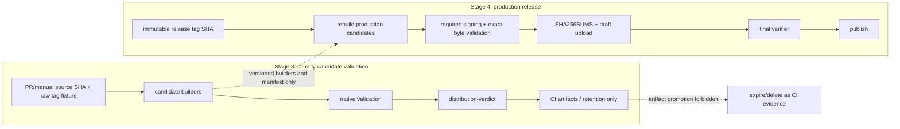

# Проверяемый контракт distribution support и артефактов

## 0. Метаданные

- Тип (instruction stack): `delivery-task` (`model-behavior-baseline + quest-governance + collaboration-baseline + testing-baseline`) + profile `dotnet-desktop-client` + overlay `product-system-design` + context `testing-dotnet` + SPEC governance `quest-mode + spec-linter + spec-rubric + review-loops`; Git delivery дополнительно следует `commit-message-policy + github-delivery-policy + versioning-policy`.
- Владелец: Product Owner / активный пользователь.
- Масштаб: large, отдельный Stage-3 delivery package.
- Целевое семейство / behavior baseline: `GPT-5.6`; owner contract — `instructions/core/model-behavior-baseline.md`.
- Поверхность: `Work / Codex` (`Codex desktop`); продуктовая change surface — root run scripts, standalone Windows/Linux/macOS/Android candidate pipeline, package metadata/templates, canonical asset/support contracts, CI-only evidence и парные root README.
- Effective runtime: фактический model ID/tier, reasoning level и версия клиента не являются validation input этой немодельной delivery-задачи и не влияют на acceptance verdict; repository outcome подтверждается deterministic local/native evidence, fallback — `Не применимо`.
- Execution / evidence runtime: локальный Windows/PowerShell workspace; native verification выполняется на Windows Server 2022, macOS 15 Intel/arm64, Android API 23/36 emulator и чистых Debian 12/13 x64 images.
- Eval baseline / evidence: model eval — `Не применимо`; product/evidence baseline — release `1.27.0` и текущие production `release.published` workflows; runtime UI/data/update behavior не меняется.
- Целевой релиз / ветка: `docs/distribution-support-contract`; approved SPEC/EXEC base = `origin/main@ad90260b62be899d9f9946e81ce710ed88c2f87a`, previous post-rebase base = `origin/main@ec9b206db6930ef296313a14e2a440236807ba03`, merged prerequisite base = `origin/main@e11cae9a086ddd4fd97105f00b67bedf05f92700`; future dry-run fixture = `v1.28.0`, публикация запрещена.
- Текущая фаза: `EXEC / exact-head harness remediation, blocked by dependency-security prerequisite`; LF/blob-parity и Desktop build isolation реализованы, draft PR #280 открыт. Commit `d0c68dd5` доставил native Jammy `libpulse0`: Distribution run `29838807057` подтвердил scope/contract, Windows, обе macOS архитектуры и Android dual-APK build PASS; Linux ожидаемо fail-closed на `NU3012`, Tests `29838805611`, CodeQL `29838806826` и AndroidPkg `29838805889` PASS. Оба API jobs успешно установили/проверили `libpulse0`, image и exact APK, но `emulator` затем одинаково сообщил unknown AVD name: `avdmanager` и emulator не были связаны explicit isolated AVD root. Новый validator создаёт unique runner-temporary `ANDROID_AVD_HOME`, запрещает fallback к `$HOME/.android/avd`, проверяет exact descriptor/directory до launch и удаляет root в EXIT cleanup; static RED 4.4 s + shared-HOME negative RED 1.5 s, latest Bash syntax + Android regression PASS 40.8 s, `All` PASS с 182 negatives за 70.7 s. NuGet prerequisite draft в `rxs1` остаётся `NEEDS-FIX`; implementation/approval закрыты. Затем требуются review/AVD replacement CI, prerequisite decision/approval/PR/merge, rebase PR #280, полный exact-SHA reset и финальный native matrix/aggregate.
- Freshness baseline от 2026-07-18:
  - latest published release = `1.27.0`, target `5aebebcb34eabe35fcdb7a47ff76ffdc2a7e16dd`, 22 assets;
  - Stage 2 доставлен merged PR #277, merge commit `75efc0497af0a1b4678372b67112a8f606ce28c9`;
  - Stage-2 factual delivery journals доставлены отдельным PR #278, closeout commit `fc52779b56e1a168a54367f9f61ceea379fa8fdb`, merge commit `ad90260b62be899d9f9946e81ce710ed88c2f87a`; они являются частью `origin/main` и не входят в prospective Stage-3 PR diff;
  - platform packaging sources на текущем `main` не отличаются от release tag `1.27.0` в проверяемых местах;
  - Linux workflow run `29370756672`, Windows `29370756663`, macOS `29370756703`, Android `29370756710` завершились успешно, но сами package install/launch contracts не проверяли;
  - release assets появлялись уже после публикации release: первый примерно через 94 секунды, последний примерно через 364 секунды; это доказанный Stage-4 atomicity gap, а не scope Stage 3.
- Ограничения:
  - Stage 3 не создаёт, не публикует, не изменяет и не удаляет GitHub Release или его assets;
  - опубликованные assets `1.27.0` immutable: их нельзя backfill-ить checksum-файлом или заменять исправленными пакетами;
  - build-only путь не получает production secrets и имеет только `contents: read`;
  - Windows/Linux/macOS `release.published` workflows, их event/permission/secret/publication paths не меняются в Stage 3;
  - `.github/workflows/android-packaging.yml` меняется только для least-privilege isolation: PR path получает `contents: read` и не видит production signing secrets; production signing secrets доступны только release-only signing/build step, а `contents: write` — только release-only upload job без signing secrets; release APK names/ABI/version/signature/output semantics сохраняются;
  - между merge Stage 3 и delivery Stage 4 действует release freeze: не создавать tag/release; если выпуск потребуется раньше, остановить roadmap и получить отдельное решение, не выдавая Stage-3 candidate за release-ready;
  - наличие asset, успешная сборка или metadata-only validation не повышают платформу до verified support;
  - Windows Authenticode, Apple Developer ID/notarization и новые desktop signing credentials остаются Stage 9;
  - Android production certificate fingerprint является публичным verification contract Stage 3, но production signing и publish gate применяются только к release candidate в Stage 4;
  - draft-first orchestration, atomic publish, public `SHA256SUMS.txt`, tag immutability, idempotency/concurrency и release rollback остаются Stage 4;
  - UI behavior/state не меняется, поэтому новые product UI scenarios и before/after video не требуются; packaged launch/window detection обязательно как distribution smoke.
- Связанные артефакты:
  - master roadmap: `specs/2026-07-17-readme-reliability-roadmap.md`;
  - Stage-2 child spec: `specs/2026-07-17-status-availability-contract.md`;
  - Headless prerequisite child spec: `specs/2026-07-19-headless-appautomation-storage-lifecycle.md`;
  - dependency-security prerequisite child spec: `specs/2026-07-21-reactiveui-signature-chain-remediation.md` (`NEEDS-FIX` в отдельном `rxs1`; re-review до PASS обязателен до exact approval request);
  - `README.md`, `README.RU.md`;
  - `run.windows.cmd`, `run.linux.sh`, `run.macos.sh`;
  - `.github/workflows/windows-packaging.yml`;
  - `.github/workflows/deb_packaging.yml`;
  - `.github/workflows/osx-packaging.yml`;
  - `.github/workflows/android-packaging.yml`;
  - `src/Unlimotion.Desktop/Directory.Build.props`;
  - `src/Unlimotion.Desktop/Unlimotion.Desktop.ForDebianBuild.csproj`;
  - `src/Unlimotion.Desktop/Unlimotion.Desktop.ForMacBuild.csproj`;
  - `src/Unlimotion.Android/Unlimotion.Android.csproj`;
  - `src/Unlimotion.Desktop/ci/deb/*`, `src/Unlimotion.Desktop/ci/osx/*`;
  - `scripts/test-android-build-scripts.ps1`.

Если секция canonical template не применима, это указано явно с причиной.

## 1. Overview / Цель

Сделать distribution-утверждения проверяемыми: один versioned manifest определяет роли и ожидаемые имена артефактов, один resolver разделяет raw Git tag и normalized package version, каждый candidate собирается один раз и проверяется как точный набор байтов на соответствующей платформе, а README latest-release claims сверяются с durable exact-digest support snapshot. Stage-3 dry-run не повышает public support status: promotion возможен только для production bytes, построенных, подписанных и полностью проверенных внутри Stage-4 immutable-tag run.

Outcome contract:

- Success means:
  - все 22 assets release `1.27.0` классифицированы локальным fixture без обращения к сети;
  - `1.2.3` и `v1.2.3` сохраняются как разные raw identities, но дают один `normalizedVersion=1.2.3` и одинаковый filename plan;
  - package filenames и metadata никогда не получают raw `v` prefix;
  - root run scripts работают из произвольного current directory, передают аргументы и exit code; shell scripts имеют shebang, strict mode и executable bit;
  - build-only workflow собирает Windows, Linux, macOS и Android candidates без release mutation и без production credentials;
  - exact SHA-256 каждого candidate сохраняется до validation, после native smoke и в aggregate evidence;
  - `.deb` из одной сборки устанавливается и запускается в clean Debian 12 и Debian 13 x64 images;
  - AppImage имеет отдельный structural/launch verdict и не наследует `.deb` support;
  - Windows, обе macOS architectures и Android APK проходят platform-native metadata, architecture, signature-readiness и launch gates в определённой ниже полноте;
  - current release `1.27.0` остаётся честно помеченным Preview там, где новый exact-artifact gate для него не пройден;
  - current README download table машинно сопоставлен с release `1.27.0`, asset names/digests и evidence levels; candidate evidence отображается отдельно как CI-only и не переносится на release;
  - EN/RU README синхронно объясняют support/evidence границы и исправленные source/AppImage инструкции.
- Итоговый output:
  - canonical asset/support schemas + manifest + frozen release fixture + durable current support snapshot;
  - shared identity/planning/validation scripts;
  - исправленные run/package scripts и package metadata;
  - least-privilege Android PR/release workflow split без изменения release asset contract;
  - read-only build/validate workflow с native matrix;
  - machine-readable evidence + CI-only checksum manifest;
  - paired README corrections;
  - отдельный Stage-3 PR.
- Stop rules:
  - не начинать EXEC до отдельного approval этой spec;
  - не запускать release-triggered workflows и не использовать publish mode в Stage-3 validation;
  - остановить EXEC, если Android workflow security test находит production-secret reference либо write permission в job/step, достижимом из `pull_request`, `push` или `workflow_dispatch`;
  - не изменять Windows/Linux/macOS production publisher workflows и не менять Android release output semantics; единственное publisher-изменение Stage 3 — обязательное least-privilege hardening Android workflow; Stage-3 delivery и Stage-4 migration разделяет release freeze;
  - не считать rebuild теми же байтами: smoke обязан читать уже созданный candidate и повторно сверять hash;
  - не смешивать metadata-only и launch-verified verdicts;
  - не повышать Android minimum API автоматически, если API 23 smoke не проходит; остановиться и запросить product decision;
  - не завершать Stage 3 при падающей mandatory matrix cell, невалидном evidence aggregate или EN/RU drift;
  - не повышать public latest-release support по candidate dry-run независимо от его результата;
  - не объявлять Stage-4 atomic release AC закрытым.

## 2. Текущее состояние (AS-IS)

### 2.1 Release inventory и workflow contract

Release `1.27.0` содержит 22 assets:

- metadata/feed: `RELEASES`, `releases.win.json`, `releases.linux.json`, `releases.osx.json`, `releases.osx-arm64.json`;
- updater packages: четыре `*-full.nupkg` для Windows, Linux, macOS x64 и macOS arm64;
- Windows: `Unlimotion-win-Setup.exe`, `Unlimotion-win-Portable.zip`, `Unlimotion-1.27.0-win-x64-portable.zip`;
- macOS: `Unlimotion-osx-Setup.pkg`, `Unlimotion-osx-Portable.zip`, `Unlimotion-1.27.0-osx-x64.pkg`, а также три arm64-аналога;
- Android: `Unlimotion-1.27.0-android-arm64.apk`, `Unlimotion-1.27.0-android-x64.apk`;
- Linux: `Unlimotion-1.27.0.deb`, `Unlimotion.AppImage`.

GitHub API предоставляет `sha256` digest каждого asset, но проект не генерирует собственного полного `SHA256SUMS.txt`. Velopack JSON покрывает только updater `.nupkg`.

Текущие Windows/Linux/macOS workflows начинают package/upload после события `release.published`. Поэтому release становится видимым раньше полного набора assets. Stage 3 фиксирует build/validation layer, но не исправляет этот порядок: atomic draft-first publish принадлежит Stage 4.

Version logic дублируется по workflows. Linux переименовывает `.deb` через raw tag, Windows raw portable ZIP и Android APK также используют raw `${{ github.ref_name }}`, хотя package metadata и Velopack получают normalized SemVer. Future tag `v1.28.0` поэтому способен создать filename/metadata drift.

Linux/macOS manual paths имеют `contents: write`, удаляют существующие assets и публикуют. Windows не имеет manual build-only path. Ни один desktop workflow не выполняет package install + GUI launch smoke до upload.

Android workflow запускается на `push`, `pull_request`, `workflow_dispatch` и `release.published`, но сейчас имеет workflow-level `contents: write`, global `GITHUB_TOKEN` и production signing secret env на общем APK build step. Signing arguments добавляются только для release, однако token/secret references остаются достижимыми из PR job graph. Stage 3 обязан устранить exposure до native PR matrix, сохранив release trigger/signing/asset semantics.

### 2.2 Root source entry points

- `run.windows.cmd` содержит только CWD-relative `dotnet run --project ...`.
- `run.linux.sh` и `run.macos.sh` также состоят из одной CWD-relative команды, не имеют shebang/`set -euo pipefail`, tracked как `100644` и не передают пользовательские аргументы после `--`.
- Текущий README работает лишь при запуске из корня, но это ограничение задаётся хрупкостью scripts, а не продуктовым требованием.

### 2.3 Debian package `1.27.0`

Проверен exact asset:

- name: `Unlimotion-1.27.0.deb`;
- size: `45,446,086` bytes;
- SHA-256: `a192642417ac375ce1230b5cd89f4a11d99de4dd2a638e259b545cfcc3995a13`;
- raw control: `Package: Unlimotion.Desktop`, `Architecture: amd64`, `Version: 1.27.0`, `Maintainer: Kibnet`, `Description: Package Description`;
- payload содержит `/usr/local/bin/Unlimotion.Desktop`, wrapper `/usr/bin/Unlimotion`, desktop file mode `0544` и icon mode `0744`.

Текущий dependency list содержит `libgcc1`, ICU alternatives только до `libicu70` и SSL только до `libssl3`. Он не разрешается как vendor package contract для Debian 12 (`libgcc-s1`, `libicu72`) и Debian 13 (`libgcc-s1`, `libicu76`, `libssl3t64`). Успешный build не доказывает installability.

Raw package name с uppercase не соответствует Debian Policy. `dpkg-deb -f Package` нормализует вывод и поэтому не является достаточным oracle: validator обязан читать raw control archive. Package-owned `/usr/local` также запрещён policy. Desktop entry содержит deprecated `Encoding`, placeholder description, `.ico` и незарегистрированные categories.

`Packaging.Targets 0.1.232` при default `SymlinkAppHostInBin=true` сам добавляет app-host symlink в `/usr/local/bin`; одного изменения `create-symlink.sh` недостаточно. Target configuration должен явно отключить этот implicit symlink либо package builder должен быть заменён, а `/usr/bin/Unlimotion` должен остаться explicit package content.

Приложение не имеет содержательного non-GUI `--version`/health mode; `Program` всегда запускает classic desktop lifetime. Поэтому launch smoke обязан обнаружить реальное окно под Xvfb.

### 2.4 AppImage `1.27.0`

- size: `59,778,240` bytes;
- SHA-256: `ae1033e0131e39dcdbdb75470b48fa1c01318838d59a1cdb51f2dd9f09a665c1`;
- format/architecture: AppImage ELF x86-64;
- embedded version/RID: `1.27.0`, `linux-x64`, `x64`;
- внутренний executable совпадает с `.deb` binary для release `1.27.0`, но payload также содержит лишние Debian-specific `ci/deb/*`.

На host с FUSE3 без FUSE2 прямой запуск падает на `libfuse.so.2`. Official extract-and-run fallback может доказать payload launch, но не доказывает direct FUSE mount. README сейчас не объясняет эту границу, а RU формулировка «универсальный вариант» сильнее фактов.

### 2.5 Windows `1.27.0`

- `Unlimotion-win-Setup.exe`: SHA-256 `8d8c0077aec0e404102870c3a2ede5fa868b10a4670a331a46be38789be92bdc`, Product/File version `1.27.0`, `Get-AuthenticodeSignature = NotSigned`.
- Velopack portable ZIP имеет ожидаемый `.portable/current/Unlimotion.exe/Update.exe` layout.
- Дополнительный `Unlimotion-1.27.0-win-x64-portable.zip` содержит только большой `Unlimotion.Desktop.exe` и два PDB, дублирует portable role и примерно на 25 MB больше canonical README asset.
- README caveat об отсутствии Authenticode правдив; Stage 3 не должен превращать unsigned state в failure, но обязан фиксировать его как `signatureProfile=unsigned`.

### 2.6 macOS `1.27.0`

- Portable x64 содержит Mach-O `x86_64`, arm64 — `arm64`.
- Оба bundles имеют `CFBundleIdentifier=com.Unlimotion`, version `1.27.0`, executable `Unlimotion.Desktop.ForMacBuild`, minimum OS `12.0.0`.
- Mach-O signatures ad-hoc (`CodeDirectoryFlags=0x2`), оба Setup.pkg не имеют Developer ID package signature.
- `Unlimotion.Desktop.ForMacBuild.csproj` содержит stale `CFBundleExecutable=Unlimotion.Desktop.ForMacOSBuild`, хотя фактический `Info.plist` и binary используют `Unlimotion.Desktop.ForMacBuild`.
- Packaging shell scripts не fail-fast, зависят от CWD и недостаточно цитируют arguments.
- Native evidence требует явных runners: `macos-15-intel` для x64 и `macos-15` для arm64; mutable `macos-latest` не является архитектурным контрактом.

### 2.7 Android `1.27.0`

Оба APK имеют version `1.27.0`, versionCode `353`, minSdk 23, targetSdk 36 и ровно заявленный ABI. Exact SHA-256:

- arm64: `bc17ff84bc6f55bdeaeca428489459adeb06c441a72d3bca59f1d2bc5600f0ac`;
- x64: `9d8a245c6dc3a26ebb192ddbffb14a55670c04afdaca96052d30feb2b1b0b4f3`.

Оба проходят `apksigner verify`, используют v1/v2/v3 schemes и одного signer с certificate SHA-256 `1cca6de2bb329c14f89cd0441998e00df601e440d2a9b30c29bdd2cf0a321011`. Этот ожидаемый production fingerprint не закреплён в repository contract.

Workflow проверяет наличие native libraries/symbols, но не запускает `zipalign -c`, `aapt` contract, `apksigner verify`, certificate comparison или emulator install/launch. Дополнительно проект декларирует minSdk 23, а OpenSSL/libssh2/libgit2 собираются NDK toolchain для API 24. README осторожно говорит о declared minimum, но runtime support API 23 пока не доказан.

## 3. Проблема

Distribution truth сейчас выводится из наличия release assets и успешных build jobs. Это недостаточно: имена зависят от двух несовместимых представлений tag, package metadata расходится с целевыми OS, platform signatures только частично проверяются, workflows могут публиковать до smoke, а README не имеет machine-verifiable связи между support claim и exact artifact digest.

## 4. Цели дизайна

- Один static contract для asset naming, roles, platforms, architectures и required evidence.
- Fail-closed normalization: raw identity отдельно от package version.
- Build once, validate exact bytes: никаких rebuild/repack между hash и smoke.
- Native evidence: каждая support cell проверяется на своей OS/architecture либо честно остаётся metadata-only.
- No remote mutation: Stage-3 dry-run заканчивается CI artifacts/reports.
- Traceability: source SHA, raw tag, normalized version, runner/image identity и artifact SHA присутствуют в каждом report.
- Honest support levels: `present`, `metadataVerified`, `launchVerified`, `productionReady` не смешиваются.
- Backward compatibility: исторические assets `1.27.0` классифицируются, но не изменяются; package identity `unlimotion.desktop` сохраняется для upgrade continuity.
- Production isolation: Stage-3 candidate pipeline не вызывает publishers; Windows/Linux/macOS publishers не меняются, а Android publisher получает только least-privilege separation без изменения release output semantics. Stage 4 подключает проверенные builders после собственного audit/approval.
- Durable docs trace: public release claim имеет exact tag/source/asset/digest/evidence mapping; CI-only candidate claim отделён.
- Minimal product impact: runtime update behavior, UI и data format не меняются.

## 5. Non-Goals (чего НЕ делаем)

- Не создаём новый Git tag, GitHub Release, draft release или release asset.
- Не меняем и не удаляем 22 assets release `1.27.0`.
- Не публикуем CI-only `SHA256SUMS.txt`; public checksum publication — Stage 4.
- Не строим единый atomic release orchestrator, final release verifier, concurrency/idempotency или rollback published release — Stage 4.
- Не добавляем Windows/macOS signing credentials, Authenticode, Developer ID, notarization или stapling — Stage 9.
- Не генерируем, не ротируем и не раскрываем Android production private key; repository хранит только публичный expected certificate fingerprint.
- Не обещаем Ubuntu/derivatives, Linux ARM, native Wayland, iOS или Browser support.
- Не добавляем APT repository и не готовим package к Debian Archive submission.
- Не меняем updater runtime behavior и `UpdateManager.IsInstalled` semantics.
- Не выбираем и не активируем canonical future tag-write policy: Stage 3 принимает/нормализует обе stable формы, Stage-4 child spec решает publication form после consumer/update audit.
- Не меняем Windows/Linux/macOS `*packaging.yml` publishers. В Android publisher разрешено только минимальное least-privilege hardening существующих PR/release paths; migration на общий production orchestrator остаётся Stage 4.
- Не удаляем legacy/duplicate asset producers до отдельного Stage-4 release-set decision.
- Не переделываем всю README information architecture; полный docs redesign остаётся Stage 7.
- Не добавляем фиктивный `--version` как замену GUI launch smoke.

## 6. Предлагаемое решение (TO-BE)

### 6.1 Распределение ответственности

- `distribution/release-assets.schema.json` — строгая JSON Schema static contract.
- `distribution/support-matrix.schema.json` — схема durable public-claim snapshot.
- `distribution/release-assets.json` — versioned asset catalog: tag policy, asset roles/templates, platform/architecture, validator/signature/support requirements и legacy classification.
- `distribution/fixtures/release-1.27.0.json` — frozen local inventory всех 22 names/sizes/digests/roles и release target SHA; PR tests не зависят от GitHub API.
- `distribution/support-matrix.json` — current release tag/source SHA, exact asset digests, evidence level/OS cells/caveats, durable evidence URLs и `lastPublishedAndroidVersionCode`; README validator и production-monotonic resolver используют этот source of truth.
- `scripts/Resolve-ReleaseIdentity.ps1` — единственный parser raw tag -> normalized SemVer + filename plan; умеет писать JSON и GitHub outputs.
- `scripts/test-distribution-contract.ps1` — schema, unique ids, case-insensitive collisions, fixture completeness, naming, source/tag identity, workflow-security gates и deterministic positive/negative fixtures.
- `scripts/Test-DistributionArtifact.ps1` — common artifact/evidence envelope, hashes, expected filename/version/arch/signature profile и native-validator dispatch.
- `scripts/Build-LinuxDistribution.sh` — один clean publish payload, затем packaging-only `.deb`/AppImage из копий тех же bytes без второго `dotnet publish`.
- `scripts/smoke-linux-artifacts.sh` — `.deb`/AppImage structural и Debian-container launch checks.
- `scripts/Test-WindowsDistribution.ps1`, `scripts/test-macos-distribution.sh`, `scripts/test-android-distribution.sh` — named native validators/smokes.
- `scripts/Test-ReadmeDistributionContract.ps1` — EN/RU rows -> durable support snapshot verifier.
- `scripts/test-run-entrypoints.ps1` — unrelated-CWD/arguments/exit regression с fake `dotnet`.
- New candidate builders use script-relative paths, strict mode, quoted arguments, explicit output и single-build inputs; Windows/Linux/macOS publisher scripts остаются AS-IS до Stage 4.
- `.github/workflows/distribution-validation.yml` — standalone PR/manual read-only orchestration и stable `distribution-verdict`; current release workflows не вызываются.
- `.github/workflows/android-packaging.yml` — единственное current-publisher изменение: workflow-level default `contents: read`, отсутствие global `GITHUB_TOKEN`/production secret env, PR build без production secrets, release-only production signing/build step, отдельный release-only upload job с `contents: write` и без signing secrets. Release APK contract остаётся прежним.
- README EN/RU — current release truth, source entry points, AppImage FUSE/fallback и evidence-level semantics.

### 6.2 Детальный дизайн

#### Canonical manifest

Static manifest не содержит transient source SHA или build result. Он задаёт contract:

```json
{
  "schemaVersion": 1,
  "product": "Unlimotion",
  "tagPolicy": {
    "acceptedRead": ["MAJOR.MINOR.PATCH", "vMAJOR.MINOR.PATCH"],
    "publicationWrite": "deferred-to-stage-4",
    "stableOnly": true,
    "minimumVersion": "0.0.1"
  },
  "supportLevels": [
    "present",
    "metadataVerified",
    "launchVerified",
    "productionReady"
  ],
  "assets": [
    {
      "id": "linux-deb-x64",
      "platform": "linux",
      "architecture": "x64",
      "role": "userInstaller",
      "filenameTemplate": "Unlimotion-{normalizedVersion}.deb",
      "validatorProfile": "debian-amd64",
      "requiredEvidence": ["metadata", "install", "launch"],
      "releaseVisible": true,
      "legacy": false
    }
  ],
  "relations": [
    {
      "feedAssetId": "linux-feed",
      "packageAssetId": "linux-updater-package",
      "channel": "linux"
    }
  ]
}
```

Required schema rules:

- unique asset ids;
- unique case-insensitive generated names per supported fixture;
- exact role enum values only: `userInstaller`, `userPortable`, `updaterPackage`, `updaterFeed`, `legacyDuplicate`; unknown `installer` negative fixture fails;
- no raw-tag placeholder in filenames/package metadata;
- every release-visible asset has producer, role, platform, architecture, validator profile and required evidence;
- legacy/duplicate assets имеют owner и migration stage, но не выдаются за canonical user choice;
- updater feeds задают typed relation к exact `.nupkg`: channel/version/name/size/hash algorithm/value проверяются по фактическим package bytes;
- all 22 `1.27.0` fixture assets resolve to exactly one catalog entry; unexpected/missing/duplicate/zero-byte/stale-version/hash-mismatch fail.

Roles имеют закрытый enum `userInstaller`, `userPortable`, `updaterPackage`, `updaterFeed`, `legacyDuplicate`. Windows raw portable ZIP и два versioned direct macOS `.pkg` фиксируются как legacy duplicates до Stage-4 decision; они не удаляются в Stage 3.

`support-matrix.json` отдельно связывает user-facing cell с `releaseTag`, release source SHA, asset ids/names/SHA-256, evidence level, фактически проверенной OS/version/architecture, caveats и durable evidence URL. Для `1.27.0` он фиксирует только доказанные cautious states. CI-only `v1.28.0` candidate reports в этот snapshot не записываются. Negative fixture с тем же tag/name/version, но другим digest обязан отклоняться.

#### Release identity

`Resolve-ReleaseIdentity.ps1` принимает `-RawTag`, `-SourceSha`, `-WorkflowSha`, `-TagBinding`, `-AndroidVersionCode`, `-AndroidVersionCodePolicy`, `-Manifest` и условный `-SupportMatrix`, затем возвращает immutable JSON. `-SupportMatrix` обязателен при policy `production-monotonic`; resolver не читает GitHub environment variables самостоятельно — caller передаёт все значения явно.

```json
{
  "rawTag": "v1.28.0",
  "normalizedVersion": "1.28.0",
  "sourceSha": "<40 lowercase hex>",
  "workflowSha": "<40 lowercase hex>",
  "tagBinding": "notApplicable",
  "androidVersionCode": 1,
  "androidVersionCodePolicy": "ci-test",
  "androidVersionCodeSource": "github.run_number",
  "lastPublishedAndroidVersionCode": 353,
  "filenamePlan": {}
}
```

Rules:

- принимаются только `MAJOR.MINOR.PATCH` и `vMAJOR.MINOR.PATCH`, версия не ниже `0.0.1`;
- uppercase `V`, leading zero, partial version, prerelease и build metadata отклоняются;
- raw tag используется только для Git checkout/ref и будущего GitHub API target;
- normalized version используется для every filename, assembly/package/APK/bundle metadata и feed version;
- `1.28.0` и `v1.28.0` дают один filename plan, но разные `rawTag`;
- job после checkout доказывает `HEAD == sourceSha`; `workflowSha` фиксирует commit workflow definition; tag-aware release audit дополнительно доказывает peeled tag target, а synthetic fixture имеет `tagBinding=notApplicable`;
- Android `versionCode` приходит явным resolver input/output и всегда находится в диапазоне `1..2100000000`;
- policy `ci-test`: caller передаёт workflow-local `github.run_number` текущего `distribution-validation` workflow; rerun того же workflow run сохраняет code; значение может быть меньше либо равно published value, но допустимо только с `signatureProfile=test` и никогда не даёт `productionReady`;
- policy `production-monotonic`: будущий Stage-4 orchestrator передаёт значение, выделенное отдельным production version-code allocator; resolver требует `androidVersionCode > supportMatrix.lastPublishedAndroidVersionCode` (`353` для 1.27.0);
- `GITHUB_RUN_NUMBER` нумеруется отдельно для каждого workflow и не считается repository-global production sequence; Stage 4 отдельно определяет allocator policy, а rerun одного immutable production candidate повторно использует сохранённый identity plan, не выделяя новый code; zero/negative/overflow/non-monotonic production values fail closed;
- every distribution build получает explicit normalized `GitHubRefName`/build label и source SHA; generated `UnlimotionAppNameSuffix`/assembly metadata и реальный window title не могут содержать raw `v`;
- platform evidence независимо повторяет identity и aggregate verifier сравнивает все reports.

#### Build-only orchestration



`distribution-validation.yml`:

- triggers: every `pull_request` и `workflow_dispatch`; path filter не используется, чтобы stable final check никогда не зависал `Pending`;
- permissions: workflow/job `contents: read`; no OIDC/package/release write;
- first job computes relevant diff with repository-native `git diff`; irrelevant PR skips producers, но stable final verdict выполняется и возвращает `notApplicable` success;
- manual input содержит только raw tag fixture, default `v1.28.0`; source всегда immutable `github.sha` выбранного run ref и не переопределяется input;
- build jobs standalone и не вызывают existing publisher workflows;
- external `owner/repo@...` references pinned to reviewed full commit SHA; local `./...` actions/workflows разрешены как same-commit references и не получают syntactically impossible `@SHA`;
- deterministic artifact names включают platform, architecture, `sourceSha[0..11]` и `github.run_attempt`; upload uses `if-no-files-found: error`, `overwrite: false`, seven-day retention and records action `artifact-id`/`artifact-digest`;
- each mandatory producer primary upload from `contract` through the Android API cells has a separately named `*-receipt` artifact; contract and Android API receipts use `distribution-evidence-transport-receipt` and bind the uploaded artifact name/id/digest to exact payload-file hashes;
- Android API 23/API 36 candidate download and final aggregate download each emit `download-transport.json` with both bounded-attempt outcomes, selected attempt, cleanup and exhaustion before native/aggregate evidence is accepted;
- Unix executable payloads передаются внутри tar archive, потому что artifact transport не сохраняет mode; extraction validates stored mode, restores it and re-hashes the unchanged file bytes;
- build jobs upload exact candidates + JSON evidence as CI artifacts; failure-path evidence emitted under `if: always()` where runner is alive;
- final job id/name = `distribution-verdict`, declares all producer jobs in `needs`, uses `if: ${{ always() }}`, inspects every `needs.<job>.result`, tolerates download-step absence only до aggregate script и затем fails on missing artifact/matrix cell;
- aggregate repeats hashes, validates complete manifest/support/feed coverage, writes CI-only `SHA256SUMS.txt`, and stops;
- negative contract fixture supplies a failed/missing producer result and proves final verdict is `failure`, never `skipped`;
- ordinary PR uses frozen `1.27.0` fixture and local schema tests, не зависит от GitHub release API;
- optional manual latest-release audit may read public API, but cannot mutate it.

Trigger/source identity matrix:

| Trigger | `sourceSha` | `workflowSha` | raw tag / binding | Required assertion |
| --- | --- | --- | --- | --- |
| `pull_request` | `github.sha` merge commit | `job.workflow_sha` | synthetic fixture, `notApplicable` | checkout exact merge SHA; record head/base SHAs separately |
| `workflow_dispatch` | `github.sha` of selected workflow ref | `job.workflow_sha` | input fixture, `notApplicable` | no independent source ref input; `HEAD == sourceSha` |
| Future Stage-4 release | peeled `refs/tags/<rawTag>^{commit}` | `job.workflow_sha` | actual tag, `required` | tag exists, peeled SHA equals immutable candidate SHA |

Local reusable logic, если появится, берётся только через `./...` из caller commit; caller передаёт exact `sourceSha`, а callee повторяет checkout/assertion. Stage 3 не создаёт release-triggered caller.

Current `.github/workflows/windows-packaging.yml`, `deb_packaging.yml` и `osx-packaging.yml` остаются byte-for-byte unchanged в Stage 3 и служат AS-IS evidence/Stage-4 migration targets. `.github/workflows/android-packaging.yml` меняется только в пределах следующего security contract:

- workflow-level/default permissions = `contents: read`; global `GITHUB_TOKEN` и global production signing secret env удалены;
- `android-build` имеет `contents: read`; ни один step, достижимый из `pull_request`, `push` или `workflow_dispatch`, не содержит production `ANDROID_SIGNING_*` secret reference или write token;
- production signing secrets объявлены только на release-only preparation/signing/build path с условием `github.event_name == 'release' && github.event.action == 'published'`; temporary keystore удаляется и signing environment очищается под `if: always()` сразу после build;
- `android-release-upload` имеет `needs: android-build`, выполняется только на `release/published`, получает единственное повышение `contents: write`, не checkout-ит repository, не запускает build scripts и не получает signing secrets;
- upload job скачивает exact same-run artifact, сверяет ожидаемые два filename, candidate SHA-256, artifact id/digest и только затем загружает APK; `GITHUB_TOKEN` передаётся только pinned release-upload action внутри этого job;
- все external actions в изменённом Android workflow pin-ятся reviewed full commit SHA; existing release trigger, tag/source resolution, signing properties, два APK filename и release asset contract функционально неизменны;
- `scripts/test-android-build-scripts.ps1` и workflow-security fixtures статически доказывают event reachability, permission/secret/job separation, cleanup, pinned actions, exact handoff и сохранение release command/output contract.

Stage-3 artifacts test-signed/CI-only и не могут быть promoted. Stage 4 потребляет manifest/builders/validation contract, заново строит production candidate из immutable tag SHA, подписывает и проверяет exact Stage-4 bytes, а затем загружает их в draft и публикует; Stage-3 evidence artifacts не переносятся в release.

#### Root entry points

- Windows resolves repo root through `%~dp0`, quotes project path, forwards arguments after `--` and returns exact `dotnet` exit code.
- Linux/macOS resolve `SCRIPT_DIR`, use `#!/usr/bin/env bash`, `set -euo pipefail`, quote project path, forward `"$@"` after `--` and remain executable (`100755`).
- Regression invokes all scripts from a temporary unrelated CWD against a fake `dotnet` shim, checks exact argv and injected non-zero exit code; it does not start the UI.

#### Debian package

Package identity remains `unlimotion.desktop` to preserve upgrade continuity. Target metadata:

- raw `Package: unlimotion.desktop`;
- `Architecture: amd64`;
- normalized version without `v`;
- `Maintainer: Kibnet Philosoff <kibnet@hotmail.com>`;
- meaningful description and `Homepage: https://github.com/Kibnet/Unlimotion`;
- `Priority: optional`, suitable section;
- dependencies cover both target releases: `libgcc-s1`, `libicu76 | libicu72`, `libssl3t64 | libssl3` and verified .NET/Avalonia runtime dependencies; final exact list follows official .NET 10 guidance plus clean-image/`ldd` evidence, not Packaging.Targets defaults alone.

Target layout:

- application under `/usr/lib/unlimotion/`;
- launcher under `/usr/bin/Unlimotion`;
- no package-owned file/symlink under `/usr/local`;
- new candidate builder не вызывает `Packaging.Targets/CreateDeb`: он формирует explicit Debian staging tree/control archive и запускает `dpkg-deb --build --root-owner-group`; launcher выполняет `/usr/lib/unlimotion/Unlimotion.Desktop` с `"$@"`;
- desktop entry/icon modes `0644`, executables `0755`;
- canonical PNG icon and valid desktop entry; remove deprecated `Encoding`, placeholder copy and invalid categories;
- `desktop-file-validate` and targeted `lintian` findings are recorded; known non-target lintian noise must be allowlisted narrowly with rationale, not globally ignored.

`Build-LinuxDistribution.sh` выполняет ровно один clean `dotnet publish` в canonical `artifacts/distribution-validation/linux-x64/payload`. Перед packaging каталог закрывается от записи и хешируется. AppImage staging получает копию только application payload; `.deb` staging копирует те же executable bytes и отдельно добавляет Debian integration files. Второй restore/publish и MSBuild target с dependency on `Publish` запрещены. Builder фиксирует цепочку hashes `canonical staged executable -> executable extracted from .deb -> executable extracted from AppImage`; все три SHA-256 обязаны совпасть. One `.deb` is built once. The same read-only file and SHA are mounted into `debian:12-slim` and `debian:13-slim`; resolved image digest is recorded. Per image order is mandatory:

1. record `/etc/os-release`, `dpkg --print-architecture`, `uname -m`, image digest and candidate SHA;
2. `apt-get update`;
3. install exact package in the target container; no Xvfb/xdotool or other test-runtime package is ever installed there after candidate installation;
4. run `apt-get check`, `dpkg --audit`, metadata/path/mode/ownership assertions; enumerate every ELF executable/shared object under `/usr/lib/unlimotion`, run dynamic-loader/`ldd` closure checks and fail on any unresolved dependency;
5. hash the target container's installed-package closure (`dpkg-query`) immediately after candidate installation;
6. start Xvfb/xdotool only on the runner or a separate pinned harness sidecar, expose the ephemeral X11 socket to the unchanged target container and record harness image/tool identity;
7. create non-root user and isolated writable HOME in the target without an APT transaction;
8. launch `/usr/bin/Unlimotion --config=<isolated path>` against the external X server;
9. within 30 seconds assert live process + visible `Unlimotion` window and absence of fatal native-load exceptions;
10. terminate only the tracked process tree, retain log/report, and require the target `dpkg-query` closure hash to equal step 5;
11. re-hash candidate and require unchanged SHA. A negative fixture removes one required runtime dependency from package metadata; external harness presence must not turn unresolved-loader/launch evidence into PASS.

Upgrade-continuity cell выполняется отдельно на Debian 12 и 13. Exact baseline `.deb` 1.27.0 скачивается по pinned URL/name и принимается только при SHA-256 `a192642417ac375ce1230b5cd89f4a11d99de4dd2a638e259b545cfcc3995a13`. Поскольку его stale control dependencies не разрешаются на target OS, он устанавливается migration-only через `dpkg --force-depends -i` после явной установки фактических runtime libraries; это не support evidence 1.27.0. Test фиксирует normalized dpkg identity, создаёт sentinel в isolated non-root user data/config, затем выполняет `apt install ./<candidate>.deb` как upgrade. После upgrade обязаны отсутствовать package-owned `/usr/local/*`, новый launcher/desktop paths и package version корректны, sentinel неизменен, candidate запускается под Xvfb. Clean-install и upgrade verdicts не взаимозаменяемы.

#### AppImage

AppImage uses an independent matrix and verdict:

- ELF x64, AppRun, desktop entry, embedded RID/version/architecture and payload policy;
- Debian-specific `ci/deb/*` forbidden from payload;
- internal main executable hash equals `.deb` executable hash or an explicit reviewed reason blocks completion;
- a clean target installs only manifest/README-declared AppImage runtime prerequisites; `APPIMAGE_EXTRACT_AND_RUN=1` + the same external Xvfb sidecar/socket + non-root user proves extract-and-run launch on Debian 12/13 without adding harness libraries to the target;
- evidence records `launchMode=appimage-extract-and-run`;
- direct FUSE is `notVerified` unless a separate host/VM with `/dev/fuse` and FUSE2 runs the exact artifact;
- README documents Debian 12 `libfuse2`, Debian 13 `libfuse2t64` and official extract-and-run fallback without calling fallback direct-FUSE support.

#### Windows

On `windows-2022`:

- validate manifest names, exact hashes and Product/File version; Velopack Setup.exe bootstrap may itself report PE `I386`, but its installed application payload and canonical portable executable must be PE x64;
- inspect canonical Velopack portable layout and forbid accidental PDBs from user-facing portable artifacts;
- extract portable asset into isolated directory, launch exact executable, wait for process/window, terminate tracked process;
- exercise Setup.exe silent install in disposable runner context, locate installed app, launch/window-check, then uninstall/cleanup;
- run `Get-AuthenticodeSignature`; current `NotSigned` is expected Stage-3 caveat and evidence value, not `productionReady`;
- legacy raw portable ZIP remains classified, content-checked and excluded from canonical support claim.

#### macOS

Native matrix:

- x64: `macos-15-intel`;
- arm64: `macos-15`.

Each job records `sw_vers`, `uname -m`, runner image metadata and exact artifact hash; validates `plutil`, bundle id/version/executable, Mach-O architecture/minimum OS, portable/package contents, `codesign` state and `pkgutil --check-signature`; installs/extracts exact package, launches native app, waits for process/window and cleans up. Ad-hoc/unsigned state remains an explicit caveat. Cross-publish without native launch cannot produce `launchVerified`.

Packaging scripts use strict mode, script-relative paths, validated version/RID inputs and quoted arguments. Stale csproj `CFBundleExecutable` is aligned with actual `Unlimotion.Desktop.ForMacBuild` without changing bundle identity.

#### Android

- Both APKs: normalized filename/version/build label, expected application id, explicit resolver `androidVersionCode`, min/target SDK, exact single ABI, native libraries/symbols, `zipalign -c`, `aapt`/`apkanalyzer`, `apksigner verify` and certificate report.
- `androidVersionCodePolicy=ci-test` принимает workflow-local `github.run_number`, допускает значение `<= lastPublishedVersionCode` только для test signature/non-promotable candidate. `production-monotonic` в Stage 4 принимает independently allocated code и требует `> lastPublishedVersionCode`; workflow-local run number не является production allocator.
- Native cache использует two-phase exact-key protocol. До restore создаётся canonical `native-inputs.json`: Android API level, NDK revision, host/toolchain triples, ABI set, OpenSSL/libssh2 versions и source hashes, exact libgit2 commit, native package version и hashes всех build scripts. `nativeInputDigest = SHA256(canonical native-inputs.json)`; primary key = `android-native-v2-<runner-os>-<runner-arch>-<nativeInputDigest>`. Restore разрешён только по exact key, без `restore-keys`; cache paths предварительно очищаются и разделены по API/input digest.
- Cache bundle содержит outputs, nupkg и `native-provenance.json`. На hit validator повторно вычисляет input digest, требует equality requested/matched key и всех provenance inputs, пересчитывает nupkg/file SHA-256 и отклоняет missing/mismatched/cross-API/partial evidence. На miss выполняется clean build; только после полной artifact/provenance validation bundle сохраняется через `actions/cache/save` под exact primary key. Failed/partial build не сохраняется. Output nupkg SHA хранится в provenance/evidence, но не входит в pre-build restore key.
- Positive/negative fixtures покрывают miss -> clean build -> validate -> save, exact hit -> validate -> reuse без native rebuild, API-23 request с API-24 provenance, changed nupkg bytes, missing provenance, requested/matched key mismatch и partial output.
- Build-only PR candidates use an ephemeral test keystore and are marked `signatureProfile=test`; they can prove signing mechanics but never `productionReady`.
- Release candidate must match public production certificate SHA-256 `1cca6de2bb329c14f89cd0441998e00df601e440d2a9b30c29bdd2cf0a321011` on both APKs and have the same signer count/fingerprint.
- Align native toolchain API with declared minSdk 23 and run exact x64 APK on API 23 and current target/API 36 emulators using command-line SDK tooling. Assert install, activity start, live process and fatal-free logcat.
- arm64 APK remains metadata/signature verified unless a native arm64 device/runner is available; x64 emulator success must not be described as arm64 launch evidence.
- If native dependencies cannot build/run on API 23, EXEC stops. Raising declared minimum to 24 or changing product claim requires a new explicit user decision; spec approval alone does not authorize it.

#### Evidence envelope

Every platform report uses one schema and includes:

- schema version, outcome and support level;
- raw tag, normalized version, source SHA, workflow SHA, tag-binding mode, manifest/support-snapshot SHA;
- asset id/name/size/SHA-256 before and after validation;
- OS name/version, architecture, runner/container identity and image digest where available;
- package metadata verdict;
- signature profile/status/fingerprint where applicable;
- install mode, launch mode, process/window/log result;
- target runtime/ELF closure, pre/post installed-package closure hash and external GUI-harness location/image/tool identity where applicable;
- explicit skipped/metadata-only reason;
- Android versionCode policy/source/last-published value, native input digest, API/NDK/toolchain/source/package SHA, requested/matched cache key, cache hit/save outcome and provenance where applicable;
- CI transport artifact name/id/digest, retention, receipt payload closure and original/restored Unix mode where applicable;
- client-level download-transport scope, both attempt outcomes, selected attempt, cleanup and exhausted state where applicable;
- retry classification, attempt/maxAttempts, cleanup action and terminal error;
- validator versions and UTC timestamps.

Aggregate fails on missing/duplicate/unexpected asset, source/workflow mismatch, hash drift, feed-to-package relation drift, unsupported status promotion, incomplete mandatory cell or invalid schema. OS/version is part of the support-cell key: Windows Server 2022 and macOS 15 CI launch evidence cannot be broadened to generic Windows/macOS consumer support, а Mach-O `minos=12` остаётся metadata only. `productionReady` is derived, never supplied as a free-form workflow input.

### 6.3 User-Observable Scenarios

| Scenario | User action / trigger | Expected visible result / output | Evidence required | Covered by AC |
| --- | --- | --- | --- | --- |
| Source entry point | Запустить любой `run.*` из другой папки с `--config=...` | Правильный project/argument/exit code, без зависимости от CWD | fake-dotnet argv/exit report | S3-AC-04 |
| Cross-OS canonical checkout | Checkout candidate на Windows, Linux и macOS | Все tracked JSON из двух approved patterns содержат LF; physical worktree SHA-256 совпадает с raw committed Git blob на каждой OS | Три retained `blob-parity.json` в `contract`/`linux_x64`/`macos_x64` artifacts и receipts | S3-AC-02 |
| Future-tag dry-run | Запустить manual candidate validation для `v1.28.0` | Filenames/build label = `1.28.0`, raw tag сохранён только в identity; GitHub Release не меняется | identity/evidence JSON + no-mutation contract | S3-AC-03, S3-AC-05 |
| Debian clean install | Проверить один `.deb` на Debian 12/13 | Package устанавливается в target без test-tool libraries, loader closure полна, окно открывается через external Xvfb socket | two clean-install/closure reports, one candidate SHA | S3-AC-08 |
| Debian upgrade | Обновить exact migration-only 1.27.0 до candidate | Одна dpkg identity, старый `/usr/local` исчез, user sentinel сохранён, candidate запускается | two upgrade reports + pinned baseline SHA | S3-AC-09 |
| AppImage | Запустить exact AppImage extract-and-run | Window opens; output честно не заявляет direct FUSE | structural/launch report with launch mode | S3-AC-10 |
| Windows candidate | Extract portable и установить Setup на disposable runner | Оба запускаются; unsigned state видим как caveat | Windows Server 2022 evidence, not generic Windows claim | S3-AC-11 |
| macOS candidates | Проверить packages на native Intel/arm64 runners | Exact package запускается; ad-hoc/unsigned state сохранён | macOS 15 Intel/arm64 reports | S3-AC-12 |
| Android candidates | Установить x64 APK на API 23/36 | App starts; arm64 остаётся metadata-only; signature profile explicit | build/provenance/signature + two emulator reports | S3-AC-13, S3-AC-14 |
| Fail-closed aggregate | Producer отсутствует/падает либо hash/feed/signature неверны | Stable `distribution-verdict` выполняется и падает, не становится skipped | negative aggregate fixtures + final job result | S3-AC-15, S3-AC-17 |
| Clean solution build | Разработчик/CI выполняет fresh restore + Debug build всего solution | Все sibling Desktop package graphs/solution outputs изолированы; direct publisher paths не меняются | evaluated-path report, negative fixtures и full build log | S3-AC-20 |
| Current release docs | Открыть current download table после Stage 3 | `1.27.0` не получает support promotion от dry-run; FUSE/source instructions точны | support snapshot -> paired README verifier | S3-AC-16, S3-AC-19 |

### 6.4 State / Interaction Matrix

| Current state | Trigger | Expected transition/result | Empty/error/disabled/concurrent case | Notes |
| --- | --- | --- | --- | --- |
| `present` | metadata validator passes | `metadataVerified` for exact digest/cell | Missing/wrong/hash drift -> `failed` | Asset presence alone stays Preview |
| `metadataVerified` | native install/launch passes | `launchVerified` for exact OS/version/arch | No native runner/device -> remain metadata-only | No broad consumer-OS claim |
| `launchVerified` | production signature + all required cells in Stage 4 | eligible for `productionReady` | test/unsigned profile cannot promote | Stage 3 itself does not publish |
| any state | mandatory job/evidence fails | `failed` | Aggregate runs under `always()` | Unknown outcome is non-PASS |
| irrelevant PR | change detection false | `notApplicable` success | Unexpected producer execution/missing final job fails | Stable check always reports |

| Platform cell | Metadata | Install/extract | Native launch | Signature meaning |
| --- | --- | --- | --- | --- |
| Debian 12 x64 `.deb` | Required | Required | Required under Xvfb | N/A |
| Debian 13 x64 `.deb` | Required | Required | Required under Xvfb | N/A |
| AppImage Debian 12/13 x64 | Required | Extract required | Extract-and-run required; FUSE separate | N/A |
| Windows Server 2022 x64 CI | Required | Setup + portable | Required | `NotSigned` caveat; no generic Windows claim |
| macOS 15 Intel x64 CI | Required | Required | Native Intel required | ad-hoc/unsigned; `minos=12` metadata only |
| macOS 15 arm64 CI | Required | Required | Native arm64 required | ad-hoc/unsigned; `minos=12` metadata only |
| Android x64 | Required | API 23 + API 36 | Required | test or production profile explicit |
| Android arm64 | Required | Metadata-only unless device exists | Not claimed without device | same production fingerprint required |

### 6.5 Decision Ledger

| Decision | Owner | Default / chosen option | Confidence | Risk if assumed | Needs user before EXEC |
| --- | --- | --- | ---: | --- | --- |
| Tag read/normalization | agent; package accepted by child approval | Accept both stable forms; publication write deferred to Stage 4 | 1.00 | Premature write policy could break consumers | Нет; child approval принимает только Stage-3 read contract |
| Filenames/build label | agent; package accepted by child approval | Normalized SemVer everywhere, raw only identity | 1.00 | Future `v` leaks into asset/title | Нет |
| Current publishers | agent; package accepted by child approval | Windows/Linux/macOS byte-for-byte unchanged; Android least-privilege hardening only; release freeze until Stage 4 | 0.99 | Release in interval remains old unverified process or PR exposes production credentials | Нет; security hardening/freeze are explicit approval constraints |
| Debian matrix/identity | agent; package accepted by child approval | Debian 12/13 amd64; lowercase `unlimotion.desktop`; clean + upgrade cells | 0.99 | Upgrade break or overbroad Linux claim | Нет |
| AppImage evidence | agent | Extract-and-run and direct FUSE are separate | 1.00 | False generic support | Нет |
| Public support | agent | No Stage-3 promotion; current exact-digest snapshot only | 1.00 | Candidate evidence could be misapplied to release | Нет |
| Duplicate assets | agent | Classify legacy; do not remove | 0.98 | Unknown consumer break | Нет |
| Windows/mac signing | roadmap/user | Unsigned/ad-hoc caveat accepted; credentials Stage 9 | 1.00 | Runtime readiness confused with trust | Нет; master boundary already approved |
| Android versionCode | agent | Stage 3: workflow-local run number for test profile; Stage 4: explicit production allocator monotonic against durable snapshot | 0.99 | Workflow-local sequence mistaken for repository-global code; store/update downgrade or overflow | Нет |
| Android PR signing | agent | Ephemeral key, `signatureProfile=test` | 0.99 | Test key mistaken for production | Нет |
| Android API 23 failure | user if condition occurs | Stop; do not raise minimum automatically | 1.00 | User-visible compatibility change | Нет до EXEC; если trigger сработает — отдельный ASK-HUMAN |
| UI evidence | agent | Native package window smoke; no new FlaUI/video | 0.99 | Excess test scope or weak package evidence | Нет |
| Canonical JSON line endings | agent; accepted only by amendment approval | Repository rules `distribution/*.json text eol=lf` и `distribution/fixtures/*.json text eol=lf`; validators continue hashing physical bytes | 1.00 | Windows/Linux/macOS producers получают разные identity SHA | Да; `.gitattributes` отсутствует в исходном allowlist |
| Headless prerequisite sequencing | agent; accepted by approval of separate child spec | Отдельный clean-worktree PR/merge до Stage-3 rebase; HSL completion не зависит от downstream Stage-3 gate | 1.00 | Mixed scope или циклический prerequisite | Да; отдельный child approval gate |
| NuGet signature prerequisite sequencing | agent; separate child spec audit `NEEDS-FIX` | Исправить receipt/publication findings -> повторить Role-Based/Post-SPEC до PASS -> отдельное exact approval -> prerequisite PR/merge -> Stage-3 rebase/full reset; signature verification bypass запрещён | 1.00 | Insecure restore, mixed dependency scope, unsafe evidence upload или недостоверный Linux support verdict | Да после review PASS; approval gate пока не открыт |
| Desktop sibling build isolation | agent; amendment approved 2026-07-21 | Project-specific `obj/<MSBuildProjectName>/`; project-specific `bin/<MSBuildProjectName>/` только при solution build; direct single-project publisher paths неизменны; Debian подключает `AvaloniaUI.DiagnosticsSupport` только в Debug | 1.00 | Restore graph зависит от порядка, main/Debian перезаписывают один output, clean Debug build недетерминированно падает | Нет; отдельный amendment approval получен |

### 6.6 Runtime / Config / Data Contract Matrix

| Contract area | Current source of truth | Expected change | Compatibility / migration | Verification |
| --- | --- | --- | --- | --- |
| Application persistence/DTO/wire | Runtime projects/schemas | Нет | Полностью сохраняется | diff allowlist/schema audit |
| Tag read | Duplicated workflow regexes | Shared strict dual-form resolver | `1.27.0` и `v1.27.0` normalize equally | identity fixtures |
| Tag write | Current numeric production tags | Не меняется в Stage 3; Stage-4 decision | No publication migration here | Windows/Linux/macOS publisher unchanged check + Android semantic guard |
| Package names/build label | Raw/normalized mix + `GitHubRefName` | Explicit normalized version/source metadata | Future raw `v` absent from candidate | file/assembly/window validators |
| Desktop build graph | Three sibling `.csproj` share `obj/project.assets.json`; main/Debian share direct `TargetPath` | Unique `obj/<project>` always; unique `bin/<project>` only for solution build; Debian Debug diagnostics reference | Direct Windows/Linux/macOS Release PublishDir remains byte-for-byte path-compatible; runtime/data unchanged | `BuildIsolation` evaluated properties/package graph/Compile sentinels + fresh solution build |
| Debian identity/layout | Packaging.Targets/current `.deb` | New candidate template/builder, same normalized package identity | Exact 1.27.0 -> candidate upgrade cells | clean + upgrade reports |
| Android versionCode/native provenance | Workflow-specific run number + API-24 caches | Explicit `ci-test`/`production-monotonic` policy and exact-input two-phase cache identity | 1.27.0 last code 353 retained in snapshot; Stage 4 supplies independent allocator | positive/negative version/cache provenance fixtures |
| Android workflow permissions/secrets | Global `contents: write`, global token and production secret env reachable from PR build job | Default read-only; no PR secret references; release-only signing step and sole write-enabled upload job separated | Release APK output/signature contract preserved | YAML/AST security tests + release command snapshot |
| Android certificate | Release APK audit only | Public expected SHA-256 in manifest | Private key absent | apksigner + profile derivation |
| CI evidence/transport | Ad hoc workflow logs | Versioned evidence schema, tar mode preservation, artifact id/digest | CI-only; no runtime reader | aggregate schema/hash checks |
| Velopack feed relation | Weak channel grep | Feed entry -> exact nupkg relation | Existing 1.27.0 fixture readable | feed parser negative fixtures |
| README support | Hand-written current table | Durable support snapshot + paired verifier; no Stage-3 promotion | Existing cautious claims preserved/corrected | `Test-ReadmeDistributionContract.ps1` |

## 7. Бизнес-правила / Алгоритмы

1. Resolve identity один раз из raw tag/source SHA; запрещено вычислять version string inline в platform workflows.
2. Generate expected asset plan from manifest and normalized version.
3. Build each artifact once; record hash immediately.
4. Run static/native validator against that same path.
5. Run install/extract/launch smoke against exact bytes; do not rebuild or recompress.
6. Record final hash and require equality with initial hash.
7. Parse every Velopack feed and match its channel/version/name/size/hash to exact updater package bytes.
8. Aggregate all evidence against manifest and support matrix in `distribution-verdict` under `always()`.
9. Derive candidate support level from evidence; caller cannot set it manually.
10. Upload only CI artifacts/reports in Stage 3.
11. Do not promote public release support in Stage 3; README current-release rows must map to durable exact-digest snapshot.

Failure classification:

- product/package failure: deterministic metadata, dependency, hash, signature or launch contract violation;
- infrastructure failure: runner unavailable, APT mirror outage, emulator boot timeout or artifact service outage;
- deterministic product/package failures не повторяются;
- APT mirror/network: до двух дополнительных попыток (3 total), каждый retry в новом container после удаления предыдущего; package install/launch failure после успешного network phase не retryable;
- emulator boot infrastructure: одна полная перезагрузка (2 total) с kill emulator, delete AVD/data и новым port; install/activity/logcat failure на healthy emulator не retryable;
- client-level artifact download: одна дополнительная попытка (2 total) после очистки extraction directory; source artifact hash остаётся тем же. Каждая `actions/upload-artifact` step выполняется одной fail-closed atomic invocation с `overwrite: false`; небезопасный повтор upload на уровне workflow запрещён, а отдельный receipt связывает успешный action output (`artifact-id`/`artifact-digest`) с exact evidence;
- evidence обязательно записывает classification, attempt/maxAttempts, cleanup и exhausted result; retry exhaustion remains failure;
- unknown outcome remains fail-closed.

## 8. Точки интеграции и триггеры

- Every pull request starts stable workflow; `changes` job решает, выполнять ли expensive producers, а `distribution-verdict` всегда возвращает success/failure/notApplicable.
- `workflow_dispatch` runs validation for its immutable selected ref SHA and raw tag fixture; it cannot accept independent source SHA and cannot publish.
- Windows/Linux/macOS `release.published` workflows remain byte-for-byte unchanged and are not invoked by Stage 3. Android workflow is not invoked by the new pipeline and changes only to enforce the approved least-privilege contract.
- Stage-3 EXEC itself uses only PR/manual build-only triggers; no synthetic release event.
- Repository branch-protection/ruleset не меняется; `distribution-verdict` обязан быть green на Stage-3 PR final head before merge.
- Success, receipt, failure and final-verdict artifact names include `github.run_attempt`. Final aggregation downloads the exact sixteen primary/receipt artifact ids from producer outputs, not a name glob, so a partial rerun may safely combine successful producers from an earlier attempt with rerun producers from the current attempt without accepting stale failure artifacts.
- Stage 4 later consumes the manifest/builders/evidence contract, rebuilds production candidates from the immutable tag, signs and validates exact Stage-4 bytes, then moves those bytes through draft-first publication.

Workflow-declared job/check and evidence ids; required state remains pending until green final-head native CI:

| Job id / check name | Candidate/evidence artifact | Required final-head state |
| --- | --- | --- |
| `changes` / `distribution-scope` | No uploaded artifact; outputs `relevant`, `source_short`, `raw_tag` | success; relevant true for Stage-3 PR |
| `contract` / `distribution-contract` | `distribution-contract-<sha12>-attempt-<runAttempt>/{identity.json,contract-evidence.json,blob-parity.json}`; separate `...-receipt/evidence-transport-receipt.json` | success; Windows report lists every matched tracked path/raw worktree/blob SHA and receipt binds all three payload hashes to upload id/digest |
| `windows_x64` / `windows-x64-native` | `distribution-windows-x64-<sha12>-attempt-<runAttempt>/evidence/{artifact-evidence.json,windows-native.json}` + assets; separate `...-receipt/transport-receipt.json` | success |
| `linux_x64` / `linux-x64-native` | `distribution-linux-x64-<sha12>-attempt-<runAttempt>/linux-candidate.tar` containing exact assets + per-cell evidence including `blob-parity.json`; separate `...-receipt/transport-receipt.json` | success; Linux parity report is receipt-bound before package work |
| `macos_x64` / `macos-15-intel-x64-native` | `distribution-macos-x64-<sha12>-attempt-<runAttempt>/evidence/{artifact-evidence.json,macos-native.json,blob-parity.json}` + assets; separate `...-receipt/transport-receipt.json` | success on `macos-15-intel`; macOS parity report is receipt-bound before package work |
| `macos_arm64` / `macos-15-arm64-native` | `distribution-macos-arm64-<sha12>-attempt-<runAttempt>/evidence/{artifact-evidence.json,macos-native.json}` + assets; separate `...-receipt/transport-receipt.json` | success on `macos-15` |
| `android_build` / `android-api23-native-build` | `distribution-android-multi-<sha12>-attempt-<runAttempt>` with both APKs, artifact evidence and cache summary/raw input/raw provenance reports; separate `...-receipt/transport-receipt.json` | success |
| `android_api23` / `android-api23-x64-native` | `distribution-android-api23-<sha12>-attempt-<runAttempt>/{evidence.json,download-transport.json,android-api23-emulator.log,android-api23-logcat.txt}`; separate `...-receipt/evidence-transport-receipt.json` | success; receipt binds all four payloads and embedded log refs |
| `android_api36` / `android-api36-x64-native` | `distribution-android-api36-<sha12>-attempt-<runAttempt>/{evidence.json,download-transport.json,android-api36-emulator.log,android-api36-logcat.txt}`; separate `...-receipt/evidence-transport-receipt.json` | success; receipt binds all four payloads and embedded log refs |
| `distribution-verdict` / `distribution-verdict` | `distribution-verdict-<sha12>-attempt-<runAttempt>/{producer-results.json,verdict.json,...}`; relevant PASS also includes identity/download/aggregate/checksum evidence, while irrelevant PRs upload machine-readable `notApplicable` evidence | success, never skipped; aggregate download retry evidence valid when applicable |

## 9. Изменения модели данных / состояния

Runtime model/state не меняется.

Новые repository/CI data contracts:

- static manifest schema/version;
- frozen release fixture;
- durable exact-digest support snapshot/schema for public README claims;
- generated identity plan;
- per-OS `blob-parity.json` with checker/schema version, OS, source/workflow SHA, approved patterns and every tracked path's attribute/raw-byte size/worktree SHA/blob SHA/LF verdict;
- per-platform evidence JSON;
- per-upload transport receipt artifacts and per-download bounded-retry evidence JSON;
- aggregate evidence JSON;
- CI-only `SHA256SUMS.txt`.

Schema changes требуют explicit `schemaVersion` bump и backward-compatible reader либо fixture migration. Evidence reports считаются build artifacts, не user data; они не коммитятся. Committed exceptions: frozen release fixture и reviewed `support-matrix.json`; последний может обновляться только по exact released bytes с durable evidence URL, не по Stage-3 dry-run.

## 10. Миграция / Rollout / Rollback

Rollout:

1. PR #278 merged; Stage-3 branch создана заново от `origin/main@ad90260b62be899d9f9946e81ce710ed88c2f87a`. До child approval prospective branch diff вместе с working tree обязан содержать только текущую Stage-3 child spec.
2. After child approval, add schemas/manifest/fixture/support snapshot/resolver and local contract tests.
3. Fix root scripts, add standalone candidate builders/validators and apply the approved Android least-privilege hardening; keep Windows/Linux/macOS publishers byte-for-byte unchanged.
4. Before the native Stage-3 matrix, statically verify Android event reachability/permissions/secrets/output semantics; the Stage-3 PR run must show the existing Android PR job using a read token without production signing environment.
5. Add read-only all-PR/manual workflow with stable final verdict.
6. Update paired README before external native validation; public status remains tied to 1.27.0 snapshot and is not promoted.
7. Run local static/build/full test gate.
8. Commit implementation, push and open draft PR so the new workflow exists on GitHub.
9. Run full native matrix on draft PR; fix product/package findings and separately classify bounded infrastructure retry.
10. Every fix, docs or evidence-contract commit changes `sourceSha`: rerun all affected local gates and the complete native matrix/aggregate on final PR head.
11. Only after final-head `distribution-verdict` and all required checks PASS, complete independent Post-EXEC review, update validation text without changing tracked files, mark PR ready and merge.
12. Keep release freeze active and start Stage-4 child SPEC; no Stage-3 CI artifact is promoted.

Rollback:

- Before merge: revert only Stage-3 branch commits; delete/expire CI artifacts.
- After merge but before any later release: revert Stage-3 PR; current `1.27.0` release remains untouched.
- Revert Android hardening допускается только вместе с остановкой same-repository PR/push/manual runs либо после отдельного security decision; возвращать прежний reachable write/production-secret exposure как обычный rollback запрещено.
- If release is requested before Stage 4, stop and obtain explicit exception/sequence decision; Windows/Linux/macOS publishers were not migrated, Android changed only for least privilege, and Stage-3 candidate evidence cannot authorize that release.
- Published artifact rollback/replacement is not performed by Stage 3 and belongs to Stage-4 corrective-release policy.
- Package identity must not be renamed during rollback; downgrade/upgrade continuity remains `unlimotion.desktop`.
- Build-isolation rollback reverts the props/package-reference/verifier commit together and reopens `S3-AC-20`; direct publisher paths are never migrated. Если native single-project restore/publish обнаружит incompatibility с project-specific intermediate path, Stage 3 останавливается для нового решения, а build gate не помечается waiver.

## 11. Тестирование и критерии приёмки

### Acceptance Criteria

- **S3-AC-01 — freshness/sequencing:** Stage 2 PR #277 и отдельный closeout PR #278 merged; `ad90260b62be899d9f9946e81ce710ed88c2f87a` является ancestor актуального `origin/main` и Stage-3 HEAD; SPEC/EXEC base зафиксирован тем же SHA. До child approval совокупность committed branch diff относительно `origin/main` и working-tree changes содержит только `specs/2026-07-18-distribution-support-contract.md`; production files, master roadmap и Stage-2 spec отсутствуют.
- **S3-AC-02 — canonical inventory/support snapshot:** asset/support schemas validate; checker enumerates every tracked file matched by `distribution/*.json` and `distribution/fixtures/*.json` (currently six), rejects any raw `0x0D`, hashes physical worktree bytes via `File.ReadAllBytes`/`Get-FileHash`, and hashes raw committed blob bytes obtained binary-safely from `git cat-file blob HEAD:<path>` through a redirected byte stream without text decoding, line splitting or clean filters. Every worktree/blob SHA-256 pair matches directly on Windows/Linux/macOS and is retained in `blob-parity.json`; filtered `git hash-object` or script-side normalization is not acceptable evidence. Ids/names are unique case-insensitively; local fixture classifies all 22 release `1.27.0` assets exactly once and maps every public support cell to exact tag/source/name/digest/evidence. A valid-JSON CRLF mutation must fail specifically on raw-byte/LF parity; missing, duplicate, unexpected, zero-byte, stale-version, same-name/different-digest and hash mismatch fail.
- **S3-AC-03 — trigger/tag/source identity:** dual stable tag forms normalize identically while raw values remain distinct; invalid forms fail. PR/manual trigger rules produce exact `sourceSha`, `workflowSha` and tag-binding mode; checkout/build label/assembly metadata/window title match normalized identity, and no filename/package metadata contains raw `v`.
- **S3-AC-04 — root entry points:** all three scripts work from unrelated CWD, quote paths, forward arguments after `--`, preserve injected exit code; shell files have shebang, strict mode, LF and git mode `100755`.
- **S3-AC-05 — no publication / least privilege:** standalone validation имеет только `contents: read`, не получает production secrets и не содержит mutation commands. Windows/Linux/macOS publishers unchanged. Android publisher diff ограничен job-level least-privilege hardening: PR/push/manual paths read-only и secret-free; единственный write job — release-only upload после successful exact-artifact verification, а signing secrets существуют только в release-only build path и очищаются под `always()`. Existing release trigger, signing inputs and APK asset contract remain unchanged. External actions full-SHA pinned, local references same-commit; all PRs receive stable final verdict, irrelevant diff returns `notApplicable`, repository settings не меняются.
- **S3-AC-06 — source/exact bytes/transport:** every report has matching source/workflow/manifest identity and artifact SHA before/after; Linux canonical publish occurs once and staged/`.deb`/AppImage executable hashes match. Every mandatory producer primary upload from contract through the Android API cells has an attempt-scoped separately downloaded receipt that binds exact payload hashes to artifact name/id/digest, forbids overwrite/missing files, preserves Unix mode through tar where applicable and rejects source/hash/rebuild substitution. Final aggregation accepts exactly sixteen unique producer artifact ids and no glob-selected stale/failure directory.
- **S3-AC-07 — Debian metadata/layout:** manually packaged candidate uses lowercase `unlimotion.desktop`, normalized version, amd64, valid maintainer/homepage/description/section/priority and Debian 12/13 dependencies; no `/usr/local`; `/usr/lib`/launcher/mode/desktop/icon/lint gates pass.
- **S3-AC-08 — Debian clean install/launch:** one exact `.deb` passes `apt install`, `apt-get check`, `dpkg --audit`, full ELF loader-closure and non-root visible-window smoke on resolved Debian 12/13 target images with identical candidate SHA. Launch evidence seeds an explicit writable isolated `TaskStorage`, records `launchConfiguration=seeded-isolated-task-storage` and `unconfiguredFirstRunVerified=false`; it does not claim default first-run storage readiness. Xvfb/xdotool execute only on runner/pinned sidecar; target receives no post-install test/runtime packages and its `dpkg-query` closure hash is unchanged. Missing-runtime-dependency fixture fails despite harness presence.
- **S3-AC-09 — Debian upgrade continuity:** exact pinned-SHA 1.27.0 migration fixture upgrades to candidate on Debian 12/13 as the same dpkg identity; obsolete package-owned `/usr/local` disappears, new paths/version work, user-data sentinel remains unchanged and candidate launches with the same explicitly seeded isolated storage. Forced baseline install is explicitly not 1.27 support evidence.
- **S3-AC-10 — AppImage independent gate:** exact x64 AppImage passes structural/payload/mode checks and non-root extract-and-run Xvfb launch on Debian 12/13 with explicitly seeded isolated storage; Debian-only payload absent; executable parity proven; direct FUSE and unconfigured first-run are not claimed without separate evidence.
- **S3-AC-11 — Windows Server 2022 CI:** Setup and canonical portable pass filename/hash/version/build-label/content gates, isolated install/extract/native launch and cleanup with explicitly seeded isolated `TaskStorage`; raw and aggregate evidence state that unconfigured first-run is not verified. Setup bootstrap PE `I386` is allowed only when the installed application payload is PE x64, and the canonical portable executable must be PE x64. Authenticode state is recorded; PDB leakage fails. Result is not generalized to all Windows versions.
- **S3-AC-12 — macOS 15 CI:** x64 on `macos-15-intel` and arm64 on `macos-15` pass bundle/pkg/version/executable/build-label/Mach-O/minOS/content/signature-state checks and native launch with explicitly seeded isolated `TaskStorage`; raw and aggregate evidence state that unconfigured first-run is not verified. Result is OS/version-specific; `minos=12` stays metadata-only.
- **S3-AC-13 — Android artifact/provenance/signature:** resolver versionCode is bounded; `ci-test <= 353` разрешён только как non-promotable test profile, а `production-monotonic <= 353` отклоняется. Both ABI APKs pass normalized naming/build-label/application/min-target SDK/exact ABI/native symbol/zipalign/aapt/apksigner checks. Exact-input two-phase cache restore/save cross-links cache summary, downloaded raw native inputs and raw provenance bytes, validates nativeInputDigest, requested/matched key, hit/save outcome and every output hash; API-24/missing/mutated/partial or mixed valid reports cannot satisfy API-23. Production profile requires expected fingerprint on both; test profile cannot be `productionReady`.
- **S3-AC-14 — Android runtime:** exact x64 APK installs/launches on API 23 and API 36 emulators with live process and fatal-free logcat; each API job records bounded candidate-download transport and uploads a separate receipt binding `evidence.json`, `download-transport.json` and exact emulator/logcat sidecars, including embedded name/hash/size cross-links. Double boot failure records full-identity structured exhausted evidence and per-attempt logs. Arm64 remains metadata-only without device. API 23 failure blocks and never silently raises minSdk.
- **S3-AC-15 — stable aggregate/checksums:** `distribution-verdict` runs with `always()` after every producer result, fails rather than skips on missing/failed mandatory cell, validates exact mixed-attempt producer ids/receipts and aggregate `download-transport.json`, validates receipt-bound Windows/Linux/macOS `blob-parity.json` reports with identical complete path set/blob SHA fields and OS-specific worktree equality, rejects stale directories, covers every native sidecar/candidate exactly once, recomputes SHA and generates complete CI-only `SHA256SUMS.txt`; irrelevant PRs still upload machine-readable `notApplicable`, and negative producer fixtures prove behavior.
- **S3-AC-16 — fail-closed public support:** successful build/candidate launch never promotes current release. `support-matrix.json` and README stay tied to exact 1.27.0 digests; illegal promotion and same-name/different-digest fixtures fail.
- **S3-AC-17 — Velopack relations:** `RELEASES`/`releases.*.json` entries parse and match expected channel/version/name/size/hash algorithm/value of exact updater `.nupkg`; stale/wrong-channel/hash/size/version records fail.
- **S3-AC-18 — retry contract:** deterministic failures and every artifact upload action run once; APT (3 total), emulator boot (2 total) and client-level artifact download (2 total) obey exact cleanup/evidence rules. First-attempt success records `classification: none`; only a recovered infrastructure failure records the transient class and completed cleanup. Attempt-scoped upload names make full/failed-job reruns collision-free; upload success is proven by exact receipt binding rather than a workflow-level re-upload. Exhausted retry fails with structured evidence and positive/negative classification fixtures pass.
- **S3-AC-19 — README parity:** EN/RU source/install/support rows remain structurally/semantically paired and map to durable support snapshot; AppImage FUSE/fallback and `.deb` Preview scope accurate; no generic Windows/macOS or candidate-as-release overclaim.
- **S3-AC-20 — validation quality:** local contract/run-script/README tests, JSON/YAML/shell syntax и `git diff --check` pass. Forced fresh solution restore создаёт для всех трёх Desktop проектов разные `obj/<MSBuildProjectName>/project.assets.json`, каждый bound к правильному csproj. Full non-incremental Debug solution build сохраняет три разные `bin/<MSBuildProjectName>/...` output roots при `BuildingSolutionFile=true`. Direct Release evaluation сохраняет main `win-x64` -> `bin/Release/net10.0/win-x64/publish`, Debian `linux-x64` -> `bin/Release/net10.0/linux-x64/publish`, Mac `osx-x64`/`osx-arm64` -> соответствующий `bin/Release/net10.0/<rid>/publish`. Foreign generated-source sentinels под sibling `obj/bin` исключены из `Compile`; Debian Debug graph содержит `AvaloniaUI.DiagnosticsSupport`, Release graph не содержит его. Full Unit suite и два последовательных full Headless runs с отдельными retained reports pass; final-head native matrix и aggregate green. Any tracked fix resets both Headless runs. No UI behavior change means no new FlaUI/video; real packaged window smoke with disclosed seeded isolated storage remains mandatory, while unconfigured first-run belongs to Stage 5.
- **S3-AC-21 — delivery/audit:** implementation is committed/pushed and draft PR opened before native CI; after every tracked fix both local Headless runs and the complete required native matrix/aggregate rerun on final head. Independent platform/security/docs Post-EXEC reviews PASS, scope matches allowlist, PR records commands/runs/OS/arch/hashes/caveats/rollback; green final head before ready/merge. Roadmap AC-02 and platform portion AC-14/18 close only after merge; atomic AC-11 remains Stage 4.

### Acceptance-to-Test Matrix

| AC | Test / command / evidence | Required result |
| --- | --- | --- |
| S3-AC-01 | `gh pr view 278 --json state,mergedAt,mergeCommit`; `git fetch origin`; `git merge-base --is-ancestor ad90260b62be899d9f9946e81ce710ed88c2f87a origin/main`; same check for `HEAD`; `git diff --name-status origin/main...HEAD`; `git status --short` | PR #278 merged; branch основана на post-merge main; только текущая child spec отличается до approval |
| S3-AC-02 | `contract` (Windows), `linux_x64` и `macos_x64` jobs выполняют checker до package work; он enumerates all tracked matches, uses raw `File.ReadAllBytes`/`Get-FileHash` and binary-safe `git cat-file ...` byte stream, forbids filtered/text paths, emits receipt-bound `blob-parity.json`; `git check-attr`; valid-JSON CRLF negative | Три retained reports содержат одинаковый полный path set и LF/raw worktree/blob SHA parity на Windows/Linux/macOS; currently 6/6 exact; CRLF и same-name/different-digest fail |
| S3-AC-03 | same script `-Area IdentityTriggers`; `Resolve-ReleaseIdentity.ps1`; every cell `evidence.json` | Tag/source/workflow/build-label contract PASS |
| S3-AC-04 | `pwsh -File scripts/test-run-entrypoints.ps1`; `git ls-files -s`; LF audit | PASS, shell mode 100755 |
| S3-AC-05 | `test-distribution-contract.ps1 -Area WorkflowSecurity` parses standalone validation triggers, permissions, env/secret references, external `uses:` and final-producer semantics; Windows/Linux/macOS byte guard; `test-android-build-scripts.ps1` checks Android event reachability/diff/output snapshot | Standalone PR/manual path: read-only, secret-free, no release mutation, stable fail-closed final; Android PR/push/manual: zero write/production-secret paths; release/published: exactly one write upload job; negative fixtures fail |
| S3-AC-06 | `Test-DistributionArtifact.ps1`; Linux builder parity report; attempt-scoped candidate + `*-receipt` artifacts; mixed-attempt exact-id/stale-directory transport fixtures; aggregate | Source/hash/mode, exact 16 ids and receipt-bound name/id/digest/payload closure PASS |
| S3-AC-07 | `linux_x64` -> `smoke-linux-artifacts.sh --mode metadata` | Raw control/deps/layout/modes/lint PASS |
| S3-AC-08 | `linux_x64` reports `debian-12-clean.json`, `debian-13-clean.json`; missing-runtime-dependency fixture | Install/check/audit/ELF closure/external-X-window PASS on one SHA; target package closure unchanged; negative remains FAIL |
| S3-AC-09 | same job reports `debian-12-upgrade.json`, `debian-13-upgrade.json` | Exact baseline -> candidate continuity PASS |
| S3-AC-10 | same job reports `appimage-debian-{12,13}.json` | Structural/extract-and-run PASS; FUSE state explicit |
| S3-AC-11 | `windows_x64` -> `Test-WindowsDistribution.ps1`; `evidence.json` | Setup/portable metadata/install/launch PASS |
| S3-AC-12 | `macos_x64`/`macos_arm64` -> `test-macos-distribution.sh`; per-cell evidence | Native metadata/package/launch PASS on exact OS/arch |
| S3-AC-13 | `android_build` -> `test-android-distribution.sh --mode artifact/provenance`; ci-test/production version fixtures; raw input/provenance/summary cross-link, miss/save, exact-hit/reuse, cross-API, mixed/hash/key/partial cache fixtures | Both APKs, version policies, exact-key cache/provenance byte closure and signature profiles PASS |
| S3-AC-14 | `android_api23`/`android_api36`; emulator/download reports, emulator/logcat sidecars, separate generic receipt; exhausted fake-emulator fixture | Bounded exact-artifact download + x64 install/launch + log hash/size + structured exhaustion PASS |
| S3-AC-15 | `distribution-verdict`; producer-results, aggregate download evidence, exact sixteen ids, producer receipts, three blob-parity reports, mixed-attempt/stale/failed/missing/notApplicable fixtures | Final job always emits machine verdict; applicable failures fail, irrelevant succeeds as notApplicable; parity path/blob fields agree across OS; receipt/download/native/checksum closure complete |
| S3-AC-16 | `Test-ReadmeDistributionContract.ps1`; support promotion/digest fixtures | No candidate-to-release promotion; exact mapping PASS |
| S3-AC-17 | `test-distribution-contract.ps1 -Area VelopackFeeds` | All feed/package relations PASS; stale/wrong fixtures fail |
| S3-AC-18 | same script `-Area Retry`; `-Area WorkflowSecurity`; API 23/API 36/final download reports; exhausted emulator and mixed-attempt rerun fixtures | Exact budgets/cleanup/classification/exhaustion PASS; downloads bounded, uploads atomic/attempt-scoped, receipts exact |
| S3-AC-19 | `Test-ReadmeDistributionContract.ps1 -English README.md -Russian README.RU.md` | EN/RU parity/caveat/snapshot PASS |
| S3-AC-20 | `test-distribution-contract.ps1 -Area BuildIsolation`; evaluated properties/package graphs/Compile items for all three Desktop projects and four direct RIDs; forced restore + non-incremental local commands below + final-head jobs table | Три project-bound assets paths, три solution-only output roots, exact unchanged win/linux/osx-x64/osx-arm64 PublishDir, sibling obj/bin sentinels excluded, Debian Debug-only diagnostics и все static/full/native gates PASS |
| S3-AC-21 | `gh pr checks`, independent reviews, final-head SHA and merge record | PASS / delivered |

Planned local commands (exact paths/results фиксируются в Post-EXEC; `origin/main` должен быть fetched непосредственно перед запуском):

```powershell
$ErrorActionPreference = 'Stop'
Set-StrictMode -Version Latest
$PSNativeCommandUseErrorActionPreference = $false

$stage3RepositoryRoot = ([string](& git rev-parse --show-toplevel)).Trim()
if ($LASTEXITCODE -ne 0 -or -not $stage3RepositoryRoot) { throw 'Cannot resolve repository root.' }
Set-Location -LiteralPath $stage3RepositoryRoot
$stage3Status = @(& git status --porcelain=v1 --untracked-files=all)
if ($LASTEXITCODE -ne 0) { throw 'Cannot inspect initial worktree status.' }
if ($stage3Status.Count -ne 0) { throw 'Final gate requires a clean worktree/index.' }
$stage3SourceSha = ([string](& git rev-parse HEAD)).Trim()
if ($LASTEXITCODE -ne 0 -or $stage3SourceSha -notmatch '^[0-9a-f]{40}$') { throw 'Cannot resolve final HEAD.' }
$stage3SourceTree = ([string](& git rev-parse "$stage3SourceSha^{tree}")).Trim()
if ($LASTEXITCODE -ne 0 -or $stage3SourceTree -notmatch '^[0-9a-f]{40}$') { throw 'Cannot resolve final source tree.' }
$stage3Branch = ([string](& git branch --show-current)).Trim()
if ($LASTEXITCODE -ne 0 -or -not $stage3Branch) { throw 'Cannot resolve current branch.' }
$stage3OriginMainSha = ([string](& git rev-parse origin/main)).Trim()
if ($LASTEXITCODE -ne 0 -or $stage3OriginMainSha -notmatch '^[0-9a-f]{40}$') { throw 'Cannot resolve origin/main.' }
$stage3DiffRange = "$stage3OriginMainSha...$stage3SourceSha"
& git check-ignore -q 'artifacts/test-results/probe'
if ($LASTEXITCODE -ne 0) { throw 'Evidence root must be ignored by Git.' }

$stage3RunId = [DateTime]::UtcNow.ToString('yyyyMMddTHHmmssfffZ')
$stage3CleanBundle = Join-Path $stage3RepositoryRoot "artifacts/test-results/stage3-final-$($stage3SourceSha.Substring(0, 12))-$stage3RunId"
$stage3CleanSource = Join-Path $stage3CleanBundle 'source'
$stage3CleanEvidence = Join-Path $stage3CleanBundle 'evidence'
$stage3Archive = Join-Path $stage3CleanBundle 'source.zip'
if (Test-Path -LiteralPath $stage3CleanBundle) { throw "Evidence bundle already exists: $stage3CleanBundle" }
New-Item -ItemType Directory -Path $stage3CleanSource, $stage3CleanEvidence | Out-Null
$stage3ExitCodes = [ordered]@{}

function Invoke-Stage3Native {
  param(
    [Parameter(Mandatory)][string]$Name,
    [Parameter(Mandatory)][string]$FilePath,
    [Parameter(Mandatory)][string[]]$ArgumentList,
    [string]$WorkingDirectory = $stage3RepositoryRoot
  )
  $log = Join-Path $stage3CleanEvidence "$Name.log"
  $exitCode = $null
  Push-Location -LiteralPath $WorkingDirectory
  try {
    $output = @(& $FilePath @ArgumentList 2>&1 | Tee-Object -FilePath $log)
    $exitCode = $LASTEXITCODE
  }
  finally { Pop-Location }
  if ($null -eq $exitCode) { throw "$Name did not expose a native exit code. Evidence: $log" }
  $stage3ExitCodes[$Name] = [int]$exitCode
  if ($exitCode -ne 0) { throw "$Name failed with exit code $exitCode. Evidence: $log" }
  $output
}

$stage3Outcome = 'fail'
$stage3Failure = $null
$stage3CaughtError = $null
$stage3SdkVersion = $null
$stage3Counters = $null
$stage3ShellEvidence = @()
$stage3DesktopOutputs = @()
$stage3EvaluationSummary = @()
$stage3FinalSha = $null
try {
Invoke-Stage3Native 'base-ancestry' 'git' @('merge-base','--is-ancestor',$stage3OriginMainSha,$stage3SourceSha)
Invoke-Stage3Native 'contract-default' 'pwsh' @('-NoProfile','-File','scripts/test-distribution-contract.ps1')
Invoke-Stage3Native 'contract-all' 'pwsh' @('-NoProfile','-File','scripts/test-distribution-contract.ps1','-Area','All','-Manifest','distribution/release-assets.json','-Fixture','distribution/fixtures/release-1.27.0.json','-SupportMatrix','distribution/support-matrix.json')
Invoke-Stage3Native 'contract-build-isolation' 'pwsh' @('-NoProfile','-File','scripts/test-distribution-contract.ps1','-Area','BuildIsolation')
Invoke-Stage3Native 'entrypoints' 'pwsh' @('-NoProfile','-File','scripts/test-run-entrypoints.ps1')
Invoke-Stage3Native 'readme' 'pwsh' @('-NoProfile','-File','scripts/Test-ReadmeDistributionContract.ps1','-English','README.md','-Russian','README.RU.md','-SupportMatrix','distribution/support-matrix.json','-RunNegativeFixtures')
Invoke-Stage3Native 'android-scripts' 'pwsh' @('-NoProfile','-File','scripts/test-android-build-scripts.ps1')
Invoke-Stage3Native 'branch-diff-check' 'git' @('diff','--check',$stage3DiffRange)

$stage3ChangedFiles = @(& git diff --name-only --diff-filter=ACMR $stage3DiffRange)
if ($LASTEXITCODE -ne 0) { throw 'Cannot enumerate changed files.' }
foreach ($relativePath in @($stage3ChangedFiles | Where-Object { $_ -like '*.ps1' })) {
  $tokens = $null; $errors = $null
  [void][System.Management.Automation.Language.Parser]::ParseFile((Join-Path $stage3RepositoryRoot $relativePath), [ref]$tokens, [ref]$errors)
  if ($errors.Count -ne 0) { throw "PowerShell parse failed: $relativePath :: $($errors.Message -join '; ')" }
}
foreach ($relativePath in @($stage3ChangedFiles | Where-Object { $_ -like '*.json' })) {
  Get-Content -LiteralPath (Join-Path $stage3RepositoryRoot $relativePath) -Raw | ConvertFrom-Json -Depth 100 | Out-Null
}
$stage3ShellFiles = @($stage3ChangedFiles | Where-Object { $_ -like '*.sh' })
if ($stage3ShellFiles.Count -ne 0) {
  $stage3GitBash = 'C:\Program Files\Git\bin\bash.exe'
  if (-not (Test-Path -LiteralPath $stage3GitBash -PathType Leaf)) { throw "Git Bash is required: $stage3GitBash" }
  for ($i = 0; $i -lt $stage3ShellFiles.Count; $i++) {
    $relativePath = $stage3ShellFiles[$i]
    $fullPath = Join-Path $stage3RepositoryRoot $relativePath
    Invoke-Stage3Native "bash-n-$i" $stage3GitBash @('-n',$fullPath)
    $bytes = [IO.File]::ReadAllBytes($fullPath)
    if ([Array]::IndexOf($bytes,[byte]0x0D) -ge 0) { throw "Shell script contains CR bytes: $relativePath" }
    $modeOutput = @((Invoke-Stage3Native "git-mode-$i" 'git' @('ls-tree',$stage3SourceSha,'--',$relativePath)) | ForEach-Object { [string]$_ })
    if ($modeOutput.Count -ne 1 -or $modeOutput[0] -notmatch '^(?<mode>\d{6}) blob [0-9a-f]{40}\t') { throw "Cannot resolve committed mode for $relativePath." }
    $expectedMode = if ($relativePath -in @('run.linux.sh','run.macos.sh')) { '100755' } else { '100644' }
    if ($Matches.mode -cne $expectedMode) { throw "Unexpected committed mode for ${relativePath}: $($Matches.mode), expected $expectedMode." }
    $stage3ShellEvidence += [ordered]@{ path=$relativePath; mode=$Matches.mode; size=$bytes.Length; sha256=(Get-FileHash -LiteralPath $fullPath -Algorithm SHA256).Hash.ToLowerInvariant(); containsCr=$false }
  }
}
$stage3Actionlint = Get-Command actionlint -ErrorAction SilentlyContinue
if ($null -ne $stage3Actionlint) { Invoke-Stage3Native 'actionlint' $stage3Actionlint.Source @() }
else { 'actionlint unavailable locally; CI is authoritative.' | Set-Content -LiteralPath (Join-Path $stage3CleanEvidence 'actionlint-unavailable.txt') -Encoding utf8NoBOM }

Invoke-Stage3Native 'git-archive' 'git' @('archive','--format=zip',"--output=$stage3Archive",$stage3SourceSha)
Expand-Archive -LiteralPath $stage3Archive -DestinationPath $stage3CleanSource
$stage3DesktopRoot = Join-Path $stage3CleanSource 'src/Unlimotion.Desktop'
if ((Test-Path -LiteralPath (Join-Path $stage3DesktopRoot 'obj')) -or (Test-Path -LiteralPath (Join-Path $stage3DesktopRoot 'bin'))) { throw 'Committed archive unexpectedly contains Desktop obj/bin.' }
$null = Invoke-Stage3Native 'dotnet-info' 'dotnet' @('--info')
$stage3SdkVersion = ([string]((Invoke-Stage3Native 'dotnet-version' 'dotnet' @('--version') | Select-Object -Last 1))).Trim()
$stage3PreviousGitCeiling = [Environment]::GetEnvironmentVariable('GIT_CEILING_DIRECTORIES','Process')
$env:GIT_CEILING_DIRECTORIES = $stage3CleanBundle
try {
  Invoke-Stage3Native 'archive-restore' 'dotnet' @('restore','src/Unlimotion.sln','--force','-p:Configuration=Debug') $stage3CleanSource
  Invoke-Stage3Native 'archive-build' 'dotnet' @('build','src/Unlimotion.sln','-c','Debug','--no-restore','--no-incremental','-m:1','-p:UseSharedCompilation=false','/nodeReuse:false') $stage3CleanSource

  $stage3DesktopProjects = @(
    [ordered]@{ name='Unlimotion.Desktop'; path='src/Unlimotion.Desktop/Unlimotion.Desktop.csproj'; assets='src/Unlimotion.Desktop/obj/Unlimotion.Desktop/project.assets.json'; target='src/Unlimotion.Desktop/bin/Unlimotion.Desktop/Debug/net10.0/Unlimotion.Desktop.dll' },
    [ordered]@{ name='Unlimotion.Desktop.ForDebianBuild'; path='src/Unlimotion.Desktop/Unlimotion.Desktop.ForDebianBuild.csproj'; assets='src/Unlimotion.Desktop/obj/Unlimotion.Desktop.ForDebianBuild/project.assets.json'; target='src/Unlimotion.Desktop/bin/Unlimotion.Desktop.ForDebianBuild/Debug/net10.0/Unlimotion.Desktop.dll' },
    [ordered]@{ name='Unlimotion.Desktop.ForMacBuild'; path='src/Unlimotion.Desktop/Unlimotion.Desktop.ForMacBuild.csproj'; assets='src/Unlimotion.Desktop/obj/Unlimotion.Desktop.ForMacBuild/project.assets.json'; target='src/Unlimotion.Desktop/bin/Unlimotion.Desktop.ForMacBuild/Debug/net10.0/Unlimotion.Desktop.ForMacBuild.dll' }
  )
  $stage3EvaluationPlans = @()
  foreach ($project in $stage3DesktopProjects) {
    foreach ($configuration in @('Debug','Release')) {
      foreach ($invocation in @('direct','solution')) {
        $stage3EvaluationPlans += [ordered]@{ name="$($project.name)-$configuration-$invocation"; project=$project; configuration=$configuration; solution=($invocation -eq 'solution'); rid='' }
      }
    }
  }
  $stage3EvaluationPlans += @(
    [ordered]@{ name='Unlimotion.Desktop-Release-direct-win-x64'; project=$stage3DesktopProjects[0]; configuration='Release'; solution=$false; rid='win-x64' },
    [ordered]@{ name='Unlimotion.Desktop.ForDebianBuild-Release-direct-linux-x64'; project=$stage3DesktopProjects[1]; configuration='Release'; solution=$false; rid='linux-x64' },
    [ordered]@{ name='Unlimotion.Desktop.ForMacBuild-Release-direct-osx-x64'; project=$stage3DesktopProjects[2]; configuration='Release'; solution=$false; rid='osx-x64' },
    [ordered]@{ name='Unlimotion.Desktop.ForMacBuild-Release-direct-osx-arm64'; project=$stage3DesktopProjects[2]; configuration='Release'; solution=$false; rid='osx-arm64' }
  )
  $stage3Evaluations = @()
  foreach ($plan in $stage3EvaluationPlans) {
    $arguments = @('msbuild',$plan.project.path,'-nologo','-verbosity:quiet',"-p:Configuration=$($plan.configuration)")
    if ($plan.solution) { $arguments += '-p:BuildingSolutionFile=true' }
    if ($plan.rid) { $arguments += "-p:RuntimeIdentifier=$($plan.rid)" }
    $arguments += '-getProperty:MSBuildProjectFullPath,MSBuildProjectName,BuildingSolutionFile,BaseIntermediateOutputPath,MSBuildProjectExtensionsPath,ProjectAssetsFile,DefaultItemExcludes,BaseOutputPath,OutputPath,PublishDir,TargetPath'
    $arguments += '-getItem:PackageReference,Compile'
    $raw = @(Invoke-Stage3Native "msbuild-$($plan.name)" 'dotnet' $arguments $stage3CleanSource)
    $stage3Evaluations += [ordered]@{ plan=$plan; document=(($raw -join [Environment]::NewLine) | ConvertFrom-Json -Depth 100) }
  }
  $stage3SolutionDebug = @($stage3Evaluations | Where-Object { $_.plan.configuration -eq 'Debug' -and $_.plan.solution })
  $stage3Assets = @($stage3SolutionDebug | ForEach-Object { [IO.Path]::GetFullPath([string]$_.document.Properties.ProjectAssetsFile) })
  $stage3Targets = @($stage3SolutionDebug | ForEach-Object { [IO.Path]::GetFullPath([string]$_.document.Properties.TargetPath) })
  if (@($stage3Assets | Sort-Object -Unique).Count -ne 3 -or @($stage3Targets | Sort-Object -Unique).Count -ne 3) { throw 'Archive build did not produce three unique assets and target paths.' }
  $stage3DesktopOutputs = @()
  foreach ($evaluation in $stage3SolutionDebug) {
    $projectPath = [IO.Path]::GetFullPath((Join-Path $stage3CleanSource $evaluation.plan.project.path))
    $assetsPath = [IO.Path]::GetFullPath([string]$evaluation.document.Properties.ProjectAssetsFile)
    $targetPath = [IO.Path]::GetFullPath([string]$evaluation.document.Properties.TargetPath)
    $expectedAssetsPath = [IO.Path]::GetFullPath((Join-Path $stage3CleanSource $evaluation.plan.project.assets))
    $expectedTargetPath = [IO.Path]::GetFullPath((Join-Path $stage3CleanSource $evaluation.plan.project.target))
    if (-not $assetsPath.Equals($expectedAssetsPath,[StringComparison]::OrdinalIgnoreCase) -or -not $targetPath.Equals($expectedTargetPath,[StringComparison]::OrdinalIgnoreCase)) { throw "Unexpected assets or target path for $($evaluation.plan.project.name)." }
    if (-not (Test-Path -LiteralPath $assetsPath -PathType Leaf) -or -not (Test-Path -LiteralPath $targetPath -PathType Leaf)) { throw "Missing assets or target output for $($evaluation.plan.project.name)." }
    $assets = Get-Content -LiteralPath $assetsPath -Raw | ConvertFrom-Json -Depth 100
    $restoreProjectPath = [IO.Path]::GetFullPath([string]$assets.project.restore.projectPath)
    if (-not $restoreProjectPath.Equals($projectPath,[StringComparison]::OrdinalIgnoreCase)) { throw "Assets graph belongs to another project: $assetsPath" }
    $stage3DesktopOutputs += [ordered]@{
      project = $evaluation.plan.project.name
      assetsPath = [IO.Path]::GetRelativePath($stage3CleanSource,$assetsPath)
      assetsSha256 = (Get-FileHash -LiteralPath $assetsPath -Algorithm SHA256).Hash.ToLowerInvariant()
      targetPath = [IO.Path]::GetRelativePath($stage3CleanSource,$targetPath)
      targetSha256 = (Get-FileHash -LiteralPath $targetPath -Algorithm SHA256).Hash.ToLowerInvariant()
    }
  }
  $stage3EvaluationSummary = @($stage3Evaluations | ForEach-Object {
    [ordered]@{
      name = $_.plan.name
      project = $_.plan.project.name
      configuration = $_.plan.configuration
      solution = $_.plan.solution
      rid = $_.plan.rid
      baseIntermediateOutputPath = [string]$_.document.Properties.BaseIntermediateOutputPath
      projectAssetsFile = [string]$_.document.Properties.ProjectAssetsFile
      baseOutputPath = [string]$_.document.Properties.BaseOutputPath
      outputPath = [string]$_.document.Properties.OutputPath
      publishDir = [string]$_.document.Properties.PublishDir
      targetPath = [string]$_.document.Properties.TargetPath
      packageReferences = @($_.document.Items.PackageReference | ForEach-Object Identity)
      compileItemCount = @($_.document.Items.Compile).Count
    }
  })
}
finally {
  [Environment]::SetEnvironmentVariable('GIT_CEILING_DIRECTORIES',$stage3PreviousGitCeiling,'Process')
}

# Archive restore does not prepare the main checkout used by the test commands.
Invoke-Stage3Native 'unit-restore' 'dotnet' @('restore','src/Unlimotion.Test/Unlimotion.Test.csproj','--force','-p:Configuration=Debug')
Invoke-Stage3Native 'headless-restore' 'dotnet' @('restore','tests/Unlimotion.UiTests.Headless/Unlimotion.UiTests.Headless.csproj','--force','-p:Configuration=Debug')
Invoke-Stage3Native 'unit-build' 'dotnet' @('build','src/Unlimotion.Test/Unlimotion.Test.csproj','-c','Debug','--no-restore','--no-incremental','-p:UseSharedCompilation=false','/nodeReuse:false')
Invoke-Stage3Native 'headless-build' 'dotnet' @('build','tests/Unlimotion.UiTests.Headless/Unlimotion.UiTests.Headless.csproj','-c','Debug','--no-restore','--no-incremental','-p:UseSharedCompilation=false','/nodeReuse:false')
$stage3UnitResults = Join-Path $stage3CleanEvidence 'unit'
$stage3Headless1Results = Join-Path $stage3CleanEvidence 'headless/full-1'
$stage3Headless2Results = Join-Path $stage3CleanEvidence 'headless/full-2'
foreach ($resultDirectory in @($stage3UnitResults,$stage3Headless1Results,$stage3Headless2Results)) {
  if (Test-Path -LiteralPath $resultDirectory) { throw "Result directory already exists: $resultDirectory" }
}
Invoke-Stage3Native 'unit' 'dotnet' @('test','src/Unlimotion.Test/Unlimotion.Test.csproj','-c','Debug','--no-build','--no-restore','--','--maximum-parallel-tests','1','--output','Detailed','--report-trx','--report-html','--results-directory',$stage3UnitResults)
Invoke-Stage3Native 'headless-full-1' 'dotnet' @('test','tests/Unlimotion.UiTests.Headless/Unlimotion.UiTests.Headless.csproj','-c','Debug','--no-build','--no-restore','--','--maximum-parallel-tests','1','--output','Detailed','--report-trx','--report-html','--results-directory',$stage3Headless1Results)
Invoke-Stage3Native 'headless-full-2' 'dotnet' @('test','tests/Unlimotion.UiTests.Headless/Unlimotion.UiTests.Headless.csproj','-c','Debug','--no-build','--no-restore','--','--maximum-parallel-tests','1','--output','Detailed','--report-trx','--report-html','--results-directory',$stage3Headless2Results)

function Assert-Stage3Trx {
  param([string]$Name,[string]$ResultDirectory,[int]$ExpectedTotal)
  $trx = @(Get-ChildItem -LiteralPath $ResultDirectory -Filter '*.trx' -File -Recurse)
  if ($trx.Count -ne 1) { throw "$Name must retain exactly one TRX report." }
  $html = @(Get-ChildItem -LiteralPath $trx[0].DirectoryName -Filter '*.html' -File)
  if ($html.Count -ne 1) { throw "$Name must retain exactly one primary HTML report beside the TRX." }
  [xml]$trxXml = Get-Content -LiteralPath $trx[0].FullName -Raw
  $counters = $trxXml.SelectSingleNode("//*[local-name()='Counters']")
  $results = @($trxXml.SelectNodes("//*[local-name()='UnitTestResult']"))
  if ($null -eq $counters -or [int]$counters.total -ne $ExpectedTotal -or [int]$counters.executed -ne $ExpectedTotal -or [int]$counters.passed -ne $ExpectedTotal -or $results.Count -ne $ExpectedTotal) { throw "$Name cardinality is invalid." }
  foreach ($counter in @('failed','error','timeout','aborted','inconclusive','passedButRunAborted','notRunnable','notExecuted','disconnected','warning','completed','inProgress','pending')) {
    if ([int]$counters.GetAttribute($counter) -ne 0) { throw "$Name counter '$counter' is non-zero." }
  }
  $nonPassed = @($results | Where-Object { [string]$_.outcome -cne 'Passed' })
  if ($nonPassed.Count -ne 0) { throw "$Name TRX contains non-passing results: $($nonPassed.testName -join ', ')" }
  [ordered]@{ total = [int]$counters.total; passed = [int]$counters.passed; failed = [int]$counters.failed; trx = $trx[0].FullName; html = $html[0].FullName }
}
$stage3Counters = [ordered]@{
  unit = Assert-Stage3Trx 'Unit' $stage3UnitResults 830
  headlessFull1 = Assert-Stage3Trx 'Headless full-1' $stage3Headless1Results 36
  headlessFull2 = Assert-Stage3Trx 'Headless full-2' $stage3Headless2Results 36
}

Invoke-Stage3Native 'final-branch-diff-check' 'git' @('diff','--check',$stage3DiffRange)
$stage3FinalSha = ([string](& git rev-parse HEAD)).Trim()
if ($LASTEXITCODE -ne 0 -or $stage3FinalSha -ne $stage3SourceSha) { throw 'HEAD changed during final gate.' }
$stage3FinalStatus = @(& git status --porcelain=v1 --untracked-files=all)
if ($LASTEXITCODE -ne 0) { throw 'Cannot inspect final worktree status.' }
if ($stage3FinalStatus.Count -ne 0) { throw 'Worktree/index changed during final gate.' }
$stage3Outcome = 'pass'
}
catch {
  $stage3CaughtError = $_
  $stage3Failure = [ordered]@{ message=$_.Exception.Message; type=$_.Exception.GetType().FullName; scriptStackTrace=$_.ScriptStackTrace }
}
finally {
  $stage3ReceiptPath = Join-Path $stage3CleanEvidence 'receipt.json'
  $stage3ChecksumsPath = Join-Path $stage3CleanEvidence 'checksums.sha256'
  $stage3FileHashTargets = @()
  if (Test-Path -LiteralPath $stage3Archive -PathType Leaf) { $stage3FileHashTargets += $stage3Archive }
  if (Test-Path -LiteralPath $stage3CleanEvidence -PathType Container) {
    $stage3FileHashTargets += @(Get-ChildItem -LiteralPath $stage3CleanEvidence -Recurse -File | Where-Object { $_.FullName -notin @($stage3ReceiptPath,$stage3ChecksumsPath) } | ForEach-Object FullName)
  }
  $stage3FileHashes = @($stage3FileHashTargets | Sort-Object -Unique | ForEach-Object {
    [ordered]@{ path = [IO.Path]::GetRelativePath($stage3CleanBundle,$_).Replace('\','/'); sha256 = (Get-FileHash -LiteralPath $_ -Algorithm SHA256).Hash.ToLowerInvariant() }
  })
  $stage3ArchiveSha256 = if (Test-Path -LiteralPath $stage3Archive -PathType Leaf) { (Get-FileHash -LiteralPath $stage3Archive -Algorithm SHA256).Hash.ToLowerInvariant() } else { $null }
  [ordered]@{
    outcome = $stage3Outcome
    failure = $stage3Failure
    sourceSha = $stage3SourceSha
    sourceTree = $stage3SourceTree
    finalSha = $stage3FinalSha
    branch = $stage3Branch
    originMainSha = $stage3OriginMainSha
    diffRange = $stage3DiffRange
    archiveSha256 = $stage3ArchiveSha256
    sdkVersion = $stage3SdkVersion
    powershellVersion = $PSVersionTable.PSVersion.ToString()
    osVersion = [Environment]::OSVersion.VersionString
    exitCodes = $stage3ExitCodes
    counters = $stage3Counters
    shellFiles = $stage3ShellEvidence
    desktopOutputs = $stage3DesktopOutputs
    desktopEvaluations = $stage3EvaluationSummary
    files = $stage3FileHashes
  } | ConvertTo-Json -Depth 8 | Set-Content -LiteralPath $stage3ReceiptPath -Encoding utf8NoBOM
  $stage3ChecksumTargets = @($stage3FileHashTargets) + $stage3ReceiptPath
  $stage3ChecksumLines = @($stage3ChecksumTargets | Sort-Object -Unique | ForEach-Object {
    '{0} *{1}' -f (Get-FileHash -LiteralPath $_ -Algorithm SHA256).Hash.ToLowerInvariant(), [IO.Path]::GetRelativePath($stage3CleanBundle,$_).Replace('\','/')
  })
  [IO.File]::WriteAllLines($stage3ChecksumsPath,$stage3ChecksumLines,[Text.UTF8Encoding]::new($false))
}
if ($null -ne $stage3CaughtError) { throw $stage3CaughtError }
```

Additional syntax/tool gates:

- `bash -n` for every changed shell script;
- executable/LF checks;
- JSON Schema validation;
- YAML parse + `actionlint` when available; CI is authoritative if local binary is absent;
- static scan: every external `owner/repo@...` in new workflow uses full commit SHA; local `./...` references are accepted as same-commit; permissions/read-only contract checked;
- Android workflow security negatives: missing release condition, write build job, production secret in non-release-reachable step, global token, changed release trigger/APK filename/signer input, wrong same-run artifact SHA/id/digest and floating external action ref each fail;
- after every tracked fix, create a new SHA+timestamp evidence bundle; never reuse/delete prior Unit/Headless result directories; rerun Unit and both consecutive Headless runs plus the complete native matrix/aggregate on the unchanged final HEAD;
- no production secret names available to PR/build-only jobs.

Native validation cannot be replaced by local Windows-only emulation. Docker daemon is unavailable in the current local environment, so Debian matrix must pass in GitHub CI before merge; this is an expected external gate, not a waiver.

## 12. Риски и edge cases

- Xvfb dependencies могут случайно скрыть package dependency gap; `.deb` устанавливается до test harness.
- Moving Debian images могут drift; evidence сохраняет resolved image digest и OS data.
- APT mirror outage отличается от invalid package, но оба состояния остаются non-PASS.
- AppImage extract-and-run может быть ошибочно назван direct FUSE support; launch mode машинно обязателен.
- Package identity rename сломает upgrades; сохраняется `unlimotion.desktop`.
- `dpkg-deb -f` может скрыть uppercase raw name; validator читает raw control archive.
- Xvfb/xdotool dependencies can mask an undeclared application runtime library; test harness stays outside target, ELF closure and installed-package closure are recorded, and an omitted-dependency fixture must remain FAIL.
- Windows silent installer switches могут измениться с Velopack; smoke сначала проверяет documented/current CLI and records exact command.
- macOS runner labels/architectures могут drift; evidence проверяет фактический `uname -m`, а не доверяет label.
- Unsigned/ad-hoc binaries могут запускаться на CI, но это не доказывает end-user trust flow; caveats сохраняются до Stage 9.
- Ephemeral Android certificate может быть принят за production; `signatureProfile` и expected fingerprint проверяются агрегатором.
- API 23 emulator может выявить native API-24 dependency; без отдельного решения minimum не повышается.
- API-24 native cache может выглядеть как успешная API-23 сборка; canonical input digest, exact-key restore без prefixes и post-restore provenance/hash validation запрещают cross-API reuse.
- Android arm64 не получает launch verdict от x64 emulator.
- Android job split может передать upload job не тот artifact; same-run artifact id/digest, candidate SHA и expected filenames сверяются до upload.
- Ошибочная event condition может открыть write/secret path для PR/push/manual; event-reachability fixtures обязаны это отклонять.
- Signing material может остаться после failed build; release-only cleanup выполняется под `always()`.
- Artifact upload/download теряет Unix mode; tar transport, artifact id/digest и final byte hash обязательны.
- Producer failure обычно skips dependent jobs; final verdict использует `always()` и negative fixture.
- Current release workflows всё ещё публикуют после `release.published`; Stage-3 manifest не должен маскировать Stage-4 atomicity debt.
- Stage-3 merge создаёт process interval до Stage 4; release freeze обязателен, Windows/Linux/macOS publishers остаются untouched, Android меняется только по least-privilege contract.
- Stage-3 CI artifacts никогда не являются Stage-4 release inputs; Stage 4 rebuilds from immutable tag and validates its own exact bytes.
- Duplicate/legacy assets могут иметь consumers; Stage 3 только классифицирует их.
- Full matrix дорогая; all-PR final check использует internal change detection, но final Stage-3 PR head не пропускает mandatory cells.
- Три sibling Desktop `.csproj` в одной папке по умолчанию делят `obj/project.assets.json`; restore order может подменить package graph другого проекта. Regression обязан проверять реальные evaluated paths, а не только XML-текст.
- Main и Debian используют одинаковый `AssemblyName`; project-specific `bin` разрешён только при `BuildingSolutionFile=true`, иначе существующие single-project production publishers потеряют ожидаемый `bin/Release/net10.0/...` path.

### Expected User Review Objections

- «Почему успешной сборки недостаточно?» — она не выявила несовместимые Debian dependencies, raw package policy defects, signature drift или launch failure.
- «Почему не исправить release atomicity сейчас?» — это отдельный high-risk publication package со draft/final verifier/concurrency/rollback; он уже выделен в Stage 4.
- «Почему 1.27.0 остаётся Preview после новых тестов?» — новый candidate имеет другой digest; support verdict не переносится между байтами.
- «Почему unsigned Windows/macOS не блокируют Stage 3?» — Stage 3 проверяет честную packaging/runtime readiness; end-user trust signing требует credentials и выделен в Stage 9.
- «Почему Android signature уже здесь?» — production certificate fingerprint является обязательной целостностью существующего platform release; private-key management не входит в Stage 3.
- «Почему AppImage проверяется отдельно?» — `.deb` dependency/install success ничего не доказывает о AppImage runtime/FUSE path.
- «Почему не canonicalize newline внутри PowerShell?» — identity contract хеширует exact physical bytes; script-side normalization скроет checkout drift и потребует согласованного rewrite всех producers/validators. Repository-level LF attributes сохраняют один physical-byte contract.
- «Почему baseline build defect исправляется в Stage 3?» — mandatory final-head gate требует clean solution build, а затронуты те же Debian/macOS candidate projects. Узкий amendment изолирует только build intermediates/solution outputs и Debug diagnostics, не меняя runtime, Release binaries или production publisher paths.

### Rework Prevention Checklist

- [x] Stage boundary с Stage 4/9 описан.
- [x] Raw tag и normalized version разделены.
- [x] Current 22-asset inventory зафиксирован.
- [x] Exact-byte/no-rebuild rule задан.
- [x] Native OS/arch matrix задана.
- [x] Debian install-before-test-harness order задан.
- [x] Debian exact 1.27.0 -> candidate upgrade gate задан.
- [x] AppImage FUSE/extract modes разделены.
- [x] Android test/production signatures разделены.
- [x] Android cache/versionCode/provenance contract задан.
- [x] API 23 failure имеет stop rule.
- [x] No-publication permission/command gate задан.
- [x] Existing Android PR/release least-privilege split, cleanup и event-reachability negatives заданы.
- [x] Stable `always()` final verdict и artifact transport заданы.
- [x] Velopack feed-to-package relations заданы.
- [x] README support promotion fail-closed.
- [x] Rollback не мутирует published release.
- [x] Independent Post-SPEC review исходной child spec выполнен, три роли PASS, findings закрыты.
- [x] Пользователь явно утвердил исходную child spec точной фразой `Спеку подтверждаю`.
- [x] LF amendment scenario/Decision Ledger/allowlist прошли отдельный architecture/QA/governance Post-SPEC re-review.
- [x] Пользователь 2026-07-20 повторно утвердил LF amendment и явно подтвердил отдельную Headless prerequisite child spec точной фразой `Спеку подтверждаю` с указанием обоих документов.
- [x] Desktop build-isolation amendment прошла отдельный architecture/QA/governance Post-SPEC re-review.
- [x] Пользователь 2026-07-21 отдельно утвердил Desktop build-isolation amendment точной фразой `Спеку подтверждаю` в непосредственном ответе на запрос по этой spec.

## 13. План выполнения

1. Зафиксировать прошедшую Post-SPEC review child spec отдельным spec-only commit и получить отдельный approval — выполнено, включая Desktop amendment approval 2026-07-21.
2. Реализовать asset/support schemas, manifest, exact 1.27.0 fixture/snapshot, identity resolver и negative contract tests.
3. Добавить standalone platform builders/native validators; harden Android publisher по exact least-privilege contract, Windows/Linux/macOS publishers не менять.
4. Исправить root entry points и unrelated-CWD regression.
5. Добавить read-only all-PR/manual workflow, transport contract и stable `distribution-verdict`.
6. Обновить README EN/RU без public support promotion; пройти snapshot/parity/link checks.
7. Выполнить local static/build/full Unit/Headless gates.
8. Для подтверждённого 2026-07-21 build-isolation amendment реализовать exact props/package/verifier contract, локально commit final-head candidate и полностью reset local gate из одноразового `git archive HEAD` без старых `obj/bin`.
9. Commit implementation, push, открыть draft PR; только теперь новый workflow доступен GitHub.
10. Выполнить native Windows/Debian/macOS/Android matrix; исправлять findings с bounded retry classification.
11. После любых tracked fixes повторить local affected gates и полную matrix/aggregate на окончательном PR head.
12. На green final head выполнить independent Post-EXEC platform/security/docs reviews, проверить allowlist/rollback/evidence.
13. Mark ready/merge, обновить working child/master delivery journal и сохранить release freeze до Stage 4.

## 14. Открытые вопросы

Блокирующих вопросов до EXEC нет: approval gates закрыты, recommended decisions зафиксированы в Decision Ledger.

Условный stop during EXEC: если exact Android API 23 build/install/launch невозможен, агент не выбирает между lowering native requirements и raising minSdk самостоятельно. Он фиксирует evidence и запрашивает отдельное product решение до изменения public minimum.

## 15. Соответствие профилю

- Selected profile/context: `dotnet-desktop-client + product-system-design + testing-dotnet`; решение использует .NET 10/Avalonia, standalone GitHub candidate workflow и native runners.
- Windows/PowerShell остаётся primary local environment; Linux/macOS/Android facts подтверждаются native CI, а не предположениями.
- UI-testing override соблюдён: runtime UI behavior не меняется, поэтому новая behavior-focused UI suite не нужна; package launch/window smoke проверяет изменённую distribution surface.
- Quest-mode scope соблюдён: Stage-2 factual journals доставлены отдельным merged PR #278; Stage-3 branch основана на `origin/main@ad90260b62be899d9f9946e81ce710ed88c2f87a`; prospective pre-approval PR diff и working tree содержат только текущую child spec.
- Git delivery после EXEC использует Conventional Commits, draft PR, validation evidence и risks/rollback.

## 16. Таблица изменений файлов

| Файл / группа | Планируемое изменение | Причина |
| --- | --- | --- |
| `distribution/release-assets.schema.json` | Новый strict schema | Machine-verifiable asset contract |
| `distribution/evidence.schema.json` | Новый strict platform/aggregate evidence schema | Machine-verifiable exact-byte, native-cell и transport contract |
| `distribution/support-matrix.schema.json` | Новый exact-claim schema | Durable README-to-digest contract |
| `distribution/release-assets.json` | Новый canonical catalog | Roles/names/platform/evidence/signature policy |
| `distribution/fixtures/release-1.27.0.json` | Frozen 22-asset audit fixture | Deterministic no-network regression |
| `distribution/support-matrix.json` | Durable 1.27.0 asset/source/digest/evidence snapshot | Запрет candidate-to-release promotion |
| `distribution/linux/{control.template,unlimotion.desktop,unlimotion-launcher,unlimotion.png}` | Новый explicit Debian integration payload | Policy-valid candidate без `/usr/local`/AppImage pollution |
| `scripts/Resolve-ReleaseIdentity.ps1` | Новый strict identity resolver | Raw/normalized/source separation |
| `scripts/Test-DistributionArtifact.ps1` | Новый common artifact envelope/validator | Exact bytes and evidence |
| `scripts/Build-LinuxDistribution.sh` | Один publish, packaging-only `.deb`/AppImage | Реализуемый inner-byte parity |
| `scripts/smoke-linux-artifacts.sh` | Новый Debian/AppImage native smoke | Clean-image install/launch |
| `scripts/Build-WindowsDistribution.ps1`, `scripts/Test-WindowsDistribution.ps1` | New Windows builder/validator | Setup/portable exact native smoke |
| `scripts/build-macos-distribution.sh`, `scripts/test-macos-distribution.sh` | New macOS builder/validator | Native x64/arm64 evidence |
| `scripts/build-android-distribution.sh`, `scripts/test-android-distribution.sh` | New Android builder/validator | API/provenance/signature/emulator contract |
| `scripts/test-android-build-scripts.ps1` | Extend workflow permission/secret/release-output assertions | Regression guard for current Android publisher hardening |
| `scripts/Test-ReadmeDistributionContract.ps1` | New support snapshot/EN-RU verifier | Machine-readable docs trace |
| `scripts/test-distribution-contract.ps1` | New manifest/support/workflow-security positive/negative fixtures; **APPROVED AMENDMENT:** `BuildIsolation` evaluated-path/package-graph regressions | Fail-closed regression gate, включая sibling Desktop restore/output contract |
| `scripts/test-run-entrypoints.ps1` | New fake-dotnet regression | CWD/argv/exit/mode contract |
| `run.windows.cmd` | Script-relative path/argv/exit | Reliable source run |
| `run.linux.sh`, `run.macos.sh` | Shebang/strict/path/argv/exit + 100755 | Reliable source run |
| `src/Unlimotion/Unlimotion.csproj` | Distribution-build identity/provenance guard; default source-run behavior preserved | Prevent raw tag in generated title/metadata |
| `src/Unlimotion.Desktop/Directory.Build.props` | **APPROVED AMENDMENT:** unique project-specific intermediate path; solution-only unique output path; broad sibling `obj/bin` item exclusion | Исключить restore/output clobber без изменения direct publisher paths |
| `src/Unlimotion.Desktop/Unlimotion.Desktop.ForDebianBuild.csproj` | Candidate-only clean-payload condition; **APPROVED AMENDMENT:** Debug-only `AvaloniaUI.DiagnosticsSupport`; current Release path/default unchanged | Exclude Debian integration files from candidate AppImage; compile shared Debug entrypoint deterministically |
| `src/Unlimotion.Desktop/Unlimotion.Desktop.ForMacBuild.csproj` | Align stale executable metadata | Metadata source consistency |
| `.github/workflows/distribution-validation.yml` | New read-only native matrix/aggregate | Pre-publication evidence |
| `.github/workflows/{windows,deb,osx}-packaging.yml` | **No change**; byte-for-byte guard | Keep publication migration outside Stage 3 |
| `.github/workflows/android-packaging.yml` | Only job-level least-privilege hardening, cleanup, pinned actions and exact artifact handoff; release asset contract unchanged | Exclude write token and production secrets from PR/push/manual execution |
| `README.md`, `README.RU.md` | Paired source/AppImage/support/evidence corrections | User-facing truth |
| `specs/2026-07-18-distribution-support-contract.md`, master roadmap during approved EXEC | Approval/Post-EXEC/roadmap journal | Audit trail |
| `.gitattributes` | **APPROVED AMENDMENT:** `distribution/*.json text eol=lf` и `distribution/fixtures/*.json text eol=lf` | Одинаковые exact identity bytes/SHA на Windows/Linux/macOS |

Таблица выше является exact path-family allowlist. Строка `.gitattributes` имеет статус `APPROVED` по подтверждению пользователя от 2026-07-20. Строки `Directory.Build.props`, новой Debian package-reference role и `BuildIsolation` verifier имеют статус `APPROVED` по отдельному подтверждению от 2026-07-21. Новое имя внутри перечисленной family допускается только для названной роли. Любое Android workflow изменение вне permissions, token/secret reachability, release-only job split, cleanup, action pinning и exact artifact handoff требует остановки и повторного approval. Любое изменение Windows/Linux/macOS publishers, runtime status/storage/UI/data/update contract или иной path также требует остановки и обновления/повторного approval spec.

`specs/2026-07-17-status-availability-contract.md` уже доставлена отдельным PR #278 и не входит в Stage-3 allowlist: любое её отличие от `origin/main` останавливает EXEC. Master roadmap разрешено обновлять только во время approved EXEC для Stage-3 delivery journal.

## 17. Таблица соответствий (было -> стало)

| Было | Стало |
| --- | --- |
| Asset list выводится из workflow side effects | Versioned manifest + frozen inventory + aggregate verifier |
| Raw tag иногда попадает в filenames | Raw tag только identity, normalized SemVer в names/metadata |
| Current manual Linux/macOS path способен удалить assets | Existing publisher unchanged/protected; new Stage-3 manual candidate path read-only; migration Stage 4 |
| Android PR job получает global write token и production secret env | PR/push/manual paths read-only and secret-free; release signing/upload isolated with exact handoff |
| Current publish следует сразу после build | Separate candidate build -> validate exact bytes -> CI evidence; release freeze; production barrier changes only in Stage 4 |
| `.deb` build green, но Debian install unknown | Same exact `.deb` installs/launches on Debian 12/13 or fails closed |
| Current package owns `/usr/local` and stale dependencies | Standalone candidate has policy-valid layout/dependencies; current publisher adopts it only in Stage 4 |
| AppImage called generic/universal | Exact extract/FUSE modes and independent verdict |
| Windows/mac signatures inferred from filenames | Native signature state recorded explicitly |
| Android signed asset assumed valid | zipalign/aapt/apksigner/fingerprint + emulator evidence |
| minSdk 23 declared, current native libs API 24 | Stage-3 candidate builds/tests API 23 with provenance or decision blocks; current release not reclassified |
| Run scripts require repo-root CWD | Script-relative entry points with argv/exit tests |
| Desktop clean build зависит от restore order и делит main/Debian output | Three project-bound assets roots; three solution-only output roots; exact direct win/linux/osx PublishDir unchanged |
| README claim tied to asset presence | Claim tied to exact digest and evidence level |

## 18. Альтернативы и компромиссы

- Только обновить README: отклонено, потому что следующий release повторит те же unverified packages.
- Только добавить checksum: отклонено, hash доказывает bytes identity, но не metadata/install/launch correctness.
- Проверять latest published release после публикации: недостаточно; broken asset уже видим пользователю и atomicity не исправлена.
- Использовать `dotnet run` вместо package launch: отклонено; не проверяет installer/layout/dependencies.
- Один Linux smoke на Ubuntu: отклонено; roadmap явно требует Debian 12/13, derivatives не эквивалентны.
- Считать AppImage доказательством Linux support: отклонено; FUSE/extract behavior и `.deb` dependencies независимы.
- Удалить duplicate assets сразу: отложено до Stage 4, потому что неизвестны external consumers и updater coupling.
- Требовать desktop signing уже сейчас: отложено до Stage 9; Stage 3 фиксирует readiness/caveats без credentials.
- Автоматически поднять Android minSdk до 24: отклонено без user decision; сначала тестируется заявленный 23.
- Добавить только Debian diagnostics reference: отклонено; это исправляет текущий `CS1061`, но сохраняет order-dependent shared assets и main/Debian output clobber.
- Добавить только `-m:1`: отклонено как workaround; отдельный Debian restore/build с `-m:1` всё равно падает, а один assets path не становится project-specific.
- Всегда переносить `BaseOutputPath`: отклонено; существующие single-project production publishers ожидают legacy `bin/Release/net10.0/...` paths. Output isolation применяется только при solution build.
- Удалить packaging projects из solution или заменить Debug gate на Release: отклонено; это ослабляет coverage и скрывает build graph defect вместо его устранения.

## 19. Результат quality gate и review

### SPEC Linter Result

| Блок | Пункты | Статус | Комментарий |
| --- | --- | --- | --- |
| A. Полнота спеки | 1-5 | PASS | Sections 0-20, AS-IS, цели, non-goals и outcome/stop rules присутствуют |
| B. Качество дизайна | 6-10 | PASS | Manifest, identity, exact-byte pipeline, native matrices, data/rollout/rollback contracts заданы |
| C. Безопасность изменений | 11-13 | PASS | 21 AC, fail-closed gates, retry/no-publication/release-freeze и rollback заданы |
| D. Проверяемость | 14-16 | PASS | Acceptance-to-test matrix, exact local/native evidence и file allowlist присутствуют |
| E. Готовность к автономной реализации | 17-19 | PASS | File allowlist, before/after, alternatives и review-fix contract заданы; approval остаётся отдельным gate |
| F. Соответствие профилю | 20 | PASS | .NET/Avalonia, PowerShell, native CI, UI-testing override и Git delivery отражены |

Итог linter: `ГОТОВО`. Independent Post-SPEC re-review завершён PASS; перед EXEC остаётся обязательный child approval.

### SPEC Rubric Result

| Критерий | Балл (0/2/5) | Обоснование |
| --- | ---: | --- |
| 1. Ясность цели и границ | 5 | Stage 3 отделён от publication/signing/docs redesign |
| 2. Понимание текущего состояния | 5 | 22 assets, workflows, scripts и exact platform facts проверены |
| 3. Конкретность целевого дизайна | 5 | Manifest/resolver/evidence/native matrices и decision ledger заданы |
| 4. Безопасность (миграция, откат) | 5 | No mutation, immutable 1.27.0, fail-closed rollout и revert path заданы |
| 5. Тестируемость | 5 | 21 AC имеют named verifier/job/evidence mapping |
| 6. Готовность к автономной реализации | 5 | Trigger/source/allowlist/sequence/stop/rollback decisions определены; approval ещё обязателен |

Итоговый балл: 30 / 30. Зона: `готово к автономному выполнению после обязательного child approval`.

### Role-Based Review Result

| Role | Applicability | Review question | Verdict | Required spec changes |
| --- | --- | --- | --- | --- |
| Business analyst / domain workflow | applicable | Соответствует ли evidence-driven support matrix цели README reliability? | PASS | Exact-digest/OS-scope/current-vs-candidate contract замкнут |
| UX / designer | applicable | Понятны ли source/install/support caveats пользователю в обеих локалях? | PASS | Public promotion запрещён; snapshot/parity/AppImage/source wording однозначны |
| Tester / validation | applicable | Каждый ли AC имеет direct evidence и негативные cases? | PASS | 21 unique AC = 21 matrix rows; retry, closure, security и promotion negatives присутствуют |
| Developer / architect | applicable | Реализуемы ли manifest/package/native boundaries без hidden coupling? | PASS | Platform/package review PASS на reviewed contract SHA `0D68F964...` |
| Delivery / operations / security | applicable | Гарантированы ли read-only dry-run, secret isolation и безопасный rollback? | PASS | CI/security review PASS; Android event/permission/secret boundary замкнута |

### Post-SPEC Review

- Статус: `PASS`; platform/package, CI/security и QA/docs reviewers подтвердили exact contract body SHA-256 `0D68F964C731227E9DF5C420DBC63F8AA3D605A77F2B17C83C37BF55080AAEA2` без новых findings.
- Scope reviewed: эта child spec, canonical template/instruction stack, current branch/diff, four publisher workflows, run/package scripts, csproj metadata, README EN/RU, release 1.27.0 API/assets и official package/runner/event guidance.
- Decision: spec готова к отдельному user approval; implementation остаётся запрещена до точной фразы `Спеку подтверждаю`.
- Review passes:
  - Scope/Evidence pass: PR #278 merged as `ad90260b62be899d9f9946e81ce710ed88c2f87a`; Stage-3 branch создана заново от этого `origin/main`; prospective branch diff + working status содержат только текущую child spec.
  - Contract pass: PASS; exact upgrade/single-publish/cache/resolver/version/feed/support contracts согласованы.
  - Adversarial risk pass: PASS; producer skip, path-required, trigger SHA, artifact mode/retry, Debian harness masking и Android PR secret/write reachability negatives заданы.
  - Role-Based pass: PASS; platform/package, CI/security и QA/docs reviewers не нашли residual BLOCKER/HIGH/MEDIUM/LOW findings.
  - Re-review after fixes / Fix and re-review: PASS on exact pre-bookkeeping contract SHA-256 `0D68F964C731227E9DF5C420DBC63F8AA3D605A77F2B17C83C37BF55080AAEA2`.
  - Stop decision: запросить отдельный child approval; не начинать EXEC до его получения.
- Evidence inspected: current release/API artifacts, workflows, package contents/metadata/signatures, run/package scripts, README and official platform/policy references.
- Depth checklist:
  - Scope drift / unrelated changes: `git diff --name-status origin/main...HEAD` пуст до spec commit, а `git status --short` показывает только `specs/2026-07-18-distribution-support-contract.md`; Stage-2 spec отсутствует в prospective PR diff.
  - Acceptance criteria: 21 AC with scenario/job/evidence trace.
  - User-observable scenarios / Decision ledger / Expected objections: present.
  - Validation evidence: native EXEC evidence ещё отсутствует и не выдается за PASS.
  - Unsupported claims: current release remains Preview where exact gate is absent.
  - Regression / edge case: failure cases and conditional Android decision present.
  - Comments/docs/changelog: paired README and audit journal planned.
  - Hidden contract change: runtime/data/update behavior explicitly excluded.
  - Manual-review challenge: проверить event/permission feasibility, package layout tooling и различие candidate/current release claims.
- Official references:
  - [.NET 10 Debian dependencies](https://learn.microsoft.com/en-us/dotnet/core/install/linux-debian#dependencies);
  - [Avalonia Linux/X11 and Xvfb](https://docs.avaloniaui.net/docs/deployment/docker);
  - [Debian control fields and package names](https://www.debian.org/doc/debian-policy/ch-controlfields.html);
  - [Debian `/usr/local` policy](https://www.debian.org/doc/debian-policy/ch-opersys.html#site-specific-programs);
  - [AppImage FUSE/extract fallback](https://docs.appimage.org/user-guide/troubleshooting/fuse.html);
  - [GitHub-hosted runner labels](https://docs.github.com/en/actions/reference/runners/github-hosted-runners);
  - [GitHub contexts (`run_number`, `workflow_sha`)](https://docs.github.com/en/actions/reference/workflows-and-actions/contexts);
  - [GitHub workflow/job permissions](https://docs.github.com/en/actions/reference/workflows-and-actions/workflow-syntax#permissions);
  - [Desktop category registry](https://specifications.freedesktop.org/menu/latest/category-registry.html).
- No-findings justification: final independent reviews охватили current scope/base, canonical template, all AC/matrix links, package/native architecture, workflow contexts/permissions/secrets, README evidence boundary and structural gates; residual delivery work находится только в EXEC/follow-up stages.
- Needs human: исходный child approval был получен 2026-07-19; отдельные amendment/prerequisite gates позднее закрыты 2026-07-20.

| Severity | Area | Finding | Required action | Status |
| --- | --- | --- | --- | --- |
| HIGH | Debian upgrade | Upgrade continuity claimed without exact 1.27.0 -> candidate cell | Add Debian 12/13 pinned-baseline migration-only upgrade, stale-path cleanup, data sentinel and launch | fixed; PASS |
| HIGH | Linux build identity | `CreateDeb` implied a second Publish | Add standalone one-publish payload and packaging-only `.deb`/AppImage with inner executable hash chain | fixed; PASS |
| HIGH | Android provenance | API-23 gate could restore stale API-24 native cache | Exact pre-build input digest/key, post-restore provenance/output-hash verification and cross-API negatives | fixed; PASS |
| MEDIUM | Android versioning | `versionCode` policy absent | Separate workflow-local `ci-test` code from Stage-4 production allocator and monotonic fixture | fixed; PASS |
| MEDIUM | Build metadata | Raw tag could leak through `GitHubRefName` | Pass/verify normalized build label and source metadata; include `Unlimotion.csproj` | fixed; PASS |
| MEDIUM | Support scope | Windows/macOS cells broader than actual runner OS | Make OS/version part of cell and forbid generic consumer claim | fixed; PASS |
| MEDIUM | Updater feeds | Feed files not related to exact nupkg bytes | Add typed feed/package relation and stale/hash/channel/size/version negatives | fixed; PASS |
| MEDIUM | Tag ownership | Stage 3 prematurely selected Stage-4 write form | Keep dual read only; defer publication write to Stage-4 child audit | fixed; PASS |
| HIGH | Final CI verdict | Aggregate could skip after producer failure | Stable `distribution-verdict`, `always()`, needs-result/missing evidence checks and negative fixture | fixed; PASS |
| HIGH | Required check | PR path filters conflict with stable final status | Trigger every PR, internal changes detection, notApplicable result; no branch-setting mutation | fixed; PASS |
| HIGH | Trigger provenance | PR/manual/release SHA meanings were ambiguous | Add exact trigger/source/workflow/tag-binding matrix and checkout assertions | fixed; PASS |
| HIGH | Stage boundary | Modified post-publish workflows could leave incomplete release before Stage 4 | Keep Windows/Linux/macOS unchanged, limit Android to security hardening, freeze releases and rebuild production candidate in Stage 4 | fixed; PASS |
| MEDIUM | Action pinning | Full SHA rule incorrectly included local reusable references | Pin external actions only; local `./...` same-commit exception | fixed; PASS |
| MEDIUM | Artifact transport | Unique names/mode/id/digest/retention were absent | Define unique names, error/no-overwrite, tar modes, id/digest and final hash | fixed; PASS |
| HIGH | Delivery sequence | Native matrix preceded draft PR/final tracked docs | Draft PR before CI; full rerun on final head after every tracked change | fixed; PASS |
| HIGH | Public claims | Candidate evidence could be transferred to current release | Add durable exact-digest snapshot/verifier and prohibit Stage-3 promotion | fixed; PASS |
| HIGH | Acceptance trace | Scenarios/AC-15/native jobs/README verifier were incomplete | Canonical scenario table and 21 named AC/job/evidence mappings | fixed; PASS |
| HIGH | SPEC scope | Master/Stage-2 journals первоначально находились на Stage-3 branch | Deliver them through separate PR #278, recreate Stage-3 branch from post-merge main and verify prospective diff | fixed; PR #278 merged as `ad90260b`, scope rechecked |
| MEDIUM | Canonical template | Profile/metadata/Decision Ledger fields incomplete | Record exact stack/baseline/eval and canonical owner/user-decision columns | fixed; PASS |
| MEDIUM | Quality status | Noncanonical PENDING/INFO and incorrect rubric zone/count | Use canonical linter/rubric/review states and 21-AC count | fixed; PASS |
| MEDIUM | Retry | Bounded retry had no limits/cleanup/evidence | Define exact APT/emulator/artifact budgets, cleanup, classification and negatives | fixed; PASS |
| HIGH | Android PR isolation | Existing Android PR job has `contents: write`, global token and production signing-secret env | Add job-scoped least privilege, release-only signing/upload, cleanup and event-reachability fixtures | fixed; PASS |
| MEDIUM | Stage-4 handoff | Diagram/text still implied Stage-3 artifact promotion | Show Stage-4 immutable-tag rebuild and explicitly forbid artifact promotion | fixed; PASS |
| MEDIUM | Resolver interface | Output fields/versionCode source exceeded declared inputs; workflow run number was treated as repository-global | Add explicit workflow/tag/version inputs and separate CI test code from production allocator | fixed; PASS |
| MEDIUM | Native cache protocol | Pre-build restore key incorrectly depended on not-yet-existing output SHA | Use canonical input digest/exact restore, validate provenance/output, save only after clean success | fixed; PASS |
| MEDIUM | Canonical model metadata | Product release was mislabeled as behavior baseline and model runtime fields were incomplete | Record GPT-5.6 target family, Codex surface and explicit non-applicability of runtime model metadata | fixed; PASS |
| HIGH | Debian harness isolation | Installing Xvfb/xdotool before first launch could mask undeclared runtime dependencies | Run X harness outside target; verify ELF/package closure before/after and missing-dependency negative | fixed; PASS |
| MEDIUM | Manifest taxonomy | Example role `installer` contradicted canonical role enum | Use exact `userInstaller` and closed-enum negative fixture | fixed; PASS |
| MEDIUM | Workflow context | Spec used caller-level `github.workflow_sha` where job-defining workflow identity is required | Use `job.workflow_sha`; standalone values coincide, reusable-job evidence records the defining workflow file | fixed; CI/security PASS |

- Fixed before continuing: all deterministic first/second-cycle HIGH/MEDIUM findings above were incorporated; final independent re-review PASS, no residual finding reported.
- Checks rerun: `gh pr view 278`, ancestry `ad90260b -> origin/main -> HEAD`, `git diff --name-status origin/main...HEAD`, working-tree scope, 22 H2 sections, balanced fences, 21 AC definitions/matrix coverage and Decision Ledger fields.
- Residual risks / follow-ups: production publishers/atomicity remain Stage 4; desktop trust signing remains Stage 9; API-23 failure retains conditional ASK-HUMAN.

### LF Amendment Post-SPEC Review

- Статус: `PASS`; architecture, QA и governance final re-reviews подтвердили amendment без remaining findings.
- Scope reviewed: proposed `.gitattributes` row, amended S3-AC-02/scenario/matrix, existing allowlisted `test-distribution-contract.ps1` and `distribution-validation.yml`, approval boundary, master roadmap и separate Headless prerequisite relationship.
- Decision: amendment готова к repeat approval; implementation `.gitattributes`/workflow новых steps запрещена до явного подтверждения пользователя.
- Review passes:
  - Scope/Evidence pass: proposed production change ограничен `.gitattributes`; direct checker планируется на Windows/Linux/macOS jobs.
  - Contract pass: physical-byte SHA semantics сохраняются; script canonicalization отвергнута.
  - Adversarial risk pass: проверены Windows CRLF checkout, workflow-only `autocrlf` insufficiency, mixed producer hashes и accidental scope carryover.
  - Role-Based pass: architecture/physical-byte, QA/evidence-trace и governance/delivery = PASS.
  - Re-review after fixes / Fix and re-review: PASS; all-file binary-safe comparison, retained three-OS receipts, aggregate closure и two-run Headless reset подтверждены.
  - Stop decision: запросить repeat approval; не менять `.gitattributes`, workflow или Headless code до его получения.
- Evidence inspected: all six current tracked matches under the two patterns, four originally sampled worktree/Git-blob SHA pairs, current `.gitattributes`, raw `git cat-file` capability, job topology/artifact receipts `contract`/`linux_x64`/`macos_x64`, original exact allowlist и Headless failure triage.
- Depth checklist:
  - Scope drift / unrelated changes: working tree содержит только два previously allowlisted verifier fixes и три plan/spec files; proposed implementation paths не изменены.
  - Acceptance criteria: S3-AC-02 теперь имеет direct Windows/Linux/macOS raw-byte check, retained reports/receipts и all-tracked enumeration; S3-AC-20/21 требуют два reset Headless runs.
  - User-observable scenarios / Decision ledger / Expected objections: cross-OS checkout, LF choice и script-canonicalization objection добавлены.
  - Validation evidence: native EXEC evidence не заявляется.
  - Hidden contract change: physical-byte SHA contract сохранён.
  - Manual-review challenge: проверить, что checker реально запускается на трёх OS и сравнивает worktree с Git blob, а не только между producers.

| Severity | Area | Finding | Required action | Status |
| --- | --- | --- | --- | --- |
| HIGH | sequencing | Headless HSL completion циклически зависела от downstream Stage-3 rebase/full gate | Ограничить HSL completion собственным merge; Stage-3 gate оставить downstream | fixed; PASS |
| HIGH | amendment review | Исходный Post-SPEC PASS не покрывал новый AC/allowlist/approval boundary | Добавить scenario, decision, objection и отдельный amendment review | fixed; PASS |
| MEDIUM | OS evidence | AC обещал direct parity на каждой OS, workflow планировал checker только в Windows contract job | Добавить lightweight check в Windows/Linux/macOS jobs | fixed; PASS |
| MEDIUM | approval wording | «Отдельное approval» конфликтовало с допустимым одним сообщением для двух docs | Разделить approval gates и message count | fixed; PASS |
| MEDIUM | branch isolation | Dirty Stage-3 changes могли перейти в prerequisite branch | Требовать отдельный clean worktree от свежего main | fixed; PASS |
| HIGH | raw blob comparison | Способ чтения Git blob мог пройти через text decoding/filter и скрыть CRLF | Требовать binary-safe `git cat-file` byte stream и physical worktree bytes; запретить filtered/text evidence | fixed; PASS |
| MEDIUM | path coverage | Checker мог hardcode четыре найденных файла вместо всех шести/current future matches | Enumerate every tracked file under both approved patterns; valid-JSON CRLF fails raw parity | fixed; PASS |
| MEDIUM | retained OS evidence | Linux/macOS direct checks не имели exact retained `blob-parity.json`/receipt mapping | Добавить report во все три job artifacts/receipts и aggregate closure | fixed; PASS |
| MEDIUM | Headless evidence | Amendment sequence требовала два runs, но S3-AC-20/local commands сохраняли один | Добавить two consecutive separate-result commands и reset-after-fix rule | fixed; PASS |

- Fixed before continuing: cross-doc sequence, binary-safe all-file comparison, retained direct OS evidence, two-run Headless reset, amendment-specific governance trace, approval semantics и clean-worktree requirement.
- Checks rerun: 22 canonical H2 sections, balanced fences, 21/21 AC mappings, S3-AC-02 scenario/job/artifact/receipt/matrix links, S3-AC-20 two-command trace, `git diff --check`.
- No-findings justification: final technical review подтвердил raw worktree/blob comparison, all 6 tracked matches и exact scope; QA подтвердил retained three-OS evidence, CRLF negative, two Headless reports/reset и native rerun; governance подтвердил non-cyclic sequencing и approval boundaries.
- Needs human: approval LF amendment и отдельной Headless child spec получен 2026-07-20; следующий условный human gate остаётся только при подтверждённой несовместимости Android API 23.
- Residual risks / follow-ups: native runner image drift остаётся final matrix risk; LF/blob-parity implementation прошла полный local gate, но ещё не подтверждена реальными Linux/macOS checkout и native matrix.

### Desktop Build-Isolation Amendment Post-SPEC Review

- Статус: `PASS`; architecture/compatibility, QA/test и governance/delivery final re-reviews не оставили actionable findings. UX review = `N/A`, поскольку runtime/UI/data contract не меняется; real packaged window smoke остаётся обязательным downstream gate.
- Reviewed contract snapshot: SHA-256 `850d181c453eccce9611217942d0f0a10b0e06df2aea2fe60160a435f814ac12` для pre-approval contract content до добавления этого bookkeeping block; source HEAD `c795cc827bdf5489045e33f888bc604e1eaf4655`, baseline/prerequisite base `e11cae9a086ddd4fd97105f00b67bedf05f92700`. Последующая approval-only journal update не меняет reviewed implementation contract.
- Scope reviewed: только Desktop build-isolation amendment в этой Stage-3 spec и синхронизация master roadmap. Proposed production allowlist ограничен `src/Unlimotion.Desktop/Directory.Build.props`, новой Debug-only package-reference role в уже затронутом Debian csproj и `BuildIsolation` area в уже allowlisted verifier; production files в reviewed diff отсутствуют.
- Decision: amendment получила отдельный user approval 2026-07-21; разрешён только exact production allowlist. Stage-3 push/draft PR остаются остановлены до полного reset local gate, Stage 4 закрыт.
- Review passes:
  - Scope/Evidence pass: Windows/Linux/macOS publishers, direct Release paths, runtime/UI/data и Stage-4 publication migration не затрагиваются.
  - Contract pass: три project-bound assets paths, три solution-only output roots, четыре неизменных direct RID paths, canonical absolute `DefaultItemExcludes`, Debug-only Debian diagnostics, sibling `obj/bin` sentinels и fresh `git archive HEAD` receipt заданы явно.
  - Adversarial risk pass: restore-order false green, sibling generated-source leak, unconditional output relocation, missing diagnostics, Release diagnostics leak и prototype/current-implementation confusion покрыты stop rules или negative fixtures.
  - Role-Based pass: architecture/compatibility = PASS; QA/test = PASS; governance/delivery = PASS; UX = N/A.
  - Re-review after fixes / Fix and re-review: PASS; все first-cycle HIGH/MEDIUM gaps ниже исправлены.
  - Stop decision: approval gate закрыт 2026-07-21; перейти к TDD implementation, не расширяя props/csproj/verifier scope.
- Evidence inspected: baseline clean restore/build RED, restore-order false-green, shared `TargetPath`, current two-spec diff и design-only authoritative prototype `artifacts/test-results/stage3-build-collision-diagnostic/origin-main-authoritative`. Prototype доказал три sampled RID, а `osx-arm64` честно оставлен обязательным implementation AC.
- Depth checklist: scope drift, before/after runtime matrix, output/intermediate semantics, direct-publisher compatibility, Debug/Release package graphs, generated-source exclusion, disposable clean-build provenance, rollback и approval boundary проверены.

| Severity | Area | Finding | Required action | Status |
| --- | --- | --- | --- | --- |
| HIGH | review coverage | Исходные Post-SPEC reviews не покрывали новый build-isolation scope и approval boundary | Провести отдельный architecture/QA/governance review и записать stop decision | fixed; PASS |
| MEDIUM | fresh-build evidence | Forced restore в текущем checkout мог использовать старые `obj/bin` и не доказывал clean source | Архивировать exact clean committed HEAD в уникальный каталог, сохранять SHA, exit codes и raw logs | fixed; PASS |
| MEDIUM | contract trace | Не хватало Runtime/Config/Data и before -> after mapping | Добавить clean-build scenario, matrix row, Decision Ledger и exact S3-AC-20 mapping | fixed; PASS |
| MEDIUM | prototype provenance | Prototype wording смешивало design feasibility с current implementation и неточно описывало evidence path/RID coverage | Привязать authoritative artifact к `e11cae9a`, назвать его design-only и ограничить доказательство тремя RID | fixed; PASS |
| MEDIUM | cardinality | Критерий не фиксировал все три assets/output roots и все четыре direct RID paths | Задать exact 3/3/4 cardinality и evaluated-property evidence | fixed; PASS |
| MEDIUM | Release isolation | Negative contract не ловил unconditional Debian diagnostics reference | Добавить `diagnostics-unconditional/Release-leak` mutation | fixed; PASS |
| MEDIUM | default-item exclusion | Compatibility alias и узкое исключение могли пропустить sibling generated files | Выбрать canonical `DefaultItemExcludes` с absolute whole-`obj/bin` patterns и sentinel check | fixed; PASS |

- Checks rerun: 22 canonical H2 sections, 8 balanced fences, 21/21 unique AC definitions/matrix rows, exact two-spec diff и `git diff --check` PASS; локально показаны только LF -> CRLF warnings.
- No-findings justification: финальные три Post-SPEC роли подтвердили exact property/package/path contract и approval boundary без remaining P0-P3 findings. Реализация теперь присутствует в commit `12d0bba9`; её focused/static/build evidence и два независимых implementation review PASS, но final-head reset/native PASS ещё не заявляется.
- Needs human: закрыто 2026-07-21 фразой `Спеку подтверждаю` в непосредственном ответе на точный запрос по `specs/2026-07-18-distribution-support-contract.md (Desktop build-isolation amendment)`.
- Residual gates: исправление и повторный independent PASS dependency-security spec, затем её exact approval/PR/merge; полный reset local gate после rebase; повторный Unix/Windows/Android native matrix и aggregate на уже открытом PR #280; final Post-EXEC review и merge.

### Post-EXEC Review

- Статус: `NEEDS-FIX`; draft PR #280 открыт. Exact-head run `29824937816` на `12b191cf` подтвердил scope/contract/Windows и обе macOS архитектуры, то есть CRLF и ERR-trap fixes доказаны native CI. Linux остаётся заблокирован `NU3012 Revoked`. Android устранил прежний missing `2.0.323`, собрал/provenance-bound APK, но restore proof fail-closed выявил новый verifier defect: `project.assets.json libraries[].sha512`/`.nupkg.metadata.contentHash` являются NuGet logical hash и не обязаны совпадать с raw SHA-512 signed nupkg. Исправление прошло подтверждённый TDD RED, targeted Android suite и full `All`; independent code/test review PASS. Commit/push и replacement native run ещё pending. NuGet prerequisite в `rxs1` остаётся `NEEDS-FIX` до исправления findings и повторных role reviews; approval ещё нельзя запрашивать. Любой pre-prerequisite evidence не закрывает final reset.
- Scope reviewed: утверждённый Stage-3 allowlist — root run scripts, standalone read-only distribution workflow, Android publisher least-privilege hardening, candidate builders/validators, schemas/fixtures/evidence и paired README; Windows/Linux/macOS production publishers не менялись. Windows fixture fixes rebased как `88be75ff`; LF amendment затронула только `.gitattributes`, allowlisted verifier и standalone workflow. Headless runtime/test-host fix остаётся только в merged prerequisite.
- Decision: разделить Android raw package bytes/SHA-512/sidecar proof и NuGet logical assets/metadata `contentHash` proof, добавить executable semantic fixtures, затем повторить local `All`, review, commit/push и diagnostic native matrix. Финальный acceptance matrix всё равно выполняется заново после NuGet prerequisite merge/rebase. Product `Program.cs` не менять: first-run defect передан Stage 5. В `rxs1` закончить текущие Role-Based/Post-SPEC reviews; только после PASS запросить отдельное approval и разрешить prerequisite implementation. Stage 4 начинать нельзя. API-23 ASK-HUMAN ещё не достигнут, потому что emulator cells были skipped после producer failure.
- Review passes: parser/LF/build-isolation reviews PASS. Exact-head native run подтвердил macOS trap lifecycle и two-version feed closure до restore proof. Новый Android hash-domain fix имеет characterization RED, Bash/PowerShell parser PASS, targeted semantic/regression PASS, full `All` 182 PASS и independent code/test review PASS; reviewer не нашёл code-level findings. Post-prerequisite final reset также pending.
- Evidence inspected: historical runs `29794200613`, `29821815902`, `29822419518` retained. Run `29824937816` на exact head `12b191cf`: scope/contract/Windows/macOS x64/macOS arm64 PASS; Linux `NU3012`; Android arm64 build/provenance restore reached package proof, then failed because logical hash `Kg+fJG...` differed from raw package SHA-512/sidecar `qgbyW5...`; API-23/API-36 skipped and aggregate fail-closed. Exact local bytes retain pinned SHA-256 `d2a16ac8...`; assets logical hash equals `.nupkg.metadata.contentHash`, while installed/feed nupkg bytes and `.nupkg.sha512` bind the raw package hash. Companion Tests `29824937839`, AndroidPkg `29824937832` и CodeQL `29824937917` PASS. New semantic positive fixture intentionally sets raw A != logical B; old verifier RED in 25.7 s, corrected Android suite PASS in 63.8 s; full `All` PASS with 182 negatives in 134.2 s; Bash and PowerShell AST PASS. New exact-head native evidence pending.
- Depth checklist: дополнительно проверены ignored local-feed substitution, HEAD-bound Nodify bytes, inherited NuGet sources, late root-storage reassignment, raw/aggregate configured-launch disclosure и distinction между harness readiness и product first-run readiness. Final exact-SHA local/full/native/aggregate gate, NuGet prerequisite, final PR review и merge остаются незавершёнными.
- Review outcome: build-isolation, CRLF и macOS trap-safe findings подтверждены; Android exact-version feed доказан до нового hash-domain guard. Hash-domain correction locally GREEN, full `All` и independent review PASS; commit/push и replacement run pending. Это не final Stage-3 PASS: `S3-AC-20` открыт до prerequisite merge, exact-SHA reset, native matrix, final review и merge.

| Severity | Area | Finding | Required action | Status |
| --- | --- | --- | --- | --- |
| MEDIUM | workflow transport fixtures | Mixed producer attempts, exact 16 ids, stale/failure directory и receipt/runtime sidecar mutation не были permanent fixtures | Извлекать и исполнять embedded workflow Python из named steps в `test-distribution-contract.ps1` | fixed; local PASS |
| MEDIUM | root entrypoints | Git index хранил `run.linux.sh`/`run.macos.sh` как `100644` | Применить `git add --chmod=+x` и проверить staged `100755` | fixed; staged PASS |
| MEDIUM | governance journal | Этот блок и master roadmap противоречили полученному approval и начатому EXEC | Зафиксировать честный in-progress state без преждевременного native/final PASS | fixed; targeted PASS |
| HIGH | cross-platform identity | Windows checkout превращал canonical JSON в CRLF, поэтому worktree SHA отличался от LF Git blob и Linux/macOS/Android evidence | Добавить утверждённые узкие LF rules в `.gitattributes` и worktree-vs-blob/CRLF regression | fixed; local PASS |
| HIGH | source-bound attributes | Effective worktree attributes могли принять staged-only `.gitattributes`, хотя report был привязан к старому `HEAD` | Проверять `git check-attr --source=HEAD` и effective attributes; staged-only temp-repo fixture обязана падать | fixed; 3 parity negatives PASS |
| MEDIUM | byte mutation regression | LF mutation меняла размер, поэтому не доказывала отдельную SHA-ветку | Использовать valid-JSON same-length space-to-tab mutation и ожидать raw SHA mismatch | fixed; PASS |
| MEDIUM | workflow fail-closed wiring | Static contract видел aggregate call во всём job, но не доказывал выполнение внутри `id: aggregate` и связь с final verdict | Закрепить named step/id, запретить `continue-on-error`, проверить оба final outcome consumers и negative fixtures | fixed; 47 workflow negatives PASS |
| MEDIUM | workflow scratch/SHA binding | Test constants не доказывали actual builder root/order и step-local SHA env mappings | Проверять exact output root, `checkout < checker < build < retain < stage < upload` и четыре пары SHA bindings | fixed; 47 workflow negatives PASS |
| BLOCKER | Headless acceptance | Full suite дважды завершал сами тесты, затем process падал на delayed watcher callback к удалённому `Tasks/.unlimotion.lock` | Отдельно approve/merge `headless-appautomation-storage-lifecycle`, rebase Stage 3 и повторить full gate | fixed; merged PR #279, Stage-3 rerun `36/36` twice |
| BLOCKER | Desktop build isolation | Три sibling `.csproj` делили `obj/project.assets.json`; Debian Debug не содержал diagnostics package, а main/Debian делили один `TargetPath`. Clean build на baseline падал либо ложно проходил в зависимости от restore order | Изолировать intermediate/solution output paths, добавить Debug-only Debian diagnostics и evaluated-path regressions; затем reset full gate | fixed in `12d0bba9`; focused/static/affected build PASS, reset pending |
| MEDIUM | build-isolation RID cardinality | Direct compatibility check мог принять дубликат RID и пропустить обязательный RID | Требовать case-sensitive exact set `win-x64`, `linux-x64`, `osx-x64`, `osx-arm64` и negative fixture duplicate/missing | fixed before `12d0bba9`; review PASS |
| MEDIUM | direct graph coverage | Direct Release evaluation не проверяла assets path, whole `obj/bin` exclusions и Compile sentinels | Проверять все direct graphs и добавить missing-exclusion/sentinel-leak negatives | fixed before `12d0bba9`; review PASS |
| MEDIUM | condition-axis independence | Только Debug/solution и Release/direct могли скрыть перепутанные `Configuration`/`BuildingSolutionFile` conditions | Проверять полную матрицу `Debug/Release × direct/solution` и две confounding mutations | fixed before `12d0bba9`; review PASS |
| MEDIUM | final-gate provenance | Planned commands могли скрыть native exit, использовать `--no-restore` в другом checkout, переиспользовать Headless dirs и пропустить Android static gate | Сделать команды fail-closed; явно restore test projects в main checkout; сохранить Unit TRX/HTML и unique Headless dirs; добавить Android checker и branch diff | fixed in validation contract; execution pending |
| BLOCKER | TUnit report cardinality | Recursive HTML enumeration видела canonical report и attachment copy, поэтому отклоняла green Unit/Headless run | Требовать один recursive TRX и один primary HTML рядом с ним; все attachment files всё равно хешировать | fixed in validation contract; parser/layout review PASS |
| MEDIUM | immutable source range | Длинный gate использовал moving `origin/main...HEAD`, поэтому concurrent fetch мог изменить audited range относительно receipt | Заморозить exact base/source SHA, проверить ancestry, использовать один range и архивировать source SHA | fixed in validation contract; execution pending |
| MEDIUM | archive output identity | Unique/existing TargetPath не доказывал exact project-to-assets/target mapping; success-only receipt терял failure provenance | Проверить три exact mappings и assets owner; писать success/failure receipt в `finally`, затем checksum sidecar | fixed in validation contract; execution pending |
| MEDIUM | shell byte/mode evidence | `bash -n` не доказывал отсутствие CR во всех changed shell scripts и committed `100755` root entrypoints | Проверить raw bytes всех changed `.sh`, exact Git modes и сохранить hashes/modes | fixed in validation contract; execution pending |
| LOW | full Unit flake | Один из 830 live RavenDB tests ранее попал в immediate stale-index `FirstAsync`; exact targeted rerun прошёл 1/1 | Не расширять Stage 3; потребовать новый full green и вынести deterministic consistency fix отдельно | follow-up; previous `49469536` full `830/830` PASS, final-candidate rerun pending |
| MEDIUM | contract fixture portability | Run `29821815902` не дошёл до native jobs: mutation helper искал LF-only workflow fragment в CRLF checkout | Нормализовать fixture text до LF внутри `Replace-WorkflowFixtureOnce` и добавить forced-CRLF regression | fixed in `ab9a4862`; run `29822419518` contract PASS |
| HIGH | macOS expected-failure probes | После configured portable/installed smoke ожидаемый non-zero `pkgutil --check-signature` запускал активный `ERR` trap даже вокруг `set +e`, поэтому unsigned classification не выполнялась | Захватывать status только в `if assignment="$(command)"`; закрепить exact strict-mode/ERR-handler lifecycle, literal probe blocks и adversarial disable/control-operator fixtures | fixed; exact-head macOS x64/arm64 PASS in `29824937816` |
| HIGH | Android local feed | Сначала builder удалял tracked Nodify и принимал public fallback; после первой изоляции run `29822419518` показал неполную version closure: core graph требует upstream `2.0.323`, Android graph — custom `2.0.324-android.7` | Cache feed = ровно два SHA-bound LibGit packages; final feed = эти два + verified `HEAD` Nodify; exact source mapping, no-extra closure, pinned SHA, раздельные proofs обоих `project.assets.json` и clean source | fixed; run `29824937816` passed version/feed closure and reached hash proof |
| HIGH | Android NuGet hash domains | Run `29824937816` показал, что verifier приравнивал NuGet logical `contentHash` к raw SHA-512 signed nupkg, хотя canonical assets/metadata logical hash отличается от raw package/sidecar hash | Bind feed and installed nupkg by exact bytes, bind sidecar to raw SHA-512, normalize canonical 64-byte Base64 and compare only assets `sha512` to metadata `contentHash`; add positive A!=B and negative byte/sidecar/logical/source fixtures | fixed in `75e0f9b4`; TDD RED, Android PASS 63.8/54.2 s, `All` 182 PASS 134.2 s, review PASS |
| MEDIUM | Android fixture cross-runtime paths | Distribution run `29827483394` на Windows записал MSYS `/d/...` package root в fixture, но native Python получил тот же argv как `C:\...` и корректно отклонил source/root mismatch до native matrix | Канонизировать feed/packages fixture paths тем же `bash` + `python3 pathlib.resolve()` runtime, который исполняет verifier; fail on empty/multiline probe result | fixed in `066ca4f9`; run `29829779408` contract PASS и native matrix launched |
| MEDIUM | Android artifact readelf portability | Run `29829779408` собрал оба APK, затем системный GNU `readelf` отклонил LLVM-only alias `--dyn-symbols`; API cells были fail-closed skipped | Использовать общий GNU/LLVM `--dyn-syms`; добавить exact-two-call assertion и запрет непереносимого alias | fixed in `4fb574c4`; expected RED/GREEN/review PASS, replacement run `29831446698` подтвердил dual-APK validation и перешёл к emulator jobs |
| MEDIUM | Android emulator command PATH | Run `29831446698` подтвердил readelf fix и dual-APK build, но оба API jobs завершились `Required command not found: emulator`: установленный `${ANDROID_SDK_ROOT}/emulator/emulator` не был в PATH последующих steps | После install проверить exact executable и экспортировать `${ANDROID_SDK_ROOT}/emulator` через `$GITHUB_PATH` в обоих jobs; добавить per-job placement + missing-export regression | fixed in `0417ee22`; RED/GREEN/review PASS, run `29834142027` прошёл этот barrier и вызвал emulator version probe |
| MEDIUM | Android emulator host ABI | Run `29834142027` в обоих API jobs завершил найденный emulator с `127`; version command substitution скрыл loader stderr. Separate ELF scan: official 36.4.9/36.6.11/37.2.1 Linux packages требуют `libtiff.so.5`, Ubuntu 24.04 имеет только `libtiff6` | Использовать supported `ubuntu-22.04` для emulator-only jobs, закрепить per-job label и diagnostic-preserving version helper; не смешивать Jammy library с Noble | fixed in `1ef54245`; local/review PASS, run `29836756606` прошёл прежний opaque barrier и назвал следующий missing SONAME |
| MEDIUM | Android emulator libpulse runtime | Run `29836756606` в API23/API36 точно сообщил missing `libpulse.so.0` из qemu loader на Ubuntu 22.04 | Установить native `libpulse0` без recommendations через bounded APT retry; проверить package state и `/usr/lib/x86_64-linux-gnu/libpulse.so.0` в каждом job | fixed in `d0c68dd5`; run `29838807057` прошёл package/SONAME/image barriers в обоих API jobs и выявил следующий AVD-root barrier |
| MEDIUM | Android emulator AVD-root isolation | Run `29838807057`: `avdmanager create avd` завершился, но оба `emulator -avd` не нашли одноимённый `.ini`; host runtime/image/exact APK уже были PASS | До create экспортировать unique runner-temporary `ANDROID_AVD_HOME`, запретить shared HOME fallback, проверять exact `.ini` и `.avd` before launch, удалить root only via EXIT cleanup; закрепить missing-export negative | fixed in working tree; static RED 4.4 s + negative RED 1.5 s, latest Bash + Android 40.8 s, `All` 182/70.7 s PASS; review/replacement pending |
| HIGH | desktop first-run storage и README | Source analysis: `Path.GetDirectoryName("Settings.json").CombineWith("Tasks")` разрешает default как `/Tasks` либо путь в корне текущего Windows-диска (например, `C:\Tasks`); root README ошибочно обещал working directory. macOS validation остановилась на первом portable launch до Setup/`pkgutil`, Windows elevated runner скрыл defect | Stage 3 seed explicit writable isolated storage, заменить README overclaim на явный `--config`/writable-path workaround и честно маркировать `unconfiguredFirstRunVerified=false`; product/data-path fix вынести в Stage 5 child spec | harness и README fix в working tree; product follow-up Stage 5 |
| BLOCKER | Linux NuGet trust chain | Fresh Linux restore отклоняет текущие ReactiveUI/Splat packages с `NU3012 Revoked` до smoke; Android/Debian workflows также содержат signature-verification bypass | Исправить receipt/publication HIGH findings в `rxs1`, получить повторные independent PASS, затем exact approval, spec commit/implementation PR/merge и после merge rebase/full Stage-3 reset | draft untracked; `NEEDS-FIX`, re-review pending; approval не запрошен |

- Fixed before final report: raw Android types/output-count/setup-failure logging, attempt-scoped exact artifact transport, permanent embedded workflow behavioral fixtures, source-bound LF/blob parity и fail-closed workflow regressions исправлены внутри approved scripts; root shell entrypoints committed как `100755`; Headless blocker исправлен и слит отдельным PR #279 после approval.
- Checks rerun: host-runtime commit `d0c68dd5`; run `29838807057` contract/Windows/macOS/Android build PASS, Linux expected `NU3012`; обе API jobs успешно установили `libpulse0`, image и candidate, затем fail-closed на exact unknown AVD name. AVD-isolation change — expected static RED 4.4 s + shared-HOME negative RED 1.5 s, latest Bash syntax + Android regression PASS 40.8 s и `All` PASS с 182 negatives за 70.7 s; review/replacement pending. Tests `29838805611`, CodeQL `29838806826` и AndroidPkg `29838805889` PASS. Paired README contract не затронут. Полный exact-SHA README/entrypoint/build/Unit/Headless gate и final native matrix повторяются после prerequisite merge/rebase.
- Validation evidence: прежняя implementation evidence — `artifacts/test-results/stage3-*-49469536`; build-isolation TDD/static/build evidence — `artifacts/test-results/stage3-build-isolation-*` и `stage3-static-build-isolation-working-final`. `S3-AC-20` остаётся открыт только на clean-archive/full-test/native/delivery части; прежние Unit/Headless результаты являются baseline и не закрывают новый final-head gate.
- Unrelated changes: build-isolation commit меняет только три утверждённых файла — `Directory.Build.props`, Debian csproj и verifier. Windows/Linux/macOS production publisher workflows unchanged; Android publisher diff остаётся approved least-privilege/output-preserving surface; Stage-4 publication migration, runtime/UI/data changes отсутствуют.
- Needs human: сейчас approval не запрашивается. Сначала `specs/2026-07-21-reactiveui-signature-chain-remediation.md` в отдельном `rxs1` должна закрыть текущие HIGH findings и повторно получить Role-Based/Post-SPEC PASS; только тогда потребуется отдельное точное `Спеку подтверждаю`, не покрываемое прежними approvals. API-23 ASK-HUMAN не достигнут. Stage-5 product data-path child spec потребует своё approval позже.
- Residual risks / follow-ups: unconfigured desktop first-run/root path — Stage 5; RavenDB stale-index flake — separate follow-up; NuGet trust chain — blocking prerequisite; native image/tool drift — final matrix; unsigned desktop artifacts и production release atomicity — Stage 9/4.

### EXEC stop от 2026-07-19 и amendment, approved 2026-07-20

Новые факты после rebase/final-head gate:

1. Git blobs четырёх canonical distribution JSON используют LF, но Windows checkout без attributes содержит CRLF. Например, `distribution/release-assets.json` имеет worktree SHA-256 `eaa7bdec27cfe89038fba047605c4dc5049b297cf43adb557be45e2e798a2b1d`, а committed blob — `317df3e04e62fc59b90789e16e0cc651100e16bee1fd7e111ee5ac7f94543f17`. Тот же drift подтверждён для release fixture, support matrix и evidence schema.
2. Identity contract сознательно хеширует exact physical bytes. Script-side newline canonicalization изменила бы смысл exact-byte contract и потребовала бы широкого validator rewrite; workflow-local `autocrlf=false` не защищает локальный Windows gate. Узкие `.gitattributes` rules являются минимальным repository-level fix.
3. Full Headless gate обнаружил отдельный baseline ownership defect AppAutomation test host. Он не связан со Stage-3 diff и не должен попадать в distribution PR; подготовлена отдельная child spec с exact 3-file allowlist.

Утверждённая последовательность:

1. Одним явным сообщением закрыть два отдельных approval gates — эту LF amendment и Headless prerequisite child spec — точной фразой `Спеку подтверждаю` с указанием обоих документов.
2. Сначала в отдельном clean worktree выполнить и доставить `fix/headless-appautomation-storage-lifecycle` PR; dirty Stage-3 scripts/specs туда не переносить, Stage-3 implementation branch в это время не расширять.
3. Rebase Stage 3 на merged prerequisite.
4. В Stage 3 добавить только `distribution/*.json text eol=lf` и `distribution/fixtures/*.json text eol=lf`; нормализовать checkout и добавить в уже allowlisted `test-distribution-contract.ps1` regression, который enumerates все tracked matches, хеширует physical worktree bytes, получает raw blob через binary-safe `git cat-file` byte stream и запрещает text/filter normalization. Valid-JSON CRLF fixture обязана падать именно на LF/raw parity.
5. В allowlisted `distribution-validation.yml` запустить checker напрямую в `contract` (Windows), `linux_x64` и `macos_x64` до package work; каждый job сохраняет receipt-bound `blob-parity.json`, а aggregate проверяет одинаковый полный path set и SHA fields.
6. Повторить весь final-head local gate, включая full Unit и два consecutive full Headless passes в отдельных reset result directories. Любой tracked fix сбрасывает оба Headless evidence sets и требует полного local/native rerun.
7. Только после local green выполнить commit/push/draft PR, native matrix, final independent Post-EXEC review и merge. Stage 4 остаётся закрыт.

Repeat approval получен 2026-07-20. `.gitattributes` и allowlisted Stage-3 verifier/workflow changes разрешены; AppAutomation host и Headless test code уже доставлены отдельно и не входят в Stage-3 diff.

### EXEC stop от 2026-07-20: Desktop build-isolation amendment, approved 2026-07-21

Новые факты финального clean-build gate:

1. На `c795cc827bdf5489045e33f888bc604e1eaf4655` все три sibling Desktop-проекта вычисляют один `src/Unlimotion.Desktop/obj/project.assets.json`. После solution restore файл принадлежит Debian-проекту и не содержит `AvaloniaUI.DiagnosticsSupport`; Debug solution build падает тремя `CS1061` на общем `.WithDeveloperTools()`.
2. Изолированная копия baseline `origin/main@e11cae9a086ddd4fd97105f00b67bedf05f92700` воспроизводит тот же результат: clean restore/build — exit 1, три `CS1061`; individual main/Mac restore+build — PASS, Debian — одна `CS1061`; после Debian restore main `--no-restore` тоже падает. Альтернативный clean restore order оставляет main graph и даёт ложный solution PASS, поэтому это доказанная order-dependent baseline nondeterminism, а не Stage-3 regression.
3. Main и Debian проекты имеют одинаковые `AssemblyName` и `TargetPath=bin/Debug/net10.0/Unlimotion.Desktop.dll`. Даже после исправления restore graph parallel solution build сохранял бы output clobber; менять постоянный direct-project output нельзя, потому что production publishers читают существующие `bin/Release/net10.0/...` paths.
4. Release-конфигурация не является допустимым обходом Debug gate. Exploratory Release run остановлен после unrelated Android AOT error и не получил gate verdict; acceptance command не ослабляется, этот результат не смешивается с remediation.
5. Isolated uncommitted/disposable authoritative prototype от source `e11cae9a086ddd4fd97105f00b67bedf05f92700` подтвердил feasibility canonical `DefaultItemExcludes` design: fresh restore/full Debug build exit 0; созданы три unique assets paths и три solution-only output roots; Compile sentinel leakage = 0. Direct legacy PublishDir equality была доказана для sampled `win-x64`, `linux-x64`, `osx-x64`; `osx-arm64` оставался обязательным implementation AC. Ignored/local-only design evidence сохранена в `artifacts/test-results/stage3-build-collision-diagnostic/origin-main-authoritative/{Directory.Build.props.snapshot.txt,restore.log,build.log,compile-items.log,solution-properties.log,direct-properties.log}`. Current implementation commit `12d0bba9` отдельно закрыл все четыре RID и не подменяется этим прототипом.

Утверждённое и реализованное минимальное изменение:

1. В `src/Unlimotion.Desktop/Directory.Build.props` задать portable project-specific `BaseIntermediateOutputPath=obj/$(MSBuildProjectName)/`; дополнить canonical `DefaultItemExcludes` exact absolute patterns `$(MSBuildProjectDirectory)/obj/**` и `$(MSBuildProjectDirectory)/bin/**`; задавать `BaseOutputPath=bin/$(MSBuildProjectName)/` только когда `BuildingSolutionFile=true`.
2. В уже затронутом `Unlimotion.Desktop.ForDebianBuild.csproj` добавить `AvaloniaUI.DiagnosticsSupport` только при `Configuration=Debug`, поскольку общий `Program.cs` вызывает `.WithDeveloperTools()` только под `#if DEBUG`. Release package graph и binary contract не меняются.
3. В allowlisted `test-distribution-contract.ps1` добавить `BuildIsolation` positive/negative contract: три unique project-bound assets paths и три unique solution output roots; exact direct PublishDir для main `win-x64`, Debian `linux-x64`, Mac `osx-x64`/`osx-arm64` остаются legacy `bin/Release/net10.0/<rid>/publish`; Debian diagnostics присутствует в Debug и отсутствует в Release. Shared-obj, missing whole-`obj/bin` exclusion, unconditional-output-relocation, missing-diagnostics и diagnostics-unconditional/Release-leak mutations fail; foreign generated-source sentinels под sibling `obj/bin` не входят в `Compile`.
4. Не менять `Unlimotion.Desktop.csproj`, `Unlimotion.Desktop.ForMacBuild.csproj`, Windows/Linux/macOS publisher workflows или их expected direct output paths. Runtime/UI/data contract не меняется; новые UI tests/video не применимы.
5. После final-candidate docs commit выполнить clean-archive forced restore, serial non-incremental full Debug solution build, focused `BuildIsolation`, весь static gate, full Unit и два reset full Headless runs. Любой tracked fix снова сбрасывает эту evidence; draft PR/native matrix разрешены только на окончательном green HEAD.

Approval boundary: этот блок, Decision Ledger, S3-AC-20 и три `PROPOSED AMENDMENT` строки расширяют specification. Отдельное явное approval получено 2026-07-21 фразой `Спеку подтверждаю` в непосредственном ответе на точный запрос по `specs/2026-07-18-distribution-support-contract.md (Desktop build-isolation amendment)`; разрешён только названный production allowlist.

## Approval

Master roadmap подтверждена ранее. Это approval не распространяется автоматически на Stage 3.

Stage-3 child approval: `APPROVED` 2026-07-19 точной фразой `Спеку подтверждаю`.

Stage-3 LF identity amendment: `APPROVED` 2026-07-20 точной фразой `Спеку подтверждаю` с явным указанием этого документа.

Headless prerequisite child approval gate: `APPROVED` 2026-07-20 той же точной фразой с явным указанием `specs/2026-07-19-headless-appautomation-storage-lifecycle.md`; implementation доставлен PR #279, merge `e11cae9a086ddd4fd97105f00b67bedf05f92700`.

Desktop build-isolation amendment: `APPROVED` 2026-07-21 точной фразой `Спеку подтверждаю` в непосредственном ответе на запрос по этой amendment.

Build-isolation EXEC выполнен в exact allowlist commit `12d0bba9`. Draft PR #280, baseline matrix и два diagnostic replacement runs уже выполнены; macOS/Android deterministic defects последнего run исправлены и reviewed PASS локально. Stage-3 delivery всё ещё требует reviewed/approved/merged dependency-security prerequisite, rebase/final-candidate docs commit, полный exact-SHA reset local gate, final native matrix/aggregate, final review и merge.

## 20. Журнал действий агента

| Фаза (SPEC/EXEC) | Тип намерения/сценария | Уверенность | Каких данных не хватает | Следующее действие | Нужен человек | Фактическое решение человека | Короткое объяснение | Артефакты |
| --- | --- | ---: | --- | --- | --- | --- | --- | --- |
| SPEC | Закрыть Stage-2 delivery prerequisite | 1.00 | Нет | Создать Stage-3 branch/spec | Нет | Stage 2 ранее approved | PR #277 green и merged как `75efc049` | GitHub PR #277, master/Stage-2 specs |
| SPEC | Выполнить release/workflow freshness gate | 1.00 | Нет | Синтезировать AS-IS | Нет | Не применимо | Latest release 1.27.0, 22 assets и post-publish timing проверены | Release/API/workflow evidence |
| SPEC | Проверить Windows/macOS/Android artifacts | 0.99 | Native future candidate runs появятся в EXEC | Определить native gates | Нет | Не применимо | Exact metadata/arch/signature facts проверены; support не повышен | Downloaded assets/API digests |
| SPEC | Проверить `.deb`/AppImage | 1.00 | Local Docker daemon unavailable | Сделать Debian CI mandatory | Нет | Не применимо | Exact artifact audit выявил dependency/layout/FUSE blockers | `.deb`/AppImage contents, WSL evidence |
| SPEC | Определить manifest/version contract | 1.00 | Нет | Получить child approval перед EXEC | Нет | Не применимо | Raw tag отделён от normalized names; exact roles/version/cache policies прошли review | Эта spec |
| SPEC | Зафиксировать no-publication/native evidence plan | 1.00 | Нет | Получить child approval перед EXEC | Нет | Не применимо | Exact-byte matrix, Android least privilege и Stage-4 rebuild boundary прошли review | Эта spec |
| SPEC | Запросить Stage-3 approval | 1.00 | Нет | Перейти к EXEC в утверждённом allowlist | Нет | Пользователь сообщил `Спеку подтверждаю` 2026-07-19 | Master approval не заменял child approval; отдельный Stage-3 gate теперь закрыт | Эта spec, user approval |
| SPEC | Доставить factual Stage-2 delivery record отдельно от Stage 3 | 1.00 | Нет | Пересоздать Stage-3 branch от post-merge main | Нет | PR #278 merged as `ad90260b62be899d9f9946e81ce710ed88c2f87a` | Local `f26fa06` cherry-picked as `fc52779`, delivered separately; Stage-2 spec больше не входит в Stage-3 prospective diff | PR #278, `ad90260b`, `fc52779` |
| SPEC | Повторить Stage-3 freshness/scope gate после PR #278 | 1.00 | Нет | Запросить child approval | Нет | Не применимо | HEAD основан на `origin/main@ad90260b`; branch diff пуст, working tree содержит только текущую Stage-3 spec | `git merge-base`, `git diff --name-status`, `git status --short`, эта spec |
| SPEC | Выполнить first independent multi-role review | 1.00 | Найдены HIGH/MEDIUM gaps | Исправить все deterministic findings | Нет | Три reviewers вернули NEEDS-FIX, BLOCKER нет | Проверены package architecture, CI/security/event boundary и QA/docs/template trace | Эта spec, source/workflows/release evidence |
| SPEC | Исправить Post-SPEC findings | 1.00 | Нет | Зафиксировать reviewed spec и запросить approval | Нет | Не применимо | Добавлены upgrade/single-publish/cache/feed, Android isolation, external Debian harness, exact trigger/transport/retry/support mapping и final-head sequence | Эта spec |
| SPEC | Выполнить final independent re-review | 1.00 | Только user approval перед EXEC | Сделать spec-only commit и запросить `Спеку подтверждаю` | Да | Три reviewers вернули PASS | Platform/package, CI/security и QA/docs подтвердили SHA `0D68F964...`; 22 H2, 8 fences, 21/21 AC, scope/ancestry PASS | Reviewer verdicts, structural gates, эта spec |
| EXEC | Принять Stage-3 child approval и открыть implementation phase | 1.00 | Native CI evidence появится после draft PR | Реализовать contract/builders/workflows/README в exact allowlist | Нет | Пользователь сообщил `Спеку подтверждаю` | Approval получен после final Post-SPEC PASS; release mutation по-прежнему запрещена | Эта spec, current branch |
| EXEC | Реализовать Stage-3 local contract package | 1.00 | Native runner evidence появится после draft PR | Закрыть local positive/negative gates и independent review findings | Нет | Не применимо | Добавлены exact inventory/support/evidence schemas, candidate builders, read-only native matrix, Android least privilege/provenance, paired README и reliable entrypoints без release mutation | Approved implementation allowlist |
| EXEC | Закрыть Android evidence и workflow transport gaps | 1.00 | Нет локальных | Повторить полный contract gate | Нет | Independent reviewers нашли deterministic MEDIUM/P2 gaps | Strict raw JSON types, exact provenance output count, setup-failure logs и исполнение embedded mixed-attempt/16-id/stale/receipt fixtures закрывают fail-closed boundary | Android/evidence scripts, workflow contract tests |
| EXEC | Выполнить pre-rebase local validation | 0.99 | Native Windows/Linux/macOS/Android matrix и GitHub checks | Commit, rebase и повторить final-head full validation | Нет | Не применимо | Distribution All PASS с 99 negatives, Android/README/entrypoints/syntax/actionlint и solution restore/build PASS; root shell modes staged `100755`; known warnings не вызваны Stage-3 runtime change | Local validation outputs, эта spec |
| EXEC | Rebase на актуальный main и повторить final-head static/build gate | 1.00 | Full/native evidence | Выполнить full Unit/Headless | Нет | Не применимо | HEAD `4fd84161` основан на `origin/main@ec9b206d`; distribution/README/Android/entrypoints/static gates, restore/build и independent scope review PASS | Git history, local outputs, два allowlisted verifier fixes |
| EXEC | Обнаружить cross-platform exact-byte drift | 1.00 | Repeat approval | Остановить push и добавить proposed amendment | Да | Фактический запрос будет после Post-SPEC review обоих документов | Windows CRLF worktree SHA гарантированно расходится с LF producer SHA; `.gitattributes` отсутствует в approved allowlist | Canonical JSON SHA pairs, эта spec |
| EXEC | Классифицировать full validation failures | 1.00 | Approval prerequisite spec | Сначала доставить отдельный lifecycle prerequisite | Да | Фактический запрос будет после review | Live RavenDB method targeted PASS 1/1; Headless дважды crash после successful tests из-за lost storage ownership | Full/targeted output, Headless prerequisite spec |
| SPEC | Подготовить последовательный unblock plan | 0.99 | Independent Post-SPEC reviews и user approval | Review обоих документов, затем запросить одно явное подтверждение | Да | Ещё не обращались по amendment | Prerequisite merge предшествует Stage-3 LF fix/rebase/full/native delivery | Эта spec, master roadmap, Headless child spec |
| EXEC | Принять repeat approval двух unblock-документов | 1.00 | Нет | Доставить Headless prerequisite отдельно | Нет | Пользователь 2026-07-20 сообщил `Спеку подтверждаю` и явно назвал обе specs | Одно сообщение закрыло два самостоятельных approval gate без смешивания implementation scope | Эта spec, Headless child spec, user approval |
| EXEC | Закрыть Headless prerequisite delivery | 1.00 | Нет | Rebase Stage 3 на merged main | Нет | Не применимо | PR #279 прошёл local RED/GREEN/full/build gates, independent review и все GitHub checks; merge `e11cae9a086ddd4fd97105f00b67bedf05f92700` | Headless child spec, PR #279, `origin/main` |
| EXEC | Завершить Stage-3 rebase, LF amendment и local final-head gate | 1.00 | Native runner evidence и PR checks | Push branch, открыть draft PR и пройти native matrix | Нет | Не применимо | Rebase на `e11cae9a`; LF/source-bound/workflow findings закрыты commit `49469536`; contract 156/128, Unit 830/830 и Headless 36/36 дважды PASS | Эта spec, roadmap, `artifacts/test-results/stage3-*-49469536` |
| EXEC | Повторить static/build gate на docs HEAD | 1.00 | Clean-build cause | Остановить push и воспроизвести на baseline | Нет | Не применимо | Static gate на `c795cc82` PASS 156/128; clean solution build получил три `CS1061` из Debian-owned shared assets | `stage3-static-final-c795cc82`, clean build logs, evaluated MSBuild properties |
| SPEC | Зафиксировать Desktop build-isolation amendment | 0.99 | Independent Post-SPEC review и user approval | Проверить exact scope/negative fixtures, затем запросить отдельное подтверждение | Да | Ещё не обращались | Baseline `e11cae9a` подтверждает shared `obj/bin`, missing Debian Debug diagnostics и restore-order nondeterminism; production publisher paths должны остаться неизменны | Эта spec, roadmap, baseline/final-head diagnostic evidence |
| EXEC | Принять Desktop build-isolation amendment approval | 1.00 | Нет | Реализовать TDD regression и exact props/package fix, затем полностью reset local gate | Нет | Пользователь 2026-07-21 сообщил `Спеку подтверждаю` в непосредственном ответе на точный запрос amendment | Разрешены только `Directory.Build.props`, Debug-only Debian package-reference role и `BuildIsolation` verifier; publishers/runtime/UI/data остаются вне scope | Эта spec, roadmap, user approval |
| EXEC | Реализовать Desktop build isolation и пройти pre-final review | 1.00 | Final-candidate reset/native evidence | Обновить журналы, закоммитить final candidate и полностью повторить gate | Нет | Не применимо | Valid TDD RED; commit `12d0bba9`; focused 19 checks / 11 negatives, full static 173 checks / 139 negatives, affected restore/build 0/0; три review findings исправлены, code/scope reviews PASS | Три утверждённых implementation файла, `artifacts/test-results/stage3-build-isolation-*`, эта spec, roadmap |
| EXEC | Открыть draft PR и выполнить первый native matrix | 1.00 | Deterministic failures требуют fixes/prerequisite | Исправить harness, не повышать support | Нет | Не применимо | PR #280 HEAD `25c22a88`; distribution `29794200613`: scope/contract/elevated Windows PASS, macOS candidate build/ad-hoc sealing/envelope прошли до первого portable `/Tasks` launch до Setup/`pkgutil`, Linux restore упал до smoke, Android потерял Nodify. Companion Tests `29794200612`, AndroidPkg `29794200679`, CodeQL `29794200684` PASS | PR #280, четыре Actions run |
| EXEC | Исправить Android local feed, configured desktop smoke и README overclaim | 0.99 | Replacement native evidence | Закрыть exact-version closure и macOS probe findings | Нет | Не применимо | Первый isolated feed fix сохранил HEAD-bound Nodify и custom LibGit, seeded-storage disclosure и EN/RU caveat; следующий matrix доказал, что cache дополнительно обязан содержать upstream `2.0.323`. Product fix остаётся Stage 5 | Android/Windows/Linux/macOS validators, aggregate, README contract tests |
| SPEC | Подготовить NuGet trust-chain prerequisite | 0.90 | Receipt/publication fixes и повторные reviews | Исправить HIGH findings; approval пока не запрашивать | Нет до PASS | Не применимо | Новый consistency audit отменил прежнюю readiness: preflight receipt, atomic publication, strict tuple/manifest и upload gate требуют синхронизации; Linux failure не исправляется отключением signature verification | `specs/2026-07-21-reactiveui-signature-chain-remediation.md` в `rxs1`, reviewer findings |
| EXEC | Диагностировать CRLF contract failure | 1.00 | Replacement run | Нормализовать mutation fixture и запушить fix | Нет | Не применимо | Run `29821815902` на `6e10c7d6`: scope PASS, contract FAIL до native jobs из-за LF-only mutation target в CRLF checkout; fail-closed verdict сохранён | PR #280, run `29821815902`, commit `ab9a4862` |
| EXEC | Выполнить replacement matrix на `ab9a4862` | 1.00 | Fixes для двух deterministic failures | Исправить macOS trap capture и Android exact-version feed | Нет | Не применимо | Run `29822419518`: scope/contract/Windows PASS; Linux `NU3012`; обе macOS configured smoke PASS до `pkgutil` ERR-trap interaction; Android `NU1102` на missing `2.0.323`; aggregate fail-closed. Tests `29822419499`, AndroidPkg `29822419642`, CodeQL `29822419587` PASS | PR #280, четыре exact-head runs |
| EXEC | Исправить macOS trap-safe probes и Android exact-version closure | 0.99 | Commit/push и replacement native run | Зафиксировать atomic commits, обновить PR и наблюдать CI | Нет | Не применимо | Conditional status capture, exact ERR lifecycle и 79 workflow negatives; cache из двух LibGit packages, final feed из них + HEAD Nodify, pinned SHA и два assets proofs. Local `All` 182 negatives / 95.5 s, Android 49.6 s; оба independent reviews PASS | Пять scripts/tests файлов, эта spec, roadmap |
| EXEC | Диагностировать exact-head replacement run | 1.00 | Android hash-contract correction | Разделить raw/logical hashes и выполнить TDD/full review | Нет | Не применимо | Run `29824937816`: scope/contract/Windows/macOS PASS, Linux `NU3012`, Android устранил `NU1102`, но fail-closed verifier смешал raw nupkg SHA-512 и NuGet logical contentHash; companions all green | PR #280, run `29824937816`, companion runs |
| EXEC | Исправить Android NuGet hash-domain contract | 0.99 | Commit/push и replacement run | Доставить reviewed candidate и наблюдать native CI | Нет | Не применимо | Positive fixture raw A != logical B дал expected RED; installed/feed bytes + raw sidecar и assets/metadata logical hash проверяются независимо; Android suite PASS 63.8/54.2 s, `All` 182/134.2 s, review PASS | Android builder/test, эта spec, roadmap |
| EXEC | Диагностировать hash-domain replacement run | 1.00 | Windows fixture portability fix и replacement run | Канонизировать fixture paths в verifier runtime, повторить local gate и CI | Нет | Не применимо | Distribution `29827483394` fail-closed до native matrix: JSON содержал MSYS `/d/...`, native Python сравнивал с `C:\...`; AndroidPkg `29827483399` и CodeQL `29827483419` PASS. Tests `29827483456` — известный one-off Avalonia flake `829/830` | PR #280, Actions runs, Windows log |
| EXEC | Исправить cross-runtime Android fixture paths | 0.99 | Commit/push и replacement CI | Зафиксировать узкий test-only fix и наблюдать новый exact-head run | Нет | Не применимо | Feed/packages paths вычисляются тем же `bash` + `python3 pathlib.resolve()` runtime; empty/multiline output fail-closed; AST, Android 94.4 s, `All` 182/144.9 s и independent review PASS | `scripts/test-android-build-scripts.ps1`, эта spec, roadmap |
| EXEC | Выполнить replacement matrix на `066ca4f9` | 1.00 | Android readelf portability fix | Заменить LLVM-only alias, добавить regression и повторить local/native gates | Нет | Не применимо | Run `29829779408`: scope/contract/Windows/macOS PASS, Linux expected `NU3012`; оба Android APK built, GNU `readelf` отклонил `--dyn-symbols`, API cells skipped. Tests `29829779180` PASS `830/830` + `36/36`; AndroidPkg/CodeQL PASS | PR #280, exact-head Actions runs |
| EXEC | Исправить Android readelf portability | 0.99 | Independent review, commit/push и replacement CI | Доставить exact two-call `--dyn-syms` fix и наблюдать matrix | Нет | Не применимо | Static TDD RED 1.8 s; общий GNU/LLVM alias; Bash syntax, Android 70.4 s и `All` 182/133.7 s PASS | Android validator/regression, эта spec, roadmap |
| EXEC | Выполнить replacement matrix на `4fb574c4` | 1.00 | Android emulator PATH fix | Экспортировать установленный emulator directory и повторить local/native gates | Нет | Не применимо | Run `29831446698`: scope/contract/Windows/macOS/Android build PASS, Linux expected `NU3012`; API23/API36 оба fail до boot с `Required command not found: emulator`. AndroidPkg/CodeQL PASS; Tests подтвердил Unit `830/830` и Headless `36/36` | PR #280, exact-head Actions runs |
| EXEC | Исправить Android emulator command PATH | 0.99 | Commit/push и replacement CI | Доставить independently reviewed exact executable guard + per-job `$GITHUB_PATH` export и наблюдать matrix | Нет | Не применимо | TDD RED 2.7 s; each API install step owns exact guard/export + missing-export negative; Android 55.5 s, `All` 182/106.9 s, independent review/rerun 53.1 s PASS | Distribution workflow/Android regression, эта spec, roadmap |
| EXEC | Выполнить replacement matrix на `0417ee22` | 1.00 | Android emulator host ABI fix | Выбрать совместимый host, сохранить loader diagnostic и повторить gates | Нет | Не применимо | Run `29834142027`: scope/contract/Windows/macOS/Android build PASS, Linux expected `NU3012`; API23/API36 нашли emulator, но version probe exit `127`. Tests `830/830` + `36/36`, AndroidPkg/CodeQL PASS | PR #280, exact-head Actions runs |
| EXEC | Исправить Android emulator host ABI | 0.99 | Commit/push и replacement CI | Доставить independently reviewed `ubuntu-22.04` для двух emulator jobs и diagnostic-preserving version helper | Нет | Не применимо | Separate official 36.4.9/36.6.11/37.2.1 ELF scan требует `libtiff.so.5`; runner/probe RED 1.6/1.9 s, local + independent targeted/`All` и review PASS | Distribution workflow/Android validator/regression, эта spec, roadmap |
| EXEC | Выполнить replacement matrix на `1ef54245` | 1.00 | Android emulator libpulse runtime fix | Установить exact host provider и повторить gates | Нет | Не применимо | Run `29836756606`: scope/contract/Windows/macOS/Android build PASS, Linux expected `NU3012`; API23/API36 transparent probe назвал missing `libpulse.so.0`. Tests `830/830` + `36/36`, AndroidPkg/CodeQL PASS | PR #280, exact-head Actions runs |
| EXEC | Исправить Android emulator libpulse runtime | 0.99 | Commit/push и replacement CI | Доставить per-job bounded `libpulse0` install + package/SONAME guards | Нет | Не применимо | TDD RED 2.3 s; Android 43.5 s + `All` 182/103.8 s; independent Android 51.8 s + `All` 182/91.4 s, review PASS | Distribution workflow/Android regression, эта spec, roadmap |
| EXEC | Выполнить replacement matrix на `d0c68dd5` | 1.00 | Android emulator AVD-root isolation fix | Получить exact failure evidence и связать producer/consumer AVD home | Нет | Не применимо | Run `29838807057`: scope/contract/Windows/macOS/Android build PASS, Linux expected `NU3012`; оба API jobs installed libpulse/image/candidate PASS, затем `Unknown AVD name` | PR #280, exact-head Actions runs |
| EXEC | Исправить Android emulator AVD-root isolation | 0.99 | Review, commit/push и replacement CI | Доставить unique exported `ANDROID_AVD_HOME`, no-HOME-fallback, exact descriptor/directory guards и EXIT cleanup | Нет | Не применимо | Static RED 4.4 s + negative RED 1.5 s; latest Bash syntax + Android 40.8 s; `All` 182/70.7 s PASS | Android validator/regression, эта spec, roadmap |
| EXEC | Диагностировать replacement matrix на `ffd5ae6` | 1.00 | Readiness/teardown remediation | Извлечь preserved evidence и остановить зависший diagnostic run | Нет | Не применимо | Run `30003714447`: scope/contract/Windows/macOS/Android build PASS, Linux expected `NU3012`; API 36 AVD found and both clean launches booted in 54.9/56.9 s, but strict bootanim gate failed; API 23 remained in launch step past deadline, workflow cancelled | PR #280, API 36 failure artifact, exact workflow run |
| EXEC | Исправить Android readiness и bounded teardown | 0.99 | Review, commit/push и replacement CI | Accept `sys.boot_completed=1`, record ADB observations, bound runtime ADB/AVD-manager calls and teardown escalation | Нет | Не применимо | Readiness and hanging-ADB RED fixtures; `bootanim=running` launch success fixture; Bash + Android regression PASS 63.4 s, `All` 182/77.9 s. Companion Tests `30003714491` 818/830 needs isolated rerun before classification | Android validator/regression, эта spec, roadmap |
| EXEC | Диагностировать readiness replacement matrix на `b1ebf24` | 1.00 | Post-boot launch handoff remediation | Preserve exact API observations and separate boot/install from launch proof | Нет | Не применимо | Run `30006652106`: scope/contract/Windows/macOS/Android build PASS, Linux expected `NU3012`; API23/API36 both reached device + `sys.boot_completed=1` + APK install, then `am start -W` hit 30-s command timeout. Tests rerun `30006652135` PASS 830/830 + 36/36 | PR #280, exact workflow run and failure artifacts |
| EXEC | Исправить Android post-boot launch handoff | 0.99 | Review, commit/push и replacement CI | Remove only `-W`; retain 15-s wait, live PID and fatal-free logcat proof | Нет | Не применимо | Static RED and hanging-`-W` dynamic success fixture; Bash + Android regression PASS 71.2 s, `All` 182/85.0 s | Android validator/regression, эта spec, roadmap |
| EXEC | Диагностировать API 36 terminal timeout на `1156eb7` | 1.00 | Per-command trace remediation | Preserve exact evidence and do not infer API36 support from API23 PASS | Нет | Не применимо | Run `30007920350`: API23 full launch PASS after no-`-W`; API36 still exit 124 without terminal command identity | PR #280, exact workflow run and failure artifact |
| EXEC | Добавить content-addressed ADB terminal trace | 0.99 | Review, commit/push и replacement CI | Record bounded ADB argv/exit in attempt log and freeze before EXIT cleanup | Нет | Не применимо | Static RED, hanging-ADB exact status/argv fixture; Bash + Android PASS 71.7 s, `All` 182/79.4 s | Android validator/regression, эта spec, roadmap |
| EXEC | Диагностировать и устранить API 36 timeout установки APK | 0.99 | Replacement native evidence и final green CI | Сохранить общий 30-секундный ADB bound; дать только `adb install` отдельный 120-секундный bound и повторить matrix | Нет | Не применимо | Run `30009325379` показал API 36 device + `sys.boot_completed=1`, затем exact `adb install -r` exit `124` при общем 30-секундном bound; API 23 прошёл. TDD RED 1.9 s: delayed install 2 s при general=1/install=3. После fix `bash -n`, Android regression PASS 91.5 s и `All` 182 negatives PASS 76.3 s | PR #280, artifact `distribution-android-api36-662c146c3bfb-failure-attempt-1`, Android validator/regression |
