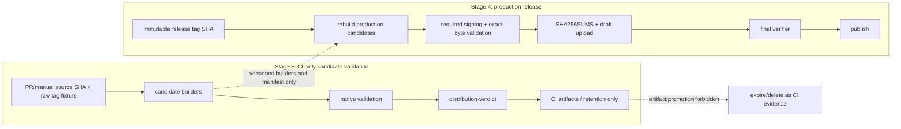

# Проверяемый контракт distribution support и артефактов

## 0. Метаданные

- Тип (instruction stack): `delivery-task` (`model-behavior-baseline + quest-governance + collaboration-baseline + testing-baseline`) + profile `dotnet-desktop-client` + overlay `product-system-design` + context `testing-dotnet` + SPEC governance `quest-mode + spec-linter + spec-rubric + review-loops`; Git delivery дополнительно следует `commit-message-policy + github-delivery-policy + versioning-policy`.
- Владелец: Product Owner / активный пользователь.
- Масштаб: large, отдельный Stage-3 delivery package.
- Целевое семейство / behavior baseline: `GPT-5.6`; owner contract — `instructions/core/model-behavior-baseline.md`.
- Поверхность: `Work / Codex` (`Codex desktop`); продуктовая change surface — root run scripts, standalone Windows/Linux/macOS/Android candidate pipeline, package metadata/templates, canonical asset/support contracts, CI-only evidence и парные root README.
- Effective runtime: фактический model ID/tier, reasoning level и версия клиента не являются validation input этой немодельной delivery-задачи и не влияют на acceptance verdict; repository outcome подтверждается deterministic local/native evidence, fallback — `Не применимо`.
- Execution / evidence runtime: локальный Windows/PowerShell workspace; native verification выполняется на Windows Server 2022, macOS 15 Intel/arm64, Android API 23/36 emulator и чистых Debian 12/13 x64 images.
- Eval baseline / evidence: model eval — `Не применимо`; product/evidence baseline — release `1.27.0` и текущие production `release.published` workflows; runtime UI/data/update behavior не меняется.
- Целевой релиз / ветка: `docs/distribution-support-contract`; prerequisite closeout PR #278 merged as `ad90260b62be899d9f9946e81ce710ed88c2f87a`; SPEC/EXEC base = `origin/main@ad90260b62be899d9f9946e81ce710ed88c2f87a`; future dry-run fixture = `v1.28.0`, публикация запрещена.
- Текущая фаза: `EXEC`; пользователь подтвердил child spec точной фразой `Спеку подтверждаю` 2026-07-19.
- Freshness baseline от 2026-07-18:
  - latest published release = `1.27.0`, target `5aebebcb34eabe35fcdb7a47ff76ffdc2a7e16dd`, 22 assets;
  - Stage 2 доставлен merged PR #277, merge commit `75efc0497af0a1b4678372b67112a8f606ce28c9`;
  - Stage-2 factual delivery journals доставлены отдельным PR #278, closeout commit `fc52779b56e1a168a54367f9f61ceea379fa8fdb`, merge commit `ad90260b62be899d9f9946e81ce710ed88c2f87a`; они являются частью `origin/main` и не входят в prospective Stage-3 PR diff;
  - platform packaging sources на текущем `main` не отличаются от release tag `1.27.0` в проверяемых местах;
  - Linux workflow run `29370756672`, Windows `29370756663`, macOS `29370756703`, Android `29370756710` завершились успешно, но сами package install/launch contracts не проверяли;
  - release assets появлялись уже после публикации release: первый примерно через 94 секунды, последний примерно через 364 секунды; это доказанный Stage-4 atomicity gap, а не scope Stage 3.
- Ограничения:
  - Stage 3 не создаёт, не публикует, не изменяет и не удаляет GitHub Release или его assets;
  - опубликованные assets `1.27.0` immutable: их нельзя backfill-ить checksum-файлом или заменять исправленными пакетами;
  - build-only путь не получает production secrets и имеет только `contents: read`;
  - Windows/Linux/macOS `release.published` workflows, их event/permission/secret/publication paths не меняются в Stage 3;
  - `.github/workflows/android-packaging.yml` меняется только для least-privilege isolation: PR path получает `contents: read` и не видит production signing secrets; production signing secrets доступны только release-only signing/build step, а `contents: write` — только release-only upload job без signing secrets; release APK names/ABI/version/signature/output semantics сохраняются;
  - между merge Stage 3 и delivery Stage 4 действует release freeze: не создавать tag/release; если выпуск потребуется раньше, остановить roadmap и получить отдельное решение, не выдавая Stage-3 candidate за release-ready;
  - наличие asset, успешная сборка или metadata-only validation не повышают платформу до verified support;
  - Windows Authenticode, Apple Developer ID/notarization и новые desktop signing credentials остаются Stage 9;
  - Android production certificate fingerprint является публичным verification contract Stage 3, но production signing и publish gate применяются только к release candidate в Stage 4;
  - draft-first orchestration, atomic publish, public `SHA256SUMS.txt`, tag immutability, idempotency/concurrency и release rollback остаются Stage 4;
  - UI behavior/state не меняется, поэтому новые product UI scenarios и before/after video не требуются; packaged launch/window detection обязательно как distribution smoke.
- Связанные артефакты:
  - master roadmap: `specs/2026-07-17-readme-reliability-roadmap.md`;
  - Stage-2 child spec: `specs/2026-07-17-status-availability-contract.md`;
  - `README.md`, `README.RU.md`;
  - `run.windows.cmd`, `run.linux.sh`, `run.macos.sh`;
  - `.github/workflows/windows-packaging.yml`;
  - `.github/workflows/deb_packaging.yml`;
  - `.github/workflows/osx-packaging.yml`;
  - `.github/workflows/android-packaging.yml`;
  - `src/Unlimotion.Desktop/Unlimotion.Desktop.ForDebianBuild.csproj`;
  - `src/Unlimotion.Desktop/Unlimotion.Desktop.ForMacBuild.csproj`;
  - `src/Unlimotion.Android/Unlimotion.Android.csproj`;
  - `src/Unlimotion.Desktop/ci/deb/*`, `src/Unlimotion.Desktop/ci/osx/*`;
  - `scripts/test-android-build-scripts.ps1`.

Если секция canonical template не применима, это указано явно с причиной.

## 1. Overview / Цель

Сделать distribution-утверждения проверяемыми: один versioned manifest определяет роли и ожидаемые имена артефактов, один resolver разделяет raw Git tag и normalized package version, каждый candidate собирается один раз и проверяется как точный набор байтов на соответствующей платформе, а README latest-release claims сверяются с durable exact-digest support snapshot. Stage-3 dry-run не повышает public support status: promotion возможен только для production bytes, построенных, подписанных и полностью проверенных внутри Stage-4 immutable-tag run.

Outcome contract:

- Success means:
  - все 22 assets release `1.27.0` классифицированы локальным fixture без обращения к сети;
  - `1.2.3` и `v1.2.3` сохраняются как разные raw identities, но дают один `normalizedVersion=1.2.3` и одинаковый filename plan;
  - package filenames и metadata никогда не получают raw `v` prefix;
  - root run scripts работают из произвольного current directory, передают аргументы и exit code; shell scripts имеют shebang, strict mode и executable bit;
  - build-only workflow собирает Windows, Linux, macOS и Android candidates без release mutation и без production credentials;
  - exact SHA-256 каждого candidate сохраняется до validation, после native smoke и в aggregate evidence;
  - `.deb` из одной сборки устанавливается и запускается в clean Debian 12 и Debian 13 x64 images;
  - AppImage имеет отдельный structural/launch verdict и не наследует `.deb` support;
  - Windows, обе macOS architectures и Android APK проходят platform-native metadata, architecture, signature-readiness и launch gates в определённой ниже полноте;
  - current release `1.27.0` остаётся честно помеченным Preview там, где новый exact-artifact gate для него не пройден;
  - current README download table машинно сопоставлен с release `1.27.0`, asset names/digests и evidence levels; candidate evidence отображается отдельно как CI-only и не переносится на release;
  - EN/RU README синхронно объясняют support/evidence границы и исправленные source/AppImage инструкции.
- Итоговый output:
  - canonical asset/support schemas + manifest + frozen release fixture + durable current support snapshot;
  - shared identity/planning/validation scripts;
  - исправленные run/package scripts и package metadata;
  - least-privilege Android PR/release workflow split без изменения release asset contract;
  - read-only build/validate workflow с native matrix;
  - machine-readable evidence + CI-only checksum manifest;
  - paired README corrections;
  - отдельный Stage-3 PR.
- Stop rules:
  - не начинать EXEC до отдельного approval этой spec;
  - не запускать release-triggered workflows и не использовать publish mode в Stage-3 validation;
  - остановить EXEC, если Android workflow security test находит production-secret reference либо write permission в job/step, достижимом из `pull_request`, `push` или `workflow_dispatch`;
  - не изменять Windows/Linux/macOS production publisher workflows и не менять Android release output semantics; единственное publisher-изменение Stage 3 — обязательное least-privilege hardening Android workflow; Stage-3 delivery и Stage-4 migration разделяет release freeze;
  - не считать rebuild теми же байтами: smoke обязан читать уже созданный candidate и повторно сверять hash;
  - не смешивать metadata-only и launch-verified verdicts;
  - не повышать Android minimum API автоматически, если API 23 smoke не проходит; остановиться и запросить product decision;
  - не завершать Stage 3 при падающей mandatory matrix cell, невалидном evidence aggregate или EN/RU drift;
  - не повышать public latest-release support по candidate dry-run независимо от его результата;
  - не объявлять Stage-4 atomic release AC закрытым.

## 2. Текущее состояние (AS-IS)

### 2.1 Release inventory и workflow contract

Release `1.27.0` содержит 22 assets:

- metadata/feed: `RELEASES`, `releases.win.json`, `releases.linux.json`, `releases.osx.json`, `releases.osx-arm64.json`;
- updater packages: четыре `*-full.nupkg` для Windows, Linux, macOS x64 и macOS arm64;
- Windows: `Unlimotion-win-Setup.exe`, `Unlimotion-win-Portable.zip`, `Unlimotion-1.27.0-win-x64-portable.zip`;
- macOS: `Unlimotion-osx-Setup.pkg`, `Unlimotion-osx-Portable.zip`, `Unlimotion-1.27.0-osx-x64.pkg`, а также три arm64-аналога;
- Android: `Unlimotion-1.27.0-android-arm64.apk`, `Unlimotion-1.27.0-android-x64.apk`;
- Linux: `Unlimotion-1.27.0.deb`, `Unlimotion.AppImage`.

GitHub API предоставляет `sha256` digest каждого asset, но проект не генерирует собственного полного `SHA256SUMS.txt`. Velopack JSON покрывает только updater `.nupkg`.

Текущие Windows/Linux/macOS workflows начинают package/upload после события `release.published`. Поэтому release становится видимым раньше полного набора assets. Stage 3 фиксирует build/validation layer, но не исправляет этот порядок: atomic draft-first publish принадлежит Stage 4.

Version logic дублируется по workflows. Linux переименовывает `.deb` через raw tag, Windows raw portable ZIP и Android APK также используют raw `${{ github.ref_name }}`, хотя package metadata и Velopack получают normalized SemVer. Future tag `v1.28.0` поэтому способен создать filename/metadata drift.

Linux/macOS manual paths имеют `contents: write`, удаляют существующие assets и публикуют. Windows не имеет manual build-only path. Ни один desktop workflow не выполняет package install + GUI launch smoke до upload.

Android workflow запускается на `push`, `pull_request`, `workflow_dispatch` и `release.published`, но сейчас имеет workflow-level `contents: write`, global `GITHUB_TOKEN` и production signing secret env на общем APK build step. Signing arguments добавляются только для release, однако token/secret references остаются достижимыми из PR job graph. Stage 3 обязан устранить exposure до native PR matrix, сохранив release trigger/signing/asset semantics.

### 2.2 Root source entry points

- `run.windows.cmd` содержит только CWD-relative `dotnet run --project ...`.
- `run.linux.sh` и `run.macos.sh` также состоят из одной CWD-relative команды, не имеют shebang/`set -euo pipefail`, tracked как `100644` и не передают пользовательские аргументы после `--`.
- Текущий README работает лишь при запуске из корня, но это ограничение задаётся хрупкостью scripts, а не продуктовым требованием.

### 2.3 Debian package `1.27.0`

Проверен exact asset:

- name: `Unlimotion-1.27.0.deb`;
- size: `45,446,086` bytes;
- SHA-256: `a192642417ac375ce1230b5cd89f4a11d99de4dd2a638e259b545cfcc3995a13`;
- raw control: `Package: Unlimotion.Desktop`, `Architecture: amd64`, `Version: 1.27.0`, `Maintainer: Kibnet`, `Description: Package Description`;
- payload содержит `/usr/local/bin/Unlimotion.Desktop`, wrapper `/usr/bin/Unlimotion`, desktop file mode `0544` и icon mode `0744`.

Текущий dependency list содержит `libgcc1`, ICU alternatives только до `libicu70` и SSL только до `libssl3`. Он не разрешается как vendor package contract для Debian 12 (`libgcc-s1`, `libicu72`) и Debian 13 (`libgcc-s1`, `libicu76`, `libssl3t64`). Успешный build не доказывает installability.

Raw package name с uppercase не соответствует Debian Policy. `dpkg-deb -f Package` нормализует вывод и поэтому не является достаточным oracle: validator обязан читать raw control archive. Package-owned `/usr/local` также запрещён policy. Desktop entry содержит deprecated `Encoding`, placeholder description, `.ico` и незарегистрированные categories.

`Packaging.Targets 0.1.232` при default `SymlinkAppHostInBin=true` сам добавляет app-host symlink в `/usr/local/bin`; одного изменения `create-symlink.sh` недостаточно. Target configuration должен явно отключить этот implicit symlink либо package builder должен быть заменён, а `/usr/bin/Unlimotion` должен остаться explicit package content.

Приложение не имеет содержательного non-GUI `--version`/health mode; `Program` всегда запускает classic desktop lifetime. Поэтому launch smoke обязан обнаружить реальное окно под Xvfb.

### 2.4 AppImage `1.27.0`

- size: `59,778,240` bytes;
- SHA-256: `ae1033e0131e39dcdbdb75470b48fa1c01318838d59a1cdb51f2dd9f09a665c1`;
- format/architecture: AppImage ELF x86-64;
- embedded version/RID: `1.27.0`, `linux-x64`, `x64`;
- внутренний executable совпадает с `.deb` binary для release `1.27.0`, но payload также содержит лишние Debian-specific `ci/deb/*`.

На host с FUSE3 без FUSE2 прямой запуск падает на `libfuse.so.2`. Official extract-and-run fallback может доказать payload launch, но не доказывает direct FUSE mount. README сейчас не объясняет эту границу, а RU формулировка «универсальный вариант» сильнее фактов.

### 2.5 Windows `1.27.0`

- `Unlimotion-win-Setup.exe`: SHA-256 `8d8c0077aec0e404102870c3a2ede5fa868b10a4670a331a46be38789be92bdc`, Product/File version `1.27.0`, `Get-AuthenticodeSignature = NotSigned`.
- Velopack portable ZIP имеет ожидаемый `.portable/current/Unlimotion.exe/Update.exe` layout.
- Дополнительный `Unlimotion-1.27.0-win-x64-portable.zip` содержит только большой `Unlimotion.Desktop.exe` и два PDB, дублирует portable role и примерно на 25 MB больше canonical README asset.
- README caveat об отсутствии Authenticode правдив; Stage 3 не должен превращать unsigned state в failure, но обязан фиксировать его как `signatureProfile=unsigned`.

### 2.6 macOS `1.27.0`

- Portable x64 содержит Mach-O `x86_64`, arm64 — `arm64`.
- Оба bundles имеют `CFBundleIdentifier=com.Unlimotion`, version `1.27.0`, executable `Unlimotion.Desktop.ForMacBuild`, minimum OS `12.0.0`.
- Mach-O signatures ad-hoc (`CodeDirectoryFlags=0x2`), оба Setup.pkg не имеют Developer ID package signature.
- `Unlimotion.Desktop.ForMacBuild.csproj` содержит stale `CFBundleExecutable=Unlimotion.Desktop.ForMacOSBuild`, хотя фактический `Info.plist` и binary используют `Unlimotion.Desktop.ForMacBuild`.
- Packaging shell scripts не fail-fast, зависят от CWD и недостаточно цитируют arguments.
- Native evidence требует явных runners: `macos-15-intel` для x64 и `macos-15` для arm64; mutable `macos-latest` не является архитектурным контрактом.

### 2.7 Android `1.27.0`

Оба APK имеют version `1.27.0`, versionCode `353`, minSdk 23, targetSdk 36 и ровно заявленный ABI. Exact SHA-256:

- arm64: `bc17ff84bc6f55bdeaeca428489459adeb06c441a72d3bca59f1d2bc5600f0ac`;
- x64: `9d8a245c6dc3a26ebb192ddbffb14a55670c04afdaca96052d30feb2b1b0b4f3`.

Оба проходят `apksigner verify`, используют v1/v2/v3 schemes и одного signer с certificate SHA-256 `1cca6de2bb329c14f89cd0441998e00df601e440d2a9b30c29bdd2cf0a321011`. Этот ожидаемый production fingerprint не закреплён в repository contract.

Workflow проверяет наличие native libraries/symbols, но не запускает `zipalign -c`, `aapt` contract, `apksigner verify`, certificate comparison или emulator install/launch. Дополнительно проект декларирует minSdk 23, а OpenSSL/libssh2/libgit2 собираются NDK toolchain для API 24. README осторожно говорит о declared minimum, но runtime support API 23 пока не доказан.

## 3. Проблема

Distribution truth сейчас выводится из наличия release assets и успешных build jobs. Это недостаточно: имена зависят от двух несовместимых представлений tag, package metadata расходится с целевыми OS, platform signatures только частично проверяются, workflows могут публиковать до smoke, а README не имеет machine-verifiable связи между support claim и exact artifact digest.

## 4. Цели дизайна

- Один static contract для asset naming, roles, platforms, architectures и required evidence.
- Fail-closed normalization: raw identity отдельно от package version.
- Build once, validate exact bytes: никаких rebuild/repack между hash и smoke.
- Native evidence: каждая support cell проверяется на своей OS/architecture либо честно остаётся metadata-only.
- No remote mutation: Stage-3 dry-run заканчивается CI artifacts/reports.
- Traceability: source SHA, raw tag, normalized version, runner/image identity и artifact SHA присутствуют в каждом report.
- Honest support levels: `present`, `metadataVerified`, `launchVerified`, `productionReady` не смешиваются.
- Backward compatibility: исторические assets `1.27.0` классифицируются, но не изменяются; package identity `unlimotion.desktop` сохраняется для upgrade continuity.
- Production isolation: Stage-3 candidate pipeline не вызывает publishers; Windows/Linux/macOS publishers не меняются, а Android publisher получает только least-privilege separation без изменения release output semantics. Stage 4 подключает проверенные builders после собственного audit/approval.
- Durable docs trace: public release claim имеет exact tag/source/asset/digest/evidence mapping; CI-only candidate claim отделён.
- Minimal product impact: runtime update behavior, UI и data format не меняются.

## 5. Non-Goals (чего НЕ делаем)

- Не создаём новый Git tag, GitHub Release, draft release или release asset.
- Не меняем и не удаляем 22 assets release `1.27.0`.
- Не публикуем CI-only `SHA256SUMS.txt`; public checksum publication — Stage 4.
- Не строим единый atomic release orchestrator, final release verifier, concurrency/idempotency или rollback published release — Stage 4.
- Не добавляем Windows/macOS signing credentials, Authenticode, Developer ID, notarization или stapling — Stage 9.
- Не генерируем, не ротируем и не раскрываем Android production private key; repository хранит только публичный expected certificate fingerprint.
- Не обещаем Ubuntu/derivatives, Linux ARM, native Wayland, iOS или Browser support.
- Не добавляем APT repository и не готовим package к Debian Archive submission.
- Не меняем updater runtime behavior и `UpdateManager.IsInstalled` semantics.
- Не выбираем и не активируем canonical future tag-write policy: Stage 3 принимает/нормализует обе stable формы, Stage-4 child spec решает publication form после consumer/update audit.
- Не меняем Windows/Linux/macOS `*packaging.yml` publishers. В Android publisher разрешено только минимальное least-privilege hardening существующих PR/release paths; migration на общий production orchestrator остаётся Stage 4.
- Не удаляем legacy/duplicate asset producers до отдельного Stage-4 release-set decision.
- Не переделываем всю README information architecture; полный docs redesign остаётся Stage 7.
- Не добавляем фиктивный `--version` как замену GUI launch smoke.

## 6. Предлагаемое решение (TO-BE)

### 6.1 Распределение ответственности

- `distribution/release-assets.schema.json` — строгая JSON Schema static contract.
- `distribution/support-matrix.schema.json` — схема durable public-claim snapshot.
- `distribution/release-assets.json` — versioned asset catalog: tag policy, asset roles/templates, platform/architecture, validator/signature/support requirements и legacy classification.
- `distribution/fixtures/release-1.27.0.json` — frozen local inventory всех 22 names/sizes/digests/roles и release target SHA; PR tests не зависят от GitHub API.
- `distribution/support-matrix.json` — current release tag/source SHA, exact asset digests, evidence level/OS cells/caveats, durable evidence URLs и `lastPublishedAndroidVersionCode`; README validator и production-monotonic resolver используют этот source of truth.
- `scripts/Resolve-ReleaseIdentity.ps1` — единственный parser raw tag -> normalized SemVer + filename plan; умеет писать JSON и GitHub outputs.
- `scripts/test-distribution-contract.ps1` — schema, unique ids, case-insensitive collisions, fixture completeness, naming, source/tag identity, workflow-security gates и deterministic positive/negative fixtures.
- `scripts/Test-DistributionArtifact.ps1` — common artifact/evidence envelope, hashes, expected filename/version/arch/signature profile и native-validator dispatch.
- `scripts/Build-LinuxDistribution.sh` — один clean publish payload, затем packaging-only `.deb`/AppImage из копий тех же bytes без второго `dotnet publish`.
- `scripts/smoke-linux-artifacts.sh` — `.deb`/AppImage structural и Debian-container launch checks.
- `scripts/Test-WindowsDistribution.ps1`, `scripts/test-macos-distribution.sh`, `scripts/test-android-distribution.sh` — named native validators/smokes.
- `scripts/Test-ReadmeDistributionContract.ps1` — EN/RU rows -> durable support snapshot verifier.
- `scripts/test-run-entrypoints.ps1` — unrelated-CWD/arguments/exit regression с fake `dotnet`.
- New candidate builders use script-relative paths, strict mode, quoted arguments, explicit output и single-build inputs; Windows/Linux/macOS publisher scripts остаются AS-IS до Stage 4.
- `.github/workflows/distribution-validation.yml` — standalone PR/manual read-only orchestration и stable `distribution-verdict`; current release workflows не вызываются.
- `.github/workflows/android-packaging.yml` — единственное current-publisher изменение: workflow-level default `contents: read`, отсутствие global `GITHUB_TOKEN`/production secret env, PR build без production secrets, release-only production signing/build step, отдельный release-only upload job с `contents: write` и без signing secrets. Release APK contract остаётся прежним.
- README EN/RU — current release truth, source entry points, AppImage FUSE/fallback и evidence-level semantics.

### 6.2 Детальный дизайн

#### Canonical manifest

Static manifest не содержит transient source SHA или build result. Он задаёт contract:

```json
{
  "schemaVersion": 1,
  "product": "Unlimotion",
  "tagPolicy": {
    "acceptedRead": ["MAJOR.MINOR.PATCH", "vMAJOR.MINOR.PATCH"],
    "publicationWrite": "deferred-to-stage-4",
    "stableOnly": true,
    "minimumVersion": "0.0.1"
  },
  "supportLevels": [
    "present",
    "metadataVerified",
    "launchVerified",
    "productionReady"
  ],
  "assets": [
    {
      "id": "linux-deb-x64",
      "platform": "linux",
      "architecture": "x64",
      "role": "userInstaller",
      "filenameTemplate": "Unlimotion-{normalizedVersion}.deb",
      "validatorProfile": "debian-amd64",
      "requiredEvidence": ["metadata", "install", "launch"],
      "releaseVisible": true,
      "legacy": false
    }
  ],
  "relations": [
    {
      "feedAssetId": "linux-feed",
      "packageAssetId": "linux-updater-package",
      "channel": "linux"
    }
  ]
}
```

Required schema rules:

- unique asset ids;
- unique case-insensitive generated names per supported fixture;
- exact role enum values only: `userInstaller`, `userPortable`, `updaterPackage`, `updaterFeed`, `legacyDuplicate`; unknown `installer` negative fixture fails;
- no raw-tag placeholder in filenames/package metadata;
- every release-visible asset has producer, role, platform, architecture, validator profile and required evidence;
- legacy/duplicate assets имеют owner и migration stage, но не выдаются за canonical user choice;
- updater feeds задают typed relation к exact `.nupkg`: channel/version/name/size/hash algorithm/value проверяются по фактическим package bytes;
- all 22 `1.27.0` fixture assets resolve to exactly one catalog entry; unexpected/missing/duplicate/zero-byte/stale-version/hash-mismatch fail.

Roles имеют закрытый enum `userInstaller`, `userPortable`, `updaterPackage`, `updaterFeed`, `legacyDuplicate`. Windows raw portable ZIP и два versioned direct macOS `.pkg` фиксируются как legacy duplicates до Stage-4 decision; они не удаляются в Stage 3.

`support-matrix.json` отдельно связывает user-facing cell с `releaseTag`, release source SHA, asset ids/names/SHA-256, evidence level, фактически проверенной OS/version/architecture, caveats и durable evidence URL. Для `1.27.0` он фиксирует только доказанные cautious states. CI-only `v1.28.0` candidate reports в этот snapshot не записываются. Negative fixture с тем же tag/name/version, но другим digest обязан отклоняться.

#### Release identity

`Resolve-ReleaseIdentity.ps1` принимает `-RawTag`, `-SourceSha`, `-WorkflowSha`, `-TagBinding`, `-AndroidVersionCode`, `-AndroidVersionCodePolicy`, `-Manifest` и условный `-SupportMatrix`, затем возвращает immutable JSON. `-SupportMatrix` обязателен при policy `production-monotonic`; resolver не читает GitHub environment variables самостоятельно — caller передаёт все значения явно.

```json
{
  "rawTag": "v1.28.0",
  "normalizedVersion": "1.28.0",
  "sourceSha": "<40 lowercase hex>",
  "workflowSha": "<40 lowercase hex>",
  "tagBinding": "notApplicable",
  "androidVersionCode": 1,
  "androidVersionCodePolicy": "ci-test",
  "androidVersionCodeSource": "github.run_number",
  "lastPublishedAndroidVersionCode": 353,
  "filenamePlan": {}
}
```

Rules:

- принимаются только `MAJOR.MINOR.PATCH` и `vMAJOR.MINOR.PATCH`, версия не ниже `0.0.1`;
- uppercase `V`, leading zero, partial version, prerelease и build metadata отклоняются;
- raw tag используется только для Git checkout/ref и будущего GitHub API target;
- normalized version используется для every filename, assembly/package/APK/bundle metadata и feed version;
- `1.28.0` и `v1.28.0` дают один filename plan, но разные `rawTag`;
- job после checkout доказывает `HEAD == sourceSha`; `workflowSha` фиксирует commit workflow definition; tag-aware release audit дополнительно доказывает peeled tag target, а synthetic fixture имеет `tagBinding=notApplicable`;
- Android `versionCode` приходит явным resolver input/output и всегда находится в диапазоне `1..2100000000`;
- policy `ci-test`: caller передаёт workflow-local `github.run_number` текущего `distribution-validation` workflow; rerun того же workflow run сохраняет code; значение может быть меньше либо равно published value, но допустимо только с `signatureProfile=test` и никогда не даёт `productionReady`;
- policy `production-monotonic`: будущий Stage-4 orchestrator передаёт значение, выделенное отдельным production version-code allocator; resolver требует `androidVersionCode > supportMatrix.lastPublishedAndroidVersionCode` (`353` для 1.27.0);
- `GITHUB_RUN_NUMBER` нумеруется отдельно для каждого workflow и не считается repository-global production sequence; Stage 4 отдельно определяет allocator policy, а rerun одного immutable production candidate повторно использует сохранённый identity plan, не выделяя новый code; zero/negative/overflow/non-monotonic production values fail closed;
- every distribution build получает explicit normalized `GitHubRefName`/build label и source SHA; generated `UnlimotionAppNameSuffix`/assembly metadata и реальный window title не могут содержать raw `v`;
- platform evidence независимо повторяет identity и aggregate verifier сравнивает все reports.

#### Build-only orchestration



`distribution-validation.yml`:

- triggers: every `pull_request` и `workflow_dispatch`; path filter не используется, чтобы stable final check никогда не зависал `Pending`;
- permissions: workflow/job `contents: read`; no OIDC/package/release write;
- first job computes relevant diff with repository-native `git diff`; irrelevant PR skips producers, но stable final verdict выполняется и возвращает `notApplicable` success;
- manual input содержит только raw tag fixture, default `v1.28.0`; source всегда immutable `github.sha` выбранного run ref и не переопределяется input;
- build jobs standalone и не вызывают existing publisher workflows;
- external `owner/repo@...` references pinned to reviewed full commit SHA; local `./...` actions/workflows разрешены как same-commit references и не получают syntactically impossible `@SHA`;
- deterministic artifact names включают platform, architecture, `sourceSha[0..11]` и `github.run_attempt`; upload uses `if-no-files-found: error`, `overwrite: false`, seven-day retention and records action `artifact-id`/`artifact-digest`;
- each mandatory producer primary upload from `contract` through the Android API cells has a separately named `*-receipt` artifact; contract and Android API receipts use `distribution-evidence-transport-receipt` and bind the uploaded artifact name/id/digest to exact payload-file hashes;
- Android API 23/API 36 candidate download and final aggregate download each emit `download-transport.json` with both bounded-attempt outcomes, selected attempt, cleanup and exhaustion before native/aggregate evidence is accepted;
- Unix executable payloads передаются внутри tar archive, потому что artifact transport не сохраняет mode; extraction validates stored mode, restores it and re-hashes the unchanged file bytes;
- build jobs upload exact candidates + JSON evidence as CI artifacts; failure-path evidence emitted under `if: always()` where runner is alive;
- final job id/name = `distribution-verdict`, declares all producer jobs in `needs`, uses `if: ${{ always() }}`, inspects every `needs.<job>.result`, tolerates download-step absence only до aggregate script и затем fails on missing artifact/matrix cell;
- aggregate repeats hashes, validates complete manifest/support/feed coverage, writes CI-only `SHA256SUMS.txt`, and stops;
- negative contract fixture supplies a failed/missing producer result and proves final verdict is `failure`, never `skipped`;
- ordinary PR uses frozen `1.27.0` fixture and local schema tests, не зависит от GitHub release API;
- optional manual latest-release audit may read public API, but cannot mutate it.

Trigger/source identity matrix:

| Trigger | `sourceSha` | `workflowSha` | raw tag / binding | Required assertion |
| --- | --- | --- | --- | --- |
| `pull_request` | `github.sha` merge commit | `job.workflow_sha` | synthetic fixture, `notApplicable` | checkout exact merge SHA; record head/base SHAs separately |
| `workflow_dispatch` | `github.sha` of selected workflow ref | `job.workflow_sha` | input fixture, `notApplicable` | no independent source ref input; `HEAD == sourceSha` |
| Future Stage-4 release | peeled `refs/tags/<rawTag>^{commit}` | `job.workflow_sha` | actual tag, `required` | tag exists, peeled SHA equals immutable candidate SHA |

Local reusable logic, если появится, берётся только через `./...` из caller commit; caller передаёт exact `sourceSha`, а callee повторяет checkout/assertion. Stage 3 не создаёт release-triggered caller.

Current `.github/workflows/windows-packaging.yml`, `deb_packaging.yml` и `osx-packaging.yml` остаются byte-for-byte unchanged в Stage 3 и служат AS-IS evidence/Stage-4 migration targets. `.github/workflows/android-packaging.yml` меняется только в пределах следующего security contract:

- workflow-level/default permissions = `contents: read`; global `GITHUB_TOKEN` и global production signing secret env удалены;
- `android-build` имеет `contents: read`; ни один step, достижимый из `pull_request`, `push` или `workflow_dispatch`, не содержит production `ANDROID_SIGNING_*` secret reference или write token;
- production signing secrets объявлены только на release-only preparation/signing/build path с условием `github.event_name == 'release' && github.event.action == 'published'`; temporary keystore удаляется и signing environment очищается под `if: always()` сразу после build;
- `android-release-upload` имеет `needs: android-build`, выполняется только на `release/published`, получает единственное повышение `contents: write`, не checkout-ит repository, не запускает build scripts и не получает signing secrets;
- upload job скачивает exact same-run artifact, сверяет ожидаемые два filename, candidate SHA-256, artifact id/digest и только затем загружает APK; `GITHUB_TOKEN` передаётся только pinned release-upload action внутри этого job;
- все external actions в изменённом Android workflow pin-ятся reviewed full commit SHA; existing release trigger, tag/source resolution, signing properties, два APK filename и release asset contract функционально неизменны;
- `scripts/test-android-build-scripts.ps1` и workflow-security fixtures статически доказывают event reachability, permission/secret/job separation, cleanup, pinned actions, exact handoff и сохранение release command/output contract.

Stage-3 artifacts test-signed/CI-only и не могут быть promoted. Stage 4 потребляет manifest/builders/validation contract, заново строит production candidate из immutable tag SHA, подписывает и проверяет exact Stage-4 bytes, а затем загружает их в draft и публикует; Stage-3 evidence artifacts не переносятся в release.

#### Root entry points

- Windows resolves repo root through `%~dp0`, quotes project path, forwards arguments after `--` and returns exact `dotnet` exit code.
- Linux/macOS resolve `SCRIPT_DIR`, use `#!/usr/bin/env bash`, `set -euo pipefail`, quote project path, forward `"$@"` after `--` and remain executable (`100755`).
- Regression invokes all scripts from a temporary unrelated CWD against a fake `dotnet` shim, checks exact argv and injected non-zero exit code; it does not start the UI.

#### Debian package

Package identity remains `unlimotion.desktop` to preserve upgrade continuity. Target metadata:

- raw `Package: unlimotion.desktop`;
- `Architecture: amd64`;
- normalized version without `v`;
- `Maintainer: Kibnet Philosoff <kibnet@hotmail.com>`;
- meaningful description and `Homepage: https://github.com/Kibnet/Unlimotion`;
- `Priority: optional`, suitable section;
- dependencies cover both target releases: `libgcc-s1`, `libicu76 | libicu72`, `libssl3t64 | libssl3` and verified .NET/Avalonia runtime dependencies; final exact list follows official .NET 10 guidance plus clean-image/`ldd` evidence, not Packaging.Targets defaults alone.

Target layout:

- application under `/usr/lib/unlimotion/`;
- launcher under `/usr/bin/Unlimotion`;
- no package-owned file/symlink under `/usr/local`;
- new candidate builder не вызывает `Packaging.Targets/CreateDeb`: он формирует explicit Debian staging tree/control archive и запускает `dpkg-deb --build --root-owner-group`; launcher выполняет `/usr/lib/unlimotion/Unlimotion.Desktop` с `"$@"`;
- desktop entry/icon modes `0644`, executables `0755`;
- canonical PNG icon and valid desktop entry; remove deprecated `Encoding`, placeholder copy and invalid categories;
- `desktop-file-validate` and targeted `lintian` findings are recorded; known non-target lintian noise must be allowlisted narrowly with rationale, not globally ignored.

`Build-LinuxDistribution.sh` выполняет ровно один clean `dotnet publish` в canonical `artifacts/distribution-validation/linux-x64/payload`. Перед packaging каталог закрывается от записи и хешируется. AppImage staging получает копию только application payload; `.deb` staging копирует те же executable bytes и отдельно добавляет Debian integration files. Второй restore/publish и MSBuild target с dependency on `Publish` запрещены. Builder фиксирует цепочку hashes `canonical staged executable -> executable extracted from .deb -> executable extracted from AppImage`; все три SHA-256 обязаны совпасть. One `.deb` is built once. The same read-only file and SHA are mounted into `debian:12-slim` and `debian:13-slim`; resolved image digest is recorded. Per image order is mandatory:

1. record `/etc/os-release`, `dpkg --print-architecture`, `uname -m`, image digest and candidate SHA;
2. `apt-get update`;
3. install exact package in the target container; no Xvfb/xdotool or other test-runtime package is ever installed there after candidate installation;
4. run `apt-get check`, `dpkg --audit`, metadata/path/mode/ownership assertions; enumerate every ELF executable/shared object under `/usr/lib/unlimotion`, run dynamic-loader/`ldd` closure checks and fail on any unresolved dependency;
5. hash the target container's installed-package closure (`dpkg-query`) immediately after candidate installation;
6. start Xvfb/xdotool only on the runner or a separate pinned harness sidecar, expose the ephemeral X11 socket to the unchanged target container and record harness image/tool identity;
7. create non-root user and isolated writable HOME in the target without an APT transaction;
8. launch `/usr/bin/Unlimotion --config=<isolated path>` against the external X server;
9. within 30 seconds assert live process + visible `Unlimotion` window and absence of fatal native-load exceptions;
10. terminate only the tracked process tree, retain log/report, and require the target `dpkg-query` closure hash to equal step 5;
11. re-hash candidate and require unchanged SHA. A negative fixture removes one required runtime dependency from package metadata; external harness presence must not turn unresolved-loader/launch evidence into PASS.

Upgrade-continuity cell выполняется отдельно на Debian 12 и 13. Exact baseline `.deb` 1.27.0 скачивается по pinned URL/name и принимается только при SHA-256 `a192642417ac375ce1230b5cd89f4a11d99de4dd2a638e259b545cfcc3995a13`. Поскольку его stale control dependencies не разрешаются на target OS, он устанавливается migration-only через `dpkg --force-depends -i` после явной установки фактических runtime libraries; это не support evidence 1.27.0. Test фиксирует normalized dpkg identity, создаёт sentinel в isolated non-root user data/config, затем выполняет `apt install ./<candidate>.deb` как upgrade. После upgrade обязаны отсутствовать package-owned `/usr/local/*`, новый launcher/desktop paths и package version корректны, sentinel неизменен, candidate запускается под Xvfb. Clean-install и upgrade verdicts не взаимозаменяемы.

#### AppImage

AppImage uses an independent matrix and verdict:

- ELF x64, AppRun, desktop entry, embedded RID/version/architecture and payload policy;
- Debian-specific `ci/deb/*` forbidden from payload;
- internal main executable hash equals `.deb` executable hash or an explicit reviewed reason blocks completion;
- a clean target installs only manifest/README-declared AppImage runtime prerequisites; `APPIMAGE_EXTRACT_AND_RUN=1` + the same external Xvfb sidecar/socket + non-root user proves extract-and-run launch on Debian 12/13 without adding harness libraries to the target;
- evidence records `launchMode=appimage-extract-and-run`;
- direct FUSE is `notVerified` unless a separate host/VM with `/dev/fuse` and FUSE2 runs the exact artifact;
- README documents Debian 12 `libfuse2`, Debian 13 `libfuse2t64` and official extract-and-run fallback without calling fallback direct-FUSE support.

#### Windows

On `windows-2022`:

- validate manifest names, exact hashes and Product/File version; Velopack Setup.exe bootstrap may itself report PE `I386`, but its installed application payload and canonical portable executable must be PE x64;
- inspect canonical Velopack portable layout and forbid accidental PDBs from user-facing portable artifacts;
- extract portable asset into isolated directory, launch exact executable, wait for process/window, terminate tracked process;
- exercise Setup.exe silent install in disposable runner context, locate installed app, launch/window-check, then uninstall/cleanup;
- run `Get-AuthenticodeSignature`; current `NotSigned` is expected Stage-3 caveat and evidence value, not `productionReady`;
- legacy raw portable ZIP remains classified, content-checked and excluded from canonical support claim.

#### macOS

Native matrix:

- x64: `macos-15-intel`;
- arm64: `macos-15`.

Each job records `sw_vers`, `uname -m`, runner image metadata and exact artifact hash; validates `plutil`, bundle id/version/executable, Mach-O architecture/minimum OS, portable/package contents, `codesign` state and `pkgutil --check-signature`; installs/extracts exact package, launches native app, waits for process/window and cleans up. Ad-hoc/unsigned state remains an explicit caveat. Cross-publish without native launch cannot produce `launchVerified`.

Packaging scripts use strict mode, script-relative paths, validated version/RID inputs and quoted arguments. Stale csproj `CFBundleExecutable` is aligned with actual `Unlimotion.Desktop.ForMacBuild` without changing bundle identity.

#### Android

- Both APKs: normalized filename/version/build label, expected application id, explicit resolver `androidVersionCode`, min/target SDK, exact single ABI, native libraries/symbols, `zipalign -c`, `aapt`/`apkanalyzer`, `apksigner verify` and certificate report.
- `androidVersionCodePolicy=ci-test` принимает workflow-local `github.run_number`, допускает значение `<= lastPublishedVersionCode` только для test signature/non-promotable candidate. `production-monotonic` в Stage 4 принимает independently allocated code и требует `> lastPublishedVersionCode`; workflow-local run number не является production allocator.
- Native cache использует two-phase exact-key protocol. До restore создаётся canonical `native-inputs.json`: Android API level, NDK revision, host/toolchain triples, ABI set, OpenSSL/libssh2 versions и source hashes, exact libgit2 commit, native package version и hashes всех build scripts. `nativeInputDigest = SHA256(canonical native-inputs.json)`; primary key = `android-native-v2-<runner-os>-<runner-arch>-<nativeInputDigest>`. Restore разрешён только по exact key, без `restore-keys`; cache paths предварительно очищаются и разделены по API/input digest.
- Cache bundle содержит outputs, nupkg и `native-provenance.json`. На hit validator повторно вычисляет input digest, требует equality requested/matched key и всех provenance inputs, пересчитывает nupkg/file SHA-256 и отклоняет missing/mismatched/cross-API/partial evidence. На miss выполняется clean build; только после полной artifact/provenance validation bundle сохраняется через `actions/cache/save` под exact primary key. Failed/partial build не сохраняется. Output nupkg SHA хранится в provenance/evidence, но не входит в pre-build restore key.
- Positive/negative fixtures покрывают miss -> clean build -> validate -> save, exact hit -> validate -> reuse без native rebuild, API-23 request с API-24 provenance, changed nupkg bytes, missing provenance, requested/matched key mismatch и partial output.
- Build-only PR candidates use an ephemeral test keystore and are marked `signatureProfile=test`; they can prove signing mechanics but never `productionReady`.
- Release candidate must match public production certificate SHA-256 `1cca6de2bb329c14f89cd0441998e00df601e440d2a9b30c29bdd2cf0a321011` on both APKs and have the same signer count/fingerprint.
- Align native toolchain API with declared minSdk 23 and run exact x64 APK on API 23 and current target/API 36 emulators using command-line SDK tooling. Assert install, activity start, live process and fatal-free logcat.
- arm64 APK remains metadata/signature verified unless a native arm64 device/runner is available; x64 emulator success must not be described as arm64 launch evidence.
- If native dependencies cannot build/run on API 23, EXEC stops. Raising declared minimum to 24 or changing product claim requires a new explicit user decision; spec approval alone does not authorize it.

#### Evidence envelope

Every platform report uses one schema and includes:

- schema version, outcome and support level;
- raw tag, normalized version, source SHA, workflow SHA, tag-binding mode, manifest/support-snapshot SHA;
- asset id/name/size/SHA-256 before and after validation;
- OS name/version, architecture, runner/container identity and image digest where available;
- package metadata verdict;
- signature profile/status/fingerprint where applicable;
- install mode, launch mode, process/window/log result;
- target runtime/ELF closure, pre/post installed-package closure hash and external GUI-harness location/image/tool identity where applicable;
- explicit skipped/metadata-only reason;
- Android versionCode policy/source/last-published value, native input digest, API/NDK/toolchain/source/package SHA, requested/matched cache key, cache hit/save outcome and provenance where applicable;
- CI transport artifact name/id/digest, retention, receipt payload closure and original/restored Unix mode where applicable;
- client-level download-transport scope, both attempt outcomes, selected attempt, cleanup and exhausted state where applicable;
- retry classification, attempt/maxAttempts, cleanup action and terminal error;
- validator versions and UTC timestamps.

Aggregate fails on missing/duplicate/unexpected asset, source/workflow mismatch, hash drift, feed-to-package relation drift, unsupported status promotion, incomplete mandatory cell or invalid schema. OS/version is part of the support-cell key: Windows Server 2022 and macOS 15 CI launch evidence cannot be broadened to generic Windows/macOS consumer support, а Mach-O `minos=12` остаётся metadata only. `productionReady` is derived, never supplied as a free-form workflow input.

### 6.3 User-Observable Scenarios

| Scenario | User action / trigger | Expected visible result / output | Evidence required | Covered by AC |
| --- | --- | --- | --- | --- |
| Source entry point | Запустить любой `run.*` из другой папки с `--config=...` | Правильный project/argument/exit code, без зависимости от CWD | fake-dotnet argv/exit report | S3-AC-04 |
| Future-tag dry-run | Запустить manual candidate validation для `v1.28.0` | Filenames/build label = `1.28.0`, raw tag сохранён только в identity; GitHub Release не меняется | identity/evidence JSON + no-mutation contract | S3-AC-03, S3-AC-05 |
| Debian clean install | Проверить один `.deb` на Debian 12/13 | Package устанавливается в target без test-tool libraries, loader closure полна, окно открывается через external Xvfb socket | two clean-install/closure reports, one candidate SHA | S3-AC-08 |
| Debian upgrade | Обновить exact migration-only 1.27.0 до candidate | Одна dpkg identity, старый `/usr/local` исчез, user sentinel сохранён, candidate запускается | two upgrade reports + pinned baseline SHA | S3-AC-09 |
| AppImage | Запустить exact AppImage extract-and-run | Window opens; output честно не заявляет direct FUSE | structural/launch report with launch mode | S3-AC-10 |
| Windows candidate | Extract portable и установить Setup на disposable runner | Оба запускаются; unsigned state видим как caveat | Windows Server 2022 evidence, not generic Windows claim | S3-AC-11 |
| macOS candidates | Проверить packages на native Intel/arm64 runners | Exact package запускается; ad-hoc/unsigned state сохранён | macOS 15 Intel/arm64 reports | S3-AC-12 |
| Android candidates | Установить x64 APK на API 23/36 | App starts; arm64 остаётся metadata-only; signature profile explicit | build/provenance/signature + two emulator reports | S3-AC-13, S3-AC-14 |
| Fail-closed aggregate | Producer отсутствует/падает либо hash/feed/signature неверны | Stable `distribution-verdict` выполняется и падает, не становится skipped | negative aggregate fixtures + final job result | S3-AC-15, S3-AC-17 |
| Current release docs | Открыть current download table после Stage 3 | `1.27.0` не получает support promotion от dry-run; FUSE/source instructions точны | support snapshot -> paired README verifier | S3-AC-16, S3-AC-19 |

### 6.4 State / Interaction Matrix

| Current state | Trigger | Expected transition/result | Empty/error/disabled/concurrent case | Notes |
| --- | --- | --- | --- | --- |
| `present` | metadata validator passes | `metadataVerified` for exact digest/cell | Missing/wrong/hash drift -> `failed` | Asset presence alone stays Preview |
| `metadataVerified` | native install/launch passes | `launchVerified` for exact OS/version/arch | No native runner/device -> remain metadata-only | No broad consumer-OS claim |
| `launchVerified` | production signature + all required cells in Stage 4 | eligible for `productionReady` | test/unsigned profile cannot promote | Stage 3 itself does not publish |
| any state | mandatory job/evidence fails | `failed` | Aggregate runs under `always()` | Unknown outcome is non-PASS |
| irrelevant PR | change detection false | `notApplicable` success | Unexpected producer execution/missing final job fails | Stable check always reports |

| Platform cell | Metadata | Install/extract | Native launch | Signature meaning |
| --- | --- | --- | --- | --- |
| Debian 12 x64 `.deb` | Required | Required | Required under Xvfb | N/A |
| Debian 13 x64 `.deb` | Required | Required | Required under Xvfb | N/A |
| AppImage Debian 12/13 x64 | Required | Extract required | Extract-and-run required; FUSE separate | N/A |
| Windows Server 2022 x64 CI | Required | Setup + portable | Required | `NotSigned` caveat; no generic Windows claim |
| macOS 15 Intel x64 CI | Required | Required | Native Intel required | ad-hoc/unsigned; `minos=12` metadata only |
| macOS 15 arm64 CI | Required | Required | Native arm64 required | ad-hoc/unsigned; `minos=12` metadata only |
| Android x64 | Required | API 23 + API 36 | Required | test or production profile explicit |
| Android arm64 | Required | Metadata-only unless device exists | Not claimed without device | same production fingerprint required |

### 6.5 Decision Ledger

| Decision | Owner | Default / chosen option | Confidence | Risk if assumed | Needs user before EXEC |
| --- | --- | --- | ---: | --- | --- |
| Tag read/normalization | agent; package accepted by child approval | Accept both stable forms; publication write deferred to Stage 4 | 1.00 | Premature write policy could break consumers | Нет; child approval принимает только Stage-3 read contract |
| Filenames/build label | agent; package accepted by child approval | Normalized SemVer everywhere, raw only identity | 1.00 | Future `v` leaks into asset/title | Нет |
| Current publishers | agent; package accepted by child approval | Windows/Linux/macOS byte-for-byte unchanged; Android least-privilege hardening only; release freeze until Stage 4 | 0.99 | Release in interval remains old unverified process or PR exposes production credentials | Нет; security hardening/freeze are explicit approval constraints |
| Debian matrix/identity | agent; package accepted by child approval | Debian 12/13 amd64; lowercase `unlimotion.desktop`; clean + upgrade cells | 0.99 | Upgrade break or overbroad Linux claim | Нет |
| AppImage evidence | agent | Extract-and-run and direct FUSE are separate | 1.00 | False generic support | Нет |
| Public support | agent | No Stage-3 promotion; current exact-digest snapshot only | 1.00 | Candidate evidence could be misapplied to release | Нет |
| Duplicate assets | agent | Classify legacy; do not remove | 0.98 | Unknown consumer break | Нет |
| Windows/mac signing | roadmap/user | Unsigned/ad-hoc caveat accepted; credentials Stage 9 | 1.00 | Runtime readiness confused with trust | Нет; master boundary already approved |
| Android versionCode | agent | Stage 3: workflow-local run number for test profile; Stage 4: explicit production allocator monotonic against durable snapshot | 0.99 | Workflow-local sequence mistaken for repository-global code; store/update downgrade or overflow | Нет |
| Android PR signing | agent | Ephemeral key, `signatureProfile=test` | 0.99 | Test key mistaken for production | Нет |
| Android API 23 failure | user if condition occurs | Stop; do not raise minimum automatically | 1.00 | User-visible compatibility change | Нет до EXEC; если trigger сработает — отдельный ASK-HUMAN |
| UI evidence | agent | Native package window smoke; no new FlaUI/video | 0.99 | Excess test scope or weak package evidence | Нет |

### 6.6 Runtime / Config / Data Contract Matrix

| Contract area | Current source of truth | Expected change | Compatibility / migration | Verification |
| --- | --- | --- | --- | --- |
| Application persistence/DTO/wire | Runtime projects/schemas | Нет | Полностью сохраняется | diff allowlist/schema audit |
| Tag read | Duplicated workflow regexes | Shared strict dual-form resolver | `1.27.0` и `v1.27.0` normalize equally | identity fixtures |
| Tag write | Current numeric production tags | Не меняется в Stage 3; Stage-4 decision | No publication migration here | Windows/Linux/macOS publisher unchanged check + Android semantic guard |
| Package names/build label | Raw/normalized mix + `GitHubRefName` | Explicit normalized version/source metadata | Future raw `v` absent from candidate | file/assembly/window validators |
| Debian identity/layout | Packaging.Targets/current `.deb` | New candidate template/builder, same normalized package identity | Exact 1.27.0 -> candidate upgrade cells | clean + upgrade reports |
| Android versionCode/native provenance | Workflow-specific run number + API-24 caches | Explicit `ci-test`/`production-monotonic` policy and exact-input two-phase cache identity | 1.27.0 last code 353 retained in snapshot; Stage 4 supplies independent allocator | positive/negative version/cache provenance fixtures |
| Android workflow permissions/secrets | Global `contents: write`, global token and production secret env reachable from PR build job | Default read-only; no PR secret references; release-only signing step and sole write-enabled upload job separated | Release APK output/signature contract preserved | YAML/AST security tests + release command snapshot |
| Android certificate | Release APK audit only | Public expected SHA-256 in manifest | Private key absent | apksigner + profile derivation |
| CI evidence/transport | Ad hoc workflow logs | Versioned evidence schema, tar mode preservation, artifact id/digest | CI-only; no runtime reader | aggregate schema/hash checks |
| Velopack feed relation | Weak channel grep | Feed entry -> exact nupkg relation | Existing 1.27.0 fixture readable | feed parser negative fixtures |
| README support | Hand-written current table | Durable support snapshot + paired verifier; no Stage-3 promotion | Existing cautious claims preserved/corrected | `Test-ReadmeDistributionContract.ps1` |

## 7. Бизнес-правила / Алгоритмы

1. Resolve identity один раз из raw tag/source SHA; запрещено вычислять version string inline в platform workflows.
2. Generate expected asset plan from manifest and normalized version.
3. Build each artifact once; record hash immediately.
4. Run static/native validator against that same path.
5. Run install/extract/launch smoke against exact bytes; do not rebuild or recompress.
6. Record final hash and require equality with initial hash.
7. Parse every Velopack feed and match its channel/version/name/size/hash to exact updater package bytes.
8. Aggregate all evidence against manifest and support matrix in `distribution-verdict` under `always()`.
9. Derive candidate support level from evidence; caller cannot set it manually.
10. Upload only CI artifacts/reports in Stage 3.
11. Do not promote public release support in Stage 3; README current-release rows must map to durable exact-digest snapshot.

Failure classification:

- product/package failure: deterministic metadata, dependency, hash, signature or launch contract violation;
- infrastructure failure: runner unavailable, APT mirror outage, emulator boot timeout or artifact service outage;
- deterministic product/package failures не повторяются;
- APT mirror/network: до двух дополнительных попыток (3 total), каждый retry в новом container после удаления предыдущего; package install/launch failure после успешного network phase не retryable;
- emulator boot infrastructure: одна полная перезагрузка (2 total) с kill emulator, delete AVD/data и новым port; install/activity/logcat failure на healthy emulator не retryable;
- client-level artifact download: одна дополнительная попытка (2 total) после очистки extraction directory; source artifact hash остаётся тем же. Каждая `actions/upload-artifact` step выполняется одной fail-closed atomic invocation с `overwrite: false`; небезопасный повтор upload на уровне workflow запрещён, а отдельный receipt связывает успешный action output (`artifact-id`/`artifact-digest`) с exact evidence;
- evidence обязательно записывает classification, attempt/maxAttempts, cleanup и exhausted result; retry exhaustion remains failure;
- unknown outcome remains fail-closed.

## 8. Точки интеграции и триггеры

- Every pull request starts stable workflow; `changes` job решает, выполнять ли expensive producers, а `distribution-verdict` всегда возвращает success/failure/notApplicable.
- `workflow_dispatch` runs validation for its immutable selected ref SHA and raw tag fixture; it cannot accept independent source SHA and cannot publish.
- Windows/Linux/macOS `release.published` workflows remain byte-for-byte unchanged and are not invoked by Stage 3. Android workflow is not invoked by the new pipeline and changes only to enforce the approved least-privilege contract.
- Stage-3 EXEC itself uses only PR/manual build-only triggers; no synthetic release event.
- Repository branch-protection/ruleset не меняется; `distribution-verdict` обязан быть green на Stage-3 PR final head before merge.
- Success, receipt, failure and final-verdict artifact names include `github.run_attempt`. Final aggregation downloads the exact sixteen primary/receipt artifact ids from producer outputs, not a name glob, so a partial rerun may safely combine successful producers from an earlier attempt with rerun producers from the current attempt without accepting stale failure artifacts.
- Stage 4 later consumes the manifest/builders/evidence contract, rebuilds production candidates from the immutable tag, signs and validates exact Stage-4 bytes, then moves those bytes through draft-first publication.

Workflow-declared job/check and evidence ids; required state remains pending until green final-head native CI:

| Job id / check name | Candidate/evidence artifact | Required final-head state |
| --- | --- | --- |
| `changes` / `distribution-scope` | No uploaded artifact; outputs `relevant`, `source_short`, `raw_tag` | success; relevant true for Stage-3 PR |
| `contract` / `distribution-contract` | `distribution-contract-<sha12>-attempt-<runAttempt>/{identity.json,contract-evidence.json}`; separate `...-receipt/evidence-transport-receipt.json` | success; receipt binds both payload hashes to upload id/digest |
| `windows_x64` / `windows-x64-native` | `distribution-windows-x64-<sha12>-attempt-<runAttempt>/evidence/{artifact-evidence.json,windows-native.json}` + assets; separate `...-receipt/transport-receipt.json` | success |
| `linux_x64` / `linux-x64-native` | `distribution-linux-x64-<sha12>-attempt-<runAttempt>/linux-candidate.tar` containing exact assets + per-cell evidence; separate `...-receipt/transport-receipt.json` | success |
| `macos_x64` / `macos-15-intel-x64-native` | `distribution-macos-x64-<sha12>-attempt-<runAttempt>/evidence/{artifact-evidence.json,macos-native.json}` + assets; separate `...-receipt/transport-receipt.json` | success on `macos-15-intel` |
| `macos_arm64` / `macos-15-arm64-native` | `distribution-macos-arm64-<sha12>-attempt-<runAttempt>/evidence/{artifact-evidence.json,macos-native.json}` + assets; separate `...-receipt/transport-receipt.json` | success on `macos-15` |
| `android_build` / `android-api23-native-build` | `distribution-android-multi-<sha12>-attempt-<runAttempt>` with both APKs, artifact evidence and cache summary/raw input/raw provenance reports; separate `...-receipt/transport-receipt.json` | success |
| `android_api23` / `android-api23-x64-native` | `distribution-android-api23-<sha12>-attempt-<runAttempt>/{evidence.json,download-transport.json,android-api23-emulator.log,android-api23-logcat.txt}`; separate `...-receipt/evidence-transport-receipt.json` | success; receipt binds all four payloads and embedded log refs |
| `android_api36` / `android-api36-x64-native` | `distribution-android-api36-<sha12>-attempt-<runAttempt>/{evidence.json,download-transport.json,android-api36-emulator.log,android-api36-logcat.txt}`; separate `...-receipt/evidence-transport-receipt.json` | success; receipt binds all four payloads and embedded log refs |
| `distribution-verdict` / `distribution-verdict` | `distribution-verdict-<sha12>-attempt-<runAttempt>/{producer-results.json,verdict.json,...}`; relevant PASS also includes identity/download/aggregate/checksum evidence, while irrelevant PRs upload machine-readable `notApplicable` evidence | success, never skipped; aggregate download retry evidence valid when applicable |

## 9. Изменения модели данных / состояния

Runtime model/state не меняется.

Новые repository/CI data contracts:

- static manifest schema/version;
- frozen release fixture;
- durable exact-digest support snapshot/schema for public README claims;
- generated identity plan;
- per-platform evidence JSON;
- per-upload transport receipt artifacts and per-download bounded-retry evidence JSON;
- aggregate evidence JSON;
- CI-only `SHA256SUMS.txt`.

Schema changes требуют explicit `schemaVersion` bump и backward-compatible reader либо fixture migration. Evidence reports считаются build artifacts, не user data; они не коммитятся. Committed exceptions: frozen release fixture и reviewed `support-matrix.json`; последний может обновляться только по exact released bytes с durable evidence URL, не по Stage-3 dry-run.

## 10. Миграция / Rollout / Rollback

Rollout:

1. PR #278 merged; Stage-3 branch создана заново от `origin/main@ad90260b62be899d9f9946e81ce710ed88c2f87a`. До child approval prospective branch diff вместе с working tree обязан содержать только текущую Stage-3 child spec.
2. After child approval, add schemas/manifest/fixture/support snapshot/resolver and local contract tests.
3. Fix root scripts, add standalone candidate builders/validators and apply the approved Android least-privilege hardening; keep Windows/Linux/macOS publishers byte-for-byte unchanged.
4. Before the native Stage-3 matrix, statically verify Android event reachability/permissions/secrets/output semantics; the Stage-3 PR run must show the existing Android PR job using a read token without production signing environment.
5. Add read-only all-PR/manual workflow with stable final verdict.
6. Update paired README before external native validation; public status remains tied to 1.27.0 snapshot and is not promoted.
7. Run local static/build/full test gate.
8. Commit implementation, push and open draft PR so the new workflow exists on GitHub.
9. Run full native matrix on draft PR; fix product/package findings and separately classify bounded infrastructure retry.
10. Every fix, docs or evidence-contract commit changes `sourceSha`: rerun all affected local gates and the complete native matrix/aggregate on final PR head.
11. Only after final-head `distribution-verdict` and all required checks PASS, complete independent Post-EXEC review, update validation text without changing tracked files, mark PR ready and merge.
12. Keep release freeze active and start Stage-4 child SPEC; no Stage-3 CI artifact is promoted.

Rollback:

- Before merge: revert only Stage-3 branch commits; delete/expire CI artifacts.
- After merge but before any later release: revert Stage-3 PR; current `1.27.0` release remains untouched.
- Revert Android hardening допускается только вместе с остановкой same-repository PR/push/manual runs либо после отдельного security decision; возвращать прежний reachable write/production-secret exposure как обычный rollback запрещено.
- If release is requested before Stage 4, stop and obtain explicit exception/sequence decision; Windows/Linux/macOS publishers were not migrated, Android changed only for least privilege, and Stage-3 candidate evidence cannot authorize that release.
- Published artifact rollback/replacement is not performed by Stage 3 and belongs to Stage-4 corrective-release policy.
- Package identity must not be renamed during rollback; downgrade/upgrade continuity remains `unlimotion.desktop`.

## 11. Тестирование и критерии приёмки

### Acceptance Criteria

- **S3-AC-01 — freshness/sequencing:** Stage 2 PR #277 и отдельный closeout PR #278 merged; `ad90260b62be899d9f9946e81ce710ed88c2f87a` является ancestor актуального `origin/main` и Stage-3 HEAD; SPEC/EXEC base зафиксирован тем же SHA. До child approval совокупность committed branch diff относительно `origin/main` и working-tree changes содержит только `specs/2026-07-18-distribution-support-contract.md`; production files, master roadmap и Stage-2 spec отсутствуют.
- **S3-AC-02 — canonical inventory/support snapshot:** asset/support schemas validate; ids/names are unique case-insensitively; local fixture classifies all 22 release `1.27.0` assets exactly once and maps every public support cell to exact tag/source/name/digest/evidence. Missing, duplicate, unexpected, zero-byte, stale-version, same-name/different-digest and hash mismatch fail.
- **S3-AC-03 — trigger/tag/source identity:** dual stable tag forms normalize identically while raw values remain distinct; invalid forms fail. PR/manual trigger rules produce exact `sourceSha`, `workflowSha` and tag-binding mode; checkout/build label/assembly metadata/window title match normalized identity, and no filename/package metadata contains raw `v`.
- **S3-AC-04 — root entry points:** all three scripts work from unrelated CWD, quote paths, forward arguments after `--`, preserve injected exit code; shell files have shebang, strict mode, LF and git mode `100755`.
- **S3-AC-05 — no publication / least privilege:** standalone validation имеет только `contents: read`, не получает production secrets и не содержит mutation commands. Windows/Linux/macOS publishers unchanged. Android publisher diff ограничен job-level least-privilege hardening: PR/push/manual paths read-only и secret-free; единственный write job — release-only upload после successful exact-artifact verification, а signing secrets существуют только в release-only build path и очищаются под `always()`. Existing release trigger, signing inputs and APK asset contract remain unchanged. External actions full-SHA pinned, local references same-commit; all PRs receive stable final verdict, irrelevant diff returns `notApplicable`, repository settings не меняются.
- **S3-AC-06 — source/exact bytes/transport:** every report has matching source/workflow/manifest identity and artifact SHA before/after; Linux canonical publish occurs once and staged/`.deb`/AppImage executable hashes match. Every mandatory producer primary upload from contract through the Android API cells has an attempt-scoped separately downloaded receipt that binds exact payload hashes to artifact name/id/digest, forbids overwrite/missing files, preserves Unix mode through tar where applicable and rejects source/hash/rebuild substitution. Final aggregation accepts exactly sixteen unique producer artifact ids and no glob-selected stale/failure directory.
- **S3-AC-07 — Debian metadata/layout:** manually packaged candidate uses lowercase `unlimotion.desktop`, normalized version, amd64, valid maintainer/homepage/description/section/priority and Debian 12/13 dependencies; no `/usr/local`; `/usr/lib`/launcher/mode/desktop/icon/lint gates pass.
- **S3-AC-08 — Debian clean install/launch:** one exact `.deb` passes `apt install`, `apt-get check`, `dpkg --audit`, full ELF loader-closure and non-root visible-window smoke on resolved Debian 12/13 target images with identical candidate SHA. Xvfb/xdotool execute only on runner/pinned sidecar; target receives no post-install test/runtime packages and its `dpkg-query` closure hash is unchanged. Missing-runtime-dependency fixture fails despite harness presence.
- **S3-AC-09 — Debian upgrade continuity:** exact pinned-SHA 1.27.0 migration fixture upgrades to candidate on Debian 12/13 as the same dpkg identity; obsolete package-owned `/usr/local` disappears, new paths/version work, user-data sentinel remains unchanged and candidate launches. Forced baseline install is explicitly not 1.27 support evidence.
- **S3-AC-10 — AppImage independent gate:** exact x64 AppImage passes structural/payload/mode checks and non-root extract-and-run Xvfb launch on Debian 12/13; Debian-only payload absent; executable parity proven; direct FUSE is not claimed without separate evidence.
- **S3-AC-11 — Windows Server 2022 CI:** Setup and canonical portable pass filename/hash/version/build-label/content gates, isolated install/extract/native launch and cleanup; Setup bootstrap PE `I386` is allowed only when the installed application payload is PE x64, and the canonical portable executable must be PE x64. Authenticode state is recorded; PDB leakage fails. Result is not generalized to all Windows versions.
- **S3-AC-12 — macOS 15 CI:** x64 on `macos-15-intel` and arm64 on `macos-15` pass bundle/pkg/version/executable/build-label/Mach-O/minOS/content/signature-state checks and native launch. Result is OS/version-specific; `minos=12` stays metadata-only.
- **S3-AC-13 — Android artifact/provenance/signature:** resolver versionCode is bounded; `ci-test <= 353` разрешён только как non-promotable test profile, а `production-monotonic <= 353` отклоняется. Both ABI APKs pass normalized naming/build-label/application/min-target SDK/exact ABI/native symbol/zipalign/aapt/apksigner checks. Exact-input two-phase cache restore/save cross-links cache summary, downloaded raw native inputs and raw provenance bytes, validates nativeInputDigest, requested/matched key, hit/save outcome and every output hash; API-24/missing/mutated/partial or mixed valid reports cannot satisfy API-23. Production profile requires expected fingerprint on both; test profile cannot be `productionReady`.
- **S3-AC-14 — Android runtime:** exact x64 APK installs/launches on API 23 and API 36 emulators with live process and fatal-free logcat; each API job records bounded candidate-download transport and uploads a separate receipt binding `evidence.json`, `download-transport.json` and exact emulator/logcat sidecars, including embedded name/hash/size cross-links. Double boot failure records full-identity structured exhausted evidence and per-attempt logs. Arm64 remains metadata-only without device. API 23 failure blocks and never silently raises minSdk.
- **S3-AC-15 — stable aggregate/checksums:** `distribution-verdict` runs with `always()` after every producer result, fails rather than skips on missing/failed mandatory cell, validates exact mixed-attempt producer ids/receipts and aggregate `download-transport.json`, rejects stale directories, covers every native sidecar/candidate exactly once, recomputes SHA and generates complete CI-only `SHA256SUMS.txt`; irrelevant PRs still upload machine-readable `notApplicable`, and negative producer fixtures prove behavior.
- **S3-AC-16 — fail-closed public support:** successful build/candidate launch never promotes current release. `support-matrix.json` and README stay tied to exact 1.27.0 digests; illegal promotion and same-name/different-digest fixtures fail.
- **S3-AC-17 — Velopack relations:** `RELEASES`/`releases.*.json` entries parse and match expected channel/version/name/size/hash algorithm/value of exact updater `.nupkg`; stale/wrong-channel/hash/size/version records fail.
- **S3-AC-18 — retry contract:** deterministic failures and every artifact upload action run once; APT (3 total), emulator boot (2 total) and client-level artifact download (2 total) obey exact cleanup/evidence rules. First-attempt success records `classification: none`; only a recovered infrastructure failure records the transient class and completed cleanup. Attempt-scoped upload names make full/failed-job reruns collision-free; upload success is proven by exact receipt binding rather than a workflow-level re-upload. Exhausted retry fails with structured evidence and positive/negative classification fixtures pass.
- **S3-AC-19 — README parity:** EN/RU source/install/support rows remain structurally/semantically paired and map to durable support snapshot; AppImage FUSE/fallback and `.deb` Preview scope accurate; no generic Windows/macOS or candidate-as-release overclaim.
- **S3-AC-20 — validation quality:** local contract/run-script/README tests, JSON/YAML/shell syntax, `git diff --check`, solution build, full Unit and Headless suites pass; final-head native matrix and aggregate green. No UI behavior change means no new FlaUI/video; real packaged window smoke remains mandatory.
- **S3-AC-21 — delivery/audit:** implementation is committed/pushed and draft PR opened before native CI; after every tracked fix the full required matrix reruns on final head. Independent platform/security/docs Post-EXEC reviews PASS, scope matches allowlist, PR records commands/runs/OS/arch/hashes/caveats/rollback; green final head before ready/merge. Roadmap AC-02 and platform portion AC-14/18 close only after merge; atomic AC-11 remains Stage 4.

### Acceptance-to-Test Matrix

| AC | Test / command / evidence | Required result |
| --- | --- | --- |
| S3-AC-01 | `gh pr view 278 --json state,mergedAt,mergeCommit`; `git fetch origin`; `git merge-base --is-ancestor ad90260b62be899d9f9946e81ce710ed88c2f87a origin/main`; same check for `HEAD`; `git diff --name-status origin/main...HEAD`; `git status --short` | PR #278 merged; branch основана на post-merge main; только текущая child spec отличается до approval |
| S3-AC-02 | `pwsh -File scripts/test-distribution-contract.ps1 -Area InventorySupport`; `contract-evidence.json` | 22/22 exact; same-name/different-digest fails |
| S3-AC-03 | same script `-Area IdentityTriggers`; `Resolve-ReleaseIdentity.ps1`; every cell `evidence.json` | Tag/source/workflow/build-label contract PASS |
| S3-AC-04 | `pwsh -File scripts/test-run-entrypoints.ps1`; `git ls-files -s`; LF audit | PASS, shell mode 100755 |
| S3-AC-05 | `test-distribution-contract.ps1 -Area WorkflowSecurity` parses standalone validation triggers, permissions, env/secret references, external `uses:` and final-producer semantics; Windows/Linux/macOS byte guard; `test-android-build-scripts.ps1` checks Android event reachability/diff/output snapshot | Standalone PR/manual path: read-only, secret-free, no release mutation, stable fail-closed final; Android PR/push/manual: zero write/production-secret paths; release/published: exactly one write upload job; negative fixtures fail |
| S3-AC-06 | `Test-DistributionArtifact.ps1`; Linux builder parity report; attempt-scoped candidate + `*-receipt` artifacts; mixed-attempt exact-id/stale-directory transport fixtures; aggregate | Source/hash/mode, exact 16 ids and receipt-bound name/id/digest/payload closure PASS |
| S3-AC-07 | `linux_x64` -> `smoke-linux-artifacts.sh --mode metadata` | Raw control/deps/layout/modes/lint PASS |
| S3-AC-08 | `linux_x64` reports `debian-12-clean.json`, `debian-13-clean.json`; missing-runtime-dependency fixture | Install/check/audit/ELF closure/external-X-window PASS on one SHA; target package closure unchanged; negative remains FAIL |
| S3-AC-09 | same job reports `debian-12-upgrade.json`, `debian-13-upgrade.json` | Exact baseline -> candidate continuity PASS |
| S3-AC-10 | same job reports `appimage-debian-{12,13}.json` | Structural/extract-and-run PASS; FUSE state explicit |
| S3-AC-11 | `windows_x64` -> `Test-WindowsDistribution.ps1`; `evidence.json` | Setup/portable metadata/install/launch PASS |
| S3-AC-12 | `macos_x64`/`macos_arm64` -> `test-macos-distribution.sh`; per-cell evidence | Native metadata/package/launch PASS on exact OS/arch |
| S3-AC-13 | `android_build` -> `test-android-distribution.sh --mode artifact/provenance`; ci-test/production version fixtures; raw input/provenance/summary cross-link, miss/save, exact-hit/reuse, cross-API, mixed/hash/key/partial cache fixtures | Both APKs, version policies, exact-key cache/provenance byte closure and signature profiles PASS |
| S3-AC-14 | `android_api23`/`android_api36`; emulator/download reports, emulator/logcat sidecars, separate generic receipt; exhausted fake-emulator fixture | Bounded exact-artifact download + x64 install/launch + log hash/size + structured exhaustion PASS |
| S3-AC-15 | `distribution-verdict`; producer-results, aggregate download evidence, exact sixteen ids, producer receipts, mixed-attempt/stale/failed/missing/notApplicable fixtures | Final job always emits machine verdict; applicable failures fail, irrelevant succeeds as notApplicable; receipt/download/native/checksum closure complete |
| S3-AC-16 | `Test-ReadmeDistributionContract.ps1`; support promotion/digest fixtures | No candidate-to-release promotion; exact mapping PASS |
| S3-AC-17 | `test-distribution-contract.ps1 -Area VelopackFeeds` | All feed/package relations PASS; stale/wrong fixtures fail |
| S3-AC-18 | same script `-Area Retry`; `-Area WorkflowSecurity`; API 23/API 36/final download reports; exhausted emulator and mixed-attempt rerun fixtures | Exact budgets/cleanup/classification/exhaustion PASS; downloads bounded, uploads atomic/attempt-scoped, receipts exact |
| S3-AC-19 | `Test-ReadmeDistributionContract.ps1 -English README.md -Russian README.RU.md` | EN/RU parity/caveat/snapshot PASS |
| S3-AC-20 | local commands below + final-head jobs table | All static/full/native gates PASS |
| S3-AC-21 | `gh pr checks`, independent reviews, final-head SHA and merge record | PASS / delivered |

Planned local commands (exact paths/results фиксируются в Post-EXEC):

```powershell
pwsh -NoProfile -File scripts/test-distribution-contract.ps1
pwsh -NoProfile -File scripts/test-run-entrypoints.ps1
pwsh -NoProfile -File scripts/Test-ReadmeDistributionContract.ps1 `
  -English README.md -Russian README.RU.md `
  -SupportMatrix distribution/support-matrix.json
pwsh -NoProfile -File scripts/test-distribution-contract.ps1 `
  -Area All `
  -Manifest distribution/release-assets.json `
  -Fixture distribution/fixtures/release-1.27.0.json `
  -SupportMatrix distribution/support-matrix.json

dotnet restore src/Unlimotion.sln
dotnet build src/Unlimotion.sln -c Debug --no-restore -p:UseSharedCompilation=false
dotnet test src/Unlimotion.Test/Unlimotion.Test.csproj `
  -c Debug --no-restore -p:UseSharedCompilation=false -- `
  --maximum-parallel-tests 1 --output Detailed
dotnet test tests/Unlimotion.UiTests.Headless/Unlimotion.UiTests.Headless.csproj `
  -c Debug --no-restore -p:UseSharedCompilation=false -- `
  --maximum-parallel-tests 1 --output Detailed

git diff --check
```

Additional syntax/tool gates:

- `bash -n` for every changed shell script;
- executable/LF checks;
- JSON Schema validation;
- YAML parse + `actionlint` when available; CI is authoritative if local binary is absent;
- static scan: every external `owner/repo@...` in new workflow uses full commit SHA; local `./...` references are accepted as same-commit; permissions/read-only contract checked;
- Android workflow security negatives: missing release condition, write build job, production secret in non-release-reachable step, global token, changed release trigger/APK filename/signer input, wrong same-run artifact SHA/id/digest and floating external action ref each fail;
- no production secret names available to PR/build-only jobs.

Native validation cannot be replaced by local Windows-only emulation. Docker daemon is unavailable in the current local environment, so Debian matrix must pass in GitHub CI before merge; this is an expected external gate, not a waiver.

## 12. Риски и edge cases

- Xvfb dependencies могут случайно скрыть package dependency gap; `.deb` устанавливается до test harness.
- Moving Debian images могут drift; evidence сохраняет resolved image digest и OS data.
- APT mirror outage отличается от invalid package, но оба состояния остаются non-PASS.
- AppImage extract-and-run может быть ошибочно назван direct FUSE support; launch mode машинно обязателен.
- Package identity rename сломает upgrades; сохраняется `unlimotion.desktop`.
- `dpkg-deb -f` может скрыть uppercase raw name; validator читает raw control archive.
- Xvfb/xdotool dependencies can mask an undeclared application runtime library; test harness stays outside target, ELF closure and installed-package closure are recorded, and an omitted-dependency fixture must remain FAIL.
- Windows silent installer switches могут измениться с Velopack; smoke сначала проверяет documented/current CLI and records exact command.
- macOS runner labels/architectures могут drift; evidence проверяет фактический `uname -m`, а не доверяет label.
- Unsigned/ad-hoc binaries могут запускаться на CI, но это не доказывает end-user trust flow; caveats сохраняются до Stage 9.
- Ephemeral Android certificate может быть принят за production; `signatureProfile` и expected fingerprint проверяются агрегатором.
- API 23 emulator может выявить native API-24 dependency; без отдельного решения minimum не повышается.
- API-24 native cache может выглядеть как успешная API-23 сборка; canonical input digest, exact-key restore без prefixes и post-restore provenance/hash validation запрещают cross-API reuse.
- Android arm64 не получает launch verdict от x64 emulator.
- Android job split может передать upload job не тот artifact; same-run artifact id/digest, candidate SHA и expected filenames сверяются до upload.
- Ошибочная event condition может открыть write/secret path для PR/push/manual; event-reachability fixtures обязаны это отклонять.
- Signing material может остаться после failed build; release-only cleanup выполняется под `always()`.
- Artifact upload/download теряет Unix mode; tar transport, artifact id/digest и final byte hash обязательны.
- Producer failure обычно skips dependent jobs; final verdict использует `always()` и negative fixture.
- Current release workflows всё ещё публикуют после `release.published`; Stage-3 manifest не должен маскировать Stage-4 atomicity debt.
- Stage-3 merge создаёт process interval до Stage 4; release freeze обязателен, Windows/Linux/macOS publishers остаются untouched, Android меняется только по least-privilege contract.
- Stage-3 CI artifacts никогда не являются Stage-4 release inputs; Stage 4 rebuilds from immutable tag and validates its own exact bytes.
- Duplicate/legacy assets могут иметь consumers; Stage 3 только классифицирует их.
- Full matrix дорогая; all-PR final check использует internal change detection, но final Stage-3 PR head не пропускает mandatory cells.

### Expected User Review Objections

- «Почему успешной сборки недостаточно?» — она не выявила несовместимые Debian dependencies, raw package policy defects, signature drift или launch failure.
- «Почему не исправить release atomicity сейчас?» — это отдельный high-risk publication package со draft/final verifier/concurrency/rollback; он уже выделен в Stage 4.
- «Почему 1.27.0 остаётся Preview после новых тестов?» — новый candidate имеет другой digest; support verdict не переносится между байтами.
- «Почему unsigned Windows/macOS не блокируют Stage 3?» — Stage 3 проверяет честную packaging/runtime readiness; end-user trust signing требует credentials и выделен в Stage 9.
- «Почему Android signature уже здесь?» — production certificate fingerprint является обязательной целостностью существующего platform release; private-key management не входит в Stage 3.
- «Почему AppImage проверяется отдельно?» — `.deb` dependency/install success ничего не доказывает о AppImage runtime/FUSE path.

### Rework Prevention Checklist

- [x] Stage boundary с Stage 4/9 описан.
- [x] Raw tag и normalized version разделены.
- [x] Current 22-asset inventory зафиксирован.
- [x] Exact-byte/no-rebuild rule задан.
- [x] Native OS/arch matrix задана.
- [x] Debian install-before-test-harness order задан.
- [x] Debian exact 1.27.0 -> candidate upgrade gate задан.
- [x] AppImage FUSE/extract modes разделены.
- [x] Android test/production signatures разделены.
- [x] Android cache/versionCode/provenance contract задан.
- [x] API 23 failure имеет stop rule.
- [x] No-publication permission/command gate задан.
- [x] Existing Android PR/release least-privilege split, cleanup и event-reachability negatives заданы.
- [x] Stable `always()` final verdict и artifact transport заданы.
- [x] Velopack feed-to-package relations заданы.
- [x] README support promotion fail-closed.
- [x] Rollback не мутирует published release.
- [x] Independent Post-SPEC review выполнен, три роли PASS, findings закрыты.
- [x] Пользователь явно утвердил child spec точной фразой `Спеку подтверждаю`.

## 13. План выполнения

1. Зафиксировать прошедшую Post-SPEC review child spec отдельным spec-only commit и получить отдельный approval.
2. Реализовать asset/support schemas, manifest, exact 1.27.0 fixture/snapshot, identity resolver и negative contract tests.
3. Добавить standalone platform builders/native validators; harden Android publisher по exact least-privilege contract, Windows/Linux/macOS publishers не менять.
4. Исправить root entry points и unrelated-CWD regression.
5. Добавить read-only all-PR/manual workflow, transport contract и stable `distribution-verdict`.
6. Обновить README EN/RU без public support promotion; пройти snapshot/parity/link checks.
7. Выполнить local static/build/full Unit/Headless gates.
8. Commit implementation, push, открыть draft PR; только теперь новый workflow доступен GitHub.
9. Выполнить native Windows/Debian/macOS/Android matrix; исправлять findings с bounded retry classification.
10. После любых tracked fixes повторить local affected gates и полную matrix/aggregate на окончательном PR head.
11. На green final head выполнить independent Post-EXEC platform/security/docs reviews, проверить allowlist/rollback/evidence.
12. Mark ready/merge, обновить working child/master delivery journal и сохранить release freeze до Stage 4.

## 14. Открытые вопросы

Блокирующих вопросов до approval нет: recommended decisions зафиксированы в Decision Ledger.

Условный stop during EXEC: если exact Android API 23 build/install/launch невозможен, агент не выбирает между lowering native requirements и raising minSdk самостоятельно. Он фиксирует evidence и запрашивает отдельное product решение до изменения public minimum.

## 15. Соответствие профилю

- Selected profile/context: `dotnet-desktop-client + product-system-design + testing-dotnet`; решение использует .NET 10/Avalonia, standalone GitHub candidate workflow и native runners.
- Windows/PowerShell остаётся primary local environment; Linux/macOS/Android facts подтверждаются native CI, а не предположениями.
- UI-testing override соблюдён: runtime UI behavior не меняется, поэтому новая behavior-focused UI suite не нужна; package launch/window smoke проверяет изменённую distribution surface.
- Quest-mode scope соблюдён: Stage-2 factual journals доставлены отдельным merged PR #278; Stage-3 branch основана на `origin/main@ad90260b62be899d9f9946e81ce710ed88c2f87a`; prospective pre-approval PR diff и working tree содержат только текущую child spec.
- Git delivery после EXEC использует Conventional Commits, draft PR, validation evidence и risks/rollback.

## 16. Таблица изменений файлов

| Файл / группа | Планируемое изменение | Причина |
| --- | --- | --- |
| `distribution/release-assets.schema.json` | Новый strict schema | Machine-verifiable asset contract |
| `distribution/evidence.schema.json` | Новый strict platform/aggregate evidence schema | Machine-verifiable exact-byte, native-cell и transport contract |
| `distribution/support-matrix.schema.json` | Новый exact-claim schema | Durable README-to-digest contract |
| `distribution/release-assets.json` | Новый canonical catalog | Roles/names/platform/evidence/signature policy |
| `distribution/fixtures/release-1.27.0.json` | Frozen 22-asset audit fixture | Deterministic no-network regression |
| `distribution/support-matrix.json` | Durable 1.27.0 asset/source/digest/evidence snapshot | Запрет candidate-to-release promotion |
| `distribution/linux/{control.template,unlimotion.desktop,unlimotion-launcher,unlimotion.png}` | Новый explicit Debian integration payload | Policy-valid candidate без `/usr/local`/AppImage pollution |
| `scripts/Resolve-ReleaseIdentity.ps1` | Новый strict identity resolver | Raw/normalized/source separation |
| `scripts/Test-DistributionArtifact.ps1` | Новый common artifact envelope/validator | Exact bytes and evidence |
| `scripts/Build-LinuxDistribution.sh` | Один publish, packaging-only `.deb`/AppImage | Реализуемый inner-byte parity |
| `scripts/smoke-linux-artifacts.sh` | Новый Debian/AppImage native smoke | Clean-image install/launch |
| `scripts/Build-WindowsDistribution.ps1`, `scripts/Test-WindowsDistribution.ps1` | New Windows builder/validator | Setup/portable exact native smoke |
| `scripts/build-macos-distribution.sh`, `scripts/test-macos-distribution.sh` | New macOS builder/validator | Native x64/arm64 evidence |
| `scripts/build-android-distribution.sh`, `scripts/test-android-distribution.sh` | New Android builder/validator | API/provenance/signature/emulator contract |
| `scripts/test-android-build-scripts.ps1` | Extend workflow permission/secret/release-output assertions | Regression guard for current Android publisher hardening |
| `scripts/Test-ReadmeDistributionContract.ps1` | New support snapshot/EN-RU verifier | Machine-readable docs trace |
| `scripts/test-distribution-contract.ps1` | New manifest/support/workflow-security positive/negative fixtures | Fail-closed regression gate |
| `scripts/test-run-entrypoints.ps1` | New fake-dotnet regression | CWD/argv/exit/mode contract |
| `run.windows.cmd` | Script-relative path/argv/exit | Reliable source run |
| `run.linux.sh`, `run.macos.sh` | Shebang/strict/path/argv/exit + 100755 | Reliable source run |
| `src/Unlimotion/Unlimotion.csproj` | Distribution-build identity/provenance guard; default source-run behavior preserved | Prevent raw tag in generated title/metadata |
| `src/Unlimotion.Desktop/Unlimotion.Desktop.ForDebianBuild.csproj` | Candidate-only clean-payload condition; current path default unchanged | Exclude Debian integration files from candidate AppImage |
| `src/Unlimotion.Desktop/Unlimotion.Desktop.ForMacBuild.csproj` | Align stale executable metadata | Metadata source consistency |
| `.github/workflows/distribution-validation.yml` | New read-only native matrix/aggregate | Pre-publication evidence |
| `.github/workflows/{windows,deb,osx}-packaging.yml` | **No change**; byte-for-byte guard | Keep publication migration outside Stage 3 |
| `.github/workflows/android-packaging.yml` | Only job-level least-privilege hardening, cleanup, pinned actions and exact artifact handoff; release asset contract unchanged | Exclude write token and production secrets from PR/push/manual execution |
| `README.md`, `README.RU.md` | Paired source/AppImage/support/evidence corrections | User-facing truth |
| `specs/2026-07-18-distribution-support-contract.md`, master roadmap during approved EXEC | Approval/Post-EXEC/roadmap journal | Audit trail |

Таблица выше является exact path-family allowlist. Новое имя внутри перечисленной family допускается только для названной роли. Любое Android workflow изменение вне permissions, token/secret reachability, release-only job split, cleanup, action pinning и exact artifact handoff требует остановки и повторного approval. Любое изменение Windows/Linux/macOS publishers, runtime status/storage/UI/data/update contract или иной path также требует остановки и обновления/повторного approval spec.

`specs/2026-07-17-status-availability-contract.md` уже доставлена отдельным PR #278 и не входит в Stage-3 allowlist: любое её отличие от `origin/main` останавливает EXEC. Master roadmap разрешено обновлять только во время approved EXEC для Stage-3 delivery journal.

## 17. Таблица соответствий (было -> стало)

| Было | Стало |
| --- | --- |
| Asset list выводится из workflow side effects | Versioned manifest + frozen inventory + aggregate verifier |
| Raw tag иногда попадает в filenames | Raw tag только identity, normalized SemVer в names/metadata |
| Current manual Linux/macOS path способен удалить assets | Existing publisher unchanged/protected; new Stage-3 manual candidate path read-only; migration Stage 4 |
| Android PR job получает global write token и production secret env | PR/push/manual paths read-only and secret-free; release signing/upload isolated with exact handoff |
| Current publish следует сразу после build | Separate candidate build -> validate exact bytes -> CI evidence; release freeze; production barrier changes only in Stage 4 |
| `.deb` build green, но Debian install unknown | Same exact `.deb` installs/launches on Debian 12/13 or fails closed |
| Current package owns `/usr/local` and stale dependencies | Standalone candidate has policy-valid layout/dependencies; current publisher adopts it only in Stage 4 |
| AppImage called generic/universal | Exact extract/FUSE modes and independent verdict |
| Windows/mac signatures inferred from filenames | Native signature state recorded explicitly |
| Android signed asset assumed valid | zipalign/aapt/apksigner/fingerprint + emulator evidence |
| minSdk 23 declared, current native libs API 24 | Stage-3 candidate builds/tests API 23 with provenance or decision blocks; current release not reclassified |
| Run scripts require repo-root CWD | Script-relative entry points with argv/exit tests |
| README claim tied to asset presence | Claim tied to exact digest and evidence level |

## 18. Альтернативы и компромиссы

- Только обновить README: отклонено, потому что следующий release повторит те же unverified packages.
- Только добавить checksum: отклонено, hash доказывает bytes identity, но не metadata/install/launch correctness.
- Проверять latest published release после публикации: недостаточно; broken asset уже видим пользователю и atomicity не исправлена.
- Использовать `dotnet run` вместо package launch: отклонено; не проверяет installer/layout/dependencies.
- Один Linux smoke на Ubuntu: отклонено; roadmap явно требует Debian 12/13, derivatives не эквивалентны.
- Считать AppImage доказательством Linux support: отклонено; FUSE/extract behavior и `.deb` dependencies независимы.
- Удалить duplicate assets сразу: отложено до Stage 4, потому что неизвестны external consumers и updater coupling.
- Требовать desktop signing уже сейчас: отложено до Stage 9; Stage 3 фиксирует readiness/caveats без credentials.
- Автоматически поднять Android minSdk до 24: отклонено без user decision; сначала тестируется заявленный 23.

## 19. Результат quality gate и review

### SPEC Linter Result

| Блок | Пункты | Статус | Комментарий |
| --- | --- | --- | --- |
| A. Полнота спеки | 1-5 | PASS | Sections 0-20, AS-IS, цели, non-goals и outcome/stop rules присутствуют |
| B. Качество дизайна | 6-10 | PASS | Manifest, identity, exact-byte pipeline, native matrices, data/rollout/rollback contracts заданы |
| C. Безопасность изменений | 11-13 | PASS | 21 AC, fail-closed gates, retry/no-publication/release-freeze и rollback заданы |
| D. Проверяемость | 14-16 | PASS | Acceptance-to-test matrix, exact local/native evidence и file allowlist присутствуют |
| E. Готовность к автономной реализации | 17-19 | PASS | File allowlist, before/after, alternatives и review-fix contract заданы; approval остаётся отдельным gate |
| F. Соответствие профилю | 20 | PASS | .NET/Avalonia, PowerShell, native CI, UI-testing override и Git delivery отражены |

Итог linter: `ГОТОВО`. Independent Post-SPEC re-review завершён PASS; перед EXEC остаётся обязательный child approval.

### SPEC Rubric Result

| Критерий | Балл (0/2/5) | Обоснование |
| --- | ---: | --- |
| 1. Ясность цели и границ | 5 | Stage 3 отделён от publication/signing/docs redesign |
| 2. Понимание текущего состояния | 5 | 22 assets, workflows, scripts и exact platform facts проверены |
| 3. Конкретность целевого дизайна | 5 | Manifest/resolver/evidence/native matrices и decision ledger заданы |
| 4. Безопасность (миграция, откат) | 5 | No mutation, immutable 1.27.0, fail-closed rollout и revert path заданы |
| 5. Тестируемость | 5 | 21 AC имеют named verifier/job/evidence mapping |
| 6. Готовность к автономной реализации | 5 | Trigger/source/allowlist/sequence/stop/rollback decisions определены; approval ещё обязателен |

Итоговый балл: 30 / 30. Зона: `готово к автономному выполнению после обязательного child approval`.

### Role-Based Review Result

| Role | Applicability | Review question | Verdict | Required spec changes |
| --- | --- | --- | --- | --- |
| Business analyst / domain workflow | applicable | Соответствует ли evidence-driven support matrix цели README reliability? | PASS | Exact-digest/OS-scope/current-vs-candidate contract замкнут |
| UX / designer | applicable | Понятны ли source/install/support caveats пользователю в обеих локалях? | PASS | Public promotion запрещён; snapshot/parity/AppImage/source wording однозначны |
| Tester / validation | applicable | Каждый ли AC имеет direct evidence и негативные cases? | PASS | 21 unique AC = 21 matrix rows; retry, closure, security и promotion negatives присутствуют |
| Developer / architect | applicable | Реализуемы ли manifest/package/native boundaries без hidden coupling? | PASS | Platform/package review PASS на reviewed contract SHA `0D68F964...` |
| Delivery / operations / security | applicable | Гарантированы ли read-only dry-run, secret isolation и безопасный rollback? | PASS | CI/security review PASS; Android event/permission/secret boundary замкнута |

### Post-SPEC Review

- Статус: `PASS`; platform/package, CI/security и QA/docs reviewers подтвердили exact contract body SHA-256 `0D68F964C731227E9DF5C420DBC63F8AA3D605A77F2B17C83C37BF55080AAEA2` без новых findings.
- Scope reviewed: эта child spec, canonical template/instruction stack, current branch/diff, four publisher workflows, run/package scripts, csproj metadata, README EN/RU, release 1.27.0 API/assets и official package/runner/event guidance.
- Decision: spec готова к отдельному user approval; implementation остаётся запрещена до точной фразы `Спеку подтверждаю`.
- Review passes:
  - Scope/Evidence pass: PR #278 merged as `ad90260b62be899d9f9946e81ce710ed88c2f87a`; Stage-3 branch создана заново от этого `origin/main`; prospective branch diff + working status содержат только текущую child spec.
  - Contract pass: PASS; exact upgrade/single-publish/cache/resolver/version/feed/support contracts согласованы.
  - Adversarial risk pass: PASS; producer skip, path-required, trigger SHA, artifact mode/retry, Debian harness masking и Android PR secret/write reachability negatives заданы.
  - Role-Based pass: PASS; platform/package, CI/security и QA/docs reviewers не нашли residual BLOCKER/HIGH/MEDIUM/LOW findings.
  - Re-review after fixes / Fix and re-review: PASS on exact pre-bookkeeping contract SHA-256 `0D68F964C731227E9DF5C420DBC63F8AA3D605A77F2B17C83C37BF55080AAEA2`.
  - Stop decision: запросить отдельный child approval; не начинать EXEC до его получения.
- Evidence inspected: current release/API artifacts, workflows, package contents/metadata/signatures, run/package scripts, README and official platform/policy references.
- Depth checklist:
  - Scope drift / unrelated changes: `git diff --name-status origin/main...HEAD` пуст до spec commit, а `git status --short` показывает только `specs/2026-07-18-distribution-support-contract.md`; Stage-2 spec отсутствует в prospective PR diff.
  - Acceptance criteria: 21 AC with scenario/job/evidence trace.
  - User-observable scenarios / Decision ledger / Expected objections: present.
  - Validation evidence: native EXEC evidence ещё отсутствует и не выдается за PASS.
  - Unsupported claims: current release remains Preview where exact gate is absent.
  - Regression / edge case: failure cases and conditional Android decision present.
  - Comments/docs/changelog: paired README and audit journal planned.
  - Hidden contract change: runtime/data/update behavior explicitly excluded.
  - Manual-review challenge: проверить event/permission feasibility, package layout tooling и различие candidate/current release claims.
- Official references:
  - [.NET 10 Debian dependencies](https://learn.microsoft.com/en-us/dotnet/core/install/linux-debian#dependencies);
  - [Avalonia Linux/X11 and Xvfb](https://docs.avaloniaui.net/docs/deployment/docker);
  - [Debian control fields and package names](https://www.debian.org/doc/debian-policy/ch-controlfields.html);
  - [Debian `/usr/local` policy](https://www.debian.org/doc/debian-policy/ch-opersys.html#site-specific-programs);
  - [AppImage FUSE/extract fallback](https://docs.appimage.org/user-guide/troubleshooting/fuse.html);
  - [GitHub-hosted runner labels](https://docs.github.com/en/actions/reference/runners/github-hosted-runners);
  - [GitHub contexts (`run_number`, `workflow_sha`)](https://docs.github.com/en/actions/reference/workflows-and-actions/contexts);
  - [GitHub workflow/job permissions](https://docs.github.com/en/actions/reference/workflows-and-actions/workflow-syntax#permissions);
  - [Desktop category registry](https://specifications.freedesktop.org/menu/latest/category-registry.html).
- No-findings justification: final independent reviews охватили current scope/base, canonical template, all AC/matrix links, package/native architecture, workflow contexts/permissions/secrets, README evidence boundary and structural gates; residual delivery work находится только в EXEC/follow-up stages.
- Needs human: final explicit child approval перед EXEC.

| Severity | Area | Finding | Required action | Status |
| --- | --- | --- | --- | --- |
| HIGH | Debian upgrade | Upgrade continuity claimed without exact 1.27.0 -> candidate cell | Add Debian 12/13 pinned-baseline migration-only upgrade, stale-path cleanup, data sentinel and launch | fixed; PASS |
| HIGH | Linux build identity | `CreateDeb` implied a second Publish | Add standalone one-publish payload and packaging-only `.deb`/AppImage with inner executable hash chain | fixed; PASS |
| HIGH | Android provenance | API-23 gate could restore stale API-24 native cache | Exact pre-build input digest/key, post-restore provenance/output-hash verification and cross-API negatives | fixed; PASS |
| MEDIUM | Android versioning | `versionCode` policy absent | Separate workflow-local `ci-test` code from Stage-4 production allocator and monotonic fixture | fixed; PASS |
| MEDIUM | Build metadata | Raw tag could leak through `GitHubRefName` | Pass/verify normalized build label and source metadata; include `Unlimotion.csproj` | fixed; PASS |
| MEDIUM | Support scope | Windows/macOS cells broader than actual runner OS | Make OS/version part of cell and forbid generic consumer claim | fixed; PASS |
| MEDIUM | Updater feeds | Feed files not related to exact nupkg bytes | Add typed feed/package relation and stale/hash/channel/size/version negatives | fixed; PASS |
| MEDIUM | Tag ownership | Stage 3 prematurely selected Stage-4 write form | Keep dual read only; defer publication write to Stage-4 child audit | fixed; PASS |
| HIGH | Final CI verdict | Aggregate could skip after producer failure | Stable `distribution-verdict`, `always()`, needs-result/missing evidence checks and negative fixture | fixed; PASS |
| HIGH | Required check | PR path filters conflict with stable final status | Trigger every PR, internal changes detection, notApplicable result; no branch-setting mutation | fixed; PASS |
| HIGH | Trigger provenance | PR/manual/release SHA meanings were ambiguous | Add exact trigger/source/workflow/tag-binding matrix and checkout assertions | fixed; PASS |
| HIGH | Stage boundary | Modified post-publish workflows could leave incomplete release before Stage 4 | Keep Windows/Linux/macOS unchanged, limit Android to security hardening, freeze releases and rebuild production candidate in Stage 4 | fixed; PASS |
| MEDIUM | Action pinning | Full SHA rule incorrectly included local reusable references | Pin external actions only; local `./...` same-commit exception | fixed; PASS |
| MEDIUM | Artifact transport | Unique names/mode/id/digest/retention were absent | Define unique names, error/no-overwrite, tar modes, id/digest and final hash | fixed; PASS |
| HIGH | Delivery sequence | Native matrix preceded draft PR/final tracked docs | Draft PR before CI; full rerun on final head after every tracked change | fixed; PASS |
| HIGH | Public claims | Candidate evidence could be transferred to current release | Add durable exact-digest snapshot/verifier and prohibit Stage-3 promotion | fixed; PASS |
| HIGH | Acceptance trace | Scenarios/AC-15/native jobs/README verifier were incomplete | Canonical scenario table and 21 named AC/job/evidence mappings | fixed; PASS |
| HIGH | SPEC scope | Master/Stage-2 journals первоначально находились на Stage-3 branch | Deliver them through separate PR #278, recreate Stage-3 branch from post-merge main and verify prospective diff | fixed; PR #278 merged as `ad90260b`, scope rechecked |
| MEDIUM | Canonical template | Profile/metadata/Decision Ledger fields incomplete | Record exact stack/baseline/eval and canonical owner/user-decision columns | fixed; PASS |
| MEDIUM | Quality status | Noncanonical PENDING/INFO and incorrect rubric zone/count | Use canonical linter/rubric/review states and 21-AC count | fixed; PASS |
| MEDIUM | Retry | Bounded retry had no limits/cleanup/evidence | Define exact APT/emulator/artifact budgets, cleanup, classification and negatives | fixed; PASS |
| HIGH | Android PR isolation | Existing Android PR job has `contents: write`, global token and production signing-secret env | Add job-scoped least privilege, release-only signing/upload, cleanup and event-reachability fixtures | fixed; PASS |
| MEDIUM | Stage-4 handoff | Diagram/text still implied Stage-3 artifact promotion | Show Stage-4 immutable-tag rebuild and explicitly forbid artifact promotion | fixed; PASS |
| MEDIUM | Resolver interface | Output fields/versionCode source exceeded declared inputs; workflow run number was treated as repository-global | Add explicit workflow/tag/version inputs and separate CI test code from production allocator | fixed; PASS |
| MEDIUM | Native cache protocol | Pre-build restore key incorrectly depended on not-yet-existing output SHA | Use canonical input digest/exact restore, validate provenance/output, save only after clean success | fixed; PASS |
| MEDIUM | Canonical model metadata | Product release was mislabeled as behavior baseline and model runtime fields were incomplete | Record GPT-5.6 target family, Codex surface and explicit non-applicability of runtime model metadata | fixed; PASS |
| HIGH | Debian harness isolation | Installing Xvfb/xdotool before first launch could mask undeclared runtime dependencies | Run X harness outside target; verify ELF/package closure before/after and missing-dependency negative | fixed; PASS |
| MEDIUM | Manifest taxonomy | Example role `installer` contradicted canonical role enum | Use exact `userInstaller` and closed-enum negative fixture | fixed; PASS |
| MEDIUM | Workflow context | Spec used caller-level `github.workflow_sha` where job-defining workflow identity is required | Use `job.workflow_sha`; standalone values coincide, reusable-job evidence records the defining workflow file | fixed; CI/security PASS |

- Fixed before continuing: all deterministic first/second-cycle HIGH/MEDIUM findings above were incorporated; final independent re-review PASS, no residual finding reported.
- Checks rerun: `gh pr view 278`, ancestry `ad90260b -> origin/main -> HEAD`, `git diff --name-status origin/main...HEAD`, working-tree scope, 22 H2 sections, balanced fences, 21 AC definitions/matrix coverage and Decision Ledger fields.
- Residual risks / follow-ups: production publishers/atomicity remain Stage 4; desktop trust signing remains Stage 9; API-23 failure retains conditional ASK-HUMAN.

### Post-EXEC Review

- Статус: `EXEC in progress`; local implementation и pre-rebase validation выполнены, draft PR/native matrix/final Post-EXEC pending.
- Scope reviewed: утверждённый Stage-3 allowlist — root run scripts, standalone read-only distribution workflow, Android publisher least-privilege hardening, candidate builders/validators, schemas/fixtures/evidence и paired README; Windows/Linux/macOS production publishers не менялись.
- Decision: staged-mode gate пройден; продолжить к implementation commit, rebase, full final-head validation, draft PR и native matrix. Completion/PASS и переход к Stage 4 пока запрещены.
- Review passes: local scope/security/contract/README/entrypoint/Android evidence и targeted staged re-review после fixes — PASS; final independent re-review должен быть повторён на green native final head.
- Evidence inspected: 22 exact release assets, 15 native cells, 7 paired support claims, 99 negative fixtures, embedded workflow transport behaviors, Android provenance/emulator regressions, PowerShell/Bash/Python/YAML/JSON syntax, actionlint и solution restore/build.
- Depth checklist: local data/schema/security/transport/retry/provenance/support boundaries проверены; native Windows/Debian/macOS/Android runtime evidence, PR checks и merge остаются незавершёнными.
- No-findings justification: финальный no-findings/PASS не заявляется. Independent review выявил permanent transport-fixture gap, Git executable-mode gap и stale governance journal; все три исправления подтверждены targeted staged re-review без remaining findings.

| Severity | Area | Finding | Required action | Status |
| --- | --- | --- | --- | --- |
| MEDIUM | workflow transport fixtures | Mixed producer attempts, exact 16 ids, stale/failure directory и receipt/runtime sidecar mutation не были permanent fixtures | Извлекать и исполнять embedded workflow Python из named steps в `test-distribution-contract.ps1` | fixed; local PASS |
| MEDIUM | root entrypoints | Git index хранил `run.linux.sh`/`run.macos.sh` как `100644` | Применить `git add --chmod=+x` и проверить staged `100755` | fixed; staged PASS |
| MEDIUM | governance journal | Этот блок и master roadmap противоречили полученному approval и начатому EXEC | Зафиксировать честный in-progress state без преждевременного native/final PASS | fixed; targeted PASS |
| INFO | native evidence | Windows/Linux/macOS/Android native matrix ещё не запускалась на draft PR final head | Выполнить обязательную matrix; API-23 incompatibility переводит задачу в ASK-HUMAN | pending |

- Fixed before final report: raw Android types/output-count/setup-failure logging, attempt-scoped exact artifact transport, permanent embedded workflow behavioral fixtures и journal drift исправлены; root shell entrypoints staged как `100755`.
- Checks rerun: `test-distribution-contract.ps1 -Area All` PASS (99 negative fixtures), `test-android-build-scripts.ps1` PASS, README positive/negative contract PASS, root entrypoints PASS, actionlint/parsers/embedded Python/JSON/diff checks PASS, `dotnet restore/build src/Unlimotion.sln` PASS с known warnings.
- Validation evidence: local pre-rebase PASS; native/draft-PR/final-head evidence отсутствует и не подменяется локальными результатами.
- Unrelated changes: Windows/Linux/macOS production publisher workflows unchanged; Android publisher diff ограничен approved least-privilege/output-preserving surface; Stage-4 publication migration отсутствует.
- Needs human: child approval уже получен. Новое решение человека требуется только при подтверждённом API-23 native failure или необходимости выйти за утверждённый support/scope contract.
- Residual risks / follow-ups: native image/tool drift, current unsigned desktop artifacts и production release atomicity остаются соответственно final native gate, Stage 9 и Stage 4.

## Approval

Master roadmap подтверждена ранее. Это approval не распространяется автоматически на Stage 3.

Stage-3 child approval: `APPROVED` 2026-07-19 точной фразой `Спеку подтверждаю`.

EXEC разрешён только в утверждённых границах, allowlist, non-goals и stop rules этой child spec.

## 20. Журнал действий агента

| Фаза (SPEC/EXEC) | Тип намерения/сценария | Уверенность | Каких данных не хватает | Следующее действие | Нужен человек | Фактическое решение человека | Короткое объяснение | Артефакты |
| --- | --- | ---: | --- | --- | --- | --- | --- | --- |
| SPEC | Закрыть Stage-2 delivery prerequisite | 1.00 | Нет | Создать Stage-3 branch/spec | Нет | Stage 2 ранее approved | PR #277 green и merged как `75efc049` | GitHub PR #277, master/Stage-2 specs |
| SPEC | Выполнить release/workflow freshness gate | 1.00 | Нет | Синтезировать AS-IS | Нет | Не применимо | Latest release 1.27.0, 22 assets и post-publish timing проверены | Release/API/workflow evidence |
| SPEC | Проверить Windows/macOS/Android artifacts | 0.99 | Native future candidate runs появятся в EXEC | Определить native gates | Нет | Не применимо | Exact metadata/arch/signature facts проверены; support не повышен | Downloaded assets/API digests |
| SPEC | Проверить `.deb`/AppImage | 1.00 | Local Docker daemon unavailable | Сделать Debian CI mandatory | Нет | Не применимо | Exact artifact audit выявил dependency/layout/FUSE blockers | `.deb`/AppImage contents, WSL evidence |
| SPEC | Определить manifest/version contract | 1.00 | Нет | Получить child approval перед EXEC | Нет | Не применимо | Raw tag отделён от normalized names; exact roles/version/cache policies прошли review | Эта spec |
| SPEC | Зафиксировать no-publication/native evidence plan | 1.00 | Нет | Получить child approval перед EXEC | Нет | Не применимо | Exact-byte matrix, Android least privilege и Stage-4 rebuild boundary прошли review | Эта spec |
| SPEC | Запросить Stage-3 approval | 1.00 | Нет | Перейти к EXEC в утверждённом allowlist | Нет | Пользователь сообщил `Спеку подтверждаю` 2026-07-19 | Master approval не заменял child approval; отдельный Stage-3 gate теперь закрыт | Эта spec, user approval |
| SPEC | Доставить factual Stage-2 delivery record отдельно от Stage 3 | 1.00 | Нет | Пересоздать Stage-3 branch от post-merge main | Нет | PR #278 merged as `ad90260b62be899d9f9946e81ce710ed88c2f87a` | Local `f26fa06` cherry-picked as `fc52779`, delivered separately; Stage-2 spec больше не входит в Stage-3 prospective diff | PR #278, `ad90260b`, `fc52779` |
| SPEC | Повторить Stage-3 freshness/scope gate после PR #278 | 1.00 | Нет | Запросить child approval | Нет | Не применимо | HEAD основан на `origin/main@ad90260b`; branch diff пуст, working tree содержит только текущую Stage-3 spec | `git merge-base`, `git diff --name-status`, `git status --short`, эта spec |
| SPEC | Выполнить first independent multi-role review | 1.00 | Найдены HIGH/MEDIUM gaps | Исправить все deterministic findings | Нет | Три reviewers вернули NEEDS-FIX, BLOCKER нет | Проверены package architecture, CI/security/event boundary и QA/docs/template trace | Эта spec, source/workflows/release evidence |
| SPEC | Исправить Post-SPEC findings | 1.00 | Нет | Зафиксировать reviewed spec и запросить approval | Нет | Не применимо | Добавлены upgrade/single-publish/cache/feed, Android isolation, external Debian harness, exact trigger/transport/retry/support mapping и final-head sequence | Эта spec |
| SPEC | Выполнить final independent re-review | 1.00 | Только user approval перед EXEC | Сделать spec-only commit и запросить `Спеку подтверждаю` | Да | Три reviewers вернули PASS | Platform/package, CI/security и QA/docs подтвердили SHA `0D68F964...`; 22 H2, 8 fences, 21/21 AC, scope/ancestry PASS | Reviewer verdicts, structural gates, эта spec |
| EXEC | Принять Stage-3 child approval и открыть implementation phase | 1.00 | Native CI evidence появится после draft PR | Реализовать contract/builders/workflows/README в exact allowlist | Нет | Пользователь сообщил `Спеку подтверждаю` | Approval получен после final Post-SPEC PASS; release mutation по-прежнему запрещена | Эта spec, current branch |
| EXEC | Реализовать Stage-3 local contract package | 1.00 | Native runner evidence появится после draft PR | Закрыть local positive/negative gates и independent review findings | Нет | Не применимо | Добавлены exact inventory/support/evidence schemas, candidate builders, read-only native matrix, Android least privilege/provenance, paired README и reliable entrypoints без release mutation | Approved implementation allowlist |
| EXEC | Закрыть Android evidence и workflow transport gaps | 1.00 | Нет локальных | Повторить полный contract gate | Нет | Independent reviewers нашли deterministic MEDIUM/P2 gaps | Strict raw JSON types, exact provenance output count, setup-failure logs и исполнение embedded mixed-attempt/16-id/stale/receipt fixtures закрывают fail-closed boundary | Android/evidence scripts, workflow contract tests |
| EXEC | Выполнить pre-rebase local validation | 0.99 | Native Windows/Linux/macOS/Android matrix и GitHub checks | Commit, rebase и повторить final-head full validation | Нет | Не применимо | Distribution All PASS с 99 negatives, Android/README/entrypoints/syntax/actionlint и solution restore/build PASS; root shell modes staged `100755`; known warnings не вызваны Stage-3 runtime change | Local validation outputs, эта spec |
