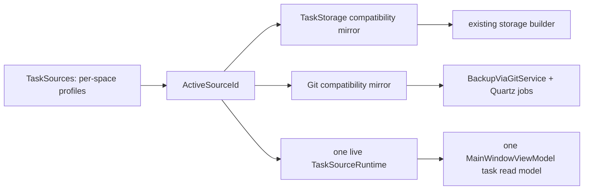

# Несколько изолированных пространств задач в одном экземпляре Unlimotion

## 0. Метаданные

- Тип (профиль): `delivery-task` + `.NET desktop client` + `ui-automation-testing`.
- Владелец: пользователь / Product Owner.
- Масштаб: large.
- Целевое семейство / behavior baseline: `GPT-5.6` по central `model-behavior-baseline`.
- Поверхность: Codex desktop.
- Effective runtime: primary agent `/root`; точный model ID и reasoning level текущая поверхность не экспонирует, поэтому они не используются как validation claim.
- Eval baseline / evidence: не применимо к model/prompt migration; behavioral baseline задают текущий single-source flow, существующие `TaskSourceManagerTests`, `SettingsViewModelTests`, Avalonia.Headless и AppAutomation suites.
- Целевой релиз / ветка: после подтверждения создать `feat/task-spaces-management` от `origin/main@e11cae9a` (checkout detached; до SPEC был чистым, сейчас единственное изменение — этот untracked spec).
- Ограничения:
  - На фазе `SPEC` изменяется только этот файл.
  - Переход в `EXEC` возможен только после точной фразы пользователя `Спеку подтверждаю`.
  - Интерфейс меняется минимально: быстрый переключатель в шапке и один компактный блок управления в существующей вкладке Settings.
  - В каждый момент UI подключён только к одному пространству и одному task storage.
  - Связи между задачами разных пространств запрещены на уровне UI и domain/runtime guard.
  - Источники, Git-настройки, серверные credentials/tokens и sync state не должны протекать между пространствами.
  - Локальный `AGENTS.override.md` требует добавить/обновить UI tests и выполнить их до завершения.
  - Existing desktop, Android, Browser и AppAutomation composition paths должны сохранить single-space startup.
- Instruction stack:
  - `instructions/core/model-behavior-baseline.md`
  - `instructions/core/quest-governance.md`
  - `instructions/core/quest-mode.md`
  - `instructions/core/collaboration-baseline.md`
  - `instructions/core/testing-baseline.md`
  - `instructions/core/tool-execution-baseline.md`
  - `instructions/contexts/testing-dotnet.md`
  - `instructions/profiles/dotnet-desktop-client.md`
  - `instructions/profiles/ui-automation-testing.md`
  - `instructions/governance/spec-linter.md`
  - `instructions/governance/spec-rubric.md`
  - `instructions/governance/review-loops.md`
  - repository `AGENTS.override.md`
- Связанные артефакты:
  - `specs/2026-06-16-client-multi-source-refactor.md`
  - `src/Unlimotion/Services/TaskSourceManager.cs`
  - `src/Unlimotion/Services/TaskSourceSettingsAdapter.cs`
  - `src/Unlimotion.ViewModel/TaskStorageSettings.cs`
  - `src/Unlimotion.ViewModel/SettingsViewModel.cs`
  - `src/Unlimotion.ViewModel/MainWindowViewModel.cs`
  - `src/Unlimotion/App.axaml.cs`
  - `src/Unlimotion/Views/MainControl.axaml`
  - `src/Unlimotion/Views/SettingsControl.axaml`

## 1. Overview / Цель

Добавить в один экземпляр Unlimotion несколько именованных пространств. Каждое пространство владеет своим источником задач и полным профилем Git backup/sync. Пользователь быстро переключает активное пространство, а существующие списки, roadmap, карточка и Settings работают только с ним.

Outcome contract:

- Success means:
  - Пользователь создаёт, переименовывает, удаляет и переключает пространства через UI без ручной правки `Settings.json`.
  - В шапке всегда виден active space; переключение доступно максимум за два действия.
  - Storage path/server URL, server credentials/tokens и все поля `GitSettings` сохраняются раздельно по stable space id.
  - При переключении старые subscriptions/runtime закрываются до показа нового набора, current task/details очищаются, а задачи двух пространств никогда не оказываются в одном visual tree/read model.
  - Relation command отклоняет operands с разными `TaskItemViewModelContext.SourceId`, даже если такой вызов сделан в обход UI.
  - Автоматическая и ручная Git sync относятся только к active space; inactive spaces не синхронизируются в фоне.
  - Existing user с одним `TaskStorage`/`Git` получает одно пространство без потери настроек и задач.
- Итоговый артефакт / output:
  - production code, EN/RU localization, migration/compatibility logic, unit/integration/UI tests, visual evidence и обновлённая пользовательская документация.
- Stop rules:
  - Не начинать EXEC до approval.
  - Не завершать EXEC при падающих relevant UI tests или без successful full test run.
  - Остановить переключение и оставить прежнее пространство active, если новый storage не удалось подключить.
  - Не удалять task directories, Git repositories или remote data при удалении space configuration.
  - Не расширять scope до одновременного multi-space view или background sync inactive spaces.

## 2. Текущее состояние (AS-IS)

- Предыдущий `client-multi-source` refactor уже добавил:
  - `TaskSourceDescriptor` со stable `Id`, `DisplayName`, `Kind`, `Path`, `Url`;
  - source-scoped `TaskSourceServerSettings`;
  - persisted `TaskSourcesSettings.ActiveSourceId` и несколько configured descriptors;
  - `ITaskSourceManager` и source-scoped `TaskItemViewModelContext.SourceId`;
  - active-storage binding через `MainWindowViewModel.Connect()`.
- `TaskSourceManager` умеет активировать descriptor, но не имеет публичного CRUD по configured sources, event contract и `ActivateSourceByIdAsync`.
- `TaskSourceManager.Sources` сохраняет ранее созданные runtime objects после их disconnect; UI этого не использует, но contract не выражает требование «ровно один live runtime».
- `TaskSourceSettingsAdapter` умеет мигрировать legacy `TaskStorage`, но `SyncLegacy` зеркалит storage/login только для source id `default`.
- `SettingsViewModel` читает и немедленно пишет один глобальный `TaskStorage` и один глобальный `Git` section.
- `BackupViaGitService`, Quartz jobs и scheduler читают глобальный `Git` section; scheduler конфигурируется вокруг initial file storage, а не как active-space lifecycle.
- `MainControl` не показывает active source/space. Управление storage и Git находится в существующей Settings tab и относится к единственному источнику.
- `MainWindowViewModel.Connect()` пересоздаёт DynamicData subscriptions, но explicit source-switch reset current task/details/search отсутствует.
- Relation UI строит candidates из active repository, поэтому normal flow уже source-local. Однако runtime/domain guard по `SourceId` должен сделать запрет явным и тестируемым.
- Existing AppAutomation Headless backend проверяет semantic UI, но не создаёт pixels/video. FlaUI suite умеет делать screenshots; для видео требуется внешний window recorder вокруг automated desktop scenario.
- Git preflight: detached `HEAD=e11cae9a`, этот commit совпадает с live `origin/main` на момент SPEC; `git status --short` после authoring показывает только `?? specs/2026-07-21-multiple-task-spaces.md`.

## 3. Проблема

Корневая проблема: multi-source foundation существует только как внутренний runtime/config contract. Пользователь не может управлять перечнем именованных пространств, быстро переключать active source или хранить независимые sync profiles; глобальный `Git` и часть legacy settings всё ещё создают риск конфигурационного протекания.

## 4. Цели дизайна

- Минимальный UI diff с ясным active-space context.
- Один live/readable task runtime и один task read model в каждый момент.
- Stable space identity независимо от display name и storage path.
- Source, server auth и Git sync profile принадлежат space id.
- Transaction-like switch: новый storage либо полностью становится active, либо UI возвращается к прежнему.
- Existing storage/backup services переиспользуются через active-space compatibility projection, без большого переписывания Git stack.
- Backward- и rollback-compatible persisted format.
- Deterministic UI/API guards против cross-space relations и duplicate source ownership.
- Testability через manager/coordinator contracts без Avalonia UI thread там, где UI не нужен.

## 5. Non-Goals (чего НЕ делаем)

- Не показываем и не агрегируем задачи нескольких пространств одновременно.
- Не добавляем global search, roadmap или relation picker по нескольким пространствам.
- Не синхронизируем inactive spaces по таймеру и не запускаем несколько Quartz scheduler sets.
- Не добавляем межпространственные ссылки, зависимости, parents/children или blockers.
- Не меняем формат task JSON и не добавляем space id в persisted `TaskItem`.
- Не удаляем и не перемещаем underlying task data при удалении записи пространства.
- Не запрещаем существующий явный copy/move task-tree flow; он копирует данные, но не создаёт cross-space relation.
- Не шифруем существующие plaintext server/Git secrets в рамках этой задачи.
- Не меняем server API, authentication protocol, Git conflict algorithm или update subsystem.
- Не делаем appearance, language, font, update, clipboard и generic filter preferences per-space; они остаются app-wide.
- Не добавляем отдельное окно или сложную master-detail страницу управления пространствами.

## 6. Предлагаемое решение (TO-BE)

### 6.1 Распределение ответственности

- `TaskSourceDescriptor`: остаётся persisted identity пространства и описанием его task source; UI называет descriptor «пространством».
- `TaskSourceSyncSettings`: новый source-id-scoped wrapper полного `GitSettings`.
- `TaskSourceLegacyProjectionState`: prepared/committed state plus target and committed SHA-256 fingerprints for the `TaskStorage`/`Git` compatibility projection; only divergence from a committed projection detects edits made by an older app after downgrade, without duplicating plaintext secrets.
- `TaskSourcesSettings`: получает collection sync profiles наряду с sources/server settings; physical sync storage lives in a separately versioned `TaskSourceSyncProfiles` section so a failed first migration cannot corrupt existing descriptors/server credentials.
- `TaskSourceSettingsAdapter`:
  - читает/пишет sync entries в provider-friendly map layout;
  - мигрирует legacy `Git` в active descriptor;
  - зеркалит active source и active sync profile в legacy `TaskStorage`/`Git` для existing services и rollback;
  - при уменьшении collections очищает все поля устаревших physical entry slots до снижения count/key values, потому что текущий writable provider не предоставляет подтверждённый section-delete contract; удалённые password/token/remote values не должны оставаться в raw JSON.
- `ITaskSourceManager` / `TaskSourceManager`:
  - CRUD configured spaces;
  - lookup by id and explicit activation transaction `prepare -> publish/finalize` or `abort`;
  - unique source validation;
  - source-scoped config update;
  - не удаляет active/last source напрямую;
  - держит ровно один published runtime after successful activation; an unpublished candidate may exist only inside a serialized activation transaction and is always finalized or disposed.
- `ITaskSpaceOperationRunner` (new): единственная top-level граница async exclusive lease. `RunExclusiveAsync` создаёт неприсваиваемый `TaskSpaceOperationContext`; только coordinator commands, manual Git/conflict command entry points, Quartz `Execute` и Settings persistence worker получают lease. Внутренние `*Core(context)` методы writer/manager/backup/projection принимают тот же context и никогда не получают lease повторно.
- `IActiveTaskSpaceConfiguration` (new): canonical source-aware reader/writer for source, server and Git settings. UI setters synchronously update only an in-memory draft for the captured source id and enqueue/coalesce an async persistence request; they never block the UI thread on the operation lease. The queue worker acquires the runner once, then its writer `*Core(context)` persists canonical fields and, when the edited source is active, the legacy projection. `DrainAsync` runs before a switch acquires its lease and on orderly shutdown. Every production config write, including writes initiated inside `BackupViaGitService`, goes through the same context-aware core writer.
- `TaskSpaceCoordinator` (новый application service):
  - drains pending Settings writes, затем сериализует switch/add/remove operations одним вызовом `ITaskSpaceOperationRunner.RunExclusiveAsync`;
  - останавливает новые scheduler operations, затем получает тот же lease, поэтому не пересекается с уже выполняющимся manual/background sync или conflict mutation;
  - готовит target без изменения `ActiveSourceId`, compatibility mirrors или published runtime;
  - публикует target только после успешных `Connect()==true`, `Init` и VM bind;
  - при ошибке aborts candidate и восстанавливает binding прежнего published runtime;
  - после success применяет active-space scheduler config.
- `TaskSpaceOptionViewModel` + расширение `SettingsViewModel`:
  - observable list, active/selected space, switching/busy flags;
  - externally wired commands по существующему App pattern;
  - existing Storage и Backup panels редактируют только active space;
  - изменения storage/Git полей immediately update the active-space draft and are queued for async persistence; `Connect` first drains the queue, then applies source changes to runtime.
- `MainWindowViewModel`:
  - command открыть Settings/space block;
  - explicit reset/rebind contract для source switch;
  - current task/details/search from previous source не остаются видимыми.
- `MainControl.axaml`: compact space selector в header перед create button.
- `SettingsControl.axaml`: first section с selected/active space, add/rename/switch/remove actions и hint, что нижние Storage/Backup settings относятся к active space.
- `UnifiedTaskStorage` / relation command boundary: every relation operand must have non-empty `SourceId` equal both to every other operand and to the executing storage's own `SourceId`; cover all parents/contains/block/unblock/move/clone/remove relation entry points while detached raw tree copy stays separate.
- `BackupViaGitService` and `GitPullJob`/`GitPushJob`: public top-level service/job entry points acquire the runner exactly once and call only `*Core(context)` methods; no public wrapper calls another lease-owning public wrapper. Backup core uses the captured source-aware snapshot/writer; no direct global-`Git` writes or split settings/path reads remain.
- `App.axaml.cs`: wiring coordinator, Settings callbacks и centralized active-space scheduler configuration.

### 6.2 Детальный дизайн

Persisted public model:

```csharp
public sealed class TaskSourceSyncSettings
{
    public string SourceId { get; set; } = TaskSourceDescriptor.DefaultSourceId;
    public GitSettings Git { get; set; } = new();
}

public sealed class TaskSourceLegacyProjectionState
{
    public int ProfileSchemaVersion { get; set; }
    public string ProjectionState { get; set; } = "Committed";
    public string TargetSourceId { get; set; } = string.Empty;
    public string TargetTaskStorageFingerprint { get; set; } = string.Empty;
    public string TargetGitFingerprint { get; set; } = string.Empty;
    public string CommittedSourceId { get; set; } = string.Empty;
    public string CommittedTaskStorageFingerprint { get; set; } = string.Empty;
    public string CommittedGitFingerprint { get; set; } = string.Empty;
}

public class TaskSourcesSettings
{
    public string ActiveSourceId { get; set; } = TaskSourceDescriptor.DefaultSourceId;
    public List<TaskSourceDescriptor> Sources { get; set; } = new();
    public List<TaskSourceServerSettings> ServerSettings { get; set; } = new();
    public List<TaskSourceSyncSettings> SyncSettings { get; set; } = new();
    public TaskSourceLegacyProjectionState LegacyProjection { get; set; } = new();
}
```

Provider layout follows the current map convention:

```text
TaskSources
  ActiveSourceId
  SourcesCount / SourceEntries / SourceKeyN
  ServerSettingsCount / ServerSettingEntries / ServerSettingsKeyN

TaskSourceSyncProfiles
  ProfileSchemaVersion / MigrationState
  SyncSettingsCount / SyncSettingEntries / SyncSettingsKeyN
  ProjectionState / Target* / Committed*

TaskSourceMutationJournal
  State / MutationId / Operation
  BeforeSnapshot / AfterSnapshot
```

Active-space compatibility projection:



Compatibility projection protocol (inside one `TaskSpaceOperationContext`):

1. Build the target legacy `TaskStorage` and `Git` values from the canonical active descriptor/profile; persist `ProjectionState=Prepared`, `TargetSourceId` and target SHA-256 fingerprints before touching global mirrors.
2. Write every legacy field, reread all legacy fields and require exact target fingerprints. Faults after any individual field leave `Prepared`, never an apparently committed partial mirror.
3. Persist `CommittedSourceId` and committed fingerprints, then write `ProjectionState=Committed` last.
4. At startup, `Prepared` means an interrupted projection: reconstruct and repair both mirrors from the canonical target, verify them and commit. It is never treated as an older-version edit and is never imported into canonical profiles.
5. Only when state is `Committed` and raw legacy fingerprints differ from the committed fingerprints is the difference classified as a downgrade/manual legacy edit and imported into the committed active source before a new projection. Inactive profiles remain unchanged.

Mutation journal protocol for add/remove:

1. Persist `State=Prepared`, a unique mutation id, operation name, and complete before/after logical snapshots; reread and validate the journal before mutating list/count/key data. The journal may temporarily duplicate plaintext secrets only while prepared.
2. Apply the after snapshot through source-aware core writes, including overwriting obsolete slots before lowering counts/keys. Reread raw JSON and verify logical after state plus absence of removed secret sentinels everywhere except the prepared journal.
3. Persist `State=Committed`, then overwrite snapshot payloads and clear the journal. Successful completion leaves no removed secret in the journal. Startup recovery of a residual `Committed` journal replays/verifies the after snapshot and completes sanitation/clear; it never rolls a committed removal back.
4. A caught failure restores and verifies the before snapshot, then clears the journal; startup recovery of any `Prepared` journal performs the same rollback before migration, legacy reconciliation or activation. If in-process rollback persistence itself fails, the in-memory before list remains visible, further config/sync mutations are blocked with a localized restart-required error, and the prepared journal completes rollback on restart.
5. Fault-injection covers every descriptor/server/sync field write, sanitation write, key/count update, readback, commit marker and journal cleanup. Reopening the raw provider after each fault must yield either the verified before state or the verified committed after state, never a partial list.

Operation ownership and no-reentrancy contract:

1. A user/system entry point calls `ITaskSpaceOperationRunner.RunExclusiveAsync`, which creates one `TaskSpaceOperationContext` token for the entire operation.
2. The entry point passes this context into `SwitchCoreAsync`, `BackupCoreAsync`, `ProjectLegacyCoreAsync`, `PublishCoreAsync` and source-aware writer methods. A `*Core(context)` method MUST validate the context but MUST NOT reacquire the runner.
3. If legacy public APIs must remain, each is a thin top-level wrapper that acquires once and calls core methods only. A public wrapper never calls another public wrapper.
4. Settings property setters update a captured-source in-memory draft and enqueue/coalesce changes. The async queue worker is a top-level runner caller; one queue batch writes canonical settings and its active legacy projection under one context.
5. `DrainAsync` waits for the persistence queue before a switch begins and before shutdown. It is invoked before the switch acquires its own lease, so drain cannot wait on a lease held by its caller. Failed drain blocks switching and leaves the old active runtime/config unchanged.

Switch sequence and activation transaction:

1. Reject same source, conflict-resolution mode and invalid target. Set `IsSpaceSwitching=true`; selector, management commands and every active-space Settings input are disabled before drain, and an overlay hides the task surface. No new draft can be enqueued until switch completes or aborts.
2. Stop scheduling new jobs, call Settings `DrainAsync`, then enter one `RunExclusiveAsync` scope. Manual sync, Quartz jobs, conflict commands and other switches use the same runner, so no config/path operation is still running once the context is obtained.
3. Capture previous published runtime/id/profile. All remaining writer, projection, backup and manager calls receive this operation context and cannot reacquire the lease.
4. `PrepareActivationAsync(targetId)` builds an unpublished candidate only. It does not mutate `ActiveSource`, `ActiveSourceId`, legacy mirrors or the published runtime list.
5. Under the lease, call candidate raw storage `Connect()` and require `true`; then call candidate `ITaskStorage.Init()`. Any `false`, exception or cancellation aborts and disposes the candidate. Candidate file watcher is disabled again after initialization until publish.
6. `MainWindowViewModel.BindInitializedStorage(candidate)` prepares/binds projections behind the overlay. It explicitly clears old current-task/details/search state and does not call `Connect`/`Init` again.
7. `PublishActivationAsync(transaction)` writes target `ActiveSourceId`, canonical profile and legacy projections/fingerprints, changes `ActiveSource`, enables candidate watcher and disconnects/disposes previous runtime. The overlay may be removed only after publish and old-runtime disposal succeed.
8. If publish or VM bind fails, `AbortAsync` restores previous active id/mirrors/runtime binding, keeps scheduler stopped during restoration, and disposes candidate. `Connect()==false` is treated exactly like an exception.
9. If both target activation and restoration fail, clear the entire task surface, keep scheduler stopped, expose a localized blocking recovery state with both errors, and do not report any active space as successfully connected.
10. On success, reload Settings/list, configure the one active scheduler and release the lease/flags.

Transaction tests must inject failures at candidate build, `Connect()==false`, connect exception, `Init`, VM bind, profile/mirror persistence, previous-runtime disconnect and rollback bind. The observable contract, not the exact class split, is invariant.

Create/rename/remove rules:

- Add generates a descriptor and unique default path `<resolved app data>/Spaces/<id>/Tasks` in memory, creates the directory, prepares/connects/initializes the candidate and only then publishes descriptor/profile/active id in the mutation+activation transaction. If directory creation, candidate activation or persistence fails, the descriptor is not listed, the previous space/runtime/scheduler remain active and a localized error is shown. A newly created empty directory is intentionally not deleted on rollback because removal of user-addressable paths is outside this feature's destructive authority.
- Generated display name is localized `New space`; duplicate display names are allowed because identity is id-based, but UI shows source summary to disambiguate.
- Rename changes only `DisplayName`; it does not reconnect storage.
- Remove requires confirmation. Removing the last space is disabled.
- Removing inactive space uses the persisted `TaskSourceMutationJournal`: write and reread a `Prepared` before/after logical snapshot, apply all descriptor/server/sync sanitation, count and key mutations, verify the after snapshot and absence of removed sentinels outside the journal, mark `Committed`, then sanitize/clear the journal. If any step fails in-process, restore the before snapshot and keep the observable list unchanged; if restore persistence also fails, block further mutations until restart recovery. On startup, `Prepared` deterministically rolls back to before while residual `Committed` completes after+cleanup before activation; partial list/order/count state is never accepted.
- Removing active space first switches to the first remaining configured space; if that switch fails, removal is aborted.
- Underlying folder, Git repository and server data are never deleted.

Uniqueness/isolation rules:

- Two configured local spaces may not resolve to the same directory. Existing directories use canonical/real path plus available filesystem identity; non-existing paths use `OrdinalIgnoreCase` on Windows and `Ordinal` on Unix, including macOS, so case-sensitive macOS volumes are not rejected by assumption. The directory is created/resolved before final add validation.
- Two server spaces may share URL only when their normalized login differs; same normalized URL + login is rejected.
- Each relation operand must match `executingStorage.SourceId`; merely matching the other operand is insufficient. Any mismatch/empty id produces a localized user error/no mutation.
- Reused task ids across spaces are valid because caches and relation lookup never aggregate across spaces.
- Duplicate descriptor ids fail closed before activation. Orphan/duplicate server or sync entries are never merged into a runtime; startup enters a localized safe-recovery state (legacy mirror remains untouched) and reports the corrupt ids.

Sync lifecycle:

- Full `GitSettings` belongs to source id, including enable flag, remote/ref, HTTP token fields, SSH key selection/path and intervals.
- Existing global `Git` remains a compatibility mirror of active space only.
- Settings setters change the captured-source draft and enqueue a coalesced write. The queue worker acquires one operation context and atomically writes canonical profile plus the active legacy projection; current Git work keeps its immutable old snapshot and the next operation after queue drain sees the new profile. Every `BackupViaGitService` normalization/connect/update path is called inside an already-owned operation context and uses core writer methods without reacquisition.
- Pull, push, clone/connect, remote-auth switch, conflict resolution and space switch enter the same async runner at their top-level boundary. A whole manual pull+push sequence owns one context, so switch cannot occur between its halves.
- `BackupViaGitService` captures one immutable operation snapshot containing source id, Git settings and repository path; it must not read those components separately after work begins.
- Scheduler is active only for active local-file space with `BackupEnabled=true`.
- Quartz jobs acquire the runner once in `Execute`; pausing prevents new triggers and the coordinator's acquisition waits for any already executing context holder.
- Conflict resolution is space-scoped by preventing switch while it is open/in progress.

Visual planning artifact (embedded, reviewer-visible):

```text
Desktop / wide
┌──────────────────────────────────────────────────────────────────────────┐
│ Breadcrumbs…              [ Пространство: Личное ▾ ] [ + ]              │
├──────────────────────────────────────────────────────────────────────────┤
│ All tasks | … | Roadmap | Settings                                      │
│                                                                          │
│ selector flyout:                                                         │
│   ✓ Личное          Локальная папка                                      │
│     Работа          Server                                               │
│   ─────────────────────────────────                                      │
│     Управление пространствами…                                           │
└──────────────────────────────────────────────────────────────────────────┘

Settings (existing scroll, new first section)
┌ Пространства ─────────────────────────────────────────────────────────────┐
│ [ Работа ▾ ]  ● Активно                                                  │
│ [Переключиться] [Переименовать] [Удалить] [＋ Новое пространство]         │
│ Настройки источника и синхронизации ниже относятся к «Работа».           │
└──────────────────────────────────────────────────────────────────────────┘
┌ Хранилище ─ existing fields for active space ────────────────────────────┐
└──────────────────────────────────────────────────────────────────────────┘
┌ Резервное копирование ─ existing fields for active space ────────────────┐
└──────────────────────────────────────────────────────────────────────────┘

Phone / narrow
┌──────────────────────────────────┐
│ Breadcrumb…       [ Личное ▾ ][+]│
├──────────────────────────────────┤
│ Settings section stacks buttons  │
│ and fields vertically; no        │
│ horizontal overflow.             │
└──────────────────────────────────┘
```

Visual acceptance:

- Selector never obscures create button and truncates long names with tooltip.
- At phone width the header remains one row with bounded selector width; Settings actions wrap/stack without horizontal overflow.
- Active marker exists in selector and Settings, not color-only.
- Busy state disables switch/manage actions and all source/sync inputs, and exposes localized status text.

UI video evidence:

- Новая feature не имеет meaningful baseline flow, поэтому `до` video: `Не применимо`.
- После implementation: record the automated desktop/FlaUI scenario «A -> B -> A, tasks remain isolated» with the window-focused recorder into `artifacts/ui-evidence/task-spaces/after-space-switch.mp4` (`local-only`, не коммитить по умолчанию).
- If recorder cannot safely attach to automated FlaUI process, fallback: AppAutomation Headless semantic log + FlaUI screenshots `space-a.png`, `space-b.png`, `settings-spaces.png`, with exact command and reason recorded in Post-EXEC.

Error handling:

- Duplicate source ownership, invalid/empty path, invalid server URL and delete-last-space are validation errors before mutation.
- Failed add never publishes the candidate descriptor/profile: the previous active space and scheduler remain unchanged, the error is shown, and any newly created empty default directory is left untouched.
- Failed target activation restores previous active space and never shows candidate tasks together with previous tasks.
- Failed rollback is a blocking error: clear task surface, stop scheduler, retain diagnostic previous/target ids, show both errors and do not claim successful connection.
- If removing active A successfully switches to fallback B but subsequent config deletion fails, B remains active/connected, A remains in the list, scheduler stays configured for B, and a localized removal error is shown.
- Space-specific secrets are removed with configuration entry and sanitized from obsolete provider slots; underlying data remains.

Performance:

- No multi-space aggregation or inactive connection; steady-state memory should remain close to current single-source mode.
- Switch cost is one disconnect/connect + read-model rebuild, with existing loading overlay.
- Space list/config lookup is small linear data; no database/index work is introduced.

### 6.3 User-Observable Scenarios

| Scenario | User action / trigger | Expected visible result / output | Evidence required | Covered by AC |
| --- | --- | --- | --- | --- |
| Legacy startup | Existing user starts upgraded app | One named space opens with existing tasks and Git settings | migration tests + startup UI smoke | AC1 |
| Add space | Click `New space` | New isolated local space is created, activated and shown in header/settings | manager test + headless UI flow | AC2 |
| Failed add | Add encounters directory, activation or persistence failure | Error shown; candidate is absent and previous space remains active; no directory is deleted | mutation/activation fault matrix + UI test | AC2, AC15 |
| Switch A -> B | Choose B in header | loading state, then only B tasks; A current task/details disappear | AppAutomation Headless + FlaUI screenshot/video | AC3, AC4 |
| Return B -> A | Choose A | A tasks and A storage/Git fields return; B tasks remain absent | integration/UI flow | AC3, AC5 |
| Configure sync | Edit Git settings in A, switch to B and edit different values | Each space restores its own values and scheduler follows active space | Settings/adapter/coordinator tests | AC5, AC6 |
| Rename/remove | Rename a space; remove another after confirmation | Name updates everywhere; removed config disappears, underlying task directory remains | UI + filesystem/config test | AC2, AC7 |
| Failed switch | Select unreachable/invalid target | Error shown; previous space remains active with its tasks | coordinator test + UI test | AC8 |
| Failed switch and failed recovery | Target and previous rebind both fail | Empty task surface, stopped sync and blocking recovery message; no false active success | coordinator fault-injection + UI state test | AC8 |
| Cross-space relation attempt | Internal/API test passes tasks from A and B to relation command | Mutation rejected; neither storage receives relation | domain/runtime test | AC9 |
| Narrow screen | Open selector/Settings at phone width | no overlap or horizontal overflow; all actions reachable | Avalonia.Headless layout assertions | AC10 |
| Downgrade and return | Use new version, edit active space in old version, then upgrade again | Old-version edits are imported into active profile; inactive profiles are unchanged | compatibility round-trip test | AC13 |

### 6.4 State / Interaction Matrix

| Current state | Trigger | Expected transition/result | Empty/error/disabled/concurrent case | Notes |
| --- | --- | --- | --- | --- |
| One legacy source | startup | migrate to one active space | missing source creates default local | no task rewrite |
| Active A, idle | switch B | A -> overlay -> B | B failure -> restore A; double failure -> recovery state | selector disabled during switch |
| Active A, idle | add B | prepare B -> publish/activate B | any failure leaves A active and B unlisted; created empty directory is retained | mutation + activation transaction |
| Active A, sync running | switch B | no transition | disabled/status explains wait | prevents config/path race |
| Active A, conflict resolution | switch B | no transition | disabled until conflict completed/abandoned | conflict stays source-local |
| Active A, only space | remove A | no transition | remove disabled | at least one space invariant |
| Active A, B exists | remove A | switch B, then remove A config | failed B switch aborts delete; delete failure leaves B active and A listed | no data directory delete |
| Active A | rename A | same runtime, new label | blank trimmed/rejected | stable id unchanged |
| Active A | edit storage fields | active profile saved; runtime unchanged until Connect | invalid values block Connect/switch | mirrors current Settings semantics |
| Active A | relation A -> B | no mutation | localized error/log | runtime guard |
| Switching/Git operation | second switch/sync/add/remove | waits or is disabled | serialized by the single top-level operation runner | no path/settings split-brain |
| Active A, pending Settings draft | switch B | drain A queue, then switch | failed drain leaves A active and reports persistence error | no synchronous UI wait/no nested lease |

### 6.5 Decision Ledger

| Decision | Owner | Default / chosen option | Confidence | Risk if assumed | Needs user before EXEC |
| --- | --- | --- | ---: | --- | --- |
| UI surface | agent | header selector + compact Settings section | 0.95 | selector could crowd phone header | Нет; bounded width/layout tests mitigate |
| Code terminology | agent | keep existing `TaskSource*` model; present it as «пространство» in UI | 0.95 | internal naming differs from product copy | Нет; avoids broad rename/refactor |
| Background sync | agent | active space only | 0.9 | user may expect all inactive spaces to sync | Нет; directly matches minimal UI/one-runtime constraint and is explicit |
| Configure inactive space | agent | switch it active, then edit existing Storage/Backup panels | 0.9 | one extra action | Нет; materially smaller/clearer UI and commands remain source-safe |
| New space default | agent | isolated local path under `Spaces/<id>/Tasks`, then user may change source | 0.85 | platform path edge cases | Нет; path resolver + platform tests required |
| Delete semantics | agent | delete config/secrets only, never underlying task/Git/server data | 0.98 | orphaned data remains intentionally | Нет; safest reversible behavior |
| Duplicate storage | agent | reject same local path or same server URL+login | 0.9 | advanced user cannot alias one source twice | Нет; aliasing contradicts independent spaces |
| App-wide settings | agent | theme/language/update/clipboard/filter preferences remain global | 0.9 | «и так далее» could be read broadly | Нет; these are user/app preferences, not task-source/sync ownership |
| Downgrade reconciliation | agent | compare raw legacy fingerprints; changed legacy values update active profile only | 0.9 | external manual edit can be interpreted as old-version edit | Нет; preserving explicit latest legacy edits is safer than silently overwriting them |

### 6.6 Runtime / Config / Data Contract Matrix

| Contract area | Current source of truth | Expected change | Compatibility / migration | Verification |
| --- | --- | --- | --- | --- |
| Space list/active id | `TaskSources` descriptors + active id | CRUD/events/by-id activation | existing descriptors preserved | adapter/manager round-trip tests |
| Task source | descriptor + source server settings | treated as one space profile | global `TaskStorage` mirrors active | migration + switch tests |
| Git sync | global `Git` | versioned `TaskSourceSyncSettings` per source id + canonical writer | legacy Git imported into current active; global mirror/fingerprint retained | migration/reload/service-write/scheduler tests |
| Server tokens | per-source list already | delete/activate through space lifecycle | default `ClientSettings` compatibility retained where needed | auth isolation tests |
| Live runtime | manager list may retain disconnected runtime | one published runtime; at most one private candidate during transaction | no persisted impact | transaction/disposal/lifecycle tests |
| UI state | one VM with current task/search/details | explicit reset/rebind on switch | normal single startup unchanged | headless scenario |
| Relations | UI candidates active-only | every operand must match executing storage source | no task JSON change | A+B->A, A+A->B, empty-id negative tests |
| Expansion state | one app path | clear/reload per active read model; no task mixing | persisted file format unchanged | UI state test |
| Rollback to older app | legacy mirrors | last active profile projected + fingerprints | older edits imported into active profile on re-upgrade; inactive profiles preserved | new->old edit->new test |

## 7. Бизнес-правила / Алгоритмы

1. Exactly one configured space is marked active; at least one configured space always exists.
2. Exactly one task runtime is published after a switch completes; an unpublished connected candidate may exist only while the operation lease and task overlay are held.
3. A task belongs to the source id in its `TaskItemViewModelContext`; every relation operand must match the executing `UnifiedTaskStorage.SourceId`.
4. Space display names are labels, not identities; rename does not change id or paths.
5. Inactive space settings may be stored but are not projected into active services and do not run sync.
6. Removing a space is configuration cleanup only.
7. A target space is not considered visibly active until its storage connected and MainWindow read model rebound.
8. Switching is serialized and forbidden while sync/conflict mutation may still use active Git/path settings.
9. Same file directory cannot be owned by two configured spaces; same server URL may be reused only with a different login.
10. Settings below the spaces section always edit the active space; selected inactive entry must be switched before editing.
11. Compatibility mirrors are never canonical: changed mirror fingerprints after a downgrade are imported into the current active profile before any new projection.
12. A `false` storage connect result is a failed activation and can never reach publish.
13. One operation has exactly one lease-owning entry point; every nested mutation receives its context and cannot reacquire it.
14. A prepared projection is repaired from canonical state, while only divergence from a committed projection can be imported as a legacy edit.
15. A prepared add/remove journal is rolled back before activation; partially mutated lists are invalid runtime input.

## 8. Точки интеграции и триггеры

- App startup: recover any prepared mutation journal, validate ids, recover/commit the versioned sync-profile migration, repair or reconcile legacy projection state, activate persisted active id, configure Settings list and scheduler.
- Header space item command: `TaskSpaceCoordinator.SwitchAsync(id)`.
- Settings add/rename/remove/switch commands: manager CRUD through coordinator.
- Storage/Git property setters: update an explicit-source draft and enqueue/coalesce asynchronous persistence; switch/shutdown drains the queue before entering its own operation scope. `BackupViaGitService` core paths persist canonical+mirror with the caller's context.
- Existing Connect command: disable scoped inputs, drain queued active-source settings, then apply configured active source and rebind VM/scheduler through the same coordinator transaction.
- `MainWindowViewModel` candidate bind/reset API: bind already connected/initialized storage behind overlay, detach old DynamicData subscriptions and clear current-task UI state.
- Relation mutations in storage/tree service: compare every operand with executing storage `SourceId` before changes.
- App lifetime disposal: disconnect/dispose the one active runtime and stop scheduler.

## 9. Изменения модели данных / состояния

- New persisted `TaskSourceSyncSettings` entries keyed by `SourceId`.
- `TaskSourcesSettings` gains `SyncSettings` and projection metadata; physical sync profiles live in versioned `TaskSourceSyncProfiles`.
- New observable UI state:
  - `Spaces`
  - `ActiveSpace`
  - `SelectedSpace`
  - `SelectedSpaceName`
  - `IsSpaceSwitching`
  - derived command availability/status.
- `TaskSourceDescriptor.Id` remains stable and is generated for new spaces.
- No changes to `TaskItem`, task files or server records.
- Global `TaskStorage`/`Git` remain persisted compatibility mirrors of active space, not canonical multi-space storage.

## 10. Миграция / Rollout / Rollback

- First startup after upgrade:
  - a `Prepared` add/remove mutation journal is rolled back to its verified before snapshot and sanitized before any other configuration interpretation;
  - existing `TaskSources` descriptors are preserved;
  - if absent, existing `TaskStorage` becomes `default` descriptor as today;
  - existing global `Git` is copied into sync profile of `ActiveSourceId`;
  - other preconfigured sources receive default Git settings with backup disabled;
  - the new `TaskSourceSyncProfiles` section is written with `MigrationState=Prepared`, fully reread/validated, then `ProfileSchemaVersion=1` and `MigrationState=Committed` are written last;
  - until the committed marker exists, loader ignores partial sync entries and deterministically rebuilds them from legacy `Git`; existing `TaskSources` descriptors/server settings are never overwritten by this migration;
  - only after migration commit is the active profile projected through the separate `Prepared -> write every field -> reread/verify -> Committed` compatibility protocol.
- Migration is idempotent; repeated startup does not duplicate entries or overwrite committed per-space sync profiles. Fault-injection tests reopen configuration after failure at every journal/migration/projection stage and after every legacy field write.
- Older-version rollback:
  - older code ignores new sync entries;
  - mirrored `TaskStorage`/`Git` let it open the last active space in single-source mode;
  - other space configs stay in JSON for a future re-upgrade;
  - on re-upgrade, an interrupted `Prepared` projection is first repaired from its canonical target and never imported; only raw legacy `TaskStorage`/`Git` fingerprints that differ from a fully `Committed` projection are imported into that committed active source/profile before any new mirror write; inactive profiles are not touched.
- Duplicate descriptor ids or duplicate/orphan server/sync ids fail closed into a localized safe-recovery state before storage activation; corrupt entries are never merged by list order.
- Remove does not delete user data, so manual recovery is possible by re-adding the source. Prepared removal recovery restores the complete pre-removal configuration before activation.
- If migration cannot commit, startup keeps legacy single-space behavior with the legacy sections untouched or fails with an explicit config error; it must not silently start with an empty new space.

## 11. Тестирование и критерии приёмки

Acceptance Criteria:

- AC1: legacy local and server configurations migrate idempotently to one active space with their storage/auth/Git settings intact.
- AC2: UI can add, rename, list and remove spaces; at least one remains, successful add publishes only an initialized space, and removal never deletes underlying data.
- AC3: header and Settings show the same active space and allow A -> B -> A switching.
- AC4: task lists, roadmap, relation picker, current task and details contain only active-space tasks, including when task ids collide across spaces.
- AC5: storage and full Git settings round-trip independently for A and B.
- AC6: manual/automatic sync, queued Settings persistence, service-initiated Git setting writes and conflict UI use one captured active-space snapshot with exactly one top-level operation lease and no nested acquisition/deadlock; inactive spaces have no background jobs or config leakage.
- AC7: remove commits descriptor/server/sync cleanup through a recoverable mutation journal, sanitizes obsolete raw JSON slots and journal secrets, and preserves filesystem/server data; every injected failure reopens as the complete before or after state.
- AC8: `Connect()==false`, target exception or publish failure restores the previous active space; if restoration also fails, UI enters blocking empty recovery state with scheduler stopped and no false active success.
- AC9: cross-space relation mutation is rejected when any operand does not match executing storage source, with no writes.
- AC10: desktop and phone layouts remain usable with stable automation ids and no horizontal overflow.
- AC11: startup, successful switch and disposal leave exactly one published runtime/watcher/subscription set; every aborted candidate is disconnected/disposed.
- AC12: EN/RU localization and user docs describe the new flow and active-only sync boundary.
- AC13: a `new -> old-version edit -> new` round trip imports values changed after a committed legacy projection into the active profile without overwriting inactive profiles; an interrupted prepared projection is repaired from canonical data and never imported.
- AC14: first migration and compatibility projection are staged/versioned/idempotent, recover after injected partial writes including every legacy field, and duplicate/orphan ids fail closed before activation.
- AC15: failure during add directory creation, candidate activation or persistence leaves the candidate unlisted, the previous space active with its scheduler, and deletes no directory.

Required tests:

- Unit/config:
  - adapter migration/round-trip/idempotency for `SyncSettings`;
  - per-space Git/server auth isolation;
  - mutation-journal removal fault injection after every sanitation/field/key/count/readback/commit step, reopening raw JSON to prove complete before/after state and absence of removed password/token/remote values after success;
  - staged migration and `Prepared` projection fault injection after every legacy field write/readback/commit marker, plus new->old-edit->new reconciliation;
  - duplicate descriptor ids and duplicate/orphan server/sync ids fail-safe tests;
  - CRUD, duplicate path/server identity, cannot remove last/active directly;
  - exactly-one-runtime disposal behavior;
  - older-version compatibility mirror.
- Coordinator/integration:
  - successful prepare/connect/init/bind/publish and abort on each failure point, including `Connect()==false` and double target+rollback failure;
  - deterministic held-lease races for manual sync, Quartz job, conflict command and concurrent switch;
  - no-reentrancy tests proving one runner acquisition while nested backup/writer/projection/publish core methods execute, plus setter-vs-switch queue drain ordering and failed-drain behavior without deadlock;
  - add failure matrix for directory creation, candidate connect/init/bind and profile/journal persistence: candidate absent, previous active/scheduler unchanged, created directory not deleted;
  - scheduler pause/reschedule/resume follows active space only and stays stopped in recovery state;
  - Settings active profile reload, captured-source queue coalescing, async persistence and shutdown drain.
- Backup service:
  - normalization/connect/remote-auth changes write canonical captured source profile;
  - A -> B -> A round trip preserves service-written remote/ref/branch values without leaking them to B;
  - settings and repository path come from one immutable operation snapshot.
- Domain/runtime:
  - A+B -> storage A, A+A -> storage B and empty-source operands fail across every relation entry point without mutation;
  - same-id tasks in separate storages remain independent.
- Avalonia.Headless:
  - header selector is present, active marker changes, old task/current details disappear;
  - Settings add/rename/remove/switch flow;
  - phone-width header and Settings containment.
- AppAutomation Headless/FlaUI:
  - user-level A -> B -> A flow with two isolated local directories;
  - stable selectors for selector, items, manage, add, rename, remove and switch;
  - screenshot/video evidence plan from section 6.2.
- Full UI projects:
  - full Headless project after shared authoring/page-object changes;
  - full FlaUI project sequentially on Windows after the targeted recorded scenario.
- Characterization:
  - current one-space startup/settings/connect behavior before production change.

Validation commands (repo-proven TUnit syntax; exact discovered counts are evidence, not fixed contract):

```powershell
dotnet --info
dotnet restore src\Unlimotion.sln
dotnet build src\Unlimotion.Test\Unlimotion.Test.csproj -c Debug --no-restore -p:UseSharedCompilation=false

dotnet run --project src\Unlimotion.Test\Unlimotion.Test.csproj -c Debug --no-build --no-restore -- --treenode-filter "/*/*/TaskSourceManagerTests/*" --maximum-parallel-tests 1 --output Detailed
dotnet run --project src\Unlimotion.Test\Unlimotion.Test.csproj -c Debug --no-build --no-restore -- --treenode-filter "/*/*/SettingsViewModelTests/*" --maximum-parallel-tests 1 --output Detailed
dotnet run --project src\Unlimotion.Test\Unlimotion.Test.csproj -c Debug --no-build --no-restore -- --treenode-filter "/*/*/TaskSpaces*/*" --maximum-parallel-tests 1 --output Detailed
dotnet run --project src\Unlimotion.Test\Unlimotion.Test.csproj -c Debug --no-build --no-restore -- --treenode-filter "/*/*/SettingsControlResponsiveUiTests/*" --maximum-parallel-tests 1 --output Detailed

dotnet build tests\Unlimotion.UiTests.Headless\Unlimotion.UiTests.Headless.csproj -c Debug --no-restore -p:UseSharedCompilation=false
dotnet run --project tests\Unlimotion.UiTests.Headless\Unlimotion.UiTests.Headless.csproj -c Debug --no-build --no-restore -- --treenode-filter "/*/*/TaskSpacesHeadlessTests/*" --maximum-parallel-tests 1 --output Detailed --results-directory artifacts\validation\task-spaces-headless-targeted
dotnet run --project tests\Unlimotion.UiTests.Headless\Unlimotion.UiTests.Headless.csproj -c Debug --no-build --no-restore -- --maximum-parallel-tests 1 --output Detailed --results-directory artifacts\validation\task-spaces-headless-full

dotnet build tests\Unlimotion.UiTests.FlaUI\Unlimotion.UiTests.FlaUI.csproj -c Debug --no-restore -p:UseSharedCompilation=false
dotnet run --project tests\Unlimotion.UiTests.FlaUI\Unlimotion.UiTests.FlaUI.csproj -c Debug --no-build --no-restore -- --treenode-filter "/*/*/TaskSpacesFlaUiTests/*" --maximum-parallel-tests 1 --output Detailed --results-directory artifacts\validation\task-spaces-flaui-targeted

pwsh -File scripts\record-task-spaces-evidence.ps1 -Phase After -RecorderScriptPath C:\Users\Kibnet\.codex\skills\record-app-screen\scripts\record_app_window.ps1 -OutputPath artifacts\ui-evidence\task-spaces\after-space-switch.mp4

dotnet run --project tests\Unlimotion.UiTests.FlaUI\Unlimotion.UiTests.FlaUI.csproj -c Debug --no-build --no-restore -- --maximum-parallel-tests 1 --output Detailed --results-directory artifacts\validation\task-spaces-flaui-full

dotnet build src\Unlimotion.Desktop\Unlimotion.Desktop.csproj -c Debug --no-restore /nodeReuse:false
dotnet build src\Unlimotion.Browser\Unlimotion.Browser.csproj -c Debug --no-restore /nodeReuse:false

dotnet run --project src\Unlimotion.Test\Unlimotion.Test.csproj -c Debug --no-build --no-restore -- --maximum-parallel-tests 1 --output Detailed --results-directory artifacts\validation\task-spaces-full

git diff --check
git status --short
```

The recording wrapper follows the existing `record-status-contract-evidence.ps1` handshake pattern: targeted FlaUI owns `window-ready.json`/`scenario-complete.json`; wrapper owns `scenario-go.signal`/`recording-finished.signal`, records only the Unlimotion window and verifies non-empty MP4 metadata. If the recorder cannot attach for an objective tooling/window-capture reason, the same targeted FlaUI run must emit `space-a.png`, `space-b.png`, `settings-spaces.png` and logs, and Post-EXEC records the exact failure. Android build is attempted if installed workloads permit; workload absence is an environment blocker, not silently ignored.

Test stop rules:

- Targeted failure must be understood before expanding scope.
- Do not repeat an identical timed-out full run; inspect process/log/lock evidence first.
- Run heavy suites sequentially because they share output and UI state.
- Full green TUnit run is mandatory before successful completion.
- Failing UI automation blocks completion.

### Acceptance-to-Test Matrix

| Acceptance criterion | Automated test | Manual / visual / log check | Evidence artifact | If not tested, why |
| --- | --- | --- | --- | --- |
| AC1 | adapter migration/idempotency tests | inspect generated JSON | targeted test log | — |
| AC2 | manager + Settings UI CRUD and initialized-before-publish tests | confirmation copy review | headless log/screenshot | — |
| AC3 | AppAutomation A -> B -> A | inspect selector active marker | video/screenshots | — |
| AC4 | same-id storage integration + UI assertions | inspect task tree/details | A/B screenshots | — |
| AC5 | Settings/adapter round-trip tests | generated JSON diff | targeted logs | — |
| AC6 | single-acquisition/nested-core tests, setter-vs-switch drain race, scheduler/manual/conflict races + service-write round trip | inspect captured source/path/profile ids and acquisition count | targeted logs | — |
| AC7 | mutation-journal fault matrix + raw-JSON sanitation/filesystem preservation | verify before/after atomic state, removed secrets absent and directory still exists | test log + JSON | — |
| AC8 | activation fault matrix + double-failure recovery UI test | inspect prior restore or blocking empty state | trace/screenshot | — |
| AC9 | A+B->A, A+A->B and empty-id relation tests | no manual step | targeted log | — |
| AC10 | Avalonia.Headless geometry tests | FlaUI screenshots | screenshots | — |
| AC11 | published/candidate lifecycle and disposal tests | process/watcher log if needed | test log | — |
| AC12 | localization contract/tests | EN/RU copy review | diff | — |
| AC13 | committed new->old edit->new reconciliation + prepared-projection recovery | inspect active/inactive raw profiles | targeted log + JSON | — |
| AC14 | staged migration/projection field-write fault matrix + corrupt-id safe recovery | reopen config after every injected stage | targeted log + JSON | — |
| AC15 | add directory/activation/persistence failure matrix | verify candidate absent, old scheduler active, directory retained | targeted log + JSON | — |

## 12. Риски и edge cases

- Quartz/manual/conflict work may still execute while switch starts; pause/state flags alone are insufficient. Every top-level operation and switch must hold the same async exclusive lease for its whole snapshot/use/write lifetime, while nested core calls must reuse its context or a non-reentrant lease can deadlock.
- A synchronous Settings setter cannot await the operation lease safely. Captured-source drafts are persisted by a coalescing async queue, and switch/shutdown drain it before acquiring their own lease.
- `MainWindowViewModel` collections/current item may retain old objects after subscription disposal. Explicit reset plus same-id cross-space UI test is required.
- Global compatibility mirrors can become accidental source of truth. Canonical writes include `BackupViaGitService`; the `Prepared/Committed` projection protocol prevents a partially written mirror from being misclassified as a downgrade/manual edit.
- A local path may differ textually but resolve to the same directory through case, relative segments or symlink/junction. Existing paths use real-path/filesystem identity where available; new paths use Windows-insensitive/Unix-ordinal comparison after creation. Symlink identity remains best-effort where the platform exposes no stable file id.
- Count/key based writable configuration can leave obsolete physical entries after list compaction or expose a partial list after failure. The persisted mutation journal rolls back a prepared removal, adapter blanks every sensitive field, and raw-file fault tests search for removed sentinel values.
- Failed rollback can leave no connected storage; UI must report blocking recovery state rather than claim previous space restored.
- A downgrade can edit only global legacy sections. Re-upgrade must import changed fingerprints into active profile before mirroring or it will silently restore stale settings.
- Switching away with edited but unconnected source settings must persist the draft to that space, not copy it into target.
- Server token callbacks must persist by source id even after UI switches; old runtime must be disconnected before later token callback can fire.
- Removing a space with plaintext secrets intentionally removes those entries but cannot erase credentials already present in Git credential helpers/remote systems.
- Android/browser path semantics may make `<app data>/Spaces/...` different; path resolution belongs to platform options and needs smoke coverage.
- Long display names/localized copy may crowd header; bounded width/trimming is mandatory.
- Existing detached task move must not be rejected by relation guard because it is a copy/move workflow, not a cross-source relation.
- Duplicate/orphan ids in raw config must fail safe before activation; list order must never decide which secrets/source wins.
- Add can create a directory before activation/persistence succeeds. Failure leaves it unlisted and intentionally retained; tests ensure no descriptor leaks and no path is destructively removed.

### Expected User Review Objections

| Likely objection | Why likely | Mitigation in spec/code plan | Status |
| --- | --- | --- | --- |
| «После переключения я всё ещё вижу выбранную задачу старого пространства» | current VM has retained selection risk | explicit reset + same-id A/B UI test | mitigated |
| «Настройки Git снова общие» | current implementation uses global `Git` | canonical per-source sync entries + active compatibility mirror + round-trip tests | mitigated |
| «Git service сам перепишет global settings и потеряет профиль» | current `BackupViaGitService` normalizes remote/ref directly | source-aware writer for every service write + A/B round-trip test | mitigated |
| «Почему inactive spaces не синхронизируются?» | phrase «каждое пространство» can imply concurrent jobs | UI/docs explicitly state active-only; avoids hidden background activity and matches one-runtime scope | mitigated |
| «Удаление пространства удалит мои задачи или оставит пароли в JSON» | destructive/security wording risk | confirmation states config-only; filesystem preservation plus raw-secret sanitation test | mitigated |
| «Чтобы настроить B, приходится сначала переключиться» | minimal UI adds one action | active marker/hint and quick switch; avoids dangerous inactive sync commands | accepted-risk |
| «Одинаковые id смешают задачи» | task ids are not globally namespaced | separate caches + runtime `SourceId` guard + same-id integration test | mitigated |
| «На телефоне новый selector сломает шапку» | header already contains breadcrumbs/create | bounded selector, trimming and phone geometry tests | mitigated |
| «После отката на старую версию мои новые Git-настройки пропадут при возврате» | old version edits only legacy mirror | projection fingerprints import changed active legacy values and preserve inactive profiles | mitigated |

### Rework Prevention Checklist

- [x] Spec names visible selector, Settings controls, busy/error states and active marker.
- [x] Every user-visible scenario maps to evidence.
- [x] Agent-owned decisions and tradeoffs are explicit.
- [x] Likely objections include sync scope, deletion, isolation and narrow UI.
- [x] Business, UX, testing, architecture and operations/security roles are applicable and reviewed below.
- [x] Acceptance criteria are verifier statements.
- [x] EXEC has targeted, UI, visual and full-suite evidence paths.

## 13. План выполнения

1. Add characterization tests for one-space startup, current settings projection, service-initiated Git writes and no retained selection after rebind.
2. Extend config model/adapter with separately versioned per-source Git profiles, staged migration, prepared/committed compatibility projection, recoverable mutation journal, raw-slot sanitation and corruption validation.
3. Add canonical `IActiveTaskSpaceConfiguration`, coalescing Settings persistence queue and `ITaskSpaceOperationRunner`; enforce one lease-owning top-level boundary and context-only core methods for backup/Quartz/conflict/switch/projection/runtime publication.
4. Add manager CRUD/uniqueness and activation transaction `prepare/connect/init/publish/abort`; cover add/remove journals, the failure matrix and candidate disposal.
5. Add coordinator for switch/recovery/scheduler lifecycle, including deterministic held-operation races and double-failure recovery.
6. Extend Settings VM with observable spaces, profile reload/persist callbacks and commands.
7. Split MainWindow candidate binding/reset from storage connect/init; add executing-storage relation guards across all entry points.
8. Add localized header selector and Settings management section with stable automation ids.
9. Add Avalonia.Headless/AppAutomation/FlaUI user-flow, responsive coverage and automated recording wrapper.
10. Update EN/RU user docs and visual evidence.
11. Run targeted -> affected builds -> full Headless/FlaUI -> full serial suite -> post-EXEC review.

## 14. Открытые вопросы

Блокирующих вопросов нет. Active-only sync, config-only removal and «switch-to-configure» выбраны как минимальный, безопасный и совместимый contract; они явно отражены в UI/docs/acceptance criteria.

## 15. Соответствие профилю

- Профиль: `.NET desktop client`.
  - async switch/connect не блокирует UI thread;
  - navigation/state recovery and error flow покрываются;
  - platform path resolver остаётся изолированным;
  - build/full tests mandatory.
- Overlay: `ui-automation-testing`.
  - embedded visual planning artifact;
  - stable automation ids;
  - Avalonia.Headless + AppAutomation/FlaUI coverage;
  - after video from automated desktop flow or objective fallback with screenshots/logs;
  - relevant UI failure blocks completion.
- Repository override: relevant UI tests добавляются и запускаются.

## 16. Таблица изменений файлов

| Файл | Изменения | Причина |
| --- | --- | --- |
| `src/Unlimotion.ViewModel/TaskStorageSettings.cs` | per-source sync settings model | persisted space profile |
| `src/Unlimotion.ViewModel/TaskSpaceOptionViewModel.cs` (new) | observable UI item/state | list/selector bindings |
| `src/Unlimotion.ViewModel/SettingsViewModel.cs` | spaces collection, commands, active profile reload/persist | manage/configure UI |
| `src/Unlimotion.ViewModel/MainWindowViewModel.cs` | open settings + source-switch reset/rebind | no stale tasks/details |
| `src/Unlimotion/Services/TaskSourceRuntime.cs` | manager CRUD/event/by-id contracts | public space operations |
| `src/Unlimotion/Services/TaskSourceManager.cs` | CRUD, validation, one runtime, config update | lifecycle/isolation |
| `src/Unlimotion/Services/TaskSourceSettingsAdapter.cs` | versioned sync persistence, migration, fingerprints, sanitation, mirrors | compatibility/recovery |
| `src/Unlimotion/Services/ActiveTaskSpaceConfiguration.cs` (new) | canonical source-aware snapshot/writer | prevent global-config leakage |
| `src/Unlimotion/Services/TaskSpaceOperationRunner.cs` (new) | single top-level async lease + operation context | serialize without nested acquisition/deadlock |
| `src/Unlimotion/Services/TaskSpaceSettingsPersistenceQueue.cs` (new) | captured-source/coalesced draft writes and drain | keep setters non-blocking and ordered with switch |
| `src/Unlimotion/Services/TaskSpaceCoordinator.cs` (new) | activation transaction + scheduler/recovery orchestration | safe switch |
| `src/Unlimotion/Services/BackupViaGitService.cs` | captured source snapshot and canonical writes | preserve per-space Git state |
| `src/Unlimotion/Scheduling/Jobs/GitPullJob.cs`, `GitPushJob.cs` | acquire shared lease/use active snapshot | prevent scheduler race |
| `src/Unlimotion/UnifiedTaskStorage.cs` and/or relation service | same-source guard | forbid cross-space relations |
| `src/Unlimotion/App.axaml.cs` | wire commands/coordinator/settings/scheduler | composition |
| `src/Unlimotion/Views/MainControl.axaml` | header selector/flyout | quick switching |
| `src/Unlimotion/Views/SettingsControl.axaml` | spaces section/hint/actions | list management |
| `src/Unlimotion.ViewModel/Resources/Strings.resx` | English copy | localization |
| `src/Unlimotion.ViewModel/Resources/Strings.ru.resx` | Russian copy | localization |
| `src/Unlimotion.Test/TaskSourceManagerTests.cs` | model/CRUD/lifecycle tests | core regression |
| `src/Unlimotion.Test/SettingsViewModelTests.cs` | profile isolation/reload tests | settings regression |
| `src/Unlimotion.Test/*TaskSpaces*Tests.cs` (new as appropriate) | coordinator/relation/UI scenarios | feature coverage |
| `src/Unlimotion.Test/SettingsControlResponsiveUiTests.cs` | phone layout | visual contract |
| `tests/Unlimotion.AppAutomation.TestHost/*` | two-space launch fixture | end-to-end setup |
| `tests/Unlimotion.UiTests.Authoring/*`, `tests/Unlimotion.UiTests.Headless/*`, `tests/Unlimotion.UiTests.FlaUI/*` | page objects and user flow | semantic/visual evidence |
| `scripts/record-task-spaces-evidence.ps1` (new) | FlaUI/recorder handshake | after-video evidence |
| `README.md`, `README.RU.md` | concise spaces/sync boundary docs | discoverability |

Exact test file split may follow current repository patterns; no unrelated modules are to be changed.

## 17. Таблица соответствий (было -> стало)

| Область | Было | Стало |
| --- | --- | --- |
| User concept | one unnamed task source | named spaces |
| Header | breadcrumbs + create | breadcrumbs + active-space selector + create |
| Settings storage | one global source form | same form scoped to active space + manager section |
| Git config | global `Git` with service direct writes | versioned per-space canonical profile + source-aware service writer + active legacy mirror/fingerprint |
| Runtime | active source plus retained disconnected runtime references | one published runtime + unpublished transaction candidate only |
| Switching | internal storage replacement | prepare/connect/init/publish or abort/recovery inside one operation-runner context |
| Relations | UI normally active-only | UI active-only + every operand matches executing storage source |
| Removal | unavailable | config/secrets only; obsolete JSON slots sanitized; data preserved |
| Legacy user | single source | automatic one-space migration |

## 18. Альтернативы и компромиссы

- Separate `TaskSpace*` persisted model wrapping `TaskSource*`:
  - Плюсы: product terminology in code, extensible container.
  - Минусы: broad migration/rename and duplication of already shipped source identity.
  - Решение: keep `TaskSource*` internal model and expose «space» in UI.
- Edit inactive space in a full master-detail Settings page:
  - Плюсы: configure without switching.
  - Минусы: larger UI, risk of running sync actions against non-active path, more responsive complexity.
  - Решение: switch-to-configure.
- Concurrent runtime/background sync for all spaces:
  - Плюсы: all spaces stay fresh.
  - Минусы: multiple watchers/jobs/conflicts/secrets, hidden resource use, contrary to requested no simultaneous display and minimal UI.
  - Решение: active-only runtime/sync.
- Remove active space immediately and choose fallback afterward:
  - Плюсы: fewer steps.
  - Минусы: can leave app without a working source.
  - Решение: successful fallback switch first.
- Put `SourceId` into every task JSON:
  - Плюсы: global identity.
  - Минусы: task migration and unnecessary persisted coupling.
  - Решение: runtime ownership context because no aggregation/cross-links are allowed.

## 19. Результат quality gate и review

### SPEC Linter Result

| Блок | Пункты | Статус | Комментарий |
|---|---|---|---|
| A. Полнота спеки | 1-5 | PASS | Цель, AS-IS, root problem, design goals и Non-Goals зафиксированы. |
| B. Качество дизайна | 6-10 | PASS | Ownership, switch lifecycle, invariants, errors, config и performance определены. |
| C. Безопасность изменений | 11-13 | PASS | Idempotent migration/projection, journaled config-only removal, failure rollback и older-version mirror описаны. |
| D. Проверяемость | 14-16 | PASS | 15 AC, test layers, evidence и commands сопоставлены. |
| E. Готовность к автономной реализации | 17-19 | PASS | Staged plan, file map, alternatives и no blocking questions. |
| F. Соответствие профилю | 20 | PASS | Desktop/UI automation/local override requirements встроены. |

Итог: ГОТОВО.

### SPEC Rubric Result

| Критерий | Балл (0/2/5) | Обоснование |
|---|---:|---|
| 1. Ясность цели и границ | 5 | One active space, active-only sync, no cross-links/aggregation are explicit. |
| 2. Понимание текущего состояния | 5 | Existing manager/adapter/VM/App/scheduler seams inspected. |
| 3. Конкретность целевого дизайна | 5 | Model, manager, coordinator, UI, switch sequence and guards chosen. |
| 4. Безопасность (миграция, откат) | 5 | Prepared/committed legacy projection, mutation journal, activation rollback and non-destructive removal defined. |
| 5. Тестируемость | 5 | AC-to-test matrix covers unit, integration, UI, visual and full suite. |
| 6. Готовность к автономной реализации | 5 | No blocking choices; staged file/test plan and stop rules exist. |

Итоговый балл: 30 / 30.
Зона: готово к автономному выполнению после approval.

### Role-Based Review Result

| Role | Applicability | Review question | Verdict | Required spec changes |
| --- | --- | --- | --- | --- |
| Business analyst / domain workflow | applicable | Spaces own sources/sync and never mix tasks? | PASS | active-only rules and config-only removal explicit |
| UX / designer | applicable | Is switching visible, minimal and responsive? | PASS | wireframe, active marker, busy/error and phone states included |
| Tester / validation | applicable | Does every AC map to evidence including negative/rollback cases? | PASS | matrix complete; full green required |
| Developer / architect | applicable | Are ownership, migration, runtime disposal and relation boundaries coherent? | PASS | manager/coordinator split and compatibility mirror explicit |
| Delivery / operations / security | applicable | Are Git jobs, plaintext secrets, rollback and artifacts handled? | PASS | single operation runner, journal cleanup boundary and local-only video noted |

### Post-SPEC Review

- Статус: PASS after fix and adversarial re-review.
- Scope reviewed: this spec, central instruction stack, repository override, existing multi-source spec, current manager/adapter/settings/App/VM/XAML/tests, and detached `origin/main` checkout whose only worktree change is this spec.
- Decision: spec is ready for explicit user approval; production code remains prohibited until approval.
- Review passes:
  - Scope/Evidence pass: complete; live code/worktree facts and UI evidence capabilities were inspected.
  - Contract pass: complete; model, operation ownership, activation, migration/projection, mutation journal, UI, AC and tests agree.
  - Adversarial risk pass 1: activation atomicity, service config writes, scheduler race, executing-storage relation guard, stale secret slots and downgrade edits were identified and fixed.
  - Adversarial risk pass 2: non-reentrant lease/deadlock, partial compatibility projection, partial removal and failed-add semantics were identified and fixed.
  - Role-Based pass: all five roles completed above.
  - Re-review after fixes / Fix and re-review: final separate-agent adversarial pass reported no BLOCKER/HIGH/MEDIUM findings and verdict PASS.
  - Stop decision: PASS for SPEC; stop before EXEC pending exact approval phrase.
- Evidence inspected:
  - `TaskStorageSettings.cs`, `TaskSourceRuntime.cs`, `TaskSourceManager.cs`, `TaskSourceSettingsAdapter.cs`;
  - Settings VM/XAML and Main VM/XAML;
  - App storage/connect/scheduler wiring;
  - Task source/settings/responsive/AppAutomation tests;
  - semantic Headless vs FlaUI screenshot capability.
- Depth checklist:
  - Scope drift / unrelated changes: constrained by Non-Goals and file map.
  - Acceptance criteria: all 15 mapped.
  - User-observable scenarios / Decision ledger / Expected objections: complete.
  - Validation evidence: targeted/UI/visual/full plan present; execution evidence unavailable before EXEC.
  - Unsupported claims: current Git/worktree and code facts inspected live; future commands are plan only.
  - Regression / edge case: same ids, failed switch/add/remove, queue-vs-switch, sync conflict, path aliases, last space, rollback and restart recovery covered.
  - Comments/docs/changelog: EN/RU docs planned; changelog not required unless repository delivery policy/version scope later requires it.
  - Hidden contract change: global `Git` becomes compatibility mirror, made explicit and tested.
  - Manual-review challenge: verify scheduler cannot observe A path with B credentials during switch; verify nested core calls never reacquire; verify old current task cannot remain visible when ids collide.
- No-unresolved-findings justification: the final adversarial re-review explicitly rechecked the four second-pass risk areas across design, migration, state matrix, AC and tests and returned PASS with no BLOCKER/HIGH/MEDIUM findings.

| Severity | Area | Finding | Required action | Status |
| --- | --- | --- | --- | --- |
| HIGH | activation | Candidate could become visible/persisted before connect/init/bind fully succeeded. | Define prepare/connect/init/bind/publish/abort transaction and double-failure recovery. | fixed |
| HIGH | sync/config isolation | Backup writes and scheduler/manual operations could read or write split source/path/Git state. | Route all writes through source-aware core writer with one captured operation context. | fixed |
| HIGH | relation isolation | Matching operands could still be passed to the wrong executing storage. | Require every operand to match `executingStorage.SourceId`. | fixed |
| HIGH | operation concurrency | Non-reentrant nested lease acquisition and synchronous setters could deadlock. | Use one top-level runner/context, context-only core calls, async captured-source queue and pre-switch drain. | fixed |
| HIGH | compatibility | Partial legacy field writes could be mistaken for an older-version edit. | Add `Prepared/Committed` projection protocol, readback, repair and field-level fault tests. | fixed |
| HIGH | removal | Sanitation/count/key failure could leave a partially mutated list or stale secrets. | Add before/after mutation journal, deterministic startup recovery and per-write fault matrix. | fixed |
| MEDIUM | add failure | Failed add outcome and directory ownership were underspecified. | Keep candidate unlisted/old runtime active and retain any created directory. | fixed |
| MEDIUM | migration/UI evidence | Migration atomicity, active-delete fallback and exact UI/FlaUI evidence needed explicit outcomes. | Add staged migration/recovery states, fallback contract and exact validation/recording commands. | fixed |
| LOW | review process | A technically read-only independent reviewer was unavailable because the effective child-agent sandbox is unrestricted. | Use and disclose a separate-agent adversarial fallback, then run a focused final re-review. | accepted; fallback PASS |

- Fixed before continuing: all findings above were integrated into the spec and affected gates were repeated.
- Checks rerun: SPEC linter 20/20, rubric 30/30, role review, two adversarial fix passes, focused final re-review, heading/fence/trailing-whitespace/worktree checks.
- Needs human: exact approval phrase `Спеку подтверждаю`.
- Residual risks / follow-ups: the review limitation above is disclosed; runtime/build/test/visual evidence belongs to post-EXEC.

### Post-EXEC Review

- Статус реализации: PASS — AC1-AC15, active-only isolation и расширенный transactional/recovery contract реализованы; одновременный показ задач и связи между пространствами не добавлены.
- Статус текущей валидации: PASS для всех task-space, UI и platform gates; два существующих live server-теста остаются внешне заблокированы лицензией RavenDB, поэтому единый текущий `900/900` не заявляется.
- Реализовано и повторно проверено:
  - единый non-reentrant `ITaskSpaceOperationRunner`, captured-source очередь настроек и drain/restart handshake;
  - prepare/connect/init/bind/publish/abort activation с scheduler pause/restore, rollback и recovery state;
  - staged migration, `Prepared/Committed` legacy projection, mutation journal, sanitation и fault matrices;
  - active-only runtime/sync/jobs/backup, source-aware операции и запрет relation-операций между разными `SourceId`;
  - каталог, header selector, Settings CRUD, busy/recovery UI и удаление активного пространства через успешный fallback;
  - AppAutomation `1.6.0`, deterministic automation ids, right-monitor execution и воспроизводимый video/screenshot evidence wrapper.
- Исправления по многопрофильному review:
  - пустой local path больше не подменяется общей default-папкой и отклоняется до мутации конфигурации;
  - server endpoint обязан быть абсолютным HTTP(S) URL без credentials/query/fragment, канонизируется по scheme/IDN host/default port/trailing slash, сохраняет регистр path и сравнивается вместе с trimmed login;
  - duplicate ownership, invalid path/URL/kind, corrupt descriptor/server slots, sync profiles и mutation-journal snapshot превращаются в `TaskSpaceCatalogException` до любой canonical/legacy записи;
  - corrupt catalog открывает безопасную recovery shell, не активирует storage и не создаёт отсутствующие task-space-owned legacy sections;
  - coordinator сохраняет исходную activation/drain ошибку вместе с scheduler-restore и clear-surface ошибками;
  - background persistence показывает pending/error state, toast и retry; shutdown отменяется, пока draft не сохранён;
  - evidence wrapper использует unique run directory и handshake, завершает дочерние процессы, корректно сериализует exception/error record и запускает актуальный recorder через Per-Monitor DPI v2 + DWM frame bounds.
- Дополнительная стабилизация: Roadmap UI tests дожидаются throttle/build teardown, чтобы фоновые графовые задачи не протекали в последующие классы.
- Scope/Evidence pass: diff, implementation, tests, resources, configuration projection, scheduler/jobs, automation и сгенерированные evidence artifacts пересмотрены.
- Contract pass: model, persistence, operation ownership, activation, migration, removal, UI и AC1-AC15 согласованы.
- Role-Based pass:
  - business: каждое пространство владеет одним source/settings/sync profile; aggregation и cross-space relations отсутствуют;
  - UX: selector + Settings CRUD остаются минимальным active-only интерфейсом; recovery/save failure имеют явное действие;
  - QA: позитивные, duplicate/invalid/corrupt, rollback/double-failure, startup recovery и desktop flow покрыты;
  - architecture/concurrency: publish происходит после успешного bind, операции сериализованы, settings draft привязан к captured `SourceId`;
  - ops/security: orphan credentials и malformed journal не записываются обратно, video capture не захватывает фон рабочего стола.
- Stop decision: implementation PASS; BLOCKER/HIGH/MEDIUM code findings отсутствуют. Текущий single-process full-suite green не заявляется из-за отдельно воспроизведённого RavenDB license blocker.
- Review limitation: effective instruction запрещает sub-agent delegation; вместо независимого reviewer выполнен отдельный adversarial self-review pass, ограничение раскрыто как LOW.

Validation evidence:

- targeted TUnit:
  - transaction/recovery matrix `41/41`;
  - manager/path/server/catalog identity `36/36`;
  - Settings VM `70/70`;
  - responsive UI `15/15`;
  - Roadmap UI `47/47`;
  - backup service `53/53`;
- full Avalonia Headless: `38/38`, artifact `artifacts/validation/task-spaces-remediation-headless-full-current-final`;
- full FlaUI: `15/15`, artifact `artifacts/validation/task-spaces-remediation-flaui-full-right-current-final`;
- every remediation desktop UI/evidence run used `UNLIMOTION_AUTOMATION_DESKTOP_MONITOR=right`;
- current unit evidence:
  - `845` tests outside backup/live classes were executed class-by-class in clean processes: `844` passed in the aggregate report; the only failure was an OS `IOException: Недостаточно места на диске` while writing a 20-KB fixture file;
  - that exact `CompletingBlockingTask_Success` then passed `1/1` in a clean process;
  - backup class passed `53/53`, so every one of the `898` current non-live tests has a successful current result;
  - artifact roots: `artifacts/validation/task-spaces-remediation-unit-by-class-final-20260724T110702693Z`, `artifacts/validation/task-spaces-remediation-isolated-disk-full-test-final`, `artifacts/validation/task-spaces-remediation-backup-class-current-final`;
  - prior full single-process baseline before seven catalog-only negative cases passed `893/893`, artifact `artifacts/validation/task-spaces-remediation-unit-full-final-current-2`;
  - both `ServerStorageLiveIntegrationTests` fail before task-space code because bundled RavenDB rejects default revisions with `LicenseLimitException`; isolated artifacts are `artifacts/validation/task-spaces-remediation-isolated-live-servicestack-final` and `artifacts/validation/task-spaces-remediation-isolated-live-signalr-final`;
- builds: Desktop, Browser (including Emscripten native link) and Android completed with zero errors;
- Android completed with the existing `66` LibGit2Sharp/API/page-size warnings and zero errors;
- AppAutomation package audit: every reference is exactly `1.6.0`;
- PowerShell parser and `git diff --check`: PASS;
- final evidence run `artifacts/validation/task-spaces-evidence/20260724T115328339Z-936ac0796afd472794c04320fe157017`:
  - targeted FlaUI `1/1`, `ScenarioSucceeded=true`, `RecordingStatus=Captured`;
  - four inspected screenshots: Space A, Space B only, Space A return and Settings with renamed Space C;
  - inspected MP4 `artifacts/ui-evidence/task-spaces/after-space-switch-final.mp4`: H.264, `45s`, `1002x540`, about `30 FPS`, window-only DWM bounds on the right monitor.

| Severity | Area | Finding | Required action | Status |
| --- | --- | --- | --- | --- |
| HIGH | catalog integrity | Invalid/duplicate ownership and corrupt persisted slots/journal could be rewritten before rejection. | Validate every canonical snapshot before persistence and surface typed startup recovery. | fixed |
| HIGH | recovery | Scheduler restore or clear-surface failure could mask the initiating activation/drain failure. | Preserve both errors in `TaskSpaceRecoveryException`/aggregate recovery. | fixed |
| MEDIUM | settings persistence | Background save failure was invisible and shutdown could discard a pending draft. | Expose pending/error/retry state and cancel shutdown until persistence succeeds. | fixed |
| MEDIUM | source identity | Empty path and non-canonical/invalid URL aliases could collide or reuse shared storage. | Require explicit local path and canonical endpoint + login ownership. | fixed |
| MEDIUM | startup UX | Corrupt catalog could terminate startup or mutate legacy fields. | Render blocking recovery shell without storage activation/config rewrite. | fixed |
| MEDIUM | validation environment | Two live server tests cannot create RavenDB default revisions with the bundled license. | Supply a license that permits revisions or change the server test fixture outside this task-space scope, then repeat the single-process full suite. | externally blocked; not reported green |
| LOW | test environment | One old VM test hit transient OS disk-full while writing a small fixture. | Repeat the exact test in a clean process. | fixed; repeat `1/1` |
| LOW | video evidence | Legacy DPI coordinates did not match `gdigrab` on the right mixed-DPI monitor. | Use Per-Monitor DPI v2, DWM visible frame bounds and synchronized test/recorder handshake. | fixed; inspected MP4 captured |
| LOW | review process | Independent sub-agent review could not be run under the effective no-delegation instruction. | Disclose the limitation and perform an explicit adversarial self-review. | accepted; fallback PASS |

- Fixed before final report: all six review findings plus malformed-catalog and mixed-DPI wrapper defects.
- Checks rerun: targeted/current unit matrices, isolated environmental triage, full FlaUI, full Headless, Desktop/Browser/Android builds, synchronized visual evidence and final diff/package/parser audit.
- Validation evidence: complete for approved task-space scope; current single-process full-suite green remains explicitly blocked only by the unrelated RavenDB license condition above.
- Unrelated changes: none beyond the approved implementation, docs, automation support and tests.
- Needs human: нет; scope already approved.
- Residual risks / follow-ups: renew/replace the RavenDB test license or make revisions optional in that server fixture, then rerun the two live tests/full suite; existing Android LibGit2Sharp dependency/page-size warnings and the disclosed independent-review limitation remain outside the task-space contract.

## Approval

Получено: `Спеку подтверждаю`.

## 20. Журнал действий агента

| Фаза (SPEC/EXEC) | Тип намерения/сценария | Уверенность в решении (0.0-1.0) | Каких данных не хватает | Следующее действие | Нужна ли передача управления/решения человеку | Было ли фактическое обращение к человеку / решение человека | Короткое объяснение выбора | Затронутые артефакты/файлы |
| --- | --- | --- | --- | --- | --- | --- | --- | --- |
| SPEC | routing/instruction intake | 0.98 | Нет | Inspect existing multi-source foundation | Нет | Нет | Central stack requires QUEST, .NET desktop and UI automation coverage. | central instructions, `AGENTS.override.md` |
| SPEC | repository/memory/code audit | 0.95 | Нет | Design minimal product flow | Нет | Нет | Live `origin/main` already contains manager/descriptors but no UI or per-space Git profile. | existing source/settings/App/UI/tests, prior multi-source spec |
| SPEC | product/architecture design | 0.92 | Adversarial review findings | Run post-SPEC review | Нет | Нет | Active-only runtime/sync and compatibility mirrors satisfy isolation with smallest viable UI. | this spec |
| SPEC | adversarial review and fixes | 0.96 | Нет | Repeat affected quality gates | Нет | Нет | Two passes exposed activation, operation ownership, projection, removal and add-failure gaps; all were converted into explicit protocols and tests. | this spec |
| SPEC | focused final re-review | 0.97 | User approval | Stop before EXEC and request exact approval phrase | Да | Нет | Separate-agent adversarial fallback returned PASS with no BLOCKER/HIGH/MEDIUM; technically read-only independence was unavailable under unrestricted sandbox. | this spec |
| EXEC | approval and preflight | 0.99 | Нет | Implement approved foundation and tests | Нет | Да: `Спеку подтверждаю` | User approved EXEC; live preflight confirmed the detached baseline and created local branch `feat/task-spaces-management`. | this spec, Git worktree |
| EXEC | active-only foundation and UI | 0.98 | Нет | Complete transaction/recovery contract | Нет | Нет | Implemented isolated source/runtime/settings ownership, minimal selector/Settings CRUD and relation guards. | task-source services, App, VM/XAML/resources, tests |
| EXEC | transaction, migration and failure recovery | 0.98 | Нет | Run adversarial review and fault matrices | Нет | Нет | Added one operation runner, captured settings queue, prepare/publish/abort activation, scheduler rollback, staged migration/projection and mutation recovery. | operation/coordinator/adapter/manager/services/tests |
| EXEC | adversarial fixes | 0.99 | Full validation result | Repeat focused and full gates | Нет | Нет | Fixed queue worker race, scheduler post-drain race, active removal, server identity, writable JSON self-reload and UIA popup/confirmation instability. | services, App, UI automation tests |
| EXEC | UI and visual validation | 0.99 | MP4 unavailable because of mixed-DPI recorder bounds | Use objective screenshot/TRX fallback | Нет | Да: UI tests only on right monitor | Full FlaUI passed 13/13 on `DISPLAY2`; four `PrintWindow` screenshots were inspected; invalid MP4 was not retained. | FlaUI TRX and `artifacts/ui-evidence/task-spaces` |
| EXEC | full validation and Post-EXEC review | 0.99 | Нет | Stop with PASS | Нет | Нет | Headless 37/37, clean full unit 879/879, Desktop/Browser/Android builds and adversarial self-review passed; first full-run flake was isolated 3/3 before clean repeat. | validation artifacts, builds, this Post-EXEC |
| EXEC | multi-profile review remediation intake | 0.99 | Targeted regression results | Add failing checks before production fixes | Нет | Да: `Исправляй` | The read-only review found six actionable gaps: empty local path, non-canonical server identity, startup catalog crash, scheduler restore double-failure, invisible queued-persistence failure and missing evidence wrapper. The approved isolation and active-only product contract is unchanged. | this spec, task-source services, App/settings UI, unit/headless/FlaUI tests, evidence script |
| EXEC | remediation implementation | 0.99 | Нет | Run focused and full current gates | Нет | Нет | Added typed pre-persistence catalog validation, safe startup recovery, aggregated coordinator recovery, observable/retryable settings persistence and shutdown protection. | task-source services, App, Settings VM/XAML/resources, unit/headless/FlaUI tests |
| EXEC | evidence wrapper remediation | 0.99 | Clean synchronized capture | Repeat right-monitor evidence scenario | Нет | Да: UI tests only on right monitor | The current recorder used legacy system-DPI coordinates; a Per-Monitor DPI v2 launcher plus DWM visible bounds now records only the right-monitor Unlimotion window. | evidence scripts, FlaUI handshake, manifest/screenshots/MP4 |
| EXEC | current validation and environment triage | 0.99 | RavenDB revisions-capable license | Preserve truthful blocker and finish in-scope gates | Нет | Нет | All 898 non-live tests have a current passing result; Headless 38/38 and right-monitor FlaUI 15/15 pass. Two isolated live server tests fail before task-space code with RavenDB `LicenseLimitException`; one disk-full fixture failure passed 1/1 on repeat. | validation artifacts, RavenDB live-test logs, this Post-EXEC |
| EXEC | final multi-profile re-review | 0.99 | Нет | Report implementation PASS with explicit external validation exception | Нет | Нет | Business, UX, QA, concurrency, ops/security and artifact evidence were rechecked; no implementation BLOCKER/HIGH/MEDIUM finding remains and no aggregation/cross-space relation was introduced. | final diff, platform builds, package/parser audit, this spec |
