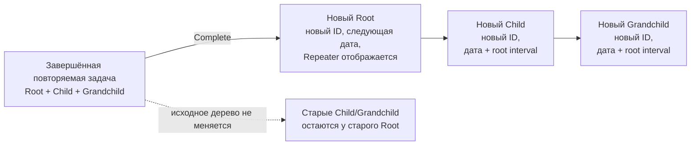

# Сохранение повторения и клонирование поддерева для следующего экземпляра задачи

## 0. Метаданные
- Тип (профиль): domain/UI bugfix; `dotnet-desktop-client` + `ui-automation-testing`, context `testing-dotnet`.
- Владелец: пользователь; реализация, тестирование и self-review — Codex.
- Масштаб: medium; изменение доменного генератора следующего экземпляра и его regression/UI coverage.
- Целевое семейство / behavior baseline: GPT-5.6; немодельная задача.
- Поверхность: Codex desktop, Windows, PowerShell; приложение Unlimotion Desktop.
- Effective runtime: текущая Codex-сессия; точный model ID/effort не влияет на runtime приложения. .NET SDK 10.0.400 — repository-proven baseline.
- Eval baseline / evidence: не применимо к моделям; нужны characterization red, domain/file-backed/Headless UI green и полные suites.
- Целевой релиз / ветка: `fix/repeater-requires-start-date`, PR #287; base `edf83000` (`origin/main`, PR #288), текущий HEAD `46af8611`.
- Ограничения: до точной фразы «Спеку подтверждаю» разрешено менять только этот файл; `src/Tasks/` не читать сверх маскированной диагностики, не изменять, не удалять и не включать в Git.
- Связанные ссылки: PR #287; PR #288; `specs/2026-08-31-repeater-completion-without-start-date.md`; canonical status lifecycle spec `specs/2026-08-31-status-transition-latency.md`.

## 1. Overview / Цель
Следующий экземпляр повторяемой задачи должен оставаться повторяемым и представлять новый независимый экземпляр всего её рабочего поддерева, а не ссылаться на подзадачи завершённого экземпляра.

Outcome contract:
- Success means: после завершения повторяемой задачи новая корневая задача содержит эквивалентную независимую настройку `Repeater`, а каждая достижимая через `ContainsTasks` подзадача создана заново с новым ID и связана только с соответствующими копиями внутри нового дерева.
- Итоговый артефакт / output: минимальное изменение `TaskTreeManager`, domain/file-backed/Headless UI tests, актуализированные spec/PR evidence.
- Stop rules: SPEC заканчивается approval gate. EXEC заканчивается только после expected-red, исправления, targeted/full tests, UI evidence и post-EXEC review. Не менять пользовательские данные и не merge/release.

## 2. Текущее состояние (AS-IS)
- `TaskTreeManager.HandleTaskStatusChange` при завершении создаёт только один новый `TaskItem`.
- В manager поле `Repeater` сначала присваивается как `clone.Repeater = task.Repeater`, но `FileTaskStorage.SaveCore` сохраняет `TaskItemSnapshot.Clone`, который уже независимо копирует `Repeater`, `Pattern` и extension data.
- `ContainsTasks`, `BlocksTasks` и `BlockedByTasks` копируются как списки старых ID.
- Для `ContainsTasks` выполняется `CreateParentChildRelation(clone, child)`, поэтому новый экземпляр корневой задачи получает тех же детей, что завершённая задача. Новые дочерние `TaskItem` не создаются.
- Встроенный ручной `CloneTask` также клонирует только один узел и привязывает его к существующим детям; использовать его как готовое deep-clone решение нельзя.
- PR #288 гарантирует flush editor fields до смены статуса. File-backed и Headless тесты уже проверяют `next.Repeater.Type == Daily`, поэтому persisted loss на текущем HEAD пока не воспроизведён.
- `MainControl.axaml` связывает первый шаблонный `ComboBox` как `ItemsSource="{Binding Repeaters}"` и `SelectedItem="{Binding Repeater}"`. `Repeaters` каждый раз создаёт новые `RepeaterPatternViewModel`, а hydrated `Repeater` является другим instance; у класса нет value equality. Поэтому persisted repeater может существовать и показывать маркер/детальные controls, но сам template selector визуально оставаться без выбранного элемента. Это сильная гипотеза, а не подтверждённая формулировка пользовательского симптома.
- Текущий `TaskStatusTransitionTests.HandleTaskStatusChange_CompletedTaskWithRepeater_CreatesPreparedClone` прямо утверждает старое поведение: `clonedTask.ContainsTasks` эквивалентен списку старых child ID.
- Маскированная локальная диагностика `src/Tasks/` содержит только старую запись предыдущего сбоя и не даёт evidence для двух новых сценариев; пользовательское сообщение считается authoritative reproduction report.

## 3. Проблема
Новый occurrence не является полной и однозначно отображаемой копией рабочего шаблона: UI может не сопоставить persisted repeater с template selector, а доменный генератор повторно использует старые дочерние связи вместо создания нового поддерева.

## 4. Цели дизайна
- Отображать hydrated `Repeater` в template selector по значению, а не по reference identity; persisted snapshot contract сохранить и усилить тестом.
- Клонировать containment closure рекурсивно и детерминированно.
- Сохранять симметрию `ContainsTasks` / `ParentTasks` без ссылок нового дерева на старые дочерние ID.
- Сохранить DAG: один исходный узел, достижимый несколькими путями, клонируется один раз.
- Сдвигать плановые даты всего нового поддерева на интервал корневого повторения.
- Не дублировать алгоритм вычисления следующей даты и не переносить генерацию в ViewModel/UI.
- Выполнять preflight исходного поддерева до первой записи, чтобы missing/cycle/duplicate/invalid graph не давал заведомо неполную копию.

## 5. Non-Goals (чего НЕ делаем)
- Не меняем правило обязательной даты начала и алгоритм `RepeaterPatternExtensions.GetNextOccurrence`.
- Не меняем видимость секции повторения, layout, тексты и элементы управления.
- Не меняем ручную команду `CloneTask`, drag/drop clone или clipboard outline.
- Не клонируем внешних родителей и не превращаем `BlocksTasks` / `BlockedByTasks` в containment-поддерево.
- Не мигрируем уже созданные некорректные экземпляры и не редактируем `src/Tasks/`.
- Не меняем формат JSON, API/CLI/server contract, release/version/changelog.
- Не копируем статус, даты завершения/архива и status history как историю нового экземпляра.

## 6. Предлагаемое решение (TO-BE)
### 6.1 Распределение ответственности
- `TaskTreeManager.HandleTaskStatusChange` — вызывает единый helper создания следующего occurrence внутри существующего mutation lock.
- `TaskGraphValidationReport` / `TaskAvailabilityService` — command-level containment-cycle validation вместе с existing missing/self/duplicate relation checks; invalid graph получает `ValidationFailed` до вызова manager mutation.
- Новый private helper в `TaskTreeManager` — загружает уже валидный containment closure, строит source-ID -> clone mapping, remap связей, сохраняет узлы и пересчитывает availability.
- `TaskItemViewModel`/`MainControl` — stable value-based состояние выбранного repeater template после hydration. Пользователь подтвердил, что у созданной задачи именно не указан шаблон повторения; persisted type/period остаются отдельными полями.
- `TaskItemSnapshot.Clone` или локальный узкий helper — переиспользуется для независимой копии mutable nested values; для completion criteria создаётся отдельный fresh-occurrence helper с reset.
- Existing `Storage`, relation helpers и availability service — persistence, обратные связи внешних blocking relations и нормализация статусов.
- `TaskStatusTransitionTests`, `FileStorageTaskStatusTests`, `MainControlTaskStatusIconUiTests` — domain, persisted и user-visible regression evidence.

### 6.2 Детальный дизайн
1. UI-path: `TaskItemViewModel` хранит одну cached read-only collection шаблонов и отдельный `SelectedRepeaterTemplate` из этой же collection; `MainControl` bind `SelectedItem` к этому свойству. Matching key:
   - `None`, `Daily`, `Monthly`, `Yearly` — по `Repeater.Type`;
   - `WeeklyWorkDays` — только если type Weekly и pattern точно равен `{0,1,2,3,4}` без weekend/extra values;
   - любой другой Weekly, включая pattern с Saturday/Sunday, — generic `Weekly`.
   Setter применяет independent copy выбранного template только при реальном выборе пользователя; getter после hydration возвращает instance из cached collection и не сбрасывает persisted `Period`, `AfterComplete` или custom weekdays при простом открытии карточки. Изменение `Repeater` уведомляет `SelectedRepeaterTemplate`.
2. После допустимого перехода root в `Completed` вычислить `nextRootBegin` существующим `GetNextOccurrence` и `dateOffset = nextRootBegin - sourceRoot.PlannedBeginDateTime`.
3. Command-level validation до manager mutation отклоняет missing/duplicate/self containment relations и любой containment cycle через `TaskGraphValidationReport`, возвращая `ValidationFailed`.
4. После успешной validation до первой записи обойти `ContainsTasks` от source root:
   - загрузить каждый ID один раз;
   - сохранить детерминированный порядок обхода;
   - defensive guard повторно прекращает operation при расхождении с validated graph, но не является источником `ValidationFailed` contract;
   - DAG с несколькими внутренними родителями разрешить.
5. Для каждого узла построить новый `TaskItem` с новым ID и независимыми mutable values. Template-поля: `Title`, `Description`, `PlannedDuration`, `Wanted`, `Importance`, `Repeater`. Completion criteria получают новые ID, прежний text/extension data и `IsSatisfied=false`.
6. Для root начало установить точно в `nextRootBegin`; конец root сохранить через прежнюю длительность между begin/end. Planned begin/end каждого descendant сдвинуть на `dateOffset`; null остаётся null.
7. Внутренние containment связи remap на clone IDs:
   - `clone.ContainsTasks` содержит только копии внутренних детей;
   - `clone.ParentTasks` содержит только копии родителей, достижимых внутри closure;
   - root не наследует внешние `ParentTasks`.
8. Для узла, достижимого от двух родителей, создать один clone и связать его с обоими cloned parents.
9. Blocking relations:
   - если обе стороны входят в closure, remap ID на соответствующий clone;
   - внешние `BlocksTasks` / `BlockedByTasks` не переносить на clones и не изменять reverse links внешних задач;
   - внешние containment parents не копировать.
10. `Repeater` каждого нового узла — independent persisted snapshot через существующий `TaskItemSnapshot` contract. Очистка/изменение повторения у исходного или нового экземпляра после операции не влияет на другой.
11. Fresh lifecycle задаётся явно:
   - root: новый ID/version/created time, `Status=Prepared`, одна fresh `Prepared` history entry, completed/archive timestamps null;
   - descendants: новый ID/version/created time, `Status=NotReady`, одна fresh `NotReady` history entry, completed/archive timestamps null;
   - все completion criteria независимы, имеют новые ID и `IsSatisfied=false`;
   - `IsCanBeCompleted` и `UnlockedDateTime` пересчитываются existing availability service; leaf, middle/root, future date и blocker cases покрываются отдельно;
   - `UpdatedDateTime` задаётся штатным save/recalculation path и не копируется из source.
12. Сохранить все новые узлы внутри текущего mutation lock; вернуть их в `ChangedTasks`, чтобы Unified cache/UI получил всё новое дерево за одну команду. По решению 3A collections внешних relations не меняются и clone links в них не добавляются; существующий availability/unlock-пересчёт внешней задачи после завершения source сохраняется и может включить её в `ChangedTasks`.
13. Command-level validation failure гарантирует ноль clone writes, source root остаётся в исходном authoritative status, `ChangedTasks` пуст, command возвращает `ValidationFailed`. Mid-write I/O failure не объявляется атомарным: допускается partial persistence, command возвращает `OutcomeUnknown`, а reconciliation/read-back должен показать фактическое authoritative состояние. Batch transaction не входит в эту spec.

Нефункциональные требования:
- Сложность обхода O(V+E) по containment closure; каждый исходный узел загружается не более одного раза.
- Не использовать рекурсивный вызов без защиты глубины; предпочтителен явный stack/queue, чтобы глубокое дерево не переполнило call stack.
- Все коллекции и nested records копируются независимо.

Visual planning artifact — state storyboard, layout не меняется:



UI video evidence: production layout/interaction не меняются, но итог виден в дереве и карточке. На EXEC нужен автоматизированный Headless flow; MP4 применим только если существующий безопасный window-focused recorder может стабильно показать выбор статуса и новое дерево. Если нет, fallback: expected-red/green Headless assertions, file-backed JSON read-back и безопасные HWND screenshots/structured test artifact с объяснением.

### 6.3 User-Observable Scenarios
| Scenario | User action / trigger | Expected visible result / output | Evidence required | Covered by AC |
| --- | --- | --- | --- | --- |
| S1 Повторение отображается | Завершить daily-задачу, выбрать новый экземпляр и открыть карточку | Новый экземпляр показывает ↻; template selector, period, after-complete и pattern соответствуют source до и после reload | Real `MainControl` Headless UI + file read-back | AC1, AC2 |
| S2 Прямые подзадачи | Завершить root с двумя детьми | У нового root две новые подзадачи с новыми ID; старые дети остаются у старого root | Domain + file-backed + Headless tree | AC3, AC5 |
| S3 Глубокое дерево | Завершить root -> child -> grandchild | Клонируются все уровни и внутренние связи указывают на копии | Domain/file-backed graph assertions | AC3, AC4 |
| S4 Общий потомок DAG | Два внутренних родителя содержат одного child | Создан один child clone с двумя cloned parents | Domain test | AC4 |
| S5 Изменение после клонирования | Очистить repeat/date у одного экземпляра | Другой экземпляр и его pattern не меняются | Persistence/aliasing regression | AC2 |
| S6 Некорректное дерево | Завершить root с missing/duplicate/cycle child | Clone writes отсутствуют; source root не завершён | Command-level validation test | AC6 |
| S7 Сбой записи | Storage падает после части saves | Result `OutcomeUnknown`; read-back честно показывает partial authoritative state для reconciliation | Fault-injection test | AC7 |

### 6.4 State / Interaction Matrix
| Current state | Trigger | Expected transition/result | Empty/error/disabled/concurrent case | Notes |
| --- | --- | --- | --- | --- |
| Repeat root без детей | Complete | Один новый root с independent repeater | Нет `ContainsTasks` — прежний простой путь | Backward compatible |
| Repeat root с containment tree | Complete | Новое полное дерево | Missing/duplicate/cycle -> `ValidationFailed` before clone writes | AC3/AC6 |
| Shared descendant DAG | Complete | Один clone, несколько cloned parents | Повтор ID в одной relation collection invalid; DAG paths не считаются duplicate | Mapping by source ID |
| Descendant с датами | Complete | Begin/end сдвинуты на root occurrence offset | null остаётся null | Решение пользователя 2A |
| Descendant с external parent | Complete | External parent не получает clone | Внутренние parents remap | Scope containment closure |
| Internal/external blocker | Complete | Internal remap; external relation не переносится | Missing internal relation invalid | Решение пользователя 3A |
| Concurrent status/save | Complete сразу после ввода | PR #288 flush + одна mutation | Failure возвращается existing result | Не ослаблять lifecycle fix |

### 6.5 Decision Ledger
| Decision | Owner | Default / chosen option | Confidence | Risk if assumed | Needs user before EXEC |
| --- | --- | --- | ---: | --- | --- |
| Глубина клонирования | user intent interpreted by agent | Всё достижимое поддерево, не только прямые дети | 0.95 | Прямой-only clone оставит смешанное дерево | Нет |
| Что именно «отсутствует» в повторении | user | У созданной задачи не указан шаблон повторения; исправить value state template selector | 1.00 | Неверный UI-path оставил бы симптом | Нет, получен ответ 1 |
| Даты потомков | user | Сдвигать begin/end на root occurrence offset | 1.00 | Другие варианты materially меняли бы расписание | Нет, выбран 2A |
| Shared descendant | agent/domain invariant | Клонировать один раз, сохранить DAG | 0.98 | Дублирование одной логической подзадачи | Нет |
| External containment parents | agent | Не копировать | 0.90 | Иначе occurrence появится в чужом старом дереве | Нет |
| External blocking relations | user | Не переносить; сохранять только internal remap | 1.00 | Перенос повторно блокировал бы сторонние задачи | Нет, выбран 3A |
| Invalid closure | agent/safety | ValidationFailed до first clone write | 0.95 | Частичный новый occurrence | Нет |
| Mid-write storage failure | existing command contract | `OutcomeUnknown`, partial persistence возможно, затем reconciliation | 0.95 | Ложное обещание atomicity | Нет |
| Existing generated bad tasks | user scope | Не мигрировать | 0.98 | Старые записи останутся как есть | Нет |

### 6.6 Runtime / Config / Data Contract Matrix
| Contract area | Current source of truth | Expected change | Compatibility / migration | Verification |
| --- | --- | --- | --- | --- |
| Repeat calculation | `RepeaterPatternExtensions` | Без изменений | Полная совместимость | Existing recurrence tests |
| Containment graph | `ContainsTasks`/`ParentTasks` + relation helpers | Новые IDs и symmetric remap | JSON schema без изменений | Graph assertions + read-back |
| Repeater persistence | `TaskItem.Repeater` JSON | Independent equal snapshot | Schema без изменений | Reference/mutation + file test |
| Status lifecycle | `TaskGraphCommandService`/`TaskTreeManager` | ChangedTasks включает subtree | API type без изменений | Unified/Headless test |
| User data | File storage | Только будущие operations | Миграции нет | Temp directories only |

## 7. Бизнес-правила / Алгоритмы
1. Следующий occurrence создаётся только для active repeater и заполненного root planned begin — существующее правило.
2. Новый occurrence содержит весь containment closure source root на момент status command после editor flush.
3. Каждому уникальному source ID соответствует ровно один новый clone ID.
4. В новом containment closure не остаётся старых child IDs.
5. Новый root сохраняет independent persisted repeater и отображает его template/type/period/after-complete/pattern после выбора карточки и reload.
6. Root planned dates переходят на следующий occurrence; begin/end каждого descendant сдвигаются на тот же root occurrence offset; null остаётся null.
7. Root создаётся `Prepared`; descendants — `NotReady`; history/timestamps fresh, completion criteria reset в false с новыми IDs; availability fields пересчитываются.
8. Source tree и его relations не изменяются, кроме штатного завершения source root.
9. Невозможность полностью прочитать/валидировать containment closure до записи даёт `ValidationFailed`, ноль clone writes и не завершает source root.
10. Mid-write I/O failure допускает partial persistence и возвращает `OutcomeUnknown`; атомарность всего дерева не обещается.

## 8. Точки интеграции и триггеры
- Триггер: успешный переход repeat root в `Completed` через любой storage adapter/UI/Telegram path, который использует `TaskGraphCommandService` и `TaskTreeManager`.
- Вызов нового helper — только из repeater-ветки `HandleTaskStatusChange`.
- Unified cache получает весь returned changed set; отдельный UI refresh не добавляется.
- Recalculation: после materialization связей выполнить availability bottom-up/до стабильного результата существующим сервисом.

## 9. Изменения модели данных / состояния
- Новых полей, таблиц и JSON schema нет.
- Создаётся N новых task records вместо одной, где N — число уникальных узлов containment closure.
- Mutable nested data каждого clone независимо.
- Старые children больше не получают нового parent ID только из-за repeat occurrence.

## 10. Миграция / Rollout / Rollback
- Миграция не требуется; поведение действует для будущих завершений после обновления.
- Старые occurrences с потерянным repeater или shared old children автоматически не исправляются.
- Rollback: revert implementation commit; schema/data migration отсутствует.
- При откате уже созданные корректные деревья остаются валидными обычными задачами.

## 11. Тестирование и критерии приёмки
Acceptance Criteria:
- AC1: persisted next root содержит тот же `Repeater` type/period/pattern/after-complete flags, что source на момент completion; после выбора next root в реальном `MainControl` template selector и детальные controls отображают эти значения до и после file-storage reload. Отдельно проверены Daily, exact WorkDays `{0..4}` и custom Weekly с weekend, который не должен отображаться как WorkDays.
- AC2: source и clone repeaters/nested patterns не alias; изменение одного после операции не меняет другой.
- AC3: прямые дети и все потомки клонируются с новыми уникальными ID; старое дерево не получает новых внутренних связей.
- AC4: все новые `ContainsTasks`/`ParentTasks` symmetric; DAG descendant cloned once; internal blocking IDs remapped; external containment/blocking links отсутствуют у clones и reverse links внешних задач не изменены.
- AC5: root planned dates переходят на следующий occurrence; begin/end descendants сдвинуты на тот же offset, null остаётся null. Root/descendant statuses, fresh history/timestamps, reset criteria, `IsCanBeCompleted` и `UnlockedDateTime` соответствуют разделу 6.2 для leaf/middle/root, future date и blocker cases.
- AC6: missing/duplicate/cycle/self-reference command-level validation возвращает `ValidationFailed`, `ChangedTasks` пуст, source остаётся в прежнем authoritative status, clone save count равен нулю.
- AC7: fault injection после части saves возвращает `OutcomeUnknown`; read-back/reconciliation подтверждает фактически сохранённые records без ложного rollback claim.
- AC8: реальный `TaskStatusPicker` flow после мгновенного редактирования открывает next root в `MainControl`, проверяет repeater controls и cloned child wrappers/IDs, затем повторяет после reload.
- AC9: existing no-child recurrence, status lifecycle, availability, Unified ordering и PR #287 start-date UI regressions остаются зелёными.

План тестов:
- Expected-red domain tests в `TaskStatusTransitionTests`: direct/deep subtree, DAG, chosen date/blocking policy, lifecycle/reset criteria, source unchanged, invalid closure.
- File-backed regression в `FileStorageTaskStatusTests`: immediate editor fields + root/child/grandchild persisted JSON read-back после status command.
- Headless UI regressions в `MainControlTaskStatusIconUiTests` и `MainControlRepeaterStartDateUiTests`: реальный click status picker создаёт next root и cloned child wrappers/IDs; real `MainControl` проверяет `CurrentTaskRepeaterSelector`, pattern type, period, after-complete/weekday flags и повторную hydration из заново инициализированного file-backed repository. Cases: Daily, exact WorkDays и custom Weekly with weekend. Expected-red должен падать по фактическому пустому/неверному control state, не по `ReferenceEquals`.
- Existing targeted suites: `TaskStatusTransitionTests`, `FileStorageTaskStatusTests`, `TaskGraphCommandServiceTests`, `MainControlTaskStatusIconUiTests`, `TaskItemRepeaterStartDateTests`.
- Full `Unlimotion.Test` и `Unlimotion.UiTests.Headless`; focused FlaUI/window evidence, если UI tree flow стабилен и безопасен.

Acceptance-to-Test Matrix:
| Acceptance criterion | Automated test | Manual / visual / log check | Evidence artifact | If not tested, why |
| --- | --- | --- | --- | --- |
| AC1/AC2 | Domain + file-backed equality/NotSame/mutation | Проверить persisted JSON без пользовательских данных | targeted log/TRX | — |
| AC3/AC4 | Deep tree + DAG + external relation assertions | Structured ID mapping/reverse-link summary | targeted log | — |
| AC5 | Leaf/middle/root lifecycle, criteria, date/future/blocker assertions | Проверить visible planned dates/status в Headless state | targeted log | — |
| AC6 | Command-level malformed graph tests | DeniedKind/source status/save-count evidence | targeted log | — |
| AC7 | Mid-write fault/reconciliation test | OutcomeUnknown + authoritative read-back | targeted log | — |
| AC8 | Real MainControl/TaskStatusPicker + reload | Safe screenshot/video fallback | UI test artifact | — |
| AC9 | Build + targeted + full Main/Headless | CI checks после push | logs + PR checks | — |

Repository-proven commands на EXEC:
```powershell
dotnet --info
dotnet build src/Unlimotion.Desktop/Unlimotion.Desktop.csproj -c Debug -p:UseSharedCompilation=false
dotnet test --project src/Unlimotion.Test/Unlimotion.Test.csproj -c Debug -- --treenode-filter '/*/*/TaskStatusTransitionTests/*' --maximum-parallel-tests 1 --output Detailed
dotnet test --project src/Unlimotion.Test/Unlimotion.Test.csproj -c Debug -- --treenode-filter '/*/*/FileStorageTaskStatusTests/*' --maximum-parallel-tests 1 --output Detailed
dotnet test --project src/Unlimotion.Test/Unlimotion.Test.csproj -c Debug -- --treenode-filter '/*/*/MainControlTaskStatusIconUiTests/*' --maximum-parallel-tests 1 --output Detailed
dotnet test --project src/Unlimotion.Test/Unlimotion.Test.csproj -c Debug -- --treenode-filter '/*/*/MainControlRepeaterStartDateUiTests/*' --maximum-parallel-tests 1 --output Detailed
dotnet test --project src/Unlimotion.Test/Unlimotion.Test.csproj -c Debug -- --maximum-parallel-tests 1 --output Detailed
dotnet test --project tests/Unlimotion.UiTests.Headless/Unlimotion.UiTests.Headless.csproj -c Debug -- --maximum-parallel-tests 1 --output Detailed
git diff --check
```

Test stop rules:
- UI expected-red обязан падать по control state реального выбранного next root/reload; domain expected-red — по отсутствию deep clones, не по setup/environment или `ReferenceEquals`.
- Partial write запрещена только для validation/preflight failure. Для mid-write I/O failure ожидаются `OutcomeUnknown` и truthful reconciliation.
- Любая lost relation, duplicate clone или stale old-child ID в успешной операции — блокирующая regression.
- Full suites запускаются после targeted green и review fixes; ненулевой test count обязателен.
- UI evidence не заменяет persisted graph assertions.
- Ожидаемая длительность: targeted 1–5 минут каждый; full Main примерно 20–25 минут; full Headless примерно 2–4 минуты. Длинные прогоны пишут detailed log/TRX и сообщают progress не реже раза в минуту.

## 12. Риски и edge cases
- Deep tree/DAG может вызвать дублирование или бесконечный обход — mapping + visiting/visited sets.
- Один child с двумя внутренними parents — clone once, обе reverse relations.
- External parent у descendant — не включать в new containment graph.
- Internal blocking relation — remap обеих сторон; external blockers/blocked tasks не переносятся и не получают reverse links на clones.
- Child со своим repeater — независимая копия сохраняется как template field; его future completion остаётся обычным recurrence behavior.
- Child begin/end сдвигаются на root occurrence offset; null остаётся null.
- Missing/dangling child — preflight failure до materialization.
- Storage failure во время batch save — существующее storage не даёт общей транзакции; минимизировать риск полным preflight и deterministic order, а post-write failure reconciliation оставить существующему command/storage lifecycle. Это residual risk, проверяемый fault-injection test.
- Большое дерево увеличивает число записей и UI updates — O(V+E), ChangedTasks deduplicated.

### Expected User Review Objections
| Likely objection | Why likely | Mitigation in spec/code plan | Status |
| --- | --- | --- | --- |
| «Повторение опять визуально пропало» | Предыдущий баг воспроизводился через UI | Headless status picker + persisted read-back + independent snapshot | mitigated |
| «Скопировались старые подзадачи, а не новые» | Текущее поведение именно такое | Assertions новых ID на всех уровнях и отсутствие old IDs | mitigated |
| «Скопировались только прямые дети» | Простая реализация может остановиться на одном уровне | Closure traversal + grandchild/DAG tests | mitigated |
| «У подзадач неверные даты» | Schedule policy могла быть неоднозначна | Пользователь выбрал shift root offset; закрепить begin/end/null tests | mitigated |
| «Общая подзадача продублировалась» | Модель допускает multiple parents | One source-ID -> one clone-ID mapping | mitigated |
| «Новые подзадачи снова заблокировали сторонние задачи» | External blocking policy materially меняет graph | Пользователь выбрал не переносить; проверить отсутствие reverse links | mitigated |
| «При validation error появилось полдерева» | Ошибка известна до writes | Preflight + zero-save command test | mitigated |
| «При I/O error появилось полдерева» | File storage не batch-транзакционный | OutcomeUnknown + reconciliation, без ложного atomic claim | accepted-risk |

### Rework Prevention Checklist
- User-visible result описан в S1–S7 и storyboard.
- Каждый сценарий имеет automated/persisted/UI evidence.
- Agent-owned и три user-owned решения перечислены в Decision Ledger; все ответы получены.
- Вероятные возражения покрыты tests/design.
- Применимы domain, UX, tester, architect и delivery-review роли.
- AC являются проверками результата.
- EXEC имеет red/green/full/UI путь доказательства.

## 13. План выполнения
1. Добавить expected-red tests для independent repeater и containment subtree semantics.
2. Выделить private occurrence-clone helper и preflight closure traversal внутри `TaskTreeManager` mutation lock.
3. Реализовать value-based repeater selection, ID mapping, единый date offset и только internal relation remap.
4. Нормализовать availability/status и returned ChangedTasks.
5. Добавить file-backed и Headless UI regression.
6. Запустить targeted tests, full suites и доступное safe UI evidence.
7. Выполнить post-EXEC review, исправить findings, повторить затронутые проверки.
8. После зелёного результата обновить тот же PR #287 и дождаться CI; merge/release не выполнять.

## 14. Открытые вопросы
Блокирующих вопросов нет. Пользователь решил:
1. Дефект повторения — у созданной задачи не указан шаблон повторения; исправляется value-based state первого selector.
2. Planned begin/end descendants сдвигаются на root occurrence offset (вариант 2A).
3. Внешние `BlocksTasks`/`BlockedByTasks` не переносятся; клонируются/remap только внутренние связи (вариант 3A).

Под «подзадачами» понимается всё рекурсивное containment-поддерево.

## 15. Соответствие профилю
- Профиль: `dotnet-desktop-client` + `ui-automation-testing`, context `testing-dotnet`.
- Выполненные требования: SPEC-first, UI-facing scenarios, storyboard, Headless coverage, persisted state evidence, TUnit `--treenode-filter`, full suites, video/fallback contract, post-SPEC/post-EXEC review.

## 16. Таблица изменений файлов
| Файл | Изменения | Причина |
| --- | --- | --- |
| `src/Unlimotion.TaskTreeManager/TaskTreeManager.cs` | occurrence subtree preflight/clone/remap | Основной bugfix |
| `src/Unlimotion.TaskTreeManager/TaskAvailabilityService.cs` | containment-cycle validation issue | Command-level zero-write contract |
| `src/Unlimotion.TaskTreeManager/TaskAvailabilityAnalyzer.cs` | новый тип containment-cycle issue | `ValidationFailed` evidence |
| `src/Unlimotion.ViewModel/TaskItemViewModel.cs` | value-based selected repeater template contract | Отображение hydrated repeat setting |
| `src/Unlimotion.ViewModel/RepeaterPatternViewModel.cs` | exact WorkDays означает только Monday-Friday | Стабильное сопоставление шаблона |
| `src/Unlimotion/Views/MainControl.axaml` | binding selector, если нужен для value contract | Реальный UI symptom пункта 1 |
| `src/Unlimotion.Test/TaskStatusTransitionTests.cs` | domain tree/repeater/date/failure regressions | AC1–AC6 |
| `src/Unlimotion.Test/TaskItemRepeaterStartDateTests.cs` | stable templates, value selection и isolation | AC1/AC2 |
| `src/Unlimotion.Test/TaskAvailabilityParityTests.cs` | cycle/duplicate validation | AC6 validator contract |
| `src/Unlimotion.Test/TaskGraphCommandServiceTests.cs` | command-level cycle returns ValidationFailed/zero writes | AC6 end-to-end contract |
| `src/Unlimotion.Test/UnlimotionCliIntegrationTests.cs` | CLI completion возвращает независимый occurrence subtree | CLI end-to-end regression |
| `src/Unlimotion.Test/FileStorageTaskStatusTests.cs` | file-backed read-back | AC1–AC5/AC7 |
| `src/Unlimotion.Test/MainControlRepeaterStartDateUiTests.cs` | Real MainControl repeater controls/status picker/reload | AC1/AC8/AC9 |
| `src/Unlimotion.Test/MainControlTaskStatusIconUiTests.cs` | Реальный click status picker и cloned child wrappers | AC3/AC8/AC9 |
| `specs/2026-09-01-repeat-occurrence-subtree-clone.md` | evidence и review journal | QUEST contract |

Дополнительный production/test файл допустим только если review покажет, что отдельный internal helper существенно уменьшает риск; public API не добавлять.

## 17. Таблица соответствий (было -> стало)
| Область | Было | Стало |
| --- | --- | --- |
| Repeater UI | Persisted repeater есть, но hydrated instance не входит в новый `Repeaters` list | Cached templates + value-key selected template |
| Repeater persistence | Storage deep snapshot уже существует | Contract сохраняется и покрывается reload/mutation tests |
| Подзадачи | Старые child IDs прикрепляются к новому root | Новые IDs всего containment closure |
| Глубина | Только root | Root + все descendants |
| DAG | Не применимо к clone | Один clone на source ID, несколько cloned parents |
| Даты descendants | Старые задачи переиспользуются | Новые даты с единым occurrence offset |
| Invalid closure | Частичное skipping возможно | Preflight fail до clone writes |
| UI | Может показать старых children/неподтверждённый repeat | Новый root с ↻ и новым поддеревом |

## 18. Альтернативы и компромиссы
- Только добавить assertion/копию `Repeater`: закрывает пункт 1, но оставляет старые children; отклонено.
- Клонировать только прямых детей: дешевле, но смешивает новые и старые уровни; отклонено.
- Вызывать существующий `CloneTask` рекурсивно: он прикрепляет существующих детей и external relations до построения mapping, что затрудняет DAG/remap и partial-failure control; отклонено.
- Сериализовать всё дерево в JSON и заменить ID: просто на вид, но обходит domain relation/availability helpers и повышает риск скрытых полей; отклонено.
- Выбран двухфазный graph clone: preflight + materialization по mapping. Он лучше сохраняет инварианты и тестируется без нового public API.

## 19. Результат quality gate и review
### SPEC Linter Result
| Блок | Пункты | Статус | Комментарий |
|---|---|---|---|
| A. Полнота спеки | 1-5 | PASS | Цель, AS-IS, границы, files и lifecycle зафиксированы |
| B. Качество дизайна | 6-10 | PASS | Closure/mapping/lifecycle, date offset и internal-only relation policy определены |
| C. Безопасность изменений | 11-13 | PASS | Нет schema migration/user data; preflight и rollback |
| D. Проверяемость | 14-16 | PASS | Domain/file/UI/full tests и stop rules |
| E. Готовность к автономной реализации | 17-19 | PASS | User-owned решения получены; план и tests конкретны |
| F. Соответствие профилю | 20 | PASS | UI tests, storyboard и evidence fallback |

Итог: ГОТОВО после re-review и пользовательского approval.

### SPEC Rubric Result
| Критерий | Балл (0/2/5) | Обоснование |
|---|---:|---|
| 1. Ясность цели и границ | 5 | Два дефекта сведены к одному occurrence-template контракту |
| 2. Понимание текущего состояния | 5 | Прослежены status handler, clone path, relations и текущие tests |
| 3. Конкретность целевого дизайна | 5 | Двухфазный clone, ID map, date offset и internal-only relations конкретны |
| 4. Безопасность | 5 | Preflight, no migration, rollback, residual mid-write risk |
| 5. Тестируемость | 5 | AC-to-test + UI/persisted evidence |
| 6. Готовность к автономной реализации | 5 | Все продуктовые решения закрыты |

Итоговый балл: 30 / 30. Зона: готово к автономному выполнению после re-review и approval.

### Role-Based Review Result
| Role | Applicability | Review question | Verdict | Required spec changes |
| --- | --- | --- | --- | --- |
| Business analyst / domain workflow | applicable | Новый occurrence является независимым повтором всего рабочего дерева? | PASS | Recursive closure, shifted dates, internal-only relations и fresh lifecycle |
| UX / designer | applicable | Исправляется ли наблюдаемый пустой template selector? | PASS | Value-based selection + real MainControl/reload test |
| Tester / validation | applicable | Все ID/date/relation/failure cases проверяемы? | PASS | AC1–AC9 и matrices после выбора policies |
| Developer / architect | applicable | DAG/remap/lifecycle/failure semantics coherent? | PASS | Mapping, exact fresh state, preflight vs OutcomeUnknown разделены |
| Delivery / operations / security | applicable | PR/user-data/rollback/CI boundaries ясны? | PASS | Same PR after EXEC, no merge/release/user data |

### Post-SPEC Review
- Статус: PASS.
- Scope reviewed: эта spec; central QUEST/testing/profile stack; локальный UI override; `TaskTreeManager.HandleTaskStatusChange`, `CloneTask`, relation/availability helpers; `TaskItemSnapshot`, `TaskGraphCommandService`; `TaskItemViewModel.Repeaters`; `MainControl` repeater bindings; current status/repeater/file/UI tests; Git status и masked `src/Tasks/` summary.
- Decision: однозначные findings исправлены, пользовательские решения встроены, финальный adversarial re-review вернул PASS; можно запрашивать approval.
- Review passes:
  - Scope/Evidence pass: добавлены реальный `MainControl` selector path и command/storage failure contracts; PR #288 lifecycle не дублируется.
  - Contract pass: S1–S7 соответствуют AC1–AC9; validation failure отделён от mid-write failure.
  - Adversarial risk pass: проверены UI identity mismatch, DAG/cycle/duplicate/dangling child, exact lifecycle/criteria reset, external parents/blockers, deep tree и OutcomeUnknown.
  - Role-Based pass: после ответов пользователя все роли PASS.
  - Fix and re-review: исправлены diagnosis, lifecycle, atomicity, UI/external coverage, build contract и duplicate semantics; повторно сверены sections 2–12 и AC.
  - Stop decision: PASS; можно запросить точную фразу «Спеку подтверждаю».
- Evidence inspected: `TaskTreeManager` clone/status/relation/availability paths; `TaskItemSnapshot`; `FileTaskStorage.SaveCore` evidence reviewer; `TaskGraphCommandService`; `TaskItemViewModel`, `RepeaterPatternViewModel`, `MainControl` bindings; current TaskStatusTransition/FileStorage/MainControl tests; current branch/base/PR; relevant prior rollout memory.
- Depth checklist:
  - Scope drift / unrelated changes: `src/Tasks/` untracked и исключён; planned production scope — command validation/TaskTreeManager + value-based repeater selection.
  - Acceptance criteria: каждый AC имеет automated evidence.
  - User-observable scenarios / Decision ledger / Expected objections: заполнены.
  - Validation evidence: на SPEC только existing source/tests; red/green относится к EXEC.
  - Unsupported claims: фактическое новое reproduction не найдено в локальных данных и не заявлено как найденное.
  - Regression / edge case: DAG/cycle/date/blocking/availability включены.
  - Comments/docs/changelog: changelog не нужен до release; helper comments только для неочевидных invariants.
  - Hidden contract change: external containment parent исключён; external blocking/date policies оставлены пользователю.
  - Manual-review challenge: наиболее вероятные дефекты — починить не тот repeat symptom, скопировать satisfied criteria, обещать атомарность, shared child cloned twice или накопить external reverse links; все отражены в вопросах/AC.
- Independent-review limitation: reviewer был отдельным agent role и процедурно не менял файлы, но его effective filesystem был unrestricted, поэтому по QUEST результат считается adversarial fallback, а не технически подтверждённым read-only independent review.

| Severity | Area | Finding | Required action | Status |
| --- | --- | --- | --- | --- |
| BLOCKER | diagnosis/UI | Storage/tests уже сохраняют Daily; aliasing не объясняет symptom | Уточнить symptom; real MainControl selector/reload expected-red | fixed: user confirmed missing template selector |
| HIGH | relations | Старый test закрепляет reuse old child IDs | Заменить contract на deep-clone IDs и проверить source unchanged | fixed in spec |
| HIGH | graph | Наивная рекурсия дублирует DAG/зацикливается | Source-ID mapping + visiting/visited + tests | fixed in spec |
| HIGH | lifecycle | Availability не задаёт status; satisfied criteria могли копироваться | Exact root/descendant lifecycle + fresh reset criteria + tests | fixed in spec |
| HIGH | atomicity | Zero-write validation и mid-write failure были смешаны | ValidationFailed/zero writes vs OutcomeUnknown/reconciliation | fixed in spec |
| HIGH | product policy | Dates/external blockers не следуют однозначно из запроса | Запросить два выбора пользователя | fixed: 2A/3A |
| MEDIUM | UI/relation coverage | Маркер/VM не доказывают controls и external policy | Real MainControl + reload; external AC | fixed: user chose 3A |
| MEDIUM | validation | Не было обязательного build/progress contract | Добавить dotnet build/toolchain/durations/logs | fixed in spec |
| LOW | duplicate graph | Spec обещала dedup, command запрещает duplicate relation | Считать duplicate invalid и тестировать command-level | fixed in spec |

- Fixed before continuing: diagnosis no longer claims storage aliasing; added value-based UI hypothesis, exact lifecycle/criteria reset, recursive closure/DAG/remap, duplicate invalidation, split failure semantics, real MainControl/reload coverage and build contract.
- Checks rerun: affected SPEC linter/rubric/contract/adversarial/role passes; финальный reviewer: PASS, BLOCKER/HIGH/MEDIUM отсутствуют.
- Needs human: только approval.
- Residual risks / follow-ups: storage-wide atomic transaction не вводится; mid-write storage failure остаётся ограниченным existing recovery и проверяется fault injection.

## Approval
Получено 02.09.2026 точной фразой пользователя: «Спеку подтверждаю». Разрешён EXEC утверждённого контракта; merge/release не разрешены.

## 20. Журнал действий агента
| Фаза (SPEC/EXEC) | Тип намерения/сценария | Уверенность в решении (0.0-1.0) | Каких данных не хватает | Следующее действие | Нужна ли передача управления/решения человеку | Было ли фактическое обращение к человеку / решение человека | Короткое объяснение выбора | Затронутые артефакты/файлы |
| --- | --- | ---: | --- | --- | --- | --- | --- | --- |
| SPEC | Preflight/instruction routing | 1.00 | Нет | Проследить current generator/tests | Нет | Нет | QUEST + .NET desktop/UI profiles обязательны | Read-only instructions/source |
| SPEC | AS-IS diagnosis | 0.98 | Локального нового reproduction нет | Спроектировать graph clone | Нет | Нет | Root clone reuses old child IDs; current tests cover only shallow repeater type | Read-only source/tests/masked data |
| SPEC | TO-BE и quality gate | 0.92 | Reviewer findings и user-owned policies | Передать spec reviewer | Нет | Нет | Выбран preflight + source-ID mapping; date/blocking policy ещё не была проверена | Только эта spec |
| SPEC | Adversarial reviewer | 0.97 | UI symptom + date/blocking choices | Исправить однозначные findings, задать 3 вопроса | Да | Обращение к пользователю будет следующим сообщением | Reviewer выявил неподтверждённый aliasing diagnosis, lifecycle/atomicity gaps и product decisions | Только эта spec; reviewer read-only procedural fallback |
| SPEC | Решения пользователя | 1.00 | Re-review | Встроить selector symptom, shifted dates, internal-only blockers | Нет | Пользователь: шаблон не указан; 2A; 3A | Все product decisions закрыты | Только эта spec |
| SPEC | Финальный re-review | 1.00 | Approval | Запросить точное подтверждение | Да | Будет запрошено в итоговом сообщении | Command-level cycle validation, duplicate semantics и stable selector contract проверены; reviewer PASS | Только эта spec; procedural read-only fallback |
| EXEC | Approval и preflight | 1.00 | Expected-red evidence | Добавить regression tests до production fix | Нет | Пользователь: «Спеку подтверждаю» | Разрешён утверждённый selector/subtree contract | Эта spec; source/tests далее по плану |
| EXEC | Rebase перед реализацией | 1.00 | Нет | Запустить expected-red tests | Нет | Пользователь: «Сначала сделай ребейз на мейн» | Ветка успешно перебазирована на актуальный `origin/main` `e00ab60c`, конфликтов нет | Git branch; user-owned `src/Tasks/` исключён |
| EXEC | Expected-red | 1.00 | Нет | Реализовать утверждённый контракт | Нет | Нет | Tests зафиксировали отсутствие `SelectedRepeaterTemplate`, `ContainmentCycle` и clone descendants | Затронутые tests |
| EXEC | Реализация selector и occurrence subtree | 0.98 | Full-suite и review evidence | Запустить целевые и полные проверки | Нет | Нет | Stable value selection; preflight closure; source-ID mapping; fresh lifecycle; internal relation remap | Production source и tests из таблицы изменений |
| EXEC | Целевые проверки | 1.00 | Full-suite и post-EXEC review | Запустить полный serial suite | Нет | Нет | Selector/cycle/domain/command/file/UI/status/marker проверки зелёные | `Unlimotion.Test`: 9+4+39+17+22+8+21+3+4 tests |
| EXEC | Полная регрессия | 1.00 | Post-EXEC review | Передать финальный diff reviewer | Нет | Нет | `Unlimotion.Test` 952/952 и Headless 38/38 зелёные; единственный устаревший CLI assertion первого прогона обновлён и полный suite повторно зелёный | Test reports; CLI integration contract |
| EXEC | Solution build audit | 1.00 | Restore assets для незатронутых targets отсутствуют | Не блокировать проверенные desktop/test targets; явно сообщить ограничение | Нет | Нет | `dotnet build src/Unlimotion.sln --no-restore` собрал затронутые проекты, но завершился NETSDK1004 для iOS/Android/Browser/ReadmeMedia/Performance без `project.assets.json` | Build output; production/test projects |
| EXEC | Post-EXEC adversarial review | 1.00 | Acceptance evidence gaps | Усилить UI/lifecycle/persisted tests и уточнить external contract | Нет | Нет | Первый review: production BLOCKER/HIGH нет; MEDIUM gaps исправлены. Re-review: PASS, новых BLOCKER/HIGH/MEDIUM нет | Spec; production diff; UI/domain/file/command tests; procedural fallback reviewer |
| EXEC | Финальная регрессия после review fixes | 1.00 | CI после push | Commit и обновить PR #287 | Нет | Нет | `Unlimotion.Test` 953/953; Headless clean rerun 38/38. Два промежуточных Headless запуска аварийно завершились в existing background UI-thread race `TaskItemViewModel.SynchronizeCollections`, без assertion failures; следующий полный rerun зелёный | HTML test reports; console logs |
